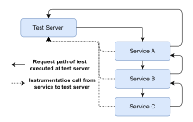
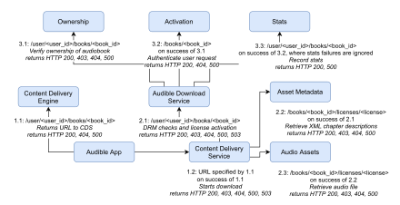
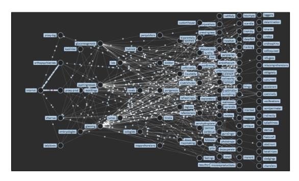

# Service-Level Fault Injection Testing

Christopher S. Meiklejohn Carnegie Mellon University Pittsburgh, PA, United States cmeiklej@cs.cmu.edu

Andrea Estrada Carnegie Mellon University Pittsburgh, PA, United States arestrad@andrew.cmu.edu

Yiwen Song Carnegie Mellon University Pittsburgh, PA, United States yiwenson@andrew.cmu.edu

## Heather Miller Carnegie Mellon University Pittsburgh, PA, United States heather.miller@cs.cmu.edu

Rohan Padhye Carnegie Mellon University Pittsburgh, PA, United States rohanpadhye@cmu.edu

# Abstract

Companies today increasingly rely on microservice architectures to deliver service for their large-scale mobile or web applications. However, not all developers working on these applications are distributed systems engineers and therefore do not anticipate partial failure: where one or more of the dependencies of their service might be unavailable once deployed into production. Therefore, it is paramount that these issues be raised early and often, ideally in a testing environment or before the code ships to production.

In this paper, we present an approach called service-level fault injection testing and a prototype implementation called Filibuster, that can be used to systematically identify resilience issues early in the development of microservice applications. Filibuster combines static analysis and concolicstyle execution with a novel dynamic reduction algorithm to extend existing functional test suites to cover failure scenarios with minimal developer effort. To demonstrate the applicability of our tool, we present a corpus of 4 real-world industrial microservice applications containing bugs. These applications and bugs are taken from publicly available information of chaos engineering experiments run by large companies in production. We then demonstrate how all of these chaos experiments could have been run during development instead, and the bugs they discovered detected long before they ended up in production.

# CCS Concepts: • Computer systems organization→Reliability.

Keywords: fault tolerance, fault injection, verification

Permission to make digital or hard copies of part or all of this work for personal or classroom use is granted without fee provided that copies are not made or distributed for profit or commercial advantage and that copies bear this notice and the full citation on the first page. Copyrights for thirdparty components of this work must be honored. For all other uses, contact the owner/author(s).

SoCC '21, November 1–4, 2021, Seattle, WA, USA © 2021 Copyright held by the owner/author(s). ACM ISBN 978-1-4503-8638-8/21/11. <https://doi.org/10.1145/3472883.3487005>

#### ACM Reference Format:

Christopher S. Meiklejohn, Andrea Estrada, Yiwen Song, Heather Miller, and Rohan Padhye. 2021. Service-Level Fault Injection Testing. In ACM Symposium on Cloud Computing (SoCC '21), November 1–4, 2021, Seattle, WA, USA. ACM, New York, NY, USA, [15](#page-14-0) pages. <https://doi.org/10.1145/3472883.3487005>

# 1 Introduction

Nowadays, large-scale web applications with significant user bases are typically built using a microservice architecture. All companies listed in the Fortune 50 are either hiring for, or have publicly discussed, their use of a microservice architecture to deliver service to their users. The recent popularity of microservice architectures is a direct result of the benefits that this architectural style brings to the organizations that adopt it–smaller teams can focus on individual services written in the best programming language to solve their problem, and are thus able to more rapidly deliver software at scale. However, while microservice architectures help reduce the burden of coordinating changes between teams to the same application, they are known to increase software complexity.

The harsh reality of microservices is that they suddenly force every developer to become a cloud/distributed systems engineer, dealing with the complexity that is inherent in distributed systems [\[38\]](#page-13-0). Specifically, partial failure, where the unavailability of one or more services can adversely impact the system in unknown ways.

This paper presents the service-level fault injection testing (SFIT) technique, as well as Filibuster, a corresponding tool for automatically testing microservice applications for resilience issues related to partial failure. Filibuster can extend an existing functional test suite to cover failure scenarios automatically.

To demonstrate the additional complexity a developer faces when moving from a monolithic architecture to a microservice architecture, consider an application that lets you stream audiobooks. One decomposition [\[43\]](#page-14-1) of this application into components could look like the following, with one component for each user functionality; storage of audio files, storage of audiobook metadata, storage of user permissions, DRM authorization, content delivery service, user

permissions, and a request orchestrator that communicates between the different components.

In a traditional monolithic architecture, these components would be written as modules in the same code base and any communication that needs to happen between components would occur through either function calls or method invocations. In a microservice architecture, however, each of these different components would live as independent services that would potentially run on a different compute node, and all communication between services would be performed as calls across the network.

This architectural shift from monolithic to microservice allows organizations to work in smaller, more focused teams to build services with well-defined service boundaries that scale independently with respect to demand. This swaps one type of complexity (requiring developers to have to understand all components of an application) for a different type of complexity (understanding application behavior under partial failure, where one or more of the components you rely on is either unavailable or responding too slowly).

Unfortunately, too often the required error handling code for partial failures is either not written or not tested by developers due to the complexity and effort required to mock components properly for testing. This remains true despite previous research on open source distributed data systems that shows that many production failures could have been prevented with simple testing of error handling code. [\[48\]](#page-14-2)

Today, to ensure their application is resilient to partial failure, we see companies increasingly turning to chaos engineering [\[44\]](#page-14-3)—a technique pioneered by Netflix, where faults are randomly injected into a live production environment while the application is observed in order to identify adverse behavior from the end user's perspective. Chaos engineering's popularity and adoption outside of Netflix is notable. At least 12 of the companies listed on the Fortune 50 have spoken publicly about their use of chaos engineering, and one startup offer products dedicated to chaos engineering [\[12\]](#page-13-1). Chaos engineering has repeatedly demonstrated success in identifying issues that arise due to partial failure. In this paper, we ask could these errors have been detected earlier in that application development process?

The lack of open-source microservice applications and publicly available bug databases makes it difficult for researchers to answer this question. The few open-source microservice applications [\[16,](#page-13-2) [17\]](#page-13-3) that exist today are fictional and used primarily for illustrating how to create these types of applications. Subsequently, these examples do not contain bugs. Research on techniques and tools to identify resilience issues in microservice architectures has therefore had to rely on collaborations with companies under strict nondisclosure agreements [\[18\]](#page-13-4). Other work [\[50\]](#page-14-4) has attempted to build a large microservice application seeded with bugs from industrial surveys, but only a small subset of the bugs are actually specific to microservice architectures.

The contributions of this paper are the following:

- an approach for testing microservice applications for resilience. Service-level Fault Injection Testing (SFIT) combines static analysis and concolic-style test generation to explore all possible failures between microservices, starting from an existing passing functional test suite.
- a novel dynamic reduction algorithm. SFIT uses an algorithm that reduces the combinatorial explosion of the search space by leveraging the decomposition of applications into independent microservices.
- an implementation of SFIT called Filibuster. This Python-based tool can be used to test services that communicate with HTTP. Our prototype allows services to be tested for resilience locally and have demonstrated that it can run in the Amazon CodeBuild CI/CD environment to detect issues before they reach production.
- a corpus of microservice applications and bugs implemented in Python. This corpus contains: 8 small microservice applications each demonstrating a single pattern used in microservice applications; and 4 reimplemented industry examples taken from publicly available conference talks: Audible, Expedia, Mailchimp, and Netflix.
- an evaluation of Filibuster on the corpus. We demonstrate that Filibuster can be used to identify all of the bugs in the corpus. We show the optimizations possible via dynamic reduction and provide insights on how to best design microservice applications for testability.

# <span id="page-1-0"></span>2 Research Challenges and Process

Answering the question of whether these errors could have been detected earlier in the development process is not straightforward due to the lack of open-source microservice industrial applications and their associated bug reports—the two main corpora that typically facilitate research in the field of software testing.

For example, much of the research into testing distributed systems for resilience relies on open-source infrastructure projects (e.g., Apache Zookeeper, Apache Cassandra) where all development is performed using a public bug tracker and public software repository that contains all historical revisions of the software and the reasons for change. These resources allow researchers to reproduce previously encountered fully-documented bugs. However, most of these projects are monolithic in design. That is, they are single applications that, while distributed, typically are constructed in a monolithic style and deployed as replicas. Rather unfortunately, they do not reflect the type of microservice applications being built today: where each service provides its own unique functionality and modularization is a core design tenet. As an example, Uber, a ride-sharing service, in 2020, had 2,200 microservices, each providing its own unique functionality [\[4\]](#page-13-5).

As another example, most of the research into software testing uses bug databases [\[22,](#page-13-6) [25,](#page-13-7) [26,](#page-13-8) [31,](#page-13-9) [32,](#page-13-10) [45,](#page-14-5) [51\]](#page-14-6) assembled by the research community–collections of software

projects with documented bugs harvested from open-source code repositories. However, these projects suffer from two issues that make them unsuitable for use in microservice testing; (i) they are also monolithic in design, and (ii) and many, if not all, of the bugs contained in the major bug repositories contain bugs that could be identified through traditional software testing using regular unit or functional tests. Said simply–these bugs are not specific to resilience issues in microservice architectures.

We believe that such corpora do not exist today for microservice applications for (at least) two reasons. First, microservices are typically adopted within organizations to facilitate growth by breaking large applications into distinct services with independent teams. These services are usually core intellectual property of the company and are therefore not open source. Second, companies that experience bugs typically do not publicly disclose the details of the root cause of the fault. In fact, one employee of a large internet service whom we talked to told us that legally these bugs could not be disclosed for a publicly traded company.

To create our corpus, we turned our attention to conference talks at industry events such as Chaos Conf and AWS re:Invent, where it is common for industry practitioners to discuss (and advocate for) the use of chaos engineering. In order to find these talks, we searched for terms such as "chaos engineering" or "resilence", "chaos", or "fault injection". Building upon this, we also identified companies that sold chaos engineering services and looked at the clients that were listed on their web pages. From there, we did a backwards search for these companies to find a presentation or blog post discussing their use of chaos engineering.

In total, we systematically reviewed 50 presentations (representing 32 companies[1](#page-2-0) ) on chaos engineering. These included technical talks hosted on YouTube and blog posts. This review demonstrated that chaos engineering is used by companies of all sizes, in all sectors, including but not limited to; large tech firms (e.g., Microsoft, Amazon, Google), big box retailers (e.g., Walmart, Target), financial institutions (e.g., JPMC, HSBC), and media and telecommunications companies (e.g., Conde Nast, media dpg, Netflix.)

In most of these presentations, companies had two major concerns; (i) the reliability of software under development, and (ii) the reliability of the cloud infrastructure that the company was running their software on. To create the corpus, we looked for presentations that met any of this criteria:

- Did the presentations provide detail on a real bug that they discovered using chaos engineering?
- Did the presentation run a chaos engineering experiment that could have been performed locally?

Finally, we ruled out bugs where the bug did not occur in application code, but instead was related to incorrect cloud configuration. We noted several of these examples ranging from incorrect configuration of authorization policies (c.f., AWS IAM) to missing autoscaling rules (c.f., AWS EC2.)

In the end, we settled on 4 presentations from the following companies: Audible, Expedia, Mailchimp, and Netflix.

Audible [\[7\]](#page-13-11) is a company that provides an audiobook streaming mobile application. In their presentation, they present the description of a bug where the application server does not expect to receive a NotFound error when reading from Amazon S3. This error is unhandled in the code and propagated back to the mobile client with a generic error message. They discovered this bug using chaos engineering.

Expedia [\[9\]](#page-13-12) is a company that provides travel booking. In their presentation, they discuss using chaos engineering to verify that if their application server attempts to retrieve hotel reviews from a service that sorts them based on relevance, and that service is unavailable, that they will fallback to another service that provides chronological sorted reviews.

Mailchimp [\[13\]](#page-13-13) is a product for e-mail communication management. In their presentation, they discuss two bugs; (i) legacy code that does not handle the case where their database server returns an error code to indicate that it is read-only, and (ii) one service becomes unavailable and returns an unhandled error back to the application. Both of these bugs were discovered using chaos engineering.

Netflix [\[15\]](#page-13-14) is a media streaming product. We reviewed two presentations from Netflix discussing the services involved in loading a Netflix customer's homepage. Netflix doesn't disclose the actual fallback behavior for each service in these talks, but instead alludes to possible fallback behavior. In our implementation, we took some liberties supposing what this behavior is, but kept it realistic.

In one presentation, Netflix discusses several bugs that they discovered using their chaos engineering infrastructure. These are: (i) misconfigured timeouts, where nested service calls aren't configured correctly to allow requests that take longer than expected, but remain within the timeout interval, (ii) fallbacks to the same server, where services are configured with fallbacks that point back to the failed service, and (iii) critical services with no fallbacks, where critical services do not have fallbacks configured. We introduced all three of these bugs in our Netflix implementation.

# 3 Service-level Fault Injection Testing

In this section, we overview our technique for identifying resilience bugs in microservice applications we call servicelevel fault injection testing (SFIT). SFIT takes a developerfirst approach, integrating fault injection testing into the development process as early as possible without requiring developers to write specifications in a specific specification language. This decision is key, as it seamlessly integrates our

<span id="page-2-0"></span><sup>1</sup>We provide the list to a single representative presentation, each of the 32; in one case, we could find information that chaos engineering was used, but no talk or blog post discussing its use: <https://pastebin.com/qB7gdg45>.

<span id="page-3-0"></span>

Figure 1. Architecture of Filibuster. Instrumentation calls are made from each service to the test server to identify where remote calls are issued from, where they are received, and to inject faults during test execution.

approach with developers' existing development environments and tools. Our architecture is shown in Figure [1.](#page-3-0) Here, we consider an example where Service A talks to B, and B talks to C before returning a response back to the caller.

SFIT builds on three key observations made about how microservice applications are being developed today:

Microservices developed in isolation. Microservice architectures are typically adopted when teams need to facilitate rapid growth, thereby breaking the team into smaller groups that develop individual services that adhere to a contract. This contract typically requires that two or more teams meet and agree to an API between the services that they manage. Therefore, individual team members typically do not understand the state or internals of services outside of their control well enough to write a detailed specification of the application to automatically verify it with a model checker. Mocking could prevent failures. As can be observed from both our survey (Section [2\)](#page-1-0) and the applications that we reimplemented as part of our corpus (Section [6\)](#page-6-0), all of the bugs we discovered and discussed could have been detected earlier if the developers had written mocks that simulated the failure of the remote service in a testing environment. We cannot speak to why these tests were not written, but we assume that this might be the case for two reasons; (i) writing tests with mocks is a time consuming process with minimal apparent benefit to the developer as the failure case may be rare, or (ii) the failure case is not known to the developer at the time of development.

Functional tests are the gold standard. In lieu of writing specifications, developers write multiple end-to-end functional tests that verify application behavior. Therefore, developers already believe that the investment in end-to-end testing is worthwhile, and we believe any successful fault injection approach should start there.

#### 3.1 SFIT Approach

SFIT is based on our three key observations about how microservices are being developed today. In this presentation, we make two simplifying assumptions: services communicate over HTTP, which is not a limiting factor of our design, and that a single functional test exercises all application behavior. In practice, applications will have an entire suite of functional tests to cover all application behavior.

3.1.1 Overview. We assume that we start with a passing functional test, written by the developer, that executes the application under some non-failing scenario and verifies some application behavior. We assume that this passing test has already ruled out logical errors.

When running the initial passing execution, at each point where we reach a location where communication happens with another service, we schedule another test execution that will re-execute the test and inject a failure for this request. If this request can fail multiple ways, we schedule an execution for each possible failure. These subsequent executions are placed on a stack during execution and this strategy applied recursively until all paths have been explored. This algorithm is inspired by the concolic testing algorithm from DART [\[28\]](#page-13-15). In Section [3.1.2,](#page-4-0) we discuss specifically how fault injection is performed when running the subsequent tests. The stack of test executions to run is maintained by a server process that all services communicate with. This server is responsible for the actual execution of functional tests.

Consider the sample architecture from Audible presented in Figure [2.](#page-4-1) In this example, the request from our functional test originates at the Audible App. The first request issued is to the Content Delivery Engine which can fail with a Timeout or ConnectionError. We add two executions on the stack of executions to explore and continue executing the test. In Section [3.1.3,](#page-4-2) we discuss how we determine what errors each call to a remote service can throw or return.

Next, we reach the Content Delivery Service and schedule the two executions where Content Delivery Engine was successful and the call to Content Delivery Service fails. This is performed for the entirety of the initial request. As we execute all tests in the stack, we may reveal new paths by triggering failures. For example, failure of the Content Delivery Engine could cause an additional path to be exposed to a logging service. We continue to explore until all paths have been fully explored.

In this example, several services have multiple dependencies; for example, the Audible Download Service talks to the Ownership service, the Activation service, and the Stats service. In this case, we have to schedule executions that cover the entire space of failures–all of the ways each service can fail independently with all of the combinations of how they can fail with one another. In Section [4,](#page-5-0) we discuss how this can be reduced to remove redundancy.

As the developer runs these generated tests, they will have to adapt their functional test accordingly to consider failure. To do this, we provide a helper module that allows the developer to write conditional assertions when a failure

<span id="page-4-1"></span>

Figure 2. Part of the microservice architecture of Audible.

is present. In Section [3.1.4,](#page-4-3) we discuss how functional tests can be adapted. We also provide a mechanism to replay a counterexample: a single failing generated test.

- <span id="page-4-0"></span>3.1.2 Fault Injection. Our approach relies on the ability to inject failures for remote calls and therefore it is essential that we can instrument the library used for making remote calls to alter their response. This ability to interpose on remote calls is already rather commonplace: many popular telemetry systems (e.g., opentelemetry, opentracing) already provide libraries that automatically wrap calls to common libraries used for remote communication (e.g., HTTP, gRPC) in order to assist developers in understanding application performance by sending telemetry information to a remote telemetry service (e.g., jaeger). We leverage this instrumentation design for fault injection: instead of returning the actual response from the remote service, we return a failure response instead based on the fault that was injected. This instrumentation communicates with a server process that aggregates information collected by the instrumentation in order to determine the next test to run.
- <span id="page-4-2"></span>3.1.3 Fault Identification. Our approach injects faults that represent the failures that can occur for a given service. This relies on knowing two different types of failures:
- Failures originating at the call site. We have to consider faults that can originate at the call site. For example, when using the requests library in Python for performing HTTP requests, there are 23 exceptions that the library can raise when performing a request. To address this concern, we can either specify the module containing the exceptions or specify them manually in configuration. For this presentation, we will only consider the two most common: Timeout and ConnectionError.

• Failures originating at the remote service. A service might handle a failure of one of its dependencies and return a failure. For example, if a service that is a dependency of another service throws a Timeout exception, it may be caught and a 500 returned. We use a static analysis on the service's source code to over-approximate the responses that the service can return: in Flask, this is possible using looking for return or raise statements.

One of the difficulties with HTTP is that requests made between different services use a URL provided as a string. This string may not be a unique identifier of the actual service that is being contacted, as these URLs may use IP addresses or unrelated DNS names. To solve this, we use additional instrumentation to record the service that is actually reached when a call is made. This instrumentation, instead of being used on the caller's library used for remote communication, is placed on the web framework that receives the request. Therefore, the instrumentation can record the callee's service name before the request is processed by the application code. Similar to the instrumentation that we use on the caller's side, we leverage the same design as the common telemetry systems (e.g., opentelemetry) take and transmit this information to the server to determine the next test to execute.

<span id="page-4-3"></span>3.1.4 Test Adaptation. As developers will be starting with a functional test that assumes no failures, developers will need to update their functional test to contain proper test oracles for the cases where dependent components fail.

To do this, we provide a helper module for writing conditional assertions. This helper lets the developer write a conditional statement such as if a fault was injected on Service A and place appropriate assertions on what the behavior of the system should be under failure. Developers will add these conditional assertions into the existing functional test. We do not believe this to be an intrusive process, as the

manual approach (using mocks) would require test duplication, each with custom assertions. For a similar reason, we avoid static test generation and favor a dynamic approach where large numbers of tests do not need to be consistently regenerated during software development.

We imagine a typical workflow as the following. Developers start with a passing functional test and SFIT begins injecting faults. As faults are injected, the functional test will fail with assertion errors. Using the helper, developers will write an conditional assertion to capture desired failure behavior. An example of one such assertion for the Audible application might say "if a fault was injected on the stats service, the service should still play the audiobook." From there, the developer can use counterexample replay the previous failing test to validate these newly added assertions.

# <span id="page-5-0"></span>4 Dynamic Reduction

In order to identify corner case bugs, we must ideally explore combinations of service failures. To achieve maximum coverage of the failure space — for a single functional test, where service responses are deterministic and there are no data dependencies on previous failures — the number of test executions that are required is quite large.

A straightforward approach of injecting failures in each combination of service requests requires executing tests in a magnitude that is exponential in the number of service requests. However, we can leverage the decomposition of an application into independent microservices to dramatically reduce the search space without loss of completeness.

Let us revisit the Audible example that is presented in Figure [2.](#page-4-1) Excluding the complete failure space for readability, let us consider just the failures of a subset of the services: Audible Download Service (ADS) and its dependencies and Content Delivery Service (CDS) and its dependencies.

When exploring failures of the ADS, we have to consider the failure of its 3 dependencies: the Ownership, the Activation, and the Stats services. If either of the Ownership or Activation service calls fail, the entire request is failed. However, if the call to the Stats service fails, that failure has no impact on the result of the request. After testing, we know that any failure of the Ownership or Activation service will cause the ADS to return a 500; however, a failure of the Stats service will not impact the response of the ADS - regardless of it's failure, the service will return 200 as long as both Ownership and Activation provide a successful response.

With the CDS, at a minimum we have to consider the failure of the Asset Metadata service independently, the failure of the Audio Assets independently, and then the combinations of the ways each service can fail together. However, in order to fully explore the failure space using our approach, we need to consider the failure of the Stats service combined with all possible failures of the Asset Metadata service and the Audio Asset service. These are failures that we already

know the impact (and outcome) of, and therefore should not have to test together. For example:

- we already know that a failure of the Stats service has no impact on the ADS; and
- we already know the impact of any combination of failures of the Asset Metadata and Audio Asset services.

It is critical then to identify a way to leverage our knowledge of service failures and their impact on the services that take them as dependencies. To do this, we can take advantage of the following 3 key observations:

- First, we have to fully explore all of the ways a service's dependencies can fail. This ensures that we understand the behavior of a single service when one or more of its dependencies fail and what the resulting failures returned by that service are.
- If we refer to the Audible example in Figure [2,](#page-4-1) we see that we have to fully explore the combination of the ways that ADS's dependencies can fail (as well as the way the CDS's dependencies can fail, etc.)
- Second, if we are about to inject faults on at least one dependency of two or more different services, we already know the impact that those failures will have on the services who takes them as dependencies.
- If we refer to the Audible example in Figure [2,](#page-4-1) we already know what the ADS will return when it's dependencies fail in any possible combination, as we've already run that test. We also already know what the CDS will return when it's dependencies fail in any possible combination for the same reason. Therefore, we do not have to inject the fault at the dependencies; we can inject the appropriate response directly at the ADS or CDS directly.
- Third, if we have already injected that fault at that service, then the test is redundant, as we've already observed that behavior of the application.
- If we refer to the Audible example in Figure [2,](#page-4-1) we do not need to test the Stats service failing in combination with failures of the Audio Assets or Audio Metadata services, as we already know the outcome of those failures on the services that take them as dependencies; we have also already observed those outcomes.

Algorithm [1](#page-6-1) presents the dynamic reduction algorithm. This algorithm reduces the exponent in the size of the test execution space from the total number of service requests to the maximum number of outgoing requests from any given service. In Figure [2,](#page-4-1) this reduces the exponent from 8 (the total number of edges) to 3 (the maximum branching factor.) Since microservice applications typically scale in depth rather than breadth, dynamic reduction makes SFIT tractable. Section [7](#page-8-0) validates the benefit of reduction empirically.

Dynamic reduction is automatic and requires no additional information from the application developer. It is important to note that dynamic reduction is not sound in general, and refer to our aforementioned assumptions on the behavior of

a single functional test: service responses are deterministic for a single functional test and that service code does not contain data dependencies on previous failures.

# Algorithm 1: Dynamic Reduction

```
1 t: a test to run containing faults to inject
2 pts: the list of tests already run
3 Function ShouldReduce(t, pts):
4 all_found = True
5 for each service and it's dependencies in 
6 for (, ) in deps (t):
7 found = False
8 find a previous execution
9 for  ∈ :
10 where the outcomes match for all deps
11 if  ∈ deps (pt):
12 found = True
13 if not found:
14 all_found = False
15 if all deps are found,  can be skipped.
16 return all_found
```

# 5 Prototype Implementation: Filibuster

Our prototype of service-level fault injection testing, named Filibuster, is implemented in Python and open-source. [\[10\]](#page-13-16)

As all of the services in the examples communicate using HTTP, we used the popular requests library. To enable fault injection, we extended the opentelemetry instrumentation library to support fault injection and enable metadata assignment to requests. To identify the target of requests made to services via URL, we extended the opentelemetry instrumentation library for Flask to record the service where instrumented requests were terminated.

Our instrumentation assigns execution indexes [\[46\]](#page-14-7) and vector clocks [\[27,](#page-13-17) [42\]](#page-14-8) to each request to uniquely identify each request. This information is also forwarded to each service through our instrumentation. Execution indexes are used to correlate calls between different test executions for dynamic reduction; vector clocks are used to identify the dependencies of a particular service.

Our instrumentation communicates with the Filibuster server, as shown in Figure [1.](#page-3-0) The server is responsible for starting all of the services associated with an application in either local processes, Docker Compose, or in Kubernetes. This server runs the functional test, records and maintains the stack of test executions to execute, performs functional test assertions, reports test failures, and aggregates test coverage. The server provides an API that can be used by functional tests to write conditional assertions and using a counterexample file, allows for test replay. Test coverage is aggregated from each individual service by the server.

Filibuster requires a static analysis to determine the types of failures that each service can return. In our prototype implementation, we use a purely lexical analysis that overapproximates these errors by performing abstract syntax tree traversals on the source code of each service. This analysis is highly tailored to the way that Flask applications are written by identifying raise statements that throw exceptions that are converted to HTTP responses containing status codes indicating error by Flask. (e.g., ServiceUnavailable, NotFound.) If this type of analysis is not possible, developers can opt to test all possible failures, as there are a finite number of HTTP status codes that indicate error.

Filibuster can inject the following faults (or failures):

- Callsite exceptions: thrown by the requests library that indicate conditions like connection error or timeout. For all exception types, Filibuster can conditionally contact the other service before throwing the exception. For timeouts, Filibuster can conditionally wait the timeout period before throwing a timeout exception.
- Error responses: from a remote service using standard HTTP error codes that indicate conditions like Internal Server Error or Service Unavailable. For each error code, Filibuster can conditionally return an associated body.

Each are configurable when running Filibuster; this enables developers to run a subset of these errors during local development, a larger subset on push to a feature branch, and the complete subset as a nightly job. We have configured our prototype to run in AWS CodeBuild following this exact design, which allows for rapid feedback to developers and complete coverage as nightly builds.

As Filibuster has been written as a server, cross-language support is possible but not yet implemented. All communication between instrumentation and the Filibuster server is through a language-independent protocol; anything languagespecific is done in the instrumentation library. We discuss expanding this to other languages in Section [8.](#page-10-0)

# <span id="page-6-0"></span>6 Application Corpus

Our corpus contains 8 small microservice applications, the cinema examples, each demonstrating a particular pattern we observed in microservice applications during our survey. It also includes 4 recreations of industry examples: Audible, Expedia, Mailchimp, and Netflix.

Each example contains unit tests as well as functional tests that verify functional behavior of the application. Since the functional tests were not discussed in most of the talks, we wrote a functional test that we believe correctly reflects the what the application should do. For the cinema example, we have a single functional test that attempts to retrieve the bookings for a particular user.

All of the examples in the corpus are implemented in Python using the Flask web framework [\[11\]](#page-13-18). Each example can be run locally in-process, or can be run in Docker containers. Using Docker [\[8\]](#page-13-19) containers, each example can also be run in any Kubernetes environment (e.g., minikube [\[14\]](#page-13-20), AWS Elastic Kubernetes Service [6]) as deployment and service configurations are provided for each service.

#### 6.1 Cinema Examples

For each of the cinema examples, we started using a microservice application taken from a tutorial [1] on writing them. This application mimics an online cinema service where users can look up information on the movies that they have bookings for. It's composed of 4 services:

- **Showtimes:** returns the show times for movies;
- Movies: returns information for a given movie;
- **Bookings:** given a username, returns information about the bookings for that user;
- Users: stores user information and orchestrates the request from the end user by first requesting the users's bookings, and for every booking performs a subsequent request to the movies service for information about the movie. For the functional test, exercise this behavior.

There are 8 cinema examples; each demonstrating a different pattern observed in microservice applications. Here, we provide the additional cinema examples, all examples are modifications to **cinema-1**, unless specified.

- **cinema-2**, bookings talks directly to the movies.
- **cinema-3**, same as **cinema-2**, but the users service has a retry loop around its calls to the bookings service.
- cinema-4, same as cinema-2, but each service talks to an external service before issuing any requests: the users service makes a request to IMDB; the bookings service makes a request to Fandango; the movies service makes a request to Rotten Tomatoes.
- **cinema-5**, all requests happen regardless of failure; in the event of failure, a hardcoded, default, response is used.
- **cinema-6**, adds a second replica of bookings, that is contacted in the event of failure of the primary replica.
- cinema-7, same as cinema-6, but the users service makes a call to a health check endpoint on the primary bookings replica before issuing the actual request.
- **cinema-8**, example is collapsed into monolith where an API server makes requests to the it with a retry loop.

#### 6.2 Industry Examples

In this section, we provide a description of the four industrial examples that we implemented: Audible, Expedia, Mailchimp, and Netflix. These examples are not meant to reproduce the entire microservice architecture of these companies: we focus only on the services involved in a particular chaos experiment that they performed.

**6.2.1 Audible.** The Audible example, presented in Figure 2, has 8 services along with a mobile client. To simplify the example, we use a service to stand in for the behavior of the mobile application. The services in the Audible example are:

- Content Delivery Service (CDS): given a book identifier and a user identifier, return the actual audio content and audio metadata after authorization;
- Content Delivery Engine (CDE): returns the URL of the correct CDS to contact;
- Audible App: simulates the mobile application by first, issuing a request to the CDE to find the URL for the appropriate CDS instance to contact based on the book's identifier and then issues a request to it:
- Audible Download Service: orchestrates logging and DRM authorization once ownership is verified;
- Ownership: verifies ownership of the book;
- Activation: activates a DRM license for the user;
- **Stats**: maintains book and license activation statistics;
- Asset Metadata: storage for the audio asset metadata which contains information on chapter descriptions;
- Audio Assets: storage for the audio files.

Compared to Audible's actual deployment, some of the components we are representing as services are actually cloud services. We enumerate those differences and adjustments made here. First, the Asset Metadata and Audio Assets services are AWS S3 buckets. To simulate this, we created HTTP services that either returns a 200 OK containing the asset if available, or a 404 Not Found if the asset isn't present. Second, the Ownership and Activation services are AWS RDS instances. To simulate this, we created HTTP services that implement a REST pattern: a 403 Forbidden is returned if the user does not own the book, a 404 Not Found if the book doesn't exist, otherwise, a 200 OK. Third, the Stats service is an AWS DynamoDB instance. To simulate this, we created an HTTP service that returns a 200 OK.

For the functional test, we have a test that attempts to download an audiobook for a user. For the bug, the Asset Metadata service can return a 404 Not Found response if the chapter information for a book is missing: this is the bug discussed in the Audible presentation and causes a generic error to be presented to the user in the mobile application.

#### **6.2.2 Expedia.** The Expedia example has 3 services:

- **Review ML**: returns reviews in relevance order;
- **Review Time**: returns reviews in chronological order;
- **API Gateway**: returns reviews to the user from either Review ML or Review Time, depending on availability.

The Expedia example has one functional test that loads the information for a hotel from the API gateway. In this example, there isn't a specific bug, but a replication of a chaos experiment that Expedia did actually run.

#### **6.2.3 Mailchimp.** The Mailchimp example has 5 services:

- **Requestmapper**: maps pretty URLs in e-mail campaigns to actual resource URLs;
- **DB Primary**: primary replica of their database;
- DB Secondary: secondary replica of their database;

- **App Server**: makes a request to the Requestmapper service to resolve a URL and then perform a read-then-write request to the database, with fallback to secondary database replica is the primary replica is unavailable;
- Load Balancer: load balances requests.

Compared to Mailchimp's actual deployment, some of the components we are representing as services are actually non-HTTP services. We enumerate those differences and adjustments made here. First, the DB Primary and Secondary services are MySQL instances. To simulate this, we created an HTTP service that either returns a 200 OK on a successful read or write or a 403 Forbidden if the database is read-only. Second, the Load Balancer service is an HAProxy instance. To simulate this, we created an HTTP proxy.

For the functional test, we attempt to resolve a URL. For the bugs, the Mailchimp example contains two:

- Bug #1: MySQL instance is read-only. When the MySQL instance is read only, the database returns an error that is unhandled in one area of the code. Since Mailchimp uses PHP, this error is rendered directly into the output of the page and we simulate this by turning the 403 Forbidden response into output that's directly inserted into the page.
- Bug #2: Requestmapper is unavailable. When the Requestmapper service is unavailable, the App Server fails to properly handle the error, returning a 500 Internal Server Error to the Load Balancer. However, the Load Balancer is only configured to handle a 503 Service Unavailable error by returning a formatted error page. This is an example of missing or incorrect failure handling.

**6.2.4 Netflix.** The Netflix example has 10 services. Similar to the Audible example, we simulate the Netflix mobile application with a service, here called **Client**. The services in the Netflix example are:

- Client: simulates the mobile client;
- API Gateway: assembles a user's homepage;
- **User Profile**: returns profile information;
- Bookmarks: returns last viewed locations;
- My List: returns the list of movies in the user's list;
- User Recs.: returns user recommended movies;
- **Ratings**: returns ratings for a user;
- **Telemetry**: records telemetry information;
- Trending: returns trending movies;
- Global Recs.: returns recommended movies.

The list of services we implement come from the multiple presentations that we watched from Netflix; however, in their presentations, the fallback behavior that they present is just provided as an example. Therefore, in our implementation, we made a number of decisions on what the fallbacks should be that seemed to reflect possible fallback behavior; we don't believe a specific fallback matters when testing for bugs; but rather we just want to implement a reasonable fallback.

Here are two examples of the fallback behavior that we implement: when Bookmarks are unavailable, load Trending content instead and an log error to Telemetry; and When User Recs. are unavailable, load Global Recs.

For the functional test, we have a single functional test that attempts to load the Netflix homepage for a user. For the bugs, the Netflix example contains three, that can be activated with an environment variable.

- Bug #1: Misconfigured timeouts. The User Profile service calls the Telemetry service with a timeout of 10 seconds; however, the API Gateway calls the User Profile service with a 1 second timeout.
- **Bug #2: Fallbacks to the same server.** If the My List service is unavailable, the system will retry again.
- Bug #3: Critical services with no fallbacks. The User Profile service does not have a fallback.

#### <span id="page-8-0"></span>7 Evaluation

In Table 1, we present results from running FILIBUSTER on the corpus; in the table we shorten Dynamic Reduction to DR. For faults, we assume that all remote calls can return a connection error. When a timeout is specified, we consider timeout exceptions. We also include any service-specific failures, as determined by our static analysis.

We ran all of our examples on a AWS CodeBuild instance with 15 GB of memory and 8 vCPUs. At the start of the Filibuster run, we started all of the services for each example, waited for those services to come online and terminated them at the end of the test. As most of the applications in the corpus have no side-effects, they seed the system with values and verify they can be read, so we do not restart the services in between test executions. However, this option is available. Given that the cost of the service restart is fixed, we exclude that cost when comparing the performance of the system with and without dynamic reduction.

### 7.1 Tests Generated and Increased Coverage

In order to determine the benefit to developers in identifying resilience issues, we first look at the number of tests generated by FILIBUSTER and the increase in code coverage.

The "Test Gen/DR Gen" column presents the number of tests both generated and executed by Filibuster. Since each example only has a single functional test, these numbers include that test in the total, as Filibuster must execute the initial passing functional test first to identify where to inject failures. In all of the examples containing bugs in the corpus, the bugs were able to be identified using Filibuster.

The "Coverage After" column shows the increase in statement coverage. By generating the tests that cover possible failures, we are able to increase coverage of the application. These numbers only account for functional tests. The generated tests increase coverage related to error-handling code not exercised by the unmodified functional test.

<span id="page-9-0"></span>

| Example                | Test Gen/DR Gen     | Coverage After (%) | Time w/DR (s)     | DR Overhead (ms) | TG Overhead (ms) |
|------------------------|---------------------|--------------------|-------------------|------------------|------------------|
| cinema-1               | 9/9 (-0)            | 90.72 (+5.67)      | 8.83 (+1.16)      | 0.46 (0.02)      | 0.60 (0.06)      |
| cinema-2               | 10/9 (-1)           | 90.76 (+5.64)      | 8.81 (+1.15)      | 0.43 (0.01)      | 0.64 (0.06)      |
| cinema-3               | 91/37 (-54)         | 91.08 (+6.43)      | 13.21 (+5.54)     | 34.10 (0.02)     | 4.09 (0.04)      |
| cinema-4               | 34/21 (-13)         | 91.34 (+8.17)      | 12.11 (+4.23)     | 3.25 (0.01)      | 2.31 (0.06)      |
| cinema-5               | 25/25 (-0)          | 90.72 (+5.16)      | 11.17 (+3.51)     | 2.23 (0.01)      | 1.57 (0.06)      |
| cinema-6               | 41/41 (-0)          | 91.35 (+9.05)      | 13.99 (+6.28)     | 5.91 (0.01)      | 2.57 (0.06)      |
| cinema-7               | 45/45 (-0)          | 91.28 (+6.64)      | 14.41 (+6.71)     | 6.37 (0.01)      | 2.71 (0.06)      |
| cinema-8               | 21/21 (-0)          | 92.70 (+8.33)      | 10.47 (+2.88)     | 1.66 (0.01)      | 1.37 (0.06)      |
| Audible                | 69/31 (-38)         | 96.04 (+12.75)     | 15.28 (+6.35)     | 13.35 (0.01)     | 4.72 (0.06)      |
| Expedia                | 17/17 (-0)          | 98.54 (+15.33)     | 9.87 (+6.35)      | 1.15 (0.01)      | 1.06 (0.06)      |
| Mailchimp              | 135/134 (-1)        | 98.96 (+11.54)     | 59.83 (+52.01)    | 473.48 (0.02)    | 44.07 (0.32)     |
| Netflix                |                     |                    |                   |                  |                  |
| – no bugs              | 1606/1603 (-3)      | 96.31 (+17.25)     | 513.83 (+504.85)  | 94566 (0.09)     | 6748.93 (4.20)   |
| - w/ bugs (#2, #3)     | 18653/4670 (-13983) | 97.38 (+15.67)     | 2303.84 (+2293.8) | 748750 (0.07)    | 62100.34 (3.32)  |
| - w/ bugs (#1, #2, #3) | 18653/4670 (-13983) | 97.38 (+15.67)     | 2363.84 (+2353.8) | 744052 (0.07)    | 60002.91 (3.31)  |

**Table 1.** Evaluation results: FILIBUSTER on the corpus. Includes number of generated tests with and without dynamic reduction; coverage before and after using FILIBUSTER, overhead of dynamic reduction algorithm, and overhead of test generation.

Takeaway: FILIBUSTER was able to prevent developers from having to write time-consuming mocks by automatically generating tests that introduce failures at all of the remote call sites. As demonstrated by the Netflix example, some of these applications are large enough to require a large number of tests to properly ensure coverage of the failure space. For most organizations, manually writing this many tests without a system to automatically generate these tests would be expensive in terms of development time. Similarly, the cost of test adaptation is also low. In the Netflix example, FIL-IBUSTER executed 1,606 tests, but required only 9 conditional assertions to capture all behavior.

FILIBUSTER found all of the bugs in a *development setting*, without having to run chaos experiments in a live, production environment. Recall from Section 2, all of these bugs were discovered using chaos engineering and were used as use cases to advocate for the adoption of chaos engineering. Here, we show chaos engineering can be avoided.

#### <span id="page-9-1"></span>7.2 Dynamic Reduction

The "Test Gen/DR Gen" column shows the benefits of dynamic reduction: yellow cells are used to identify impact; green cells are used to identify significant impact.

Dynamic reduction excels when graphs have more depth and less breadth. In the Audible example, there are deep paths containing nested requests that can allow Filibuster to avoid running redundant test executions. However, in the Netflix example (without bugs), the graph has a large breadth with little-to-no depth. In this case, all combinations of failures have to be tested, as control flow in the application could be based on a request failure. Furthermore, in the Netflix example (with bugs) where deeper paths are introduced through additional fallback behavior, the benefits of dynamic reduction become valuable—only 25% of the tests have to be executed to reach the same failure coverage.

Takeaway: When applications are structured in a way where there is depth over breadth to the service graph, applications can significantly benefit from dynamic reduction. This occurs because our design can observe the behavior of services when their dependencies fail earlier in the exploration of the failure space—this information can be used used to avoid running subsequent tests where that behavior is already known. We believe that this insight can guide the design of microservice architectures to decrease the cost of testing—deeper service graphs allow for reuse of results across test executions. This results in reduction of overall test time required to exhaust the space of possible failures.

#### 7.3 Mocks

As we implemented the corpus, we wrote unit tests for each service in each example using mocks to account for possible remote service failures. When writing these tests, we only tested independent failures. If we look at Figure 2 and consider the Audible Download Service, we wrote unit tests each containing a single mock for the failures of the three dependencies: Ownership, Activation, and Stats. We omit the list of service specific failures here, and refer the reader to the diagram for the list; for exceptions, we wrote a mock for each of the two exceptions: timeout and connection error.

Not only was this process time consuming, from learning the mocking framework to writing and verifying they worked correctly, it was a significant amount of additional code. These failures also under-approximate the actual failures that could occur in the application: we did not write mocks that verified all possible combinations of failures. For example, the failure of both the Stats service and the Asset Metadata service would require a combination of two mocks on two different services. As an example of how much code is required to write these mocks, the implementation of all Netflix services was 936 LOC. We wrote an additional 743 LOC (+79.3%) of test code to verify failure behavior.

Takeaway: Filibuster can be used to verify resilience without the time consuming, ad-hoc and error prone effort of writing mocks for what failures the developers believe are possible. Filibuster can automatically generate these tests with minimal effort and accounts for more complicated mocking scenarios, where multiple mocks across different services are required to execute a particular error handling code path.

#### 7.4 Execution Time

The "Time w/DR" column shows the execution time with dynamic reduction enabled. This column shows the total execution time for all tests, excluding setup and teardown time. In parentheses, we present the difference between running the initial single functional test and running all of the tests generated by Filibusterİf we compare this difference to the number of tests both generated and executed with dynamic reduction, we can see, and is expected, that the execution time scales linearly with the number of tests that have to be executed. This per test execution time accounts for starting a Python interpreter, performing whatever setup and teardown is required and executing the test.

In the "TG Overhead" column, we present the total overhead (in milliseconds) for test generation. This test generation process, running inside the Filibuster server, schedules new test executions each time a new request is reached and the Filibuster server learns about this call through the instrumentation call from the service. As you can see, this overhead is very small; in parentheses, we present the overhead for each test that is generated, which in the worst case is 3.2 milliseconds. In the "DR Overhead" column, we present the total overhead (in milliseconds) introduced by the dynamic reduction algorithm. This algorithm has to, for each test that is generated, determine if this test is redundant with a previous test execution. As we can see, this overhead is very small; in parentheses, we present the overhead per test, which in the most complicated examples is 90 microseconds. Takeaway: Filibuster's execution time scales linearly with the number of tests that are generated. However, the test generation overhead is significantly less than the cost of the development time required in manually writing these tests using mocks. Additionally, Filibuster provides higher coverage by automatically writing mocks for combinations of failures across service boundaries.

# 7.5 Misconfigured Timeouts

In order to identify misconfigured timeouts, where Service A calls to Service B with a timeout that is less than Service B's timeout to a Service C, is performed by sleeping the timeout interval plus 1 additional millisecond, before returning a Timeout exception. This ensures that we wait at least long enough to account for the timeout interval. In Figure [1,](#page-9-0) we highlight in red the difference in execution time when testing timeouts. In order to identify Netflix bug #1, we have to execute the timeouts while sleeping the timeout interval. Compared to the execution where we do not introduce

timeouts, we observe a difference in time of the cumulative timeout interval during testing.

Takeaway: Filibuster can detect incorrectly configured timeouts at the cost of some additional execution time.

# <span id="page-10-0"></span>8 Discussion: Limitations and Future Work

Cloud Services. One possible concern with both the corpus and the design and implementation of our prototype, Filibuster, is that the examples in the corpus replace the use of real cloud services and databases with HTTP services. Our corpus, and the bugs contained in the corpus, originally involved the use of non-HTTP services; for expediency, we re-implemented those services as HTTP services to evaluate our prototype. With this change, we were able to evaluate both our approach and dynamic reduction algorithm without the cost of implementing the instrumentation required for five additional client libraries. We do not believe this to be a fundamental or limiting factor of our design. Although this extension to other client libraries does require additional effort to put Filibuster into immediate use within an organization, the style of implementation we use, which is based on opentelemetry's instrumentation style, already exists for the libraries in question. Therefore, we assume that the extension required to support Filibuster is low-risk, well-defined engineering work. We have already begun work to extend our system with gRPC support and support for cloud services such as AWS DynamoDB and AWS RDS.

Nondeterminism. Our design requires that, as we are injecting faults, we are able to re-execute a functional test and see the same behavior, minus the delta of additional error handling behavior that might be triggered by the fault. This implies that tests should be free from both observable scheduling and data nondeterminism. In regards to data nondeterminism, we assume that service responses are deterministic and that service code does not contain data dependencies on previous failures for a single functional test. In short, our design does not consider the corruption of service responses, but instead focuses on either the assumed response or a response indicating failure. We believe this is a safe assumption to make, as tests that are not free of nondeterminism would not be consistently passing prior to fault injection testing. Precision of Static Analysis. Static analysis necessarily requires making trade-offs in precision, and in Filibuster we opt for over-approximation of failures. In some cases, developers may be prompted to write exception handlers

not actually have the possibility of occurring in production. We feel this is an acceptable trade-off for reducing errors before they reach production where they may affect users. False Positives in Timeouts. When testing for misconfigured timeouts, Filibuster executes code that fails with a timeout to the timeout interval plus an additional millisecond. These milliseconds add up and could produce false positives. We feel that this is an acceptable trade-off during testing:

and other conditional error handling for failures that may

if a timer interval is close enough that some number of additional milliseconds produces a false positive, the timeout should be increased. A possible workaround, which we leave as future work, would be to use our instrumentation to track the timeouts of each call. Taken together with execution indexes, we would be able to determine whether the aggregate of dependencies' timeouts exceed the timeout of the service. This would enable us to verify that timeouts are at least greater than the sum of their parts.

Breadth vs. Depth in Service Graphs. As it may appear from the results, graphs like Netflix (without bugs) cannot take advantage of dynamic reduction; whereas graphs such as Audible can. The reason for this difference is the structure of these microservice applications: Audible's topology has more depth, whereas as our Netflix example is has a larger breadth. As we discussed in Section [7.2,](#page-9-1) the more depth a service graph has, the more we can reuse results from previous test executions to perform reduction.

<span id="page-11-0"></span>

Figure 3. Graph of Netflix topology taken from [\[23\]](#page-13-23).

Our design is informed by observations from our survey. First, our examples are only small cuts of larger microservice applications where we knew enough details to re-implement in a somewhat realistic manner. If we look at the Expedia example, we only have reproduced a graph containing 3 services that were involved in a single experiment; however, in their presentation [\[3\]](#page-13-24) they presented a slide containing their full service graph; this graph does exhibit the correct characteristics for our reduction algorithm, having a larger depth than breadth. Similarly, we present a diagram (Figure [3\)](#page-11-0) from Netflix [\[23\]](#page-13-23) where we observe the same type of graph. Note that these graphs are larger than the examples in our corpus; in both presentations, many service names and behaviors have been obfuscated to protect intellectual property, making it impossible for us to recreate the whole application faithfully.

# 9 Related Work

Concolic execution. Our testing algorithm builds on the DART algorithm, as described in [\[29\]](#page-13-25). In the DART algorithm, concrete execution is combined with symbolic—every time a conditional branch is reached, an additional test execution is schedule with a negation of a symbolic condition

that allowed the code to reach that branch of the conditional. Therefore, to generate a test that causes the code to execute the other branch, a theorem prover is used to synthesize an input accordingly. In contrast, our work does not require symbolic execution to generate inputs to hit error error handling branches; we know this through static analysis.

Fuzz testing. RESTler [\[47\]](#page-14-9) is a fuzzer for web services that implement REST and use the OpenAPI specification to describe their REST API. RESTler focuses on identifying bugs that arise in data dependencies: where the output produced by one service can trigger the bug in different service that consumes that output. Similar to Filibuster, RESTler relies on a lightweight static analysis; however, RESTler performs this over API specifications in order to drive the testing engine into deep service states. In contrast to Filibuster, RESTler uses an error response (e.g., 500) to indicate a failed test; Filibuster will purposefully inject this failure to assert the application handles it correctly. This is a complimentary approach: we envision that a similar technique could be combined with SFIT to address data nondeterminism bugs.

Fault injection. There is a long history of fault injection research. In this section, we compare the most relevant work with Filibuster. Genesis2, [\[36\]](#page-13-26) a system for performing fault injection in service oriented architectures, an early predecessor of microservices, similarly supports arbitrary message transformation along with delaying service responses. In contrast to Filibuster, developers must manually design the experiments they wish to run. Ferrari [\[37\]](#page-13-27) simulates low-level hardware faults by injecting faults in software and was the first system to identify the benefits of fault injection on different iterations of loops.

FIG, [\[24\]](#page-13-28) LFI, [\[41\]](#page-14-10) and AFEX [\[21\]](#page-13-29) perform library-level fault injection. FIG focuses on glibc. LFI first proposed the idea of using a static analysis on library code for identifying the possible faults an application should be tested for. While LFI implements a more advanced analysis (e.g., pointer aliasing, binary analysis), the authors rely on over-approximation in order to avoid missing potential faults. AFEX further extends LFI with a search prioritization strategy for large applications where exhaustive search is not possible.

Both Enforcer [\[20\]](#page-13-30) and ChaosMachine [\[49\]](#page-14-11) perform fault injection on the JVM. Enforcer injects checked exceptions in order to verify error handling code associated with exception handlers. Most of the innovation in this tool is supporting JVM specific exception models. ChaosMachine injects all throwable exceptions and requires that developers use test annotations to specify how faults should impact internal state. In contrast, Filibuster focuses on unchecked, runtime exceptions and uses the existing functional test suite to assert observable behavior of the fault.

Fate [\[30\]](#page-13-31) is a fault injector that abstracts the injected faults in order to address the state space explosion problem when exploring combinations of different faults. Its counterpart, Destini [\[30\]](#page-13-31) is a declarative specification language over

abstracted system events for writing the system's behavioral specification. Similar to Destini, LDFI [\[19\]](#page-13-32) is an optimized search strategy that uses a similar declarative specification language. The challenges of applying LDFI at Netflix (e.g., specification language, behavioral specification, deterministic replay) has also been discussed [\[18\]](#page-13-4). Filibuster addresses several of these issues by leveraging the existing functional test suite to verify resilience during development.

PreFail [\[35\]](#page-13-33) lets developers inject arbitrary faults and write custom pruning strategies to reduce test case explosion. In contrast, Filibuster targets the precise errors that arise in microservice architectures and provides a default pruning strategy that exploits the structure of these applications. Setsudo [\[34\]](#page-13-34) uses high-level, declarative test specifications over the system state to drive fault injection. In contrast to Filibuster, Setsudo requires that developers write these specifications for the system under test. Gremlin [\[33\]](#page-13-35), is a system for programmatic specification and execution of chaos engineering experiments in microservice architectures. In contrast to Filibuster, Gremlin requires that developers manually specify the experiments they want to run.

Model checking. MoDist [\[47\]](#page-14-9) is a distributed systems model checker and simulates various network conditions and machine crashes. MoDist targets interposition at the WinAPI level for the commonly used API functions in distributed systems programming. In contrast, Filibuster relies on manual instrumentation of the libraries used for RPC in microservice architectures. MoDist supplies a number of state reduction strategies that can be used to identify different types of bugs, as exhaustive search is not feasible when injecting multiple failures. While there has been significant work in addressing this deficiency (e.g., SAMC [\[39\]](#page-14-12) and FlyMC [\[40\]](#page-14-13)), these optimizations typically exploit distributed system designs where multiple nodes serve as replicas of one another. In contrast, Filibuster exploits the structure of microservice applications, a type of distributed application that is structurally distinct from infrastructure applications (e.g., Zookeeper.) Similar to many of the fault injection systems presented earlier, these model checkers rely on specifications written over an abstracted system state. In contrast, Filibuster uses existing functional tests as the test oracle.

ucheck [\[47\]](#page-14-9) is a model checker and runtime enforcement system for microservice applications that identifies sequences of successful RPC calls that will lead to invariant violations. In contrast, Filibuster uses existing functional tests as the test oracle and targets behavior when RPCs fail.

Chaos engineering. Netflix's CHaP and Monocle [\[23\]](#page-13-23) represent the state of the art in chaos engineering. Developers use instrumented libraries for fault injection, fallbacks and timeouts are placed in configuration files, and experiments are automatically generated and executed.

Our approach, SFIT, describes the instrumentation required to perform both fault injection and dynamic reduction, such that any library for performing remote procedure call

can easily be instrumented where developers would benefit from this type of testing. At Netflix, developers are required to use libraries provided by the organization that already have been instrumented: thereby preventing making it difficult for a smaller organization to adopt similar practices.

With Monocle, fallback and timeout configuration are supplied as configuration parameters to Hystrix, the Netflix fault tolerance framework: this reduces the complexity involved in dynamic binding resolution (which we provide a solution for) and timeout verification (which, in the case of Netflix, can be done solely through configuration verification and does not take compute time into account.) Our approach provides a solution for identifying these issues in services that do not specify this through configuration files that can be analyzed without executing the application.

As discussed by Netflix [\[5\]](#page-13-36), Monocle was recently disabled because the number of experiments that were scheduled to run exceeded what was operationally possible. We believe that both dynamic reduction and the ability to run these experiments in the development environment are critical improvements — bugs can be detected earlier through local testing and faster through dynamic reduction.

LinkedIn's LinkedOut [\[2\]](#page-13-37) lets developers run chaos experiments for front-end applications. LinkedOut has no solution for experiment selection — developers are left to use a Chrome-plugin based UI to design their own experiments.

Gremlin, the chaos engineering Software-as-a-Service company [\[12\]](#page-13-1) has a product called "application-level fault injection" that allows developers to inject application-specific failures (e.g., remote communication libraries.) The project appears stagnant with no activity since 2018.

# 10 Conclusion

We presented Filibuster, a prototype implementation of service-level fault injection testing, an approach for identifying resilience issues in microservice architectures. Filibuster enables testing in development, avoiding the need to run chaos experiments for applications in production. Filibuster takes advantage of a novel dynamic reduction algorithm that can be used to drastically reduce the number of tests that need to be run without sacrificing full coverage of the failure space. To evaluate Filibuster, we re-implemented components of 4 industry applications from publicly available presentations and demonstrated that chaos engineering experiments run in production were able to be reproduced locally and were able to identify the same bugs.

# Acknowledgments

We would like to thank Peter Alvaro, Matt Jacobs, Matt Ranney, the anonymous reviewers, and our shepherd, Sanjay Rao, for their valuable feedback on this paper. This work is partially supported by the Amazon Research Awards Program and CyLab.

# References

- <span id="page-13-22"></span>[1] 2016. Building Microservices in Python and Flask. [https://codeahoy.](https://codeahoy.com/2016/07/10/writing-microservices-in-python-using-flask) [com/2016/07/10/writing-microservices-in-python-using-flask](https://codeahoy.com/2016/07/10/writing-microservices-in-python-using-flask). Accessed: 2021-05-21.
- <span id="page-13-37"></span>[2] 2018. LinkedOut: A Request-Level Failure Injection Framework. [https://engineering.linkedin.com/blog/2018/05/linkedout--a](https://engineering.linkedin.com/blog/2018/05/linkedout--a-request-level-failure-injection-framework)[request-level-failure-injection-framework](https://engineering.linkedin.com/blog/2018/05/linkedout--a-request-level-failure-injection-framework). Accessed: 2021-05-21.
- <span id="page-13-24"></span>[3] 2020. Automating Chaos Attacks at Expedia - Daniel and Nikos. [https:](https://www.youtube.com/watch?v=xrtbiyfRvb4) [//www.youtube.com/watch?v=xrtbiyfRvb4](https://www.youtube.com/watch?v=xrtbiyfRvb4). Accessed: 2021-05-21.
- <span id="page-13-5"></span>[4] 2020. Introducing Domain-Oriented Microservice Architecture. [https:](https://eng.uber.com/microservice-architecture/) [//eng.uber.com/microservice-architecture/](https://eng.uber.com/microservice-architecture/). Accessed: 2021-05-21.
- <span id="page-13-36"></span>[5] 2020. Rethinking How the Industry Approaches Chaos Engineering. [https://www.infoq.com/presentations/rethinking-chaos](https://www.infoq.com/presentations/rethinking-chaos-engineering)[engineering](https://www.infoq.com/presentations/rethinking-chaos-engineering). Accessed: 2021-05-21.
- <span id="page-13-21"></span>[6] 2021. Amazon EKS | Managed Kubernetes Service. [https://aws.amazon.](https://aws.amazon.com/eks/) [com/eks/](https://aws.amazon.com/eks/). Accessed: 2021-05-21.
- <span id="page-13-11"></span>[7] 2021. Audible. <https://www.audible.com>. Accessed: 2021-05-21.
- <span id="page-13-19"></span><span id="page-13-12"></span>[8] 2021. docker. <https://www.docker.com/>. Accessed: 2021-05-21.
- [9] 2021. Expedia. <https://www.expedia.com>. Accessed: 2021-05-21.
- <span id="page-13-16"></span>[10] 2021. Filibuster. <http://filibuster.cloud>. Accessed: 2021-09-07.
- <span id="page-13-18"></span>[11] 2021. Flask web framework. <https://flask.palletsprojects.com/en/2.0.x/>. Accessed: 2021-05-21.
- <span id="page-13-1"></span>[12] 2021. Gremlin. <http://www.gremlin.com>. Accessed: 2021-05-21.
- <span id="page-13-13"></span>[13] 2021. Mailchimp. <https://www.mailchimp.com>. Accessed: 2021-05-21.
- <span id="page-13-20"></span>[14] 2021. minikube. <https://minikube.sigs.k8s.io/docs/>. Accessed: 2021- 05-21.
- <span id="page-13-14"></span>[15] 2021. Netflix. <https://www.netflix.com>. Accessed: 2021-05-21.
- <span id="page-13-2"></span>[16] 2021. Online Boutique. [https://github.com/GoogleCloudPlatform/](https://github.com/GoogleCloudPlatform/microservices-demo) [microservices-demo](https://github.com/GoogleCloudPlatform/microservices-demo). Accessed: 2021-05-21.
- <span id="page-13-3"></span>[17] 2021. Sock Shop: A Microservices Demo Application. [https://](https://microservices-demo.github.io) [microservices-demo.github.io](https://microservices-demo.github.io). Accessed: 2021-05-21.
- <span id="page-13-4"></span>[18] Peter Alvaro, Kolton Andrus, Chris Sanden, Casey Rosenthal, Ali Basiri, and Lorin Hochstein. 2016. Automating Failure Testing Research at Internet Scale. In Proceedings of the Seventh ACM Symposium on Cloud Computing (Santa Clara, CA, USA) (SoCC '16). Association for Computing Machinery, New York, NY, USA, 17–28. [https://doi.org/](https://doi.org/10.1145/2987550.2987555) [10.1145/2987550.2987555](https://doi.org/10.1145/2987550.2987555)
- <span id="page-13-32"></span>[19] Peter Alvaro, Joshua Rosen, and Joseph M. Hellerstein. 2015. Lineage-Driven Fault Injection. In Proceedings of the 2015 ACM SIGMOD International Conference on Management of Data (Melbourne, Victoria, Australia) (SIGMOD '15). Association for Computing Machinery, New York, NY, USA, 331–346. <https://doi.org/10.1145/2723372.2723711>
- <span id="page-13-30"></span>[20] Cyrille Artho, Armin Biere, and Shinichi Honiden. 2006. Exhaustive Testing of Exception Handlers with Enforcer. In Proceedings of the 5th International Conference on Formal Methods for Components and Objects (Amsterdam, The Netherlands) (FMCO'06). Springer-Verlag, Berlin, Heidelberg, 26–46.
- <span id="page-13-29"></span>[21] Radu Banabic and George Candea. 2012. Fast Black-Box Testing of System Recovery Code. In Proceedings of the 7th ACM European Conference on Computer Systems (Bern, Switzerland) (EuroSys '12). Association for Computing Machinery, New York, NY, USA, 281–294. <https://doi.org/10.1145/2168836.2168865>
- <span id="page-13-6"></span>[22] Phiradet Bangcharoensap, Akinori Ihara, Yasutaka Kamei, and Kenichi Matsumoto. 2012. Locating Source Code to Be Fixed Based on Initial Bug Reports - A Case Study on the Eclipse Project. In 2012 Fourth International Workshop on Empirical Software Engineering in Practice. 10–15. <https://doi.org/10.1109/IWESEP.2012.14>
- <span id="page-13-23"></span>[23] Ali Basiri, Lorin Hochstein, Nora Jones, and Haley Tucker. 2019. Automating Chaos Experiments in Production. In Proceedings of the 41st International Conference on Software Engineering: Software Engineering in Practice (Montreal, Quebec, Canada) (ICSE-SEIP '19). IEEE Press, 31–40. <https://doi.org/10.1109/ICSE-SEIP.2019.00012>
- <span id="page-13-28"></span>[24] Pete Broadwell, Naveen Sastry, and Jonathan Traupman. 2002. FIG: A prototype tool for online verification of recovery mechanisms. In

- Workshop on Self-Healing, Adaptive and Self-Managed Systems. Citeseer.
- <span id="page-13-7"></span>[25] Valentin Dallmeier and Thomas Zimmermann. 2007. Extraction of Bug Localization Benchmarks from History. In Proceedings of the Twenty-Second IEEE/ACM International Conference on Automated Software Engineering (Atlanta, Georgia, USA) (ASE '07). Association for Computing Machinery, New York, NY, USA, 433–436. [https://doi.org/10.1145/](https://doi.org/10.1145/1321631.1321702) [1321631.1321702](https://doi.org/10.1145/1321631.1321702)
- <span id="page-13-8"></span>[26] Marco D'Ambros, Michele Lanza, and Romain Robbes. 2010. An extensive comparison of bug prediction approaches. In 2010 7th IEEE Working Conference on Mining Software Repositories (MSR 2010). 31–41. <https://doi.org/10.1109/MSR.2010.5463279>
- <span id="page-13-17"></span>[27] C. Fidge. 1991. Logical time in distributed computing systems. Computer 24, 8 (1991), 28–33. <https://doi.org/10.1109/2.84874>
- <span id="page-13-15"></span>[28] Patrice Godefroid, Nils Klarlund, and Koushik Sen. 2005. DART: Directed Automated Random Testing. In Proceedings of the 2005 ACM SIGPLAN Conference on Programming Language Design and Implementation (Chicago, IL, USA) (PLDI '05). Association for Computing Machinery, New York, NY, USA, 213–223. [https://doi.org/10.1145/](https://doi.org/10.1145/1065010.1065036) [1065010.1065036](https://doi.org/10.1145/1065010.1065036)
- <span id="page-13-25"></span>[29] Patrice Godefroid, Nils Klarlund, and Koushik Sen. 2005. DART: Directed Automated Random Testing. SIGPLAN Not. 40, 6 (June 2005), 213–223. <https://doi.org/10.1145/1064978.1065036>
- <span id="page-13-31"></span>[30] Haryadi S. Gunawi, Thanh Do, Pallavi Joshi, Peter Alvaro, Joseph M. Hellerstein, Andrea C. Arpaci-Dusseau, Remzi H. Arpaci-Dusseau, Koushik Sen, and Dhruba Borthakur. 2011. FATE and DESTINI: A Framework for Cloud Recovery Testing. In Proceedings of the 8th USENIX Conference on Networked Systems Design and Implementation (Boston, MA) (NSDI'11). USENIX Association, USA, 238–252.
- <span id="page-13-9"></span>[31] T. Gyimothy, R. Ferenc, and I. Siket. 2005. Empirical validation of object-oriented metrics on open source software for fault prediction. IEEE Transactions on Software Engineering 31, 10 (2005), 897–910. [https:](https://doi.org/10.1109/TSE.2005.112) [//doi.org/10.1109/TSE.2005.112](https://doi.org/10.1109/TSE.2005.112)
- <span id="page-13-10"></span>[32] Tracy Hall, Min Zhang, David Bowes, and Yi Sun. 2014. Some Code Smells Have a Significant but Small Effect on Faults. ACM Trans. Softw. Eng. Methodol. 23, 4, Article 33 (Sept. 2014), 39 pages. [https:](https://doi.org/10.1145/2629648) [//doi.org/10.1145/2629648](https://doi.org/10.1145/2629648)
- <span id="page-13-35"></span>[33] Victor Heorhiadi, Shriram Rajagopalan, Hani Jamjoom, Michael K. Reiter, and Vyas Sekar. 2016. Gremlin: Systematic Resilience Testing of Microservices. In 2016 IEEE 36th International Conference on Distributed Computing Systems (ICDCS). 57–66. [https://doi.org/10.1109/ICDCS.](https://doi.org/10.1109/ICDCS.2016.11) [2016.11](https://doi.org/10.1109/ICDCS.2016.11)
- <span id="page-13-34"></span>[34] Pallavi Joshi, Malay Ganai, Gogul Balakrishnan, Aarti Gupta, and Nadia Papakonstantinou. 2013. SETSUDundefined: Perturbation-Based Testing Framework for Scalable Distributed Systems. In Proceedings of the First ACM SIGOPS Conference on Timely Results in Operating Systems (Farmington, Pennsylvania) (TRIOS '13). Association for Computing Machinery, New York, NY, USA, Article 7, 14 pages. [https://doi.org/](https://doi.org/10.1145/2524211.2524217) [10.1145/2524211.2524217](https://doi.org/10.1145/2524211.2524217)
- <span id="page-13-33"></span>[35] Pallavi Joshi, Haryadi S. Gunawi, and Koushik Sen. 2011. PREFAIL: A Programmable Tool for Multiple-Failure Injection. In Proceedings of the 2011 ACM International Conference on Object Oriented Programming Systems Languages and Applications (Portland, Oregon, USA) (OOP-SLA '11). Association for Computing Machinery, New York, NY, USA, 171–188. <https://doi.org/10.1145/2048066.2048082>
- <span id="page-13-26"></span>[36] Lukasz Juszczyk and Schahram Dustdar. 2010. Programmable Fault Injection Testbeds for Complex SOA. In Service-Oriented Computing, Paul P. Maglio, Mathias Weske, Jian Yang, and Marcelo Fantinato (Eds.). Springer Berlin Heidelberg, Berlin, Heidelberg, 411–425.
- <span id="page-13-27"></span>[37] G.A. Kanawati, N.A. Kanawati, and J.A. Abraham. 1995. FERRARI: a flexible software-based fault and error injection system. IEEE Trans. Comput. 44, 2 (1995), 248–260. <https://doi.org/10.1109/12.364536>
- <span id="page-13-0"></span>[38] Samuel C. Kendall, Jim Waldo, Ann Wollrath, and Geoff Wyant. 1994. A Note on Distributed Computing. Technical Report. USA.

- <span id="page-14-12"></span><span id="page-14-0"></span>[39] Tanakorn Leesatapornwongsa, Mingzhe Hao, Pallavi Joshi, Jeffrey F. Lukman, and Haryadi S. Gunawi. 2014. SAMC: Semantic-Aware Model Checking for Fast Discovery of Deep Bugs in Cloud Systems. In Proceedings of the 11th USENIX Conference on Operating Systems Design and Implementation (Broomfield, CO) (OSDI'14). USENIX Association, USA, 399–414.
- <span id="page-14-13"></span>[40] Jeffrey F. Lukman, Huan Ke, Cesar A. Stuardo, Riza O. Suminto, Daniar H. Kurniawan, Dikaimin Simon, Satria Priambada, Chen Tian, Feng Ye, Tanakorn Leesatapornwongsa, Aarti Gupta, Shan Lu, and Haryadi S. Gunawi. 2019. FlyMC: Highly Scalable Testing of Complex Interleavings in Distributed Systems. In Proceedings of the Fourteenth EuroSys Conference 2019 (Dresden, Germany) (EuroSys '19). Association for Computing Machinery, New York, NY, USA, Article 20, 16 pages. <https://doi.org/10.1145/3302424.3303986>
- <span id="page-14-10"></span>[41] Paul D. Marinescu and George Candea. 2009. LFI: A practical and general library-level fault injector. In 2009 IEEE/IFIP International Conference on Dependable Systems Networks. 379–388. [https://doi.org/10.](https://doi.org/10.1109/DSN.2009.5270313) [1109/DSN.2009.5270313](https://doi.org/10.1109/DSN.2009.5270313)
- <span id="page-14-8"></span>[42] Friedemann Mattern. 1988. Virtual Time and Global States of Distributed Systems. In PARALLEL AND DISTRIBUTED ALGORITHMS. North-Holland, 215–226.
- <span id="page-14-1"></span>[43] D. L. Parnas. 1972. On the Criteria to Be Used in Decomposing Systems into Modules. Commun. ACM 15, 12 (Dec. 1972), 1053–1058. [https:](https://doi.org/10.1145/361598.361623) [//doi.org/10.1145/361598.361623](https://doi.org/10.1145/361598.361623)
- <span id="page-14-3"></span>[44] H. Tucker, L. Hochstein, N. Jones, A. Basiri, and C. Rosenthal. 2018. The Business Case for Chaos Engineering. IEEE Cloud Computing 5, 03 (may 2018), 45–54. <https://doi.org/10.1109/MCC.2018.032591616>
- <span id="page-14-5"></span>[45] Michele Tufano, Fabio Palomba, Gabriele Bavota, Rocco Oliveto, Massimiliano Di Penta, Andrea De Lucia, and Denys Poshyvanyk. 2015. When and Why Your Code Starts to Smell Bad. In 2015 IEEE/ACM 37th IEEE International Conference on Software Engineering, Vol. 1. 403–414. <https://doi.org/10.1109/ICSE.2015.59>

- <span id="page-14-7"></span>[46] Bin Xin, William N. Sumner, and Xiangyu Zhang. 2008. Efficient Program Execution Indexing. SIGPLAN Not. 43, 6 (June 2008), 238–248. <https://doi.org/10.1145/1379022.1375611>
- <span id="page-14-9"></span>[47] Junfeng Yang, Tisheng Chen, Ming Wu, Zhilei Xu, Xuezheng Liu, Haoxiang Lin, Mao Yang, Fan Long, Lintao Zhang, and Lidong Zhou. 2009. MODIST: Transparent Model Checking of Unmodified Distributed Systems. In 6th USENIX Symposium on Networked Systems Design and Implementation (NSDI 09). USENIX Association, Boston, MA. [https://www.usenix.org/conference/nsdi-09/modist-transparent](https://www.usenix.org/conference/nsdi-09/modist-transparent-model-checking-unmodified-distributed-systems)[model-checking-unmodified-distributed-systems](https://www.usenix.org/conference/nsdi-09/modist-transparent-model-checking-unmodified-distributed-systems)
- <span id="page-14-2"></span>[48] Ding Yuan, Yu Luo, Xin Zhuang, Guilherme Renna Rodrigues, Xu Zhao, Yongle Zhang, Pranay U. Jain, and Michael Stumm. 2014. Simple Testing Can Prevent Most Critical Failures: An Analysis of Production Failures in Distributed Data-Intensive Systems. In 11th USENIX Symposium on Operating Systems Design and Implementation (OSDI 14). USENIX Association, Broomfield, CO, 249–265. [https://www.usenix.](https://www.usenix.org/conference/osdi14/technical-sessions/presentation/yuan) [org/conference/osdi14/technical-sessions/presentation/yuan](https://www.usenix.org/conference/osdi14/technical-sessions/presentation/yuan)
- <span id="page-14-11"></span>[49] Long Zhang, Brice Morin, Philipp Haller, Benoit Baudry, and Martin Monperrus. 2019. A Chaos Engineering System for Live Analysis and Falsification of Exception-handling in the JVM. IEEE Transactions on Software Engineering (2019), 1–1. [https://doi.org/10.1109/TSE.2019.](https://doi.org/10.1109/TSE.2019.2954871) [2954871](https://doi.org/10.1109/TSE.2019.2954871)
- <span id="page-14-4"></span>[50] Xiang Zhou, Xin Peng, Tao Xie, Jun Sun, Chao Ji, Wenhai Li, and Dan Ding. 2021. Fault Analysis and Debugging of Microservice Systems: Industrial Survey, Benchmark System, and Empirical Study. IEEE Transactions on Software Engineering 47, 2 (2021), 243–260. [https:](https://doi.org/10.1109/TSE.2018.2887384) [//doi.org/10.1109/TSE.2018.2887384](https://doi.org/10.1109/TSE.2018.2887384)
- <span id="page-14-6"></span>[51] Thomas Zimmermann, Rahul Premraj, and Andreas Zeller. 2007. Predicting Defects for Eclipse. In Third International Workshop on Predictor Models in Software Engineering (PROMISE'07: ICSE Workshops 2007). 9–9. <https://doi.org/10.1109/PROMISE.2007.10>