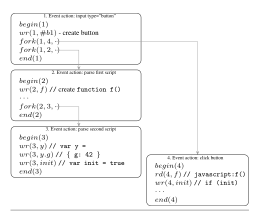
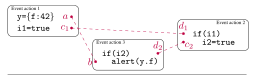
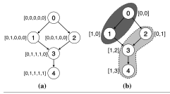
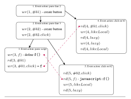

# **Effective Race Detection for Event-Driven Programs**

Veselin Raychev
ETH Zürich
veselin.raychev@inf.ethz.ch

Martin Vechev
ETH Zürich
martin.vechev@inf.ethz.ch

Manu Sridharan

IBM T.J. Watson Research Center
msridhar@us.ibm.com

# rtifact Party Party Party Party Party Party Party Party Party Party Party Party Party Party Party Party Party Party Party Party Party Party Party Party Party Party Party Party Party Party Party Party Party Party Party Party Party Party Party Party Party Party Party Party Party Party Party Party Party Party Party Party Party Party Party Party Party Party Party Party Party Party Party Party Party Party Party Party Party Party Party Party Party Party Party Party Party Party Party Party Party Party Party Party Party Party Party Party Party Party Party Party Party Party Party Party Party Party Party Party Party Party Party Party Party Party Party Party Party Party Party Party Party Party Party Party Party Party Party Party Party Party Party Party Party Party Party Party Party Party Party Party Party Party Party Party Party Party Party Party Party Party Party Party Party Party Party Party Party Party Party Party Party Party Party Party Party Party Party Party Party Party Party Party Party Party Party Party Party Party Party Party Party Party Party Party Party Party Party Party Party Party Party Party Party Party Party Party Party Party Party Party Party Party Party Party Party Party Party Party Party Party Party Party Party Party Party Party Party Party Party Party Party Party Party Party Party Party Party Party Party Party Party Party Party Party Party Party Party Party Party Party Party Party Party Party Party Party Party Party Party Party Party Party Party Party Party Party Party Party Party Party Party Party Party Party Party Party Party Party Party Party Party Party Party Party Party Party Party Party Party Party Party Party Party Party Party Party Party Party Party Party Party Party Party Party Party Party Party Party Party Party Party Party Party Party Party Party Party Party Party Party Party Party Party Party Party Party Party Party Party Party Party Party Party Party Party Party Party Party Party Party Party Party Party Party Party Party Party Party Party Party Party Party Party Party Party Party Party Part

#### **Abstract**

Like shared-memory multi-threaded programs, event-driven programs such as client-side web applications are susceptible to data races that are hard to reproduce and debug. Race detection for such programs is hampered by their pervasive use of ad hoc synchronization, which can lead to a prohibitive number of false positives. Race detection also faces a scalability challenge, as a large number of short-running event handlers can quickly overwhelm standard vector-clock-based techniques.

This paper presents several novel contributions that address both of these challenges. First, we introduce *race coverage*, a systematic method for exposing ad hoc synchronization and other (potentially harmful) races to the user, significantly reducing false positives. Second, we present an efficient connectivity algorithm for computing race coverage. The algorithm is based on *chain decomposition* and leverages the structure of event-driven programs to dramatically decrease the overhead of vector clocks.

We implemented our techniques in a tool called EVENT-RACER and evaluated it on a number of public web sites. The results indicate substantial performance and precision improvements of our approach over the state-of-the-art. Using EVENTRACER, we found many harmful races, most of which are beyond the reach of current techniques.

Categories and Subject Descriptors D.2.4 [Software Engineering]: Software/Program Verification; D.2.5 [Software Engineering]: Testing and Debugging – Testing tools; F.3.1 [Logics and Meaning of Programs]: Specifying and Verifying and Reasoning about Programs

General Terms Algorithms, Verification

*Keywords* Asynchrony; Concurrency; Nondeterminism; Race Detection; Web

Permission to make digital or hard copies of all or part of this work for personal or classroom use is granted without fee provided that copies are not made or distributed for profit or commercial advantage and that copies bear this notice and the full citation on the first page. Copyrights for components of this work owned by others than ACM must be honored. Abstracting with credit is permitted. To copy otherwise, or republish, to post on servers or to redistribute to lists, requires prior specific permission and/or a fee. Request permissions from permissions @acm.org.

*OOPSLA '13*, October 29–31, 2013, Indianapolis, Indiana, USA. Copyright © 2013 ACM 978-1-4503-2374-1/13/10...\$15.00. http://dx.doi.org/10.1145/2509136.2509538

#### 1. Introduction

Event-driven applications are vulnerable to concurrency errors similar to those in standard multi-threaded applications. In a typical event-driven program, event handlers are executed by an event dispatcher as a result of event firing. Event handlers usually execute atomically in a single thread, so handler code can assume that no other handlers execute concurrently. However, such systems allow for events to be fired non-deterministically (due to user actions, I/O timing, etc.), which may cause the corresponding event handlers to run in a non-deterministic order. This non-determinism can cause serious errors when event handlers share mutable state.

Client-side web applications are an important class of event-driven programs susceptible to such errors, as discussed in recent work [15]. Modern web applications make extensive use of asynchrony, via so-called "AJAX" requests and also of asynchronous code loading to speed up perceived page load time. This asynchrony can lead to non-deterministic errors, which can have severe consequences for users: e.g., the Hotmail email service was temporarily broken in the Firefox web browser due to a data race, potentially causing loss of message content [11].

The web platform provides few synchronization primitives to programmers. Hence, web applications are forced to coordinate event handler execution via standard shared variables, i.e., ad hoc synchronization. The atomic execution of event handlers makes such coordination safe. However, lacking knowledge of this synchronization, existing dynamic race detectors [4, 15, 16] report an overwhelming number of races on web applications, exceeding 3000 for some of the sites we tested. The vast majority of these races are harmless: they are either used for ad hoc synchronization or are infeasible. Manual examination of such a large set of races is nearly impossible, particularly due to the complex control flow typically found in event-driven programs.

In this paper, we present two advances in concurrency analysis for event-driven applications, making dynamic race detection for such applications more practical. We first introduce the notion of  $race\ coverage$  and show how it can be used to quickly expose ad hoc synchronization. Intuitively, race a covers race b iff treating a as synchronization eliminates b as a race. Importantly, uncovered races are defined and computed in a way which guarantees that both execution

orderings of the corresponding memory accesses are possible. Since synchronization is employed to handle multiple possible execution orderings, this guarantee makes it very likely that races on synchronization variables will be uncovered. By inspecting uncovered races first, a user can quickly identify races on synchronization variables and completely avoid inspecting false positives covered by those races. Our evaluation found the set of variables with uncovered races to be 14X smaller on average than the set of all variables with races, and we found that many uncovered races were in fact harmful.

Second, we present a dynamic analysis algorithm that efficiently computes races in event-driven programs by keeping the width of its vector clocks much smaller than the standard approach. Our technique employs *chain decomposition* [7] to discover cases where different event handlers can safely re-use the same vector clock slot. This optimization dramatically reduces the sizes of the vector clocks in practice, significantly improving performance. Using this algorithm as a building block, we present a second algorithm which efficiently discovers all variables with uncovered races in an execution trace.

To further reduce triage effort for races in web applications, we performed an extensive study of thousands of races and developed six filters for common types of harmless or synchronization races. In our experiments, the filters additionally (beyond coverage) reduced the number of races to inspect by a factor of 2.5.

We implemented our dynamic analysis by first modifying the WebKit browser [20] to log a trace of relevant events from a web application run to disk. Then, our tool analyzes the log, computes coverage, classifies discovered races based on our filters, and displays results in a rich browserbased user interface. In our experimental evaluation, we ran the tool on a wide variety of web sites. Despite the obfuscated code on many of the sites, we were able to inspect the uncovered races and manually identify many harmful races and synchronization variables. Using EVENTRACER, we have found harmful races on the front pages of 21 Fortune 100 companies. Our tool is usable by web developers, scalable to real web applications, and available open source at http://www.eventracer.org.

We believe that the techniques described in this work may be applicable in other settings which involve heavy user interface manipulations (e.g. Android, iOS).

*Main Contributions* The contributions of this work are:

- We introduce the concept of *race coverage*, which enables identification of ad hoc synchronization and greatly reduces the number of false positive races reported in event-driven programs.
- We present a fast dynamic race detection algorithm based on vector clocks which uses chain decomposition to reduce the width of the used vector clocks significantly.

- Based on the above algorithm, we present a fast algorithm that computes uncovered races in an execution of an event-driven program.
- We describe a set of filters for common harmless or synchronization races in web applications.
- We present an extensive evaluation of race coverage and filters on a large set of web sites. Our experimental results confirm that variables with uncovered, unfiltered races are more than 35 times fewer than all variables with races. We also found 75 harmful races in the set of web sites which we analyzed.

The paper is organized as follows. Section 2 motivates the problem and describes a core language that enables us to cleanly capture the essential features of event-driven programs. It also shows how to adapt existing state-of-the-art dynamic race detectors to our language and discusses their limitations. Section 3 formalizes the concept of race coverage and states an important theorem on the feasibility of uncovered races. Section 4 discusses efficient connectivity algorithms for finding uncovered races. In Section 5, we discuss our implementation in WebKit as well as our race filters. Experimental results are discussed and summarized in Section 6. Finally, Section 7 discusses related work and Section 8 concludes.

# 2. Setting

In this section, we first give a small example web application to motivate our techniques. Then, we define a simple parallel language called *Event* which enables us to cleanly model the essential concepts necessary for our analysis. We also define necessary preliminaries such as races and vector clocks. Finally, we show how to adapt current state-of-the-art race detection algorithms to *Event*, and discuss their limitations.

#### 2.1 Example

Consider the example in Fig. 1. The web page has an input button, two script nodes with JavaScript code, and many other elements which have been elided. Web browsers interleave HTML parsing with handling of other events like user actions; here, this means that the button can be clicked as soon as the input element is parsed, potentially before or between execution of the other scripts. This leads to potential timing-dependent behaviors:

- If the button is clicked before the first script runs, the f function invoked by the button's onclick handler will not yet have been declared, causing a JavaScript interpreter crash. The interpreter crash is not directly visible to the user; however, the user will see no effect from the button click, a usability bug.
- If the click occurs between execution of the two scripts, "not ready" will be displayed, as init is still false.

```
<html ><body >
  <input type =" button " id=" b1 "
        onclick =" javascript :f () " >
  ... <! -- many elements -->
  <script >
   function f () {
      if ( init )
        alert (y.g );
      else
        alert (" not ready " );
   }
   var init = false , y = null ;
  </ script >
  ...
  <script >
  y = { g: 42 };
  init = true ;
  </ script >
</ body > </ html >
                                              Browser User
                                         Parse input type="button"
                                                        show button
                                         Parse script
                                           define f
                                                              click
                                                f() - crash!
```

Figure 1. Example web page with both a harmful race and ad hoc synchronization. The trace on the right shows the harmful interleaving.

• If the click occurs after the two scripts run, 42 will be displayed.

Ideally, a race detection tool would efficiently expose issues like the potential crash in this example to the user, without showing too many false positives. In our work we focused on building a dynamic race detector which works by taking as input a program trace and then tries to find (harmful) races between concurrent operations in that trace. We shall discuss challenges in building such a tool at the end of the section, after introducing some terminology.

# 2.2 Language

Next, we introduce a simple parallel language, called *Event* as shown in Fig. 2. This language cleanly captures the essential features of event-driven applications (like web applications) that are necessary for our analysis. Sections 3 and 4 formulate our race detection techniques for *Event* programs, and then Section 5.1 shows in more detail how a web application execution trace can be translated to a trace of an *Event* program.

A program in *Event* consists of a top-level event action, which can read or write shared variables and create (fork) other event actions. This language is more restricted than a general fork-join parallel language. In particular, an event action can begin execution only following the completion of another event action, and all event actions execute atomically, without interruption. However, it is still possible to have multiple event actions available for execution at any point in the program execution, and the choice for which of these actions to schedule next is non-deterministic. The sequential parts of the language such as definitions of conditionals, loops and expressions are standard and are omitted for brevity. We consider only the following relevant operations:

```
S ::= S; S | rd(t, x) | wr(t, x) |
                   f ork(t, u, EventAction)
EventAction ::= Joins; begin(t); S; end(t)
      Joins ::= Joins; Joins | join(t, u)
   P rogram ::= EventAction
  Operation ::= rd(t, x) | wr(t, x) | begin(t) | end(t) |
                   f ork(t, u, EventAction) | join(t, u)
         t, u ∈ EventIds
          x ∈ V ars
         a, b ∈ Operation
```

Figure 2. The *Event* language

- rd(t, x) denotes that event action t performs a read of a shared variable x. Similarly, wr(t, x) denotes writing to x.
- fork(t, u, EventAction) means that event action t forks an event action u with the operations that u must execute specified in EventAction.
- join(t, u) denotes that event action t must wait until another event action u completes.
- begin(t) and end(t) denote the beginning and ending of an event action. At any time, up to one event action can be executing. That is, event action execution is atomic. Note that in our language, all reads, writes and forks always occur between begin and end.

As an example of translating a web program to *Event*, consider again the example in Fig. 1. In web programs, only parsing of individual HTML tags is atomic, to enable a quick response to interleaved events like user clicks. For Fig. 1, the parsing of the input tag and each script tag gets translated to a separate event action. Element ordering is captured by adding appropriate fork operations to tag-parsing event actions; for the example, the parsing event action for the input tag forks the script-parsing event action. An event action represents event handler execution for each user click on the button, and such actions join on the input-parsing event action (as the button must be present to be clicked). The variable accesses in the scripts translate to wr and rd operations in the event actions executing the scripts. We also generate a wr operation for creation of the f function, and a rd operation for the access of f from the button's onclick handler.

Fig. 3 shows an execution of the application from Fig. 1 translated to *Event*. In this execution, the web application is loaded and one click of the button with id b1 is performed. Some details of the full translation are omitted for clarity (e.g. parsing of the html or body tags generates event actions that are omitted). In the execution in Fig. 3, event action 4 is a click that happens after the script in event action



Figure 3. Example trace for the program in Fig. 1 translated to the *Event* language. Some details are missing for clarity.

2 has executed. However, the click could have happened before the script is parsed, leading to an exception because javascript:f() would then call an undefined function. Our tool detects this race by performing a dynamic analysis of a single execution trace (i.e. like the one in Fig. 3).

## 2.3 Order, Races, and Vector Clocks

The execution of a program is defined via traces, where a finite trace π = a<sup>0</sup> ·a<sup>1</sup> ·...·a<sup>n</sup> ∈ Operation<sup>∗</sup> (with n ≥ 0) is a sequence of operations in our language. Here, we abstract away the configurations (states) of the program and only keep the operations. We use the notation [[P]] to denote the set of all traces for a given program P.

*Trace Order* For a given trace π, if operation a occurs before operation b in π, we say that a <<sup>π</sup> b. To simplify exposition we assume that each operation appears only once in the trace (if it appears multiple times, we can always assign a unique identifier to each appearance). Similarly, we say that event action t precedes event action u in the trace, denoted t <<sup>π</sup> u (we overload the operator), if begin(t) <<sup>π</sup> begin(u).

*Happens-Before* Given a trace π, the happens-before relation over pairs of event actions t and u in π is the minimal transitively closed relation, such that t u holds if t = u, fork(t, u, ) ∈ π, or join(u, t) ∈ π (here we used to mean any value is allowed). We denote the event action of an operation a by ev(a). Given a trace π, a happens-before relation between two operations a and b occurring in the trace, denoted ab (again, we overload the operator), is true if:

- ev(a) 6= ev(b) and ev(a)ev(b), or
- ev(a) = ev(b) and a <<sup>π</sup> b

The relation (for operations) is transitive due to transitivity of (for event actions) and <<sup>π</sup> . When ab is false we write a6b.

Definition 2.1 (Race). *Given a trace* π *and operations* a *and* b *where* a <<sup>π</sup> b*, a race* R = (a, b) *is a pair where both operations access the same variable, at least one is a write and* a6b*.*

Intuitively, if a trace contains a race R, it means that the order between racing operations may change in other traces. Depending on the kind of operations participating in the race, we refer to it as a read-write, write-read or a write-write race.

*Vector clocks* One approach for capturing the happensbefore relation is using vector clocks [10]. A vector clock V C : T → N holds a natural number for each element in T. An important function on vector clocks is the join function ( t ). Additionally, we define a minimal element (⊥<sup>V</sup> ) and a function inc<sup>t</sup> for incrementing the t-th component of a vector clock (similar notation appears elsewhere [4]):

$$VC_1 \sqcup VC_2 = \lambda t.max(VC_1(t), VC_2(t))$$
  
 $\perp_V = \lambda t.0$   
 $inc_t(VC) = \lambda u.$  if  $t = u$  then  $VC(u) + 1$  else  $VC(u)$ 

For simplicity, we define join on a set of vector clocks {V Ci} by t{V Ci} to be V C<sup>1</sup> t V C<sup>2</sup> t ... for a non-empty set {V Ci} and ⊥<sup>V</sup> otherwise.

### 2.4 Adapting Existing Online Dynamic Race Detectors

A na¨ıve approach to applying existing vector-clock based online dynamic race detectors to our language is to create a happen-before order between begin and end operations encountered in the trace (essentially, mapping these operations to global lock/unlock operations). However, while this translation maintains the atomic execution of event actions, no races will be reported as all operations will be treated as "ordered" by a standard race detector. Another, more fruitful approach is to: i) avoid introducing happens-before arcs between begin and end operations of different event actions, and ii) only explore traces where event actions do not interleave. In this way, the race detector will not introduce unwanted orderings and it will not observe infeasible interleavings.

*Limitations* Two problems arise when applying online race detectors to event-driven programs, which our techniques address:

Too many races In our experiments, we found that applying race detectors to web programs directly leads to too many races reported by the analysis (in the thousands). Many of these races implement ad hoc synchronization or are infeasible. For Fig. 1, the init variable is used for ad hoc synchronization, to ensure y is initialized before it is dereferenced. However, unaware of this synchronization, a standard race detector would report an infeasible race for the accesses to y.

Number of threads A state-of-the art detector such as FAST-TRACK [4] keeps track of vector clocks for each thread and for some of the variables. In FASTTRACK, a vector clock requires O(n) space and vector clock operations require O(n) time, where n is the number of threads. We found that for our programs, n (the number of event actions) grows into the thousands, hurting scalability. The number of event actions can grow very quickly due to fine-grained atomic actions, e.g., the parsing of each HTML tag (see Section 2.2) and short-running event handlers.

The concepts presented in the next section (Section 3) aim to address the first limitation. The second limitation is addressed in Section 4.

# 3. Race coverage

In this section we address a key problem which arises in race detection: the race detector produces too many races to be practically useful. This problem is significantly exacerbated for programs in languages such as *Event*, as *Event* has no synchronization primitives except joining to other event actions. This means that any synchronization between event actions needs to be implemented by coordinating via shared variables, which in turns means that a race detector will produce many false positives. These false positives can be categorized as follows:

- Synchronization races: these are races which implement synchronization and are required for the program to work correctly.
- Races covered by synchronization: these are races that can never occur since other synchronization races in fact introduce a happens-before edge.

Indeed, in our experiments in Section 6, we found that the vast majority of races on a web site reported by a standard race detector are false positives: many of them are either synchronization races or they are covered by synchronization races. The total number of races is often so large that manually inspecting all of them is almost impossible. Ideally, we would like to focus only on real races, which are not ordered by synchronization. Using race coverage, we were able to report only races uncovered by synchronization, decreasing the number of races reported by an order of magnitude.

#### 3.1 Race coverage and multi-coverage

Next we define what it means for a race to be *covered*. Intuitively, a race R = (a, b) is covered if there is some other race S = (c, d)such that if we treat S as synchronization and


Figure 4. An example of race coverage based on Fig. 1. Race R = (a, b) is covered by race S = (c, d), since with a happens-before edge from c to d, R would clearly not be a race.



Figure 5. An example with a race R = (a, b) covered by two races S<sup>1</sup> = (c1, d1) and S<sup>2</sup> = (c2, d2)

create a happens-before edge between c and d, then the race R will disappear, that is, R will no longer be a race.

Definition 3.1 (Covered race). *We say that a race* R = (a, b) *is covered by race* S = (c, d) *if the following conditions hold:*

1. 
$$ev(a) \leq ev(c)$$
, and  
2.  $d \leq b$ 

We denote that race S covers race R by {S} J R. Note that we need db and it is not enough to say ev(d)ev(b) as d must come before b, even if they are part of the same event action. Similarly, if we say a c, then that would be too restrictive as c can come *before* a if they are in the same event action.

*Example* Fig. 4 shows an example of the conditions in the above definition, based on the scripts in Fig. 1. The dashed lines denote the two races. On its own, the race R on y may seem harmful: if the read of y.f executes before initialization, an exception will be thrown. However, the synchronization on variable init (the covering race S) prevents R from ever executing in a "bad" order, i.e., R is not really a race.

Next, we generalize Definition 3.1 to the case where a race is covered by multiple races. The intuition behind this generalization in that enforced ordering constraints via (multiple) synchronization races are transitive.

Definition 3.2 (Multi-covered race). *We say that a race* R = (a, b) *is covered by a set of races* {S<sup>i</sup> = (c<sup>i</sup> , di)} n <sup>i</sup>=1 *if the following conditions hold:*

*1.* ev(a)ev(c1) *2. for every* i ∈ [1, n)*,* ev(di)ev(ci+1)*. 3.* d<sup>n</sup> b

We denote multi-coverage by {Si} n <sup>i</sup>=1 J R. The example in Fig. 5 shows a fragment of an execution with one race R covered by two other races S<sup>1</sup> and S2.

Let races(π) denote the set of all races which occur in a trace π. An uncovered race is one for which no combination of races in the trace π cover it. We denote the set of all uncovered races by:

$$uncovered(\pi) = \{R \mid R \in races(\pi), \\ \nexists C \subseteq races(\pi) \colon C \blacktriangleleft R\}$$

# 3.2 Guarantees

Next, we show that all uncovered races are feasible (i.e., cannot be eliminated) in the sense that the racing operations of an uncovered race can appear in arbitrary order. This property is important because such races are likely to be of greater interest to the programmer, as they cannot be eliminated regardless of which other races are considered as synchronization.

First, we define the possible re-orderings of a trace π, referred to as [[π]]. Recall that the notation [[P]] means the set of all program traces of a program P.

Definition 3.3 (Equivalence Class). *For a trace* π*,* [[π]] ⊆ [[*P*]] *is a set of program traces such that for every trace* π <sup>0</sup> ∈ [[π]]*, the following conditions hold:*

- *1. if operation* a ∈ π 0 *, then* a ∈ π*.*
- *2. if operations* a, b ∈ π*,* b ∈ π 0 *, and* ab*, then* a ∈ π <sup>0</sup> *and* a <π<sup>0</sup> b*.*
- *3. if operations* a, b ∈ π*,* b ∈ π 0 *, and race* R = (a, b) *is a race in* π*, then either:*
  - *(a)* a ∈ π <sup>0</sup> *and* a <π<sup>0</sup> b*, or*
  - *(b)* a 6∈ π <sup>0</sup> *and* b *is the last operation of* π 0 *.*

Intuitively, the set [[π]] includes the traces that satisfy the happens-before relation and where all races in π are resolved in the same way in each trace in [[π]], that is, racing accesses follow the same order in the trace. The set [[π]] allows for one case where a race in π 0 is not resolved in the same way as in π. This occurs when condition 3(a) does not hold, but condition 3(b) holds. We call such a race an accessible race:

Definition 3.4 (Accessible race). *A race* R = (a, b) *in a trace* π *is accessible, if there exists a trace* π <sup>0</sup> ∈ [[π]]*, such that* b ∈ π 0 *, but* a 6∈ π 0 *.*

From both definitions, it follows that operation b must be the last operation of π 0 . Intuitively, this is because after an accessed race occurs, we may not be always able to reason about the behavior of the program only based on the trace π. The next two theorems discuss the connection between uncovered and accessible races.

Theorem 3.5. *If a race* R ∈ races(π)\uncovered(π)*, then* R *is not accessible.*

The above theorem states that if a race R is covered, then for the equivalence class [[π]], the race is inaccessible. The intuitive reason is that as R is covered by some other race S, the operations in S will always occur in the same order in any trace in [[π]] which would force R's operations to follow the same order as well, meaning that the operations of R cannot be re-ordered in any of the traces in [[π]].

The next theorem states that any uncovered race is accessible. This means that any race that we report as uncovered is guaranteed to "exist" for some trace.

Theorem 3.6. *For a trace* π*, if* R ∈ uncovered(π)*, then* R *is an accessible race.*

Using the definition of a multi-covered race, it can be shown that for a trace π, races(π) 6= ∅ iff uncovered(π) 6= ∅. Then the following is a direct corollary from Theorem 3.5 and Theorem 3.6.

Corollary 3.7. *A trace* π *is race-free (*[[π]] *has no accessible races) iff* races(π) = ∅*.*

This result is useful as it tells us that if we do not find a race in a given trace, then it means that there are no races for the other traces in [[π]]. Conversely, Theorem 3.6 tells us that certain races always exist and cannot be eliminated.

In the next section, we will show algorithms for computing the set of uncovered races.

# 4. Computation of Uncovered Races

In this section, we present algorithms which compute uncovered races. These algorithms report at least one uncovered race per variable on which there are uncovered races in the execution. We present our algorithms using graph terminology and discuss how they can be realized both in an online as well as in an offline setting.

## 4.1 Happens-Before via Graph Connectivity

Happens-before queries can be answered as connectivity queries in a graph. Given a trace π, we build a graph G = (V, E) where the nodes V ⊆ EventIds represent all event actions in the trace and the arcs E ⊆ EventIds×EventIds are such that for any pair of nodes t and u, there is a path from t to u in G iff tu. That is, given a trace π, we define:

- V = {t | begin(t) ∈ π}, and
- E = {(t, u) | fork(t, u, ) ∈ π or join(u, t) ∈ π}

The graph G is a directed acyclic graph and the sequence of event actions in any valid trace π is a topological ordering traversal of G. Then, given a trace π, <sup>1</sup> by first building the graph G (which represents the happens-before relation ) we can determine if a pair of operations which access the same variable (with at least one operation being a write) are racing by checking whether their corresponding two event actions (two nodes) are connected in G.

<sup>1</sup> In an online detector, the trace can be partial.



**Figure 6.** Example showing vector clocks with and without chain decomposition.

Next, we discuss four orthogonal algorithms for performing graph connectivity. All of these algorithms are later evaluated on graphs obtained from traces of web programs (see Table 3 in Section 6).

#### 4.1.1 Breadth-first search (BFS)

A standard algorithm for connectivity checking between a pair of nodes performs a breadth-first or depth-first graph traversal of G. Then, each connectivity check has a maximum time complexity of O(|E|), but many checks complete faster. While the algorithm has the advantage of low space complexity, our experiments indicate that such an algorithm performs on average orders of magnitude slower (than our final algorithm) and is unable to complete execution on some web applications in a reasonable amount of time.

#### 4.1.2 Vector Clocks

Many race detection algorithms determine connectivity using vector clocks, described previously in Section 2.3. Each node is assigned a vector clock of width |V|, with one slot per node. The vector clock vc(t) for node t is defined as:

$$vc(t) = inc_t(\sqcup \{vc(u) \mid u \neq t, (u, t) \in E\})$$

Since the graph G is acyclic, the function vc is well defined. For a pair of nodes t and u,  $t \leq u$  holds iff  $vc(t)[t] \leq vc(u)[t]$  (see the reachability theorem in [7]). Hence, given a precomputed vc function for each node, a reachability query takes one integer comparison, which is constant time.

As an example, Fig. 6(a) shows a small graph and the corresponding vector clocks for each node (the node number is its vector-clock index). Given the vector clocks, we can see, e.g., that event 1 does not happen before event 2, since vc(1)[1] > vc(2)[1].

The above algorithm has  $O(|V|^2)$  space complexity, and since our event graphs can have thousands of nodes or more, this leads to a blowup in practice. We evaluated a simple vector-clock-based algorithm and found it to run out of memory for some of our applications (see Section 6).

#### 4.1.3 Vector clocks with Bit Vectors

An interesting observation is that if each node uses its own vector clock entry, vector clocks can be represented compactly using bit vectors, as each entry will always be 0 or 1 (as in Fig. 6(a)). However, even with this optimization, the algorithm required more than a gigabyte of memory to handle larger applications in our experiments.

#### 4.1.4 Vector clocks with chain decomposition

We propose an improved graph connectivity algorithm which combines vector clocks with chain decomposition similar to the one proposed by Jagadish et al. [7] and Awargal and Garg [1]. A chain decomposition optimization suggests covering the nodes of a graph with a minimal number of chains for performing fast connectivity queries. A chain is a set of nodes  $\{a_i\}_{i=1}^m$ , such that there is a path from  $a_i$  to  $a_{i+1}$  in G for every  $i \in [1,m)$ . Let CIds denote the set of all chains. Then, we assign every node in G to a chain via the function cid:  $EventIds \rightarrow CIds$ . For example, Fig. 6(b) shows a chain decomposition of the example graph, using two chains, one in dark grey and one in light grey.

Given the chain assignment, we allocate one vector clock of width |CIds| (in this case  $VC \colon CIds \to \mathbb{N}$ ) for every node t in the graph and assign the vector clock values according to a modified function  $vc \colon EventIds \to VC$ :

$$vc(t) = inc_{cid(t)}(\sqcup \{vc(u) \mid u \neq t, (u, t) \in E\})$$

Since the number of chains is typically much smaller than the number of nodes (over 33X smaller on average in our experimental evaluation, as shown in Table 3), this technique can dramatically reduce the size of vector clocks. Fig. 6(b) shows how vector clocks of width 2 are assigned to the nodes using the chain decomposition. Note that with chains, vector clocks can no longer be represented using bit vectors.

Computing optimal chain decomposition has  $O(|V|^3)$  time complexity, but a greedy technique (which we use in this work) typically produces as few chains [7]. The space complexity of our connectivity algorithm is  $O(|CIds| \cdot |V|)$ , and the time complexity for each query is O(1).

**Representing the Graph** G We note that vector clock connectivity algorithms do not explicitly store the graph G. They only maintain the map from nodes to vector clocks (as well as the cid function for the algorithm in Section 4.1.4) which is used to answer reachability queries.

# 4.2 Computation of initial set of races

Next, we describe the first step in computing uncovered races. One way to compute uncovered races is to first compute the set of all races. Using one of the four connectivity algorithms above, we can compute the set of all races by checking pairs of write operations or pairs of a read and a write operation on the same variable. However, first computing the set of all races may be an unnecessary overhead. For

example, a variable with n writes may contain up to  $n \cdot (n-1)$  races if all of its writes are unordered by the  $\leq$  relation.

**Reduced starting set of races** We next discuss how to discover uncovered races by first computing a smaller set of initial races. We refer to this set as UncoveredCandidates. Consider a pair of races on the same variable  $R_1 = (a, c)$  and  $R_2 = (b, c)$  such that  $a \leq b$ . In this case, if  $R_1$  covers any other race R', then  $R_2$  also covers R'. Hence, we do not need to obtain  $R_1$  if we can obtain  $R_2$ .

Similarly to multi-coverage, the idea can be extended as follows. We do not need to obtain a race R=(a,b) for which there is a set of other races on the same variable  $S_i=(c_i,d_i), S_i\neq R, i\in[1,n]$  where the following hold:

- $a = c_1$  or  $a \leq c_1$ , and
- $d_i = c_{i+1}$  or  $d_i \leq c_{i+1}$  for all  $i \in [1, n)$ , and
- $d_n = b$  or  $d_n \leq b$

If the above conditions hold, from Definition 3.1 and Definition 3.2, it follows that for any R', if  $\{R\} \blacktriangleleft R'$ , then  $\{S_i\}_{i=1}^n \blacktriangleleft R'$  and hence we need not discover R' as there are other races  $(S_i)$  that will be found. That is, the set UncoveredCandidates is the set of all races minus the set of races which satisfy the above conditions.

**Computation of UncoveredCandidates** Consider a variable with p writes  $w_1, w_2, ..., w_p$  (here write  $w_i$  happens before  $w_{i+1}$  in the trace) and q reads  $r_1, r_2, ..., r_q$  (here read  $r_i$  happens before  $r_{i+1}$  in the trace). Below we define candidate pairs which we check for whether they participate in a race:

- all pairs  $(w_i, w_{i+1}), i \in [1, p)$ ;
- for each  $r_i$ ,  $i \in [1, q]$ , where  $w_{pred_i}$  is the last write before  $r_i$  occurred (if one exists).
- for each  $r_i$ ,  $i \in [1, q]$ , the pair  $(r_i, w_{succ_i})$  where  $w_{succ_i}$  is the write right after  $r_i$  occurred (if one exists).

For each of the above pairs (a,b), if  $a \not \geq b$  (checked using one of the four algorithms described earlier), we add the pair to the set UncoveredCandidates. This approach produces at most  $p-1+2\cdot q$  races per variable, a significant reduction from the maximum number of possible races per variable  $p\cdot (p+q-1)$ .

#### 4.3 Computation of uncovered races

Next, based on *UncoveredCandidates*, we present an algorithm for finding *all* variables with uncovered races.

1. We first eliminate all races which are covered by only one race. We sort the set  $UncoveredCandidates = \{R_i = (a_i, b_i)\}_{i=1}^n$  according to the order in which their second operation appears in the trace  $\pi$ , that is, if  $b_i <_{\pi} b_j$ , then i < j. According to condition 2 of Definition 3.1, every race  $R_i$  may cover only races  $R_j$  such that i < j.

Given this sorted order, for every remaining race r, we remove all of the subsequent races in the ordering that r covers according to Definition 3.1 (checking this requires two connectivity queries for the two conditions). Let the remaining set of races be *RemainingCandidates*.

- Next, we present an algorithm for finding the set of uncovered races, which also excludes races covered by more than one race from the set *RemainingCandidates*.
   We build a graph G' = (V', E') with nodes representing races generated from the previous step:
  - V' = Remaining Candidates
  - $E' = \{((a, b), (c, d)) \mid ev(b) \leq ev(c)\}$

Then, for every race  $R=(c,d)\in V'$ , if there exists a pair of nodes  $S_1=(a_1,b_1)\in V'$  and  $S_2=(a_2,b_2)\in V'$ , such that  $ev(c)\preceq ev(a_1),\ b_2\preceq d$ , and there is a path from  $S_1$  to  $S_2$  in G', then R is a covered race. The reason R is covered is that the set of races in the path from  $S_1$  to  $S_2$  will cover R. After removing all such races from *RemainingCandidates*, the remaining races are uncovered races.

The correctness of the algorithm follows from the fact that for every race R, if R is covered by a set of other races, then it is covered by a set of uncovered races, which form a path in G' and the above algorithm will find that path.

Time complexity Let |UncoveredCandidates| = n and |RemainingCandidates| = m. Assuming the time complexity of the connectivity query is constant-time (which is true for all three vector-clock connectivity algorithms), then computation of uncovered races has time complexity  $O(n \cdot m + m^3)$ . As we will see in our experimental results, this procedure usually takes less than a second.

#### 4.4 Online Analysis

In an online setting where we do not store the trace  $\pi$ , all of the described algorithms can be realized as follows.

First, chain decomposition can be used online as a direct replacement of naïve vector clocks. Because connectivity queries can be made while the graph is not fully built, the online setting requires us to use a greedy chain assignment, e.g. for every node added to the graph, we assign to it the first possible chain (if such a chain exists), or to a new chain otherwise.

Second, we can augment an existing vector clocks based race detector to produce the set *UncoveredCandidates*. This only requires the race detector to keep reporting races on a variable even after it finds the first race.

Finally, to find uncovered races we maintain the map vc (the mapping from nodes to vector clocks), which is instrumented state that standard race detectors already maintain. We also maintain the graph G' whose size is a small fraction of the size of vc.

#### 4.5 Offline Analysis

To use the described algorithms in an offline setting, we need to store the trace π. To mitigate the potential space overhead from storing the full trace, we avoid storing some of the operations. In our setting, if there are multiple races for one variable between operations in the same pairs of event actions, we report only one race. This means that if an event action contains multiple reads or multiple writes of one variable, it is enough to store the first read and the first write. This optimization is sound and does not affect the correctness of the races we find or the guarantees provided by race coverage. With this optimization, our experiments (in Section 6.2) show that the size of trace log files is acceptable and storing the entire trace in memory requires space comparable to the space consumed by vector clocks for the graph connectivity algorithm.

# 5. Implementation

Here we describe the implementation of EVENTRACER, which performs race detection offline on a trace in the *Event* language (see Fig. 2), generated by an instrumented Web-Kit browser. We chose to implement an offline race detector since recorded traces enable apples-to-apples comparisons of the different connectivity algorithms based on which race coverage is computed (since each algorithm runs on the same trace) and other detailed analyses; scalability of the offline approach was not an issue (see Section 6.2). In this section, we discuss the translation of web page executions to the *Event* language, our implementation of the race detector, and some additional race filters that do useful automatic categorization specific to web races.

#### 5.1 Translation of a web application to *Event*

A translation from a web application to the *Event* language consists of two main parts:

- 1. generating the read and write operations.
- 2. generating event actions and fork and join operations between them.

Here we outline the main principles of our translation. Our translation builds on the modelling of web semantics in Petrov et al. [15], but we exploit the structure of Web-Kit itself to achieve greater simplicity and generality when generating event actions.

*Memory accesses* Our modeling of memory accesses is largely identical to that of Petrov et al. [15], but we handle more cases like JavaScript arrays; we describe it here briefly. The web platform provides a high-level declarative language for creating user interface elements (HTML and CSS) and a scripting language for the application code (JavaScript). The languages are linked by the Document Object Model (DOM) APIs, which enable reading and modifying user interface elements from JavaScript. When translating to the *Event*

```
1 <html ><body >
2 <input type =" button " id=" b1 " >
3 <input type =" button " id=" b2 "
4 onclick =" javascript : f () " >
5 <script >
6 var likeLocal , lazy ;
7 function f () {
8 likeLocal = 5;
9 if (! lazy ) {
10 lazy = 9 + likeLocal ;
11 }
12 }
13 document . getElementById ('b1 ')
14 . addEventListener (" click " , f) ;
15 </ script ></ body > </ html >
```

Figure 7. An example web application with several races.



Figure 8. Example trace for the program in Fig. 7, which includes several races. Solid arrows represent happens-before, dashed lines show some of the races. Note: some details are omitted for clarity.

language, we define *logical memory locations* representing the state of the DOM tree, in addition to the straightforward translation of JavaScript variables to *Event* variables. We translated memory accesses to *Event* as follows:

- Reads and writes of JavaScript variables, object fields, and functions were directly translated to rd or wr operations in *Event*. (At the lowest level, all these entities are in fact object fields in JavaScript, simplifying the implementation.) DOM API methods were modeled as rd or wr operations of the appropriate logical memory locations.
- Some DOM nodes have a list of event listeners for the possible events on corresponding UI elements. Any mutation of this list (e.g., via a call to addEventListener or setting an on<X> attribute for event <X>) is translated to a wr operation of a corresponding logical memory location l. Firing an event, which causes execution of all attached event listeners, is translated as rd operation on l.

- A special type of memory locations for DOM elements is the set of all DOM node identifiers. The DOM tree allows querying for elements by their id and such a query is translated to a rd operation in the *Event* language. Creation of an element with an id attribute or writing the id field of a DOM object is a modification to the set of DOM identifiers and translates to a wr operation on a variable representing the DOM id.
- JavaScript arrays are a special case of JavaScript variables. Arrays provide reads and writes from an index that we translate to rd and wr of the corresponding index like regular variables. Additionally, arrays provide methods that append to the end of an array, iterate over elements, remove an interval of elements or get its length. To handle these methods, we added an additional *logical memory location* for the entire array. All operations that read the size of the array or access a cells are considered reads, while all operations that add or remove cells are considered writes of this memory location.

The example program in Fig. 7 contains accesses of the JavaScript variables f, likeLocal and lazy, the click event handler of buttons b1 and b2, and the set of DOM identifiers. Fig. 8 shows an execution trace for Fig. 7 with the relevant memory accesses translated to the *Event* language.

*Event Actions, Forks and Joins* The work of Petrov et al. [15] specified a detailed happens-before relation for the web, with specific rules for constructs like scripts, images, etc. Rather than instrumenting the handling of each such construct, we exploited the fact that WebKit itself is structured as an event-driven program—by translating WebKit's internal event-driven structure directly to *Event*, we could handle a wider variety of HTML constructs than what was specified in previous work with a relatively small amount of code. We can do this, because ordering constraints between events are typically enforced only by the browser. This means that even if an external agent like a server tries to order events, the order is likely not enforced at the client side due to the network.

The implementation of WebKit contains event handler code for each unit of work in rendering a web page: parsing an HTML element, executing a script, handling user input, etc. We translated each of these handlers to an event action in *Event*. Many WebKit event actions are ordered via internal timers: starting a timer event action u from event action t is translated to fork(t, u). Similarly, an event action t starting a network request with response event action u is modeled as fork(t, u). We also introduce fork(t, u) where t creates a UI element e and u handles some event on e. The trace in Fig. 8 shows possible event actions for parsing each HTML tag and event actions for user clicks on the two buttons from one possible execution run.

We found that WebKit itself uses ad hoc synchronization to order certain event actions, which we translated to *Event* using the join construct to capture the induced happensbefore. Here are examples of ad hoc synchronization variables in WebKit:

- 1. A counter in each document for the number of child iframe HTML documents being loaded. Each created iframe increments this counter, while finishing the loading of an iframe decrements it. A load completion event is triggered only after this counter decreases to zero.
- 2. A counter in each document for the number of child resources like images or scripts that are currently loading. The use of this counter is similar to the iframe counter.
- 3. A counter in each document for the number of pending scripts to execute.
- 4. A queue of the pending tags to parse.

By translating WebKit's core event structure directly instead of separately handling each HTML feature, our translation is able to cover a bigger part of HTML5 than what was described in [15], including newer features like video and audio tags and modification listener events. Our approach is mostly applicable to other browser engines, as they are also implemented as event-based systems (the event-driven structure is specified in HTML5 [5]). Minor changes to the engine may be needed to disable optimizations that merge multiple web-level events, as this merging may hide races. For Web-Kit, we disabled the ability to parse more than one HTML element in an event action.

Our modifications worked across several versions of WebKit that we tested, and our experiments were done using SVN version 116000 of the code.<sup>2</sup> Our reasoning about the WebKit implementation in terms of our *Event* language shows the generality of our techniques. In fact, one could imagine using our techniques to build a race detector for the WebKit implementation, with race coverage exposing the ad hoc synchronization we discovered manually.

#### 5.2 Race analyzer

Our browser based on modified WebKit produces a program trace, which is logged to a file, together with debug information describing the types of events, JavaScript scope information, the values of the JavaScript variables and the source code of any executed JavaScript. Our race analyzer takes the *Event* program trace augmented with the debug information as input.

The user interface for the race analyzer is implemented as a web server providing interactive views of the execution trace and detected races. The user can inspect reads and writes of any memory location in the trace, the happensbefore graph, and all corresponding JavaScript code (even when the code was dynamically generated). For discovered races, the UI shows race coverage information and filters out covered races in its default view. Initially showing only

<sup>2</sup> http://svn.webkit.org/repository/webkit/trunk

uncovered races is a sensible default, as the user can easily identify synchronization races and avoid inspection of races covered by synchronization (see Section 3). We shall show in Section 6 that in practice, only a small subset of all races are uncovered, so this default also significantly reduces triage effort.

# 5.3 Race filters

To further improve the usability of EVENTRACER, we implemented several filters for common race patterns specific to web applications. These filters automatically categorize certain uncovered races as either likely synchronization or likely to be harmless. A user can first investigate the uncategorized races, which are more likely to be harmful, and then quickly study the filtered races to confirm that the automatic categorization is appropriate. The automatic categorizations are based on extensive experience inspecting thousands of race reports across real-world web sites. It is possible for a filter to be inaccurate, e.g., by flagging a harmful race as likely to be harmless. However, we manually inspected many filtered races during our experimental evaluation, and we did not observe any inaccuracy, so we expect this to be rare in practice.

*Writing same value* When a memory location has only write-write uncovered races and the racing operations write the same value to the variable, the races are flagged as likely to be harmless. Web sites often have multiple scripts that initialize a variable to the same value, and this filter captures that pattern. The variable likeLocal in Fig. 7 matches this pattern. The f function is executed when either button is clicked, and thus the value 5 will be written to likeLocal no matter which button is clicked first.

*Only local reads* In some cases, a JavaScript global variable is essentially used as a local: any read of the variable gets a value from a preceding write in the same event action. In such cases, we flag races on the variable as likely to be harmless. For these races, the user may want to fix the code by reducing the visibility of the variable, as adding a read without a preceding write to new code could cause a harmful race. The variable likeLocal in Fig. 7 matches this pattern as well. The value of the variable is read only in the same event action after it is written.

*Late attachment of event handler* We flag write-read and read-write races on event handlers as a separate class of races. This type of race is specific to the web and common in sites using libraries like jQuery.<sup>3</sup> Such sites enable many event handlers only after the page has completed some initial loading, in order to reduce perceived page load time. This practice can lead to many race reports, since the user can interact with a partially-loaded page. For example, if a click handler is attached only after the page loads, user clicks while the page is not fully loaded will not be processed. While this is certainly a race, it is a common pattern in web applications and typically viewed as an acceptable degradation of the user experience. The click handler for the button b1 in Fig. 7 matches this pattern: if the user clicks b1 before the code at line 13 runs, the f function will not execute.

*Lazy initialization* When a JavaScript variable has only one write, only one read of the value undefined (or the value null) preceding the write in the same event action, and multiple other reads in other event actions following the write in the trace, we assume this variable is used as lazy initialization. Such a variable may have races, but we assume every read to be checking for undefined and be harmless. This filter is only a best-effort guess that races on a variable are harmless. In our experience, the races it caught were always harmless, but it may hide a real bug, so the races may merit more careful inspection. A common code pattern for such variables is similar to the one shown for variable lazy in Fig. 7: the racing accesses check if the variable is initialized and only the first one initializes it.

*Commuting operations* Races on certain memory locations like cookie and className of DOM nodes typically occur from commuting methods like addClass, removeClass, hasClass, etc.. We filter these races as we discovered they are often harmless.

*Race with page unload* We classify variables having only races with a memory access in the page unload event handler separately. The harm of such races to a web application is limited to only the unload event and any error will likely not be visible to the user. Most of these races were in libraries, but in cases when a developer adds logic in the unload events, these races may be worth investigating.

# 5.4 Likely harmful races

We also created filters for two types of races that are likely to be *harmful*; EVENTRACER automatically flags these races as important for the user. Note that both these filters are only applied to variables that have not already been flagged by the filters described in Section 5.3.

*Uninitialized values* This filter identifies races that may involve a use of an uninitialized location. The filter selects variables v with uncovered races where for *all* writes {wi} n <sup>i</sup>=1 of v in the trace that precede a read r, the pairs (w<sup>i</sup> , r) are uncovered races. For races that pass this criterion, we can show via Theorem 3.6 that it is possible to build a trace such that the read r can read an uninitialized value (since no write is ordered before the read). Such a race is harmful when the code that performs the read does not check for an uninitialized value. In our experimental evaluation, we manually inspected races flagged by this filter, and we found some of them to be harmful.

<sup>3</sup> http://jquery.com/

An example of such a race is for the variable f in Fig. 7. In this case, a user with a slow network connection may execute the click handler before the script is loaded and the function f is initialized, causing an unhandled exception in the click handler.

*readyStateChange handler* This filter selects variables v with uncovered races (a, b) such that at least one of ev(a) or ev(b) is an event handler for the readyStateChange event. These are typically response handlers for asynchronous "AJAX" or resource load requests, which are error-prone due to possible wide variance in network response time. We manually inspected races from this filter and found some of them to be harmful.

# 6. Evaluation

Here we present an experimental evaluation of EVENT-RACER, which implements the optimized race detector, coverage techniques, and filters described earlier. Our evaluation tested the following experimental hypotheses:

- 1. Race coverage (Section 3) and our other filters (Section 5.3) dramatically reduce the number of races the user must initially inspect.
- 2. If a site contains harmful races, those races are often contained in the initial set of uncovered, unfiltered races shown to the user.
- 3. Race detection that constructs vector clocks based on chain decomposition (see Section 4.1.4) performs significantly better than standard vector-clock-based race detection.

Section 6.1 presents a usability experiment to test the first and second hypotheses, and Section 6.2 describes a performance evaluation to evaluate the third hypothesis.

As in previous work [15], we evaluated EVENTRACER on the home pages of the companies in the Fortune 100. To automatically exercise some basic site functionality, we also implemented an automatic exploration technique similar to that of WEBRACER [15, §5.2.2]. The automatic exploration performs simple actions like typing in text boxes, hovering the mouse, etc., which can expose additional races. Automatic exploration cannot deeply explore a rich web application; in future work, we plan to integrate our techniques with a tool like Artemis [2] to expose more races in such sites.

Note that since the Fortune 100 sites change frequently, and we do not have the exact site versions used in the WEB-RACER work [15], the numbers presented here cannot be compared directly to those in the WEBRACER paper. We have preserved and will make available the site traces used in the current work, to enable future comparisons.

We ran our experiments on a Core i7 2700K machine with 16GB of RAM, running Ubuntu 12.04. EVENTRACER was implemented in C++ and compiled with GCC 4.6. We

|                                             | Number of variables with races |      |       |      |  |
|---------------------------------------------|--------------------------------|------|-------|------|--|
| Metric                                      | Mean                           | Me-  | 90-th | Max  |  |
|                                             |                                | dian | %-ile |      |  |
| All                                         | 634.6                          | 461  | 1568  | 3460 |  |
| Removed by single coverage (Definition 3.1) | 581.1                          | 419  | 1542  | 3389 |  |
| Removed by multi-coverage (Definition 3.2)  | 8.2                            | 2    | 30    | 55   |  |
| Remaining with uncovered races              | 45.3                           | 29   | 103   | 331  |  |
| Filtering methods                           |                                |      |       |      |  |
| Writing same value                          | 0.75                           | 0    | 3     | 12   |  |
| Only local reads                            | 3.42                           | 2    | 8     | 43   |  |
| Late attachment of event handler            | 16.7                           | 8    | 41    | 117  |  |
| Lazy initialization                         | 4.3                            | 0    | 11    | 61   |  |
| Commuting operations - className, cookie    | 4.0                            | 1    | 8     | 80   |  |
| Race with unload                            | 1.1                            | 0    | 2     | 33   |  |
| Remaining after filters from Section 5.3    | 17.8                           | 10   | 38    | 261  |  |
| Uninitialized values                        | 1.9                            | 0    | 5     | 36   |  |
| readyStateChange handler                    | 1.3                            | 0    | 2     | 64   |  |

Table 1. Usability metrics of EVENTRACER on the Fortune 100 sites.

fetched each website and ran our auto-exploration for 15 seconds.

### 6.1 Race Detector Usability

To evaluate the usability of EVENTRACER, we studied the number and type of races reported across our benchmarks. Here we first discuss the effectiveness of our automatic techniques for reducing the number of races shown to the user, race coverage (Section 3) and filters (Section 5.3). Then, we present results from a manual classification of the remaining races, including a discussion of observed harmful races and synchronization patterns.

*Automatic Techniques* Table 1 presents results showing the effectiveness of our automatic techniques for reducing the number of races shown to the user. As is standard in race detection work, we give the number of memory locations that have at least one race of the provided type.

Only showing variables with uncovered races (as defined in Definition 3.2 to include multi-coverage) reduces the number of displayed variables with races by a factor of 14, from 634.6 per site on average to 45.3. Most of the reduction comes from races covered by a single other race, but multi-coverage also plays a significant role in comparison to the number of remaining races. This large reduction, along with the guarantee that both orderings of any uncovered race are in fact feasible (Theorem 3.6), is strong evidence for the usefulness of race coverage in practice. Together, the filters from Section 5.3 yield roughly another 2.5X reduction in number of variables with races, down to 17.8 per site on average. The "Late attachment of event handler" filter is most effective, indicating the frequent usage of this pattern on real sites. Most of the other filters are also useful: each of them catches more than ten races on at least one site. Note that for some variables, multiple filters may apply.

*Manual Classification* We performed a manual classification of those uncovered races that did not match the filters for likely harmless races described in Section 5.3, and matched our filters for likely harmful races described in Section 5.4. There were 314 such variables with races, which we manually classified as a synchronization operation, harmful, or harmless. Table 2 summarizes the results of our classification. Along with totals, we separately give the number of DOM variables and JavaScript variables in each category. Due to code obfuscation, we could not classify the races on nine variables.

*Synchronization races* 178 of the variables with races we inspected were synchronization operations, with special logic to enforce orderings based on the variable's value. This large amount of synchronization in the uncovered races further validates the utility of race coverage, as (false) races covered by this ad hoc synchronization are completely hidden from the user.

For DOM synchronization races, typically the application had logic that delayed or disabled some action if the appropriate DOM node was present. For JavaScript synchronization races, many idioms were observed. In some cases, a conditional checked for an undefined value before the read was performed. In other cases, the possible exception from reading an uninitialized value was caught in an exception handler, which started a timer to retry the operation later. A third common type of synchronization was performed by using data structures: for example, one event action would store a JavaScript object in an array, and another action would periodically execute code for each element in the array. This type of synchronization often occurred in commonly-used libraries like jQuery.

*Harmful races* We identified 75 variables with harmful races in 21 sites. In many cases, the harm was limited to an uncaught JavaScript exception, e.g., a ReferenceError caused by trying to read a field from the undefined value. Most browsers are configured not to display such exceptions, and only inspection of the event log will show them. However, they still degrade the user experience, as they often cause user interface glitches (e.g., a mouse click that does nothing and must be repeated).

Using EVENTRACER, we also found more severe bugs that were too complex to investigate using previous tools like WEBRACER [15]. In fact, we found that some of the races described in the work of [15, §2.3] were covered by other harmful or synchronization races. EVENTRACER hides many of the false positives, enabling the user to focus on analyzing important races. Here are brief descriptions of some *new* issues we discovered in various web sites:

• ford.com: a script waited until a certain DOM node x was present, and then initialized handlers for another DOM node y. Here, x was used for ad hoc synchronization, which EVENTRACER exposed as an uncovered race. However, EVENTRACER showed that the race on x unexpectedly did *not* cover a race on y. Hence, there was a "bad" interleaving of accesses to y, which we found to cause all of the site's menus to be non-operational until the page was reloaded.

- verizon.com: a drop-down menu lets the user control whether a personal or business account should be used for login. If the user made the selection too soon, an unseen exception was thrown, due to a race involving access to a function defined in a later script. The user was then forced to wait for a full page load, select the opposite account type, and then switch back in order to continue the login.
- adm.com: we found a harmful race that may be an issue in the ASP.NET framework itself.<sup>4</sup> HTML forms have an action attribute to hold the URL to which the form data should be submitted. A form's action attribute was only URL escaped by JavaScript code in the page's onload handler. Hence, if a user submitted the form before the page load completed, the submission could fail due to invalid characters in the form's URL. As the relevant HTML and JavaScript code appeared to be auto-generated by ASP.NET, this issue could be shared by any site using the framework's AJAX functionality.
- unitedhealthgroup.com: we observed a form with a hidden token ID field that was set only once the page's onload event fired. If the user submitted the form before the loading completed, the server would not see the token ID and hence might not be able to record the user data.
- fedex.com: the page loaded two versions of the jQuery library in a non-deterministic order! The version that loaded last would control the relevant global variables exposing jQuery functionality. While we could not find any broken functionality due to this non-determinism, using only one version of jQuery would certainly reduce the site's load time.

Overall, race coverage enabled us to find many harmful bugs in these sites, despite the fact that the code in most of the sites has already been well-tested and was obfuscated. We believe that EVENTRACER will be even more useful to the actual website developers who have access to nonobfuscated versions of the code.

*Harmless races* We discovered 52 variables with only harmless races (roughly 16% of those inspected), due to application-specific semantics. Given this low false positive rate, we believe EVENTRACER is already a very useful tool for web developers.

# 6.2 Race Detector Performance

The performance evaluation of EVENTRACER consists of two parts: the performance overhead in the modified web browser, and the performance of the offline race analyzer. We study these issues in turn.

<sup>4</sup> http://www.asp.net

| Total | Synchronization | Harmful      | Harmless    | Unknown |
|-------|-----------------|--------------|-------------|---------|
| 314   | 178 (59 / 119)  | 75 (33 / 42) | 52 (2 / 50) | 9       |

Table 2. Number of variables with races of different types, based on manual classification. Numbers for each race type are presented as "X (Y / Z)", where X is the total, Y is the number of DOM variables, and Z is the number of JavaScript variables.

*Instrumentation Overhead* Our modifications of WebKit to generate traces for race detection add some performance overhead. JavaScript execution suffers the biggest overhead, as we log many variable reads and writes. Furthermore, as in previous work [15], our technique disables the JavaScript just-in-time compiler, as the WebKit interpreter is much easier to instrument. We observed a roughly 95X slowdown for the SunSpider benchmarks<sup>5</sup> with our instrumented interpreter as compared to Google's V8 JavaScript engine run in Chrome 25.<sup>6</sup> However, when browsing in practice, network latency and other rendering operations often consume much more time than JavaScript execution. In our experience using the instrumented browser, it seemed fast and responsive, and there was no significant slowdown in the load times or the user interface of the sites we browsed.

*Race Analyzer Speed* To evaluate the performance of our offline race detector, we ran the detector using the four different techniques for answering reachability queries on the happens-before relation, the most costly computation during race detection (see Section 4.1):

- 1. a tuned breadth-first search (BFS) of the happens-before graph;
- 2. a standard vector-clock-based technique, where each event action is given a unique thread ID;
- 3. vector-clock-based technique with bit-vectors;
- 4. our final optimized vector clocks algorithm based on chain decomposition.

For the vector clocks used with chain decomposition, we used 16-bit integers for each entry, and we employed SSE instructions to speed vector clock computation. We ensured that the integers never overflowed by modifying the chain decomposition procedure to never produce chains with more than 2 <sup>16</sup> − 1 nodes.

Table 3 summarizes the running times for computing uncovered races (Section 4.3) in a loaded trace and presents some metrics over the site traces that help explain the performance differences.

For each technique, we give the mean, median, and maximum running times across our benchmark sites. Our exper-

| Metric                  | Mean | Median | Max    |
|-------------------------|------|--------|--------|
| Number of event actions | 5868 | 2496   | 114900 |
| Number of edges         | 6822 | 2873   | 122240 |
| Number of chains        | 175  | 134    | 792    |

| Connectivity algorithm                | Running time in seconds |        |         |
|---------------------------------------|-------------------------|--------|---------|
| Breadth-first search                  | >22.2                   | >0.4   | TIMEOUT |
| Vector clocks w/o chain decomposition | >0.068                  | >0.011 | OOM     |
| Bit vector clocks                     | 0.081                   | 0.008  | 3.381   |
| Vector clocks + chain decomposition   | 0.043                   | 0.007  | 2.395   |

Table 3. Performance metrics of EVENTRACER on finding uncovered races in the Fortune 100 sites.

| Metric                                | Mean  | Median | Max     |
|---------------------------------------|-------|--------|---------|
| Trace file size (uncompressed)        | 7.9MB | 3.7MB  | 129.5MB |
| Trace file size (gzip compressed)     | 1.4MB | 0.7MB  | 16.3MB  |
| Vector clocks memory consumption      |       |        |         |
| Vector clocks w/o chain decomposition | 544MB | 12MB   | 25181MB |
| Bit vector clocks                     | 33MB  | 1MB    | 1573MB  |
| Vector clocks + chain decomposition   | 5MB   | 1MB    | 171MB   |

Table 4. Memory consumption of different race detection techniques.

iments show that BFS is too slow to be run in practice for some of the web sites and ran above five minutes on three of the sites. We classified these runs as timeout, which allowed us to only underapproximate the mean and median running times of the algorithm. On the other hand, vector clock based approaches tend to be very fast, but na¨ıve implementations run out of memory.

*Memory consumption* In Table 4 we first show the storage space needed for the traces of our offline analysis, which was quite low (a maximum of 16.3MB for compressed traces). Next, we show the memory consumption of the vector clocks for the connectivity checks in EVENTRACER using na¨ıve vector clocks, bit vector clocks, and vector clocks with chain decomposition.<sup>7</sup> These algorithms store one vector clock per node of the connectivity graph and their memory consumption is proportional to the number of nodes and the width of the vector clocks. Chain decomposition is particularly useful for the larger tests, reducing maximum memory consumption from 1573MB for bit vector clocks to 171MB. For deeper testing of large-scale web applications, we believe the memory reductions from chain decomposition will become even more important.

The reported memory results are usable as a lower bound for many existing online race detection techniques. For example, FASTTRACK needs one vector clock per event action to store the connectivity information like in our offline race detector (FASTTRACK does not use chain decomposition, but can be improved to use it). This also means that the offline nature of EVENTRACER was not a disadvantage, as the memory needed for vector clocks is not greater than the memory required to store a trace.

<sup>5</sup> http://www.webkit.org/perf/sunspider/sunspider.html

<sup>6</sup> WEBRACER [15] reported a 500X slowdown for the same benchmarks. WEBRACER did online race detection, but since EVENTRACER's optimized race detector usually runs in a fraction of a second, EVENTRACER's overall execution time for race detection is lower.

<sup>7</sup> These numbers were computed analytically rather than measuring actual memory consumption, enabling us to handle cases where the na¨ıve vector clocks ran out of memory.

# 7. Related work

In this section, we discuss related work that is closest to ours. The work of Petrov et al. [15] presents a happens-before relation [9] for web applications and uses it as a basis for a dynamic race detector. While their work found many races, it suffered from two key drawbacks: the race detector could miss races [15, §5.1], and worse, by default it reported many infeasible races. The authors worked around the second issue via ad hoc filters that reduced the number of reported races [15, §5.3]. However, those filters hid most races on JavaScript variables, thereby hiding the ad hoc synchronization necessary to avoid reporting infeasible races.

FASTTRACK [4], a state-of-the art online race detector was already discussed at various places throughout the paper. Ad hoc synchronization in the form of spin-locks has been detected in a number of multi-threaded scenarios [8, 12]. However, such techniques are often based on running a program multiple times on a modified thread scheduler. For web applications, modifying the thread scheduler would be very challenging, and collecting multiple runs that manipulated the UI would be laborious for testers. Shi et al. detect patterns of harmful races [19], but they also strongly rely on executing the application multiple times to extract invariants.

Netzer and Miller [13, 14] discuss the feasibility of races in parallel programs. Similar to our work, they start from the set of all races and produce a set of feasible races. However their work has two important drawbacks: first, they cannot always produce the actual set of feasible races – in some cases they produce sets of tangled races such that at least one race from each set is feasible. Second, their work produces actual feasible races only in case the interleaving events are single-access [14] while web event actions almost always consist of multiple memory accesses.

Ide et al. [6] discuss the existence of web races, but propose no actual analysis. Zhang et al. [21] provide a static analysis for some of the concurrency bugs in AJAX applications, but their technique does not handle all web races, and it suffers from difficulties in performing a precise static analysis of JavaScript [17].

An optimization of the vector clocks width called accordion clocks is proposed in [3]. However, this approach decreases vector clock width only when all objects accessed by a thread are deleted, which does not happen in web applications that typically access long-lived DOM objects.

# 8. Conclusion and Future Work

We have presented novel techniques for performing efficient and usable dynamic race detection for event-driven programs. Showing uncovered races improves usability by exposing important races to the user first, particularly those that reflect ad hoc synchronization. For efficiency, our race detection algorithm employs chain decomposition techniques to avoid bloating the size of key vector clock data structures. We implemented these techniques in a tool EVENTRACER for detecting races in web applications, and showed that they lead to large performance and usability improvements in an experimental evaluation.

While exposing uncovered races improves usability, our current technique still cannot automatically determine which races are on synchronization variables. In future work, we plan to address this limitation, based on previous approaches [12, 18] and on static analysis techniques. We also plan to study techniques for automatically fixing some types of harmful races.

# References

- [1] AGARWAL, A., AND GARG, V. K. Efficient dependency tracking for relevant events in shared-memory systems. In *PODC* (2005).
- [2] ARTZI, S., DOLBY, J., JENSEN, S. H., MØLLER, A., AND TIP, F. A Framework for Automated Testing of JavaScript Web Applications. In *ICSE* (May 2011).
- [3] CHRISTIAENS, M., AND BOSSCHERE, K. D. Accordion clocks: Logical clocks for data race detection. In *Euro-Par* (2001).
- [4] FLANAGAN, C., AND FREUND, S. N. FastTrack: efficient and precise dynamic race detection. In *PLDI* (2009).
- [5] HTML5 specification. http://www.w3.org/TR/html5/.
- [6] IDE, J., BODIK, R., AND KIMELMAN, D. Concurrency concerns in rich Internet applications. In *EC2* (2009).
- [7] JAGADISH, H. V. A compression technique to materialize transitive closure. *ACM Trans. Database Syst. 15*, 4 (Dec. 1990), 558–598.
- [8] KASIKCI, B., ZAMFIR, C., AND CANDEA, G. Data races vs. data race bugs: telling the difference with Portend. In *ASPLOS* (2012).
- [9] LAMPORT, L. Time, clocks, and the ordering of events in a distributed system. In *ACM Operating Systems* (1978).
- [10] MATTERN, F. Virtual time and global states of distributed systems. In *Proc. Workshop on Parallel and Distributed Algorithms* (1989), C. M. et al., Ed.
- [11] Bug 538892 Replying to or forwarding emails on Hotmail no longer works properly: message content is often lost. https: //bugzilla.mozilla.org/show\_bug.cgi?id=538892.
- [12] NARAYANASAMY, S., WANG, Z., TIGANI, J., EDWARDS, A., AND CALDER, B. Automatically classifying benign and harmful data races using replay analysis. In *PLDI* (2007).
- [13] NETZER, R. H. B., AND MILLER, B. P. Improving the accuracy of data race detection. In *PPOPP* (1991).
- [14] NETZER, R. N., AND MILLER, B. P. Detecting data races in parallel program executions. In *LCPC* (1989).
- [15] PETROV, B., VECHEV, M., SRIDHARAN, M., AND DOLBY, J. Race detection for web applications. In *PLDI* (2012).
- [16] POZNIANSKY, E., AND SCHUSTER, A. Efficient on-the-fly data race detection in multithreaded c++ programs. In *PPoPP* (2003).

- [17] RICHARDS, G., LEBRESNE, S., BURG, B., AND VITEK, J. An analysis of the dynamic behavior of JavaScript programs. In *PLDI* (2010).
- [18] SEN, K. Race directed random testing of concurrent programs. In *PLDI* (2008), pp. 11–21.
- [19] SHI, Y., PARK, S., YIN, Z., LU, S., ZHOU, Y., CHEN, W., AND ZHENG, W. Do i use the wrong definition?: Defuse: definition-use invariants for detecting concurrency and sequential bugs. In OOPSLA (2010).
- [20] WebKit. http://www.webkit.org/.
- [21] ZHENG, Y., BAO, T., AND ZHANG, X. Statically locating web application bugs caused by asynchronous calls. In WWW'2011 (2011).

# **Appendix: Proofs**

**Theorem 3.5.** If a race  $R \in races(\pi) \setminus uncovered(\pi)$ , then R is not an accessible race.

Sketch of Proof: Assume that a covered race R=(a,b) is an accessible race in  $\pi$ . This means that there is trace  $\pi'\in \llbracket\pi\rrbracket$ , such that b is the last operation in  $\pi'$  and  $a\not\in\pi'$ . Let R be covered by  $\{S_i=(c_i,d_i)\}_{i=1}^n$ . Then  $d_n\preceq b$  and from condition 2 in Definition  $3.3\Rightarrow d_n\in\pi'$ . Let us denote  $a=d_0$ . We will show that for every  $i\in[0,n], d_i\in\pi'$  and  $d_i$  is not the last operation of  $\pi'$ . For i=n, we have shown it already.

From  $d_i$  not being the last operation of  $\pi'$  and from condition 3 (a)  $\Rightarrow c_i \in \pi'$ . But  $ev(c_i) \neq ev(b)$  and because the trace  $\pi'$  is valid,  $end(ev(c_i)) \in \pi'$ . But from  $ev(d_{i-1}) \leq ev(c_i)$  and  $end(ev(c_i)) \in \pi' \Rightarrow d_{i-1} \in \pi'$ .

From  $d_0 = a \in \pi'$ , follows that R is not a accessible race in  $\pi$ .

**Theorem 3.6.** Any race  $R \in uncovered(\pi)$  is an accessible race in  $\pi$ .

Sketch of Proof: Let  $R=(a,b)\in uncovered(\pi)$ . For each of the remaining races are not always after R, let their corresponding pairs of event actions be:

$$X = \{(ev(c), ev(d)) | S = (c, d) \in races(\pi), S \neq R, b \not\preceq d\}$$

We build the smallest transitively closed relation  $B^*$ , from the set B, which joins the happens-before relation with X ( $B=\leq \cup X$ ). We will analyze B as a directed acyclic graph. Then we will build a consistent trace  $\pi'$ , following a topological order of  $B^*$ .

First we will show that,  $z = (ev(a), ev(b)) \not\in B^*$ . Let us assume  $z \in B^*$ . R is a race  $\Rightarrow z \not\in \preceq$ . Then there is a path p from a to b in B, for which at least one arc from the path is in X and the remaining arcs are in  $\preceq$ . Let us take the races of arcs of p in X and put them in the set  $\{S_i\}_{i=1}^n$ . Then all the conditions in Definition 3.2 are satisfied and  $\{S_i\}_{i=1}^n \blacktriangleleft R$ . This is a contradiction with  $R \in uncovered(\pi)$ , so  $z \not\in B^*$ .

From  $z \notin B^*$ , we can traverse the nodes of  $B^*$  in an order, such that we traverse b before traversing a. We will build a trace  $\pi'$  by adding the operations from  $\pi$  in this order, such that b is the last operation of  $\pi'$ . Then we need to verify if the constructed  $\pi'$  satisfies the conditions of Definition 3.3. Condition 1 is satisfied by construction, condition 2 is satisfied because  $\Delta \subseteq B^*$  and condition 3 is satisfied because  $\Delta \subseteq B^*$ . Following standard semantics of operations, it can be shown that  $\Delta \subseteq B^*$ . Then  $\Delta \subseteq B^*$ . But  $\Delta \subseteq B^*$ , which means that  $\Delta \subseteq B^*$  is an accessible race.