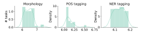
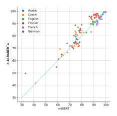
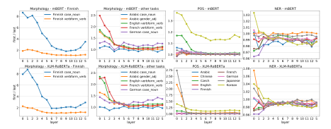
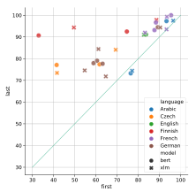
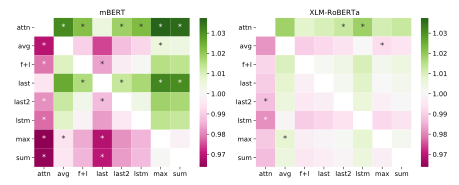
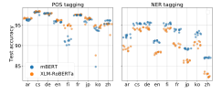
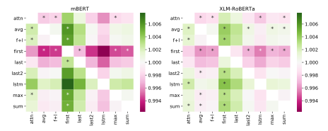
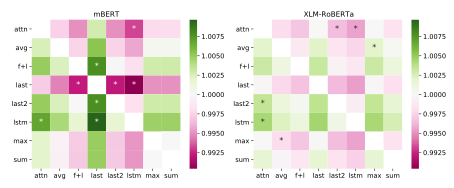

# Subword Pooling Makes a Difference

# Judit Acs ´ 1,3

Budapest University of Technology and Economics1 judit@aut.bme.hu

#### Akos K ´ ad´ ar´ 2 Borealis AI2 akos.kadar@

borealisai.com

### Andras Kornai ´ 1,3 Institute for Computer Science and Control3 andras@kornai.com

### Abstract

Contextual word-representations became a standard in modern natural language processing systems. These models use subword tokenization to handle large vocabularies and unknown words. Word-level usage of such systems requires a way of pooling multiple subwords that correspond to a single word. In this paper we investigate how the choice of subword pooling affects the downstream performance on three tasks: morphological probing, POS tagging and NER, in 9 typologically diverse languages. We compare these in two massively multilingual models, mBERT and XLM-RoBERTa. For morphological tasks, the widely used 'choose the first subword' is the worst strategy and the best results are obtained by using attention over the subwords. For POS tagging both of these strategies perform poorly and the best choice is to use a small LSTM over the subwords. The same strategy works best for NER and we show that mBERT is better than XLM-RoBERTa in all 9 languages. We publicly release all code, data and the full result tables at [https://github.](https://github.com/juditacs/subword-choice) [com/juditacs/subword-choice](https://github.com/juditacs/subword-choice).

### 1 Introduction

Training of contextual language models on large training corpora generally begins with segmenting the input into subwords [\(Schuster and Nakajima,](#page-8-0) [2012\)](#page-8-0) to reduce the vocabulary size. Since most tasks consume full words, practitioners have the freedom to decide whether to use the first, the last, or some combination of all subwords. The original paper introducing BERT, [Devlin et al.](#page-8-1) [\(2019\)](#page-8-1), suggests using the first subword for named entity recognition (NER), and did not explore different poolings. [Kondratyuk and Straka](#page-8-2) [\(2019\)](#page-8-2) also use the first subword, for dependency parsing, and remark in a footnote that they tried the first, last, average, and max pooling but the choice made no

difference. [Kitaev et al.](#page-8-3) [\(2019\)](#page-8-3) report similar findings for constituency parsing, but nevertheless opt for reporting results only using the last subword. [Hewitt and Manning](#page-8-4) [\(2019\)](#page-8-4) take the average of the subword vectors for syntactic and word sense disambiguation tasks. [Wu et al.](#page-8-5) [\(2020\)](#page-8-5) use attentive pooling with a trainable norm for news topic classification and sentiment analysis in English. [Shen](#page-8-6) [et al.](#page-8-6) [\(2018\)](#page-8-6) use hierarchical pooling for sequence classification tasks in English and Chinese.

Here we show that for word-level tasks (morphological, POS and NER tagging), particularly for languages where the proportion of multi-subword tokens (i.e. those word tokens that are split into more than one subword) is high, more care needs to be taken as both pooling strategy, and that the choice of language matters. We demonstrate this clearly for European languages with rich morphology, and in Chinese, Japanese and Korean (CJK). Similar to subword pooling, the choice of the lowest layer, the topmost one, or some combination of the activations in different layers has to be made. Here our main focus is subword pooling, but we do discuss layer pooling to the extent it sheds light on our main topic. We observe that the gap between using the first and the last subword unit is larger in lower layers than in higher ones.

We describe our data and tasks in Section [2,](#page-1-0) and the subword pooling strategies investigated in Section [3.](#page-2-0) Our results are presented in Section [4,](#page-3-0) and in Section [5](#page-7-0) we offer our conclusions.

Our main contributions are:

- we show that subword pooling matters, the differences between choices are often significant and not always predictable;
- XLM-RoBERTa [\(Conneau et al.,](#page-8-7) [2019\)](#page-8-7) is slightly better than mBERT in the majority of morphological and POS tagging tasks; while mBERT is better at NER in all languages;

- the common choice of using the first subword is generally worse than using the last one for morphology and POS but the best for NER;
- the difference between using the first and the last subword is larger in lower layers than in higher layers and it is more pronounced in languages with rich morphology than in English;
- the choice of subword pooling makes a large difference for morphological and POS tagging but it is less important for NER;
- we release the code, the data and the full result tables.

## 2 Tasks, languages, and architectures

We investigate pooling through three kinds of tasks. In *morphological* tasks we attempt to predict morphological features such as gender, tense, or case. In *POS* tasks we predict the lexical category associated with each word. In *NER* tasks we assign BIO tags [\(Ramshaw and Marcus,](#page-8-8) [1995\)](#page-8-8) to named entities. We chose word-level, as opposed to syntactic, tasks because they can be tackled with fairly simple architectures and thus allow for a large number of experiments that highlight the differences between subword pooling strategies. Our experiments are limited only by the availability of standardized multilingual data.

We use Universal Dependencies (UD) [\(Nivre](#page-8-9) [et al.,](#page-8-9) [2018\)](#page-8-9) for morphological and POS tasks, and WikiAnn [\(Pan et al.,](#page-8-10) [2017\)](#page-8-10) for NER. We pick the largest treebank in each language from UD and sample 2000 train, 200 dev and 200 test sentences for the morphological probes and up to 10,000 train, 2000 dev and 2000 test sentences – often limited by the size of the treebank – for POS. We chose languages with reasonably large treebanks in order to generate enough training data, making sure we have an example from each language family, as well as one from European subfamilies since their treebanks tend to be very large. We use 10,000 train, 2000 dev and 2000 test sentences for NER. Preprocessing steps are further explained in Appendix [A.](#page-8-11) Our choice of languages are Arabic, Chinese, Czech, English, Finnish, French, German, Japanese, and Korean. UD's gold tokenization is kept and we run subword tokenization on individual tokens rather then the full sentences.

Morphological tasks UD assigns zero or more tag-value pairs to each token such as VerbForm=Ger for 'asking'. We define a probe as a triplet of hlanguage, tag, POSi, i.e. we train a classifier to predict the value of a single tag in a sentence in a particular language.[1](#page-1-1) The task hEnglish, VerbForm, VERBi would be trained to predict one of three labels for each English verb: finite, infinite or gerund. We pick 4 tasks that are applicable to at least 3 of the 6 languages where the task makes sense (there are no morphological tags for Chinese and Japanese, and Korean uses a different tagging scheme). Table [1](#page-2-1) lists the probing tasks.

Part-of-speech tagging assigns a syntactic category to each token in the sentence. Usually treated as a crucial low level task to provide useful features for higher level linguistic analysis such as syntactic and semantic parsing. Universal POS tags (UPOS) are available in UD in all 9 languages.

Named entity recognition is a classic information extraction subtask that seeks to identify the span of named entities mentioned in the sentence and classify them into pre-defined categories such as person names, organizations, locations etc. NER was the only token level task explored in the original BERT paper [Devlin et al.](#page-8-1) [\(2019\)](#page-8-1).

Architectures BERT and other contextual models use subword tokenizers that generate one or more subwords for each token. In this study we compared mBERT and XLM-RoBERTa, two Transformer-based large scale language models with support for over 100 languages. We pick these two since they are architecturally similar (both have 12 layers and the same hidden size) making our comparison easier. mBERT was trained on Wikipedia while XLM-RoBERTa was trained on CommonCrawl [\(Wenzek et al.,](#page-8-12) [2020\)](#page-8-12). Both models have been extensively applied to English and multilingual tasks, but generally at the sentence or sentence pair level, where subword issues do not come to the fore. mBERT uses a common wordpiece vocabulary with 118k subword units. When a word is split into multiple subword units, each token that is not the first one is prefixed with ##. XLM-RoBERTa's vocabulary was trained in a similar fashion but with 250k units and a special start symbol (Unicode lower eights block) instead of

1Consolidating these triplets across POS would be misleading in that the results show large variation across different POS values.

| Language | Tag      | POS  | # class |
|----------|----------|------|---------|
| Arabic   | case     | NOUN | 3       |
| Arabic   | gender   | ADJ  | 2       |
| Czech    | gender   | ADJ  | 3       |
| Czech    | gender   | NOUN | 3       |
| English  | verbform | VERB | 4       |
| Finnish  | case     | NOUN | 12      |
| Finnish  | verbform | VERB | 3       |
| French   | gender   | ADJ  | 2       |
| French   | gender   | NOUN | 2       |
| French   | verbform | VERB | 3       |
| German   | case     | NOUN | 4       |
| German   | gender   | ADJ  | 3       |
| German   | gender   | NOUN | 3       |
| German   | verbform | VERB | 3       |

Table 1: List of morphological probing tasks. The last column is the number of classes in a particular task.

continuation symbols. Each word is prefixed with this start symbol before it is tokenized into one or more subword units. These start symbols are often then tokenized as single units, particularly before Chinese, Japanese and Korean characters, therefore artificially increasing the subword unit count. We indicate the proportion of words starting with a standalone start symbol along with other tokenization statistics in Table [2.](#page-2-2)

As Table [2](#page-2-2) shows, the number of subword tokens is highly dependent on the language. English words are only split in 14.3% (resp. 16.9%) of the time by the two models, while in many other languages more than half of the words are tokenized into two or more subword units. We hypothesize that this is due to the combination of the characteristics of the English language and its overrepresentation in the training data and the subword vocabulary.

We also observe that the two models' tokenizers work in very different ways. Out of the 2800 morphological test examples, only 58 are tokenized the same way and 51 of these are not split into multiple subwords. Only 7 words that are in fact tokenized, are tokenized the same way. Although the full tokenization is rarely the same, the first and the last subwords are the same in 45.5% and in 44.7% of the cases.

|          | mBERT |      | XLM-RoBERTa |      |       |  |  |  |
|----------|-------|------|-------------|------|-------|--|--|--|
|          | count | 2+   | count       | 2+   | start |  |  |  |
| Arabic   | 1.95  | 48.9 | 1.49        | 35.0 | 3.4   |  |  |  |
| Chinese  | 1.58  | 53.5 | 2.13        | 88.5 | 86.6  |  |  |  |
| Czech    | 2.04  | 53.0 | 1.7         | 45.2 | 1.6   |  |  |  |
| English  | 1.25  | 14.3 | 1.25        | 16.9 | 0.8   |  |  |  |
| Finnish  | 2.32  | 67.3 | 1.86        | 53.0 | 2.3   |  |  |  |
| French   | 1.34  | 22.4 | 1.41        | 28.7 | 2.1   |  |  |  |
| German   | 1.64  | 30.6 | 1.57        | 29.7 | 1.3   |  |  |  |
| Japanese | 1.6   | 43.0 | 2.25        | 94.6 | 92.9  |  |  |  |
| Korean   | 2.44  | 75.7 | 2.16        | 67.3 | 9.0   |  |  |  |

Table 2: Subword tokenization statistics by language and model. First and third columns: average number of pieces that one word is split into. Second and fourth columns: proportion of multi-subword words. Last column: proportion of words that start with a standalone start token in XLM-RoBERTa.

### 3 Subword pooling

We test 9 types of pooling methods listed in Table [3](#page-2-3) and grouped in three broad types. The first group uses the first and last subword representations in some combination. In F+L pooling the mixing weight is the only learned parameter. The second group are parameter-free elementwise pooling operations.

| Method | Explanation                                                    | Params |
|--------|----------------------------------------------------------------|--------|
| FIRST  | first subword unit                                             | none   |
| LAST   | last subword unit                                              | none   |
| LAST2  | concatenation of the last two subword units                 | none   |
| F+L    | − wufirst + (1 w)ulast                                | w      |
| SUM    | elementwise sum                                                | none   |
| MAX    | elementwise max                                                | none   |
| AVG    | elementwise average                                            | none   |
| ATTN   | Attention over the subwords, weights generated by an MLP | MLP    |
| LSTM   | biLSTM reads all vectors, final hidden state                | LSTM   |

Table 3: Subword unit pooling methods. ufirst and ulast refer to the first and the last units respectively.

The last two methods rely on small neural networks that learn to combine the subword representations. Our subword ATTN has one hidden layer of 50 neurons with ReLU activation and a final softmax layer that generates a probability distribution over the subword units of the token. Similarly to self-attention, these probabilities are used to compute the weighted sum of subword representations to produce the final token vector. The LSTM uses a biLSTM (Hochreiter and Schmidhuber, 1997) that summarizes the 768-dimensional vectors (the hidden size of both models) into a 50-dimensional hidden vector in each direction, which are then concatenated and passed onto the classifier. These two are considerably more complicated and slower to train than the other methods, but ATTN works well for morphological tasks, and LSTM for POS tagging in CJK languages. Shen et al. (2018) found hierarchical pooling beneficial, but they investigated sentence level tasks where the subword stream is much longer than in the word-level tasks we are considering (words are rarely split into more than 4 subwords) and hierarchical pooling has better traction.

**Layer pooling effects** Both mBERT and XLM-RoBERTa have an embedding layer followed by 12 hidden layers. The only contextual information available in the embedding layer is the position of the token in the sentence. Hidden activations are computed with the self-attention layers, therefore in theory have access to the full sentence. We ran our experiments for each layer separately as well as for the sum of all layers. For all tasks, as we move up the layers, results also move up or down in tandem. As exhaustive experiments considering different combinations of layers were computationally too expensive for our setup, and would significantly complicate presentation of our results, we pick a single setting for all experiments by computing the best *expected layer* for each task as

$$\mathbb{E}(L) = \frac{\sum_{l_i \in L} iA(l_i)}{\sum_{l_i \in L} A(l_i)},\tag{1}$$

where L is the set of all layers,  $l_i$  is the ith layer, and  $A(l_i)$  is the development accuracy at layer i. As Figure 1 shows, the expected layers are almost always centered around the 6th layer. Therefore, with the exception of comparing FIRST and LAST, which we analyze in greater detail in 4.1, we chose the 6th layer to simplify the presentation.

Figure 1: Distribution of the weighted average of layers across all tasks.

**Probing setup** Every experiment is trained separately, with no parameter sharing between the tasks and the experiments. We probe the morphology on fixed representations with a small MLP (multilayer perceptron) with a single hidden layer of 50 neurons and ReLU activation. We train the same model for POS tagging and NER on top of each token representation. We keep the number of parameters intentionally low, about 40k, to avoid overfitting on the probing data and to force the MLP to probe the representation instead of memorizing the data. We do note, however, that ATTN and LSTM increase the number of trained parameters to 77k and 330k respectively. We run each configuration 3 times with different random seeds. The standard deviation of results is always less than 0.06 for morphology and less than 0.005 for POS and NER. Further details are available in Appendix B.

Choosing the size of the LSTM LSTM is our subword pooling method with the most parameters. The number of parameters scales quadratically with the hidden dimension of the LSTM. We pick this dimension with binary parameter search on morphology tasks. Our early experiments showed that increasing the size over 1000 showed no significant improvement, and a binary search between 2 and 1024 led us to choose a biLSTM with 100 hidden units.

#### 4 Results

Our analysis consisted of two steps. We first performed the FIRST and LAST tasks at each layer (see Figure 2). Based on the results of this, we picked a single layer, the 6th, to test all 9 subword pooling choices. The full list of results on the 6th layer is listed in Appendix C.

#### 4.1 Layer pooling

We find that although LAST is almost always better than FIRST, the gap is smaller in higher layers. We quantify this with the ratio of the accuracy of LAST and FIRST at the same layer. Figure 2 illustrates this ratio for a few selected morphological tasks

and POS and NER for all 9 languages. We split the morphological tasks into two groups, Finnish tasks and other tasks. (Finnish, Case, NOUN) shows the largest gap in the lower layers, LAST is 8 times better than FIRST. We observe smaller gaps in other tasks. POS shows a fairly uniform picture with the exception of Korean, where FIRST is worse in all layers and both models. Lower layers in mBERT show a larger gap in Czech and the same is true for Chinese and Japanese in XLM-RoBERTa. NER shows little difference between FIRST and LAST except for the first few layers, particularly in Chinese and Korean. To interpret these results, keep in mind that CJK tokenization is handled somewhat arbitrarily by XLM-RoBERTa. particularly in the first subword (c.f. Table 2).

### 4.2 Morphology

We present the results of 14 morphological probing tasks (see Table 1) and 9 subword pooling strategies (see Table 3) using the 6th layer of each model.

Figure 3: Accuracy of mBERT vs. XLM-RoBERTa on morphological tasks.

mBERT vs. XLM-RoBERTa Averaging over all tasks, XLM-RoBERTa achieves 85.7% macro accuracy while mBERT achieves 83.9%. On a perlanguage basis, XLM-RoBERTa is slightly better than mBERT except for French. Figure 3 shows our findings. The two models generally perform similarly with the exception of French and Finnish: mBERT is almost always better at French tasks, while XLM-RoBERTa is always better at Finnish tasks. Similar trends emerge when looking at the results by subword pooling method. XLM-RoBERTa

is always better regardless of the pooling choice but the difference is only significant (p < 0.05) for MAX and SUM.2 These findings suggest that XLM-RoBERTa retains more about the orthographic presentation of a token, and it uses tokenization that is closer to morpheme segmentation, hence performing better at inflectional morphology, which is most often derivable from the word form alone.

First or last subword? As Figure 4 shows, with the exception of the  $\langle$ Arabic, Case, N $\rangle$  task, LAST is always better than FIRST. We find the largest difference in favor of LAST in Finnish and Czech. Table 4 lists all tasks where the difference between FIRST and LAST is larger than 20% along with the only counterexample (where the difference is about 10% in the other direction). These findings are likely due to the fact that Finnish and Czech exhibit the richest inflectional morphology in our sample.

The exceptional behavior of Arabic case may relate to the fact that case often disappears in modern Arabic (Biadsy et al., 2009). When this occurs the first token, being closest to the previous word, may provide a more reliable indicator, especially if that word was a preposition. Given the complex distribution of Arabic case endings, our sample is too small to ascertain this, and the results, about 75% on a 3-way classification task, are clearly too far from the optimum to draw any major conclusion (note that on Finnish case, a 12-way classification task, we get above 94%3).

Other pooling choices While FIRST is clearly inferior in morphology, the picture is less clear for the other 8 pooling strategies. As Figure 5 illustrates, ATTN is better than all other choices for both models but its advantage is only significant over a few other choices. We observe larger – and more often significant – differences in the case of mBERT than in XLM-RoBERTa.

 $^{2}$ We use paired t-tests on the accuracy of the models on the 14 tasks.

&lt;sup>3Finnish has more than 12 cases but infrequent ones were excluded.

Figure 2: LAST-FIRST ratio of the test accuracy of some morphological tasks and of POS and NER in all languages across all layers. We plot Finnish morphological tasks separately since the effect is so pronounced that presenting them on the same plot would render the scaling uninformative for the other cases. S is the sum of all layers. Note that we do not have a strongly prefixing language due to the lack of available probing data.

Figure 4: FIRST vs. LAST on morphological tasks.

| task                                   | model                | first        | last         |
|----------------------------------------|----------------------|--------------|--------------|
| ⟨Finnish, Case, N⟩                     | mBERT                | 33.0         | 90.7         |
| Finnish, Case, N                       | XLM-RoBERTa          | 49.6         | 94.4         |
| Czech, Gender, A                       | mBERT                | 41.5         | 77.1         |
| (Czech, Gender, A)                     | XLM-RoBERTa          | 41.6         | 73.5         |
| ⟨German, Gender, N⟩                    | XLM-RoBERTa          | 61.2         | 84.4         |
| ⟨Arabic, Case, N⟩ ⟨Arabic, Case, N⟩ | XLM-RoBERTa mBERT | 77.1 76.5 | 74.5 73.3 |

Table 4: Morphological tasks with the largest difference between FIRST and LAST. The two tasks where FIRST is better than LAST are also listed.

**Attention weights** The MLP used in ATTN assigns a weight to each subword which are then normalized by softmax. We examine these weights

|        | XLM-RoBERTa | mBERT |
|--------|-------------|-------|
| first  | 7.1%        | 6.0%  |
| last   | 81.5%       | 83.7% |
| middle | 5.9%        | 6.3%  |
| single | 5.5%        | 4.0%  |

Table 5: Distribution of the location of the highest weighted subword. Single refers to tokens that are not split by the tokenizer.

for each token in the test data for morphology. Table 5 lists the proportion of tokens where ATTN assigns the highest weight to the first, last or a middle token, or the token is not split by the tokenizer. The last subword is weighted highest in more than 80% of the cases. The only task where the last subword is not the most frequent winner is  $\langle$  Arabic, Case, N $\rangle$ , where the first is weighted highest in 60% of the tokens by both models. These findings are in line with the behavior of FIRST and LAST.

#### 4.3 POS tagging

We train POS tagging models for 9 languages with 9 subword pooling strategies. We evaluate the models using tag accuracy.

mBERT vs. XLM-RoBERTa As with morphological probing tasks, XLM-RoBERTa is slightly better than mBERT (95.4 vs. 94.6 macro average). We also observe that the choice of subword makes less difference than it does in morphological probing. Figure 6 shows that experiments in one language tend to cluster together regardless of the

Figure 5: Pairwise ratio of test accuracy by subword choice on morphological tasks. Colors indicate row/column ratios. Green cells mean that the row subword choice yields better results than the column choice. \* marks pairs where the difference is statistically significant. ATTN is better than all other choices, therefore its row is green. FIRST is omitted for clarity as it is much worse than the other choices.

subword pooling choice except for a few outliers: FIRST for Chinese and Korean is much worse in both models. The same result can be observed in Japanese, to a lesser extent though. Languagewise we find that XLM-RoBERTa is much better at Finnish and somewhat worse in Chinese but the two models generally perform similarly.

Figure 6: mBERT vs. XLM-RoBERTa for POS tagging and NER.

Choice of subword. As with morphology FIRST the is the worst choice, but the effect is not as marked for POS tasks. In Figure 6 we observe 3 outliers, XLM-RoBERTa, FIRST for Chinese and FIRST for Korean for both models. The only consistent trend is that XLM-RoBERTa is clearly better for Finnish regardless of the choice of subword pooling. The picture is less clear for other languages.

We split the analysis into CJK and non-CJK languages. Figure 7 and Figure 8 show a comparison for non-CJK languages and CJK languages respectively. The difference between choices is generally much smaller than for morphology. FIRST is the worst choice both for CJK and non-CJK languages. Interestingly one of the best choices for morphology.

ogy, LAST, is the second worst choice for POS tagging, while one of the worst for morphology, LSTM, is one of the best for POS tagging. We hypothesize that this is due to overparametrization for morphology. POS tagging is a much more complex task that needs a larger number of trainable parameters (recall that LSTM parameters are shared across all tokens).

#### 4.4 Named entity recognition

As Figure 6 shows, in NER the choice of subword pooling makes far less difference than in morphology. In terms of models, mBERT has a clear advantage over XLM-RoBERTa when it comes to NER. The difference between the two models is generally larger than the difference between two subword choices within the same language. The smallest difference between the two models appears to be in Czech, Finnish and German, which all have rich, partially agglutinative, morphology. This fits with our earlier findings that showed that XLM-RoBERTa might be better at handling rich morphology. Overall FIRST and the related F+L as well as LSTM come out as winners, the differences are rather small and often not statistically significant for CJK.

### 4.5 Discussion

Throughout our extensive experiments we observed that pooling strategies can have a significant impact on the conclusions drawn from probing experiments. When considering multiple typologically different languages, the strength of the conclusions

Figure 7: Subword choices for POS tagging in non-CJK languages. See Figure [5](#page-6-0) for an explanation of the figure. FIRST is included.

Figure 8: Subword choices for POS tagging in CJK languages. See Figure [5](#page-6-0) for an explanation of the figure. FIRST is omitted for clarity as it is much worse than the other choices.

drawn from experiments can be weakened by considering a single pooling option. Our recommendation for NLP practitioners is to try at least three subword pooling strategies, particularly for tasks in languages other than English. FIRST and LAST usually gives a general picture – as a third control we recommend ATTN and LSTM. More complicated tasks such as POS or NER tagging may require LSTM with many parameters, while tasks that rely more on the orthographic representation such as morphology tend to benefit from ATTN.

One of the greatest attractions of the current generation of models is that they do away with laborintensive feature engineering. Currently, subword pooling acts as the little finderscope mounted on the side of the main telescope to get it to point in the right region, but over the long haul we expect the systems to develop in a way that pooling also becomes part of the end to end process.

Our methodology is only limited by the availability of data. It would be interesting to extend these study with languages that use prefixes too such as Indonesian or Swahili.

# 5 Conclusion

The key takeaway from our work is that performance on lower level tasks depends on the way we pool over multiple subword units that belong in a single word token. This is more of an issue in languages other than English, where a significantly larger proportion of words are represented by multiple subword units.

Morphological and POS tasks are both probing word-level attributes, but the results show huge disparity: for the morphological tasks FIRST pooling is the worst strategy, and ATTN is the best, while for POS tagging ATTN is almost as bad as FIRST, the best being LSTM. The NER task is intermediary between word- and phrase-level, and subword pooling effects are less marked, but still statistically significant (see the full result tables in the Appendix).

## Acknowledgments

This work was partially supported by the BME Artificial Intelligence TKP2020 IE grant of NK-FIH Hungary (BME IE-MI-SC TKP2020) and by the Hungarian Ministry of Innovation and the National Research, Development and Innovation Office within the framework of the Artificial Intelligence National Laboratory Programme.

# References

- Fadi Biadsy, Nizar Habash, and Julia Hirschberg. 2009. Improving the Arabic pronunciation dictionary for phone and word recognition with linguisticallybased pronunciation rules. In *Proceedings of human language technologies: The 2009 annual conference of NAACL*, pages 397–405.
- Alexis Conneau, Kartikay Khandelwal, Naman Goyal, Vishrav Chaudhary, Guillaume Wenzek, Francisco Guzman, Edouard Grave, Myle Ott, Luke Zettle- ´ moyer, and Veselin Stoyanov. 2019. [Unsupervised](http://arxiv.org/abs/1911.02116) [cross-lingual representation learning at scale.](http://arxiv.org/abs/1911.02116)
- Jacob Devlin, Ming-Wei Chang, Kenton Lee, and Kristina Toutanova. 2019. [BERT: Pre-training of](https://doi.org/10.18653/v1/N19-1423) [deep bidirectional transformers for language under](https://doi.org/10.18653/v1/N19-1423)[standing.](https://doi.org/10.18653/v1/N19-1423) In *Proceedings of the 2019 Conference of the North American Chapter of the Association for Computational Linguistics: Human Language Technologies, Volume 1 (Long and Short Papers)*, pages 4171–4186, Minneapolis, Minnesota. Association for Computational Linguistics.
- John Hewitt and Christopher D Manning. 2019. A structural probe for finding syntax in word representations. In *Proceedings of the 2019 Conference of the North American Chapter of the Association for Computational Linguistics: Human Language Technologies, Volume 1 (Long and Short Papers)*, pages 4129–4138.
- Sepp Hochreiter and Jurgen Schmidhuber. 1997. ¨ Long short-term memory. *Neural Computation*, 9(8):1735–1780.
- Diederik P Kingma and Jimmy Ba. 2014. [Adam: A](https://arxiv.org/abs/1412.6980) [method for stochastic optimization.](https://arxiv.org/abs/1412.6980) *arXiv preprint arXiv:1412.6980*.
- Nikita Kitaev, Steven Cao, and Dan Klein. 2019. [Multi](https://doi.org/10.18653/v1/P19-1340)[lingual constituency parsing with self-attention and](https://doi.org/10.18653/v1/P19-1340) [pre-training.](https://doi.org/10.18653/v1/P19-1340) In *Proceedings of the 57th Annual Meeting of the Association for Computational Linguistics*, pages 3499–3505, Florence, Italy. Association for Computational Linguistics.

- Dan Kondratyuk and Milan Straka. 2019. [75 lan](https://doi.org/10.18653/v1/D19-1279)[guages, 1 model: Parsing universal dependencies](https://doi.org/10.18653/v1/D19-1279) [universally.](https://doi.org/10.18653/v1/D19-1279) In *Proceedings of the 2019 Conference on Empirical Methods in Natural Language Processing and the 9th International Joint Conference on Natural Language Processing (EMNLP-IJCNLP)*, pages 2779–2795, Hong Kong, China. Association for Computational Linguistics.
- Joakim Nivre, Mitchell Abrams, Zeljko Agi ˇ c, et al. ´ 2018. [Universal Dependencies 2.3.](http://hdl.handle.net/11234/1-2895) LIN-DAT/CLARIN digital library at the Institute of Formal and Applied Linguistics (UFAL), Faculty of ´ Mathematics and Physics, Charles University.
- Xiaoman Pan, Boliang Zhang, Jonathan May, Joel Nothman, Kevin Knight, and Heng Ji. 2017. [Cross](https://doi.org/10.18653/v1/P17-1178)[lingual name tagging and linking for 282 languages.](https://doi.org/10.18653/v1/P17-1178) In *Proceedings of the 55th Annual Meeting of the Association for Computational Linguistics (Volume 1: Long Papers)*, pages 1946–1958, Vancouver, Canada. Association for Computational Linguistics.
- Lance Ramshaw and Mitch Marcus. 1995. Text chunking using transformation-based learning. In *Proceedings of the Third Workshop on Very Large Corpora*, pages 82–94, Cambridge, MA. SIGDAT/ACL.
- Mike Schuster and Kaisuke Nakajima. 2012. Japanese and Korean voice search. In *2012 IEEE International Conference on Acoustics, Speech and Signal Processing (ICASSP)*, pages 5149–5152. IEEE.
- Dinghan Shen, Guoyin Wang, Wenlin Wang, Martin Renqiang Min, Qinliang Su, Yizhe Zhang, Chunyuan Li, Ricardo Henao, and Lawrence Carin. 2018. Baseline needs more love: On simple wordembedding-based models and associated pooling mechanisms. In *Proceedings of the 56th Annual Meeting of the Association for Computational Linguistics (Volume 1: Long Papers)*, pages 440–450.
- Guillaume Wenzek, Marie-Anne Lachaux, Alexis Conneau, Vishrav Chaudhary, Francisco Guzman, Ar- ´ mand Joulin, and Edouard Grave. 2020. Ccnet: Ex- ´ tracting high quality monolingual datasets from web crawl data. In *Proceedings of The 12th Language Resources and Evaluation Conference*, pages 4003– 4012.
- Chuhan Wu, Fangzhao Wu, Tao Qi, Xiaohui Cui, and Yongfeng Huang. 2020. Attentive pooling with learnable norms for text representation. In *Proceedings of the 58th Annual Meeting of the Association for Computational Linguistics*, pages 2961–2970.

### Appendices

### A Data preparation

### A.1 Morphological probes

We extract 2000 train, 200 dev and 200 test sentences for each task. We keep UD's original splits, in other words, all of our train sentences come from

UD's train set. We sample the sentences in a way that avoids overlaps in target words between train, dev and test splits, in other words, if a word is the target in the train set, we do not allow the same target word in the dev or test set. A target word is the word that needs to be classified according to some morphological tag. We also limit class imbalance to 3:1 at max. This results in the removal of rare tags such as a few of the numerous Finnish noun cases. These restrictions and the size of the treebanks do not allow generating larger datasets.

### A.2 POS dataset

We use the largest treebank in each language for POS. The only preprocessing we do is that we filter sentences longer than 40 tokens. Since this results in an uneven distribution in the training size, we limit the number of training sentences to 2000. We note that experiments using 10,000 sentences are underway but due to resource limitations, we were unable to include them in this version of the paper.

### A.3 NER dataset

NER is sampled from WikiAnn. WikiAnn is a silver standard large scale NER corpus and the number of sentences is over than 100,000 in each language. We deduplicated the dataset and discarded sentences longer than 40 tokens or 200 character in the case of Chinese and Japanese. WikiAnn annotates Chinese and Japanese at the character level. We aligned this with mBERT's tokenizer and retokenized it. Due to memory constraints, we had to cut off the training data size at 10,000.

### B Training details

Each classifier is trained separately from randomly initialized weights with the Adam optimizer [\(Kingma and Ba,](#page-8-15) [2014\)](#page-8-15) with (lr = 0.001, β1 = 0.9, β2 = 0.999) and early stopping on the development set. We report test accuracy scores averaged over 3 runs with different random seeds.

We ran about 14,000 experiments on GeForce RTX 2080 GPUs which took 7 GPU days. We cache mBERT's and XLM-RoBERTa's output when possible. We used PyTorch and our own framework for experiment management. We release the framework along with the final submission.

### C Full result tables

| task                      | model  | FIRST | LAST  | LAST2 | F+L  | SUM  | MAX  | AVG  | ATTN | LSTM |
|---------------------------|--------|-------|-------|-------|------|------|------|------|------|------|
| hArabic, Case, NOUNi      | mBERT  | 76.5  | 73.3  | 74    | 74.8 | 75   | 73.5 | 75   | 75.5 | 74.8 |
| hArabic, Case, NOUNi      | XLM-Ro | 77.1  | 74.5  | 74    | 75.6 | 80.9 | 80.1 | 79.3 | 77.8 | 74.5 |
| hArabic, Gender, ADJi     | mBERT  | 93.3  | 97.3  | 97    | 97.5 | 98.8 | 98.2 | 98.2 | 99.3 | 97.3 |
| hArabic, Gender, ADJi     | XLM-Ro | 96.5  | 97.5  | 97.2  | 97.5 | 99   | 99   | 99   | 99.5 | 97.5 |
| hCzech, Gender, ADJi      | mBERT  | 41.5  | 77.1  | 74    | 72.6 | 64.2 | 63   | 63   | 75.6 | 68.0 |
| hCzech, Gender, ADJi      | XLM-Ro | 41.6  | 73.5  | 71.8  | 70.8 | 64.2 | 65   | 63.2 | 73   | 66.5 |
| hCzech, Gender, NOUNi     | mBERT  | 61.7  | 77.4  | 77.9  | 74.6 | 76.3 | 75.1 | 74.8 | 81.3 | 79.3 |
| hCzech, Gender, NOUNi     | XLM-Ro | 69.3  | 84.1  | 83.3  | 83.7 | 80.6 | 82.4 | 81.1 | 82.9 | 82.4 |
| hEnglish, Verbform, VERBi | mBERT  | 83.7  | 91.2  | 87.2  | 89.2 | 89   | 89.5 | 89.7 | 90.7 | 88.5 |
| hEnglish, Verbform, VERBi | XLM-Ro | 82.7  | 91    | 89.7  | 90.8 | 91.8 | 91.7 | 89   | 91.3 | 89.7 |
| hFinnish, Case, NOUNi     | mBERT  | 33    | 90.7  | 90.7  | 87.7 | 87.4 | 86.2 | 88.1 | 93.9 | 92.0 |
| hFinnish, Case, NOUNi     | XLM-Ro | 49.6  | 94.4  | 94.7  | 94.2 | 94.9 | 95.7 | 95.7 | 96.0 | 95.4 |
| hFinnish, Verbform, VERBi | mBERT  | 74.6  | 92.5  | 91.4  | 92.5 | 89.9 | 90   | 90.9 | 93.2 | 91.9 |
| hFinnish, Verbform, VERBi | XLM-Ro | 88.6  | 97.8  | 97.5  | 97.8 | 96.7 | 97.3 | 97.2 | 97.8 | 96.5 |
| hFrench, Gender, ADJi     | mBERT  | 87.7  | 93.2  | 92.8  | 93.2 | 92.7 | 92.7 | 92.3 | 92.2 | 92.5 |
| hFrench, Gender, ADJi     | XLM-Ro | 83.2  | 92    | 91.7  | 90.5 | 89.7 | 89.3 | 88.7 | 92.5 | 90.3 |
| hFrench, Gender, NOUNi    | mBERT  | 88.3  | 96.7  | 94.7  | 95.2 | 95.3 | 95.2 | 96   | 95.8 | 96.2 |
| hFrench, Gender, NOUNi    | XLM-Ro | 93.3  | 93.5  | 94.8  | 96.0 | 95.8 | 95.7 | 95.2 | 95.8 | 95.8 |
| hFrench, Verbform, VERBi  | mBERT  | 95.5  | 100.0 | 99.7  | 99.5 | 99.7 | 99.3 | 99.5 | 99.8 | 99.5 |
| hFrench, Verbform, VERBi  | XLM-Ro | 93.5  | 99.3  | 99.2  | 99.2 | 99.5 | 99.5 | 99.3 | 99.3 | 99.0 |
| hGerman, Case, NOUNi      | mBERT  | 63.2  | 77.7  | 72    | 75.3 | 74   | 74.5 | 75.3 | 77   | 74.0 |
| hGerman, Case, NOUNi      | XLM-Ro | 64.7  | 71.8  | 70.8  | 77.3 | 74.2 | 75   | 74.2 | 71.3 | 73.7 |
| hGerman, Gender, ADJi     | mBERT  | 58.9  | 77.9  | 78.1  | 73.6 | 67.7 | 70   | 71.6 | 76.1 | 73.0 |
| hGerman, Gender, ADJi     | XLM-Ro | 54.7  | 74.6  | 75.0  | 74.5 | 73.8 | 71.8 | 71.8 | 74   | 69.7 |
| hGerman, Gender, NOUNi    | mBERT  | 60.5  | 79.1  | 78.8  | 78.3 | 77.8 | 78.6 | 78.4 | 79.8 | 76.8 |
| hGerman, Gender, NOUNi    | XLM-Ro | 61.2  | 84.4  | 85.7  | 82.8 | 84.1 | 85.6 | 85.1 | 88.9 | 86.9 |
| hGerman, Verbform, VERBi  | mBERT  | 89.2  | 94.5  | 94.5  | 95.0 | 94.5 | 95.0 | 95.0 | 95.0 | 94.2 |
| hGerman, Verbform, VERBi  | XLM-Ro | 90.4  | 94.4  | 94.7  | 94.2 | 94.4 | 93.9 | 94.4 | 95.0 | 94.7 |

Table 6: Full list of morphological probing results at the 6th layer.

| language | model       | ATTN | AVG  | F+L  | FIRST | LAST | LAST2 | LSTM | MAX  | SUM  |
|----------|-------------|------|------|------|-------|------|-------|------|------|------|
| Arabic   | mBERT       | 96.1 | 96.4 | 96.4 | 96.1  | 96.2 | 96.3  | 96.5 | 96.4 | 96.4 |
| Arabic   | XLM-RoBERTa | 96.5 | 96.8 | 96.8 | 96.6  | 96.6 | 96.7  | 96.8 | 96.7 | 96.8 |
| Chinese  | mBERT       | 95.5 | 96.2 | 96.2 | 95.3  | 95.3 | 96.2  | 96.2 | 96.1 | 96.1 |
| Chinese  | XLM-RoBERTa | 94.9 | 95.3 | 95.4 | 92.6  | 95.3 | 95.4  | 95.4 | 95.1 | 95.4 |
| Czech    | mBERT       | 98.2 | 98.2 | 98.3 | 97.5  | 98.2 | 98.3  | 98.3 | 98.2 | 98.1 |
| Czech    | XLM-RoBERTa | 98.4 | 98.4 | 98.4 | 98.0  | 98.3 | 98.4  | 98.5 | 98.3 | 98.4 |
| English  | mBERT       | 95.8 | 96.0 | 96.0 | 95.5  | 95.7 | 95.8  | 96.0 | 95.8 | 95.7 |
| English  | XLM-RoBERTa | 96.1 | 96.3 | 96.2 | 95.9  | 96.1 | 96.3  | 96.4 | 96.3 | 96.2 |
| Finnish  | mBERT       | 90.9 | 91.4 | 91.1 | 90.1  | 90.2 | 91.6  | 92.3 | 91.2 | 91.2 |
| Finnish  | XLM-RoBERTa | 94.8 | 95   | 95   | 94.3  | 94.1 | 94.9  | 95.3 | 94.9 | 95   |
| French   | mBERT       | 97.4 | 97.6 | 97.5 | 97.4  | 97.4 | 97.4  | 97.4 | 97.5 | 97.6 |
| French   | XLM-RoBERTa | 97.6 | 97.7 | 97.7 | 97.5  | 97.6 | 97.6  | 97.6 | 97.6 | 97.6 |
| German   | mBERT       | 97.8 | 97.9 | 98.0 | 97.4  | 97.9 | 98.0  | 98.0 | 97.9 | 97.9 |
| German   | XLM-RoBERTa | 97.7 | 97.9 | 97.9 | 97.5  | 97.9 | 97.9  | 98.0 | 97.9 | 97.8 |
| Japanese | mBERT       | 96.0 | 96.5 | 96.6 | 95.7  | 95.9 | 96.5  | 96.8 | 96.4 | 96.3 |
| Japanese | XLM-RoBERTa | 96.4 | 96.8 | 96.7 | 95.2  | 96.6 | 96.8  | 97.0 | 96.7 | 96.7 |
| Korean   | mBERT       | 94.1 | 93.7 | 94.3 | 84.8  | 93.6 | 94.3  | 94.5 | 93.7 | 93.8 |
| Korean   | XLM-RoBERTa | 94.9 | 94.7 | 95   | 87.6  | 94.3 | 95    | 95.1 | 94.5 | 94.7 |

Table 7: Full list of POS tagging results at the 6th layer.

| language | model       | ATTN | AVG  | F+L  | FIRST | LAST | LAST2 | LSTM | MAX  | SUM  |
|----------|-------------|------|------|------|-------|------|-------|------|------|------|
| Arabic   | mBERT       | 92.0 | 92.6 | 92.8 | 92.4  | 91.9 | 91.9  | 92.7 | 92.1 | 92.4 |
| Arabic   | XLM-RoBERTa | 88.6 | 89.8 | 89.7 | 89.1  | 88.7 | 89.0  | 90.0 | 89.2 | 89.5 |
| Chinese  | mBERT       | 87.0 | 87   | 87   | 87    | 86.9 | 87.1  | 86.8 | 87.1 | 87.2 |
| Chinese  | XLM-RoBERTa | 82.2 | 83.1 | 83.1 | 82.5  | 82.3 | 83.1  | 83.6 | 82.3 | 83   |
| Czech    | mBERT       | 95.3 | 95.5 | 95.6 | 95.3  | 95.0 | 95.3  | 95.5 | 95.4 | 95.4 |
| Czech    | XLM-RoBERTa | 93.6 | 94.2 | 94.3 | 93.9  | 93.5 | 93.9  | 94.2 | 93.9 | 94   |
| English  | mBERT       | 90.8 | 91.2 | 91.3 | 91    | 90.7 | 90.7  | 91.3 | 91.1 | 91.2 |
| English  | XLM-RoBERTa | 87.7 | 88.5 | 88.5 | 88.3  | 88.0 | 88.1  | 88.4 | 88.3 | 88.4 |
| Finnish  | mBERT       | 95.3 | 95.5 | 95.6 | 95.3  | 94.8 | 95.0  | 95.7 | 95.3 | 95.3 |
| Finnish  | XLM-RoBERTa | 93.7 | 94.4 | 94.3 | 94    | 93.4 | 93.7  | 94.3 | 94.1 | 94.1 |
| French   | mBERT       | 93.8 | 94.1 | 94.1 | 93.8  | 93.2 | 93.5  | 94   | 94.0 | 93.8 |
| French   | XLM-RoBERTa | 89.9 | 90.5 | 90.6 | 90.1  | 89.5 | 89.6  | 90.5 | 90.3 | 90.3 |
| German   | mBERT       | 95.4 | 95.7 | 95.8 | 95.6  | 95.1 | 95.2  | 95.7 | 95.5 | 95.5 |
| German   | XLM-RoBERTa | 94.0 | 94.5 | 94.5 | 94.3  | 93.9 | 94.0  | 94.6 | 94.2 | 94.4 |
| Japanese | mBERT       | 89.2 | 89.3 | 89.3 | 89.4  | 89.0 | 89.0  | 89.3 | 89.3 | 89.1 |
| Japanese | XLM-RoBERTa | 85.8 | 86.4 | 86.4 | 86.3  | 85.8 | 86.0  | 86.6 | 86.0 | 86.3 |
| Korean   | mBERT       | 92.8 | 93.3 | 93.2 | 92.8  | 92.1 | 92.6  | 93.6 | 93.0 | 93.1 |
| Korean   | XLM-RoBERTa | 90.2 | 90.9 | 90.9 | 90    | 89.3 | 90.1  | 91.1 | 90.4 | 90.8 |

Table 8: Full list of NER results at the 6th layer.