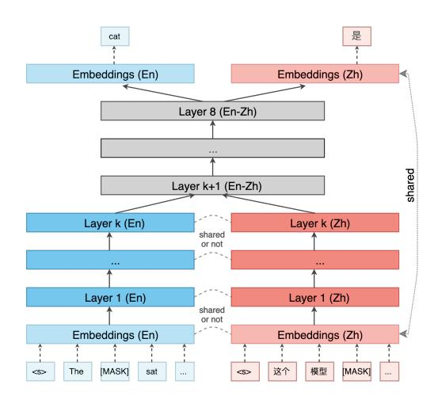
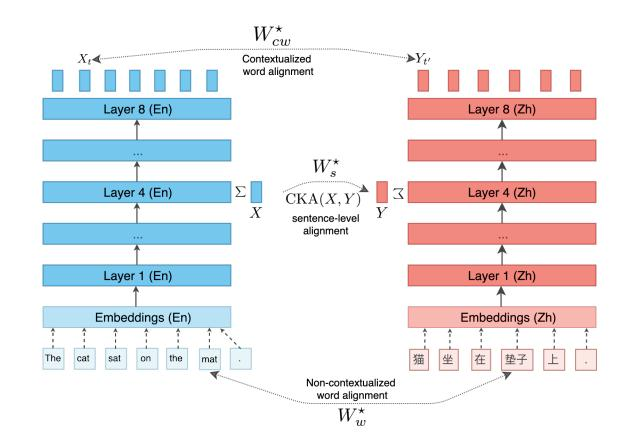
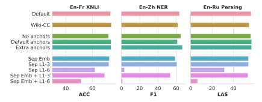
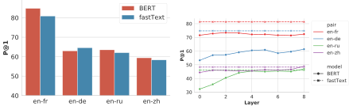
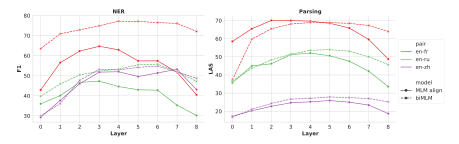
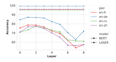
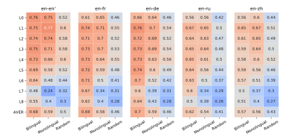
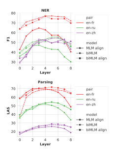

# Emerging Cross-lingual Structure in Pretrained Language Models

Alexis Conneau♥∗ Shijie Wu♠∗ Haoran Li♥ Luke Zettlemoyer♥ Veselin Stoyanov♥ ♠Department of Computer Science, Johns Hopkins University ♥Facebook AI

aconneau@fb.com, shijie.wu@jhu.edu {aimeeli,lsz,ves}@fb.com

# Abstract

We study the problem of multilingual masked language modeling, i.e. the training of a single model on concatenated text from multiple languages, and present a detailed study of several factors that influence why these models are so effective for cross-lingual transfer. We show, contrary to what was previously hypothesized, that transfer is possible even when there is no shared vocabulary across the monolingual corpora and also when the text comes from very different domains. The only requirement is that there are some shared parameters in the top layers of the multi-lingual encoder. To better understand this result, we also show that representations from monolingual BERT models in different languages can be aligned post-hoc quite effectively, strongly suggesting that, much like for non-contextual word embeddings, there are universal latent symmetries in the learned embedding spaces. For multilingual masked language modeling, these symmetries are automatically discovered and aligned during the joint training process.

### 1 Introduction

Multilingual language models such as mBERT [\(De](#page-9-0)[vlin et al.,](#page-9-0) [2019\)](#page-9-0) and XLM [\(Lample and Conneau,](#page-10-0) [2019\)](#page-10-0) enable effective cross-lingual transfer — it is possible to learn a model from supervised data in one language and apply it to another with no additional training. Recent work has shown that transfer is effective for a wide range of tasks [\(Wu](#page-11-0) [and Dredze,](#page-11-0) [2019;](#page-11-0) [Pires et al.,](#page-10-1) [2019\)](#page-10-1). These work speculates why multilingual pretraining works (e.g. shared vocabulary), but only experiment with a single reference mBERT and is unable to systematically measure these effects.

In this paper, we present the first detailed empirical study of the effects of different masked lan-

guage modeling (MLM) pretraining regimes on cross-lingual transfer. Our first set of experiments is a detailed ablation study on a range of zero-shot cross-lingual transfer tasks. Much to our surprise, we discover that language universal representations emerge in pretrained models without the requirement of any shared vocabulary or domain similarity, and even when only a subset of the parameters in the joint encoder are shared. In particular, by systematically varying the amount of shared vocabulary between two languages during pretraining, we show that the amount of overlap only accounts for a few points of performance in transfer tasks, much less than might be expected. By sharing parameters alone, pretraining learns to map similar words and sentences to similar hidden representations.

To better understand these effects, we also analyze multiple monolingual BERT models trained independently. We find that monolingual models trained in different languages learn representations that align with each other surprisingly well, even though they have no shared parameters. This result closely mirrors the widely observed fact that word embeddings can be effectively aligned across languages [\(Mikolov et al.,](#page-10-2) [2013\)](#page-10-2). Similar dynamics are at play in MLM pretraining, and at least in part explain why they aligned so well with relatively little parameter tying in our earlier experiments.

This type of emergent language universality has interesting theoretical and practical implications. We gain insight into why the models transfer so well and open up new lines of inquiry into what properties emerge in common in these representations. They also suggest it should be possible to adapt pretrained models to new languages with little additional training and it may be possible to better align independently trained representations without having to jointly train on all of the (very large) unlabeled data that could be gathered. For example, concurrent work has shown that a pre-

∗Equal contribution. Work done while Shijie was interning at Facebook AI.

trained MLM model can be rapidly fine-tuned to another language [\(Artetxe et al.,](#page-9-1) [2019\)](#page-9-1).

This paper offers the following contributions:

- We provide a detailed ablation study on crosslingual representation of bilingual BERT. We show parameter sharing plays the most important role in learning cross-lingual representation, while shared BPE, shared softmax and domain similarity play a minor role.
- We demonstrate even without any shared subwords (anchor points) across languages, crosslingual representation can still be learned. With bilingual dictionary, we propose a simple technique to create more anchor points by creating synthetic code-switched corpus, benefiting especially distantly-related languages.
- We show monolingual BERTs of different language are similar with each other. Similar to word embeddings [\(Mikolov et al.,](#page-10-2) [2013\)](#page-10-2), we show monolingual BERT can be easily aligned with linear mapping to produce crosslingual representation space at each level.

## 2 Background

Language Model Pretraining Our work follows in the recent line of language model pretraining. ELMo [\(Peters et al.,](#page-10-3) [2018\)](#page-10-3) first popularized representation learning from a language model. The representations are used in a transfer learning setup to improve performance on a variety of downstream NLP tasks. Follow-up work by [Howard](#page-9-2) [and Ruder](#page-9-2) [\(2018\)](#page-9-2); [Radford et al.](#page-10-4) [\(2018\)](#page-10-4) further improves on this idea by fine-tuning the entire language model. BERT [\(Devlin et al.,](#page-9-0) [2019\)](#page-9-0) significantly outperforms these methods by introducing a masked-language model and next-sentence prediction objectives combined with a bi-directional transformer model.

The multilingual version of BERT (dubbed mBERT) trained on Wikipedia data of over 100 languages obtains strong performance on zeroshot cross-lingual transfer without using any parallel data during training [\(Wu and Dredze,](#page-11-0) [2019;](#page-11-0) [Pires et al.,](#page-10-1) [2019\)](#page-10-1). This shows that multilingual representations can emerge from a shared Transformer with a shared subword vocabulary. Crosslingual language model (XLM) pretraining [\(Lam](#page-10-0)[ple and Conneau,](#page-10-0) [2019\)](#page-10-0) was introduced concurrently to mBERT. On top of multilingual masked

language models, they investigate an objective based on parallel sentences as an explicit crosslingual signal. XLM shows that cross-lingual language model pretraining leads to a new state of the art on XNLI [\(Conneau et al.,](#page-9-3) [2018\)](#page-9-3), supervised and unsupervised machine translation [\(Lample et al.,](#page-10-5) [2018\)](#page-10-5). Other work has shown that mBERT outperforms word embeddings on token-level NLP tasks [\(Wu and Dredze,](#page-11-0) [2019\)](#page-11-0), and that adding character-level information [\(Mulcaire et al.,](#page-10-6) [2019\)](#page-10-6) and using multi-task learning [\(Huang et al.,](#page-9-4) [2019\)](#page-9-4) can improve cross-lingual performance.

Alignment of Word Embeddings Researchers working on word embeddings noticed early that embedding spaces tend to be shaped similarly across different languages [\(Mikolov et al.,](#page-10-2) [2013\)](#page-10-2). This inspired work in aligning monolingual embeddings. The alignment was done by using a bilingual dictionary to project words that have the same meaning close to each other [\(Mikolov et al.,](#page-10-2) [2013\)](#page-10-2). This projection aligns the words outside of the dictionary as well due to the similar shapes of the word embedding spaces. Follow-up efforts only required a very small seed dictionary (e.g., only numbers [\(Artetxe](#page-9-5) [et al.,](#page-9-5) [2017\)](#page-9-5)) or even no dictionary at all [\(Conneau](#page-9-6) [et al.,](#page-9-6) [2017;](#page-9-6) [Zhang et al.,](#page-11-1) [2017\)](#page-11-1). Other work has pointed out that word embeddings may not be as isomorphic as thought [\(Søgaard et al.,](#page-11-2) [2018\)](#page-11-2) especially for distantly related language pairs [\(Patra](#page-10-7) [et al.,](#page-10-7) [2019\)](#page-10-7). [Ormazabal et al.](#page-10-8) [\(2019\)](#page-10-8) show joint training can lead to more isomorphic word embeddings space.

[Schuster et al.](#page-10-9) [\(2019\)](#page-10-9) showed that ELMo embeddings can be aligned by a linear projection as well. They demonstrate a strong zero-shot crosslingual transfer performance on dependency parsing. [Wang et al.](#page-11-3) [\(2019\)](#page-11-3) align mBERT representations and evaluate on dependency parsing as well.

Neural Network Activation Similarity We hypothesize that similar to word embedding spaces, language-universal structures emerge in pretrained language models. While computing word embedding similarity is relatively straightforward, the same cannot be said for the deep contextualized BERT models that we study. Recent work introduces ways to measure the similarity of neural network activation between different layers and different models [\(Laakso and Cottrell,](#page-10-10) [2000;](#page-10-10) [Li](#page-10-11) [et al.,](#page-10-11) [2016;](#page-10-11) [Raghu et al.,](#page-10-12) [2017;](#page-10-12) [Morcos et al.,](#page-10-13) [2018;](#page-10-13) [Wang et al.,](#page-11-4) [2018\)](#page-11-4). For example, [Raghu et al.](#page-10-12) [\(2017\)](#page-10-12) use canonical correlation analysis (CCA) and a new method, singular vector canonical correlation analysis (SVCCA), to show that early layers converge faster than upper layers in convolutional neural networks. [Kudugunta et al.](#page-9-7) [\(2019\)](#page-9-7) use SVCCA to investigate the multilingual representations obtained by the encoder of a massively multilingual neural machine translation system [\(Aha](#page-9-8)[roni et al.,](#page-9-8) [2019\)](#page-9-8). [Kornblith et al.](#page-9-9) [\(2019\)](#page-9-9) argues that CCA fails to measure meaningful similarities between representations that have a higher dimension than the number of data points and introduce the centered kernel alignment (CKA) to solve this problem. They successfully use CKA to identify correspondences between activations in networks trained from different initializations.

### 3 Cross-lingual Pretraining

We study a standard multilingual masked language modeling formulation and evaluate performance on several different cross-lingual transfer tasks, as described in this section.

#### 3.1 Multilingual Masked Language Modeling

Our multilingual masked language models follow the setup used by both mBERT and XLM. We use the implementation of [Lample and Conneau](#page-10-0) [\(2019\)](#page-10-0). Specifically, we consider continuous streams of 256 tokens and mask 15% of the input tokens which we replace 80% of the time by a mask token, 10% of the time with the original word, and 10% of the time with a random word. Note the random words could be foreign words. The model is trained to recover the masked tokens from its context [\(Taylor,](#page-11-5) [1953\)](#page-11-5). The subword vocabulary and model parameters are shared across languages. Note the model has a softmax prediction layer shared across languages. We use Wikipedia for training data, preprocessed by Moses [\(Koehn et al.,](#page-9-10) [2007\)](#page-9-10) and Stanford word segmenter (for Chinese only) and BPE [\(Sen](#page-11-6)[nrich et al.,](#page-11-6) [2016\)](#page-11-6) to learn subword vocabulary. During training, we sample a batch of continuous streams of text from one language proportionally to the fraction of sentences in each training corpus, exponentiated to the power 0.7.

Pretraining details Each model is a Transformer [\(Vaswani et al.,](#page-11-7) [2017\)](#page-11-7) with 8 layers, 12 heads and GELU activiation functions [\(Hendrycks and Gim](#page-9-11)[pel,](#page-9-11) [2016\)](#page-9-11). The output softmax layer is tied with input embeddings [\(Press and Wolf,](#page-10-14) [2017\)](#page-10-14). The embeddings dimension is 768, the hidden dimension

of the feed-forward layer is 3072, and dropout is 0.1. We train our models with the Adam optimizer [\(Kingma and Ba,](#page-9-12) [2014\)](#page-9-12) and the inverse square root learning rate scheduler of [Vaswani et al.](#page-11-7) [\(2017\)](#page-11-7) with 10−4 learning rate and 30k linear warmup steps. For each model, we train it with 8 NVIDIA V100 GPUs with 32GB of memory and mixed precision. It takes around 3 days to train one model. We use batch size 96 for each GPU and each epoch contains 200k batches. We stop training at epoch 200 and select the best model based on English dev perplexity for evaluation.

#### 3.2 Cross-lingual Evaluation

We consider three NLP tasks to evaluate performance: natural language inference (NLI), named entity recognition (NER) and dependency parsing (Parsing). We adopt the zero-shot cross-lingual transfer setting, where we (1) fine-tune the pretrained model on English and (2) directly transfer the model to target languages. We select the model and tune hyperparameters with the English dev set. We report the result on average of best two set of hyperparameters.

Fine-tuning details We fine-tune the model for 10 epochs for NER and Parsing and 200 epochs for NLI. We search the following hyperparameter for NER and Parsing: batch size {16, 32}; learning rate {2e-5, 3e-5, 5e-5}. For XNLI, we search: batch size {4, 8}; encoder learning rate {1.25e-6, 2.5e-6, 5e-6}; classifier learning rate {5e-6, 2.5e-5, 1.25e-4}. We use Adam with fixed learning rate for XNLI and warmup the learning rate for the first 10% batch then decrease linearly to 0 for NER and Parsing. We save checkpoint after each epoch.

NLI We use the cross-lingual natural language inference (XNLI) dataset [\(Conneau et al.,](#page-9-3) [2018\)](#page-9-3). The task-specific layer is a linear mapping to a softmax classifier, which takes the representation of the first token as input.

NER We use WikiAnn [\(Pan et al.,](#page-10-15) [2017\)](#page-10-15), a silver NER dataset built automatically from Wikipedia, for English-Russian and English-French. For English-Chinese, we use CoNLL 2003 English [\(Tjong Kim Sang and De Meulder,](#page-11-8) [2003\)](#page-11-8) and a Chinese NER dataset [\(Levow,](#page-10-16) [2006\)](#page-10-16), with realigned Chinese NER labels based on the Stanford word segmenter. We model NER as BIO tagging. The task-specific layer is a linear mapping to a softmax

Figure 1: On the impact of anchor points and parameter sharing on the emergence of multilingual representations. We train bilingual masked language models and remove parameter sharing for the embedding layers and first few Transformers layers to probe the impact of anchor points and shared structure on cross-lingual transfer.

classifier, which takes the representation of the first subword of each word as input. We report spanlevel F1. We adopt a simple post-processing heuristic to obtain a valid span, rewriting standalone I-X into B-X and B-X I-Y I-Z into B-Z I-Z I-Z, following the final entity type. We report the span-level F1.

Parsing Finally, we use the Universal Dependencies (UD v2.3) [\(Nivre,](#page-10-17) [2018\)](#page-10-17) for dependency parsing. We consider the following four treebanks: English-EWT, French-GSD, Russian-GSD, and Chinese-GSD. The task-specific layer is a graphbased parser [\(Dozat and Manning,](#page-9-13) [2016\)](#page-9-13), using representations of the first subword of each word as inputs. We measure performance with the labeled attachment score (LAS).

### 4 Dissecting mBERT/XLM models

We hypothesize that the following factors play important roles in what makes multilingual BERT multilingual: domain similarity, shared vocabulary (or anchor points), shared parameters, and language similarity. Without loss of generality, we focus on bilingual MLM. We consider three pairs of languages: English-French, English-Russian, and English-Chinese.

#### 4.1 Domain Similarity

Multilingual BERT and XLM are trained on the Wikipedia comparable corpora. Domain similarity has been shown to affect the quality of crosslingual word embeddings [\(Conneau et al.,](#page-9-6) [2017\)](#page-9-6),

Figure 2: Probing the layer similarity of monolingual BERT models. We investigate the similarity of separate monolingual BERT models at different levels. We use an orthogonal mapping between the pooled representations of each model. We also quantify the similarity using the centered kernel alignment (CKA) similarity index.

but this effect is not well established for masked language models. We consider domain difference by training on Wikipedia for English and a random subset of Common Crawl of the same size for the other languages (Wiki-CC). We also consider a model trained with Wikipedia only (Default) for comparison.

The first group in Tab. [1](#page-4-0) shows domain mismatch has a relatively modest effect on performance. XNLI and parsing performance drop around 2 points while NER drops over 6 points for all languages on average. One possible reason is that the labeled WikiAnn data for NER consists of Wikipedia text; domain differences between source and target language during pretraining hurt performance more. Indeed for English and Chinese NER, where neither side comes from Wikipedia, performance only drops around 2 points.

#### 4.2 Anchor points

Anchor points are *identical strings* that appear in both languages in the training corpus. Translingual words like *DNA* or *Paris* appear in the Wikipedia of many languages with the same meaning. In mBERT, anchor points are naturally preserved due to joint BPE and shared vocabulary across languages. Anchor point existence has been suggested as a key ingredient for effective cross-lingual transfer since they allow the shared encoder to have at least some direct tying of meaning across different languages [\(Lample and Conneau,](#page-10-0) [2019;](#page-10-0) [Pires et al.,](#page-10-1) [2019;](#page-10-1) [Wu and Dredze,](#page-11-0) [2019\)](#page-11-0). However, this effect

Figure 3: Cross-lingual transfer of bilingual MLM on three tasks and language pairs under different settings. Others tasks and languages pairs follows similar trend. See Tab. 1 for full results.

| Model                    | Domain    | BPE Merges | Anchors Pts | Share Param.   | Softmax       | XNLI (Acc) |      |      | NER (F1) |      |      |      | Parsing (LAS) |      |      |      |          |
|--------------------------|-----------|------------|-------------|----------------|---------------|------------|------|------|----------|------|------|------|---------------|------|------|------|----------|
|                          |           |            |             |                |               | fr         | ru   | zh   | $\Delta$ | fr   | ru   | zh   | $\Delta$      | fr   | ru   | zh   | $\Delta$ |
| Default                  | Wiki-Wiki | 80k        | all         | all            | shared        | 73.6       | 68.7 | 68.3 | 0.0      | 79.8 | 60.9 | 63.6 | 0.0           | 73.2 | 56.6 | 28.8 | 0.0      |
| Domain Similarity (§4.1) |           |            |             |                |               |            |      |      |          |      |      |      |               |      |      |      |          |
| Wiki-CC                  | Wiki-CC   | -          | -           | -              | -             | 74.2       | 65.8 | 66.5 | -1.4     | 74.0 | 49.6 | 61.9 | -6.2          | 71.3 | 54.8 | 25.2 | -2.5     |
| Anchor Points (§4.2)     |           |            |             |                |               |            |      |      |          |      |      |      |               |      |      |      |          |
| No anchors               | -         | 40k/40k    | 0           | -              | -             | 72.1       | 67.5 | 67.7 | -1.1     | 74.0 | 57.9 | 65.0 | -2.4          | 72.3 | 56.2 | 27.4 | -0.9     |
| Default anchors          | -         | 40k/40k    | -           | -              | -             | 74.0       | 68.1 | 68.9 | +0.1     | 76.8 | 56.3 | 61.2 | -3.3          | 73.0 | 57.0 | 28.3 | -0.1     |
| Extra anchors            | -         | -          | extra       | -              | -             | 74.0       | 69.8 | 72.1 | +1.8     | 76.1 | 59.7 | 66.8 | -0.5          | 73.3 | 56.9 | 29.2 | +0.3     |
| Parameter Sharing (§4.3) |           |            |             |                |               |            |      |      |          |      |      |      |               |      |      |      |          |
| Sep Emb                  | -         | 40k/40k    | 0*          | Sep Emb        | lang-specific | 72.7       | 63.6 | 60.8 | -4.5     | 75.5 | 57.5 | 59.0 | -4.1          | 71.7 | 54.0 | 27.5 | -1.8     |
| Sep L1-3                 | -         | 40k/40k    | -           | Sep L1-3       | -             | 72.4       | 65.0 | 63.1 | -3.4     | 74.0 | 53.3 | 60.8 | -5.3          | 69.7 | 54.1 | 26.4 | -2.8     |
| Sep L1-6                 | -         | 40k/40k    | -           | Sep L1-6       | -             | 61.9       | 43.6 | 37.4 | -22.6    | 61.2 | 23.7 | 3.1  | -38.7         | 61.7 | 31.6 | 12.0 | -17.8    |
| Sep Emb + L1-3           | -         | 40k/40k    | 0*          | Sep Emb + L1-3 | lang-specific | 69.2       | 61.7 | 56.4 | -7.8     | 73.8 | 46.8 | 53.5 | -10.0         | 68.2 | 53.6 | 23.9 | -4.3     |
| Sep Emb + L1-6           | -         | 40k/40k    | 0*          | Sep Emb + L1-6 | lang-specific | 51.6       | 35.8 | 34.4 | -29.6    | 56.5 | 5.4  | 1.0  | -47.1         | 50.9 | 6.4  | 1.5  | -33.3    |

Table 1: Dissecting bilingual MLM based on zero-shot cross-lingual transfer performance. - denote the same as the first row (**Default**).  $\Delta$  denote the difference of average task performance between a model and **Default**.

has not been carefully measured.

We present a controlled study of the impact of anchor points on cross-lingual transfer performance by varying the amount of shared subword vocabulary across languages. Instead of using a single joint BPE with 80k merges, we use language-specific BPE with 40k merges for each language. We then build vocabulary by taking the union of the vocabulary of two languages and train a bilingual MLM (**Default anchors**). To remove anchor points, we add a language prefix to each word in the vocabulary before taking the union. Bilingual MLM (**No anchors**) trained with such data has no shared vocabulary across languages. However, it still has a single softmax prediction layer shared across languages and tied with input embeddings.

As Wu and Dredze (2019) suggest there may also be correlation between cross-lingual performance and anchor points, we additionally increase anchor points by using a bilingual dictionary to create code switch data for training bilingual MLM (**Extra anchors**). For two languages,  $\ell_1$  and  $\ell_2$ ,

with bilingual dictionary entries  $d_{\ell_1,\ell_2}$ , we add anchors to the training data as follows. For each training word  $w_{\ell_1}$  in the bilingual dictionary, we either leave it as is (70% of the time) or randomly replace it with one of the possible translations from the dictionary (30% of the time). We change at most 15% of the words in a batch and sample word translations from PanLex (Kamholz et al., 2014) bilingual dictionaries, weighted according to their translation quality  $^1$ .

The second group of Tab. 1 shows cross-lingual transfer performance under the three anchor point conditions. Anchor points have a clear effect on performance and more anchor points help, especially in the less closely related language pairs (e.g. English-Chinese has a larger effect than English-French with over 3 points improvement on NER and XNLI). However, surprisingly, effective transfer is still possible with no anchor points. Com-

&lt;sup>1Although we only consider pairs of languages, this procedure naturally scales to multiple languages, which could produce larger gains in future work.

paring no anchors and default anchors, the performance of XNLI and parsing drops only around 1 point while NER even improve 1 points averaging over three languages. Overall, these results show that we have previously overestimated the contribution of anchor points during multilingual pretraining. Concurrently, [Karthikeyan et al.](#page-9-15) [\(2020\)](#page-9-15) similarly find anchor points play minor role in learning cross-lingual representation.

#### 4.3 Parameter sharing

Given that anchor points are not required for transfer, a natural next question is the extent to which we need to tie the parameters of the transformer layers. Sharing the parameters of the top layer is necessary to provide shared inputs to the task-specific layer. However, as seen in Figure [1,](#page-3-2) we can progressively separate the *bottom* layers 1:3 and 1:6 of the Transformers and/or the embedding layers (including positional embeddings) (Sep Emb; Sep L1-3; Sep L1-6; Sep Emb + L1-3; Sep Emb + L1-6). Since the prediction layer is tied with the embeddings layer, separating the embeddings layer also introduces a language-specific softmax prediction layer for the cloze task. Additionally, we only sample random words within one language during the MLM pretraining. During fine-tuning on the English training set, we freeze the languagespecific layers and only fine-tune the shared layers.

The third group in Tab. [1](#page-4-0) shows cross-lingual transfer performance under different parameter sharing conditions with "Sep" denote which layers is not shared across languages. Sep Emb (effectively no anchor point) drops more than No anchors with 3 points on XNLI and around 1 point on NER and parsing, suggesting have a cross-language softmax layer also helps to learn cross-lingual representations. Performance degrades as fewer layers are shared for all pairs, and again the less closely related language pairs lose the most. Most notably, the cross-lingual transfer performance drops to random when separating embeddings and bottom 6 layers of the transformer. However, reasonably strong levels of transfer are still possible without tying the bottom three layers. These trends suggest that parameter sharing is the key ingredient that enables the learning of an effective cross-lingual representation space, and having language-specific capacity does not help learn a language-specific encoder for cross-lingual representation. Our hypothesis is that the representations that the models

learn for different languages are similarly shaped and models can reduce their capacity budget by aligning representations for text that has similar meaning across languages.

## 4.4 Language Similarity

Finally, in contrast to many of the experiments above, language similarity seems to be quite important for effective transfer. Looking at Tab. [1](#page-4-0) column by column in each task, we observe performance drops as language pairs become more distantly related. Using extra anchor points helps to close the gap. However, the more complex tasks seem to have larger performance gaps and having language-specific capacity does not seem to be the solution. Future work could consider scaling the model with more data and cross-lingual signal to close the performance gap.

#### 4.5 Conclusion

Summarised by Figure [3,](#page-4-2) parameter sharing is the most important factor. More anchor points help but anchor points and shared softmax projection parameters are not necessary for effective crosslingual transfer. Joint BPE and domain similarity contribute a little in learning cross-lingual representation.

## 5 Similarity of BERT Models

To better understand the robust transfer effects of the last section, we show that independently trained monolingual BERT models learn representations that are similar across languages, much like the widely observed similarities in word embedding spaces. In this section, we show that independent monolingual BERT models produce highly similar representations when evaluated at the word level ([§5.1.1\)](#page-6-0), contextual word-level ([§5.1.2\)](#page-6-1), and sentence level ([§5.1.3\)](#page-6-2) . We also plot the cross-lingual similarity of neural network activation with center kernel alignment ([§5.2\)](#page-7-0) at each layer. We consider five languages: English, French, German, Russian, and Chinese.

## 5.1 Aligning Monolingual BERTs

To measure similarity, we learn an orthogonal mapping using the Procrustes [\(Smith et al.,](#page-11-9) [2017\)](#page-11-9) approach:

$$W^* = \underset{W \in O_d(\mathbb{R})}{\operatorname{argmin}} \|WX - Y\|_F = UV^T$$

with UΣV T = SVD(Y XT ), where X and Y are representation of two monolingual BERT models, sampled at different granularities as described below. We apply iterative normalization on X and Y before learning the mapping [\(Zhang et al.,](#page-11-10) [2019\)](#page-11-10).

#### 5.1.1 Word-level alignment

In this section, we align both the non-contextual word representations from the embedding layers, and the contextual word representations from the hidden states of the Transformer at each layer.

For non-contextualized word embeddings, we define X and Y as the word embedding layers of monolingual BERT, which contain a single embedding per word (type). Note that in this case we only keep words containing only one subword. For contextualized word representations, we first encode 500k sentences in each language. At each layer, and for each word, we collect all contextualized representations of a word in the 500k sentences and average them to get a single embedding. Since BERT operates at the subword level, for one word we consider the average of all its subword embeddings. Eventually, we get one word embedding per layer. We use the MUSE benchmark [\(Con](#page-9-6)[neau et al.,](#page-9-6) [2017\)](#page-9-6), a bilingual dictionary induction dataset for alignment supervision and evaluate the alignment on word translation retrieval. As a baseline, we use the first 200k embeddings of fastText [\(Bojanowski et al.,](#page-9-16) [2017\)](#page-9-16) and learn the mapping using the same procedure as [§5.1.](#page-5-1) Note we use a subset of 200k vocabulary of fastText, the same as BERT, to get a comparable number. We retrieve word translation using CSLS [\(Conneau et al.,](#page-9-6) [2017\)](#page-9-6) with K=10.

In Figure [4,](#page-7-1) we report the alignment results under these two settings. Figure [4a](#page-7-2) shows that the subword embeddings matrix of BERT, where each subword is a standalone word, can easily be aligned with an orthogonal mapping and obtain slightly better performance than the same subset of fast-Text. Figure [4b](#page-7-3) shows embeddings matrix with the average of all contextual embeddings of each word can also be aligned to obtain a decent quality bilingual dictionary, although underperforming fastText. We notice that using contextual representations from higher layers obtain better results compared to lower layers.

## 5.1.2 Contextual word-level alignment

In addition to aligning word representations, we also align representations of two monolingual

BERT models in contextual setting, and evaluate performance on cross-lingual transfer for NER and parsing. We take the Transformer layers of each monolingual model up to layer i, and learn a mapping W from layer i of the target model to layer i of the source model. To create that mapping, we use the same Procrustes approach but use a dictionary of parallel contextual words, obtained by running the fastAlign [\(Dyer et al.,](#page-9-17) [2013\)](#page-9-17) model on the 10k XNLI parallel sentences.

For each downstream task, we learn task-specific layers on top of i-th English layer: four Transformer layers and a task-specific layer. We learn these on the training set, but keep the first i pretrained layers freezed. After training these taskspecific parameters, we encode (say) a Chinese sentence with the first i layers of the target Chinese BERT model, project the contextualized representations back to the English space using the W we learned, and then use the task-specific layers for NER and parsing.

In Figure [5,](#page-7-4) we vary i from the embedding layer (layer 0) to the last layer (layer 8) and present the results of our approach on parsing and NER. We also report results using the first i layers of a bilingual MLM (biMLM). [2](#page-6-3) We show that aligning monolingual models (MLM align) obtain relatively good performance even though they perform worse than bilingual MLM, except for parsing on English-French. The results of monolingual alignment generally shows that we can align contextual representations of monolingual BERT models with a simple linear mapping and use this approach for crosslingual transfer. We also observe that the model obtains the highest transfer performance with the middle layer representation alignment, and not the last layers. The performance gap between monolingual MLM alignment and bilingual MLM is higher in NER compared to parsing, suggesting the syntactic information needed for parsing might be easier to align with a simple mapping while entity information requires more explicit entity alignment.

#### 5.1.3 Sentence-level alignment

In this case, X and Y are obtained by average pooling subword representation (excluding special token) of sentences *at each layer* of monolingual BERT. We use multi-way parallel sentences from XNLI for alignment supervision and Tatoeba [\(Schwenk et al.,](#page-11-11) [2019\)](#page-11-11) for evaluation.

2 In Appendix [A,](#page-12-0) we also present the same alignment step with biMLM but only observed improvement in parsing.

(a) Non-contextual word embeddings alignment

(b) Contextual word embedding alignment

Figure 4: Alignment of word-level representations from monolingual BERT models on subset of MUSE benchmark. Figure 4a and Figure 4b are not comparable due to different embedding vocabularies.

Figure 5: Contextual representation alignment of different layers for zero-shot cross-lingual transfer.

Figure 6 shows the sentence similarity search results with nearest neighbor search and cosine similarity, evaluated by precision at 1, with four language pairs. Here the best result is obtained at lower layers. The performance is surprisingly good given we only use 10k parallel sentences to learn the alignment without fine-tuning at all. As a reference, the state-of-the-art performance is over 95%, obtained by LASER (Artetxe and Schwenk, 2019) trained with millions of parallel sentences.

Figure 6: Parallel sentence retrieval accuracy after Procrustes alignment of monolingual BERT models.

#### 5.1.4 Conclusion

These findings demonstrate that both word-level, contextual word-level, and sentence-level BERT representations can be aligned with a simple orthogonal mapping. Similar to the alignment of word embeddings (Mikolov et al., 2013), this shows that BERT models are similar across languages. This result gives more intuition on why mere parameter sharing is sufficient for multilingual representations to emerge in multilingual masked language models.

#### 5.2 Neural network similarity

Based on the work of Kornblith et al. (2019), we examine the centered kernel alignment (CKA), a neural network similarity index that improves upon canonical correlation analysis (CCA), and use it to measure the similarity across both monolingual and bilingual masked language models. The linear CKA is both invariant to orthogonal transformation and isotropic scaling, but are not invertible to any linear transform. The linear CKA similarity measure is defined as follows:

$$\mathrm{CKA}(X,Y) = \frac{\|Y^TX\|_{\mathrm{F}}^2}{(\|X^TX\|_{\mathrm{F}}\|Y^TY\|_{\mathrm{F}})},$$

Figure 7: CKA similarity of mean-pooled multi-way parallel sentence representation at each layers. Note en' corresponds to paraphrases of en obtained from back-translation (en-fr-en'). Random encoder is only used by non-Engligh sentences. L0 is the embeddings layers while L1 to L8 are the corresponding transformer layers. The average row is the average of 9 (L0-L8) similarity measurements.

where X and Y correspond respectively to the matrix of the d-dimensional mean-pooled (excluding special token) subword representations at layer l of the n parallel source and target sentences.

In Figure 7, we show the CKA similarity of monolingual models, compared with bilingual models and random encoders, of multi-way parallel sentences (Conneau et al., 2018) for five languages pair: English to English' (obtained by backtranslation from French), French, German, Russian, and Chinese. The monolingual en' is trained on the same data as en but with different random seed and the bilingual en-en' is trained on English data but with separate embeddings matrix as in §4.3. The rest of the bilingual MLM is trained with the Default setting. We only use random encoder for non-English sentences.

Figure 7 shows bilingual models have slightly higher similarity compared to monolingual models with random encoders serving as a lower bound. Despite the slightly lower similarity between monolingual models, it still explains the alignment performance in §5.1. Because the measurement is also invariant to orthogonal mapping, the CKA similarity is highly correlated with the sentence-level alignment performance in Figure 6 with over 0.9 Pearson correlation for all four languages pairs. For monolingual and bilingual models, the first few layers have the highest similarity, which explains why Wu and Dredze (2019) finds freezing bottom layers of mBERT helps cross-lingual transfer. The similarity gap between monolingual model and bilingual

model decrease as the languages pair become more distant. In other words, when languages are similar, using the same model increase representation similarity. On the other hand, when languages are dissimilar, using the same model does not help representation similarity much. Future work could consider how to best train multilingual models covering distantly related languages.

#### 6 Discussion

In this paper, we show that multilingual representations can emerge from unsupervised multilingual masked language models with only parameter sharing of some Transformer layers. Even without any anchor points, the model can still learn to map representations coming from different languages in a single shared embedding space. We also show that isomorphic embedding spaces emerge from monolingual masked language models in different languages, similar to word2vec embedding spaces (Mikolov et al., 2013). By using a linear mapping, we are able to align the embedding layers and the contextual representations of Transformers trained in different languages. We also use the CKA neural network similarity index to probe the similarity between BERT Models and show that the early layers of the Transformers are more similar across languages than the last layers. All of these effects were stronger for more closely related languages, suggesting there is room for significant improvements on more distant language pairs.

## References

- Roee Aharoni, Melvin Johnson, and Orhan Firat. 2019. [Massively multilingual neural machine translation.](https://doi.org/10.18653/v1/N19-1388) In *Proceedings of the 2019 Conference of the North American Chapter of the Association for Computational Linguistics: Human Language Technologies, Volume 1 (Long and Short Papers)*, pages 3874–3884, Minneapolis, Minnesota. Association for Computational Linguistics.
- Mikel Artetxe, Gorka Labaka, and Eneko Agirre. 2017. [Learning bilingual word embeddings with \(almost\)](https://doi.org/10.18653/v1/P17-1042) [no bilingual data.](https://doi.org/10.18653/v1/P17-1042) In *Proceedings of the 55th Annual Meeting of the Association for Computational Linguistics (Volume 1: Long Papers)*, pages 451–462, Vancouver, Canada. Association for Computational Linguistics.
- Mikel Artetxe, Sebastian Ruder, and Dani Yogatama. 2019. On the cross-lingual transferability of monolingual representations. *arXiv preprint arXiv:1910.11856*.
- Mikel Artetxe and Holger Schwenk. 2019. Massively multilingual sentence embeddings for zeroshot cross-lingual transfer and beyond. *Transactions of the Association for Computational Linguistics*, 7:597–610.
- Piotr Bojanowski, Edouard Grave, Armand Joulin, and Tomas Mikolov. 2017. [Enriching word vectors with](https://doi.org/10.1162/tacl_a_00051) [subword information.](https://doi.org/10.1162/tacl_a_00051) *Transactions of the Association for Computational Linguistics*, 5:135–146.
- Alexis Conneau, Guillaume Lample, Marc'Aurelio Ranzato, Ludovic Denoyer, and Herve J ´ egou. 2017. ´ Word translation without parallel data. *arXiv preprint arXiv:1710.04087*.
- Alexis Conneau, Ruty Rinott, Guillaume Lample, Adina Williams, Samuel Bowman, Holger Schwenk, and Veselin Stoyanov. 2018. [XNLI: Evaluating](https://doi.org/10.18653/v1/D18-1269) [cross-lingual sentence representations.](https://doi.org/10.18653/v1/D18-1269) In *Proceedings of the 2018 Conference on Empirical Methods in Natural Language Processing*, pages 2475–2485, Brussels, Belgium. Association for Computational Linguistics.
- Jacob Devlin, Ming-Wei Chang, Kenton Lee, and Kristina Toutanova. 2019. [BERT: Pre-training of](https://doi.org/10.18653/v1/N19-1423) [deep bidirectional transformers for language under](https://doi.org/10.18653/v1/N19-1423)[standing.](https://doi.org/10.18653/v1/N19-1423) In *Proceedings of the 2019 Conference of the North American Chapter of the Association for Computational Linguistics: Human Language Technologies, Volume 1 (Long and Short Papers)*, pages 4171–4186, Minneapolis, Minnesota. Association for Computational Linguistics.
- Timothy Dozat and Christopher D Manning. 2016. Deep biaffine attention for neural dependency parsing. *arXiv preprint arXiv:1611.01734*.
- Chris Dyer, Victor Chahuneau, and Noah A. Smith. 2013. [A simple, fast, and effective reparameter](https://www.aclweb.org/anthology/N13-1073)[ization of IBM model 2.](https://www.aclweb.org/anthology/N13-1073) In *Proceedings of the*

- *2013 Conference of the North American Chapter of the Association for Computational Linguistics: Human Language Technologies*, pages 644–648, Atlanta, Georgia. Association for Computational Linguistics.
- Dan Hendrycks and Kevin Gimpel. 2016. Gaussian error linear units (gelus). *arXiv preprint arXiv:1606.08415*.
- Jeremy Howard and Sebastian Ruder. 2018. [Universal](https://doi.org/10.18653/v1/P18-1031) [language model fine-tuning for text classification.](https://doi.org/10.18653/v1/P18-1031) In *Proceedings of the 56th Annual Meeting of the Association for Computational Linguistics (Volume 1: Long Papers)*, pages 328–339, Melbourne, Australia. Association for Computational Linguistics.
- Haoyang Huang, Yaobo Liang, Nan Duan, Ming Gong, Linjun Shou, Daxin Jiang, and Ming Zhou. 2019. [Unicoder: A universal language encoder by pre](https://doi.org/10.18653/v1/D19-1252)[training with multiple cross-lingual tasks.](https://doi.org/10.18653/v1/D19-1252) In *Proceedings of the 2019 Conference on Empirical Methods in Natural Language Processing and the 9th International Joint Conference on Natural Language Processing (EMNLP-IJCNLP)*, pages 2485–2494, Hong Kong, China. Association for Computational Linguistics.
- David Kamholz, Jonathan Pool, and Susan Colowick. 2014. [PanLex: Building a resource for pan](http://www.lrec-conf.org/proceedings/lrec2014/pdf/1029_Paper.pdf)[lingual lexical translation.](http://www.lrec-conf.org/proceedings/lrec2014/pdf/1029_Paper.pdf) In *Proceedings of the Ninth International Conference on Language Resources and Evaluation (LREC'14)*, pages 3145– 3150, Reykjavik, Iceland. European Language Resources Association (ELRA).
- K Karthikeyan, Zihan Wang, Stephen Mayhew, and Dan Roth. 2020. Cross-lingual ability of multilingual bert: An empirical study.
- Diederik P Kingma and Jimmy Ba. 2014. Adam: A method for stochastic optimization. *arXiv preprint arXiv:1412.6980*.
- Philipp Koehn, Hieu Hoang, Alexandra Birch, Chris Callison-Burch, Marcello Federico, Nicola Bertoldi, Brooke Cowan, Wade Shen, Christine Moran, Richard Zens, Chris Dyer, Ondˇrej Bojar, Alexandra Constantin, and Evan Herbst. 2007. [Moses: Open](https://www.aclweb.org/anthology/P07-2045) [source toolkit for statistical machine translation.](https://www.aclweb.org/anthology/P07-2045) In *Proceedings of the 45th Annual Meeting of the Association for Computational Linguistics Companion Volume Proceedings of the Demo and Poster Sessions*, pages 177–180, Prague, Czech Republic. Association for Computational Linguistics.
- Simon Kornblith, Mohammad Norouzi, Honglak Lee, and Geoffrey Hinton. 2019. Similarity of neural network representations revisited. *International Conference on Machine Learning*.
- Sneha Kudugunta, Ankur Bapna, Isaac Caswell, and Orhan Firat. 2019. [Investigating multilingual NMT](https://doi.org/10.18653/v1/D19-1167) [representations at scale.](https://doi.org/10.18653/v1/D19-1167) In *Proceedings of the 2019 Conference on Empirical Methods in Natural Language Processing and the 9th International*

- *Joint Conference on Natural Language Processing (EMNLP-IJCNLP)*, pages 1565–1575, Hong Kong, China. Association for Computational Linguistics.
- Aarre Laakso and Garrison Cottrell. 2000. Content and cluster analysis: assessing representational similarity in neural systems. *Philosophical psychology*, 13(1):47–76.
- Guillaume Lample and Alexis Conneau. 2019. Crosslingual language model pretraining. *arXiv preprint arXiv:1901.07291*.
- Guillaume Lample, Myle Ott, Alexis Conneau, Ludovic Denoyer, and Marc'Aurelio Ranzato. 2018. [Phrase-based & neural unsupervised machine trans](https://doi.org/10.18653/v1/D18-1549)[lation.](https://doi.org/10.18653/v1/D18-1549) In *Proceedings of the 2018 Conference on Empirical Methods in Natural Language Processing*, pages 5039–5049, Brussels, Belgium. Association for Computational Linguistics.
- Gina-Anne Levow. 2006. [The third international Chi](https://www.aclweb.org/anthology/W06-0115)[nese language processing bakeoff: Word segmen](https://www.aclweb.org/anthology/W06-0115)[tation and named entity recognition.](https://www.aclweb.org/anthology/W06-0115) In *Proceedings of the Fifth SIGHAN Workshop on Chinese Language Processing*, pages 108–117, Sydney, Australia. Association for Computational Linguistics.
- Yixuan Li, Jason Yosinski, Jeff Clune, Hod Lipson, and John E Hopcroft. 2016. Convergent learning: Do different neural networks learn the same representations? In *Iclr*.
- Tomas Mikolov, Quoc V Le, and Ilya Sutskever. 2013. Exploiting similarities among languages for machine translation. *arXiv preprint arXiv:1309.4168*.
- Ari Morcos, Maithra Raghu, and Samy Bengio. 2018. Insights on representational similarity in neural networks with canonical correlation. In *Advances in Neural Information Processing Systems*, pages 5727–5736.
- Phoebe Mulcaire, Jungo Kasai, and Noah A. Smith. 2019. [Polyglot contextual representations improve](https://doi.org/10.18653/v1/N19-1392) [crosslingual transfer.](https://doi.org/10.18653/v1/N19-1392) In *Proceedings of the 2019 Conference of the North American Chapter of the Association for Computational Linguistics: Human Language Technologies, Volume 1 (Long and Short Papers)*, pages 3912–3918, Minneapolis, Minnesota. Association for Computational Linguistics.
- Joakim et al. Nivre. 2018. [Universal dependencies 2.3.](http://hdl.handle.net/11234/1-2895) LINDAT/CLARIN digital library at the Institute of Formal and Applied Linguistics (UFAL), Faculty of ´ Mathematics and Physics, Charles University.
- Aitor Ormazabal, Mikel Artetxe, Gorka Labaka, Aitor Soroa, and Eneko Agirre. 2019. [Analyzing the lim](https://doi.org/10.18653/v1/P19-1492)[itations of cross-lingual word embedding mappings.](https://doi.org/10.18653/v1/P19-1492) In *Proceedings of the 57th Annual Meeting of the Association for Computational Linguistics*, pages 4990–4995, Florence, Italy. Association for Computational Linguistics.

- Xiaoman Pan, Boliang Zhang, Jonathan May, Joel Nothman, Kevin Knight, and Heng Ji. 2017. [Cross](https://doi.org/10.18653/v1/P17-1178)[lingual name tagging and linking for 282 languages.](https://doi.org/10.18653/v1/P17-1178) In *Proceedings of the 55th Annual Meeting of the Association for Computational Linguistics (Volume 1: Long Papers)*, pages 1946–1958, Vancouver, Canada. Association for Computational Linguistics.
- Barun Patra, Joel Ruben Antony Moniz, Sarthak Garg, Matthew R. Gormley, and Graham Neubig. 2019. [Bilingual lexicon induction with semi-supervision](https://doi.org/10.18653/v1/P19-1018) [in non-isometric embedding spaces.](https://doi.org/10.18653/v1/P19-1018) In *Proceedings of the 57th Annual Meeting of the Association for Computational Linguistics*, pages 184–193, Florence, Italy. Association for Computational Linguistics.
- Matthew Peters, Mark Neumann, Mohit Iyyer, Matt Gardner, Christopher Clark, Kenton Lee, and Luke Zettlemoyer. 2018. [Deep contextualized word rep](https://doi.org/10.18653/v1/N18-1202)[resentations.](https://doi.org/10.18653/v1/N18-1202) In *Proceedings of the 2018 Conference of the North American Chapter of the Association for Computational Linguistics: Human Language Technologies, Volume 1 (Long Papers)*, pages 2227–2237, New Orleans, Louisiana. Association for Computational Linguistics.
- Telmo Pires, Eva Schlinger, and Dan Garrette. 2019. [How multilingual is multilingual BERT?](https://doi.org/10.18653/v1/P19-1493) In *Proceedings of the 57th Annual Meeting of the Association for Computational Linguistics*, pages 4996– 5001, Florence, Italy. Association for Computational Linguistics.
- Ofir Press and Lior Wolf. 2017. [Using the output em](https://www.aclweb.org/anthology/E17-2025)[bedding to improve language models.](https://www.aclweb.org/anthology/E17-2025) In *Proceedings of the 15th Conference of the European Chapter of the Association for Computational Linguistics: Volume 2, Short Papers*, pages 157–163, Valencia, Spain. Association for Computational Linguistics.
- Alec Radford, Karthik Narasimhan, Tim Salimans, and Ilya Sutskever. 2018. Improving language understanding by generative pre-training. *URL https://s3-us-west-2. amazonaws. com/openaiassets/researchcovers/languageunsupervised/language understanding paper. pdf*.
- Maithra Raghu, Justin Gilmer, Jason Yosinski, and Jascha Sohl-Dickstein. 2017. Svcca: Singular vector canonical correlation analysis for deep learning dynamics and interpretability. In *Advances in Neural Information Processing Systems*, pages 6076– 6085.
- Tal Schuster, Ori Ram, Regina Barzilay, and Amir Globerson. 2019. [Cross-lingual alignment of con](https://doi.org/10.18653/v1/N19-1162)[textual word embeddings, with applications to zero](https://doi.org/10.18653/v1/N19-1162)[shot dependency parsing.](https://doi.org/10.18653/v1/N19-1162) In *Proceedings of the 2019 Conference of the North American Chapter of the Association for Computational Linguistics: Human Language Technologies, Volume 1 (Long and Short Papers)*, pages 1599–1613, Minneapolis, Minnesota. Association for Computational Linguistics.

- Holger Schwenk, Vishrav Chaudhary, Shuo Sun, Hongyu Gong, and Francisco Guzman. 2019. Wikimatrix: Mining 135m parallel sentences in 1620 language pairs from wikipedia. *arXiv preprint arXiv:1907.05791*.
- Rico Sennrich, Barry Haddow, and Alexandra Birch. 2016. [Neural machine translation of rare words](https://doi.org/10.18653/v1/P16-1162) [with subword units.](https://doi.org/10.18653/v1/P16-1162) In *Proceedings of the 54th Annual Meeting of the Association for Computational Linguistics (Volume 1: Long Papers)*, pages 1715– 1725, Berlin, Germany. Association for Computational Linguistics.
- Samuel L Smith, David HP Turban, Steven Hamblin, and Nils Y Hammerla. 2017. Offline bilingual word vectors, orthogonal transformations and the inverted softmax. *International Conference on Learning Representations*.
- Anders Søgaard, Sebastian Ruder, and Ivan Vulic.´ 2018. [On the limitations of unsupervised bilingual](https://doi.org/10.18653/v1/P18-1072) [dictionary induction.](https://doi.org/10.18653/v1/P18-1072) In *Proceedings of the 56th Annual Meeting of the Association for Computational Linguistics (Volume 1: Long Papers)*, pages 778– 788, Melbourne, Australia. Association for Computational Linguistics.
- Wilson L Taylor. 1953. cloze procedure: A new tool for measuring readability. *Journalism Bulletin*, 30(4):415–433.
- Erik F. Tjong Kim Sang and Fien De Meulder. 2003. [Introduction to the CoNLL-2003 shared task:](https://www.aclweb.org/anthology/W03-0419) [Language-independent named entity recognition.](https://www.aclweb.org/anthology/W03-0419) In *Proceedings of the Seventh Conference on Natural Language Learning at HLT-NAACL 2003*, pages 142–147.
- Ashish Vaswani, Noam Shazeer, Niki Parmar, Jakob Uszkoreit, Llion Jones, Aidan N. Gomez, Lukasz Kaiser, and Illia Polosukhin. 2017. Attention is all you need. In *Advances in Neural Information Processing Systems*, pages 6000–6010.
- Liwei Wang, Lunjia Hu, Jiayuan Gu, Zhiqiang Hu, Yue Wu, Kun He, and John Hopcroft. 2018. Towards understanding learning representations: To what extent do different neural networks learn the same representation. In *Advances in Neural Information Processing Systems*, pages 9584–9593.
- Yuxuan Wang, Wanxiang Che, Jiang Guo, Yijia Liu, and Ting Liu. 2019. [Cross-lingual BERT trans](https://doi.org/10.18653/v1/D19-1575)[formation for zero-shot dependency parsing.](https://doi.org/10.18653/v1/D19-1575) In *Proceedings of the 2019 Conference on Empirical Methods in Natural Language Processing and the 9th International Joint Conference on Natural Language Processing (EMNLP-IJCNLP)*, pages 5721– 5727, Hong Kong, China. Association for Computational Linguistics.
- Shijie Wu and Mark Dredze. 2019. [Beto, bentz, be](https://doi.org/10.18653/v1/D19-1077)[cas: The surprising cross-lingual effectiveness of](https://doi.org/10.18653/v1/D19-1077) [BERT.](https://doi.org/10.18653/v1/D19-1077) In *Proceedings of the 2019 Conference on*

- *Empirical Methods in Natural Language Processing and the 9th International Joint Conference on Natural Language Processing (EMNLP-IJCNLP)*, pages 833–844, Hong Kong, China. Association for Computational Linguistics.
- Meng Zhang, Yang Liu, Huanbo Luan, and Maosong Sun. 2017. [Adversarial training for unsupervised](https://doi.org/10.18653/v1/P17-1179) [bilingual lexicon induction.](https://doi.org/10.18653/v1/P17-1179) In *Proceedings of the 55th Annual Meeting of the Association for Computational Linguistics (Volume 1: Long Papers)*, pages 1959–1970, Vancouver, Canada. Association for Computational Linguistics.
- Mozhi Zhang, Keyulu Xu, Ken-ichi Kawarabayashi, Stefanie Jegelka, and Jordan Boyd-Graber. 2019. [Are girls neko or shojo? cross-lingual alignment of](https://doi.org/10.18653/v1/P19-1307) ¯ [non-isomorphic embeddings with iterative normal](https://doi.org/10.18653/v1/P19-1307)[ization.](https://doi.org/10.18653/v1/P19-1307) In *Proceedings of the 57th Annual Meeting of the Association for Computational Linguistics*, pages 3180–3189, Florence, Italy. Association for Computational Linguistics.

# A Contextual word-level alignment of bilingual MLM representation

Figure 8: Contextual representation alignment of different layers for zero-shot cross-lingual transfer.