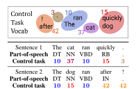
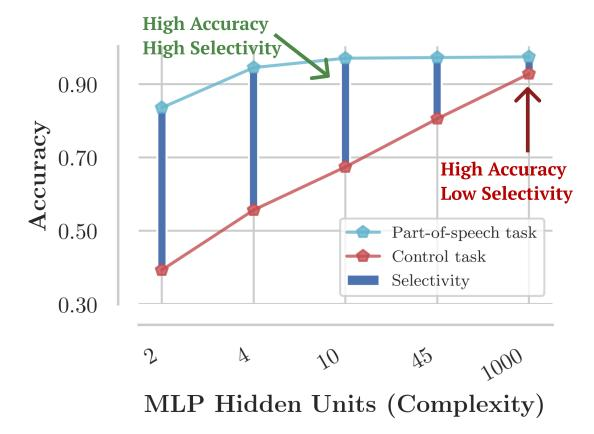
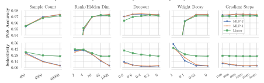
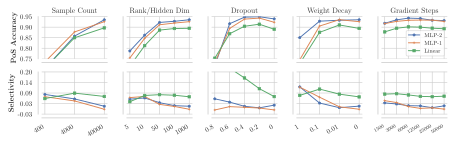

# Designing and Interpreting Probes with Control Tasks

## John Hewitt

Stanford University johnhew@stanford.edu

# Percy Liang Stanford University

pliang@cs.stanford.edu

## Abstract

Probes, supervised models trained to predict properties (like parts-of-speech) from representations (like ELMo), have achieved high accuracy on a range of linguistic tasks. But does this mean that the representations encode linguistic structure or just that the probe has learned the linguistic task? In this paper, we propose *control tasks*, which associate word types with random outputs, to complement linguistic tasks. By construction, these tasks can only be learned by the probe itself. So a good probe, (one that reflects the representation), should be *selective*, achieving high linguistic task accuracy and low control task accuracy. The selectivity of a probe puts linguistic task accuracy in context with the probe's capacity to memorize from word types. We construct control tasks for English part-of-speech tagging and dependency edge prediction, and show that popular probes on ELMo representations are not selective. We also find that dropout, commonly used to control probe complexity, is ineffective for improving selectivity of MLPs, but that other forms of regularization are effective. Finally, we find that while probes on the first layer of ELMo yield slightly better part-of-speech tagging accuracy than the second, probes on the second layer are substantially more selective, which raises the question of which layer better represents parts-of-speech.

## 1 Introduction

As large-scale unsupervised representations such as BERT and ELMo improve downstream performance on a wide range of natural language tasks [\(Devlin et al.,](#page-9-0) [2019;](#page-9-0) [Peters et al.,](#page-10-0) [2018a;](#page-10-0) [Radford](#page-10-1) [et al.,](#page-10-1) [2019\)](#page-10-1), what these models learn about language remains an open scientific question. An emerging body of work investigates this question through *probes*, supervised models trained to

Figure 1: Our control tasks define random behavior (like a random output, top) for each word type in the vocabulary. Each word token is assigned its type's output, regardless of context (middle, bottom.) Control tasks have the same input and output space as a linguistic task (e.g., parts-of-speech) but can only be learned if the probe memorizes the mapping.

predict a property (like parts-of-speech) from a constrained view of the representation. Probes trained on various representations have obtained high accuracy on tasks requiring part-of-speech and morphological information [\(Belinkov et al.,](#page-9-1) [2017\)](#page-9-1), syntactic and semantic information [\(Peters et al.,](#page-10-2) [2018b;](#page-10-2) [Tenney et al.,](#page-10-3) [2019\)](#page-10-3), among other properties [\(Conneau et al.,](#page-9-2) [2018\)](#page-9-2), providing evidence that deep representations trained on large datasets are predictive of a broad range of linguistic properties.

But when a probe achieves high accuracy on a linguistic task using a representation, can we conclude that the representation encodes linguistic structure, or has the probe just learned the task? Probing papers tend to acknowledge this uncertainty, putting accuracies in context using random representation baselines [\(Zhang and Bowman,](#page-10-4) [2018\)](#page-10-4) and careful task design [\(Hupkes et al.,](#page-9-3) [2018\)](#page-9-3). Even so, as long as a representation is a lossless encoding, a sufficiently expressive probe with enough training data can learn *any* task on top of it.

In this paper, we propose *control tasks*, which associate word types with random outputs, to give intuition for the expressivity of probe families and

Figure 2: Selectivity is defined as the difference between linguistic task accuracy and control task accuracy, and can vary widely, as shown, across probes which achieve similar linguistic task accuracies. These results taken from § [3.5.](#page-4-0)

provide insight into how representation and probe interact to achieve high task accuracy.

Control tasks are based on the intuition that the more a probe is able to make task output decisions independently of the linguistic properties of a representation, the less its accuracy on a linguistic task necessarily reflects the properties of the representation. Thus, a good probe (one that provides insights into the linguistic properties of a representation) should be what we call *selective*, achieving high linguistic task accuracy and low control task accuracy (see Figure [2\)](#page-1-0).

We show that selectivity can be a guide in designing probes and interpreting probing results, complementary to random representation baselines; as of now, there is little consensus on how to design probes. Early probing papers used linear functions [\(Shi et al.,](#page-10-5) [2016;](#page-10-5) [Ettinger et al.,](#page-9-4) [2016;](#page-9-4) [Alain and](#page-9-5) [Bengio,](#page-9-5) [2016\)](#page-9-5), which are still used [\(Bisazza and](#page-9-6) [Tump,](#page-9-6) [2018;](#page-9-6) [Liu et al.,](#page-9-7) [2019\)](#page-9-7), but multi-layer perceptron (MLP) probes are at least as popular [\(Belinkov et al.,](#page-9-1) [2017;](#page-9-1) [Conneau et al.,](#page-9-2) [2018;](#page-9-2) [Adi](#page-9-8) [et al.,](#page-9-8) [2017;](#page-9-8) [Tenney et al.,](#page-10-3) [2019;](#page-10-3) [Ettinger et al.,](#page-9-9) [2018\)](#page-9-9). Arguments have been made for "simple" probes, e.g., that we want to find easily accessible information in a representation [\(Liu et al.,](#page-9-7) [2019;](#page-9-7) [Alain and Bengio,](#page-9-5) [2016\)](#page-9-5). As a counterpoint though, "complex" MLP probes have also been suggested since useful properties might be encoded non-linearly [\(Conneau et al.,](#page-9-2) [2018\)](#page-9-2), and they tend to report similar trends to simpler probes anyway [\(Belinkov et al.,](#page-9-1) [2017;](#page-9-1) [Qian et al.,](#page-10-6) [2016\)](#page-10-6).

We define control tasks corresponding to English part-of-speech tagging and dependency edge prediction, and use ELMo representations to conduct a broad study of probe families, hyperparameters, and regularization methods, evaluating both linguistic task accuracy and selectivity. We propose that selectivity be used for building intuition about the expressivity of probes and the properties of models, putting probing accuracies into richer context. We find that:

- 1. With popular hyperparameter settings, MLP probes achieve very low selectivity, suggesting caution in interpreting how their results reflect properties of representations. For example, on part-of-speech tagging, 97.3 accuracy is achieved, compared to 92.8 control task accuracy, resulting in 4.5 selectivity.
- 2. Linear and bilinear probes achieve relatively high selectivity across a range of hyperparameters. For example, a linear probe on part-ofspeech tagging achieves a similar 97.2 accuracy, and 71.2 control task accuracy, for 26.0 selectivity. This suggests that the small accuracy gain of the MLP may be explained by increased probe expressivity.
- 3. The most popular method for controlling probe complexity, dropout, does not consistently lead to selective MLP probes. However, control of MLP complexity through unintuitively small (10-dimensional) hidden states, as well as small training sample sizes and weight decay, lead to higher selectivity and similar linguistic task accuracy.

Finally, we ask, *can we meaningfully compare the linguistic properties of layers of a model using only linguistic task accuracy*? We raise a potential problem with this approach: it fails to take into account differences in ease of memorization across layers. In particular, we find that while linear and MLP probes on the first layer of ELMo (ELMo1) achieve slightly higher part-of-speech accuracy than those on the second layer (ELMo2), (97.2 compared to 96.6, for a loss of 0.6 ), the same probes achieve much greater selectivity on ELMo2 (31.4 compared to 26.0, for a gain of 5.4). Thus, the difference in selectivity in favor of ELMo2 is much greater than the commonly known [\(Peters](#page-10-0) [et al.,](#page-10-0) [2018a;](#page-10-0) [Liu et al.,](#page-9-7) [2019\)](#page-9-7) difference in linguistic task accuracy in favor of ELMo1; the difference in accuracy may be explained by probes more easily accessing word identity features in ELMo1.

Figure 3: Example dependency tree from the development set of the Penn Treebank with dependents pointing at heads, and the structure resulting from our dependency edge prediction control task on the same sentence.

#### 2 Control Tasks

In this section, we describe how to construct control tasks. At a high level, control tasks have:

**structure:** The output for a word token is a deterministic function of the word type1.

**randomness:** The output for each word type is sampled independently at random.

We start with some notation; denote as 1:T the sequence of integers  $\{1,...,T\}$ . Let V be the vocabulary containing all word types in a corpus. A sentence of length T is  $\mathbf{x}_{1:T}$ , where each  $x_i \in V$ , and the word representations of the model being probed are  $\mathbf{h}_{1:T}$ , where  $h_i \in \mathbb{R}^d$ . A task is a function that maps a sentence to a single output per word,  $f(\mathbf{x}_{1:T}) = \mathbf{y}_{1:T}$ , where each output is from a finite set of outputs:  $y_i \in \mathcal{Y}$ . Each  $control\ task$  is defined in reference to a  $linguistic\ task$ , and the two share  $\mathcal{Y}$ . We'll now use part-of-speech tagging and dependency edge prediction as examples to describe the construction of control tasks.

#### 2.1 Part-of-speech tagging control task

In part-of-speech tagging, the set  $\mathcal{Y}$  is the tagset, 1:45 (corresponding to NN, NNS, VB,...). To construct a control task, we independently sample a control behavior C(v) for each  $v \in V$ . The control behavior specifies how to define  $y_i \in \mathcal{Y}$  for a word token  $x_i$  with word type v. For part-of-speech tagging, each control behavior directly specifies the output  $y_i$  for  $x_i$  as an integer from 1:45, so we sample from 45 behaviors2. The part-of-speech control task is the function that maps each token  $x_i$  to the label specified by the behavior  $C(x_i)$ :

$$f_{\text{control}}(\mathbf{x}_{1:T}) = f(C(x_1), C(x_2), ...C(x_T)).$$
 (1)  
This task is visualized in Figure 1.

#### 2.2 Dependency edge prediction control task

The dependency edge prediction task is the function  $f_{\text{DEP}}(\mathbf{x}_{1:T}) = \mathbf{y}_{1:T}$  where  $y_i$  is the index of the parent of  $x_i$  in the dependency tree on the sentence  $\mathbf{x}_{1:T}$ . Thus, the output space  $\mathcal{Y}=1:T$  depends on the length of the sentence, T. To accommodate this in our control task, we define the control behaviors C(v) in a length-independent way that still fully specifies  $y_i$ . The possible behaviors C(v) are as follows:

attach to self: Always attach tokens of this type to themselves. That is,  $y_i = i$ .

attach to first: Always attach tokens of this type to the first token. That is,  $y_i = 1$ .

attach to last: Always attach tokens of this type to the last word in the sentence. That is,  $y_i = T$ .

We sample uniformly from the three. Given these behaviors, the control task is defined as before by Eqn 1. This task is visualized in Figure 3.

While very similar to dependency parsing, dependency edge prediction differs in two ways. The output is not constrained to be a tree for evaluation; each prediction is evaluated independently. So, while our control tasks do not define trees, the two tasks' output spaces are still the same. Second, in dependency edge prediction, the root of the sentence is omitted from evaluation; no sentence-external ROOT token is posited for evaluation.

#### 2.3 Properties of control tasks

To summarize, a control task is defined for a single linguistic task, and shares the linguistic task's output space  $\mathcal{Y}$ . To construct a control task, a control behavior C(v) is sampled independently at random for each word type  $v \in V$ . The control task is a function mapping  $\mathbf{x}_{1:T}$  to a sequence of outputs  $\mathbf{y}_{1:T}$  which is fully specified by the sequence of behaviors,  $[C(x_1), ..., C(x_T)]$ .

&lt;sup>1Equivalently, word identity.

&lt;sup>2The exact distribution from which we sample isn't crucial, but for part-of-speech tagging, we sample from the empirical token distribution of part-of-speech tagging, so the marginal probability of each label is similar.

From this construction, we note that the ceiling on performance is the fraction of tokens in the evaluation set whose types occur in the training set (plus chance accuracy on all other tokens.) Further, C(v) must be memorized independently for each word type, and a probe taking vectors  $h_{1:T}$  as input must identify for each  $h_i$  its corresponding  $x_i$ , and output the element of  $\mathcal Y$  specified by  $C(x_i)$ .

#### 3 Experiments on Probe Selectivity

In this section, we conduct a broad study of probe families (e.g, linear, MLP) and hyperparameter choices (weight matrix rank/hidden state size, amount of regularization) on a single representation (ELMo1) to determine (1) what probe choices exhibit high linguistic task accuracy *and* high selectivity (and whether this holds for a range of hyperparameters), and (2) whether each probe family can be made selective through hyperparameter choices without substantially sacrificing linguistic task accuracy.

#### 3.1 Probe families

We experiment with three types of probes per task. For part-of-speech tagging, we experiment with linear, MLP-1, and MLP-2 probes. The linear probe is a multiclass model mapping  $h_i$  to  $y_i \sim \operatorname{softmax}(Ah_i + b)$ . The MLP-1 probe is a multilayer perceptron with one hidden layer and ReLU nonlinearity defined as:

$$y_i \sim \operatorname{softmax}(W_2 \ q(W_1 h_i)).$$
 (2)

And the MLP-2 probe is defined as:

$$y_i \sim \operatorname{softmax}(W_3 g(W_2 g(W_1 h_i))).$$
 (3)

where g is the ReLU function, and bias terms are omitted from all affine transformations for brevity.

For dependency edge prediction, we experiment with bilinear, MLP-1, and MLP-2 probes. These probes take as input the entire sequence  $\mathbf{h}_{1:T}$  as well as the vector  $h_i$  of a given state to produce  $y_i$ ; the softmax operates over the sequence to construct a distribution over the T classes. Formally, the bilinear model is defined as  $y_i \sim \operatorname{softmax}(\mathbf{h}_{1:T}^{\top}Ah_i + b)$ . The MLP-1 probe is defined as follows:

$$y_i \sim \operatorname{softmax}(W_2 g(W_1[\mathbf{h}_{1:T}; h_i])).$$
 (4)

Note here that  $h_i$  broadcasts to  $\mathbb{R}^{T \times d}$ , while  $W_1 \in \mathbb{R}^{\ell \times d}$ , and  $W_2 \in \mathbb{R}^{1 \times \ell}$  broadcast as well. That is, each  $[h_j; h_i]$  pair is mapped to a single scalar

independently of all others, leading to T logits used as input to the softmax. Similarly, the MLP-2 model is defined as follows:

$$y_i \sim \text{softmax}(W_3 \ g(W_2 \ g(W_1[\mathbf{h}_{1:T}; h_i]))).$$
 (5)

#### 3.2 Complexity control

It is well-known that probes should not be too complex (Liu et al., 2019; Alain and Bengio, 2016); this is the motivation behind constraining the input to the probe to be a single vector or pair of vectors. However, there has been no systematic investigation of probe complexity. We study what complexity control is necessary to achieve selectivity. As we will see, the typical practice of regularizing to reduce the generalization gap (difference between training and test task accuracy) is insufficient if one is interested in selectivity.

Rank/hidden dimensionality constraint. For our linear and bilinear probes, we constrain the rank of weight matrices through an LR decomposition. We let  $A \in \mathbb{R}^{k \times d}$ , where k is the output space (45 for part-of-speech tagging; 1 for dependency head prediction). To constrain A to rank  $\ell$ , we factor A = LR, where  $L \in \mathbb{R}^{k \times \ell}$  and  $R \in \mathbb{R}^{\ell \times |V|}$ , and optimize over L and R. For MLP models, we let the hidden state size be equal to  $\ell$ .

From the default value of rank-1000 and 1000-dimensional hidden states, we let  $\ell$  take on the values  $\{2,4,10,45\}$  for part-of-speech, and  $\{5,10,50,100\}$  for dependency edge prediction.4

**Dropout.** We apply dropout (Srivastava et al., 2014) with probability p to the input for linear and bilinear probes, and to the input and the output of each hidden layer for MLP probes. From the default value of 0, we let p range over  $\{0.2, 0.4, 0.6, 0.8\}$ .

Number of training examples. We artificially constrain the number of sentences the probe is trained on, with the intuition that general rules can be learned more sample-efficiently than memorization. Zhang and Bowman (2018) showed this to be an effective distinguishing factor between trained representations and random representation controls. From the default of 39832 (the number of training

&lt;sup>3One could constrain the matrices of the MLP to be rank  $\ell$  without making the hidden state smaller, but one must choose a hidden state size anyway, so we believed a study changing the hidden state size would be most informative.

&lt;sup>4Note that for linear models, the rank is constrained by k regardless, since  $A \in \mathbb{R}^{k \times d}$ .

| Probe                              | PoS                                 | Ctl  | Select. | Dep  | Ctl  | Select. |  |  |
|------------------------------------|-------------------------------------|------|---------|------|------|---------|--|--|
|                                    | Probes with Default Hyperparameters |      |         |      |      |         |  |  |
| Linear                             | 97.2                                | 71.2 | 26.0    | -    | -    | -       |  |  |
| Bilinear                           | -                                   | -    | -       | 89.0 | 82.4 | 6.6     |  |  |
| MLP-1                              | 97.3                                | 92.8 | 4.5     | 92.3 | 93.0 | -0.7    |  |  |
| MLP-2                              | 97.3                                | 93.2 | 4.2     | 93.9 | 92.0 | 1.9     |  |  |
| Probes with 0.4 Dropout            |                                     |      |         |      |      |         |  |  |
| Linear                             | 97.1                                | 67.3 | 29.8    | -    | -    | -       |  |  |
| Bilinear                           | -                                   | -    | -       | 90.4 | 73.7 | 16.7    |  |  |
| MLP-1                              | 97.5                                | 93.4 | 4.1     | 93.8 | 93.1 | 0.7     |  |  |
| MLP-2                              | 97.4                                | 94.1 | 3.4     | 94.7 | 93.5 | 1.3     |  |  |
| Probes Designed with Control Tasks |                                     |      |         |      |      |         |  |  |
| Linear                             | 97.0                                | 64.0 | 33.0    | -    | -    | -       |  |  |
| Bilinear                           | -                                   | -    | -       | 91.0 | 83.1 | 7.9     |  |  |
| MLP-1                              | 97.2                                | 80.6 | 16.6    | 90.5 | 84.3 | 6.2     |  |  |
| MLP-2                              | 97.2                                | 81.7 | 15.4    | 92.8 | 89.8 | 3.0     |  |  |

Table 1: Probe accuracies on linguistic tasks and control tasks. Default hyperparameters correspond to a hidden state of dimensionality 1000 and no dropout. Under Probes Designed with Control Tasks, we used selectivity to hand-pick a hyperparameter setting for each probe. In particular, partof-speech probes designed with control tasks all use rank-10 weight matrices (10-dimensional hidden state) and no other changes. Dependency edge prediction probes designed with control tasks had, for the bilinear model, weight decay of 0.01, for MLP-1, weight decay of 0.1, for MLP-2, a rank-50 weight matrix.

examples in the dataset), we train on {4000, 400} examples, corresponding to roughly 100%, 10%, and 1% of the total data, as suggested by [Zhang](#page-10-4) [and Bowman](#page-10-4) [\(2018\)](#page-10-4).

L2 regularization. We apply weight decay to the probe parameters. From the default of 0, we let the weight decay constant take on the values {0.01, 0.1, 1.0, 10.0}, unnormalized by batch size.

Early stopping. All of our probing models are trained with Adam [\(Kingma and Ba,](#page-9-10) [2014\)](#page-9-10). By default, we anneal the learning rate by a factor of 0.5 each time an epoch does not lead to a new minimum loss on the development set, and stop training when 4 such epochs occur in a row. However, in early stopping, we explicitly halt training at a fixed number of gradient steps. From the default of 100000 (approximately 40 epochs), we let this maximum take on the values {50000, 25000, 12500, 6000, 3000, 1500}.

#### 3.3 Dataset

We use the Penn Treebank (PTB) dataset [\(Mar](#page-10-8)[cus et al.,](#page-10-8) [1993\)](#page-10-8) with the traditional parsing training/development/testing splits[5](#page-4-1) without preprocess-

ing. We report accuracies on the development set. We convert the PTB constituency trees to the Stanford Dependencies formalism [\(de Marneffe et al.,](#page-10-10) [2006\)](#page-10-10) for our dependency edge prediction task.

#### 3.4 Representation

We use the 5.5 billion-word pre-trained ELMo representations [\(Peters et al.,](#page-10-0) [2018a\)](#page-10-0). Since the output of the first BiLSTM layer was recently shown to be the most transferrable on a wide variety of tasks, including part-of-speech and syntax [\(Liu et al.,](#page-9-7) [2019\)](#page-9-7), we focus on analyzing that layer, which we denote ELMo1.

#### 3.5 Results

Selectivity of default hyperparameters. Our results with linear, bilinear, and MLP probes with "default" hyperparameters, as specified in § [3.2,](#page-3-2) are found in Table [1](#page-4-2) (top). We find that linear probes achieve similar part-of-speech accuracies to MLPs (97.2 compared to 97.3) with substantially higher selectivity (26.0 vs 4.50). In dependency edge prediction, we find a definite gap between bilinear probe accuracy (89.0) and MLP-1 accuracy (92.3). However, the bilinear probe achieves 16.7 selectivity, compared to −0.7 by MLP-1 and 1.3 by MLP-2. Thus, with no regularization, modest gains in linguistic task accuracy through MLP probes over linear/bilinear probes are tempered by losses in selectivity. Bilinear and linear probes themselves show a significant capacity for memorization.

Does adding moderate regularization through dropout (e.g., p = 0.4) consistently lead to selectivity? Surprisingly, as shown in Table [1](#page-4-2) (middle), the opposite is true for some MLP probes, where selectivity actually decreases (e.g., 4.2 → 3.4 for MLP-2). In one case, the MLP-1 probe on dependency edge prediction, dropout increases selectivity (-0.7 → 0.7) but for no others.

How hard is it to find selective probes? We tried 6 methods for controlling probe complexity, and all worked except dropout and early stopping, though never for a broad range of hyperparameters. For each complexity control method except dropout and early stopping, we find hyperparameters that lead to high linguistic task accuracy and high selectivity. Our results are summarized in Figure [4.](#page-5-0)

We find that constraining the hidden state dimensionality of MLPs is an effective way to encourage selectivity at little cost to linguistic task

5As given by the code of [Qi and Manning](#page-10-9) [\(2017\)](#page-10-9) at <https://github.com/qipeng/arc-swift>.

#### Part-of-speech Accuracy and Selectivity Across Complexity Control Methods

Unlabeled Dependency Accuracy and Selectivity Across Complexity Control Methods

Figure 4: Linguistic task accuracies and selectivities for the 5 complexity control methods. All methods except dropout and early stopping are shown to improve selectivity without a large impact on linguistic task accuracy. All methods for the same task share a common y-axis, and use their own categorical x-axis. All x-axes are ordered from most severe constraints on complexity (left) to most laissez-faire (right).

accuracy. MLP hidden state sizes of 10 and 50, for part-of-speech tagging and dependency head prediction respectively, lead to increased selectivity while maintaining high linguistic task accuracy. As such, MLP probes with hundreds or 1000 hidden units, as is common, are overparameterized.

Constraining the **number of training examples** is effective for part-of-speech, suggesting that learning each linguistic task requires fewer samples than our control task. However, for dependency edge prediction, this leads to significantly reduced linguistic task accuracy. Finally, we find that the right **weight decay** constant can also lead to high-accuracy, high-selectivity probes, especially for dependency edge prediction. As shown, however, it is unclear what hyperparameters to use (e.g., weight decay 0.1) to achieve both high accuracy and high selectivity; that is, finding selective MLP probes is non-trivial.

Applying **dropout**, the most popular probing regularization method (Adi et al., 2017; Belinkov and Glass, 2019; Şahin et al., 2019; Kim et al., 2019; Elloumi et al., 2018; Belinkov and Glass, 2017; Belinkov et al., 2018) does not consistently

lead to high-accuracy, high-selectivity MLP probes across a broad range of dropout probabilities (p=0.2 to p=0.8) on part-of-speech tagging. For dependency edge prediction, dropout of p=0.6 improves the selectivity of MLP-2 but not MLP-1, and considerably increases the already relatively large selectivity of the bilinear probe. Early stopping in the ranges tested also has little impact on part-of-speech tagging, selectivity, but does improve selectivity of MLP dependency edge prediction probes.

From our study, we pick a set of hyperparameters for linear, bilinear, MLP-1 and MLP-2 probes to encourage selectivity and linguistic task accuracy together, to compare to default parameters and dropout. We chose rank constraints of 10 and 45, respectively (with no other changes,) for linear and MLP part-of-speech tagging probes, weight decay of 0.01 for the bilinear dependency probe, and weight decay of 0.1 for MLP dependency probes. We report the results of these probes in Table 1 (bottom). In all cases, we see that the right choice of probe leads to considerably higher selectivity than dropout or no regularization. In particular, for part-of-speech tagging, our chosen MLP-1

probe achieves 16.6 selectivity, up from 4.5, and on dependency head prediction, 6.2 selectivity, up from -0.7.

#### 3.6 Discussion

Our most consistent result seems to be that all probes, whether linear, bilinear, or multi-layer perceptron, are over-parameterized and needlessly high-capacity if using defaults like full-rank weight matrices, hidden states with a few hundred dimensions, and moderate dropout. We can tell this is the case because we're able to heavily constrain the probes (e.g., to rank or 10-dimensional hidden states with little loss in accuracy.

We find that the most selective probes of those tested, even after careful complexity control, are linear or bilinear models. They also have the advantage that they exhibit high selectivity without the need to search over complexity control methods.

However, the most accurate probes on the more complex task of dependency edge prediction are MLPs, even with hyperparameters tuned for selectivity. This suggests that while much of the part-of-speech information of ELMo is extractable linearly, some information about syntactic trees is not available to a bilinear function. In some cases, therefore, one might opt for an MLP probe to extract non-linear features, while optimizing for selectivity through hyperparameter choices.

#### Errors in Selective and Non-Selective Probes

Do selective and non-selective probes make different types of errors? We ran a qualitative study on this, training ten MLP-1 probes and ten linear probes, each with default parameters, on part-ofspeech tagging. We then manually inspected their aggregate confusion matrices for trends in differences between the models' errors.

While the MLP performed marginally better at recognizing many categories, the plurality of improvement over the linear probe by far was in correctly identifying the difference between nouns and adjectives in phrases. For example,

Kan.-based/JJ National/NNP Pizza/NNP rental/JJ equipment/NN

were correctly labeled by the MLP but not the linear probe, which incorrectly labeled the adjectives as nouns. As can be seen with the second example, the distinction between a *JJ NN* modified noun and a *NN NN* noun compound is quite subtle, and the MLP picks up on the distinction considerably better.

The linear probe, however, was substantially more accurate at predicting the NNP tag, which the MLP probe frequently mislabeled as NNPS. Manual inspection showed a general trend:

> Environmental/NNP Systems/NNP Co./NNP Cara/NNP Operations/NNP Co./NNP 7.8/CD %/NN stake/NN in/IN Dataproducts/NNP

In each case, the MLP probe mislabeled the word with the suffix *-s* as NNPS. The linear probe was considerably less prone to this error. We hypothesize that this is because the MLP probe is expressive enough to pick up on (spurious) markers of plurality as well as status as a proper noun independently and combine them, whereas the linear probe is less able to do so. If this hypothesis is true, then this serves as an example of how less selective probes may be less faithful in representing the linguistic information of the model being probed, since features may be combined to make fine-grained distinctions.

# 4 Selectivity Differences Confound Layer Comparisons

In this section, we use selectivity to shed light on confounding factors when comparing the linguistic capabilities of different representations. Multiple studies have found probes on ELMo1 to perform better at part-of-speech tagging than probes on ELMo2 [\(Peters et al.,](#page-10-0) [2018a;](#page-10-0) [Tenney et al.,](#page-10-3) [2019;](#page-10-3) [Liu et al.,](#page-9-7) [2019\)](#page-9-7). As we note, these results depend on the probe as well as the representation; given what we know about probes' capacity for memorizing at the type level, we explore an alternative to the hypothesis that ELMo1 has higher-quality part-of-speech representations than ELMo2. In particular, word identities are strong features in part-of-speech tagging when used in combination with other indicators; since ELMo1 is closer to the word representations than ELMo2, it may be easier to identify word identities from it, meaning the probe may utilize word identities more readily, as opposed to picking up on a representation of part-of-speech.

#### 4.1 Experiments

We run experiments on the first and second contextual layers of ELMo, denoted ELMo1 and ELMo2. We also examine the representations of an untrained BiLSTM run on the non-contextual character CNN word embeddings of ELMo, shown to be a strong baseline contextualization method, but without any linguistic knowledge learned from context [\(Zhang and Bowman,](#page-10-4) [2018;](#page-10-4) [Hewitt and Manning,](#page-9-16) [2019\)](#page-9-16). We denote this model Proj0.

We train linear and MLP-1 probes for part-ofspeech tagging, and bilinear and MLP-1 probes for dependency edge prediction, all with default hyperparameters (§ [3.2\)](#page-3-2). We examine both the linguistic task accuracy and selectivity achieved by each probe on each representation.

#### 4.2 Results & Discussion

We find probes on ELMo2 to be strikingly more selective than those on ELMo1, consistent across all probes, both for part-of-speech tagging and dependency head prediction. In particular, the linear probe on ELMo2 achieves selectivity of 31.4, compared to selectivity of 26.0 for ELMo1, for a gain of 5.4. The same probe achieves 96.6 linguistic task accuracy on ELMo2 and 97.2 on ELMo1, for a loss of 0.6. The MLP probe shows roughly the same result. So, does ELMo1 have a better grasp of part-of-speech than ELMo2? Our results, summarized in Table [2,](#page-7-0) offer the alternative hypothesis that probes use word identity as a feature to predict part-of-speech, and that feature is less easily available in ELMo2 than ELMo1.

Probes on Proj0 and ELMo2 achieve similar part-of-speech tagging accuracy, echoing findings of [\(Zhang and Bowman,](#page-10-4) [2018\)](#page-10-4), but we find that Proj0 is far less selective, suggesting that probes on ELMo2 rely far less on word identities than those on Proj0. Without considering selectivity, it might be thought that ELMo2 encodes nothing about part-of-speech, since it doesn't beat the Proj0 random representation baseline. Taking selectivity into account, we see that probes on ELMo2 are unable to rely on word identity features like those on Proj0, so to achieve high accuracy, they must rely on emergent properties of the representation.

## 5 Related Work

Early work in probing, (also known as diagnostic classification [\(Hupkes et al.,](#page-9-3) [2018\)](#page-9-3),) extracted properties like parts-of-speech, gender, tense, and number from distributional word vector spaces like word2vec and GloVe [\(Mikolov et al.,](#page-10-12) [2013;](#page-10-12) [Pen](#page-10-13)[nington et al.,](#page-10-13) [2014\)](#page-10-13) using linear classifiers [\(Köhn,](#page-9-17)

| Part-of-speech Tagging |          |             |          |             |  |  |  |  |
|------------------------|----------|-------------|----------|-------------|--|--|--|--|
|                        |          | Linear      | MLP-1    |             |  |  |  |  |
| Model                  | Accuracy | Selectivity | Accuracy | Selectivity |  |  |  |  |
| Proj0                  | 96.3     | 20.6        | 97.1     | 1.6         |  |  |  |  |
| ELMo1                  | 97.2     | 26.0        | 97.3     | 4.5         |  |  |  |  |
| ELMo2                  | 96.6     | 31.4        | 97.0     | 8.8         |  |  |  |  |

| Dependency Edge Prediction |          |             |          |             |  |  |  |  |
|----------------------------|----------|-------------|----------|-------------|--|--|--|--|
|                            |          | Bilinear    | MLP-1    |             |  |  |  |  |
| Model                      | Accuracy | Selectivity | Accuracy | Selectivity |  |  |  |  |
| Proj0                      | 79.9     | -4.3        | 86.5     | -9.0        |  |  |  |  |
| ELMo1                      | 89.7     | 6.7         | 92.5     | -1.0        |  |  |  |  |
| ELMo2                      | 84.5     | 6.2         | 89.5     | 1.4         |  |  |  |  |

Table 2: Part-of-speech and dependency edge prediction probe accuracies and selectivities across three representations. ELMo1 and ELMo2 are the two contextual layers of ELMo, while Proj0 refers to an untrained BiLSTM contextualization of ELMo's non-contextual character CNN representations.

[2015;](#page-9-17) [Gupta et al.,](#page-9-18) [2015\)](#page-9-18). Soon after, the investigation of intermediate layers of deep models using linear probes was introduced independently by [Et](#page-9-4)[tinger et al.](#page-9-4) [\(2016\)](#page-9-4) and [Shi et al.](#page-10-5) [\(2016\)](#page-10-5) in NLP and [Alain and Bengio](#page-9-5) [\(2016\)](#page-9-5) in computer vision.

Since then, probing methods have varied as to whether they investigate whole-sentence properties like sentence length and word content using a sentence vector [\(Shi et al.,](#page-10-5) [2016;](#page-10-5) [Adi et al.,](#page-9-8) [2017;](#page-9-8) [Con](#page-9-2)[neau et al.,](#page-9-2) [2018\)](#page-9-2), word properties like verb tense or part-of-speech using word vectors [\(Shi et al.,](#page-10-5) [2016;](#page-10-5) [Belinkov et al.,](#page-9-1) [2017;](#page-9-1) [Liu et al.,](#page-9-7) [2019\)](#page-9-7), or word-pair properties like syntactic relationships using pairs of vectors [\(Tenney et al.,](#page-10-3) [2019;](#page-10-3) [Hewitt and Man](#page-9-16)[ning,](#page-9-16) [2019\)](#page-9-16). Probes have been used to make relative claims between models or components [\(Adi](#page-9-8) [et al.,](#page-9-8) [2017;](#page-9-8) [Liu et al.,](#page-9-7) [2019;](#page-9-7) [Belinkov et al.,](#page-9-1) [2017\)](#page-9-1) or absolute claims about models above baselines. Probes have also been used to test hypotheses about the mechanisms by which models perform tasks [\(Hupkes et al.,](#page-9-3) [2018;](#page-9-3) [Giulianelli et al.,](#page-9-19) [2018\)](#page-9-19).

Previous work has made extensive use of control representations like non-contextual word embeddings or models with random weights [\(Belinkov](#page-9-1) [et al.,](#page-9-1) [2017;](#page-9-1) [Tenney et al.,](#page-10-3) [2019;](#page-10-3) [Saphra and Lopez,](#page-10-14) [2019;](#page-10-14) [Hewitt and Manning,](#page-9-16) [2019\)](#page-9-16); our control tasks provide a complementary perspective, measuring a probe's ability to decode a random function from the representation of interest.

The most related work to ours is that of [Zhang](#page-10-4) [and Bowman](#page-10-4) [\(2018\)](#page-10-4), who presented experiments for understanding the roles probe training sample size and memorization have on linguistic

task accuracy. They observed that untrained BiLSTM contextualizers achieved almost the same part-of-speech tagging accuracies as trained contextualizers, and found that by reducing the probe training set, the trained models could be shown to significantly outperform the untrained model. They evaluated which representations were easiest to memorize from by probing to predict nearby words, finding as we do that word identities are most easily available in untrained contextualizers' representations. They take this as evidence that gains in part-of-speech probing accuracy on the trained representations over the untrained representations are due to linguistic properties, not memorization. Our experiments with selectivity complement their results, finding among other things that even though untrained BiLSTMs are better for memorization than ELMo, there is still a striking capacity for memorization using ELMo when using high-capacity probes.

#### 5.1 Random tasks

[Zhang et al.](#page-10-15) [\(2017\)](#page-10-15) defined completely random tasks related to Rademacher complexity [\(Bartlett](#page-9-20) [and Mendelson,](#page-9-20) [2001\)](#page-9-20) to understand the capacity of neural networks to overfit, showing that they are expressive enough to fit random noise, but still function as effective models. In our random control tasks, randomness is applied at the type-level rather than at the example-level, and are designed to have strong non-linguistic structure as opposed to absolutely no structure. While the tasks of [Zhang](#page-10-15) [et al.](#page-10-15) [\(2017\)](#page-10-15) aid in understanding the expressivity of neural nets, our control tasks aid in understanding the expressivity of a probe model with respect to a specific linguistic task.

# 6 Conclusion

Through probing methods, it has been shown that a broad range of supervised learning tasks can be turned into tools for understanding the properties of contextual word representations [\(Conneau](#page-9-2) [et al.,](#page-9-2) [2018;](#page-9-2) [Tenney et al.,](#page-10-3) [2019\)](#page-10-3). [Alain and Ben](#page-9-5)[gio](#page-9-5) [\(2016\)](#page-9-5) suggested we may think of probes as "thermometers used to measure the temperature simultaneously at many different locations". We instead emphasize the joint roles of representations and probes together in achieving high accuracy on a task; we suggest that probes be thought of as *craftspeople*; their performance depends not only on the materials they're given, but also on their

expressivity.

To explore the relationship between representations, probes, and task accuracies, we defined control tasks, which by construction can only be learned by the probe itself. We've suggested that a probe which provides insights into the properties of the representation should be *selective*, achieving high linguistic task accuracy and low control task accuracy. Selectivity measures the probe's ability to make numerous output decisions independently of linguistic properties of the representation.

We've found that linear and bilinear models achieve higher selectivity at similar accuracy to MLP probes on part-of-speech tagging. MLP probes, achieving higher accuracy on the more complex task of dependency edge prediction, can be re-designed to achieve higher selectivity at a relatively small cost to dependency edge accuracy, but often not through dropout, the most popular MLP probe regularization method.

Finally, we showed how selectivity can be used to provide added context to probing results, demonstrating that marginal differences in part-of-speech tagging accuracy between ELMo1 and ELMo2 correspond to large differences in selectivity, and similarly, the even though ELMo2 achieves similar part-of-speech tagging accuracy to a random representation baseline, ELMo2 achieves it with much higher selectivity.

As probes are used increasingly to study representations, we hope that control tasks and selectivity, as diagnostic tools, can help us better interpret the results of these probes, ultimately leading us to better understand what is learned by these remarkably effective representations.

Reproducibility. All code, data, and experiments are available at [https://worksheets.](https://worksheets.codalab.org/worksheets/0xb0c351d6f1ac4c51b54f1023786bf6b2) [codalab.org/worksheets/](https://worksheets.codalab.org/worksheets/0xb0c351d6f1ac4c51b54f1023786bf6b2) [0xb0c351d6f1ac4c51b54f1023786bf6b2](https://worksheets.codalab.org/worksheets/0xb0c351d6f1ac4c51b54f1023786bf6b2).

## Acknowledgements

We would like to thank Kevin Clark, Robin Jia, Peng Qi, Vivek Kulkarni, Surya Ganguli, Tatsu Hashimoto, and Nelson Liu for helpful discussions and feedback. We would like to thank our reviewers for clarifying comments and suggestions for extra experiments. This work was funded under a PECASE Award.

## References

- Yossi Adi, Einat Kermany, Yonatan Belinkov, Ofer Lavi, and Yoav Goldberg. 2017. Fine-grained analysis of sentence embeddings using auxiliary prediction tasks. In *International Conference on Learning Representations*.
- Guillaume Alain and Yoshua Bengio. 2016. Understanding intermediate layers using linear classifier probes. In *International Conference on Learning Representations*.
- Peter L Bartlett and Shahar Mendelson. 2001. Rademacher and gaussian complexities: Risk bounds and structural results. In *International Conference on Computational Learning Theory*, pages 224–240. Springer.
- Yonatan Belinkov, Nadir Durrani, Fahim Dalvi, Hassan Sajjad, and James Glass. 2017. [What do neu](https://doi.org/10.18653/v1/P17-1080)[ral machine translation models learn about morphol](https://doi.org/10.18653/v1/P17-1080)[ogy?](https://doi.org/10.18653/v1/P17-1080) In *Proceedings of the 55th Annual Meeting of the Association for Computational Linguistics (Volume 1: Long Papers)*, pages 861–872. Association for Computational Linguistics.
- Yonatan Belinkov and James Glass. 2017. Analyzing hidden representations in end-to-end automatic speech recognition systems. In *Advances in Neural Information Processing Systems*, pages 2441–2451.
- Yonatan Belinkov and James Glass. 2019. Analysis methods in neural language processing: A survey. *Transactions of the Association for Computational Linguistics*, 7:49–72.
- Yonatan Belinkov, Lluís Màrquez, Hassan Sajjad, Nadir Durrani, Fahim Dalvi, and James Glass. 2018. Evaluating layers of representation in neural machine translation on part-of-speech and semantic tagging tasks. *arXiv preprint arXiv:1801.07772*.
- Arianna Bisazza and Clara Tump. 2018. The lazy encoder: A fine-grained analysis of the role of morphology in neural machine translation. In *Proceedings of the 2018 Conference on Empirical Methods in Natural Language Processing*, pages 2871–2876.
- Alexis Conneau, Germán Kruszewski, Guillaume Lample, Loïc Barrault, and Marco Baroni. 2018. [What](http://aclweb.org/anthology/P18-1198) [you can cram into a single](http://aclweb.org/anthology/P18-1198) \\$&!#\* vector: Prob[ing sentence embeddings for linguistic properties.](http://aclweb.org/anthology/P18-1198) In *Proceedings of the 56th Annual Meeting of the Association for Computational Linguistics (Volume 1: Long Papers)*, pages 2126–2136. Association for Computational Linguistics.
- Jacob Devlin, Ming-Wei Chang, Kenton Lee, and Kristina Toutanova. 2019. BERT: Pre-training of deep bidirectional transformers for language understanding. In *Proceedings of the 2019 Conference of the North American Chapter of the Association for Computational Linguistics: Human Language Technologies, Volume 2 (Short Papers)*. Association for Computational Linguistics.

- Zied Elloumi, Laurent Besacier, Olivier Galibert, and Benjamin Lecouteux. 2018. Analyzing learned representations of a deep ASR performance prediction model. *arXiv preprint arXiv:1808.08573*.
- Allyson Ettinger, Ahmed Elgohary, Colin Phillips, and Philip Resnik. 2018. Assessing composition in sentence vector representations. In *Proceedings of the 27th International Conference on Computational Linguistics*, pages 1790–1801.
- Allyson Ettinger, Ahmed Elgohary, and Philip Resnik. 2016. Probing for semantic evidence of composition by means of simple classification tasks. In *Proceedings of the 1st Workshop on Evaluating Vector-Space Representations for NLP*, pages 134–139.
- Mario Giulianelli, Jack Harding, Florian Mohnert, Dieuwke Hupkes, and Willem Zuidema. 2018. [Un](https://doi.org/10.18653/v1/W18-5426)[der the hood: Using diagnostic classifiers to in](https://doi.org/10.18653/v1/W18-5426)[vestigate and improve how language models track](https://doi.org/10.18653/v1/W18-5426) [agreement information.](https://doi.org/10.18653/v1/W18-5426) In *Proceedings of the 2018 EMNLP Workshop BlackboxNLP: Analyzing and Interpreting Neural Networks for NLP*, pages 240–248, Brussels, Belgium. Association for Computational Linguistics.
- Abhijeet Gupta, Gemma Boleda, Marco Baroni, and Sebastian Padó. 2015. Distributional vectors encode referential attributes. In *Proceedings of the 2015 Conference on Empirical Methods in Natural Language Processing*, pages 12–21.
- John Hewitt and Christopher D. Manning. 2019. A structural probe for finding syntax in word representations. In *North American Chapter of the Association for Computational Linguistics: Human Language Technologies (NAACL)*. Association for Computational Linguistics.
- Dieuwke Hupkes, Sara Veldhoen, and Willem Zuidema. 2018. Visualisation and 'diagnostic classifiers' reveal how recurrent and recursive neural networks process hierarchical structure. *Journal of Artificial Intelligence Research*, 61:907–926.
- Najoung Kim, Roma Patel, Adam Poliak, Alex Wang, Patrick Xia, R Thomas McCoy, Ian Tenney, Alexis Ross, Tal Linzen, Benjamin Van Durme, et al. 2019. Probing what different nlp tasks teach machines about function word comprehension. *arXiv preprint arXiv:1904.11544*.
- Diederik P Kingma and Jimmy Ba. 2014. Adam: A method for stochastic optimization. *arXiv preprint arXiv:1412.6980*.
- Arne Köhn. 2015. WhatâA˘ Zs in an embedding? ana- ´ lyzing word embeddings through multilingual evaluation. In *Proceedings of the 2015 Conference on Empirical Methods in Natural Language Processing*, pages 2067–2073.
- Nelson F. Liu, Matt Gardner, Yonatan Belinkov, Matthew E. Peters, and Noah A. Smith. 2019. Linguistic knowledge and transferability of contextual

- representations. In *Proceedings of the Conference of the North American Chapter of the Association for Computational Linguistics: Human Language Technologies*.
- Mitchell P Marcus, Mary Ann Marcinkiewicz, and Beatrice Santorini. 1993. Building a large annotated corpus of English: The Penn Treebank. *Computational linguistics*, 19(2):313–330.
- Marie-Catherine de Marneffe, Bill MacCartney, and Christopher D. Manning. 2006. Generating typed dependency parses from phrase structure parses. In *LREC*.
- Tomas Mikolov, Ilya Sutskever, Kai Chen, Greg S Corrado, and Jeff Dean. 2013. [Distributed representa](http://papers.nips.cc/paper/5021-distributed-representations-of-words-and-phrases-and-their-compositionality.pdf)[tions of words and phrases and their composition](http://papers.nips.cc/paper/5021-distributed-representations-of-words-and-phrases-and-their-compositionality.pdf)[ality.](http://papers.nips.cc/paper/5021-distributed-representations-of-words-and-phrases-and-their-compositionality.pdf) In C. J. C. Burges, L. Bottou, M. Welling, Z. Ghahramani, and K. Q. Weinberger, editors, *Advances in Neural Information Processing Systems 26*, pages 3111–3119. Curran Associates, Inc.
- Jeffrey Pennington, Richard Socher, and Christopher D. Manning. 2014. [Glove: Global vectors for word rep](http://www.aclweb.org/anthology/D14-1162)[resentation.](http://www.aclweb.org/anthology/D14-1162) In *Empirical Methods in Natural Language Processing (EMNLP)*, pages 1532–1543.
- Matthew Peters, Mark Neumann, Mohit Iyyer, Matt Gardner, Christopher Clark, Kenton Lee, and Luke Zettlemoyer. 2018a. Deep contextualized word representations. In *Proceedings of the 2018 Conference of the North American Chapter of the Association for Computational Linguistics: Human Language Technologies, Volume 1 (Long Papers)*, volume 1, pages 2227–2237.
- Matthew Peters, Mark Neumann, Luke Zettlemoyer, and Wen-tau Yih. 2018b. Dissecting contextual word embeddings: Architecture and representation. In *Proceedings of the 2018 Conference on Empirical Methods in Natural Language Processing*, pages 1499–1509.
- Peng Qi and Christopher D. Manning. 2017. [Arc-swift:](https://nlp.stanford.edu/pubs/qi2017arcswift.pdf) [A novel transition system for dependency parsing.](https://nlp.stanford.edu/pubs/qi2017arcswift.pdf) In *Association for Computational Linguistics (ACL)*.
- Peng Qian, Xipeng Qiu, and Xuanjing Huang. 2016. Investigating language universal and specific properties in word embeddings. In *Proceedings of the 54th Annual Meeting of the Association for Computational Linguistics (Volume 1: Long Papers)*, volume 1, pages 1478–1488.
- Alec Radford, Jeffrey Wu, Rewon Child, David Luan, Dario Amodei, and Ilya Sutskever. 2019. Language models are unsupervised multitask learners. *OpenAI Blog*, 1:8.
- Gözde Gül ¸Sahin, Clara Vania, Ilia Kuznetsov, and Iryna Gurevych. 2019. Linspector: Multilingual probing tasks for word representations. *arXiv preprint arXiv:1903.09442*.

- Naomi Saphra and Adam Lopez. 2019. Understanding learning dynamics of language models with svcca. In *North American Chapter of the Association for Computational Linguistics: Human Language Technologies (NAACL)*. Association for Computational Linguistics.
- Xing Shi, Inkit Padhi, and Kevin Knight. 2016. Does string-based neural mt learn source syntax? In *Proceedings of the 2016 Conference on Empirical Methods in Natural Language Processing*, pages 1526– 1534.
- Nitish Srivastava, Geoffrey Hinton, Alex Krizhevsky, Ilya Sutskever, and Ruslan Salakhutdinov. 2014. Dropout: a simple way to prevent neural networks from overfitting. *The Journal of Machine Learning Research*, 15(1):1929–1958.
- Ian Tenney, Patrick Xia, Berlin Chen, Alex Wang, Adam Poliak, R Thomas McCoy, Najoung Kim, Benjamin Van Durme, Sam Bowman, Dipanjan Das, and Ellie Pavlick. 2019. [What do you learn from](https://openreview.net/forum?id=SJzSgnRcKX) [context? probing for sentence structure in contextu](https://openreview.net/forum?id=SJzSgnRcKX)[alized word representations.](https://openreview.net/forum?id=SJzSgnRcKX) In *International Conference on Learning Representations*.
- Chiyuan Zhang, Samy Bengio, Moritz Hardt, Benjamin Recht, and Oriol Vinyals. 2017. Understanding deep learning requires rethinking generalization. In *International Conference on Learning Representations*.
- Kelly W Zhang and Samuel R Bowman. 2018. Language modeling teaches you more syntax than translation does: Lessons learned through auxiliary task analysis. *arXiv preprint arXiv:1809.10040*.