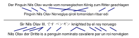
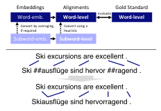
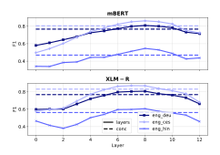
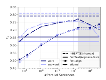
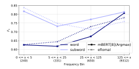
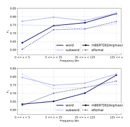
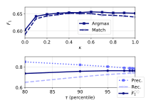
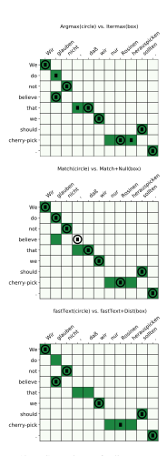
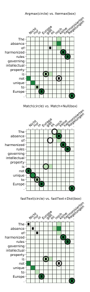
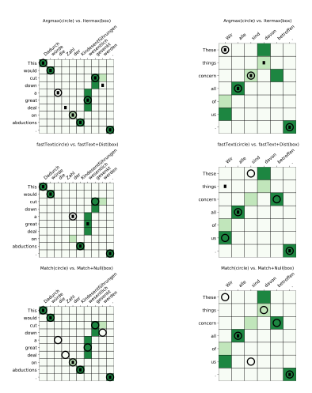

## <span id="page-0-1"></span>SimAlign: High Quality Word Alignments Without Parallel Training Data Using Static and Contextualized Embeddings

Masoud Jalili Sabet<sup>∗</sup><sup>1</sup> , Philipp Dufter<sup>∗</sup><sup>1</sup> , Franc¸ois Yvon<sup>2</sup> , Hinrich Schutze ¨ 1 <sup>1</sup> Center for Information and Language Processing (CIS), LMU Munich, Germany <sup>2</sup> Universite Paris-Saclay, CNRS, LIMSI, France ´ {masoud,philipp}@cis.lmu.de,francois.yvon@limsi.fr

## Abstract

Word alignments are useful for tasks like statistical and neural machine translation (NMT) and cross-lingual annotation projection. Statistical word aligners perform well, as do methods that extract alignments jointly with translations in NMT. However, most approaches require parallel training data, and quality decreases as less training data is available. We propose word alignment methods that require no parallel data. The key idea is to leverage multilingual word embeddings – both static and contextualized – for word alignment. Our multilingual embeddings are created from monolingual data only without relying on any parallel data or dictionaries. We find that alignments created from embeddings are superior for four and comparable for two language pairs compared to those produced by traditional statistical aligners – even with abundant parallel data; e.g., contextualized embeddings achieve a word alignment F<sup>1</sup> for English-German that is 5 percentage points higher than eflomal, a high-quality statistical aligner, trained on 100k parallel sentences.

## 1 Introduction

Word alignments are essential for statistical machine translation and useful in NMT, e.g., for imposing priors on attention matrices [\(Liu et al.,](#page-10-0) [2016;](#page-10-0) [Chen et al.,](#page-8-0) [2016;](#page-8-0) [Alkhouli and Ney,](#page-8-1) [2017;](#page-8-1) [Alkhouli et al.,](#page-8-2) [2018\)](#page-8-2) or for decoding [\(Alkhouli](#page-8-3) [et al.,](#page-8-3) [2016;](#page-8-3) [Press and Smith,](#page-11-0) [2018\)](#page-11-0). Further, word alignments have been successfully used in a range of tasks such as typological analysis [\(Lewis and](#page-10-1) [Xia,](#page-10-1) [2008;](#page-10-1) [Ostling](#page-10-2) ¨ , [2015b\)](#page-10-2), annotation projection [\(Yarowsky et al.,](#page-11-1) [2001;](#page-11-1) [Pado and Lapata](#page-10-3) ´ , [2009;](#page-10-3) [Asgari and Schutze](#page-8-4) ¨ , [2017;](#page-8-4) [Huck et al.,](#page-9-0) [2019\)](#page-9-0) and creating multilingual embeddings [\(Guo et al.,](#page-9-1) [2016;](#page-9-1) [Ammar et al.,](#page-8-5) [2016;](#page-8-5) [Dufter et al.,](#page-9-2) [2018\)](#page-9-2).

<span id="page-0-0"></span>

Figure 1: Our method does not rely on parallel training data and can align distant language pairs (German-Uzbek, top) and even mixed sentences (bottom). Example sentence is manually created. Algorithm: Itermax.

Statistical word aligners such as the IBM models [\(Brown et al.,](#page-8-6) [1993\)](#page-8-6) and their implementations Giza++ [\(Och and Ney,](#page-10-4) [2003\)](#page-10-4), fast-align [\(Dyer](#page-9-3) [et al.,](#page-9-3) [2013\)](#page-9-3), as well as newer models such as eflomal [\(Ostling and Tiedemann](#page-10-5) ¨ , [2016\)](#page-10-5) are widely used for alignment. With the rise of NMT [\(Bahdanau](#page-8-7) [et al.,](#page-8-7) [2014\)](#page-8-7), attempts have been made to interpret attention matrices as soft word alignments [\(Cohn](#page-9-4) [et al.,](#page-9-4) [2016;](#page-9-4) [Koehn and Knowles,](#page-10-6) [2017;](#page-10-6) [Ghader](#page-9-5) [and Monz,](#page-9-5) [2017\)](#page-9-5). Several methods create alignments from attention matrices [\(Peter et al.,](#page-10-7) [2017;](#page-10-7) [Zenkel et al.,](#page-11-2) [2019\)](#page-11-2) or pursue a multitask approach for alignment and translation [\(Garg et al.,](#page-9-6) [2019\)](#page-9-6). However, most systems require parallel data (in sufficient amount to train high quality NMT systems) and their performance deteriorates when parallel text is scarce (Tables 1–2 in [\(Och and Ney,](#page-10-4) [2003\)](#page-10-4)).

Recent unsupervised multilingual embedding algorithms that use only non-parallel data provide high quality static [\(Artetxe et al.,](#page-8-8) [2018;](#page-8-8) [Conneau](#page-9-7) [et al.,](#page-9-7) [2018\)](#page-9-7) and contextualized embeddings [\(De](#page-9-8)[vlin et al.,](#page-9-8) [2019;](#page-9-8) [Conneau et al.,](#page-9-9) [2020\)](#page-9-9). *Our key idea is to leverage these embeddings for word alignments – by extracting alignments from similarity matrices induced from embeddings – without relying on parallel data.* Requiring no or little parallel data is advantageous, e.g., in the low-resource case and in domain-specific settings without parallel data. A lack of parallel data cannot be easily

<sup>∗</sup> Equal contribution - random order.

remedied: mining parallel sentences is possible (Schwenk et al., 2019) but assumes that comparable, monolingual corpora contain parallel sentences. Further, we find that large amounts of mined parallel data do not necessarily improve alignment quality.

Our main **contribution** is that we show that word alignments obtained from multilingual pretrained language models are superior for four and comparable for two language pairs, compared to strong statistical word aligners like eflomal even in high resource scenarios. Additionally, (1) we introduce three new alignment methods based on the matrix of embedding similarities and two extensions that handle null words and integrate positional information. They permit a flexible tradeoff of recall and precision. (2) We provide evidence that subword processing is beneficial for aligning rare words. (3) We bundle the source code of our methods in a tool called *SimAlign*, which is available. An interactive online demo is available.

#### 2 Methods

#### 2.1 Alignments from Similarity Matrices

We propose three methods to obtain alignments from similarity matrices. Argmax is a simple baseline, IterMax a novel iterative algorithm, and Match a graph-theoretical method based on identifying matchings in a bipartite graph.

Consider parallel sentences  $s^{(e)}, s^{(f)}$ , with lengths  $l_e$ ,  $l_f$  in languages e, f. Assume we have access to some embedding function  $\mathcal{E}$  that maps each word in a sentence to a d-dimensional vector, i.e.,  $\mathcal{E}(s^{(k)}) \in \mathbb{R}^{l_k \times d}$  for  $k \in \{e, f\}$ . Let  $\mathcal{E}(s^{(k)})_i$ denote the vector of the *i*-th word in sentence  $s^{(k)}$ . For static embeddings  $\mathcal{E}(s^{(k)})_i$  depends only on the word i in language k whereas for contextualized embeddings the vector depends on the full context  $s^{(k)}$ . We define the *similarity matrix* as the matrix  $S \in [0,1]^{l_e \times l_f}$  induced by the embeddings where  $S_{ij} := \sin \left( \mathcal{E}(s^{(e)})_i, \mathcal{E}(s^{(f)})_i \right)$  is some normalized measure of similarity, e.g., cosine-similarity normalized to be between 0 and 1. We now describe our methods for extracting alignments from S, i.e., obtaining a binary matrix  $A \in \{0,1\}^{l_e \times l_f}$ .

**Argmax.** A simple baseline is to align i and j when  $s_i^{(e)}$  is the most similar word to  $s_j^{(f)}$  and

#### <span id="page-1-2"></span>Algorithm 1 Itermax.

```
1: procedure ITERMAX(S, n_{\max}, \alpha \in [0, 1])
2: A, M = zeros_like(S)
3: for n \in [1, \dots, n_{\max}] do
4: \forall i, j:

5: M_{ij} = \begin{cases} 1 \text{ if } \max\left(\sum_{l=0}^{l_e} A_{lj}, \sum_{l=0}^{l_f} A_{il}\right) = 0 \\ 0 \text{ if } \min\left(\sum_{l=0}^{l_e} A_{lj}, \sum_{l=0}^{l_f} A_{il}\right) > 0 \\ \alpha \text{ otherwise} \end{cases}
6: A_{\text{to\_add}} = \text{get\_argmax\_alignments}(S \odot M)
7: A = A + A_{\text{to\_add}}
8: end for
9: return A
10: end procedure
```

Figure 2: Description of the Itermax algorithm. *ze-ros\_like* yields a matrix with zeros and with same shape as the input, *get\_argmax\_alignments* returns alignments obtained using the Argmax Method,  $\odot$  is elementwise multiplication.

vice-versa. That is, we set  $A_{ij} = 1$  if

$$(i = \arg \max_{l} S_{l,j}) \wedge (j = \arg \max_{l} S_{i,l})$$

and  $A_{ij}=0$  otherwise. In case of ties, which are unlikely in similarity matrices, we choose the smaller index. If all entries in a row i or column j of S are 0 we set  $A_{ij}=0$  (this case can appear in Itermax). Similar methods have been applied to co-occurrences (Melamed, 2000) ("competitive linking"), Dice coefficients (Och and Ney, 2003) and attention matrices (Garg et al., 2019).

**Itermax.** There are many sentences for which Argmax only identifies few alignment edges because mutual argmaxes can be rare. As a remedy, we apply Argmax iteratively. Specifically, we modify the similarity matrix conditioned on the alignment edges found in a previous iteration: if two words i and j have both been aligned, we zero out the similarity. Similarly, if *neither* is aligned we leave the similarity unchanged. In case only one of them is aligned, we multiply the similarity with a discount factor  $\alpha \in [0, 1]$ . Intuitively, this encourages the model to focus on unaligned word pairs. However, if the similarity with an already aligned word is exceptionally high, the model can add an additional edge. Note that this explicitly allows one token to be aligned to multiple other tokens. For details on the algorithm see Figure 2.

**Match.** Argmax finds a local, not a global optimum and Itermax is a greedy algorithm. To find global optima, we frame alignment as an assign-

<span id="page-1-1"></span><span id="page-1-0"></span><sup>1</sup>https://github.com/cisnlp/simalign
2https://simalign.cis.lmu.de/

ment problem: we search for a maximum-weight maximal matching (e.g., [\(Kuhn,](#page-10-9) [1955\)](#page-10-9)) in the bipartite weighted graph which is induced by the similarity matrix. This optimization problem is defined by

$$A^* = \operatorname{argmax}_{A \in \{0,1\}^{le \times l_f}} \sum_{i=1}^{l_e} \sum_{j=1}^{l_f} A_{ij} S_{ij}$$

subject to A being a matching (i.e., each node has at most one edge) that is maximal (i.e., no additional edge can be added). There are known algorithms to solve the above problem in polynomial time (e.g., [\(Galil,](#page-9-10) [1986\)](#page-9-10)).

Note that alignments generated with the match method are inherently bidirectional. None of our methods require additional symmetrization as postprocessing.

## 2.2 Distortion and Null Extensions

Distortion Correction [Dist]. Distortion, as introduced in IBM Model 2, is essential for alignments based on non-contextualized embeddings since the similarity of two words is solely based on their surface form, independent of position. To penalize high distortions, we multiply the similarity matrix S componentwise with

$$P_{i,j} = 1 - \kappa \left( i/l_e - j/l_f \right)^2,$$

where κ is a hyperparameter to scale the distortion matrix P between [(1 − κ), 1]. We use κ = 0.5. See supplementary for different values. We can interpret this as imposing a localitypreserving prior: given a choice, a word should be aligned to a word with a similar relative position ((i/l<sup>e</sup> − j/l<sup>f</sup> ) 2 close to 0) rather than a more distant word (large (i/l<sup>e</sup> − j/l<sup>f</sup> ) 2 ).

Null. Null words model untranslated words and are an important part of alignment models. We propose to model null words as follows: if a word is not particularly similar to any of the words in the target sentence, we do not align it. Specifically, given an alignment matrix A, we remove alignment edges when the normalized entropy of the similarity distribution is above a threshold τ , a hyperparameter. We use normalized entropy (i.e., entropy divided by the log of sentence length) to account for different sentence lengths; i.e., we set Aij = 0 if

$$\min(-\frac{\sum_{k=1}^{l_f} S_{ik}^h \log S_{ik}^h}{\log l_f}, -\frac{\sum_{k=1}^{l_e} S_{kj}^v \log S_{kj}^v}{\log l_e}) > \tau,$$

where S h ik := Sik/ Pl<sup>f</sup> <sup>m</sup>=1 Sim, and S v kj := Skj/ Pl<sup>e</sup> <sup>m</sup>=1 Smj . As the ideal value of τ depends on the actual similarity scores we set τ to a percentile of the entropy values of the similarity distribution across all aligned edges (we use the 95th percentile). Different percentiles are in the supplementary.

## 3 Experiments

#### 3.1 Embedding Learning

Static. We train monolingual embeddings with fastText [\(Bojanowski et al.,](#page-8-9) [2017\)](#page-8-9) for each language on its Wikipedia. We then use VecMap [\(Artetxe et al.,](#page-8-8) [2018\)](#page-8-8) to map the embeddings into a common multilingual space. Note that this algorithm works without any crosslingual supervision (e.g., multilingual dictionaries). We use the same procedure for word and subword levels. We use the label fastText to refer to these embeddings as well as the alignments induced by them.

Contextualized. We use the multilingual BERT model (mBERT).[3](#page-2-0) It is pretrained on the 104 largest Wikipedia languages. This model only provides embeddings at the subword level. To obtain a word embedding, we simply average the vectors of its subwords. We consider word representations from all 12 layers as well as the concatenation of all layers. Note that the model is not finetuned. We denote this method as mBERT[i] (when using embeddings from the i-th layer, where 0 means using the non-contextualized initial embedding layer) and mBERT[conc] (for concatenation).

In addition, we use XLM-RoBERTa base [\(Con](#page-9-9)[neau et al.,](#page-9-9) [2020\)](#page-9-9), which is pretrained on 100 languages on cleaned CommonCrawl data [\(Wenzek](#page-11-4) [et al.,](#page-11-4) [2020\)](#page-11-4). We denote alignments obtained using the embeddings from the i-th layer by XLM-R[i].

#### 3.2 Word and Subword Alignments

We investigate both alignments between subwords such as wordpiece [\(Schuster and Nakajima,](#page-11-5) [2012\)](#page-11-5) (which are widely used for contextualized language models) and words. We refer to computing alignment edges between words as *word level* and between subwords as *subword level*. Note that gold standards are all word-level. In order to evaluate alignments obtained at the subword level we convert subword to word alignments using the heuristic "two words are aligned if any of their subwords are

<span id="page-2-0"></span><sup>3</sup>[https://github.com/google-research/](https://github.com/google-research/bert/blob/master/multilingual.md) [bert/blob/master/multilingual.md](https://github.com/google-research/bert/blob/master/multilingual.md)

<span id="page-3-0"></span>

Figure 3: Subword alignments are always converted to word alignments for evaluation.

aligned" (see Figure [3\)](#page-3-0). As a result a single word can be aligned with multiple other words.

For the *word* level, we use the NLTK tokenizer [\(Bird et al.,](#page-8-10) [2009\)](#page-8-10) (e.g., for tokenizing Wikipedia in order to train fastText). For the *subword* level, we generally use multilingual BERT's vocabulary<sup>3</sup> and BERT's wordpiece tokenizer. For XLM-R we use the XLM-R subword vocabulary. Since gold standards are already tokenized, they do not require additional tokenization.

#### 3.3 Baselines

We compare to three popular statistical alignment models that all require parallel training data. fastalign/IBM2 [\(Dyer et al.,](#page-9-3) [2013\)](#page-9-3) is an implementation of an alignment algorithm based on IBM Model 2. It is popular because of its speed and high quality. eflomal[4](#page-3-1) (based on efmaral by [Ostling](#page-10-5) ¨ [and Tiedemann](#page-10-5) [\(2016\)](#page-10-5)), a Bayesian model with Markov Chain Monte Carlo inference, is claimed to outperform fast-align on speed and quality. Further we use the widely used software package Giza++/IBM4 [\(Och and Ney,](#page-10-4) [2003\)](#page-10-4), which implements IBM alignment models. We use its standard settings: 5 iterations each for the HMM model, IBM Models 1, 3 and 4 with p<sup>0</sup> = 0.98.

Symmetrization. Probabilistic word alignment models create forward and backward alignments and then symmetrize them [\(Och and Ney,](#page-10-4) [2003;](#page-10-4) [Koehn et al.,](#page-9-11) [2005\)](#page-9-11). We compared the symmetrization methods grow-diag-final-and (GDFA) and intersection and found them to perform comparably; see supplementary. We use GDFA throughout the paper.

## 3.4 Evaluation Measures

Given a set of predicted alignment edges A and a set of sure, possible gold standard edges S, P (where S ⊂ P), we use the following evaluation measures:

$$\begin{aligned} &\operatorname{prec} = \frac{|A \cap P|}{|A|}, \operatorname{rec} = \frac{|A \cap S|}{|S|}, \\ &F_1 = \frac{2 \operatorname{prec} \operatorname{rec}}{\operatorname{prec} + \operatorname{rec}}, \\ &\operatorname{AER} = 1 - \frac{|A \cap S| + |A \cap P|}{|A| + |S|}, \end{aligned}$$

where | · | denotes the cardinality of a set. This is the standard evaluation [\(Och and Ney,](#page-10-4) [2003\)](#page-10-4).

#### 3.5 Data

Our test data are a diverse set of 6 language pairs: Czech, German, Persian, French, Hindi and Romanian, always paired with English. See Table [11](#page-14-0) for corpora and supplementary for URLs.

For our baselines requiring parallel training data (i.e., eflomal, fast-align and Giza++) we select additional parallel training data that is consistent with the target domain where available. See Table [11](#page-14-0) for the corpora. Unless indicated otherwise we use the whole parallel training data. Figure [5](#page-5-0) shows the effect of using more or less training data.

Given the large amount of possible experiments when considering 6 language pairs we do not have space to present all numbers for all languages. If we show results for only one pair, we choose ENG-DEU as it is an established and well-known dataset (EuroParl). If we show results for more languages we fall back to DEU, CES and HIN, to show effects on a mid-resource morphologically rich language (CES) and a low-resource language written in a different script (HIN).

## 4 Results

#### 4.1 Embedding Layer

Figure [4](#page-4-0) shows a parabolic trend across layers of mBERT and XLM-R. We use layer 8 in this paper because it has best performance. This is consistent with other work [\(Hewitt and Manning,](#page-9-12) [2019;](#page-9-12) [Tenney et al.,](#page-11-6) [2019\)](#page-11-6): in the first layers the contextualization is too weak for high-quality alignments while the last layers are too specialized on the pretraining task (masked language modeling).

<span id="page-3-1"></span><sup>4</sup><github.com/robertostling/eflomal>

| Lang.   | Gold<br>Standard              | Gold St.<br>Size | S     | $ P \setminus S $ | Parallel<br>Data                     | Parallel<br>Data Size | Wikipedia<br>Size |
|---------|-------------------------------|------------------|-------|-------------------|--------------------------------------|-----------------------|-------------------|
| ENG-CES | (Mareček, 2008)               | 2500             | 44292 | 23132             | EuroParl (Koehn, 2005)               | 646k                  | 8M                |
| ENG-DEU | EuroParl-baseda               | 508              | 9612  | 921               | EuroParl (Koehn, 2005)               | 1920k                 | 48M               |
| ENG-FAS | (Tavakoli and Faili, 2014)    | 400              | 11606 | 0                 | TEP (Pilevar et al., 2011)           | 600k                  | 5M                |
| ENG-FRA | WPT2003, (Och and Ney, 2000), | 447              | 4038  | 13400             | Hansards (Germann, 2001)             | 1130k                 | 32M               |
| ENG-HIN | WPT2005 <sup>b</sup>          | 90               | 1409  | 0                 | Emille (McEnery et al., 2000)        | 3k                    | 1M                |
| ENG-RON | WPT2005 <sup>b</sup>          | 203              | 5033  | 0                 | Constitution, Newspaper <sup>b</sup> | 50k                   | 3M                |

a www-i6.informatik.rwth-aachen.de/goldAlignment/bhttp://web.eecs.umich.edu/~mihalcea/wpt05/

Table 1: Overview of datasets. "Lang." uses ISO 639-3 language codes. "Size" refers to the number of sentences. "Parallel Data Size" refers to the number of parallel sentences in addition to the gold alignments that is used for training the baselines. Our sentence tokenized version of the English Wikipedia has 105M sentences.

<span id="page-4-1"></span>

|            | Method                                                                                                                                             | $\left  \left  \stackrel{\text{EN}}{F_1} \right  \right $ | IG-CES<br>AER     | $ F_1 $           | NG-DEU<br>AER     | $ F_1 $                  | IG-FAS<br>AER            | $ F_1 $                  | NG-FRA<br>AER                   | $ F_1 $                  | NG-HIN<br>AER            | $ F_1 $             | IG-RON<br>AER     |
|------------|----------------------------------------------------------------------------------------------------------------------------------------------------|-----------------------------------------------------------|-------------------|-------------------|-------------------|--------------------------|--------------------------|--------------------------|---------------------------------|--------------------------|--------------------------|---------------------|-------------------|
| /ork       | (Östling, 2015a) Bayesian<br>(Östling, 2015a) Giza++<br>(Legrand et al., 2016) Ensemble Method                                                     | .81                                                       | .16               |                   |                   |                          |                          | .94<br>.92               | .06<br>.07<br>.10               | .57<br>.51               | .43<br>.49               | .73<br>.72          | <b>.27</b> .28    |
| Prior Work | (Östling and Tiedemann, 2016) efmaral<br>(Östling and Tiedemann, 2016) fast-align<br>(Zenkel et al., 2019) Giza++<br>(Garg et al., 2019) Multitask |                                                           |                   |                   | .21<br>.20        |                          |                          | .93<br>.86               | .08<br>.15<br><b>.06</b><br>.08 | .53<br>.33               | .47<br>.67               | .72<br>.68          | .28<br>.33<br>.28 |
| Baselines  | fast-align/IBM2<br>  Giza++/IBM4<br>  eflomal                                                                                                      | .76<br> .75<br> .85                                       | .25<br>.26<br>.15 | .71<br>.77<br>.77 | .29<br>.23<br>.23 | .57<br> .51<br> .61      | .43<br>.49<br>.39        | .86<br>.92<br>.93        | .15<br>.09<br>.08               | .34<br> .45<br> .51      | .66<br>.55<br>.49        | .68<br> .69<br> .71 | .33<br>.31<br>.29 |
|            | fast-align/IBM2<br>  Giza++/IBM4<br>  eflomal                                                                                                      | .78<br> .82<br> .84                                       | .23<br>.18<br>.17 | .71<br>.78<br>.76 | .30<br>.22<br>.24 | .58<br> .57<br> .63      | .42<br>.43<br>.37        | .85<br>.92<br>.91        | .16<br>.09<br>.09               | .38<br> .48<br> .52      | .62<br>.52<br>.48        | .68<br> .69<br> .72 | .32<br>.32<br>.28 |
| >          | fastText - Argmax   mBERT[8] - Argmax   XLM-R[8] - Argmax                                                                                          | .70<br>  <b>.87</b><br>  <b>.87</b>                       | .30<br>.13<br>.13 | .60<br>.79<br>.79 | .40<br>.21<br>.21 | .50<br> .67<br> .70      | .50<br>.33<br>.30        | .77<br><b>.94</b><br>.93 | .22<br>.06<br>.06               | .49<br>.54<br>.59        | .52<br>.47<br>.41        | .47<br> .64<br> .70 | .53<br>.36<br>.30 |
| This       | fastText - Argmax<br>  mBERT[8] - Argmax<br>  XLM-R[8] - Argmax                                                                                    | .58<br> .86<br>  <b>.87</b>                               | .42<br>.14<br>.13 | .56<br>.81<br>.81 | .44<br>.19<br>.19 | .09<br>.67<br><b>.71</b> | .91<br>.33<br><b>.29</b> | .73<br><b>.94</b><br>.93 | .26<br>.06<br>.07               | .04<br>.55<br><b>.61</b> | .96<br>.45<br><b>.39</b> | .43<br> .65<br> .71 | .58<br>.35<br>.29 |

Table 2: Comparison of our methods, baselines and prior work in unsupervised word alignment. Best result per column in bold. A detailed version of the table with precision/recall and Itermax/Match results is in supplementary.

<span id="page-4-0"></span>

Figure 4: Word alignment performance across layers of mBERT (top) and XLM-R (bottom). Results are  $F_1$  with Argmax at the subword level.

#### 4.2 Comparison with Prior Work

**Contextual Embeddings.** Table 2 shows that mBERT and XLM-R consistently perform well with the Argmax method. XLM-R yields mostly higher values than mBERT. Our three baselines, eflomal, fast-align and Giza++, are always outper-

formed (except for RON). We outperform all prior work except for FRA where we match the performance and RON. This comparison is not entirely fair because methods relying on parallel data have access to the parallel sentences of the test data during training whereas our methods do not.

Romanian might be a special case as it exhibits a large amount of many to one links and further lacks determiners. How determiners are handled in the gold standard depends heavily on the annotation guidelines. Note that one of our settings, XLM-R[8] with Itermax at the subword level, has an F1 of .72 for ENG-RON, which comes very close to the performance by (Östling, 2015a) (see Table 3).

In summary, extracting alignments from similarity matrices is a very simple and efficient method that performs surprisingly strongly. It outperforms strong statistical baselines and most prior work in unsupervised word alignment for CES, DEU, FAS and HIN and is comparable for FRA and RON. We attribute this to the strong contextualization in mBERT and XLM-R.

<span id="page-5-0"></span>

Figure 5: Learning curves of fast-align/eflomal vs. embedding-based alignments. Results shown are  $F_1$  for ENG-DEU, contrasting subword and word representations. Up to 1.9M parallel sentences we use EuroParl. To demonstrate the effect with abundant parallel data we add up to 37M *additional* parallel sentences from ParaCrawl (Esplà et al., 2019) (see grey area).

**Static Embeddings.** fastText shows a solid performance on word level, which is worse but comes close to fast-align and outperforms it for HIN. We consider this surprising as fastText did not have access to parallel data or any multilingual signal. VecMap can also be used with crosslingual dictionaries. We expect this to boost performance and fastText could then become a viable alternative to fast-align.

**Amount of Parallel Data.** Figure 5 shows that fast-align and eflomal get better with more training data with eflomal outperforming fast-align, as expected. However, even with 1.9M parallel sentences mBERT outperforms both baselines. When adding up to 37M additional parallel sentences from ParaCrawl (Esplà et al., 2019) performance for fast-align increases slightly, however, eflomal decreases (grey area in plot). ParaCrawl contains mined parallel sentences whose lower quality probably harms efformal. fastText (with distortion) is competitive with eflomal for fewer than 1000 parallel sentences and outperforms fast-align even with 10k sentences. Thus for very small parallel corpora (<10k sentences) using fastText embeddings is an alternative to fast-align.

The main takeaway from Figure 5 is that mBERT-based alignments, a method that does not need any parallel training data, outperforms state-of-the-art aligners like eflomal for ENG-DEU, even in the very high resource case.

<span id="page-5-1"></span>

| Emb.     | Method  | ENG-<br>CES | ENG-<br>DEU | ENG-<br>FAS | ENG-<br>FRA | ENG-<br>HIN | ENG-<br>RON |
|----------|---------|-------------|-------------|-------------|-------------|-------------|-------------|
| mBERT[8] | Argmax  | .86         | .81         | .67         | . <b>94</b> | .55         | .65         |
|          | Itermax | .86         | .81         | <b>.70</b>  | .93         | .58         | <b>.69</b>  |
|          | Match   | .82         | .78         | .67         | .90         | .58         | .67         |
| XLM-R[8] | Argmax  | .87         | <b>.81</b>  | .71         | <b>.93</b>  | .61         | .71         |
|          | Itermax | .86         | .80         | . <b>72</b> | .92         | .62         | . <b>72</b> |
|          | Match   | .81         | .76         | .68         | .88         | .60         | .70         |

Table 3: Comparison of our three proposed methods across all languages for the best embeddings from Table 2: mBERT[8] and XLM-R[8]. We show  $F_1$  at the subword level. Best result per embedding type in bold.

<span id="page-5-2"></span>

|          |               |                 | ] ]               | ENG-DEU |       |                   |                   | ENG  | -CE   | S                         | ENG-HIN           |                          |       |                   |
|----------|---------------|-----------------|-------------------|---------|-------|-------------------|-------------------|------|-------|---------------------------|-------------------|--------------------------|-------|-------------------|
| Emb.     | $n_{\rm max}$ | $\alpha$        | Prec.             | Rec.    | $F_1$ | AER               | Prec.             | Rec. | $F_1$ | AER                       | Prec.             | Rec.                     | $F_1$ | AER               |
|          | 1             | -               | .92               | .69     | .79   | .21               | .95               | .80  | .87   | .13                       | .84               | .39                      | .54   | .47               |
| mBERT[8] | 2             | .90<br>.95<br>1 |                   | .80     | .81   | .19<br>.19<br>.22 | .87<br>.85<br>.80 | .89  | .87   | .14<br><b>.13</b><br>.17  | .75<br>.73<br>.63 | .48                      | .58   | .42<br>.42<br>.47 |
| _        | 3             | .90<br>.95<br>1 | .81<br>.78<br>.73 | .83     | .81   | .20<br>.20<br>.23 |                   | .91  | .86   | .15<br>.15<br>.18         | .68               | .49<br><b>.52</b><br>.51 | .59   |                   |
|          | 1             | -               | .81               | .48     | .60   | .40               | .86               | .59  | .70   | .30                       | .75               | .36                      | .49   | .52               |
| fastText | 2             | .90<br>.95<br>1 | .69<br>.66<br>.59 | .56     | .61   | .38<br>.39<br>.43 |                   | .69  | .70   | . <b>29</b><br>.30<br>.37 | .63<br>.59<br>.53 | .42<br>.41<br>.39        | .48   | .52               |
|          | 3             | .90<br>.95<br>1 | .59               | .59     | .59   |                   |                   | .73  | .68   | .31<br>.33<br>.39         | .57<br>.53<br>.48 | .43<br><b>.44</b><br>.43 | .48   | .51<br>.52<br>.55 |

Table 4: Itermax with different number of iterations  $(n_{\text{max}})$  and different  $\alpha$ . Results are at the word level.

#### 4.3 Additional Methods and Extensions

We already showed that Argmax yields alignments that are competitive with the state of the art. In this section we compare all our proposed methods and extensions more closely.

**Itermax.** Table 4 shows results for Argmax (i.e., 1 Iteration) as well as Itermax (i.e., 2 or more iterations of Argmax). As expected, with more iterations precision drops in favor of recall. Overall, Itermax achieves higher  $F_1$  scores for the three language pairs (equal for ENG-CES) both for mBERT[8] and fastText embeddings. For Hindi the performance increase is the highest. We hypothesize that for more distant languages Itermax is more beneficial as similarity between wordpieces may be generally lower, thus exhibiting fewer mutual argmaxes. For the rest of the paper if we use Itermax we use 2 Iterations with  $\alpha = 0.9$  as it exhibits best performance (5 out of 6 wins in Table 4).

**Argmax/Itermax/Match.** In Table 3 we compare our three proposed methods in terms of  $F_1$  across all languages. We chose to show the two

<span id="page-6-0"></span>

|          |                           |                   | ENG-DEU |                                           |                                                       | ENG-CES |                                           | ENG-HIN           |  |  |                                           |
|----------|---------------------------|-------------------|---------|-------------------------------------------|-------------------------------------------------------|---------|-------------------------------------------|-------------------|--|--|-------------------------------------------|
| Emb.     | Method                    |                   |         |                                           | Prec. Rec. F1 AER Prec. Rec. F1 AER Prec. Rec. F1 AER |         |                                           |                   |  |  |                                           |
|          | Argmax<br>+Dist<br>+Null  | .81<br>.84<br>.81 |         | .48 .60 .40<br>.54 .65 .35<br>.46 .59 .41 | .86<br>.89<br>.86                                     |         | .59 .70 .30<br>.68 .77 .23<br>.56 .68 .32 | .75<br>.64<br>.74 |  |  | .36 .49 .52<br>.30 .41 .59<br>.34 .46 .54 |
| fastText | Itermax<br>+Dist<br>+Null | .69<br>.71<br>.69 |         | .56 .62 .38<br>.62 .66 .34<br>.53 .60 .40 | .74<br>.75<br>.74                                     |         | .69 .72 .29<br>.76 .76 .25<br>.66 .70 .30 | .63<br>.54<br>.63 |  |  | .42 .51 .49<br>.37 .44 .57<br>.40 .49 .51 |
|          | Match<br>+Dist<br>+Null   | .60<br>.67<br>.61 |         | .58 .59 .41<br>.64 .65 .35<br>.56 .58 .42 | .65<br>.72<br>.66                                     |         | .71 .68 .32<br>.78 .75 .25<br>.69 .67 .33 | .55<br>.50<br>.56 |  |  | .43 .48 .52<br>.39 .43 .57<br>.41 .48 .52 |
|          | Argmax<br>+Dist<br>+Null  | .92<br>.91<br>.93 |         | .69 .79 .21<br>.67 .77 .23<br>.67 .78 .22 | .95<br>.93<br>.95                                     |         | .80 .87 .13<br>.79 .85 .15<br>.77 .85 .15 | .84<br>.68<br>.85 |  |  | .39 .54 .47<br>.29 .41 .59<br>.38 .53 .47 |
| mBERT[8] | Itermax<br>+Dist<br>+Null | .85<br>.82<br>.86 |         | .77 .81 .19<br>.75 .79 .21<br>.75 .80 .20 | .87<br>.84<br>.88                                     |         | .87 .87 .14<br>.85 .85 .15<br>.84 .86 .14 | .75<br>.56<br>.76 |  |  | .47 .58 .43<br>.34 .43 .58<br>.45 .57 .43 |
|          | Match<br>+Dist<br>+Null   | .78<br>.75<br>.80 |         | .74 .76 .24<br>.71 .73 .27<br>.73 .76 .24 | .81<br>.79<br>.83                                     |         | .85 .83 .17<br>.83 .81 .20<br>.83 .83 .17 | .67<br>.45<br>.68 |  |  | .52 .59 .42<br>.35 .39 .61<br>.51 .58 .42 |

Table 5: Analysis of Null and Distortion Extensions. All alignments are obtained at word-level. Best result per embedding type and method in bold.

best performing settings from Table [2:](#page-4-1) mBERT[8] and XLM-R[8] at the subword level. Itermax performs slightly better than Argmax with 6 wins, 4 losses and 2 ties. Itermax seems to help more for more distant languages such as FAS, HIN and RON, but harms for FRA. Match has the lowest F1, but generally exhibits a higher recall (see e.g., Table [5\)](#page-6-0).

Null and Distortion Extensions. Table [5](#page-6-0) shows that Argmax and Itermax generally have higher precision, whereas Match has higher recall. Adding Null almost always increases precision, but at the cost of recall, resulting mostly in a lower F<sup>1</sup> score. Adding a distortion prior boosts performance for static embeddings, e.g., from .70 to .77 for ENG-CES Argmax F<sup>1</sup> and similarly for ENG-DEU. For Hindi a distortion prior is harmful. Dist has little and sometimes harmful effects on mBERT indicating that mBERT's contextualized representations already match well across languages.

Summary. Argmax and Itermax exhibit the best and most stable performance. For most language pairs Itermax is recommended. If high recall alignments are required, Match is the recommended algorithm. Except for HIN, a distortion prior is beneficial for static embeddings. Null should be applied when one wants to push precision even higher (e.g., for annotation projection).

#### 4.4 Words and Subwords

Table [2](#page-4-1) shows that subword processing slightly outperforms word-level processing for most methods. Only fastText is harmed by subword processing.

<span id="page-6-1"></span>

Figure 6: Results for different frequency bins on ENG-DEU. An edge in S, P, or A is attributed to exactly one bin based on the minimum frequency of the involved words (denoted by x). Number of gold edges in brackets. Eflomal is trained on all 1.9M parallel sentences. Frequencies are computed on the same corpus.

<span id="page-6-2"></span>

|               |                 |                        |              |              | ADJ ADP ADV AUX NOUN PRON VERB |              |              |
|---------------|-----------------|------------------------|--------------|--------------|--------------------------------|--------------|--------------|
| eflomal       | Word<br>Subword | 0.83 0.69<br>0.82 0.68 | 0.72<br>0.71 | 0.63<br>0.57 | 0.85<br>0.85                   | 0.79<br>0.77 | 0.63<br>0.62 |
| mBERT[8] Word | Subword         | 0.79 0.74<br>0.81 0.75 | 0.71<br>0.72 | 0.71<br>0.72 | 0.81<br>0.87                   | 0.84<br>0.84 | 0.69<br>0.69 |

Table 6: Alignment performance (F1) on ENG-DEU for POS. We use mBERT[8](Argmax) and Eflomal trained on 1.9M parallel sentences on the word level.

We use VecMap to match (sub)word distributions across languages. We hypothesize that it is harder to match subword than word distributions – this effect is strongest for Persian and Hindi, probably due to different scripts and thus different subword distributions. Initial experiments showed that adding supervision in form of a dictionary helps restore performance. We will investigate this in future work.

We hypothesize that subword processing is beneficial for aligning rare words. To show this, we compute our evaluation measures for different frequency bins. More specifically, we only consider gold standard alignment edges for the computation where at least one of the member words has a certain frequency in a reference corpus (in our case all 1.9M lines from the ENG-DEU EuroParl corpus). That is, we only consider the edge (i, j) in A, S or P if the minimum of the source and target word frequency is in [γ<sup>l</sup> , γu) where γ<sup>l</sup> and γ<sup>u</sup> are bin boundaries.

Figure [6](#page-6-1) shows F<sup>1</sup> for different frequency bins. For rare words both eflomal and mBERT show a severely decreased performance at the word level, but not at the subword level. Thus, subword processing is indeed beneficial for rare words.

<span id="page-7-0"></span>At the same **time** , Regulation No 2078 of 1992 on environmentally compatible agricultural production methods adapted to the landscape **has** also contributed substantially to this trend .

Daneben **hat** die Verordnung 2078 aus dem Jahr 1992 über umweltverträgliche und landschaftsgerechte Produktionsweisen in der Landwirtschaft ebenfalls erheblich zu dieser Entwicklung beigetragen .

The Commission , for **its** part , **will** continue to play an active part in the intergovernmental conference .

Die Kommission **wird** bei der Regierungskonferenz **auch** weiterhin eine aktive Rolle spielen .

Figure 7: Example alignment of auxiliary verbs. Same setting as in Table [6.](#page-6-2) Solid lines: mBERT's alignment, identical to the gold standard. Dashed lines: eflomal's incorrect alignment.

#### 4.5 Part-Of-Speech Analysis

To analyze the performance with respect to different part-of-speech (POS) tags, the ENG-DEU gold standard was tagged with the Stanza toolkit [\(Qi](#page-11-8) [et al.,](#page-11-8) [2020\)](#page-11-8). We evaluate the alignment performance for each POS tag by only considering the alignment edges where at least one of their member words has this tag. Table [6](#page-6-2) shows results for frequent POS tags. Compared to eflomal, mBERT aligns auxiliaries, pronouns and verbs better. The relative position of auxiliaries and verbs in German can diverge strongly from that in English because they occur at the end of the sentence (verb-end position) in many clause types. Positions of pronouns can also diverge due to a more flexible word order in German. It is difficult for an HMM-based aligner like eflomal to model such high-distortion alignments, a property that has been found by prior work as well [\(Ho and Yvon,](#page-9-16) [2019\)](#page-9-16). In contrast, mBERT(Argmax) does not use distortion information, so high distortion is not a problem for it.

Figure [7](#page-7-0) gives an example for auxiliaries. The gold alignment ("has" – "hat") is correctly identified by mBERT (solid line). Eflomal generates an incorrect alignment ("time" – "hat"): the two words have about the same relative position, indicating that distortion minimization is the main reason for this incorrect alignment. Analyzing all auxiliary alignment edges, the average absolute value of the distance between aligned words is 2.72 for eflomal and 3.22 for mBERT. This indicates that eflomal is more reluctant than mBERT to generate highdistortion alignments and thus loses accuracy.

## 5 Related Work

[Brown et al.](#page-8-6) [\(1993\)](#page-8-6) introduced the IBM models, the best known statistical word aligners. More recent aligners, often based on IBM models, include fastalign [\(Dyer et al.,](#page-9-3) [2013\)](#page-9-3), Giza++ [\(Och and Ney,](#page-10-4) [2003\)](#page-10-4) and eflomal [\(Ostling and Tiedemann](#page-10-5) ¨ , [2016\)](#page-10-5). [\(Ostling](#page-10-14) ¨ , [2015a\)](#page-10-14) showed that Bayesian Alignment Models perform well. Neural network based extensions of these models have been considered [\(Ayan](#page-8-11) [et al.,](#page-8-11) [2005;](#page-8-11) [Ho and Yvon,](#page-9-16) [2019\)](#page-9-16). All of these models are trained on parallel text. Our method instead aligns based on embeddings that are induced from monolingual data only. We compare with prior methods and observe comparable performance.

Prior work on using learned representations for alignment includes [\(Smadja et al.,](#page-11-9) [1996;](#page-11-9) [Och and](#page-10-4) [Ney,](#page-10-4) [2003\)](#page-10-4) (Dice coefficient), [\(Jalili Sabet et al.,](#page-9-17) [2016\)](#page-9-17) (incorporation of embeddings into IBM models), [\(Legrand et al.,](#page-10-15) [2016\)](#page-10-15) (neural network alignment model) and [\(Pourdamghani et al.,](#page-11-10) [2018\)](#page-11-10) (embeddings are used to encourage words to align to similar words). [Tamura et al.](#page-11-11) [\(2014\)](#page-11-11) use recurrent neural networks to learn alignments. They use noise contrastive estimation to avoid supervision. [Yang et al.](#page-11-12) [\(2013\)](#page-11-12) train a neural network that uses pretrained word embeddings in the initial layer. All of this work requires parallel data. mBERT is used for word alignments in concurrent work: [Libovicky´](#page-10-16) [et al.](#page-10-16) [\(2019\)](#page-10-16) use the high quality of mBERT alignments as evidence for the "language-neutrality" of mBERT. [Nagata et al.](#page-10-17) [\(2020\)](#page-10-17) phrase word alignment as crosslingual span prediction and finetune mBERT using gold alignments.

Attention in NMT [\(Bahdanau et al.,](#page-8-7) [2014\)](#page-8-7) is related to a notion of soft alignment, but often deviates from conventional word alignments [\(Ghader](#page-9-5) [and Monz,](#page-9-5) [2017;](#page-9-5) [Koehn and Knowles,](#page-10-6) [2017\)](#page-10-6). One difference is that standard attention does not have access to the target word. To address this, [Pe](#page-10-7)[ter et al.](#page-10-7) [\(2017\)](#page-10-7) tailor attention matrices to obtain higher quality alignments. [Li et al.](#page-10-18) [\(2018\)](#page-10-18)'s and [Zenkel et al.](#page-11-2) [\(2019\)](#page-11-2)'s models perform similarly to and [Zenkel et al.](#page-11-13) [\(2020\)](#page-11-13) outperform Giza++. [Ding et al.](#page-9-18) [\(2019\)](#page-9-18) propose better decoding algorithms to deduce word alignments from NMT predictions. [Chen et al.](#page-8-0) [\(2016\)](#page-8-0), [Mi et al.](#page-10-19) [\(2016\)](#page-10-19) and [Garg et al.](#page-9-6) [\(2019\)](#page-9-6) obtain alignments and translations in a multitask setup. [Garg et al.](#page-9-6) [\(2019\)](#page-9-6) find that operating at the subword level can be beneficial for alignment models. [Li et al.](#page-10-20) [\(2019\)](#page-10-20) propose two methods to extract alignments from NMT

models, however they do not outperform fast-align. [Stengel-Eskin et al.](#page-11-14) [\(2019\)](#page-11-14) compute similarity matrices of encoder-decoder representations that are leveraged for word alignments, together with supervised learning, which requires manually annotated alignment. We find our proposed methods to be competitive with these approaches. In contrast to our work, they all require parallel data.

## 6 Conclusion

We presented word aligners based on contextualized embeddings that outperform in four and match the performance of state-of-the-art aligners in two language pairs; e.g., for ENG-DEU contextualized embeddings achieve an alignment F<sup>1</sup> that is 5 percentage points higher than eflomal trained on 100k parallel sentences. Further, we showed that alignments from static embeddings can be a viable alternative to statistical aligner when few parallel training data is available. In contrast to all prior work our methods do not require parallel data for training at all. With our proposed methods and extensions such as Match, Itermax and Null it is easy to obtain higher precision or recall depending on the use case.

Future work includes modeling fertility explicitly and investigating how to incorporate parallel data into the proposed methods.

## Acknowledgments

We gratefully acknowledge funding through a Zentrum Digitalisierung.Bayern fellowship awarded to the second author. This work was supported by the European Research Council (# 740516). We thank Matthias Huck, Jindˇrich Libovicky, Alex ´ Fraser and the anonymous reviewers for interesting discussions and valuable comments. Thanks to Jindˇrich for pointing out that mBERT can align mixed-language sentences as shown in Figure [1.](#page-0-0)

## References

<span id="page-8-2"></span>Tamer Alkhouli, Gabriel Bretschner, and Hermann Ney. 2018. [On the alignment problem in multi-head](https://doi.org/10.18653/v1/W18-6318) [attention-based neural machine translation.](https://doi.org/10.18653/v1/W18-6318) In *Proceedings of the Third Conference on Machine Translation: Research Papers*, Belgium, Brussels. Association for Computational Linguistics.

<span id="page-8-3"></span>Tamer Alkhouli, Gabriel Bretschner, Jan-Thorsten Peter, Mohammed Hethnawi, Andreas Guta, and Hermann Ney. 2016. [Alignment-based neural machine](https://doi.org/10.18653/v1/W16-2206) [translation.](https://doi.org/10.18653/v1/W16-2206) In *Proceedings of the First Conference*

*on Machine Translation: Volume 1, Research Papers*, Berlin, Germany. Association for Computational Linguistics.

<span id="page-8-1"></span>Tamer Alkhouli and Hermann Ney. 2017. [Biasing](https://doi.org/10.18653/v1/W17-4711) [attention-based recurrent neural networks using ex](https://doi.org/10.18653/v1/W17-4711)[ternal alignment information.](https://doi.org/10.18653/v1/W17-4711) In *Proceedings of the Second Conference on Machine Translation*, Copenhagen, Denmark. Association for Computational Linguistics.

<span id="page-8-5"></span>Waleed Ammar, George Mulcaire, Yulia Tsvetkov, Guillaume Lample, Chris Dyer, and Noah A Smith. 2016. [Massively multilingual word embeddings.](https://arxiv.org/pdf/1602.01925) *arXiv preprint arXiv:1602.01925*.

<span id="page-8-8"></span>Mikel Artetxe, Gorka Labaka, and Eneko Agirre. 2018. [A robust self-learning method for fully unsupervised](https://doi.org/10.18653/v1/P18-1073) [cross-lingual mappings of word embeddings.](https://doi.org/10.18653/v1/P18-1073) In *Proceedings of the 56th Annual Meeting of the Association for Computational Linguistics (Volume 1: Long Papers)*, Melbourne, Australia. Association for Computational Linguistics.

<span id="page-8-4"></span>Ehsaneddin Asgari and Hinrich Schutze. 2017. ¨ [Past,](https://doi.org/10.18653/v1/D17-1011) [present, future: A computational investigation of the](https://doi.org/10.18653/v1/D17-1011) [typology of tense in 1000 languages.](https://doi.org/10.18653/v1/D17-1011) In *Proceedings of the 2017 Conference on Empirical Methods in Natural Language Processing*, Copenhagen, Denmark. Association for Computational Linguistics.

<span id="page-8-11"></span>Necip Fazil Ayan, Bonnie J. Dorr, and Christof Monz. 2005. [NeurAlign: Combining word alignments us](https://www.aclweb.org/anthology/H05-1009)[ing neural networks.](https://www.aclweb.org/anthology/H05-1009) In *Proceedings of Human Language Technology Conference and Conference on Empirical Methods in Natural Language Processing*, Vancouver, British Columbia, Canada. Association for Computational Linguistics.

<span id="page-8-7"></span>Dzmitry Bahdanau, Kyunghyun Cho, and Yoshua Bengio. 2014. [Neural machine translation by jointly](https://arxiv.org/pdf/1409.0473.pdf) [learning to align and translate.](https://arxiv.org/pdf/1409.0473.pdf) In *Proceedings of the International Conference on Learning Representations*.

<span id="page-8-10"></span>Steven Bird, Ewan Klein, and Edward Loper. 2009. *[Natural language processing with Python: analyz](https://pdfs.semanticscholar.org/7a65/f23d990231d461418067c808b09d84c19b2c.pdf)[ing text with the natural language toolkit](https://pdfs.semanticscholar.org/7a65/f23d990231d461418067c808b09d84c19b2c.pdf)*. O'Reilly Media, Inc.

<span id="page-8-9"></span>Piotr Bojanowski, Edouard Grave, Armand Joulin, and Tomas Mikolov. 2017. [Enriching word vectors with](https://doi.org/10.1162/tacl_a_00051) [subword information.](https://doi.org/10.1162/tacl_a_00051) *Transactions of the Association for Computational Linguistics*, 5.

<span id="page-8-6"></span>Peter F. Brown, Stephen A. Della Pietra, Vincent J. Della Pietra, and Robert L. Mercer. 1993. [The math](https://www.aclweb.org/anthology/J93-2003)[ematics of statistical machine translation: Parameter](https://www.aclweb.org/anthology/J93-2003) [estimation.](https://www.aclweb.org/anthology/J93-2003) *Computational Linguistics*, 19(2).

<span id="page-8-0"></span>Wenhu Chen, Evgeny Matusov, Shahram Khadivi, and Jan-Thorsten Peter. 2016. [Guided alignment](https://amtaweb.org/wp-content/uploads/2016/10/AMTA2016_Research_Proceedings_v7.pdf#page=127) [training for topic-aware neural machine translation.](https://amtaweb.org/wp-content/uploads/2016/10/AMTA2016_Research_Proceedings_v7.pdf#page=127) *AMTA 2016*.

- <span id="page-9-4"></span>Trevor Cohn, Cong Duy Vu Hoang, Ekaterina Vymolova, Kaisheng Yao, Chris Dyer, and Gholamreza Haffari. 2016. [Incorporating structural alignment bi](https://doi.org/10.18653/v1/N16-1102)[ases into an attentional neural translation model.](https://doi.org/10.18653/v1/N16-1102) In *Proceedings of the 2016 Conference of the North American Chapter of the Association for Computational Linguistics: Human Language Technologies*, pages 876–885, San Diego, California. Association for Computational Linguistics.
- <span id="page-9-9"></span>Alexis Conneau, Kartikay Khandelwal, Naman Goyal, Vishrav Chaudhary, Guillaume Wenzek, Francisco Guzman, Edouard Grave, Myle Ott, Luke Zettle- ´ moyer, and Veselin Stoyanov. 2020. [Unsupervised](https://doi.org/10.18653/v1/2020.acl-main.747) [cross-lingual representation learning at scale.](https://doi.org/10.18653/v1/2020.acl-main.747) In *Proceedings of the 58th Annual Meeting of the Association for Computational Linguistics*, Online. Association for Computational Linguistics.
- <span id="page-9-7"></span>Alexis Conneau, Guillaume Lample, Marc'Aurelio Ranzato, Ludovic Denoyer, and Herve J ´ egou. 2018. ´ [Word translation without parallel data.](https://openreview.net/forum?id=H196sainb) In *Proceedings of the Sixth International Conference on Learning Representations*.
- <span id="page-9-8"></span>Jacob Devlin, Ming-Wei Chang, Kenton Lee, and Kristina Toutanova. 2019. [BERT: Pre-training of](https://doi.org/10.18653/v1/N19-1423) [deep bidirectional transformers for language under](https://doi.org/10.18653/v1/N19-1423)[standing.](https://doi.org/10.18653/v1/N19-1423) In *Proceedings of the 2019 Conference of the North American Chapter of the Association for Computational Linguistics: Human Language Technologies, Volume 1 (Long and Short Papers)*, Minneapolis, Minnesota. Association for Computational Linguistics.
- <span id="page-9-18"></span>Shuoyang Ding, Hainan Xu, and Philipp Koehn. 2019. [Saliency-driven word alignment interpretation for](https://doi.org/10.18653/v1/W19-5201) [neural machine translation.](https://doi.org/10.18653/v1/W19-5201) In *Proceedings of the Fourth Conference on Machine Translation (Volume 1: Research Papers)*, Florence, Italy. Association for Computational Linguistics.
- <span id="page-9-2"></span>Philipp Dufter, Mengjie Zhao, Martin Schmitt, Alexander Fraser, and Hinrich Schutze. 2018. ¨ [Embedding](https://doi.org/10.18653/v1/P18-1141) [learning through multilingual concept induction.](https://doi.org/10.18653/v1/P18-1141) In *Proceedings of the 56th Annual Meeting of the Association for Computational Linguistics (Volume 1: Long Papers)*, Melbourne, Australia. Association for Computational Linguistics.
- <span id="page-9-3"></span>Chris Dyer, Victor Chahuneau, and Noah A. Smith. 2013. [A simple, fast, and effective reparameteriza](https://www.aclweb.org/anthology/N13-1073)[tion of IBM model 2.](https://www.aclweb.org/anthology/N13-1073) In *Proceedings of the 2013 Conference of the North American Chapter of the Association for Computational Linguistics: Human Language Technologies*, Atlanta, Georgia. Association for Computational Linguistics.
- <span id="page-9-15"></span>Miquel Espla, Mikel Forcada, Gema Ram ` ´ırez-Sanchez, ´ and Hieu Hoang. 2019. [ParaCrawl: Web-scale paral](https://www.aclweb.org/anthology/W19-6721)[lel corpora for the languages of the EU.](https://www.aclweb.org/anthology/W19-6721) In *Proceedings of Machine Translation Summit XVII Volume 2: Translator, Project and User Tracks*, Dublin, Ireland. European Association for Machine Translation.

- <span id="page-9-10"></span>Zvi Galil. 1986. [Efficient algorithms for finding maxi](http://www.cs.kent.edu/~dragan/GraphAn/p23-galil.pdf)[mum matching in graphs.](http://www.cs.kent.edu/~dragan/GraphAn/p23-galil.pdf) *ACM Computing Surveys (CSUR)*, 18(1).
- <span id="page-9-6"></span>Sarthak Garg, Stephan Peitz, Udhyakumar Nallasamy, and Matthias Paulik. 2019. [Jointly learning to align](https://doi.org/10.18653/v1/D19-1453) [and translate with transformer models.](https://doi.org/10.18653/v1/D19-1453) In *Proceedings of the 2019 Conference on Empirical Methods in Natural Language Processing and the 9th International Joint Conference on Natural Language Processing (EMNLP-IJCNLP)*, Hong Kong, China. Association for Computational Linguistics.
- <span id="page-9-14"></span>Ulrich Germann. 2001. [Aligned Hansards of the 36th](https://www.isi.edu/natural-language/download/hansard/) [parliament of Canada.](https://www.isi.edu/natural-language/download/hansard/)
- <span id="page-9-5"></span>Hamidreza Ghader and Christof Monz. 2017. [What](https://www.aclweb.org/anthology/I17-1004) [does attention in neural machine translation pay at](https://www.aclweb.org/anthology/I17-1004)[tention to?](https://www.aclweb.org/anthology/I17-1004) In *Proceedings of the Eighth International Joint Conference on Natural Language Processing (Volume 1: Long Papers)*, Taipei, Taiwan. Asian Federation of Natural Language Processing.
- <span id="page-9-1"></span>Jiang Guo, Wanxiang Che, David Yarowsky, Haifeng Wang, and Ting Liu. 2016. [A representation learn](https://www.aaai.org/ocs/index.php/AAAI/AAAI16/paper/download/12236/12016)[ing framework for multi-source transfer parsing.](https://www.aaai.org/ocs/index.php/AAAI/AAAI16/paper/download/12236/12016) In *Thirtieth AAAI Conference on Artificial Intelligence*.
- <span id="page-9-12"></span>John Hewitt and Christopher D. Manning. 2019. [A](https://doi.org/10.18653/v1/N19-1419) [structural probe for finding syntax in word represen](https://doi.org/10.18653/v1/N19-1419)[tations.](https://doi.org/10.18653/v1/N19-1419) In *Proceedings of the 2019 Conference of the North American Chapter of the Association for Computational Linguistics: Human Language Technologies, Volume 1 (Long and Short Papers)*, Minneapolis, Minnesota. Association for Computational Linguistics.
- <span id="page-9-16"></span>Anh Khoa Ngo Ho and Franc¸ois Yvon. 2019. [Neural](https://hal.archives-ouvertes.fr/hal-02343217/document) [baselines for word alignment.](https://hal.archives-ouvertes.fr/hal-02343217/document) In *Proceedings of the 16th International Workshop on Spoken Language Translation*.
- <span id="page-9-0"></span>Matthias Huck, Diana Dutka, and Alexander Fraser. 2019. [Cross-lingual annotation projection is ef](https://doi.org/10.18653/v1/W19-1425)[fective for neural part-of-speech tagging.](https://doi.org/10.18653/v1/W19-1425) In *Proceedings of the Sixth Workshop on NLP for Similar Languages, Varieties and Dialects*, pages 223– 233, Ann Arbor, Michigan. Association for Computational Linguistics.
- <span id="page-9-17"></span>Masoud Jalili Sabet, Heshaam Faili, and Gholamreza Haffari. 2016. [Improving word alignment of rare](https://www.aclweb.org/anthology/C16-1302) [words with word embeddings.](https://www.aclweb.org/anthology/C16-1302) In *Proceedings of COLING 2016, the 26th International Conference on Computational Linguistics: Technical Papers*, Osaka, Japan. The COLING 2016 Organizing Committee.
- <span id="page-9-13"></span>Philipp Koehn. 2005. [Europarl: A parallel corpus for](http://citeseerx.ist.psu.edu/viewdoc/download?doi=10.1.1.459.5497&rep=rep1&type=pdf) [statistical machine translation.](http://citeseerx.ist.psu.edu/viewdoc/download?doi=10.1.1.459.5497&rep=rep1&type=pdf) In *Machine Translation Summit*, volume 5.
- <span id="page-9-11"></span>Philipp Koehn, Amittai Axelrod, Alexandra Birch Mayne, Chris Callison-Burch, Miles Osborne, and

- David Talbot. 2005. [Edinburgh system descrip](https://www.researchgate.net/profile/Philipp_Koehn/publication/228355130_Edinburgh_system_description_for_the_2005_IWSLT_speech_translation_evaluation/links/09e4150db363f27728000000.pdf)[tion for the 2005 IWSLT speech translation evalu](https://www.researchgate.net/profile/Philipp_Koehn/publication/228355130_Edinburgh_system_description_for_the_2005_IWSLT_speech_translation_evaluation/links/09e4150db363f27728000000.pdf)[ation.](https://www.researchgate.net/profile/Philipp_Koehn/publication/228355130_Edinburgh_system_description_for_the_2005_IWSLT_speech_translation_evaluation/links/09e4150db363f27728000000.pdf) In *International Workshop on Spoken Language Translation (IWSLT) 2005*.
- <span id="page-10-6"></span>Philipp Koehn and Rebecca Knowles. 2017. [Six chal](https://doi.org/10.18653/v1/W17-3204)[lenges for neural machine translation.](https://doi.org/10.18653/v1/W17-3204) In *Proceedings of the First Workshop on Neural Machine Translation*, Vancouver. Association for Computational Linguistics.
- <span id="page-10-9"></span>Harold W Kuhn. 1955. [The Hungarian method for the](http://www.bioinfo.org.cn/~dbu/AlgorithmCourses/Lectures/50YearsIP.pdf#page=46) [assignment problem.](http://www.bioinfo.org.cn/~dbu/AlgorithmCourses/Lectures/50YearsIP.pdf#page=46) *Naval research logistics quarterly*, 2(1-2).
- <span id="page-10-15"></span>Joel Legrand, Michael Auli, and Ronan Collobert. ¨ 2016. [Neural network-based word alignment](https://doi.org/10.18653/v1/W16-2207) [through score aggregation.](https://doi.org/10.18653/v1/W16-2207) In *Proceedings of the First Conference on Machine Translation: Volume 1, Research Papers*, Berlin, Germany. Association for Computational Linguistics.
- <span id="page-10-1"></span>William D. Lewis and Fei Xia. 2008. [Automatically](https://www.aclweb.org/anthology/I08-2093) [identifying computationally relevant typological fea](https://www.aclweb.org/anthology/I08-2093)[tures.](https://www.aclweb.org/anthology/I08-2093) In *Proceedings of the Third International Joint Conference on Natural Language Processing: Volume-II*.
- <span id="page-10-20"></span>Xintong Li, Guanlin Li, Lemao Liu, Max Meng, and Shuming Shi. 2019. [On the word alignment from](https://doi.org/10.18653/v1/P19-1124) [neural machine translation.](https://doi.org/10.18653/v1/P19-1124) In *Proceedings of the 57th Annual Meeting of the Association for Computational Linguistics*, Florence, Italy. Association for Computational Linguistics.
- <span id="page-10-18"></span>Xintong Li, Lemao Liu, Zhaopeng Tu, Shuming Shi, and Max Meng. 2018. [Target foresight based at](https://doi.org/10.18653/v1/N18-1125)[tention for neural machine translation.](https://doi.org/10.18653/v1/N18-1125) In *Proceedings of the 2018 Conference of the North American Chapter of the Association for Computational Linguistics: Human Language Technologies, Volume 1 (Long Papers)*, New Orleans, Louisiana. Association for Computational Linguistics.
- <span id="page-10-16"></span>Jindˇrich Libovicky, Rudolf Rosa, and Alexander Fraser. ´ 2019. [How language-neutral is multilingual BERT?](https://arxiv.org/pdf/1911.03310) *arXiv preprint arXiv:1911.03310*.
- <span id="page-10-0"></span>Lemao Liu, Masao Utiyama, Andrew Finch, and Eiichiro Sumita. 2016. [Neural machine translation](https://www.aclweb.org/anthology/C16-1291) [with supervised attention.](https://www.aclweb.org/anthology/C16-1291) In *Proceedings of COL-ING 2016, the 26th International Conference on Computational Linguistics: Technical Papers*, Osaka, Japan. The COLING 2016 Organizing Committee.
- <span id="page-10-10"></span>David Marecek. 2008. ˇ [Automatic alignment of tec](https://dspace.cuni.cz/bitstream/handle/20.500.11956/32908/RPTX_2010_1__0_334022_0_97736.pdf)[togrammatical trees from Czech-English parallel](https://dspace.cuni.cz/bitstream/handle/20.500.11956/32908/RPTX_2010_1__0_334022_0_97736.pdf) [corpus.](https://dspace.cuni.cz/bitstream/handle/20.500.11956/32908/RPTX_2010_1__0_334022_0_97736.pdf) Master's thesis, Charles University, MFF UK.
- <span id="page-10-13"></span>Anthony McEnery, Paul Baker, Rob Gaizauskas, and Hamish Cunningham. 2000. [Emille: Building a cor](http://mt-archive.info/BCS-2000-McEnery.pdf)[pus of South Asian languages.](http://mt-archive.info/BCS-2000-McEnery.pdf) *VIVEK-BOMBAY-*, 13(3).

- <span id="page-10-8"></span>I. Dan Melamed. 2000. [Models of translation equiv](https://www.aclweb.org/anthology/J00-2004)[alence among words.](https://www.aclweb.org/anthology/J00-2004) *Computational Linguistics*, 26(2).
- <span id="page-10-19"></span>Haitao Mi, Zhiguo Wang, and Abe Ittycheriah. 2016. [Supervised attentions for neural machine translation.](https://doi.org/10.18653/v1/D16-1249) In *Proceedings of the 2016 Conference on Empirical Methods in Natural Language Processing*, Austin, Texas. Association for Computational Linguistics.
- <span id="page-10-21"></span>Rada Mihalcea and Ted Pedersen. 2003. [An evalua](https://www.aclweb.org/anthology/W03-0301)[tion exercise for word alignment.](https://www.aclweb.org/anthology/W03-0301) In *Proceedings of the HLT-NAACL 2003 Workshop on Building and Using Parallel Texts: Data Driven Machine Translation and Beyond*.
- <span id="page-10-17"></span>Masaaki Nagata, Chousa Katsuki, and Masaaki Nishino. 2020. [A supervised word alignment](https://arxiv.org/pdf/2004.14516.pdf) [method based on cross-language span predic](https://arxiv.org/pdf/2004.14516.pdf)[tion using multilingual BERT.](https://arxiv.org/pdf/2004.14516.pdf) *arXiv preprint arXiv:2004.14516*.
- <span id="page-10-12"></span>Franz Josef Och and Hermann Ney. 2000. [Improved](https://doi.org/10.3115/1075218.1075274) [statistical alignment models.](https://doi.org/10.3115/1075218.1075274) In *Proceedings of the 38th Annual Meeting of the Association for Computational Linguistics*, Hong Kong. Association for Computational Linguistics.
- <span id="page-10-4"></span>Franz Josef Och and Hermann Ney. 2003. [A systematic](https://doi.org/10.1162/089120103321337421) [comparison of various statistical alignment models.](https://doi.org/10.1162/089120103321337421) *Computational Linguistics*, 29(1).
- <span id="page-10-14"></span>Robert Ostling. 2015a. ¨ *[Bayesian models for multilin](https://www.diva-portal.org/smash/get/diva2:798117/FULLTEXT01.pdf)[gual word alignment](https://www.diva-portal.org/smash/get/diva2:798117/FULLTEXT01.pdf)*. Ph.D. thesis, Department of Linguistics, Stockholm University.
- <span id="page-10-2"></span>Robert Ostling. 2015b. ¨ [Word order typology through](https://doi.org/10.3115/v1/P15-2034) [multilingual word alignment.](https://doi.org/10.3115/v1/P15-2034) In *Proceedings of the 53rd Annual Meeting of the Association for Computational Linguistics and the 7th International Joint Conference on Natural Language Processing (Volume 2: Short Papers)*, Beijing, China. Association for Computational Linguistics.
- <span id="page-10-5"></span>Robert Ostling and J ¨ org Tiedemann. 2016. ¨ [Efficient](https://content.sciendo.com/downloadpdf/journals/pralin/106/1/article-p125.xml) [word alignment with Markov Chain Monte Carlo.](https://content.sciendo.com/downloadpdf/journals/pralin/106/1/article-p125.xml) *The Prague Bulletin of Mathematical Linguistics*, 106(1).
- <span id="page-10-3"></span>Sebastian Pado and Mirella Lapata. 2009. ´ [Cross](https://www.jair.org/index.php/jair/article/download/10629/25416)[lingual annotation projection for semantic roles.](https://www.jair.org/index.php/jair/article/download/10629/25416) *Journal of Artificial Intelligence Research*, 36.
- <span id="page-10-7"></span>Jan-Thorsten Peter, Arne Nix, and Hermann Ney. 2017. [Generating alignments using target fore](https://content.sciendo.com/downloadpdf/journals/pralin/108/1/article-p27.pdf)[sight in attention-based neural machine translation.](https://content.sciendo.com/downloadpdf/journals/pralin/108/1/article-p27.pdf) *The Prague Bulletin of Mathematical Linguistics*, 108(1).
- <span id="page-10-11"></span>Mohammad Taher Pilevar, Heshaam Faili, and Abdol Hamid Pilevar. 2011. [TEP: Tehran English-](http://webpages.iust.ac.ir/pilehvar/pubs/CICLING_2011_Pilehvars_Faili.pdf)[Persian parallel corpus.](http://webpages.iust.ac.ir/pilehvar/pubs/CICLING_2011_Pilehvars_Faili.pdf) In *International Conference on Intelligent Text Processing and Computational Linguistics*. Springer.

- <span id="page-11-10"></span>Nima Pourdamghani, Marjan Ghazvininejad, and Kevin Knight. 2018. [Using word vectors to improve](https://doi.org/10.18653/v1/N18-2083) [word alignments for low resource machine transla](https://doi.org/10.18653/v1/N18-2083)[tion.](https://doi.org/10.18653/v1/N18-2083) In *Proceedings of the 2018 Conference of the North American Chapter of the Association for Computational Linguistics: Human Language Technologies, Volume 2 (Short Papers)*, New Orleans, Louisiana. Association for Computational Linguistics.
- <span id="page-11-0"></span>Ofir Press and Noah A Smith. 2018. [You may not need](https://arxiv.org/pdf/1810.13409) [attention.](https://arxiv.org/pdf/1810.13409) *arXiv preprint arXiv:1810.13409*.
- <span id="page-11-8"></span>Peng Qi, Yuhao Zhang, Yuhui Zhang, Jason Bolton, and Christopher D. Manning. 2020. [Stanza: A](https://doi.org/10.18653/v1/2020.acl-demos.14) [Python natural language processing toolkit for many](https://doi.org/10.18653/v1/2020.acl-demos.14) [human languages.](https://doi.org/10.18653/v1/2020.acl-demos.14) In *Proceedings of the 58th Annual Meeting of the Association for Computational Linguistics: System Demonstrations*, Online. Association for Computational Linguistics.
- <span id="page-11-5"></span>Mike Schuster and Kaisuke Nakajima. 2012. [Japanese](https://storage.googleapis.com/pub-tools-public-publication-data/pdf/37842.pdf) [and korean voice search.](https://storage.googleapis.com/pub-tools-public-publication-data/pdf/37842.pdf) In *2012 IEEE International Conference on Acoustics, Speech and Signal Processing (ICASSP)*. IEEE.
- <span id="page-11-3"></span>Holger Schwenk, Vishrav Chaudhary, Shuo Sun, Hongyu Gong, and Francisco Guzman. 2019. ´ [Wiki](https://arxiv.org/pdf/1907.05791)[matrix: Mining 135m parallel sentences in 1620](https://arxiv.org/pdf/1907.05791) [language pairs from wikipedia.](https://arxiv.org/pdf/1907.05791) *arXiv preprint arXiv:1907.05791*.
- <span id="page-11-9"></span>Frank Smadja, Kathleen R. McKeown, and Vasileios Hatzivassiloglou. 1996. [Translating collocations for](https://www.aclweb.org/anthology/J96-1001) [bilingual lexicons: A statistical approach.](https://www.aclweb.org/anthology/J96-1001) *Computational Linguistics*, 22(1).
- <span id="page-11-14"></span>Elias Stengel-Eskin, Tzu-ray Su, Matt Post, and Benjamin Van Durme. 2019. [A discriminative neural](https://doi.org/10.18653/v1/D19-1084) [model for cross-lingual word alignment.](https://doi.org/10.18653/v1/D19-1084) In *Proceedings of the 2019 Conference on Empirical Methods in Natural Language Processing and the 9th International Joint Conference on Natural Language Processing (EMNLP-IJCNLP)*, Hong Kong, China. Association for Computational Linguistics.
- <span id="page-11-11"></span>Akihiro Tamura, Taro Watanabe, and Eiichiro Sumita. 2014. [Recurrent neural networks for word align](https://doi.org/10.3115/v1/P14-1138)[ment model.](https://doi.org/10.3115/v1/P14-1138) In *Proceedings of the 52nd Annual Meeting of the Association for Computational Linguistics (Volume 1: Long Papers)*, Baltimore, Maryland. Association for Computational Linguistics.
- <span id="page-11-7"></span>Leila Tavakoli and Heshaam Faili. 2014. [Phrase align](https://www.sid.ir/en/VEWSSID/J_pdf/125620140307.pdf)[ments in parallel corpus using bootstrapping ap](https://www.sid.ir/en/VEWSSID/J_pdf/125620140307.pdf)[proach.](https://www.sid.ir/en/VEWSSID/J_pdf/125620140307.pdf) *International Journal of Information & Communication Technology Research*, 6(3).
- <span id="page-11-6"></span>Ian Tenney, Dipanjan Das, and Ellie Pavlick. 2019. [BERT rediscovers the classical NLP pipeline.](https://doi.org/10.18653/v1/P19-1452) In *Proceedings of the 57th Annual Meeting of the Association for Computational Linguistics*, Florence, Italy. Association for Computational Linguistics.

- <span id="page-11-4"></span>Guillaume Wenzek, Marie-Anne Lachaux, Alexis Conneau, Vishrav Chaudhary, Francisco Guzman, Ar- ´ mand Joulin, and Edouard Grave. 2020. [CCNet:](https://www.aclweb.org/anthology/2020.lrec-1.494) [Extracting high quality monolingual datasets from](https://www.aclweb.org/anthology/2020.lrec-1.494) [web crawl data.](https://www.aclweb.org/anthology/2020.lrec-1.494) In *Proceedings of The 12th Language Resources and Evaluation Conference*, Marseille, France. European Language Resources Association.
- <span id="page-11-12"></span>Nan Yang, Shujie Liu, Mu Li, Ming Zhou, and Nenghai Yu. 2013. [Word alignment modeling with con](https://www.aclweb.org/anthology/P13-1017)[text dependent deep neural network.](https://www.aclweb.org/anthology/P13-1017) In *Proceedings of the 51st Annual Meeting of the Association for Computational Linguistics (Volume 1: Long Papers)*, Sofia, Bulgaria. Association for Computational Linguistics.
- <span id="page-11-1"></span>David Yarowsky, Grace Ngai, and Richard Wicentowski. 2001. [Inducing multilingual text analysis](https://www.aclweb.org/anthology/H01-1035) [tools via robust projection across aligned corpora.](https://www.aclweb.org/anthology/H01-1035) In *Proceedings of the First International Conference on Human Language Technology Research*.
- <span id="page-11-2"></span>Thomas Zenkel, Joern Wuebker, and John DeNero. 2019. [Adding interpretable attention to neural trans](https://arxiv.org/pdf/1901.11359)[lation models improves word alignment.](https://arxiv.org/pdf/1901.11359) *arXiv preprint arXiv:1901.11359*.
- <span id="page-11-13"></span>Thomas Zenkel, Joern Wuebker, and John DeNero. 2020. [End-to-end neural word alignment outper](https://doi.org/10.18653/v1/2020.acl-main.146)[forms GIZA++.](https://doi.org/10.18653/v1/2020.acl-main.146) In *Proceedings of the 58th Annual Meeting of the Association for Computational Linguistics*, pages 1605–1617, Online. Association for Computational Linguistics.

## A Additional Non-central Results

#### A.1 Comparison with Prior Work

A more detailed version of Table 2 from the main paper that includes precision and recall and results on Itermax can be found in Table [7.](#page-12-0)

#### A.2 Rare Words

Figure [8](#page-12-1) shows the same as Figure 6 from the main paper but now with a reference corpus of 100k/1000k instead of 1920k parallel sentences. The main takeaways are similar.

## A.3 Symmetrization

For asymmetric alignments different symmetrization methods exist. [Dyer et al.](#page-9-3) [\(2013\)](#page-9-3) provide an overview and implementation (fast-align) for these methods, which we use. We compare intersection and grow-diag-final-and (GDFA) in Table [9.](#page-13-0) In terms of F1, GDFA performs better (Intersection wins four times, GDFA eleven times, three ties). As expected, Intersection yields higher precision while GDFA yields higher recall. Thus intersection is preferable for tasks like annotation projection,

<span id="page-12-0"></span>

| Method                                                                                                                                                                                                                           | $    ENG-CES  $ $  Prec. Rec. F_1 AER  $                                                                                 | ENG-DEU<br>Prec. Rec. $F_1$ AER Prec                                                                                                              | ENG-FAS c. Rec. $F_1$ AER Pre                                                           |                                                                       | ENG-HIN ENG-RON Rec. $F_1$ AER Prec. Rec. $F_1$ AER                                                                             |
|----------------------------------------------------------------------------------------------------------------------------------------------------------------------------------------------------------------------------------|--------------------------------------------------------------------------------------------------------------------------|---------------------------------------------------------------------------------------------------------------------------------------------------|-----------------------------------------------------------------------------------------|-----------------------------------------------------------------------|---------------------------------------------------------------------------------------------------------------------------------|
| (Östling, 2015a) Bayesian (Östling, 2015a) Giza++ (Legrand et al., 2016) Ensemble Metho (Östling and Tiedemann, 2016) efmaral (Östling and Tiedemann, 2016) fast-alig (Zenkel et al., 2019) Giza++ (Garg et al., 2019) Multitask | .                                                                                                                        | .21                                                                                                                                               | .59<br>.59                                                                              | <b>98</b> .87 .92 .07 .63                                             |                                                                                                                                 |
| fast-align/IBM2<br>  Giza++/IBM4<br>  effomal<br>  Elfast-align/IBM2                                                                                                                                                             | .71 .81 .76 .25<br>  .71 .79 .75 .26<br>  .84 .86 .85 .15                                                                | .70 .73 .71 .29   .60<br>.79 .75 .77 .23   .55<br>.80 .75 .77 .23   .68                                                                           | 5 .48 .51 .49 .90                                                                       | 31 .93 .86 .15   .34<br>90 .95 .92 .09   .47<br>91 .94 .93 .08   .61  |                                                                                                                                 |
| grat-align/IBM2<br>Giza++/IBM4<br>grateflomal                                                                                                                                                                                    | .72                                                                                                                      | .67 .74 .71 .30   .60<br>.78 .78 .78 .22   .58<br>.74 .78 .76 .24   .66                                                                           | 3 .56 .57 .43 .89                                                                       | 39 .95 .92 .09 .52                                                    | .37 .38 .62   .69 . <b>67</b> .68 .32 .44 .48 .52   .74 .64 .69 .32 .47 .52 .48   .78 . <b>67</b> .72 .28                       |
| fastText - Itermax mBERT[8] - Itermax ZXLM-R[8] - Itermax  ≸ fastText - Argmax mBERT[8] - Argmax XLM-R[8] - Argmax  fastText - Itermax                                                                                           | .74                                                                                                                      | .69 .56 .62 .38   .63 .85 .77 . <b>81 .19</b> .80 .86 .73 .79 .21 .84 .81 .48 .60 .40 .75 .92 .69 .79 .21 .88 <b>.93</b> .68 .79 .22   <b>.91</b> | 0 .63 .70 .30 .9.<br>4 .63 <b>.72 .28</b> .9.<br>5 .38 .50 .50 .8:<br>8 .54 .67 .33 .9° | 91 .95 .93 .08 .75<br>91 .93 .92 .08 .79<br>35 .71 .77 .22 .75        | .47 .58 .43 .82 .58 .68 .32<br>.49 .61 <b>.39</b> .87 .61 .71 .29<br>.36 .49 .52 .77 .34 .47 .53<br>.39 .54 .47 .90 .50 .64 .36 |
| fastText - Itermax mBERT[8] - Itermax XLM-R[8] - Itermax fastText - Argmax mBERT[8] - Argmax XLM-R[8] - Argmax                                                                                                                   | .61 .57 .59 .41<br>  .84 .89 .86 .14<br>  .84 .89 .86 .14<br>  .72 .48 .58 .42<br>  .92 .81 .86 .14<br>  .92 .83 .87 .13 | .63 .54 .58 .42 .20 .83 . <b>80 .81 .19</b> .76 .83 .78 .80 .20 .79 .75 .45 .56 .44 .27 .92 .72 <b>.81 .19</b> .85 .92 .72 <b>.81 .19</b> .85     | 6 .65 .70 .30 .9<br>6 .67 .72 .28 .89<br>7 .06 .09 .91 .80<br>5 .56 .67 .33 .90         | 39 .94 .92 .09 .75<br>30 .67 .73 .26 .14<br>96 .92 <b>.94 .06</b> .81 | .49 .58 .42 .79 .62 .69 .31 .52 .62 .39 .83 .64 .72 .28 .02 .04 .96 .67 .31 .43 .58                                             |

Table 7: Comparison of word and subword levels. Best overall result per column in bold.

|          |                                             | ENG      |                           |                   |                          | ENG                       |                          |                          |                          | ENG                       |                           |                           |
|----------|---------------------------------------------|----------|---------------------------|-------------------|--------------------------|---------------------------|--------------------------|--------------------------|--------------------------|---------------------------|---------------------------|---------------------------|
| Emb.     | Method   Pro                                | ec. Rec. | $F_1$                     | AER               | Prec.                    | Rec.                      | $F_1$                    | AER                      | Prec.                    | Rec.                      | $F_1$                     | AER                       |
|          | Argmax   .7<br> +Dist   .7<br> +Null   .7   | 9 .51    | .56<br>. <b>62</b><br>.55 | .44<br>.38<br>.45 | .72<br>.77<br>.74        | .48<br><b>.58</b><br>.47  | .58<br><b>.66</b><br>.57 | .42<br><b>.34</b><br>.42 | .14<br>.16<br>.14        | .02<br>.04<br>.02         | .04<br><b>.06</b><br>.04  | .96<br><b>.94</b><br>.96  |
| fastText | Itermax   .60<br>+Dist   .60<br>+Null   .60 | 7 .60    | .58<br><b>.64</b><br>.57  | .42<br>.36<br>.43 | .61<br>.63<br>.62        | .57<br><b>.66</b><br>.56  | .59<br><b>.65</b><br>.59 | .41<br>.36<br>.41        | .14<br>.15<br>.14        | .05<br><b>.07</b><br>.04  | .07<br><b>.09</b><br>.07  | .93<br><b>.91</b><br>.93  |
|          | Match   .5<br>  +Dist   .5<br>  +Null   .5  | 9 .66    | .54<br>. <b>62</b><br>.54 | .46<br>.38<br>.46 | .44<br>.54<br>.46        | .61<br><b>.71</b><br>.60  | .52<br><b>.61</b><br>.52 | .49<br>.39<br>.48        | .10<br>.10<br>.10        | .08<br><b>.09</b><br>.08  | .09<br>.09<br>.09         | .91<br>.91<br>.91         |
|          | Argmax   .9<br> +Dist   .9<br> +Null   .9   | 0 .70    | . <b>81</b><br>.79<br>.80 | .19<br>.21<br>.20 | .92<br>.91<br>.92        | <b>.81</b><br>.80<br>.78  | .86<br>.85               | .14<br>.15<br>.15        | .81<br>.65<br><b>.82</b> | .41<br>.30<br>.40         | .55<br>.41<br>.54         | . <b>45</b><br>.59<br>.47 |
| mBERT[8] | Itermax   .8<br>+Dist   .8<br>+Null   .8    | 1 .77    | .81<br>.79<br>.81         | .19<br>.21<br>.20 | .84<br>.82<br><b>.84</b> | . <b>89</b><br>.87<br>.86 | <b>.86</b><br>.84<br>.85 | .14<br>.16<br>.15        | .71<br>.53<br>.72        | . <b>49</b><br>.35<br>.47 | . <b>58</b><br>.42<br>.57 | . <b>42</b><br>.58<br>.43 |
|          | Match   .7<br>+Dist   .7<br>+Null   .7      | 2 .77    | .78<br>.75<br>.78         | .23<br>.26<br>.23 | .76<br>.74<br><b>.77</b> | .90<br>.88<br>.88         | .82<br>.80<br>.82        | .18<br>.20<br>.19        | .64<br>.45<br>.65        | . <b>52</b><br>.37<br>.51 | . <b>58</b><br>.40<br>.57 | .43<br>.60<br>.43         |

Table 8: Comparison of methods for inducing alignments from similarity matrices. All results are subword-level. Best result per embedding type across columns in bold.

whereas GDFA is typically used in statistical machine translation.

# A.4 Alignment Examples for Different Methods

We show examples in Figure 10, Figure 11, Figure 12, and Figure 13. They provide an overview how the methods actually affect results.

<span id="page-12-1"></span>

Figure 8: Results for different frequency bins. An edge in S, P, or A is attributed to exactly one bin based on the minimum frequency of the involved words (denoted by x). Top: Eflomal trained and frequencies computed on 100k parallel sentences. Bottom: 1000k parallel sentences.

#### **B** Hyperparameters

#### **B.1** Overview

We provide a list of customized hyperparameters used in our computations in Table 10. There are three options how we came up with the hyperparameters: a) We simply used default values of 3rd party software. b) We chose an arbitrary value.

<span id="page-13-0"></span>

| Method     | Symm.                       | ENG-<br>c. Rec.    | CES $F_1$ AER          | Prec.              | ENG-DE Rec. $F_1$  | U<br>AER I | Prec.             | ENG-FAS<br>Rec. $F_1$     | S<br>AER           | I<br>Prec.        | ENG-F<br>Rec. <i>I</i> | RA<br>71 AER                   | Prec.              | ENG-H<br>Rec. <i>I</i> | IIN<br>7 <sub>1</sub> AER | Prec.              | NG-R<br>Rec. <i>F</i> | ON<br>7 <sub>1</sub> A  | ER.             |
|------------|-----------------------------|--------------------|------------------------|--------------------|--------------------|------------|-------------------|---------------------------|--------------------|-------------------|------------------------|--------------------------------|--------------------|------------------------|---------------------------|--------------------|-----------------------|-------------------------|-----------------|
| eflomal    | Inters.   .95<br>GDFA   .84 | .79<br>.86         | <b>.86 .14</b> .85 .15 | <b>.91</b><br>.80  | .66 .76<br>.75 .77 | .24        | <b>.88</b><br>.68 | .43 .58<br>.55 .61        | .42<br>.39         | <b>.96</b><br>.91 | .90 .9                 | <b>93 .07</b><br><b>93</b> .08 | <b>.81</b><br>.61  | .37 .5                 | 51 .49<br>51 .49          | . <b>91</b><br>.81 | .56 .7<br>.63 .7      | 70 .:<br><b>71 .</b> :  | 31<br><b>29</b> |
| fast-align | Inters.   .89<br>GDFA   .71 | .69<br>.81         | <b>.78 .22</b> .76 .25 | . <b>87</b><br>.70 | .60 .71<br>.73 .71 | .29<br>.29 | <b>.78</b><br>.60 | .43 .55<br><b>.54 .57</b> | .45<br>.43         | <b>.93</b><br>.81 | .84 <b>.8</b>          | <b>38 .11</b><br>36 .15        | . <b>55</b><br>.34 | .22 .3                 | 31 .69<br><b>34 .66</b>   | . <b>89</b><br>.69 | .50 .6                | 54<br><b>68 .</b> .     | 36<br><b>33</b> |
| GIZA++     | Inters.   .95<br>GDFA   .71 | .60<br>. <b>79</b> | .74 .26<br>.75 .26     | <b>.92</b> .79     | .62 .74<br>.75 .77 | .26<br>.23 | <b>.89</b><br>.55 | .26 .40<br>.48 .51        | .60<br>. <b>49</b> | <b>.97</b><br>.90 | .89 <b>.9</b>          | <b>93 .06</b> 92 .09           | <b>.82</b> .47     | .25 .3                 | 38 .62<br><b>45 .55</b>   | . <b>95</b>        | .47 .6<br>.64 .0      | 63 .:<br>6 <b>9 .</b> : | 37<br><b>31</b> |

Table 9: Comparison of symmetrization methods at the word level. Best result across rows per method in bold.

<span id="page-13-2"></span>

Figure 9: Top: F1 for ENG-DEU with fastText at word-level for different values of  $\kappa$ . Bottom: Performance for ENG-DEU with mBERT[8] (Match) at word-level when setting the value of  $\tau$  to different percentiles.  $\tau$  can be used for trading precision against recall.  $F_1$  remains stable although it decreases slightly when assigning  $\tau$  the value of a smaller percentile (e.g., 80).

Usually we fell back to well-established and rather conventional values (e.g., embedding dimension 300 for static embeddings). c) We defined a reasonable but arbitrary range, out of which we selected the best value using grid search. Table 10 lists the final values we used as well as how we came up with the specific value. For option c) the corresponding analyses are in Figure 4 and Table 3 in the main paper as well as in §B.2 in this supplementary material.

#### <span id="page-13-1"></span>**B.2** Null and Distortion Extensions

In Figure 9 we plot the performance for different values of  $\kappa$ . We observe that introducing distortion indeed helps (i.e.,  $\kappa>0$ ) but the actual value is not decisive for performance. This is rather intuitive, as a small adjustment to the similarities is sufficient while larger adjustments do not necessarily change the argmax or the optimal point in the matching algorithm. We choose  $\kappa=0.5$ .

For  $\tau$  in null-word extension, we plot precision, recall and  $F_1$  in Figure 9 when assigning  $\tau$  different percentile values. Note that values for  $\tau$  depend on the similarity distribution of all aligned edges.

As expected, when using the 100th percentile no edges are removed and thus the performance is not changed compared to not having a null-word extension. When decreasing the value of  $\tau$  the precision increases and recall goes down, while  $F_1$  remains stable. We use the 95th percentile for  $\tau$ .

#### **C** Reproducibility Information

### C.1 Computing Infrastructures, Runtimes, Number of Parameters

We did all computations on up to 48 cores of Intel(R) Xeon(R) CPU E7-8857 v2 with 1TB memory and a single GeForce GTX 1080 GPU with 8GB memory.

Runtimes for aligning 500 parallel sentences on ENG-DEU are reported in Table 12. mBERT and XLM-R computations are done on the GPU. Note that fast-align, GIZA++ and effomal usually need to be trained on much more parallel data to achieve better performance: this increases their runtime.

All our proposed methods are **parameter-free**. If we consider the parameters of the pretrained language models and pretrained embeddings then fast-Text has around 1 billion parameters (up to 500k words per language, 7 languages and embedding dimension 300), mBERT has 172 million, XLM-R 270 million parameters.

<span id="page-13-3"></span>

| Method            | Runtime[s] |
|-------------------|------------|
| fast-align        | 4          |
| GIZA++            | 18         |
| eflomal           | 5          |
| mBERT[8] - Argmax | 15         |
| XLM-R[8] - Argmax | 22         |

Table 12: Runtime (average across 5 runs) in seconds for each method to align 500 parallel sentences.

#### C.2 Data

Table 11 provides download links to all data used.

<span id="page-14-1"></span>

| System          | Parameter                                                   | Value                                                                                                                                                                  |
|-----------------|-------------------------------------------------------------|------------------------------------------------------------------------------------------------------------------------------------------------------------------------|
| fastText        | Version<br>Code URL<br>Downloaded on<br>Embedding Dimension | 0.9.1<br>https://github.com/facebookresearch/fastText/archive/v0.9.1.zip<br>11.11.2019<br>300                                                                          |
| mBERT,XLM-R     | Code: Huggingface Transformer<br>Maximum Sequence Length    | Version 2.3.1<br>128                                                                                                                                                   |
| fastalign       | Code URL<br>Git Hash<br>Flags                               | https://github.com/clab/fast align<br>7c2bbca3d5d61ba4b0f634f098c4fcf63c1373e1<br>-d -o -v                                                                             |
| eflomal         | Code URL<br>Git Hash<br>Flags                               | https://github.com/robertostling/eflomal<br>9ef1ace1929c7687a4817ec6f75f47ee684f9aff<br>–model 3                                                                       |
| GIZA++          | Code URL<br>Version<br>Iterations<br>p0                     | http://web.archive.org/web/20100221051856/http://code.google.com/p/giza-pp<br>1.0.3<br>5 iter. HMM, 5 iter. Model 1, 5 iter. Model3, 5 iter. Model 4 (DEFAULT)<br>0.98 |
| Vecmap          | Code URL<br>Git Hash<br>Manual Vocabulary Cutoff            | https://github.com/artetxem/vecmap.git<br>b82246f6c249633039f67fa6156e51d852bd73a3<br>500000                                                                           |
| Distortion Ext. | κ                                                           | 0.5 (chosen ouf of [0.0, 0.1, , 1.0] by grid search, criterion: F1)                                                                                                    |
| Null Extension  | τ                                                           | 95th percentile of similarity distribution of aligned edges (chosen out of [80, 90, 95, 98, 99,<br>99.5] by grid search, criterion: F1)                                |
| Argmax          | Layer                                                       | 8 (for mBERT and XLM-R, chosen out of [0, 1, , 12] by grid search, criterion: F1 )                                                                                     |
| Vecmap          | α<br>Iterations nmax                                        | 0.9 (chosen out of [0.9, 0.95, 1] by grid search, criterion: F1)<br>2 (chosen out of [1,2,3] by grid search, criterion: F1)                                            |

Table 10: Overview on hyperparameters. We only list parameters where we do not use default values. Shown are the values which we use unless specifically indicated otherwise.

<span id="page-14-0"></span>

| Lang.                         | Name                                                               | Description                                        | Link                                                                                                                                                 |
|-------------------------------|--------------------------------------------------------------------|----------------------------------------------------|------------------------------------------------------------------------------------------------------------------------------------------------------|
| ENG-CES<br>ENG-DEU<br>ENG-FAS | (Marecek ˇ , 2008)<br>EuroParl-based<br>(Tavakoli and Faili, 2014) | Gold Alignment<br>Gold Alignment<br>Gold Alignment | http://ufal.mff.cuni.cz/czech-english-manual-word-alignment<br>www-i6.informatik.rwth-aachen.de/goldAlignment/<br>http://eceold.ut.ac.ir/en/node/940 |
| ENG-FRA                       | WPT2003, (Och and Ney, 2000),                                      | Gold Alignment                                     | http://web.eecs.umich.edu/ mihalcea/wpt/                                                                                                             |
| ENG-HIN                       | WPT2005                                                            | Gold Alignment                                     | http://web.eecs.umich.edu/ mihalcea/wpt05/                                                                                                           |
| ENG-RON                       | WPT2005 (Mihalcea and Pedersen, 2003)                              | Gold Alignment                                     | http://web.eecs.umich.edu/ mihalcea/wpt05/                                                                                                           |
| ENG-CES                       | EuroParl (Koehn, 2005)                                             | Parallel Data                                      | https://www.statmt.org/europarl/                                                                                                                     |
| ENG-DEU                       | EuroParl (Koehn, 2005)                                             | Parallel Data                                      | https://www.statmt.org/europarl/                                                                                                                     |
| ENG-DEU                       | ParaCrawl                                                          | Parallel Data                                      | https://paracrawl.eu/                                                                                                                                |
| ENG-FAS                       | TEP (Pilevar et al., 2011)                                         | Parallel Data                                      | http://opus.nlpl.eu/TEP.php                                                                                                                          |
| ENG-FRA                       | Hansards (Germann, 2001)                                           | Parallel Data                                      | https://www.isi.edu/natural-language/download/hansard/index.html                                                                                     |
| ENG-HIN                       | Emille (McEnery et al., 2000)                                      | Parallel Data                                      | http://web.eecs.umich.edu/mihalcea/wpt05/<br>˜                                                                                                       |
| ENG-RON                       | Constitution, Newspaper                                            | Parallel Data                                      | http://web.eecs.umich.edu/ mihalcea/wpt05/                                                                                                           |
| All langs.                    | Wikipedia (downloaded October 2019)                                | Monolingual Text                                   | download.wikimedia.org/[X]wiki/latest/[X]wiki-latest-pages-articles.xml.bz2                                                                          |

Table 11: Overview of datasets. "Lang." uses ISO 639-3 language codes.

<span id="page-15-0"></span>

Figure 10: Comparison of alignment methods. Dark/light green: sure/possible edges in the gold standard. Circles are alignments from the first mentioned method in the subfigure title, boxes alignments from the second method.

<span id="page-15-1"></span>

Figure 11: More examples.

<span id="page-16-1"></span><span id="page-16-0"></span>

Figure 12: More examples.

Figure 13: More examples.