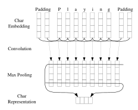
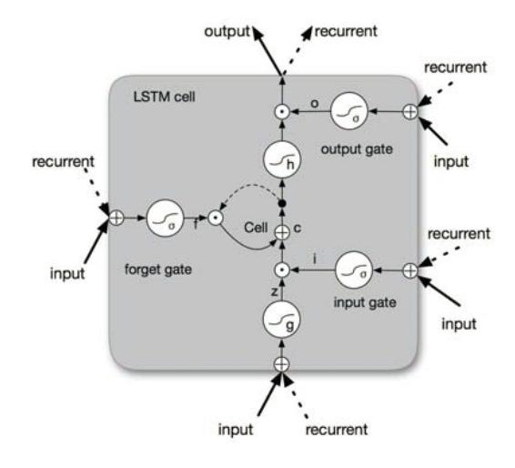
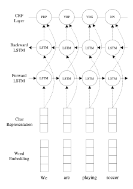

# End-to-end Sequence Labeling via Bi-directional LSTM-CNNs-CRF

## Xuezhe Ma and Eduard Hovy

Language Technologies Institute Carnegie Mellon University Pittsburgh, PA 15213, USA

xuezhem@cs.cmu.edu, hovy@cmu.edu

## Abstract

State-of-the-art sequence labeling systems traditionally require large amounts of taskspecific knowledge in the form of handcrafted features and data pre-processing. In this paper, we introduce a novel neutral network architecture that benefits from both word- and character-level representations automatically, by using combination of bidirectional LSTM, CNN and CRF. Our system is truly end-to-end, requiring no feature engineering or data preprocessing, thus making it applicable to a wide range of sequence labeling tasks. We evaluate our system on two data sets for two sequence labeling tasks — Penn Treebank WSJ corpus for part-of-speech (POS) tagging and CoNLL 2003 corpus for named entity recognition (NER). We obtain state-of-the-art performance on both datasets — 97.55% accuracy for POS tagging and 91.21% F1 for NER.

### 1 Introduction

Linguistic sequence labeling, such as part-ofspeech (POS) tagging and named entity recognition (NER), is one of the first stages in deep language understanding and its importance has been well recognized in the natural language processing community. Natural language processing (NLP) systems, like syntactic parsing (Nivre and Scholz, 2004; McDonald et al., 2005; Koo and Collins, 2010; Ma and Zhao, 2012a; Ma and Zhao, 2012b; Chen and Manning, 2014; Ma and Hovy, 2015) and entity coreference resolution (Ng, 2010; Ma et al., 2016), are becoming more sophisticated, in part because of utilizing output information of POS tagging or NER systems.

Most traditional high performance sequence labeling models are linear statistical models, including Hidden Markov Models (HMM) and Conditional Random Fields (CRF) (Ratinov and Roth, 2009; Passos et al., 2014; Luo et al., 2015), which rely heavily on hand-crafted features and taskspecific resources. For example, English POS taggers benefit from carefully designed word spelling features; orthographic features and external resources such as gazetteers are widely used in NER. However, such task-specific knowledge is costly to develop (Ma and Xia, 2014), making sequence labeling models difficult to adapt to new tasks or new domains.

In the past few years, non-linear neural networks with as input distributed word representations, also known as word embeddings, have been broadly applied to NLP problems with great success. Collobert et al. (2011) proposed a simple but effective feed-forward neutral network that independently classifies labels for each word by using contexts within a window with fixed size. Recently, recurrent neural networks (RNN) (Goller and Kuchler, 1996), together with its variants such as long-short term memory (LSTM) (Hochreiter and Schmidhuber, 1997; Gers et al., 2000) and gated recurrent unit (GRU) (Cho et al., 2014), have shown great success in modeling sequential data. Several RNN-based neural network models have been proposed to solve sequence labeling tasks like speech recognition (Graves et al., 2013), POS tagging (Huang et al., 2015) and NER (Chiu and Nichols, 2015; Hu et al., 2016), achieving competitive performance against traditional models. However, even systems that have utilized distributed representations as inputs have used these to augment, rather than replace, hand-crafted features (e.g. word spelling and capitalization patterns). Their performance drops rapidly when the models solely depend on neural embeddings.

In this paper, we propose a neural network architecture for sequence labeling. It is a truly endto-end model requiring no task-specific resources, feature engineering, or data pre-processing beyond pre-trained word embeddings on unlabeled corpora. Thus, our model can be easily applied to a wide range of sequence labeling tasks on different languages and domains. We first use convolutional neural networks (CNNs) (LeCun et al., 1989) to encode character-level information of a word into its character-level representation. Then we combine character- and word-level representations and feed them into bi-directional LSTM (BLSTM) to model context information of each word. On top of BLSTM, we use a sequential CRF to jointly decode labels for the whole sentence. We evaluate our model on two linguistic sequence labeling tasks — POS tagging on Penn Treebank WSJ (Marcus et al., 1993), and NER on English data from the CoNLL 2003 shared task (Tjong Kim Sang and De Meulder, 2003). Our end-to-end model outperforms previous stateof-the-art systems, obtaining 97.55% accuracy for POS tagging and 91.21% F1 for NER. The contributions of this work are (i) proposing a novel neural network architecture for linguistic sequence labeling. (ii) giving empirical evaluations of this model on benchmark data sets for two classic NLP tasks. (iii) achieving state-of-the-art performance with this truly end-to-end system.

### 2 Neural Network Architecture

In this section, we describe the components (layers) of our neural network architecture. We introduce the neural layers in our neural network oneby-one from bottom to top.

### 2.1 CNN for Character-level Representation

Previous studies (Santos and Zadrozny, 2014; Chiu and Nichols, 2015) have shown that CNN is an effective approach to extract morphological information (like the prefix or suffix of a word) from characters of words and encode it into neural representations. Figure 1 shows the CNN we use to extract character-level representation of a given word. The CNN is similar to the one in Chiu and Nichols (2015), except that we use only character embeddings as the inputs to CNN, without character type features. A dropout layer (Srivastava et al., 2014) is applied before character embeddings are input to CNN.

Figure 1: The convolution neural network for extracting character-level representations of words. Dashed arrows indicate a dropout layer applied before character embeddings are input to CNN.

### 2.2 Bi-directional LSTM

### 2.2.1 LSTM Unit

Recurrent neural networks (RNNs) are a powerful family of connectionist models that capture time dynamics via cycles in the graph. Though, in theory, RNNs are capable to capturing long-distance dependencies, in practice, they fail due to the gradient vanishing/exploding problems (Bengio et al., 1994; Pascanu et al., 2012).

LSTMs (Hochreiter and Schmidhuber, 1997) are variants of RNNs designed to cope with these gradient vanishing problems. Basically, a LSTM unit is composed of three multiplicative gates which control the proportions of information to forget and to pass on to the next time step. Figure 2 gives the basic structure of an LSTM unit.

Figure 2: Schematic of LSTM unit.

Formally, the formulas to update an LSTM unit at time t are:

$$\begin{aligned} &\mathbf{i}_t &= \sigma(\boldsymbol{W}_i \mathbf{h}_{t-1} + \boldsymbol{U}_i \mathbf{x}_t + \boldsymbol{b}_i) \\ &\mathbf{f}_t &= \sigma(\boldsymbol{W}_f \mathbf{h}_{t-1} + \boldsymbol{U}_f \mathbf{x}_t + \boldsymbol{b}_f) \\ &\mathbf{\tilde{c}}_t &= \tanh(\boldsymbol{W}_c \mathbf{h}_{t-1} + \boldsymbol{U}_c \mathbf{x}_t + \boldsymbol{b}_c) \\ &\mathbf{c}_t &= \mathbf{f}_t \odot \mathbf{c}_{t-1} + \mathbf{i}_t \odot \mathbf{\tilde{c}}_t \\ &\mathbf{o}_t &= \sigma(\boldsymbol{W}_o \mathbf{h}_{t-1} + \boldsymbol{U}_o \mathbf{x}_t + \boldsymbol{b}_o) \\ &\mathbf{h}_t &= \mathbf{o}_t \odot \tanh(\mathbf{c}_t) \end{aligned}$$

where  $\sigma$  is the element-wise sigmoid function and  $\odot$  is the element-wise product.  $\mathbf{x}_t$  is the input vector (e.g. word embedding) at time t, and  $\mathbf{h}_t$  is the hidden state (also called output) vector storing all the useful information at (and before) time t.  $U_i, U_f, U_c, U_o$  denote the weight matrices of different gates for input  $\mathbf{x}_t$ , and  $W_i, W_f, W_c, W_o$  are the weight matrices for hidden state  $\mathbf{h}_t$ .  $\mathbf{b}_i, \mathbf{b}_f, \mathbf{b}_c, \mathbf{b}_o$  denote the bias vectors. It should be noted that we do not include peephole connections (Gers et al., 2003) in the our LSTM formulation.

#### 2.2.2 **BLSTM**

For many sequence labeling tasks it is beneficial to have access to both past (left) and future (right) contexts. However, the LSTM's hidden state  $\mathbf{h}_t$  takes information only from past, knowing nothing about the future. An elegant solution whose effectiveness has been proven by previous work (Dyer et al., 2015) is bi-directional LSTM (BLSTM). The basic idea is to present each sequence forwards and backwards to two separate hidden states to capture past and future information, respectively. Then the two hidden states are concatenated to form the final output.

#### 2.3 CRF

For sequence labeling (or general structured prediction) tasks, it is beneficial to consider the correlations between labels in neighborhoods and jointly decode the best chain of labels for a given input sentence. For example, in POS tagging an adjective is more likely to be followed by a noun than a verb, and in NER with standard BIO2 annotation (Tjong Kim Sang and Veenstra, 1999) I-ORG cannot follow I-PER. Therefore, we model label sequence jointly using a conditional random field (CRF) (Lafferty et al., 2001), instead of decoding each label independently.

Formally, we use  $\mathbf{z} = \{\mathbf{z}_1, \dots, \mathbf{z}_n\}$  to represent a generic input sequence where  $\mathbf{z}_i$  is the input

vector of the *i*th word.  $\mathbf{y} = \{y_1, \dots, y_n\}$  represents a generic sequence of labels for  $\mathbf{z}$ .  $\mathcal{Y}(\mathbf{z})$  denotes the set of possible label sequences for  $\mathbf{z}$ . The probabilistic model for sequence CRF defines a family of conditional probability  $p(\mathbf{y}|\mathbf{z}; \mathbf{W}, \mathbf{b})$  over all possible label sequences  $\mathbf{y}$  given  $\mathbf{z}$  with the following form:

$$p(\mathbf{y}|\mathbf{z}; \mathbf{W}, \mathbf{b}) = \frac{\prod_{i=1}^{n} \psi_i(y_{i-1}, y_i, \mathbf{z})}{\sum_{y' \in \mathcal{Y}(\mathbf{z})} \prod_{i=1}^{n} \psi_i(y'_{i-1}, y'_i, \mathbf{z})}$$

where  $\psi_i(y', y, \mathbf{z}) = \exp(\mathbf{W}_{y',y}^T \mathbf{z}_i + \mathbf{b}_{y',y})$  are potential functions, and  $\mathbf{W}_{y',y}^T$  and  $\mathbf{b}_{y',y}$  are the weight vector and bias corresponding to label pair (y', y), respectively.

For CRF training, we use the maximum conditional likelihood estimation. For a training set  $\{(\mathbf{z}_i, \boldsymbol{y}_i)\}$ , the logarithm of the likelihood (a.k.a. the log-likelihood) is given by:

$$L(\mathbf{W}, \mathbf{b}) = \sum_{i} \log p(\mathbf{y}|\mathbf{z}; \mathbf{W}, \mathbf{b})$$

Maximum likelihood training chooses parameters such that the log-likelihood  $L(\mathbf{W}, \mathbf{b})$  is maximized.

Decoding is to search for the label sequence  $y^*$  with the highest conditional probability:

$$\boldsymbol{y}^* = \operatorname*{argmax}_{y \in \mathcal{Y}(\mathbf{z})} p(\boldsymbol{y}|\mathbf{z}; \mathbf{W}, \mathbf{b})$$

For a sequence CRF model (only interactions between two successive labels are considered), training and decoding can be solved efficiently by adopting the Viterbi algorithm.

#### 2.4 BLSTM-CNNs-CRF

Finally, we construct our neural network model by feeding the output vectors of BLSTM into a CRF layer. Figure 3 illustrates the architecture of our network in detail.

For each word, the character-level representation is computed by the CNN in Figure 1 with character embeddings as inputs. Then the character-level representation vector is concatenated with the word embedding vector to feed into the BLSTM network. Finally, the output vectors of BLSTM are fed to the CRF layer to jointly decode the best label sequence. As shown in Figure 3, dropout layers are applied on both the input and output vectors of BLSTM. Experimental results show that using dropout significantly

Figure 3: The main architecture of our neural network. The character representation for each word is computed by the CNN in Figure 1. Then the character representation vector is concatenated with the word embedding before feeding into the BLSTM network. Dashed arrows indicate dropout layers applied on both the input and output vectors of BLSTM.

improve the performance of our model (see Section 4.5 for details).

### 3 Network Training

In this section, we provide details about training the neural network. We implement the neural network using the Theano library (Bergstra et al., 2010). The computations for a single model are run on a GeForce GTX TITAN X GPU. Using the settings discussed in this section, the model training requires about 12 hours for POS tagging and 8 hours for NER.

#### 3.1 Parameter Initialization

**Word Embeddings.** We use Stanford's publicly available GloVe 100-dimensional embeddings1 trained on 6 billion words from Wikipedia and web text (Pennington et al., 2014)

We also run experiments on two other sets of published embeddings, namely Senna 50-dimensional embeddings² trained on Wikipedia and Reuters RCV-1 corpus (Collobert et al., 2011), and Google's Word2Vec 300-dimensional embeddings³ trained on 100 billion words from Google News (Mikolov et al., 2013). To test the effectiveness of pretrained word embeddings, we experimented with randomly initialized embeddings with 100 dimensions, where embeddings are uniformly sampled from range  $\left[-\sqrt{\frac{3}{dim}}, +\sqrt{\frac{3}{dim}}\right]$  where dim is the dimension of embeddings (He et al., 2015). The performance of different word embeddings is discussed in Section 4.4.

Character Embeddings. Character embeddings are initialized with uniform samples from  $[-\sqrt{\frac{3}{dim}}, +\sqrt{\frac{3}{dim}}]$ , where we set dim = 30.

Weight Matrices and Bias Vectors. Matrix parameters are randomly initialized with uniform samples from  $[-\sqrt{\frac{6}{r+c}}, +\sqrt{\frac{6}{r+c}}]$ , where r and c are the number of of rows and columns in the structure (Glorot and Bengio, 2010). Bias vectors are initialized to zero, except the bias  $\mathbf{b}_f$  for the forget gate in LSTM, which is initialized to 1.0 (Jozefowicz et al., 2015).

#### 3.2 Optimization Algorithm

Parameter optimization is performed with minibatch stochastic gradient descent (SGD) with batch size 10 and momentum 0.9. We choose an initial learning rate of  $\eta_0$  ( $\eta_0 = 0.01$  for POS tagging, and 0.015 for NER, see Section 3.3.), and the learning rate is updated on each epoch of training as  $\eta_t = \eta_0/(1+\rho t)$ , with decay rate  $\rho = 0.05$  and t is the number of epoch completed. To reduce the effects of "gradient exploding", we use a gradient clipping of 5.0 (Pascanu et al., 2012). We explored other more sophisticated optimization algorithms such as AdaDelta (Zeiler, 2012), Adam (Kingma and Ba, 2014) or RMSProp (Dauphin et al., 2015), but none of them meaningfully improve upon SGD with momentum and gradient clipping in our preliminary experiments.

**Early Stopping.** We use early stopping (Giles, 2001; Graves et al., 2013) based on performance on validation sets. The "best" parameters appear at around 50 epochs, according to our experiments.

word2vec/

http://nlp.stanford.edu/projects/
glove/

2http://ronan.collobert.com/senna/
3https://code.google.com/archive/p/

| Layer   | Hyper-parameter       | POS  | NER   |
|---------|-----------------------|------|-------|
|         | window size           | 3    | 3     |
| CNN     | number of filters     | 30   | 30    |
|         | state size            | 200  | 200   |
| LSTM    | initial state         | 0.0  | 0.0   |
|         | peepholes             | no   | no    |
| Dropout | dropout rate          | 0.5  | 0.5   |
|         | batch size            | 10   | 10    |
|         | initial learning rate | 0.01 | 0.015 |
|         | decay rate            | 0.05 | 0.05  |
|         | gradient clipping     | 5.0  | 5.0   |

Table 1: Hyper-parameters for all experiments.

Fine Tuning. For each of the embeddings, we fine-tune initial embeddings, modifying them during gradient updates of the neural network model by back-propagating gradients. The effectiveness of this method has been previously explored in sequential and structured prediction problems (Collobert et al., 2011; Peng and Dredze, 2015).

Dropout Training. To mitigate overfitting, we apply the dropout method (Srivastava et al., 2014) to regularize our model. As shown in Figure 1 and 3, we apply dropout on character embeddings before inputting to CNN, and on both the input and output vectors of BLSTM. We fix dropout rate at 0.5 for all dropout layers through all the experiments. We obtain significant improvements on model performance after using dropout (see Section 4.5).

### 3.3 Tuning Hyper-Parameters

Table 1 summarizes the chosen hyper-parameters for all experiments. We tune the hyper-parameters on the development sets by random search. Due to time constrains it is infeasible to do a random search across the full hyper-parameter space. Thus, for the tasks of POS tagging and NER we try to share as many hyper-parameters as possible. Note that the final hyper-parameters for these two tasks are almost the same, except the initial learning rate. We set the state size of LSTM to 200. Tuning this parameter did not significantly impact the performance of our model. For CNN, we use 30 filters with window length 3.

### 4 Experiments

### 4.1 Data Sets

As mentioned before, we evaluate our neural network model on two sequence labeling tasks: POS tagging and NER.

| Dataset |       | WSJ     | CoNLL2003 |
|---------|-------|---------|-----------|
|         | SENT  | 38,219  | 14,987    |
| Train   | TOKEN | 912,344 | 204,567   |
|         | SENT  | 5,527   | 3,466     |
| Dev     | TOKEN | 131,768 | 51,578    |
|         | SENT  | 5,462   | 3,684     |
| Test    | TOKEN | 129,654 | 46,666    |

Table 2: Corpora statistics. SENT and TOKEN refer to the number of sentences and tokens in each data set.

POS Tagging. For English POS tagging, we use the Wall Street Journal (WSJ) portion of Penn Treebank (PTB) (Marcus et al., 1993), which contains 45 different POS tags. In order to compare with previous work, we adopt the standard splits — section 0–18 as training data, section 19– 21 as development data and section 22–24 as test data (Manning, 2011; Søgaard, 2011).

NER. For NER, We perform experiments on the English data from CoNLL 2003 shared task (Tjong Kim Sang and De Meulder, 2003). This data set contains four different types of named entities: *PERSON, LOCATION, ORGA-NIZATION*, and *MISC*. We use the BIOES tagging scheme instead of standard BIO2, as previous studies have reported meaningful improvement with this scheme (Ratinov and Roth, 2009; Dai et al., 2015; Lample et al., 2016).

The corpora statistics are shown in Table 2. We did not perform any pre-processing for data sets, leaving our system truly end-to-end.

### 4.2 Main Results

We first run experiments to dissect the effectiveness of each component (layer) of our neural network architecture by ablation studies. We compare the performance with three baseline systems — BRNN, the bi-direction RNN; BLSTM, the bidirection LSTM, and BLSTM-CNNs, the combination of BLSTM with CNN to model characterlevel information. All these models are run using Stanford's GloVe 100 dimensional word embeddings and the same hyper-parameters as shown in Table 1. According to the results shown in Table 3, BLSTM obtains better performance than BRNN on all evaluation metrics of both the two tasks. BLSTM-CNN models significantly outperform the BLSTM model, showing that characterlevel representations are important for linguistic sequence labeling tasks. This is consistent with

|              |       | POS   | NER   |        |       |       |        |       |
|--------------|-------|-------|-------|--------|-------|-------|--------|-------|
|              | Dev   | Test  |       | Dev    |       |       | Test   |       |
| Model        | Acc.  | Acc.  | Prec. | Recall | F1    | Prec. | Recall | F1    |
| BRNN         | 96.56 | 96.76 | 92.04 | 89.13  | 90.56 | 87.05 | 83.88  | 85.44 |
| BLSTM        | 96.88 | 96.93 | 92.31 | 90.85  | 91.57 | 87.77 | 86.23  | 87.00 |
| BLSTM-CNN    | 97.34 | 97.33 | 92.52 | 93.64  | 93.07 | 88.53 | 90.21  | 89.36 |
| BRNN-CNN-CRF | 97.46 | 97.55 | 94.85 | 94.63  | 94.74 | 91.35 | 91.06  | 91.21 |

Table 3: Performance of our model on both the development and test sets of the two tasks, together with three baseline systems.

| Model                                    | Acc.  |
|------------------------------------------|-------|
| Gimenez and M ´ arquez (2004) ` | 97.16 |
| Toutanova et al. (2003)                  | 97.27 |
| Manning (2011)                           | 97.28 |
| Collobert et al. (2011)‡                 | 97.29 |
| Santos and Zadrozny (2014)‡              | 97.32 |
| Shen et al. (2007)                       | 97.33 |
| Sun (2014)                               | 97.36 |
| Søgaard (2011)                           | 97.50 |
| This paper                               | 97.55 |

Table 4: POS tagging accuracy of our model on test data from WSJ proportion of PTB, together with top-performance systems. The neural network based models are marked with ‡.

results reported by previous work (Santos and Zadrozny, 2014; Chiu and Nichols, 2015). Finally, by adding CRF layer for joint decoding we achieve significant improvements over BLSTM-CNN models for both POS tagging and NER on all metrics. This demonstrates that jointly decoding label sequences can significantly benefit the final performance of neural network models.

### 4.3 Comparison with Previous Work

### 4.3.1 POS Tagging

Table 4 illustrates the results of our model for POS tagging, together with seven previous topperformance systems for comparison. Our model significantly outperform Senna (Collobert et al., 2011), which is a feed-forward neural network model using capitalization and discrete suffix features, and data pre-processing. Moreover, our model achieves 0.23% improvements on accuracy over the "CharWNN" (Santos and Zadrozny, 2014), which is a neural network model based on Senna and also uses CNNs to model characterlevel representations. This demonstrates the effectiveness of BLSTM for modeling sequential data

| Model                    | F1    |
|--------------------------|-------|
| Chieu and Ng (2002)      | 88.31 |
| Florian et al. (2003)    | 88.76 |
| Ando and Zhang (2005)    | 89.31 |
| Collobert et al. (2011)‡ | 89.59 |
| Huang et al. (2015)‡     | 90.10 |
| Chiu and Nichols (2015)‡ | 90.77 |
| Ratinov and Roth (2009)  | 90.80 |
| Lin and Wu (2009)        | 90.90 |
| Passos et al. (2014)     | 90.90 |
| Lample et al. (2016)‡    | 90.94 |
| Luo et al. (2015)        | 91.20 |
| This paper               | 91.21 |

Table 5: NER F1 score of our model on test data set from CoNLL-2003. For the purpose of comparison, we also list F1 scores of previous topperformance systems. ‡ marks the neural models.

and the importance of joint decoding with structured prediction model.

Comparing with traditional statistical models, our system achieves state-of-the-art accuracy, obtaining 0.05% improvement over the previously best reported results by Søgaard (2011). It should be noted that Huang et al. (2015) also evaluated their BLSTM-CRF model for POS tagging on WSJ corpus. But they used a different splitting of the training/dev/test data sets. Thus, their results are not directly comparable with ours.

### 4.3.2 NER

Table 5 shows the F1 scores of previous models for NER on the test data set from CoNLL-2003 shared task. For the purpose of comparison, we list their results together with ours. Similar to the observations of POS tagging, our model achieves significant improvements over Senna and the other three neural models, namely the LSTM-CRF proposed by Huang et al. (2015), LSTM-CNNs pro-

| Embedding | Dimension | POS   | NER   |
|-----------|-----------|-------|-------|
| Random    | 100       | 97.13 | 80.76 |
| Senna     | 50        | 97.44 | 90.28 |
| Word2Vec  | 300       | 97.40 | 84.91 |
| GloVe     | 100       | 97.55 | 91.21 |

Table 6: Results with different choices of word embeddings on the two tasks (accuracy for POS tagging and F1 for NER).

posed by Chiu and Nichols (2015), and the LSTM-CRF by Lample et al. (2016). Huang et al. (2015) utilized discrete spelling, POS and context features, Chiu and Nichols (2015) used charactertype, capitalization, and lexicon features, and all the three model used some task-specific data preprocessing, while our model does not require any carefully designed features or data pre-processing. We have to point out that the result (90.77%) reported by Chiu and Nichols (2015) is incomparable with ours, because their final model was trained on the combination of the training and development data sets4 .

To our knowledge, the previous best F1 score (91.20)5 reported on CoNLL 2003 data set is by the joint NER and entity linking model (Luo et al., 2015). This model used many hand-crafted features including stemming and spelling features, POS and chunks tags, WordNet clusters, Brown Clusters, as well as external knowledge bases such as Freebase and Wikipedia. Our end-to-end model slightly improves this model by 0.01%, yielding a state-of-the-art performance.

### 4.4 Word Embeddings

As mentioned in Section 3.1, in order to test the importance of pretrained word embeddings, we performed experiments with different sets of publicly published word embeddings, as well as a random sampling method, to initialize our model. Table 6 gives the performance of three different word embeddings, as well as the randomly sampled one. According to the results in Table 6, models using pretrained word embeddings obtain a significant improvement as opposed to the ones using random embeddings. Comparing the two tasks, NER relies

|     |       | POS   |       |       | NER   |       |
|-----|-------|-------|-------|-------|-------|-------|
|     | Train | Dev   | Test  | Train | Dev   | Test  |
| No  | 98.46 | 97.06 | 97.11 | 99.97 | 93.51 | 89.25 |
| Yes | 97.86 | 97.46 | 97.55 | 99.63 | 94.74 | 91.21 |

Table 7: Results with and without dropout on two tasks (accuracy for POS tagging and F1 for NER).

|      | POS     |         | NER   |       |  |
|------|---------|---------|-------|-------|--|
|      | Dev     | Test    | Dev   | Test  |  |
| IV   | 127,247 | 125,826 | 4,616 | 3,773 |  |
| OOTV | 2,960   | 2,412   | 1,087 | 1,597 |  |
| OOEV | 659     | 588     | 44    | 8     |  |
| OOBV | 902     | 828     | 195   | 270   |  |

Table 8: Statistics of the partition on each corpus. It lists the number of tokens of each subset for POS tagging and the number of entities for NER.

more heavily on pretrained embeddings than POS tagging. This is consistent with results reported by previous work (Collobert et al., 2011; Huang et al., 2015; Chiu and Nichols, 2015).

For different pretrained embeddings, Stanford's GloVe 100 dimensional embeddings achieve best results on both tasks, about 0.1% better on POS accuracy and 0.9% better on NER F1 score than the Senna 50 dimensional one. This is different from the results reported by Chiu and Nichols (2015), where Senna achieved slightly better performance on NER than other embeddings. Google's Word2Vec 300 dimensional embeddings obtain similar performance with Senna on POS tagging, still slightly behind GloVe. But for NER, the performance on Word2Vec is far behind GloVe and Senna. One possible reason that Word2Vec is not as good as the other two embeddings on NER is because of vocabulary mismatch — Word2Vec embeddings were trained in casesensitive manner, excluding many common symbols such as punctuations and digits. Since we do not use any data pre-processing to deal with such common symbols or rare words, it might be an issue for using Word2Vec.

### 4.5 Effect of Dropout

Table 7 compares the results with and without dropout layers for each data set. All other hyperparameters remain the same as in Table 1. We observe a essential improvement for both the two tasks. It demonstrates the effectiveness of dropout in reducing overfitting.

4We run experiments using the same setting and get 91.37% F1 score.

5Numbers are taken from the Table 3 of the original paper (Luo et al., 2015). While there is clearly inconsistency among the precision (91.5%), recall (91.4%) and F1 scores (91.2%), it is unclear in which way they are incorrect.

|              |       | POS                  |       |       |       |       |                                                 |       |
|--------------|-------|----------------------|-------|-------|-------|-------|-------------------------------------------------|-------|
|              |       | Dev                  |       |       |       |       |                                                 |       |
|              | IV    | OOTV OOEV OOBV |       |       | IV    | OOTV  | OOEV                                            | OOBV  |
| LSTM-CNN     | 97.57 | 93.75                | 90.29 | 80.27 | 97.55 | 93.45 | 90.14                                           | 80.07 |
| LSTM-CNN-CRF | 97.68 | 93.65                | 91.05 | 82.71 | 97.77 | 93.16 | 90.65                                           | 82.49 |
|              |       | NER                  |       |       |       |       |                                                 |       |
|              |       | Dev                  |       |       |       |       | Test Test OOEV OOBV 100.00 78.44 |       |
|              | IV    | OOTV                 | OOEV  | OOBV  | IV    | OOTV  |                                                 |       |
| LSTM-CNN     | 94.83 | 87.28                | 96.55 | 82.90 | 90.07 | 89.45 |                                                 |       |
| LSTM-CNN-CRF | 96.49 | 88.63                | 97.67 | 86.91 | 92.14 | 90.73 | 100.00                                          | 80.60 |

Table 9: Comparison of performance on different subsets of words (accuracy for POS and F1 for NER).

### 4.6 OOV Error Analysis

To better understand the behavior of our model, we perform error analysis on Out-of-Vocabulary words (OOV). Specifically, we partition each data set into four subsets — in-vocabulary words (IV), out-of-training-vocabulary words (OOTV), out-of-embedding-vocabulary words (OOEV) and out-of-both-vocabulary words (OOBV). A word is considered IV if it appears in both the training and embedding vocabulary, while OOBV if neither. OOTV words are the ones do not appear in training set but in embedding vocabulary, while OOEV are the ones do not appear in embedding vocabulary but in training set. For NER, an entity is considered as OOBV if there exists at lease one word not in training set and at least one word not in embedding vocabulary, and the other three subsets can be done in similar manner. Table 8 informs the statistics of the partition on each corpus. The embedding we used is Stanford's GloVe with dimension 100, the same as Section 4.2.

Table 9 illustrates the performance of our model on different subsets of words, together with the baseline LSTM-CNN model for comparison. The largest improvements appear on the OOBV subsets of both the two corpora. This demonstrates that by adding CRF for joint decoding, our model is more powerful on words that are out of both the training and embedding sets.

## 5 Related Work

In recent years, several different neural network architectures have been proposed and successfully applied to linguistic sequence labeling such as POS tagging, chunking and NER. Among these neural architectures, the three approaches most similar to our model are the BLSTM-CRF model proposed by Huang et al. (2015), the LSTM- CNNs model by Chiu and Nichols (2015) and the BLSTM-CRF by Lample et al. (2016).

Huang et al. (2015) used BLSTM for word-level representations and CRF for jointly label decoding, which is similar to our model. But there are two main differences between their model and ours. First, they did not employ CNNs to model character-level information. Second, they combined their neural network model with handcrafted features to improve their performance, making their model not an end-to-end system. Chiu and Nichols (2015) proposed a hybrid of BLSTM and CNNs to model both character- and word-level representations, which is similar to the first two layers in our model. They evaluated their model on NER and achieved competitive performance. Our model mainly differ from this model by using CRF for joint decoding. Moreover, their model is not truly end-to-end, either, as it utilizes external knowledge such as character-type, capitalization and lexicon features, and some data preprocessing specifically for NER (e.g. replacing all sequences of digits 0-9 with a single "0"). Recently, Lample et al. (2016) proposed a BLSTM-CRF model for NER, which utilized BLSTM to model both the character- and word-level information, and use data pre-processing the same as Chiu and Nichols (2015). Instead, we use CNN to model character-level information, achieving better NER performance without using any data preprocessing.

There are several other neural networks previously proposed for sequence labeling. Labeau et al. (2015) proposed a RNN-CNNs model for German POS tagging. This model is similar to the LSTM-CNNs model in Chiu and Nichols (2015), with the difference of using vanila RNN instead of LSTM. Another neural architecture employing CNN to model character-level information is the "CharWNN" architecture (Santos and Zadrozny, 2014) which is inspired by the feed-forward network (Collobert et al., 2011). CharWNN obtained near state-of-the-art accuracy on English POS tagging (see Section 4.3 for details). A similar model has also been applied to Spanish and Portuguese NER (dos Santos et al., 2015) Ling et al. (2015) and Yang et al. (2016) also used BSLTM to compose character embeddings to word's representation, which is similar to Lample et al. (2016). Peng and Dredze (2016) Improved NER for Chinese Social Media with Word Segmentation.

## 6 Conclusion

In this paper, we proposed a neural network architecture for sequence labeling. It is a truly end-toend model relying on no task-specific resources, feature engineering or data pre-processing. We achieved state-of-the-art performance on two linguistic sequence labeling tasks, comparing with previously state-of-the-art systems.

There are several potential directions for future work. First, our model can be further improved by exploring multi-task learning approaches to combine more useful and correlated information. For example, we can jointly train a neural network model with both the POS and NER tags to improve the intermediate representations learned in our network. Another interesting direction is to apply our model to data from other domains such as social media (Twitter and Weibo). Since our model does not require any domain- or taskspecific knowledge, it might be effortless to apply it to these domains.

### Acknowledgements

This research was supported in part by DARPA grant FA8750-12-2-0342 funded under the DEFT program. Any opinions, findings, and conclusions or recommendations expressed in this material are those of the authors and do not necessarily reflect the views of DARPA.

## References

- Rie Kubota Ando and Tong Zhang. 2005. A framework for learning predictive structures from multiple tasks and unlabeled data. *The Journal of Machine Learning Research*, 6:1817–1853.
- Yoshua Bengio, Patrice Simard, and Paolo Frasconi. 1994. Learning long-term dependencies with gra-

- dient descent is difficult. *Neural Networks, IEEE Transactions on*, 5(2):157–166.
- James Bergstra, Olivier Breuleux, Fred´ eric Bastien, ´ Pascal Lamblin, Razvan Pascanu, Guillaume Desjardins, Joseph Turian, David Warde-Farley, and Yoshua Bengio. 2010. Theano: a cpu and gpu math expression compiler. In *Proceedings of the Python for scientific computing conference (SciPy)*, volume 4, page 3. Austin, TX.
- Danqi Chen and Christopher Manning. 2014. A fast and accurate dependency parser using neural networks. In *Proceedings of EMNLP-2014*, pages 740– 750, Doha, Qatar, October.
- Hai Leong Chieu and Hwee Tou Ng. 2002. Named entity recognition: a maximum entropy approach using global information. In *Proceedings of CoNLL-2003*, pages 1–7.
- Jason PC Chiu and Eric Nichols. 2015. Named entity recognition with bidirectional lstm-cnns. *arXiv preprint arXiv:1511.08308*.
- Kyunghyun Cho, Bart van Merrienboer, Dzmitry Bah- ¨ danau, and Yoshua Bengio. 2014. On the properties of neural machine translation: Encoder–decoder approaches. *Syntax, Semantics and Structure in Statistical Translation*, page 103.
- Ronan Collobert, Jason Weston, Leon Bottou, Michael ´ Karlen, Koray Kavukcuoglu, and Pavel Kuksa. 2011. Natural language processing (almost) from scratch. *The Journal of Machine Learning Research*, 12:2493–2537.
- Hong-Jie Dai, Po-Ting Lai, Yung-Chun Chang, and Richard Tzong-Han Tsai. 2015. Enhancing of chemical compound and drug name recognition using representative tag scheme and fine-grained tokenization. *Journal of cheminformatics*, 7(S1):1–10.
- Yann N Dauphin, Harm de Vries, Junyoung Chung, and Yoshua Bengio. 2015. Rmsprop and equilibrated adaptive learning rates for non-convex optimization. *arXiv preprint arXiv:1502.04390*.
- Cıcero dos Santos, Victor Guimaraes, RJ Niteroi, and ´ Rio de Janeiro. 2015. Boosting named entity recognition with neural character embeddings. In *Proceedings of NEWS 2015 The Fifth Named Entities Workshop*, page 25.
- Chris Dyer, Miguel Ballesteros, Wang Ling, Austin Matthews, and Noah A. Smith. 2015. Transitionbased dependency parsing with stack long shortterm memory. In *Proceedings of ACL-2015 (Volume 1: Long Papers)*, pages 334–343, Beijing, China, July.
- Radu Florian, Abe Ittycheriah, Hongyan Jing, and Tong Zhang. 2003. Named entity recognition through classifier combination. In *Proceedings of HLT-NAACL-2003*, pages 168–171.

- Felix A Gers, Jurgen Schmidhuber, and Fred Cummins. ¨ 2000. Learning to forget: Continual prediction with lstm. *Neural computation*, 12(10):2451–2471.
- Felix A Gers, Nicol N Schraudolph, and Jurgen ¨ Schmidhuber. 2003. Learning precise timing with lstm recurrent networks. *The Journal of Machine Learning Research*, 3:115–143.
- Rich Caruana Steve Lawrence Lee Giles. 2001. Overfitting in neural nets: Backpropagation, conjugate gradient, and early stopping. In *Advances in Neural Information Processing Systems 13: Proceedings of the 2000 Conference*, volume 13, page 402. MIT Press.
- Jesus Gim ´ enez and Llu ´ ´ıs Marquez. 2004. Svmtool: A ` general pos tagger generator based on support vector machines. In *In Proceedings of LREC-2004*.
- Xavier Glorot and Yoshua Bengio. 2010. Understanding the difficulty of training deep feedforward neural networks. In *International conference on artificial intelligence and statistics*, pages 249–256.
- Christoph Goller and Andreas Kuchler. 1996. Learning task-dependent distributed representations by backpropagation through structure. In *Neural Networks, 1996., IEEE International Conference on*, volume 1, pages 347–352. IEEE.
- Alan Graves, Abdel-rahman Mohamed, and Geoffrey Hinton. 2013. Speech recognition with deep recurrent neural networks. In *Proceedings of ICASSP-2013*, pages 6645–6649. IEEE.
- Kaiming He, Xiangyu Zhang, Shaoqing Ren, and Jian Sun. 2015. Delving deep into rectifiers: Surpassing human-level performance on imagenet classification. In *Proceedings of the IEEE International Conference on Computer Vision*, pages 1026–1034.
- Sepp Hochreiter and Jurgen Schmidhuber. 1997. ¨ Long short-term memory. *Neural computation*, 9(8):1735–1780.
- Zhiting Hu, Xuezhe Ma, Zhengzhong Liu, Eduard H. Hovy, and Eric P. Xing. 2016. Harnessing deep neural networks with logic rules. In *Proceedings of ACL-2016*, Berlin, Germany, August.
- Zhiheng Huang, Wei Xu, and Kai Yu. 2015. Bidirectional lstm-crf models for sequence tagging. *arXiv preprint arXiv:1508.01991*.
- Rafal Jozefowicz, Wojciech Zaremba, and Ilya Sutskever. 2015. An empirical exploration of recurrent network architectures. In *Proceedings of the 32nd International Conference on Machine Learning (ICML-15)*, pages 2342–2350.
- Diederik Kingma and Jimmy Ba. 2014. Adam: A method for stochastic optimization. *arXiv preprint arXiv:1412.6980*.

- Terry Koo and Michael Collins. 2010. Efficient thirdorder dependency parsers. In *Proceedings of ACL-2010*, pages 1–11, Uppsala, Sweden, July.
- Matthieu Labeau, Kevin Loser, Alexandre Allauzen, ¨ and Rue John von Neumann. 2015. Non-lexical neural architecture for fine-grained pos tagging. In *Proceedings of the 2015 Conference on Empirical Methods in Natural Language Processing*, pages 232–237.
- John Lafferty, Andrew McCallum, and Fernando CN Pereira. 2001. Conditional random fields: Probabilistic models for segmenting and labeling sequence data. In *Proceedings of ICML-2001*, volume 951, pages 282–289.
- Guillaume Lample, Miguel Ballesteros, Sandeep Subramanian, Kazuya Kawakami, and Chris Dyer. 2016. Neural architectures for named entity recognition. In *Proceedings of NAACL-2016*, San Diego, California, USA, June.
- Yann LeCun, Bernhard Boser, John S Denker, Donnie Henderson, Richard E Howard, Wayne Hubbard, and Lawrence D Jackel. 1989. Backpropagation applied to handwritten zip code recognition. *Neural computation*, 1(4):541–551.
- Dekang Lin and Xiaoyun Wu. 2009. Phrase clustering for discriminative learning. In *Proceedings of ACL-2009*, pages 1030–1038.
- Wang Ling, Chris Dyer, Alan W Black, Isabel Trancoso, Ramon Fermandez, Silvio Amir, Luis Marujo, and Tiago Luis. 2015. Finding function in form: Compositional character models for open vocabulary word representation. In *Proceedings of EMNLP-2015*, pages 1520–1530, Lisbon, Portugal, September.
- Gang Luo, Xiaojiang Huang, Chin-Yew Lin, and Zaiqing Nie. 2015. Joint entity recognition and disambiguation. In *Proceedings of EMNLP-2015*, pages 879–888, Lisbon, Portugal, September.
- Xuezhe Ma and Eduard Hovy. 2015. Efficient innerto-outer greedy algorithm for higher-order labeled dependency parsing. In *Proceedings of the EMNLP-2015*, pages 1322–1328, Lisbon, Portugal, September.
- Xuezhe Ma and Fei Xia. 2014. Unsupervised dependency parsing with transferring distribution via parallel guidance and entropy regularization. In *Proceedings of ACL-2014*, pages 1337–1348, Baltimore, Maryland, June.
- Xuezhe Ma and Hai Zhao. 2012a. Fourth-order dependency parsing. In *Proceedings of COLING 2012: Posters*, pages 785–796, Mumbai, India, December.
- Xuezhe Ma and Hai Zhao. 2012b. Probabilistic models for high-order projective dependency parsing. *Technical Report, arXiv:1502.04174*.

- Xuezhe Ma, Zhengzhong Liu, and Eduard Hovy. 2016. Unsupervised ranking model for entity coreference resolution. In *Proceedings of NAACL-2016*, San Diego, California, USA, June.
- Christopher D Manning. 2011. Part-of-speech tagging from 97% to 100%: is it time for some linguistics? In *Computational Linguistics and Intelligent Text Processing*, pages 171–189. Springer.
- Mitchell Marcus, Beatrice Santorini, and Mary Ann Marcinkiewicz. 1993. Building a large annotated corpus of English: the Penn Treebank. *Computational Linguistics*, 19(2):313–330.
- Ryan McDonald, Koby Crammer, and Fernando Pereira. 2005. Online large-margin training of dependency parsers. In *Proceedings of ACL-2005*, pages 91–98, Ann Arbor, Michigan, USA, June 25- 30.
- Tomas Mikolov, Ilya Sutskever, Kai Chen, Greg S Corrado, and Jeff Dean. 2013. Distributed representations of words and phrases and their compositionality. In *Advances in neural information processing systems*, pages 3111–3119.
- Vincent Ng. 2010. Supervised noun phrase coreference research: The first fifteen years. In *Proceedings of ACL-2010*, pages 1396–1411, Uppsala, Sweden, July. Association for Computational Linguistics.
- Joakim Nivre and Mario Scholz. 2004. Deterministic dependency parsing of English text. In *Proceedings of COLING-2004*, pages 64–70, Geneva, Switzerland, August 23-27.
- Razvan Pascanu, Tomas Mikolov, and Yoshua Bengio. 2012. On the difficulty of training recurrent neural networks. *arXiv preprint arXiv:1211.5063*.
- Alexandre Passos, Vineet Kumar, and Andrew McCallum. 2014. Lexicon infused phrase embeddings for named entity resolution. In *Proceedings of CoNLL-2014*, pages 78–86, Ann Arbor, Michigan, June.
- Nanyun Peng and Mark Dredze. 2015. Named entity recognition for chinese social media with jointly trained embeddings. In *Proceedings of EMNLP-2015*, pages 548–554, Lisbon, Portugal, September.
- Nanyun Peng and Mark Dredze. 2016. Improving named entity recognition for chinese social media with word segmentation representation learning. In *Proceedings of ACL-2016*, Berlin, Germany, August.
- Jeffrey Pennington, Richard Socher, and Christopher Manning. 2014. Glove: Global vectors for word representation. In *Proceedings of EMNLP-2014*, pages 1532–1543, Doha, Qatar, October.
- Lev Ratinov and Dan Roth. 2009. Design challenges and misconceptions in named entity recognition. In *Proceedings of CoNLL-2009*, pages 147–155.

- Cicero D Santos and Bianca Zadrozny. 2014. Learning character-level representations for part-of-speech tagging. In *Proceedings of ICML-2014*, pages 1818–1826.
- Libin Shen, Giorgio Satta, and Aravind Joshi. 2007. Guided learning for bidirectional sequence classification. In *Proceedings of ACL-2007*, volume 7, pages 760–767.
- Anders Søgaard. 2011. Semi-supervised condensed nearest neighbor for part-of-speech tagging. In *Proceedings of the 49th Annual Meeting of the Association for Computational Linguistics: Human Language Technologies*, pages 48–52, Portland, Oregon, USA, June.
- Nitish Srivastava, Geoffrey Hinton, Alex Krizhevsky, Ilya Sutskever, and Ruslan Salakhutdinov. 2014. Dropout: A simple way to prevent neural networks from overfitting. *The Journal of Machine Learning Research*, 15(1):1929–1958.
- Xu Sun. 2014. Structure regularization for structured prediction. In *Advances in Neural Information Processing Systems*, pages 2402–2410.
- Erik F. Tjong Kim Sang and Fien De Meulder. 2003. Introduction to the conll-2003 shared task: Language-independent named entity recognition. In *Proceedings of CoNLL-2003 - Volume 4*, pages 142– 147, Stroudsburg, PA, USA.
- Erik F. Tjong Kim Sang and Jorn Veenstra. 1999. Representing text chunks. In *Proceedings of EACL'99*, pages 173–179. Bergen, Norway.
- Kristina Toutanova, Dan Klein, Christopher D Manning, and Yoram Singer. 2003. Feature-rich partof-speech tagging with a cyclic dependency network. In *Proceedings of NAACL-HLT-2003, Volume 1*, pages 173–180.
- Zhilin Yang, Ruslan Salakhutdinov, and William Cohen. 2016. Multi-task cross-lingual sequence tagging from scratch. *arXiv preprint arXiv:1603.06270*.
- Matthew D Zeiler. 2012. Adadelta: an adaptive learning rate method. *arXiv preprint arXiv:1212.5701*.