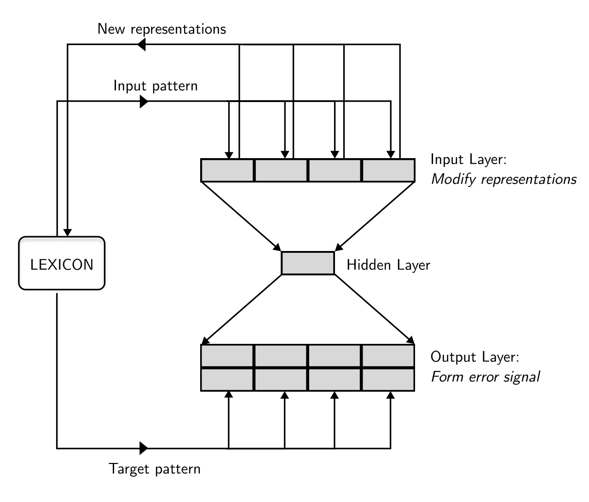

# Multi hash embeddings in spaCy

Lester James Miranda11 1 Equal contribution and corresponding authors: {lj,akos}@explosion.ai , Ákos Kádár11 1 Equal contribution and corresponding authors: {lj,akos}@explosion.ai , Adriane Boyd, Sofie Van Landeghem, Anders Søgaard, Matthew Honnibal Affiliation: ExplosionAI GmbH 

###### Abstract

The distributed representation of symbols is one of the key technologies in machine learning systems today, playing a pivotal role in modern natural language processing. Traditional _word embeddings_ associate a separate vector with each word. While this approach is simple and leads to good performance, it requires a lot of memory for representing a large vocabulary. To reduce the memory footprint, the default embedding layer in spaCy is a _hash embeddings_ layer. It is a stochastic approximation of traditional embeddings that provides unique vectors for a large number of words without explicitly storing a separate vector for each of them. To be able to compute meaningful representations for both known and unknown words, hash embeddings represent each word as a summary of the normalized word form, subword information and word shape. Together, these features produce a _multi-embedding_ of a word. In this technical report we lay out a bit of history and introduce the embedding methods in spaCy in detail. Second, we critically evaluate the hash embedding architecture with multi-embeddings on Named Entity Recognition datasets from a variety of domains and languages. The experiments validate most key design choices behind spaCy’s embedders, but we also uncover a few surprising results.

## 1 Introduction

The Python package spaCy11 1 <https://spacy.io> is a popular suite of Natural Language Processing software, designed for production use-cases. It provides a selection of well-tuned algorithms and models for common NLP tasks, along with well optimized data structures. The library also pays careful attention to stability, usability and documentation.

Early versions of spaCy assumed that users would mostly use the default models and architectures, and did not offer a fine-grained API for to customize and control training. This changed with the release of v3, which introduced a new configuration system and also came with a newly designed and documented machine learning system, Thinc.22 2 <https://thinc.ai> Together these give users full control of the modelling details.

Over the years spaCy has developed its own model architectures and default hyperparameters, informed by practical considerations that are not only motivated by scoring well on a single standard benchmark. In particular, spaCy prioritizes run-time efficiency on CPU, the ability to run efficiently on long documents, robustness to domain-shift, and the ability to fine-tune the model after training, without access to the original training data.

In this technical report, we focus on one of the more unusual features of spaCy’s default model architectures: its strategy for embedding lexical items. We explain how this layer operates, provide experiments that show its sensitivity to key hyperparameters, and compare it to a more standard embedding architecture on a few datasets. Our experiments focus on how the embedding layer functions in the context of spaCy’s default Named Entity Recognition architecture.

We these experiments aim to provide useful background information to users who wish to customize, change or extend spaCy’s default architectures in their own experiments.

## 2 Background

 Figure 1: Illustration of the FGREP architecture. Redrawn from [Miikkulainen and Dyer, 1991](https://arxiv.org/html/2212.09255#bib.bib17)

Natural language processing (NLP) systems take text as input, broken down into a list of words or subwords. Word embeddings have become a _de facto_ standard for NLP, enabling us to represent compact tokens that can generalize well. These embeddings associate words with continuous vectors and are trained such that functionally similar words have similar representations. The trained embeddings encode useful syntactic and semantic information. While an improvement over predecessors such as tf-idf, word embeddings are still memory intensive: each word in the vocabulary is typically stored as a 300-dimension vector. As one of our main concerns in spaCy is efficiency, we use the hashing trick to radically reduce the search space in a lookup table with little to no degradation in accuracy. To understand how spaCy’s embedding system came to be, let us go through a brief history of modern embeddings.

Real-valued representations of concepts have a long history. The way we think about word embeddings today originates from the FGREP architecture of [Miikkulainen and Dyer, 1991](https://arxiv.org/html/2212.09255#bib.bib17): a small neural network with a persistent public global lexicon available in its input and output is learned end-to-end as shown in Figure [1](https://arxiv.org/html/2212.09255#S2.F1 "Figure 1 ‣ 2 Background ‣ Multi hash embeddings in spaCy"). This global lexicon is a matrix where each row vector represents a single word, and the distance (or angle) between these vectors is small when words are similar and large when they are different.

[Collobert and Weston, 2008](https://arxiv.org/html/2212.09255#bib.bib7) first popularized the idea of using neural network models with pretrained word embeddings. They trained a convolutional architecture to perform multiple linguistic tasks—named entity recognition (NER), chunking, part-of-speech (POS) tagging, and semantic role labeling—with a single neural network in a multi-task setting. Crucially, they devised an efficient approach to pretrain word embeddings that leverages large volumes of unlabeled text. To pretrain the embeddings, they constructed a simpler architecture than the one used for the downstream task, and rather than maximizing the likelihood of the next word, as in [Bengio et al., 2000](https://arxiv.org/html/2212.09255#bib.bib2), they only trained the model to distinguish between real samples from Wikipedia and _contrastive_ examples, i.e., sequences of words sampled from Wikipedia where a random word replaces the middle word. Their follow-up paper, _Natural Language Processing (Almost) from Scratch_ ([Collobert et al., 2011](https://arxiv.org/html/2212.09255#bib.bib8)), shows that cheap _pretraining_ of word embeddings on large corpora closes the gap in downstream evaluation between neural networks and NLP systems that rely on feature engineering. Roughly at the same time, [Turian et al., 2010](https://arxiv.org/html/2212.09255#bib.bib24) showed that adding word embeddings—as well as more traditional Brown clusters ([Brown et al., 1992](https://arxiv.org/html/2212.09255#bib.bib6))—to linear structured models of chunking and named entity recognition is a straightforward way to boost performance.

The final key innovation that led to the widespread adoption of word embeddings in the NLP community came when the pretraining phase was made cheaper. This was accomplished by [Mikolov et al., 2013](https://arxiv.org/html/2212.09255#bib.bib18) who removed the hidden layers and non-linearities while relying entirely on linear models with contrastive losses. To improve the coverage of word embeddings the popular library fastText33 3 <https://fasttext.cc> computes word representations as the sum of word and subword vectors ([Bojanowski et al., 2017](https://arxiv.org/html/2212.09255#bib.bib4)).44 4 Since then, various pretraining objectives have been devised to train _context-sensitive_ word representations by training a transformer encoder together with subword embeddings. Some make use of masking, i.e., predicting missing words from surrounding contexts ([Devlin et al., 2019](https://arxiv.org/html/2212.09255#bib.bib11)), while others involve self-supervision schemes like denoising corrupted documents ([Lewis et al., 2020](https://arxiv.org/html/2212.09255#bib.bib15)). These architectures are out-of-scope for this report, but are available in spaCy under <https://github.com/explosion/spacy-transformers>.

The blueprint has not changed much since then. Today, the idea of pretraining seems obvious and spaCy models are shipped with _static vectors_ pretrained on large corpora. As we will show in the results for named entity recognition, pretrained embeddings have a dramatic impact on the performance of modern NLP systems. All models in spaCy can make use of pretrained embeddings, but also learn word embeddings by backpropagating errors from the downstream tasks such as named entity recognition or coreference resolution all the way down to the word representations.

Since we value efficiency, we use _hash embeddings_ when initializing task-specific embeddings rather than storing separate representations for each word. By applying the hashing trick ([Moody, 1988](https://arxiv.org/html/2212.09255#bib.bib19); [Weinberger et al., 2009](https://arxiv.org/html/2212.09255#bib.bib25)), we dramatically reduce the vocabulary size to save memory ([Tito Svenstrup et al., 2017](https://arxiv.org/html/2212.09255#bib.bib22)). Instead of performing a simple lookup operation each word is hashed multiple times and the hashes are modded into a vector table. Each word is then represented by a combination of vectors. As such hash embeddings represent a large number of words using a much smaller number of vectors. While spaCy models historically use standard static vectors, in the future we are planning to release pretrained hash embeddings trained with our floret library55 5 <https://github.com/explosion/floret/> that combines fastText with hash embeddings.

In this report, we describe hash embeddings and compare their performance to that of standard word embedding lookups. In addition, we fuse subword and word shape information into the word representations rather than representing each orthographic form with a vector. This process helps alleviate the issue of word forms being unseen during training and establish links between words that are morphologically related. We perform this comparison across multiple named entity recognition benchmark datasets in multiple languages and domains.

## 3 Embedding layers

Language processing deals with inputs that are made up of discrete symbols. A word embedding layer \(\varepsilon\) is a mapping from entries from a dictionary to vectors. Task-specific embedding functions are often learned in an end-to-end fashion, in which case \(\varepsilon\) adapts the representation of words to the downstream task at hand while preserving relevant linguistic regularities. General-purpose embeddings, on the other hand, are trained in a fully self-supervised fashion, typically to predict words from contexts or with a contrastive loss. The simplest representation of input tokens is to encode the _identity_ of each symbol, and map each \(s\in\Sigma\) in our vocabulary \(\Sigma\) to a binary _one-hot_ vector \(\mathbf{b}\in\{0,1\}^{|\Sigma|}\). Here \(\sum_{j}\mathbf{b}_{j}=1\), meaning that only one element of the vector is set to 1, and all others are 0. Such a representation disregards any information about how symbols are used, and its dimensionality grows linearly with the number of input symbols.

Figure 2:  Diagram of the MultiHashEmbed algorithm. First, from the orthographic form of “Apple” various features are extracted. Then each feature is hashed four times and modded to their feature-specific tables. The four vectors per table summed up and the resulting pooled feature vectors are fed to a Maxout layer to produce the final embedding.  Algorithm 1 One-hot encoding

1: \(s,\Sigma\) \(\triangleright\) Symbol, vocabulary 

2: \(\mathbf{b}\in\{0,1\}^{|\Sigma|}\) \(\triangleright\) One-hot vector 

3: \(N\) \(\leftarrow\) \(|\Sigma|\) 

4: \(i\leftarrow index(\Sigma,s)\) 

5: \(\mathbf{b}\leftarrow\{\vec{\scriptstyle 0}\}\), \(|\{\vec{\scriptstyle 0}\}|=N\) 

6: \(\mathbf{b}_{i}\leftarrow 1\) 

It has become the _de facto_ standard in NLP to define a fixed width embedding matrix \(\mathbf{E}_{\ell}\in\mathbb{R}^{|\Sigma|\times d}\) where width \(d\) is a hyperparameter, and embed each symbol as \(\mathbf{E}_{\ell}^{T}\mathbf{b}\).66 6 We use the subscript \(\ell\) for the “lookup” operation performed when indexing into \(\mathbf{E}\) Rather than using a dot-product, this process is implemented as a lookup operation using a mapping \(\texttt{map}:\Sigma\mapsto\mathbb{N}\):

| \[\varepsilon(s)=\mathbf{E}_{\ell}[\texttt{map}(s)]\] |  | (1)  
---|---|---|---  
  
The embedding layers constitute the input layer, and during training, the gradients from the loss function are backpropagated all the way down to \(\mathbf{E}_{\ell}\), through all upstream layers. This process adapts \(\mathbf{E}_{\ell}\) to provide representations of symbols that are useful to solve the downstream task.

Algorithm 2 Create embedding table

1: \(d,\texttt{map}\) \(\triangleright\) Dimensions, vocabulary 

2: \(\mathbf{E}_{|\Sigma|\times d}\sim U(0,1)\) \(\triangleright\) Uniform random distribution 

3: procedure embed(\(s\), map) 

4: \(i\leftarrow\texttt{map}(s)\) 

5: return \(\mathbf{E}_{i}\) 

6: end procedure

To keep the method tractable, we use the common practice of choosing a threshold to determine the minimum frequency of a token that is worth embedding. Another popular criterion is to fix the size \(k\) of the embedding table \(\mathbf{E}_{\ell}\) and only learn vectors for the top-\(k\) most frequent symbols. All symbols that are left out of \(\mathbf{E}_{\ell}\) get mapped to the special UNK symbol, and its corresponding vector is used to represent all unseen words.

### 3.1 Hash Embedding layer

Rather than storing a separate vector for each symbol, hash embeddings apply the hashing trick in order to reduce the memory footprint. This method is inspired by Bloom filters ([Bloom, 1970](https://arxiv.org/html/2212.09255#bib.bib3)), a simple probabilistic data structure to solve the membership problem, i.e., to answer the question of whether we have seen an element \(s\) before. Bloom filters only have two operations: _inserting_ an element and _testing_ whether an element has already been inserted. They represent a large set \(S\) by a compact bit vector \(\mathbf{b}\in\{0,1\}^{n}\), where we choose \(n\) to be small \(|S|\gg n\). Before an element is inserted, it is hashed by \(k\) number of uniform hash functions: given \(n\) buckets, each function maps each symbol \(s\in S\) to any bucket with probability \(\frac{1}{n}\). The hash functions are also from a \(k\)-independent family to guarantee that they are not correlated. Insertion of \(s\) is performed by hashing it \(k\) times and setting the corresponding bits in \(\mathbf{b}\) to 1. Testing whether \(s\) is in the filter is done by performing the hashing and looking up the corresponding values. If all values are 1 then the element _may exist_ in the filter otherwise it _definitely does not exist_.

Similarly, hash embeddings are parametrized by the number of rows \(n\), the width \(d\) (like usual embedding tables), and by the number of mutually independent hash functions \(\mathcal{H}=\{h_{1}\ldots h_{k}\}\) as shown in Figure [2](https://arxiv.org/html/2212.09255#S3.F2 "Figure 2 ‣ 3 Embedding layers ‣ Multi hash embeddings in spaCy"). Each incoming symbol \(s\) is hashed \(k\) times and modded into the embedding table \(\mathbf{E}_{h}\in\mathbb{R}^{n\times d}\).77 7 We use the subscript \(h\) for the ”hash” operation performed when indexing into \(\mathbf{E}_{h}\) Given a list of hash functions, the embedding of the symbol \(s\) is:

| \[\varepsilon(s)=\sum_{h\in\mathcal{H}}\mathbf{E}_{h}[h(s)\,\mathbin{\%}\,n]\] |  | (2)  
---|---|---|---  
  
Algorithm 3 An algorithm for hash embed

1: \(\mathbf{E},s,\mathcal{H}\), n \(\triangleright\) Embedding table, symbol, hash functions, number of rows 

2: \(\mathbf{S}\) \(\triangleright\) Pooled feature vector 

3: \(\mathbf{S}\leftarrow\{\vec{\scriptstyle 0}\}\) 

4: \(N\) \(\leftarrow\) \(|\mathcal{H}|\) 

5: for \(k\leftarrow 1\) to \(N\) do

6: \(i\leftarrow\mathcal{H}_{k}(s)\mathbin{\%}n\) 

7: \(\mathbf{S}\leftarrow\mathbf{S}+\mathbf{E}_{i}\) \(\triangleright\) Vector sum of \(i\)-th row 

8: end for

Recall that in the regular embedding layer we had a one-hot indicator vector \(\mathbf{b}\). In the case of hash embeddings, the indicator is multi-hot where \(\sum_{j}\mathbf{b}_{j}=k\). Using the multi-hot indicator vector in matrix form, the multiple selection can be written analogously to the usual embedding layer \(\mathbf{E}_{h}^{T}\mathbf{b}\). Just like traditional embeddings, hash embeddings produce a single vector for each \(s\). However, the main advantage of hash embeddings is that we do not need to store a separate vector for each symbol. Since each symbol is represented as a sum of \(k\) vectors, a large number of _signatures_ can be generated as a combination of a small number of vectors.

### 3.2 Collisions

Hash embeddings just like Bloom filters are prone to collisions. Let’s assume that due to the uniformity of the hash functions, each symbol \(s\in\Sigma\) is mapped to any row with probability \(\frac{1}{n}\). Conversely, the probability for a specific row _not_ being chosen by a single hash function is \(1-\frac{1}{n}\). The collision probability \(p_{c}\) of a hash function with range \(0\) to \(n\) over a vocabulary of size \(|\Sigma|\) is \(1-(1-\frac{1}{n})^{|\Sigma|-1}\). If we have 50,000 distinct words in our corpus, a table of 5,000 rows, and a single hash function, then the probability that some word will be mapped onto the same vector as another is 0.99995. The expected number of tokens that will collide is \(p_{c}\times|\Sigma|\), which in this case is 49,663. We confirm that using a small table with a single hash function can cause most tokens to collide. However, by using \(k\) independent hash functions with range \(\{0,\ldots,n\}\), we approximate a hash function with a greater upper-bound \(n^{k}\). In our case, we set \(k=4\), yielding \(p_{c}\approx 5\times 10^{-12}\). This means that in theory, we can use significantly fewer parameters than we have symbols, with a negligible collision risk.

### 3.3 Multi-embeddings with orthographic features

When talking about word embeddings, it is not always clear which symbols are embedded by NLP architectures. Sometimes, a _word_ can mean its raw orthographic form, but at other times, it can also be its lowercase or other normalized form. The Tokenizer component in spaCy extracts various features from a token’s orthographic representation for downstream embedding.88 8 <https://spacy.io/api/token#attributes> We embed the following features:

  * •

NORM: Lowercased token with additional normalizations regarding currency symbols, punctuation and alternate spelling.

  * •

PREFIX: First character.

  * •

SUFFIX: Last three characters.

  * •

SHAPE: Alphabetic characters are replaced by x or X based on casing, numeric characters are replaced by d and sequences of the same character are truncated after length 4.

We denote the embedding of NORM, PREFIX, SUFFIX and SHAPE features by \(\mathbf{e}^{\text{norm}}\), \(\mathbf{e}^{\text{prefix}}\), \(\mathbf{e}^{\text{suffix}}\) and \(\mathbf{e}^{\text{shape}}\), respectively. The multi-embedding layers take a global _width_ parameter, setting the dimension \(d\) for each embedding. The embeddings are then concatenated \([\mathbf{e}^{\text{norm}};\mathbf{e}^{\text{prefix}};\mathbf{e}^{\text{suffix}};\mathbf{e}^{\text{shape}}]\), producing a single embedding of size \(4d\). The concatenated vectors are then projected down to size \(d\) by a small neural network \(\mathbf{e}=\Psi([\mathbf{e}^{\text{norm}};\mathbf{e}^{\text{prefix}};\mathbf{e}^{\text{suffix}};\mathbf{e}^{\text{shape}}])\). In spaCy, we use a Maxout-layer ([Goodfellow et al., 2013](https://arxiv.org/html/2212.09255#bib.bib13)) as represented by the function \(\Psi:\mathbb{R}^{4d}\mapsto\mathbb{R}^{d}\):

| \[\Psi(\mathbf{x})=\max(\mathbf{W}_{1}^{T}\mathbf{x}+\mathbf{b}_{1},\mathbf{W}_{2}^{T}\mathbf{x}+\mathbf{b}_{2},\mathbf{W}_{3}^{T}\mathbf{x}+\mathbf{b}_{3})\] |  | (3)  
---|---|---|---  
  
Here, the matrices \(\mathbf{W}_{1},\mathbf{W}_{2},\mathbf{W}_{3}\) of size \(4d\times d\) and bias terms \(\mathbf{b}_{1},\mathbf{b}_{2},\mathbf{b}_{3}\) of size \(d\) are the learnable parameters of the network. The maxout layer is implemented as a component-wise maximum over multiple linear layers. In spaCy, we use three pieces for the multi-embedding layers. Our standard embedding layer, MultiHashEmbed, combines the multi-embedding process described here with hash embeddings. For this technical report, we additionally implemented MultiEmbed, which is identical to MultiHashEmbed except that it does not use the hashing trick.

## 4 Experimental Setup

The main goal of our experiments is to benchmark our hash embedding implementation, MultiHashEmbed, on different settings and scenarios against traditional word embeddings. This section outlines the datasets we used as well as our model architecture. We tested on a variety of named entity recognition datasets from multiple domains. For word embeddings we used the vectors distributed with spaCy 3.4.3 (large) models.99 9 Section [A.3](https://arxiv.org/html/2212.09255#A1.SS3 "A.3 Pretrained embeddings distributed by spaCy vs. fastText ‣ Appendix A Appendix ‣ Multi hash embeddings in spaCy") in the Appendix compares these embeddings to fastText vectors.

### 4.1 Named Entity Recognition Datasets

We selected datasets from a variety of domains and languages and that are of moderate size, which represent realistic use cases for spaCy.

#### CoNLL 2002 ([Tjong Kim Sang, 2002](https://arxiv.org/html/2212.09255#bib.bib23))

Standard benchmark containing news articles. For Spanish the corpus contains NewsWire articles from May 2000. The Dutch data come from the Belgian newspaper _De Morgen_ from the months of June to September 2000. We included this dataset as it is one of the longest standing standard benchmarks in the field. Entities include: location, person, organization, misc.

#### WNUT 2017 ([Derczynski et al., 2017](https://arxiv.org/html/2212.09255#bib.bib10))

Standard NER benchmark based on English social media data with the same training data as the Twitter NER corpus ([Derczynski et al., 2016](https://arxiv.org/html/2212.09255#bib.bib9)) annotated with tweets from 2010. This dataset is especially challenging, because the test set contains entities not seen during training. Entities include: location, person, group, corporation, creative-work, product.

#### AnEM ([Ohta et al., 2012](https://arxiv.org/html/2212.09255#bib.bib20))

NER dataset focused on anatomical entity extraction. The articles were sourced from the PubMed Database of publication abstracts and the PubMed Central (PMC) Open Access subset of full-text publications. This dataset is interesting due to its specialized domain, where pretrained general-purpose word embeddings are not expected to provide the same performance boost as for news texts, for example. Entities include: cell, organism substance, pathological formation, multi-tissue structure, organism subdivision, organ, cellular component, anatomical system, tissue, developing anatomical structure, immaterial anatomical entity.

#### Dutch Archaeology ([Brandsen et al., 2020](https://arxiv.org/html/2212.09255#bib.bib5))

Contains excavation reports and related documents collected since the 1980s. The texts were gathered by the Digital Archiving and Networked Services (DANS) in the Netherlands between 2000 and 2020. This is also a dataset from a specialized domain and entities include: time period, location, context, artefact, material, species.

#### OntoNotes 5.0 ([Weischedel et al., 2013](https://arxiv.org/html/2212.09255#bib.bib26))

A standard NER benchmark that contains text from various genres (e.g., news, phone conversations, websites, etc.). We included this dataset for its larger vocabulary size. Entities include: date, geopolitcal entity, ordinal, organization, quantity, location, cardinal, person, nationalities or religious or political groups, facility, time, event, money, work of art, law, percent, product, language.

### 4.2 Dataset processing details

#### Preprocessing

The Dutch CoNLL 2002 data contains document-level segmentation, which we use in our experiments. This is the only document-level task and for all other datasets we rely on the provided sentence segmentation. The AnEM dataset only contains training and test splits. We define a random split of 80% of the training set for training and 20% for development and use the original test set for testing. The Dutch Archaeology dataset does not provide canonical splits, so we create a random split of 80% for training, 10% for development and 10% for testing. Lastly, we modified the English version of OntoNotes 5.0 by adding raw texts and normalizing punctuation. Table [5](https://arxiv.org/html/2212.09255#A1.T5 "Table 5 ‣ A.1 Dataset statistics ‣ Appendix A Appendix ‣ Multi hash embeddings in spaCy") in the Appendix gives an overview of characteristics of the training sets.

#### Unseen evaluation

To get a better sense of real-world expected performance differences between MultiEmbed and MultiHashEmbed, we include a separate evaluation for _unseen_ test entities. Since entity IDs are not available for all datasets, we consider each span as an unseen entity as long as it does not appear verbatim in the training set. Unseen entities are evaluated by ignoring all known entity spans during evaluation.

### 4.3 Model architecture and training details

#### Named Entity Recognizer architecture

The named entity recognizer model in spaCy is transition-based ([Lample et al., 2016](https://arxiv.org/html/2212.09255#bib.bib14)), manipulating an input buffer of tokens and a stack of partially constructed structures. It relies on the BILUO sequence encoding scheme to determine whether tokens are at the beginning (Begin), in the middle (In) or at the end (Last) of an entity, make up single-token entities (Unit) or are not part of an entity at all (Out). The named entity recognizer makes these decisions based on the current word as well as the words from the current entity in the stack if one exists: its first word, its last word, and three additional context tokens.

Given these state representations, a single-layer Maxout network ([Goodfellow et al., 2013](https://arxiv.org/html/2212.09255#bib.bib13)) computes a state vector and another feed-forward network with a Softmax activation computes the action probabilities from that state vector. To train the model, a dynamic oracle ([Goldberg and Nivre, 2012](https://arxiv.org/html/2212.09255#bib.bib12)) is used with an imitation learning objective that scores how many correct entities are produced while avoiding the prediction of incorrect entities. Overall, this algorithm is well suited to named entity recognition problems for languages similar to English, where named entities generally have distinct boundary tokens.

#### Training details

For all experiments we use the same model architecture and only vary the embeddings. We refer to hash embeddings with multiple orthographic features as MultiHashEmbed.1010 10 <https://spacy.io/api/architectures#MultiHashEmbed> For comparison, we implemented MultiEmbed that is the same as MultiHashEmbed, but using regular lookup instead of the hashing trick. Both embedding layers use the NORM, PREFIX, SUFFIX and SHAPE features; for MultiHashEmbed we use 5000, 2500, 2500 and 2500 rows for each table respectively and for MultiEmbed we use the minimum frequency criterion of 10.1111 11 For results on the effect of minimum frequency see Section [A.2](https://arxiv.org/html/2212.09255#A1.SS2 "A.2 Minimum frequency ‣ Appendix A Appendix ‣ Multi hash embeddings in spaCy") in the Appendix. We use pretrained static vectors from the large (lg) models distributed with spaCy v3.4.

The embeddings for the orthographic features are concatenated and fed through a single Maxout layer with three pieces. The token vectors from the embedding layer are passed to an 8-layer convolutional encoder with residual connections—all of which have a window size of 3, width of 96, and Maxout activations. We also use layer normalization ([Ba et al., 2016](https://arxiv.org/html/2212.09255#bib.bib1)) after each layer.

During training we use dropout ([Srivastava et al., 2014](https://arxiv.org/html/2212.09255#bib.bib21)) with probability 0.1. The training is run for a maximum of 20000 training steps with a patience of 1600 steps and validation frequency of 200. We use a batch size of 1000 words. For the optimizer we use AdamW ([Loshchilov and Hutter, 2018](https://arxiv.org/html/2212.09255#bib.bib16)) with \(\beta_{1}=0.9\) and \(\beta_{2}=0.999\) and apply weight decay with coefficient \(0.01\). The starting learning rate is set to \(0.001\) and gradient clipping is applied with norm \(1.0\).1212 12 The spaCy config files are shown in Section [C](https://arxiv.org/html/2212.09255#A3 "Appendix C Configuration ‣ Multi hash embeddings in spaCy") in the Appendix.

## 5 Results

This section reports the results for different benchmarking scenarios for MultiHashEmbed. For all experiments, we report the average F1-score across three random seeds. We included the full results in tables in the Appendix.

### 5.1 Comparing MultiEmbed and MultiHashEmbed embedding strategies

Figure 3:  Comparing the MultiHashEmbed and MultiEmbed embedding strategies with and without pretrained embeddings across a variety of NER datasets. Evaluated on the test set.  Figure 4:  Comparing the MultiHashEmbed and MultiEmbed embedding strategies with and without pretrained embeddings across a variety of NER datasets. Evaluated on unseen test entities. 

We compare MultiEmbed and MultiHashEmbed with and without the use of pretrained embeddings. To level the playing field we also added an _adjusted_ setup for MultiHashEmbed, where we set the number of rows in the lookup tables equal to that of MultiEmbed. This is because MultiEmbed peeks at the data and adjusts its size based on the frequencies of symbols in the data and applying the minimum frequency filtering, whereas the defaults of MultiHashEmbed are designed to work well without knowing the details of the dataset.

Figure [3](https://arxiv.org/html/2212.09255#S5.F3 "Figure 3 ‣ 5.1 Comparing MultiEmbed and MultiHashEmbed embedding strategies ‣ 5 Results ‣ Multi hash embeddings in spaCy") shows the results.1313 13 The complete results are presented in Tables [7](https://arxiv.org/html/2212.09255#A2.T7 "Table 7 ‣ Appendix B Tables with complete results ‣ Multi hash embeddings in spaCy"), [8](https://arxiv.org/html/2212.09255#A2.T8 "Table 8 ‣ Appendix B Tables with complete results ‣ Multi hash embeddings in spaCy"), [9](https://arxiv.org/html/2212.09255#A2.T9 "Table 9 ‣ Appendix B Tables with complete results ‣ Multi hash embeddings in spaCy") and [10](https://arxiv.org/html/2212.09255#A2.T10 "Table 10 ‣ Appendix B Tables with complete results ‣ Multi hash embeddings in spaCy") in the Appendix. When comparing the upper row with the lower row we find a consistent benefit from using pretrained embeddings across all datasets. Based on these results we recommend to use pretrained embeddings when possible. Notably, however, the benefit of pretraining is the least pronounced for the Archeology and OntoNotes datasets. This is probably due to OntoNotes being a much larger dataset than the others and Archeology having a comparable vocabulary size to the CoNLL datasets while having 350k tokens in the training set compared to the 200k and 260k of the Dutch and Spanish CoNLL respectively.

Comparing the hash embeddings to the traditional embeddings we find strong evidence (Figure [3](https://arxiv.org/html/2212.09255#S5.F3 "Figure 3 ‣ 5.1 Comparing MultiEmbed and MultiHashEmbed embedding strategies ‣ 5 Results ‣ Multi hash embeddings in spaCy")) that our hash embeddings with default number of rows result in the same performance compared to traditional embeddings. When peeking into the dataset and adjusting the rows we can get only a slight increase in performance across the board. This is interesting, because on most datasets the number of vectors in the MultiHashEmbed tables end up being _more_ than MultiEmbed when using the default minimum frequency criterion of 10. However, on OntoNotes the hash embeddings have half the number of rows for NORM as MultiEmbed and the performance is still equivalent. This shows that the defaults work in general, but also points out the memory savings of the hashing trick in practice.

Lastly, the results on unseen entities as shown in Figure [4](https://arxiv.org/html/2212.09255#S5.F4 "Figure 4 ‣ 5.1 Comparing MultiEmbed and MultiHashEmbed embedding strategies ‣ 5 Results ‣ Multi hash embeddings in spaCy") suggest that MultiEmbed and MultiHashEmbed also perform similarly on unseen entities.1414 14 The complete results on unseen entities are presented in Tables [11](https://arxiv.org/html/2212.09255#A2.T11 "Table 11 ‣ Appendix B Tables with complete results ‣ Multi hash embeddings in spaCy") and [12](https://arxiv.org/html/2212.09255#A2.T12 "Table 12 ‣ Appendix B Tables with complete results ‣ Multi hash embeddings in spaCy") in the Appendix. However, it’s worth noting that systems incur a significant drop in performance when evaluated on entities not seen during training even when using pretrained embeddings.1515 15 The results in WNUT 2017 are almost the same, because almost all entities are unseen.

We conclude that MultiHashEmbed performs head to head with MultiEmbed, highlighting the validity of the use of hash embeddings. We also found that having more or fewer rows as MultiEmbed does not change the conclusion showing robustness to this parameter and also pointing out the memory benefits of the hashing trick.

### 5.2 Number of Rows

| Number of rows in MultiHashEmbed  
---|---  
| Default | \(=\) MultiEmbed | \(=20\%\) MultiEmbed | \(=10\%\) MultiEmbed  
CoNLL es | 0.77\(\pm\)0.00 | 0.79\(\pm\)0.01 | 0.78\(\pm\)0.02 | 0.78\(\pm\)0.01  
Archeology | 0.83\(\pm\)0.01 | 0.83\(\pm\)0.01 | 0.82\(\pm\)0.02 | 0.80\(\pm\)0.01  
Table 1: Results reported are F1-scores on the dev sets. Rows are adjusted based on the lookup table of MultiEmbed. Without pretrained embeddings.

The main motivation behind hash embeddings is to use a small amount of vectors and still achieve good performance. We have already seen that on OntoNotes: MultiHashEmbed performs comparably to MultiEmbed even if it only has half of the number of vectors for NORM.

Here we go one step further and test MultiHashEmbed, when using only 20% or 10% of the number of vectors available to MultiEmbed. Table [1](https://arxiv.org/html/2212.09255#S5.T1 "Table 1 ‣ 5.2 Number of Rows ‣ 5 Results ‣ Multi hash embeddings in spaCy") shows the results on the development sets of the Spanish CoNLL and Dutch Archeology datasets without using pretrained vectors. On the Spanish CoNLL dataset we find no degradation of performance even when using as little as 10% of the number of rows as MultiEmbed. On the Dutch Archeology dataset using 20% of the rows available to MultiEmbed causes a 1% drop in performance, while using 10% leads to a 3% drop. The results show that hash embeddings can achieve comparable performance to traditional embeddings with significantly less parameters.

### 5.3 Orthographic Features

Feature Combination | Relative Error (F1-score)  
---|---  
ORTH | NORM | PREFIX | SUFFIX | SHAPE | All | Seen | Unseen  
| \(\checkmark\) | \(\checkmark\) | \(\checkmark\) | \(\checkmark\) | - | - | -  
| \(\checkmark\) | \(\checkmark\) | \(\checkmark\) |  | +17% | +0% | +15%  
| \(\checkmark\) | \(\checkmark\) |  |  | +30% | +80% | +26%  
| \(\checkmark\) |  |  |  | +47% | +100% | +68%  
\(\checkmark\) |  |  |  |  | +50% | +160% | +62%  
Table 2: Relative error increase on MultiHashEmbed embedding given various combinations of orthographic features for the CoNLL Dutch dataset. Without pretrained embeddings. Feature Combination | Relative Error (F1-score)  
---|---  
ORTH | NORM | PREFIX | SUFFIX | SHAPE | All | Seen | Unseen  
| \(\checkmark\) | \(\checkmark\) | \(\checkmark\) | \(\checkmark\) | - | - | -  
| \(\checkmark\) | \(\checkmark\) | \(\checkmark\) |  | +4% | -31% | +3%  
| \(\checkmark\) | \(\checkmark\) |  |  | +10% | -46% | +5%  
| \(\checkmark\) |  |  |  | +10% | -35% | +12%  
\(\checkmark\) |  |  |  |  | +20% | -35% | +16%  
Table 3: Relative error increase on MultiHashEmbed embedding given various combinations of orthographic features for the AnEM dataset. Without pretrained embeddings.

After comparing hash embeddings with traditional embeddings, we turn to evaluating the contribution of the orthographic features. We start with spaCy’s default NORM, PREFIX, SUFFIX and SHAPE features, then gradually remove them one-by-one while measuring their effect on performance. We also included an ORTH-only configuration, which represents the most common method outside of spaCy. Tables [2](https://arxiv.org/html/2212.09255#S5.T2 "Table 2 ‣ 5.3 Orthographic Features ‣ 5 Results ‣ Multi hash embeddings in spaCy") and [3](https://arxiv.org/html/2212.09255#S5.T3 "Table 3 ‣ 5.3 Orthographic Features ‣ 5 Results ‣ Multi hash embeddings in spaCy") report the relative error increase in the F1-score for Dutch CoNLL 2002 and AnEM. We used these two datasets because CoNLL is a standard benchmark representing a common choice to tune default parameters and architectures. In contrast, AnEM is a smaller dataset with a specialized domain.

Table [2](https://arxiv.org/html/2212.09255#S5.T2 "Table 2 ‣ 5.3 Orthographic Features ‣ 5 Results ‣ Multi hash embeddings in spaCy") reports the results for CoNLL Dutch, which are in line with our expectations: removing any of the features degrades performance and ORTH performs the worst overall. We do find the same pattern for the AnEM dataset in Table [3](https://arxiv.org/html/2212.09255#S5.T3 "Table 3 ‣ 5.3 Orthographic Features ‣ 5 Results ‣ Multi hash embeddings in spaCy") but only if we consider the global F1 score. However, when engaging with a more fine-grained analysis we see that the error decreased on seen entities, but increased on unseen entities. This highlights the need for more detailed evaluation processes to find emergent differences between systems even when the standard evaluation seems to support one’s hypotheses and intuitions.1616 16 We will release a utility for evaluating on seen / unseen entities in the future. Overall, our results show that subword and word shape features can be a cheap and effective way to improve performance.

### 5.4 Number of hash functions

Other than the number of rows in the MultiHashEmbed tables the number of independent hash functions can also be used to control the capacity of the embedding layer. In spaCy this is currently fixed to four, but to critically evaluate this choice we tried the model with one, two, three and four hash functions. The results in Figure [5](https://arxiv.org/html/2212.09255#S5.F5 "Figure 5 ‣ 5.4 Number of hash functions ‣ 5 Results ‣ Multi hash embeddings in spaCy") indicate that the performance does not vary too much on most datasets.1717 17 Full results can be found in the Appendix in Tables [13](https://arxiv.org/html/2212.09255#A2.T13 "Table 13 ‣ Appendix B Tables with complete results ‣ Multi hash embeddings in spaCy") and [14](https://arxiv.org/html/2212.09255#A2.T14 "Table 14 ‣ Appendix B Tables with complete results ‣ Multi hash embeddings in spaCy").

To understand the findings better, Table [4](https://arxiv.org/html/2212.09255#S5.T4 "Table 4 ‣ 5.4 Number of hash functions ‣ 5 Results ‣ Multi hash embeddings in spaCy") shows the number of unique NORM, PREFIX, SUFFIX and SHAPE features found for each dataset. First, note that having 2500 rows for the PREFIX feature is too large, especially on datasets with Latin scripts. In addition, the number of SHAPE rows is also below 500 for most datasets except WNUT 2017. This suggests that the default, 2500, is more than enough for many use cases. In terms of collisions, we did not see significant improvements from using multiple hash functions even if for example the CoNLL datasets contain five times the number of the default 5000 rows for NORM. This is most likely due to the presence of other orthographic features abating the possibility of collisions.

However, we do see a different pattern for the larger OntoNotes dataset. Here, we see a 5% increase in F1-score from using three hash functions as opposed to one, but we do not observe further improvements when using four. This is most likely due to the much larger vocabulary size of OntoNotes compared to the rest of the datasets. Based on these results, we will implement a parameter for MultiHashEmbed to configure the number of hash functions.

| NORM | PREFIX | SUFFIX | SHAPE  
---|---|---|---|---  
CoNLL es | 26099 | 84 | 4369 | 314  
CoNLL nl | 26036 | 85 | 3988 | 328  
WNUT2017 | 12837 | 92 | 5867 | 2103  
Archeology | 23112 | 139 | 4764 | 486  
AnEM | 7924 | 91 | 2359 | 184  
OntoNotes | 49397 | 110 | 7507 | 674  
Table 4: Counts of the occurrence of orthographic features in the training sets. Figure 5:  Performance of MultiHashEmbed with different number of hash functions. Evaluated on the development set. 

## 6 Discussion and Conclusion

Word embeddings have a profound effect on the accuracy of modern NLP pipelines. The choice of embedding architecture in spaCy is based on hash embeddings, where we use the hashing trick to provide a memory-efficient alternative to traditional embeddings. In this report, we evaluated the effectiveness of spaCy’s MultiHashEmbed. We compared it with a traditional approach to assess our architectural decisions and establish training and pipeline recommendations for our users. We found that using hash embeddings is competitive with traditional embeddings in accuracy while being more memory-efficient, and that our additional orthographic features can improve performance. These results support the basic architectural choices in spaCy.

However, we also found some surprising results. The benefit of additional orthographic features is subtle: on the AnEM dataset they improve the overall performance, but at the same time degrade the F1-scores on entities that were seen during training. This finding indicates that although the defaults provide good performance, fine-grained evaluation for each dataset is important. Additionally, we were surprised to find that using more than one hash function does not lead to performance gains in most of the datasets we considered for this report. In the future we will implement a version of MultiHashEmbed that parametrizes the number of hash functions. We believe that this parameter can lead to significant improvements in speed and power usage.

Given these findings, we recommend spaCy users to:

  * •

Thoroughly inspect the data before training an NER pipeline. We provide a utility in spaCy that reports useful entity statistics and problems like invalid entity annotations or low data labels.1818 18 Read more about debug data: <https://spacy.io/api/cli#debug-data>

  * •

Experiment with the use of orthographic features. Based on one’s dataset, certain features can be relevant or irrelevant. We recommend an investigation similar to Section [5.3](https://arxiv.org/html/2212.09255#S5.SS3 "5.3 Orthographic Features ‣ 5 Results ‣ Multi hash embeddings in spaCy") to determine which features should be included.

  * •

Experiment with the number of rows in the lookup table and the number of hash functions. We discovered that there are many ways to reduce the memory footprint of a spaCy pipeline without considerable degradation in performance. A dataset may benefit from a lower number of rows and a single hash function.

  * •

Make use of pretrained embeddings distributed by spaCy. We provide high quality pretrained embeddings for multiple languages. They can significantly boost performance on smaller datasets.

The default configuration in spaCy can deliver good performance out of the box. However, they are biased towards providing a good performance and efficiency trade-off for the pretrained pipelines1919 19 <https://spacy.io/models> often trained on larger and more diverse corpora such as OntoNotes.

As such, we encourage spaCy users to follow our recommendations and experiment with various parameters potentially making their production pipelines more efficient, with little to no cost in performance.

## References

  * Ba et al., (2016) Ba, J. L., Kiros, J. R., and Hinton, G. E. (2016).  Layer normalization.  arXiv preprint arXiv:1607.06450. 
  * Bengio et al., (2000) Bengio, Y., Ducharme, R., and Vincent, P. (2000).  A neural probabilistic language model.  Advances in neural information processing systems, 13. 
  * Bloom, (1970) Bloom, B. H. (1970).  Space/time trade-offs in hash coding with allowable errors.  Communications of the ACM, 13(7):422–426. 
  * Bojanowski et al., (2017) Bojanowski, P., Grave, E., Joulin, A., and Mikolov, T. (2017).  Enriching word vectors with subword information.  Transactions of the association for computational linguistics, 5:135–146. 
  * Brandsen et al., (2020) Brandsen, A., Verberne, S., Wansleeben, M., and Lambers, K. (2020).  Creating a dataset for named entity recognition in the archaeology domain.  In Proceedings of the 12th Language Resources and Evaluation Conference, pages 4573–4577, Marseille, France. European Language Resources Association. 
  * Brown et al., (1992) Brown, P. F., Della Pietra, V. J., Desouza, P. V., Lai, J. C., and Mercer, R. L. (1992).  Class-based n-gram models of natural language.  Computational linguistics, 18(4):467–480. 
  * Collobert and Weston, (2008) Collobert, R. and Weston, J. (2008).  A unified architecture for natural language processing: Deep neural networks with multitask learning.  In Proceedings of the 25th international conference on Machine learning, pages 160–167. 
  * Collobert et al., (2011) Collobert, R., Weston, J., Bottou, L., Karlen, M., Kavukcuoglu, K., and Kuksa, P. (2011).  Natural language processing (almost) from scratch.  Journal of machine learning research, 12(ARTICLE):2493–2537. 
  * Derczynski et al., (2016) Derczynski, L., Bontcheva, K., and Roberts, I. (2016).  Broad Twitter corpus: A diverse named entity recognition resource.  In Proceedings of COLING 2016, the 26th International Conference on Computational Linguistics: Technical Papers, pages 1169–1179, Osaka, Japan. The COLING 2016 Organizing Committee. 
  * Derczynski et al., (2017) Derczynski, L., Nichols, E., van Erp, M., and Limsopatham, N. (2017).  Results of the WNUT2017 shared task on novel and emerging entity recognition.  In Proceedings of the 3rd Workshop on Noisy User-generated Text, pages 140–147, Copenhagen, Denmark. Association for Computational Linguistics. 
  * Devlin et al., (2019) Devlin, J., Chang, M.-W., Lee, K., and Toutanova, K. (2019).  BERT: Pre-training of deep bidirectional transformers for language understanding.  In Proceedings of the 2019 Conference of the North American Chapter of the Association for Computational Linguistics: Human Language Technologies, Volume 1 (Long and Short Papers), pages 4171–4186, Minneapolis, Minnesota. Association for Computational Linguistics. 
  * Goldberg and Nivre, (2012) Goldberg, Y. and Nivre, J. (2012).  A dynamic oracle for arc-eager dependency parsing.  In Proceedings of COLING 2012, pages 959–976, Mumbai, India. The COLING 2012 Organizing Committee. 
  * Goodfellow et al., (2013) Goodfellow, I. J., Warde-Farley, D., Mirza, M., Courville, A., and Bengio, Y. (2013).  Maxout networks. 
  * Lample et al., (2016) Lample, G., Ballesteros, M., Subramanian, S., Kawakami, K., and Dyer, C. (2016).  Neural architectures for named entity recognition.  In Proceedings of the 2016 Conference of the North American Chapter of the Association for Computational Linguistics: Human Language Technologies, pages 260–270. 
  * Lewis et al., (2020) Lewis, M., Liu, Y., Goyal, N., Ghazvininejad, M., Mohamed, A., Levy, O., Stoyanov, V., and Zettlemoyer, L. (2020).  BART: Denoising sequence-to-sequence pre-training for natural language generation, translation, and comprehension.  In Proceedings of the 58th Annual Meeting of the Association for Computational Linguistics, pages 7871–7880, Online. Association for Computational Linguistics. 
  * Loshchilov and Hutter, (2018) Loshchilov, I. and Hutter, F. (2018).  Decoupled weight decay regularization.  In International Conference on Learning Representations. 
  * Miikkulainen and Dyer, (1991) Miikkulainen, R. and Dyer, M. G. (1991).  Natural language processing with modular pdp networks and distributed lexicon.  Cognitive Science, 15(3):343–399. 
  * Mikolov et al., (2013) Mikolov, T., Chen, K., Corrado, G., and Dean, J. (2013).  Efficient estimation of word representations in vector space.  arXiv preprint arXiv:1301.3781. 
  * Moody, (1988) Moody, J. (1988).  Fast learning in multi-resolution hierarchies.  Advances in neural information processing systems, 1. 
  * Ohta et al., (2012) Ohta, T., Pyysalo, S., Tsujii, J., and Ananiadou, S. (2012).  Open-domain anatomical entity mention detection.  In Proceedings of the Workshop on Detecting Structure in Scholarly Discourse, pages 27–36, Jeju Island, Korea. Association for Computational Linguistics. 
  * Srivastava et al., (2014) Srivastava, N., Hinton, G., Krizhevsky, A., Sutskever, I., and Salakhutdinov, R. (2014).  Dropout: a simple way to prevent neural networks from overfitting.  The journal of machine learning research, 15(1):1929–1958. 
  * Tito Svenstrup et al., (2017) Tito Svenstrup, D., Hansen, J., and Winther, O. (2017).  Hash embeddings for efficient word representations.  Advances in neural information processing systems, 30. 
  * Tjong Kim Sang, (2002) Tjong Kim Sang, E. F. (2002).  Introduction to the CoNLL-2002 shared task: Language-independent named entity recognition.  In COLING-02: The 6th Conference on Natural Language Learning 2002 (CoNLL-2002). 
  * Turian et al., (2010) Turian, J., Ratinov, L., and Bengio, Y. (2010).  Word representations: a simple and general method for semi-supervised learning.  In Proceedings of the 48th annual meeting of the association for computational linguistics, pages 384–394. 
  * Weinberger et al., (2009) Weinberger, K., Dasgupta, A., Langford, J., Smola, A., and Attenberg, J. (2009).  Feature hashing for large scale multitask learning.  In Proceedings of the 26th annual international conference on machine learning, pages 1113–1120. 
  * Weischedel et al., (2013) Weischedel, R., Palmer, M., Marcus, M., Hovy, E., Pradhan, S., Ramshaw, L., Xue, N., Taylor, A., Kaufman, J., Franchini, M., El-Bachouti, M., Belvin, R., and Houston, A. (2013).  Ontonotes release 5.0.  Linguistic Data Consortium. 

## Appendix A Appendix

### A.1 Dataset statistics

Table [5](https://arxiv.org/html/2212.09255#A1.T5 "Table 5 ‣ A.1 Dataset statistics ‣ Appendix A Appendix ‣ Multi hash embeddings in spaCy") shows the training set characteristics for each dataset we used in the experiments whereas Table [6](https://arxiv.org/html/2212.09255#A1.T6 "Table 6 ‣ A.1 Dataset statistics ‣ Appendix A Appendix ‣ Multi hash embeddings in spaCy") shows the number of unseen and seen entities for each split.

| Documents | Tokens | Classes | Entities | Doc length | Ent length | Vocab | Unknown  
---|---|---|---|---|---|---|---|---  
CoNLL es | 8323 | 264715 | 4 | 2.25 | 31.8 | 1.74 | 26099 | 2819  
CoNLL nl | 287 | 202644 | 4 | 46.5 | 706 | 1.4 | 27804 | 4148  
WNUT2017 | 3394 | 62730 | 6 | 0.58 | 18.5 | 1.6 | 14878 | 4911  
Archeology | 26804 | 351235 | 6 | 0.92 | 13.10 | 1.37 | 25404 | 8921  
AnEM | 2252 | 57894 | 11 | 0.66 | 25.7 | 1.5 | 8711 | 1057  
OntoNotes | 18127 | 2097259 | 18 | 6.95 | 115.69 | 1.86 | 57131 | 7310  
Table 5: Training set characteristics.

For Table [5](https://arxiv.org/html/2212.09255#A1.T5 "Table 5 ‣ A.1 Dataset statistics ‣ Appendix A Appendix ‣ Multi hash embeddings in spaCy"), the Entities column shows the number of entities per document. Doc length and Ent length indicate the mean number of tokens within documents and entity spans respectively. The Vocab column shows the size of the vocabulary, estimated based on the raw orthographic form of tokens produced by spaCy’s tokenizer. The Unknown column indicates the number of tokens that are not in the vocabulary of the pretrained embeddings.

| Dev | Test  
---|---|---  
| Seen | Unseen | Seen | Unseen  
CoNLL es | 2300 | 2052 | 2214 | 1345  
CoNLL nl | 1039 | 1577 | 1797 | 2144  
WNUT2017 | 0 | 836 | 0 | 1079  
Archeology | 2764 | 492 | 2669 | 482  
AnEM | 290 | 110 | 548 | 708  
OntoNotes | 13964 | 6004 | 8620 | 3517  
Table 6: The total number of seen and unseen entities for the development and test sets for each corpus. Notice that WNUT 2017 only contains unseen entities.

### A.2 Minimum frequency

Throughout our experiments, we used a minimum frequency of 10 in MultiEmbed. We are interested if this choice has biased our comparison. Hence, we compare MultiHashEmbed with default settings against MultiEmbed using minimum document frequencies of 10, 5, and 1.

We show the results with and without pretrained embeddings in Figure [6](https://arxiv.org/html/2212.09255#A1.F6 "Figure 6 ‣ A.2 Minimum frequency ‣ Appendix A Appendix ‣ Multi hash embeddings in spaCy").2020 20 Full results reported in Table [15](https://arxiv.org/html/2212.09255#A2.T15 "Table 15 ‣ Appendix B Tables with complete results ‣ Multi hash embeddings in spaCy") and [16](https://arxiv.org/html/2212.09255#A2.T16 "Table 16 ‣ Appendix B Tables with complete results ‣ Multi hash embeddings in spaCy"). We find that MultiEmbed performs the best overall with minimum frequency of 10 when used together with pretrained embeddings.

However, the results are inconsistent when we test without static vectors. On Spanish ConLL, Archeology, WNUT 2017, and OntoNotes, the performance is not affected by the minimum frequency threshold—only a \(\pm\)2 change in the F1-score. We did not observe this in AnEM: changing the minimum frequency cutoff from 10 to 1 caused a dramatic increase of 11 points. Something similar happened in Dutch ConLL, reducing the minimum frequency to 1 caused a 6 point increase compared to MultiHashEmbed.

When taking these results into consideration, it seems that MultiEmbed has the potential to outperform MultiHashEmbed (using default settings) on ConLL, while allowing its lookup table to only have up to 27k rows for the NORM orthographic feature.

With that said, our choice of 10 as the minimum document frequency cutoff for MultiEmbed still gives the most consistent results. Hence we maintained the same value for all benchmarking scenarios.

Figure 6:  Characterizing MultiEmbed performance with and without pretrained embeddings across different minimum frequency values (i.e., 10, 5, and 1). Evaluated on the development set.  Figure 7: Comparing large spaCy vectors (3.4.3) against fastText vectors.

### A.3 Pretrained embeddings distributed by spaCy vs. fastText

The fastText vectors are another set of commonly-used word embeddings outside the spaCy ecosystem. They are available for multiple languages.2121 21 <https://fasttext.cc/> In Figure [7](https://arxiv.org/html/2212.09255#A1.F7 "Figure 7 ‣ A.2 Minimum frequency ‣ Appendix A Appendix ‣ Multi hash embeddings in spaCy"), we compare the performance between spaCy (large) and fastText vectors when used alongside MultiHashEmbed. We find that there is almost no difference in performance. These results indicate that the vectors distributed with spaCy provide similar performance to fastText vectors.2222 22 The complete results are presented in Table [17](https://arxiv.org/html/2212.09255#A2.T17 "Table 17 ‣ Appendix B Tables with complete results ‣ Multi hash embeddings in spaCy").

## Appendix B Tables with complete results

| MultiHashEmbed | MultiEmbed  
---|---|---  
| Precision | Recall | F1-score | Precision | Recall | F1-score  
CoNLL es | 0.83\(\pm\)0.01 | 0.82\(\pm\)0.01 | 0.82\(\pm\)0.01 | 0.84\(\pm\)0.01 | 0.84\(\pm\)0.00 | 0.84\(\pm\)0.00  
CoNLL nl | 0.83\(\pm\)0.00 | 0.82\(\pm\)0.01 | 0.83\(\pm\)0.00 | 0.84\(\pm\)0.01 | 0.83\(\pm\)0.01 | 0.83\(\pm\)0.01  
WNUT2017 | 0.53\(\pm\)0.02 | 0.25\(\pm\)0.04 | 0.34\(\pm\)0.03 | 0.53\(\pm\)0.03 | 0.26\(\pm\)0.02 | 0.35\(\pm\)0.02  
Archeology | 0.83\(\pm\)0.01 | 0.82\(\pm\)0.01 | 0.83\(\pm\)0.01 | 0.83\(\pm\)0.01 | 0.82\(\pm\)0.01 | 0.83\(\pm\)0.00  
AnEM | 0.66\(\pm\)0.01 | 0.57\(\pm\)0.02 | 0.61\(\pm\)0.01 | 0.65\(\pm\)0.02 | 0.58\(\pm\)0.02 | 0.61\(\pm\)0.01  
OntoNotes | 0.84\(\pm\)0.02 | 0.83\(\pm\)0.03 | 0.84 \(\pm\)0.01 | 0.83\(\pm\)0.04 | 0.82 \(\pm\) 0.01 | 0.83 \(\pm\) 0.02  
Table 7: Comparison between MultiHashEmbed with default number of rows and MultiEmbed using pretrained embeddings distributed by spaCy. Results are reported on the test set. | MultiHashEmbed | MultiEmbed  
---|---|---  
| Precision | Recall | F1-score | Precision | Recall | F1-score  
CoNLL es | 0.84\(\pm\)0.01 | 0.86\(\pm\)0.03 | 0.85\(\pm\)0.01 | 0.84\(\pm\)0.01 | 0.84\(\pm\)0.00 | 0.84\(\pm\)0.00  
CoNLL nl | 0.84\(\pm\)0.01 | 0.84\(\pm\)0.01 | 0.84\(\pm\)0.02 | 0.84\(\pm\)0.01 | 0.83\(\pm\)0.01 | 0.83\(\pm\)0.01  
WNUT2017 | 0.56\(\pm\)0.01 | 0.27\(\pm\)0.01 | 0.36\(\pm\)0.02 | 0.53\(\pm\)0.03 | 0.26\(\pm\)0.02 | 0.35\(\pm\)0.02  
Archeology | 0.84\(\pm\)0.01 | 0.83\(\pm\)0.01 | 0.83\(\pm\)0.01 | 0.83\(\pm\)0.01 | 0.82\(\pm\)0.01 | 0.83\(\pm\)0.00  
AnEM | 0.67\(\pm\)0.01 | 0.57\(\pm\)0.02 | 0.62\(\pm\)0.01 | 0.65\(\pm\)0.02 | 0.58\(\pm\)0.02 | 0.61\(\pm\)0.01  
OntoNotes | 0.85\(\pm\)0.01 | 0.84\(\pm\)0.03 | 0.85\(\pm\)0.02 | 0.83\(\pm\)0.04 | 0.82\(\pm\)0.01 | 0.83\(\pm\)0.02  
Table 8: Comparison between MultiHashEmbed with adjusted number of rows and MultiEmbed using pretrained embeddings distributed by spaCy. Results are reported on the test set. Adjusted rows for MultiHashEmbed. | MultiHashEmbed | MultiEmbed  
---|---|---  
| Precision | Recall | F1-score | Precision | Recall | F1-score  
CoNLL es | 0.77\(\pm\)0.01 | 0.77\(\pm\)0.01 | 0.77\(\pm\)0.00 | 0.77\(\pm\)0.01 | 0.77\(\pm\)0.01 | 0.77\(\pm\)0.01  
CoNLL nl | 0.75\(\pm\)0.01 | 0.72\(\pm\)0.01 | 0.73\(\pm\)0.01 | 0.77\(\pm\)0.00 | 0.74\(\pm\)0.01 | 0.75\(\pm\)0.00  
WNUT2017 | 0.27\(\pm\)0.03 | 0.12\(\pm\)0.02 | 0.17\(\pm\)0.02 | 0.29\(\pm\)0.00 | 0.14\(\pm\)0.01 | 0.19\(\pm\)0.01  
Archeology | 0.83\(\pm\)0.01 | 0.81\(\pm\)0.00 | 0.82\(\pm\)0.00 | 0.82\(\pm\)0.00 | 0.78\(\pm\)0.01 | 0.80\(\pm\)0.00  
AnEM | 0.60\(\pm\)0.01 | 0.49\(\pm\)0.01 | 0.54\(\pm\)0.01 | 0.56\(\pm\)0.02 | 0.36\(\pm\)0.03 | 0.44\(\pm\)0.01  
OntoNotes | 0.82\(\pm\)0.01 | 0.79\(\pm\)0.01 | 0.81\(\pm\)0.02 | 0.81\(\pm\)0.02 | 0.81\(\pm\)0.01 | 0.81\(\pm\)0.01  
Table 9: Comparison between MultiHashEmbed with default number of rows and MultiEmbed without pretrained embeddings distributed by spaCy. Results are reported on the test set. | MultiHashEmbed | MultiEmbed  
---|---|---  
| Precision | Recall | F1-score | Precision | Recall | F1-score  
CoNLL es | 0.78\(\pm\)0.01 | 0.77\(\pm\)0.02 | 0.78\(\pm\)0.02 | 0.77\(\pm\)0.01 | 0.77\(\pm\)0.01 | 0.77\(\pm\)0.01  
CoNLL nl | 0.77\(\pm\)0.02 | 0.73\(\pm\)0.00 | 0.75\(\pm\)0.03 | 0.77\(\pm\)0.00 | 0.74\(\pm\)0.01 | 0.75\(\pm\)0.00  
WNUT2017 | 0.28\(\pm\)0.03 | 0.15\(\pm\)0.02 | 0.19\(\pm\)0.01 | 0.29\(\pm\)0.00 | 0.14\(\pm\)0.01 | 0.19\(\pm\)0.01  
Archeology | 0.84\(\pm\)0.01 | 0.80\(\pm\)0.00 | 0.81\(\pm\)0.01 | 0.82\(\pm\)0.00 | 0.78\(\pm\)0.01 | 0.80\(\pm\)0.00  
AnEM | 0.62\(\pm\)0.01 | 0.51\(\pm\)0.01 | 0.56\(\pm\)0.01 | 0.56\(\pm\)0.02 | 0.36\(\pm\)0.03 | 0.44\(\pm\)0.01  
OntoNotes | 0.82\(\pm\)0.02 | 0.82\(\pm\)0.01 | 0.82\(\pm\)0.01 | 0.81\(\pm\)0.02 | 0.81\(\pm\)0.01 | 0.81\(\pm\)0.01  
Table 10: Comparison between MultiHashEmbed with adjusted number of rows and MultiEmbed without pretrained embeddings distributed by spaCy. Results are reported on the test set. | MultiHashEmbed | MultiEmbed  
---|---|---  
| Precision | Recall | F1-score | Precision | Recall | F1-score  
CoNLL es | 0.59\(\pm\)0.02 | 0.60\(\pm\)0.01 | 0.60\(\pm\)0.01 | 0.64\(\pm\)0.02 | 0.64\(\pm\)0.02 | 0.65\(\pm\)0.01  
CoNLL nl | 0.61\(\pm\)0.02 | 0.57\(\pm\)0.00 | 0.59\(\pm\)0.02 | 0.63\(\pm\)0.03 | 0.58\(\pm\)0.00 | 0.59\(\pm\)0.01  
WNUT2017 | 0.21\(\pm\)0.04 | 0.10\(\pm\)0.01 | 0.14\(\pm\)0.01 | 0.23\(\pm\)0.02 | 0.13\(\pm\)0.01 | 0.17\(\pm\)0.03  
Archeology | 0.33\(\pm\)0.01 | 0.38\(\pm\)0.00 | 0.35\(\pm\)0.03 | 0.30\(\pm\)0.01 | 0.42\(\pm\)0.04 | 0.35\(\pm\)0.02  
AnEM | 0.26\(\pm\)0.03 | 0.18\(\pm\)0.02 | 0.21\(\pm\)0.02 | 0.32\(\pm\)0.02 | 0.18\(\pm\)0.03 | 0.23\(\pm\)0.03  
OntoNotes | 0.54\(\pm\)0.02 | 0.58\(\pm\)0.01 | 0.56\(\pm\)0.01 | 0.62\(\pm\)0.01 | 0.60\(\pm\)0.02 | 0.61\(\pm\)0.01  
Table 11: Comparison between MultiHashEmbed with default number of rows and MultiEmbed without pretrained embeddings distributed by spaCy. Results are reported on the unseen test set. | MultiHashEmbed | MultiEmbed  
---|---|---  
| Precision | Recall | F1-score | Precision | Recall | F1-score  
CoNLL es | 0.74\(\pm\)0.01 | 0.74\(\pm\)0.02 | 0.74\(\pm\)0.01 | 0.74\(\pm\)0.02 | 0.73\(\pm\)0.03 | 0.73\(\pm\)0.02  
CoNLL nl | 0.72\(\pm\)0.03 | 0.69\(\pm\)0.01 | 0.70\(\pm\)0.02 | 0.74\(\pm\)0.03 | 0.72\(\pm\)0.01 | 0.73\(\pm\)0.03  
WNUT2017 | 0.45\(\pm\)0.01 | 0.28\(\pm\)0.01 | 0.34\(\pm\)0.00 | 0.47\(\pm\)0.01 | 0.24\(\pm\)0.03 | 0.32\(\pm\)0.03  
Archeology | 0.37\(\pm\)0.02 | 0.42\(\pm\)0.01 | 0.40\(\pm\)0.02 | 0.37\(\pm\)0.02 | 0.50\(\pm\)0.02 | 0.43\(\pm\)0.01  
AnEM | 0.42\(\pm\)0.01 | 0.30\(\pm\)0.02 | 0.35\(\pm\)0.03 | 0.36\(\pm\)0.01 | 0.28\(\pm\)0.02 | 0.32\(\pm\)0.01  
OntoNotes | 0.64\(\pm\)0.02 | 0.65\(\pm\)0.02 | 0.65\(\pm\)0.01 | 0.64\(\pm\)0.02 | 0.69\(\pm\)0.01 | 0.66\(\pm\)0.02  
Table 12: Comparison between MultiHashEmbed with default number of rows and MultiEmbed with pretrained embeddings distributed by spaCy. Results are reported on the unseen test set. | Number of hash functions  
---|---  
| 1 | 2 | 3 | 4  
CoNLL es | 0.75\(\pm\)0.03 | 0.74\(\pm\)0.02 | 0.73\(\pm\)0.02 | 0.74\(\pm\)0.01  
CoNLL nl | 0.70\(\pm\)0.01 | 0.68\(\pm\)0.02 | 0.70\(\pm\)0.02 | 0.69\(\pm\)0.01  
WNUT2017 | 0.22\(\pm\)0.03 | 0.22\(\pm\)0.02 | 0.22\(\pm\)0.01 | 0.23\(\pm\)0.02  
Archeology | 0.82\(\pm\)0.02 | 0.82\(\pm\)0.01 | 0.82\(\pm\)0.02 | 0.82\(\pm\)0.00  
AnEM | 0.77\(\pm\)0.03 | 0.77\(\pm\)0.03 | 0.78\(\pm\)0.02 | 0.78\(\pm\)0.01  
OntoNotes | 0.77\(\pm\)0.03 | 0.79 \(\pm\)0.01 | 0.82 \(\pm\)0.01 | 0.82 \(\pm\)0.02  
Table 13: The effect of changing the number of seeds for MultiHashEmbed on dev set performance (F1-score). Without pretrained embeddings. | Number of hash functions  
---|---  
| 1 | 2 | 3 | 4  
CoNLL es | 0.81\(\pm\)0.01 | 0.81\(\pm\)0.02 | 0.81\(\pm\)0.02 | 0.81\(\pm\)0.00  
CoNLL nl | 0.80\(\pm\)0.02 | 0.80\(\pm\)0.02 | 0.81\(\pm\)0.01 | 0.80\(\pm\)0.00  
WNUT2017 | 0.47\(\pm\)0.03 | 0.47\(\pm\)0.03 | 0.47\(\pm\)0.01 | 0.47\(\pm\)0.01  
Archeology | 0.83\(\pm\)0.00 | 0.83\(\pm\)0.01 | 0.84\(\pm\)0.02 | 0.85\(\pm\)0.00  
AnEM | 0.80\(\pm\)0.02 | 0.80\(\pm\)0.02 | 0.80\(\pm\)0.01 | 0.81\(\pm\)0.01  
OntoNotes | 0.78\(\pm\)0.03 | 0.81 \(\pm\)0.01 | 0.83 \(\pm\)0.01 | 0.83 \(\pm\)0.01  
Table 14: The effect of changing the number of seeds for MultiHashEmbed on dev set performance (F1-score). Using spaCy vectors. | MHE | ME min-freq=10 | ME min-freq=5 | ME min-freq=1  
---|---|---|---|---  
CoNLL es | 0.74 | 0.76 | 0.75 | 0.75  
CoNLL nl | 0.69 | 0.72 | 0.74 | 0.75  
WNUT2017 | 0.27 | 0.23 | 0.23 | 0.24  
Archeology | 0.83 | 0.80 | 0.81 | 0.82  
AnEM | 0.78 | 0.67 | 0.71 | 0.78  
OntoNotes | 0.82 | 0.82 | 0.83 | 0.83  
Table 15: Results reported are on F1-scores on the dev sets. MHE stands for MultiHashEmbed and ME for MultiEmbed. Without pretrained embeddings. | MHE | ME min-freq=10 | ME min-freq=5 | ME min-freq=1  
---|---|---|---|---  
CoNLL es | 0.81 | 0.83 | 0.83 | 0.81  
CoNLL nl | 0.82 | 0.80 | 0.78 | 0.76  
WNUT2017 | 0.47 | 0.47 | 0.46 | 0.46  
Archeology | 0.85 | 0.84 | 0.83 | 0.83  
AnEM | 0.81 | 0.83 | 0.81 | 0.80  
OntoNotes | 0.86 | 0.84 | 0.85 | 0.85  
Table 16: Results reported are on F1-scores on the dev sets. MHE stands for MultiHashEmbed and ME for MultiEmbed. Using pretrained embeddings distributed by spaCy. | fastText | spaCy (large)  
---|---|---  
| Precision | Recall | F1-score | Precision | Recall | F1-score  
CoNLL es | 0.80\(\pm\)0.01 | 0.80\(\pm\)0.00 | 0.80\(\pm\)0.01 | 0.82\(\pm\)0.01 | 0.80\(\pm\)0.01 | 0.81\(\pm\)0.01  
CoNLL nl | 0.81\(\pm\)0.01 | 0.80\(\pm\)0.01 | 0.80\(\pm\)0.02 | 0.80\(\pm\)0.00 | 0.80\(\pm\)0.01 | 0.80\(\pm\)0.00  
WNUT2017 | 0.62\(\pm\)0.02 | 0.37\(\pm\)0.01 | 0.47\(\pm\)0.01 | 0.67\(\pm\)0.06 | 0.36\(\pm\)0.01 | 0.47\(\pm\)0.01  
Archeology | 0.84\(\pm\)0.01 | 0.85\(\pm\)0.01 | 0.84\(\pm\)0.00 | 0.85\(\pm\)0.01 | 0.84\(\pm\)0.02 | 0.85\(\pm\)0.00  
AnEM | 0.82\(\pm\)0.02 | 0.80\(\pm\)0.01 | 0.81\(\pm\)0.01 | 0.83\(\pm\)0.10 | 0.79\(\pm\)0.01 | 0.81\(\pm\)0.01  
OntoNotes | 0.84\(\pm\)0.02 | 0.86\(\pm\)0.02 | 0.85 \(\pm\)0.01 | 0.85\(\pm\)0.02 | 0.85\(\pm\)0.01 | 0.86\(\pm\)0.02  
Table 17: Comparison between fastText vectors and pretrained embeddings distributed by spaCy. for MultiHashEmbed. Default number of rows.

## Appendix C Configuration

This section shows the partial configuration files we used throughout the experiments.2323 23 For more information about spaCy configuration files, visit the documentation: <https://spacy.io/usage/training#config> To make things more succinct, we removed unnecessary parameters such as path names and pretraining arguments. Listing [1](https://arxiv.org/html/2212.09255#LST1 "Listing 1 ‣ Appendix C Configuration ‣ Multi hash embeddings in spaCy") shows the configuration file for MultiHashEmbed.

Listing 1: Partial configuration file for MultiHashEmbed

⬇

1 [components]

2

3 [components.ner.model]

4 @architectures = "spacy.TransitionBasedParser.v2"

5 state_type = "ner"

6 extra_state_tokens = false

7 hidden_width = 64

8 maxout_pieces = 2

9 use_upper = true

10 nO = null

11

12 [components.ner.model.tok2vec]

13 @architectures = "spacy.Tok2VecListener.v1"

14 width = ${components.tok2vec.model.encode.width}

15 upstream = "*"

16

17 [components.tok2vec]

18 factory = "tok2vec"

19

20 [components.tok2vec.model]

21 @architectures = "spacy.Tok2Vec.v2"

22

23 [components.tok2vec.model.embed]

24 @architectures = "spacy.MultiHashEmbed.v2"

25 width = ${components.tok2vec.model.encode.width}

26 attrs = ["NORM","PREFIX","SUFFIX","SHAPE"]

27 rows = [5000,2500,2500,2500]

28 include_static_vectors = true

29

30 [components.tok2vec.model.encode]

31 @architectures = "spacy.MaxoutWindowEncoder.v2"

32 width = 256

33 depth = 8

34 window_size = 1

35 maxout_pieces = 3

36

37 [training]

38 dropout = 0.1

39 accumulate_gradient = 1

40 patience = 1600

41 max_epochs = 0

42 max_steps = 20000

43 eval_frequency = 200

44

45 [training.optimizer]

46 @optimizers = "Adam.v1"

47 beta1 = 0.9

48 beta2 = 0.999

49 L2_is_weight_decay = true

50 L2 = 0.01

51 grad_clip = 1.0

52 use_averages = false

53 eps = 0.00000001

54 learn_rate = 0.001

The parameter include_static_vectors refers to whether pretrained embeddings will be used in the spaCy pipeline. This setting is relevant in our experiments in Section [5.1](https://arxiv.org/html/2212.09255#S5.SS1 "5.1 Comparing MultiEmbed and MultiHashEmbed embedding strategies ‣ 5 Results ‣ Multi hash embeddings in spaCy") and [A.2](https://arxiv.org/html/2212.09255#A1.SS2 "A.2 Minimum frequency ‣ Appendix A Appendix ‣ Multi hash embeddings in spaCy") where we benchmarked performance with and without pretrained embeddings.

We also implemented MultiEmbed that is similar to MultiHashEmbed except that it uses a regular lookup instead of the hashing trick. Here, we only need to change the components.tok2vec.model.embed section as seen in Listing [2](https://arxiv.org/html/2212.09255#LST2 "Listing 2 ‣ Appendix C Configuration ‣ Multi hash embeddings in spaCy"):

Listing 2: Partial configuration file for MultiEmbed

⬇

1 [components.tok2vec.model.embed]

2 @architectures = "spacy.MultiEmbed.v1"

3 attrs = ["NORM","PREFIX","SUFFIX","SHAPE"]

4 width = ${components.tok2vec.model.encode.width}

5 include_static_vectors = true

6 unk = 0

Lastly, in order to perform the experiments found in Section [5.4](https://arxiv.org/html/2212.09255#S5.SS4 "5.4 Number of hash functions ‣ 5 Results ‣ Multi hash embeddings in spaCy"), we modified MultiHashEmbed to accept a variable number of hash functions. We call this MultiFewerHashEmbed. The configuration is again similar to MultiHashEmbed with only a change to the components.tok2vec.model.embed parameter:

Listing 3: Partial configuration file for MultiFewerHashEmbed

⬇

1 [components.tok2vec.model.embed]

2 @architectures = "spacy.MultiFewerHashEmbed.v1"

3 num_hashes = 1

4 width = ${components.tok2vec.model.encode.width}

5 attrs = ["NORM","PREFIX","SUFFIX","SHAPE"]

6 rows = [5000,2500,2500,2500]

7 include_static_vectors = true
