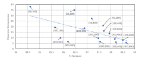
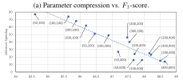
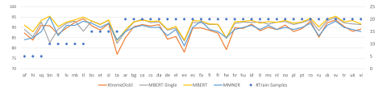
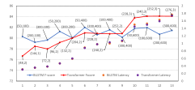

# <span id="page-0-0"></span>XtremeDistil: Multi-stage Distillation for Massive Multilingual Models

# Subhabrata Mukherjee

Microsoft Research AI Redmond, WA

submukhe@microsoft.com

## Ahmed Hassan Awadallah

Microsoft Research AI Redmond, WA

hassanam@microsoft.com

## Abstract

Deep and large pre-trained language models are the state-of-the-art for various natural language processing tasks. However, the huge size of these models could be a deterrent to using them in practice. Some recent works use knowledge distillation to compress these huge models into shallow ones. In this work we study knowledge distillation with a focus on multilingual Named Entity Recognition (NER). In particular, we study several distillation strategies and propose a stage-wise optimization scheme leveraging teacher internal representations, that is agnostic of teacher architecture, and show that it outperforms strategies employed in prior works. Additionally, we investigate the role of several factors like the amount of unlabeled data, annotation resources, model architecture and inference latency to name a few. We show that our approach leads to massive compression of teacher models like mBERT by upto 35x in terms of parameters and 51x in terms of latency for batch inference while retaining 95% of its F1-score for NER over 41 languages.

## 1 Introduction

Motivation: Pre-trained language models have shown state-of-the-art performance for various natural language processing applications like text classification, named entity recognition and questionanswering. A significant challenge facing practitioners is how to deploy these huge models in practice. For instance, models like BERT Large [\(Devlin](#page-9-0) [et al.,](#page-9-0) [2019\)](#page-9-0), GPT 2 [\(Radford et al.,](#page-9-1) [2019\)](#page-9-1), Megatron [\(Shoeybi et al.,](#page-10-0) [2019\)](#page-10-0) and T5 [\(Raffel et al.,](#page-9-2) [2019\)](#page-9-2) have 340M, 1.5B, 8.3B and 11B parameters respectively. Although these models are trained offline, during prediction we need to traverse the deep neural network architecture stack involving a large number of parameters. This significantly increases latency and memory requirements.

Knowledge distillation [\(Hinton et al.,](#page-9-3) [2015;](#page-9-3) [Ba](#page-9-4) [and Caruana,](#page-9-4) [2014\)](#page-9-4) earlier used in computer vision provides one of the techniques to compress huge neural networks into smaller ones. In this, shallow models (called students) are trained to mimic the output of huge models (called teachers) based on a transfer set. Similar approaches have been recently adopted for language model distillation.

Limitations of existing work: Recent works [\(Liu](#page-9-5) [et al.,](#page-9-5) [2019;](#page-9-5) [Zhu et al.,](#page-10-1) [2019;](#page-10-1) [Tang et al.,](#page-10-2) [2019;](#page-10-2) [Turc](#page-10-3) [et al.,](#page-10-3) [2019\)](#page-10-3) leverage soft logits from teachers as optimization targets for distilling students, with some notable exceptions from concurrent work. [Sun et al.](#page-10-4) [\(2019\)](#page-10-4); [Sanh](#page-10-5) [\(2019\)](#page-10-5); [Aguilar et al.](#page-9-6) [\(2019\)](#page-9-6); [Zhao](#page-10-6) [et al.](#page-10-6) [\(2019\)](#page-10-6) additionally use internal teacher representations as additional signals. However, these methods are constrained by architectural considerations like embedding dimension in BERT and transformer architecture. This makes it difficult to massively compress models (without being able to reduce network width) or adopt alternate architecture. For instance, we observe BiLSTMS as students to be more accurate than Transformers for low latency configurations. Some concurrent works [\(Turc et al.,](#page-10-3) [2019\)](#page-10-3); [\(Zhao et al.,](#page-10-6) [2019\)](#page-10-6) adopt pre-training or dual training to distil students of arbitrary architecture. However, pre-training is expensive in terms of time and computational resources.

Additionally, most of the above works are geared for distilling language models for GLUE tasks [\(Wang et al.,](#page-10-7) [2018\)](#page-10-7). There has been some limited exploration of such techniques for sequence tagging tasks like NER [\(Izsak et al.,](#page-9-7) [2019;](#page-9-7) [Shi et al.,](#page-10-8) [2019\)](#page-10-8) or multilingual tasks [\(Tsai et al.,](#page-10-9) [2019\)](#page-10-9). However, these works also suffer from similar drawbacks as mentioned before.

Overview of XtremeDistil: In this work, we compare distillation strategies used in all the above

XtremeDistil: Multilingual pre-TRainEd ModEl Distillation

works and propose a new scheme outperforming prior ones. In this, we leverage teacher internal representations to transfer knowledge to the student. However, in contrast to prior work, we are not restricted by the choice of student architecture. This allows representation transfer from Transformerbased teacher model to BiLSTM-based student model with different embedding dimensions and disparate output spaces. We also propose a stagewise optimization scheme to sequentially transfer most general to task-specific information from teacher to student for better distillation.

Overview of our task: Unlike prior works mostly focusing on GLUE tasks in a single language, we employ our techniques to study distillation for massive multilingual Named Entity Recognition (NER) over 41 languages. Prior work on multilingual transfer on the same [\(Rahimi et al.,](#page-10-10) [2019\)](#page-10-10) (MM-NER) requires knowledge of source and target language whereby they judiciously select pairs for effective transfer resulting in a customized model for each language. In our work, we adopt Multilingual Bidirectional Encoder Representations from Transformer (mBERT) as our teacher and show that it is possible to perform language-agnostic joint NER for all languages with a single model that has a similar performance but massively compressed in contrast to mBERT and MMNER.

The closest one to this work is that of [\(Tsai et al.,](#page-10-9) [2019\)](#page-10-9) where mBERT is leveraged for multilingual NER. We discuss this in details and use their strategy as a baseline. We show our distillation strategy to be better leading to a higher compression and faster inference. We also investigate several unexplored dimensions of distillation like the impact of unlabeled transfer data and annotation resources, choice of multilingual word embeddings, architectural variations and inference latency.

Our techniques obtain massive compression of teacher models like mBERT by upto 35x in terms of parameters and 51x in terms of latency for batch inference while retaining 95% of its performance for massive multilingual NER, and matching or outperforming it for classification tasks. Overall, our work makes the following *contributions*:

- Method: We propose a distillation method leveraging internal representations and parameter projection that is agnostic of teacher architecture.
- Inference: To learn model parameters, we propose stage wise optimization schedule with gradual unfreezing outperforming prior schemes.

- Experiments: We perform distillation for multilingual NER on 41 languages with massive compression and comparable performance to huge models[1](#page-0-0) . We also perform classification experiments on four datasets where our compressed models perform at par with significantly larger teachers.
- Study: We study the influence of several factors on distillation like the availability of annotation resources for different languages, model architecture, quality of multilingual word embeddings, memory footprint and inference latency.

Problem Statement: Consider a sequence x = hxki with K tokens and y = hyki as the corresponding labels. Consider D<sup>l</sup> = {hxk,li,hyk,li} to be a set of n labeled instances with X = {hxk,li} denoting the instances and Y = {hyk,li} the corresponding labels. Consider D<sup>u</sup> = {hxk,ui} to be a transfer set of N unlabeled instances from the same domain where n N. Given a teacher T (θ t ), we want to train a student S(θ s ) with θ being trainable parameters such that |θ s | |θ t | and the student is comparable in performance to the teacher based on some evaluation metric. In the following section, the superscript 't' always represents the teacher and 's' denotes the student.

## 2 Related Work

# Model compression and knowledge distillation:

Prior works in the vision community dealing with huge architectures like AlexNet and ResNet have addressed this challenge in two ways. Works in model compression use quantization [\(Gong et al.,](#page-9-8) [2014\)](#page-9-8), low-precision training and pruning the network, as well as their combination [\(Han et al.,](#page-9-9) [2016\)](#page-9-9) to reduce the memory footprint. On the other hand, works in knowledge distillation leverage student teacher models. These approaches include using soft logits as targets [\(Ba and Caruana,](#page-9-4) [2014\)](#page-9-4), increasing the temperature of the softmax to match that of the teacher [\(Hinton et al.,](#page-9-3) [2015\)](#page-9-3) as well as using teacher representations [\(Romero et al.,](#page-10-11) [2015\)](#page-10-11) (refer to [\(Cheng et al.,](#page-9-10) [2017\)](#page-9-10) for a survey).

Recent and concurrent Works: [Liu et al.](#page-9-5) [\(2019\)](#page-9-5); [Zhu et al.](#page-10-1) [\(2019\)](#page-10-1); [Clark et al.](#page-9-11) [\(2019\)](#page-9-11) leverage ensembling to distil knowledge from several multitask deep neural networks into a single model. [Sun](#page-10-4) [et al.](#page-10-4) [\(2019\)](#page-10-4); [Sanh](#page-10-5) [\(2019\)](#page-10-5)[;Aguilar et al.](#page-9-6) [\(2019\)](#page-9-6) train student models leveraging architectural knowledge

<sup>1</sup>Code and resources available at: [https://aka.ms/](https://aka.ms/XtremeDistil) [XtremeDistil](https://aka.ms/XtremeDistil)

of the teacher models which adds architectural constraints (e.g., embedding dimension) on the student. In order to address this shortcoming, more recent works combine task-specific distillation with pre-training the student model with arbitrary embedding dimension but still relying on transformer architectures (Turc et al., 2019); (Jiao et al., 2019); (Zhao et al., 2019).

Izsak et al. (2019); Shi et al. (2019) extend these for sequence tagging for Part-of-Speech (POS) tagging and Named Entity Recognition (NER) in English. The one closest to our work Tsai et al. (2019) extends the above for multilingual NER.

Most of these works rely on general corpora for pre-training and task-specific labeled data for distillation. To harness additional knowledge, (Turc et al., 2019) leverage task-specific unlabeled data. (Tang et al., 2019; Jiao et al., 2019) use rule-and embedding-based data augmentation.

### 3 Models

The Student: The input to the model are E-dimensional word embeddings for each token. To capture sequential information in the sentence, we use a single layer Bidirectional Long Short Term Memory Network (BiLSTM). Given a sequence of K tokens, a BiLSTM computes a set of K vectors  $h(x_k) = [\overline{h(x_k)}; \overline{h(x_k)}]$  as the concatenation of the states generated by a forward  $(\overline{h(x_k)})$  and backward LSTM  $(\overline{h(x_k)})$ . Assuming the number of hidden units in the LSTM to be H, each hidden state  $h(x_k)$  is of dimension 2H. Probability distribution for the token label at timestep k is given by:

$$p^{(s)}(x_k) = softmax(h(x_k) \cdot W^s)$$
 (1)

where  $W^s \in \mathbb{R}^{2H.C}$  and C is number of labels.

Consider one-hot encoding of the token labels, such that  $y_{k,l,c}=1$  for  $y_{k,l}=c$ , and  $y_{k,l,c}=0$  otherwise for  $c\in C$ . The overall cross-entropy loss computed over each token obtaining a specific label in each sequence is given by:

$$\mathcal{L_{CE}} = -\sum_{x_l, y_l \in D_l} \sum_k \sum_c y_{k,c,l} \log p_c^{(s)}(x_{k,l})$$
 (2)

We train the student model end-to-end minimizing the above cross-entropy loss over labeled data. **The Teacher:** Pre-trained language models like ELMO (Peters et al., 2018), BERT (Devlin et al., 2019) and GPT (Radford et al., 2018, 2019) have shown state-of-the-art performance for several tasks. We adopt BERT as the teacher – specifically,

the multilingual version of BERT (mBERT) with 179MM parameters trained over 104 languages with the largest Wikipedias. mBERT does not use any markers to distinguish languages during pre-training and learns a single language-agnostic model trained via masked language modeling over Wikipedia articles from all languages.

**Tokenization**: Similar to mBERT, we use Word-Piece tokenization with 110K shared WordPiece vocabulary. We preserve casing, remove accents, split on punctuations and whitespace.

Fine-tuning the Teacher: The pre-trained language models are trained for general language modeling objectives. In order to adapt them for the given task, the teacher is fine-tuned end-to-end with task-specific labeled data  $D_l$  to learn parameters  $\tilde{\theta}^t$  using cross-entropy loss as in Equation 2.

### 4 Distillation Features

Teacher fine-tuning gives us access to task-specific representations for distilling the student. To this end, we use different kinds of teacher information.

#### 4.1 Teacher Logits

Logits as logarithms of predicted probabilities provide a better view of the teacher by emphasizing on the different relationships learned by it across different instances. Consider  $p^t(x_k)$  to be the classification probability of token  $x_k$  as generated by the fine-tuned teacher with  $logit(p^t(x_k))$  representing the corresponding logits. Our objective is to train a student model with these logits as targets. Given the hidden state representation  $h(x_k)$  for token  $x_k$ , we can obtain the corresponding classification score (since targets are logits) as:

$$r^{s}(x_k) = W^r \cdot h(x_k) + b^r \tag{3}$$

<span id="page-2-0"></span>where  $W^r \in R^{C \cdot 2H}$  and  $b^r \in R^C$  are trainable parameters and C is the number of classes. We want to train the student neural network end-to-end by minimizing the element-wise mean-squared error between the classification scores given by the student and the target logits from the teacher as:

$$\mathcal{L}_{\mathcal{LL}} = \frac{1}{2} \sum_{x_u \in D_u} \sum_{k} ||r^s(x_{k,u}) - \operatorname{logit}(p^t(x_{k,u}; \tilde{\theta_t}))||^2$$
(4)

### 4.2 Internal Teacher Representations

**Hidden representations:** Recent works (Sun et al., 2019; Romero et al., 2015) have shown the

hidden state information from the teacher to be helpful as a hint-based guidance for the student. Given a large collection of task-specific unlabeled data, we can transfer the teacher's knowledge to the student via its hidden representations. However, this poses a challenge in our setting as the teacher and student models have different architectures with disparate output spaces.

Consider  $h^s(x_k)$  and  $z_l^t(x_k; \tilde{\theta}_t)$  to be the representations generated by the student and the  $l^{th}$  deep layer of the fine-tuned teacher respectively for a token  $x_k$ . Consider  $x_u \in D_u$  to be the set of unlabeled instances. We will later discuss the choice of the teacher layer l and its impact on distillation.

**Projection:** To make all output spaces compatible, we perform a non-linear projection of the parameters in student representation  $h^s$  to have same shape as teacher representation  $z_t^t$  for each token  $x_k$ :

$$\tilde{z}^s(x_k) = Gelu(W^f \cdot h^s(x_k) + b^f)$$
 (5)

where  $W^f \in R^{|z_l^t| \cdot 2H}$  is the projection matrix,  $b^f \in R^{|z_l^t|}$  is the bias, and Gelu (Gaussian Error Linear Unit) (Hendrycks and Gimpel, 2016) is the non-linear projection function.  $|z_l^t|$  represents the embedding dimension of the teacher. This transformation aligns the output spaces of the student and teacher and allows us to accommodate arbitrary student architecture. Also note that the projections (and therefore the parameters) are shared across tokens at different timepoints.

The projection parameters are learned by minimizing the KL-divergence (KLD) between the student and the  $l^{th}$  layer teacher representations:

$$\mathcal{L}_{\mathcal{RL}} = \sum_{x_u \in D_u} \sum_{k} \text{KLD}(\tilde{z}^s(x_{k,u}), z_l^t(x_{k,u}; \tilde{\theta}_t))$$
(6)

Multilingual word embeddings: A large number of parameters reside in the word embeddings. For mBERT a shared multilingual WordPiece vocabulary of V=110K tokens and embedding dimension of D=768 leads to 92MM parameters. To have massive compression, we cannot directly incorporate mBERT embeddings in our model. Since we use the same WordPiece vocabulary, we are likely to benefit more from these embeddings than from Glove (Pennington et al., 2014) or FastText (Bojanowski et al., 2016).

We use a dimensionality reduction algorithm like Singular Value Decomposition (SVD) to project the mBERT word embeddings to a lower dimensional space. Given mBERT word embedding ma-

## Algorithm 1: Multi-stage distillation.

```
Fine-tune teacher on D_l and update \tilde{\theta}^t;
for stage in \{1,2,3\} do
      Freeze all student layers l' \in \{1 \cdots L\};
      if stage=1 then
           output = \tilde{z}^s(x_u);
           target = teacher representations on D_u from
              the l^{th} layer as z_l^t(x_u; \tilde{\theta^t});
           loss = \mathcal{R}_{\mathcal{R}.\mathcal{L}};
      end
     if stage=2 then
           output = r^s(x_u);
           target = teacher logits on D_u as
              logit(p^t(x_u; \theta^t));
           loss = \mathcal{R}_{\mathcal{LL}};
      end
     if stage=3 then
           output = p^s(x_l);
            target = y_l \in D_l;
           loss = \mathcal{R}_{CE};
      end
      for layer l' \in \{L \cdots 1\} do
           Unfreeze l':
            Update parameters \theta_{l'}^s, \theta_{l'+1}^s \cdots \theta_L^s by
              minimizing the optimization loss between
              student output and teacher target
      end
end
```

<span id="page-3-0"></span>trix of dimension  $V \times D$ , SVD finds the best E-dimensional representation that minimizes sum of squares of the projections (of rows) to the subspace.

## 5 Training

We want to optimize the loss functions for *representation*  $\mathcal{L}_{\mathcal{RL}}$ , *logits*  $\mathcal{L}_{\mathcal{LL}}$  and *cross-entropy*  $\mathcal{L}_{\mathcal{CE}}$ . These optimizations can be scheduled differently to obtain different training regimens as follows.

#### 5.1 Joint Optimization

In this, we optimize the following losses jointly:

$$\frac{1}{|D_{l}|} \sum_{\{x_{l}, y_{l}\} \in D_{l}} \alpha \cdot \mathcal{L}_{C\varepsilon}(x_{l}, y_{l}) + \frac{1}{|D_{u}|} \sum_{\{x_{u}, y_{u}\} \in D_{u}} \left( \beta \cdot \mathcal{L}_{\mathcal{R}\mathcal{L}}(x_{u}, y_{u}) + \gamma \cdot \mathcal{L}_{\mathcal{L}\mathcal{L}}(x_{u}, y_{u}) \right)$$
(7)

<span id="page-3-1"></span>where  $\alpha, \beta$  and  $\gamma$  weigh the contribution of different losses. A high value of  $\alpha$  makes the student focus more on easy targets; whereas a high value of  $\gamma$  leads focus to the difficult ones. The above loss is computed over two different task-specific data segments. The first part involves cross-entropy loss over labeled data, whereas the second part involves representation and logit loss over unlabeled data.

## 5.2 Stage-wise Training

Instead of optimizing all loss functions jointly, we propose a stage-wise scheme to gradually transfer most general to task-specific representations from teacher to student. In this, we first train the student to mimic teacher representations from its l th layer by optimizing RRL on unlabeled data. The student learns the parameters for word embeddings (θ <sup>w</sup>), BiLSTM (θ b ) and projections hW<sup>f</sup> , b<sup>f</sup> i.

In the second stage, we optimize for the crossentropy RCE and logit loss RLL jointly on both labeled and unlabeled data respectively to learn the corresponding parameters W<sup>s</sup> and hW<sup>r</sup> , b<sup>r</sup> i.

The above can be further broken down in two stages, where we sequentially optimize logit loss RLL on unlabeled data and then optimize crossentropy loss RCE on labeled data. Every stage learns parameters conditioned on those learned in previous stage followed by end-to-end fine-tuning.

## 5.3 Gradual Unfreezing

One potential drawback of end-to-end fine-tuning for stage-wise optimization is 'catastrophic forgetting' [\(Howard and Ruder,](#page-9-18) [2018\)](#page-9-18) where the model forgets information learned in earlier stages. To address this, we adopt gradual unfreezing – where we tune the model one layer at a time starting from the configuration at the end of previous stage.

We start from the top layer that contains the most task-specific information and allow the model to configure the task-specific layer first while others remain frozen. The latter layers are gradually unfrozen one by one and the model trained till convergence. Once a layer is unfrozen, it maintains the state. When the last layer (word embeddings) is unfrozen, the entire network is trained end-toend. The order of this unfreezing scheme (top-tobottom) is reverse of that in [\(Howard and Ruder,](#page-9-18) [2018\)](#page-9-18) and we find this to work better in our setting with the following intuition. At the end of the first stage on optimizing RRL, the student learns to generate representations similar to that of the l th layer of the teacher. Now, we need to add only a few task-specific parameters (hW<sup>r</sup> , b<sup>r</sup> i) to optimize for logit loss RLL with all others frozen. Next, we *gradually* give the student more flexibility to optimize for task-specific loss by tuning the layers below where the number of parameters increases with depth (|hW<sup>r</sup> , b<sup>r</sup> i| |θb| |θw|).

We tune each layer for n epochs and restore model to the best configuration based on validation

<span id="page-4-0"></span>

| Dataset                                              | Labels            | Train                      | Test                      | Unlabeled             |
|------------------------------------------------------|-------------------|----------------------------|---------------------------|-----------------------|
| NER<br>Wikiann-41                                    | 11                | 705K                       | 329K                      | 7.2MM                 |
| Classification<br>IMDB<br>DBPedia<br>AG News<br>Elec | 2<br>14<br>4<br>2 | 25K<br>560K<br>120K<br>25K | 25K<br>70K<br>7.6K<br>25K | 50K<br>-<br>-<br>200K |

Table 1: Full dataset summary.

<span id="page-4-1"></span>

| Work                                                                                                                                               | PT     | TA     | Distil.  |
|----------------------------------------------------------------------------------------------------------------------------------------------------|--------|--------|----------|
| Sanh (2019)<br>Turc et al. (2019)                                                                                                                  | Y<br>Y | Y<br>N | D1<br>D1 |
| Liu et al. (2019); Zhu et al. (2019);<br>Shi et al. (2019); Tsai et al. (2019);<br>Tang et al. (2019); Izsak et al. (2019);<br>Clark et al. (2019) | N      | N      | D1       |
| Sun et al. (2019)                                                                                                                                  | N      | Y      | D2       |
| Jiao et al. (2019)                                                                                                                                 | N      | N      | D2       |
| Zhao et al. (2019)                                                                                                                                 | Y      | N      | D2       |
| XtremeDistil (ours)                                                                                                                                | N      | N      | D4       |

Table 2: Different distillation strategies. D1 leverages soft logits with hard labels. D2 uses representation loss. PT denotes pre-training with language modeling. TA depicts students constrained by teacher architecture.

loss on a held-out set. Therefore, the model retains best possible performance from any iteration. Algorithm [1](#page-3-0) shows overall processing scheme.

## 6 Experiments

Dataset Description: We evaluate our model XtremeDistil for multilingual NER on 41 languages and same setting as in [\(Rahimi et al.,](#page-10-10) [2019\)](#page-10-10). This data is derived from WikiAnn NER corpus [\(Pan](#page-9-19) [et al.,](#page-9-19) [2017\)](#page-9-19) and partitioned into training, development and test sets. All NER results are reported in this test set for a fair comparison between existing works. We report the average F1-score (µ) and standard deviation σ between scores across 41 languages for phrase-level evaluation. Refer to Figure [2](#page-7-0) for language codes and corresponding distribution of training labels. We also perform experiments with data from four other domains (refer to Table [1\)](#page-4-0): IMDB [\(Maas et al.,](#page-9-20) [2011\)](#page-9-20), SST-2 [\(Socher et al.,](#page-10-12) [2013\)](#page-10-12) and Elec [\(McAuley and](#page-9-21) [Leskovec,](#page-9-21) [2013\)](#page-9-21) for sentiment analysis for movie and electronics product reviews, DbPedia [\(Zhang](#page-10-13) [et al.,](#page-10-13) [2015\)](#page-10-13) and Ag News [\(Zhang et al.,](#page-10-13) [2015\)](#page-10-13) for topic classification of Wikipedia and news articles. NER Tags: The NER corpus uses IOB2 tagging strategy with entities like LOC, ORG and PER. Following mBERT, we do not use language markers and share these tags across all languages. We

<span id="page-5-0"></span>

| Strategy | Features                           | Transfer = 0.7MM | Transfer = 1.4MM | Transfer = 7.2MM |
|----------|------------------------------------|------------------|------------------|------------------|
| D0       | Labels per lang.                   | 71.26 (6.2)      | -                | -                |
| D0-S     | Labels across all lang.            | 81.44 (5.3)      | -                | -                |
| D1       | Labels and Logits                  | 82.74 (5.1)      | 84.52 (4.8)      | 85.94 (4.8)      |
| D2       | Labels, Logits and Repr.           | 82.38 (5.2)      | 83.78 (4.9)      | 85.87 (4.9)      |
| D3.1     | (S1) Repr. (S2) Labels and Logits  | 83.10 (5.0)      | 84.38 (5.1)      | 86.35 (4.9)      |
| D3.2     | + Gradual unfreezing               | 86.77 (4.3)      | 87.79 (4.0)      | 88.26 (4.3)      |
| D4.1     | (S1) Repr. (S2) Logits (S3) Labels | 84.82 (4.7)      | 87.07 (4.2)      | 87.87 (4.1)      |
| D4.2     | + Gradual unfreezing               | 87.10 (4.2)      | 88.64 (3.8)      | 88.52 (4.1)      |

Table 3: Comparison of several strategies with average F1-score (and standard deviation) across 41 languages over different transfer data size. S<sup>i</sup> depicts separate stages and corresponding optimized loss functions.

use additional syntactic markers like {CLS, SEP, PAD} and 'X' for marking segmented wordpieces contributing a total of 11 tags (with shared 'O').

## 6.1 Evaluating Distillation Strategies

Baselines: A trivial baseline (D0) is to learn models *one per language* using only corresponding labels for learning. This can be improved by merging all instances and sharing information across all languages (D0-S). Most of the concurrent and recent works (refer to Table [2](#page-4-1) for an overview) leverage logits as optimization targets for distillation (D1). A few exceptions also use teacher internal representations along with soft logits (D2). For our model we consider multi-stage distillation, where we first optimize representation loss followed by jointly optimizing logit and cross-entropy loss (D3.1) and further improving it by gradual unfreezing of neural network layers (D3.2). Finally, we optimize the loss functions sequentially in three stages (D4.1) and improve it further by unfreezing mechanism (D4.2). We further compare all strategies while varying the amount of unlabeled transfer data for distillation (hyper-parameter settings in Appendix). Results: From Table [3,](#page-5-0) we observe all strategies that share information across languages to work better (D0-S vs. D0) with soft logits adding more value than hard targets (D1 vs. D0-S). Interestingly, we observe simply combining representation loss with logits (D3.1 vs. D2) hurts the model. We observe this strategy to be vulnerable to the hyperparameters (α, β, γ in Eqn. [7\)](#page-3-1) used to combine multiple loss functions. We vary hyper-parameters in multiples of 10 and report best numbers.

Stage-wise optimizations remove these hyperparameters and improve performance. We also observe the gradual unfreezing scheme to improve both stage-wise distillation strategies significantly.

<span id="page-5-1"></span>

| Stage | Unfreezing Layer              | F1    | Std. Dev. |
|-------|-------------------------------|-------|-----------|
| 2     | Linear (hWr<br>, br<br>i)     | 0     | 0         |
| 2     | Projection (hWf<br>, bf<br>i) | 2.85  | 3.9       |
| 2     | BiLSTM (θb)                   | 81.64 | 5.2       |
| 2     | Word Emb (θw)                 | 85.99 | 4.4       |
| 3     | Softmax (Ws<br>)              | 86.38 | 4.2       |
| 3     | Projection (hWf<br>, bf<br>i) | 87.65 | 3.9       |
| 3     | BiLSTM (θb)                   | 88.08 | 3.9       |
| 3     | Word Emb (θw)                 | 88.64 | 3.8       |

Table 4: Gradual F1-score improvement over multiple distillation stages in XtremeDistil .

<span id="page-5-2"></span>

| Model                              | F1    | Std. Dev. |
|------------------------------------|-------|-----------|
| mBERT-single (Devlin et al., 2019) | 90.76 | 3.1       |
| mBERT (Devlin et al., 2019)        | 91.86 | 2.7       |
| MMNER (Rahimi et al., 2019)        | 89.20 | 2.8       |
| XtremeDistil (ours)                | 88.64 | 3.8       |

Table 5: F1-score comparison of different models with standard deviation across 41 languages.

Focusing on the data dimension, we observe all models to improve as more and more unlabeled data is used for transferring teacher knowledge to student. However, we also observe the improvement to slow down after a point where additional unlabeled data does not yield significant benefits. Table [4](#page-5-1) shows the gradual performance improvement in XtremeDistil after every stage and unfreezing various neural network layers.

## 6.2 Performance, Compression and Speedup

Performance: We observe XtremeDistil in Table [5](#page-5-2) to perform competitively with other models. mBERT-single models are fine-tuned per language with corresponding labels, whereas mBERT is finetuned with data across all languages. MMNER results are reported from [Rahimi et al.](#page-10-10) [\(2019\)](#page-10-10).

Figure [2](#page-7-0) shows the variation in F1-score across different languages with variable amount of training data for different models. We observe all the models to follow the general trend with some aber-

<span id="page-6-0"></span>



(b) Inference speedup vs.  $F_1$ -score.

Figure 1: Variation in XtremeDistil  $F_1$ -score with parameter and latency compression against mBERT. Each point in the linked scatter plots depict a setting with corresponding embedding dimension and BiLSTM hidden states as (E, H). Data point (50, 200) in both figures correspond to 35x compression and 51x speedup.

rations for languages with less training labels.

**Parameter compression:** XtremeDistil performs at par with MMNER in terms of  $F_1$ -score while obtaining at least 41x compression. Given L languages, MMNER learns (L-1) ensembled and distilled models, one for each target language. Each of the MMNER language-specific models is comparable in size to our single multilingual model. We learn a single model for all languages, thereby, obtaining a compression factor of at least L=41.

Figure 1a shows the variation in  $F_1$ -scores of XtremeDistil and compression against mBERT with different configurations corresponding to the embedding dimension (E) and number of BiLSTM hidden states  $(2 \times H)$ . We observe that reducing the embedding dimension leads to great compression with minimal performance loss. Whereas, reducing the BiLSTM hidden states impacts the performance more and contributes less to the compression.

**Inference speedup:** We compare the runtime inference efficiency of mBERT and our model in a single P100 GPU for batch inference (batch size = 32) on 1000 queries of sequence length 32. We average the time taken for predicting labels for all the queries for each model aggregated over 100 runs. Compared to batch inference, the speedups are less for online inference (batch size = 1) at 17x on Intel(R) Xeon(R) CPU (E5-2690 v4 @2.60GHz) (refer to Appendix for details).

<span id="page-6-1"></span>

| Model        | #Transfer Samples              | $F_1$                            |
|--------------|--------------------------------|----------------------------------|
| MMNER        | -                              | 62.1                             |
| mBERT        | -                              | 79.54                            |
| XtremeDistil | 4.1K<br>705K<br>1.3MM<br>7.2MM | 19.12<br>76.97<br>77.17<br>77.26 |

Table 6:  $F_1$ -score comparison for low-resource setting with 100 labeled samples per language and transfer set of different sizes for XtremeDistil .

Figure 1b shows the variation in  $F_1$ -scores of XtremeDistil and inference speedup against mBERT with different (linked) parameter configurations as before. As expected, the performance degrades with gradual speedup. We observe that parameter compression does not necessarily lead to an inference speedup. Reduction in the word embedding dimension leads to massive model compression, however, it does not have a similar effect on the latency. The BiLSTM hidden states, on the other hand, constitute the real latency bottleneck. One of the best configurations leads to 35x compression, 51x speedup over mBERT retaining nearly 95% of its performance.

#### 6.3 Low-resource NER and Distillation

Models in all prior experiments are trained on 705K labeled instances across all languages. In this setting, we consider only 100 labeled samples for each language with a total of 4.1K instances. From Table 6, we observe mBERT to outperform MMNER by more than 17 percentage points with XtremeDistil closely following suit.

Furthermore, we observe our model's performance to improve with the transfer set size depicting the importance of unlabeled transfer data for knowledge distillation. As before, a lot of additional data has marginal contribution.

#### **6.4 Word Embeddings**

From Table 7 we observe randomly initialized word embeddings to work quite well. Multilingual Fast-Text embeddings (Bojanowski et al., 2016) lead to minor improvement due to 38% overlap between FastText tokens and mBERT wordpieces. English Glove does much better. We experiment with dimensionality reduction techniques and find SVD to work better leading to marginal improvement over mBERT embeddings before reduction. As expected, fine-tuned mBERT embeddings perform better than that from pre-trained checkpoints.

<span id="page-7-0"></span>

Figure 2:  $F_1$ -score comparison for different models across 41 languages. The y-axis on the left shows the scores, whereas the axis on the right (plotted against blue dots) shows the number of training labels (in thousands).

<span id="page-7-1"></span>

| Word Embedding                         | $F_1$ | Std.<br>Dev. |
|----------------------------------------|-------|--------------|
| SVD + mBERT (fine-tuned)               | 88.64 | 3.8          |
| mBERT (fine-tuned)                     | 88.60 | 3.9          |
| SVD + mBERT (pre-trained)              | 88.54 | 3.9          |
| PCA + PPA (d=14) (Raunak et al., 2019) | 88.35 | 3.9          |
| PCA + PPA (d=17) (Raunak et al., 2019) | 88.25 | 4.0          |
| Glove (Pennington et al., 2014)        | 88.16 | 4.0          |
| FastText (Bojanowski et al., 2016)     | 87.91 | 3.9          |
| Random                                 | 87.43 | 4.1          |

Table 7: Impact of using various word embeddings for initialization on multilingual distillation. SVD, PCA, FastText and Glove use 300-dim. word embeddings.

#### 6.5 Architectural Considerations

Which teacher layer to distil from? The topmost teacher layer captures more task-specific knowledge. However, it may be difficult for a shallow student to capture this knowledge given its limited capacity. On the other hand, the less-deep representations at the middle of teacher model are easier to mimic by shallow student. From Table 8 we observe the student to benefit most from distilling the  $6^{th}$  or  $7^{th}$  layer of the teacher.

<span id="page-7-2"></span>

| Layer (l) | F <sub>1</sub> -score | Std.<br>Dev. | Layer (l) | F <sub>1</sub> -score | Std.<br>Dev. |
|-----------|-----------------------|--------------|-----------|-----------------------|--------------|
| 11        | 88.46                 | 3.8          | 4         | 88.19                 | 4            |
| 9         | 88.31                 | 3.8          | 2         | 88.50                 | 4            |
| 7         | 88.64                 | 3.8          | 1         | 88.51                 | 4            |
| 6         | 88.64                 | 3.8          |           |                       |              |

Table 8: Comparison of XtremeDistil performance on distilling representations from  $l^{th}$  mBERT layer.

Comparison of student architecture. Recent works leverage both BiLSTM and Transformer as students. In this experiment, we vary the embedding dimension and hidden states for BiLSTM-, and embedding dimension and depth for Transformer-based students to obtain configurations with similar inference latency. Each of 13 configurations in Figure 3 depict  $F_1$ -scores obtained

<span id="page-7-3"></span>

Figure 3: BiLSTM and Transformer  $F_1$ -score (left y-axis) vs. inference latency (right y-axis) in 13 different settings with corresponding embedding dimension and width / depth of the student as (E, W/D).

by students of different architecture but similar latency (refer to Table 15 in Appendix for statistics) – for strategy D0-S in Table 3. We observe that for low-latency configurations BiLSTMs with hidden states  $\{2\times100,2\times200\}$  work better than 2-layer Transformers. Whereas, the latter starts performing better with more than 3-layers although with a higher latency compared to the aforementioned BiLSTM configurations.

#### 6.6 Distillation for Text Classification

We switch gear and focus on classification tasks. In contrast to sequence tagging, we use the last hidden state of the BiLSTM as the final sentence representation for projection, regression and softmax.

Table 9 shows the distillation performance of XtremeDistil with different teachers on four benchmark text classification datasets. We observe the student to almost match the teacher performance for all of the datasets. The performance also improves with a better teacher, although the improvement is marginal as the student capacity saturates.

Table 10 shows the distillation performance with only 500 labeled samples per class. The distilled student improves over the non-distilled version by 19.4 percent and matches the teacher performance for all of the tasks demonstrating the impact of distillation for low-resource settings.

<span id="page-8-0"></span>

| Data | Student    | Distil | Distil  | BERT   | BERT    |
|------|------------|--------|---------|--------|---------|
|      | no distil. | (Base) | (Large) | (Base) | (Large) |
| AG   | 89.71      | 92.33  | 94.33   | 92.12  | 94.63   |
| IMDB | 89.37      | 91.22  | 91.70   | 91.70  | 93.22   |
| Elec | 90.62      | 93.55  | 93.56   | 93.46  | 94.27   |
| DB   | 98.64      | 99.10  | 99.06   | 99.26  | 99.20   |

Table 9: Distillation performance with BERT.

<span id="page-8-1"></span>

| Dataset | Student<br>no distil. | Student<br>with distil. | BERT<br>Large |
|---------|-----------------------|-------------------------|---------------|
| AG News | 85.85                 | 90.45                   | 90.36         |
| IMDB    | 61.53                 | 89.08                   | 89.11         |
| Elec    | 65.68                 | 91.00                   | 90.41         |
| DBpedia | 96.30                 | 98.94                   | 98.94         |

Table 10: Distillation with BERT Large on 500 labeled samples per class.

Comparison with other distillation techniques: SST-2 [\(Socher et al.,](#page-10-12) [2013\)](#page-10-12) from GLUE [\(Wang](#page-10-7) [et al.,](#page-10-7) [2018\)](#page-10-7) has been used as a test bed for other distillation techniques for single instance classification tasks (as in this work). Table [11](#page-8-2) shows the accuracy comparison of such methods reported in SST-2 development set with the same teacher.

We extract 11.7MM sentences from all IMDB movie reviews in Table [1](#page-4-0) to form the unlabeled transfer set for distillation. We obtain the best performance on distilling with BERT Large (uncased, whole word masking model) than BERT Base – demonstrating a better student performance with a better teacher and outperforming other methods.

# 7 Summary

Teacher hidden representation and distillation schedule: Internal teacher representations help in distillation, although a naive combination hurts the student model. We show that a distillation schedule with stagewise optimization, gradual unfreezing with a cosine learning rate scheduler (D4.1 + D4.2 in Table [3\)](#page-5-0) obtains the best performance. We also show that the middle layers of the teacher are easier to distil by shallow students and result in the best performance (Table [8\)](#page-7-2). Additionally, the student performance improves with bigger and better teachers (Tables [9](#page-8-0) and [11\)](#page-8-2).

<span id="page-8-2"></span>

| Model              | Transfer Set | Acc.  |
|--------------------|--------------|-------|
| BERT Large Teacher | -            | 94.95 |
| XtremeDistil       | SST+Imdb     | 93.35 |
| BERT Base Teacher  | -            | 92.78 |
| XtremeDistil       | SST+Imdb     | 92.89 |
| Sun et al. (2019)  | SST          | 92.70 |
| Turc et al. (2019) | SST+IMDB     | 91.10 |

Table 11: Model accuracy on of SST-2 (dev. set).

Student architecture: We compare different student architectures like BiLSTM and Transformer in terms of configuration and performance (Figure [3,](#page-7-3) Table [15](#page-12-0) in Appendix), and observe BiLSTM to perform better at low-latency configurations, whereas the Transformer outperforms the former with more depth and higher latency budget.

Unlabeled transfer data: We explored data dimension in Tables [3](#page-5-0) and [6](#page-6-1) and observed unlabeled data to be the key for knowledge transfer from pretrained teachers to shallow students and bridge the performance gap. We observed a moderate amount of unlabeled transfer samples (0.7-1.5 MM) lead to the best student, whereas larger amounts of transfer data does not result in significant gains. This is particularly helpful for low-resource NER (with only 100 labeled samples per language as in Table [6\)](#page-6-1).

Performance trade-off: Parameter compression does not necessarily reduce inference latency, and vice versa. We explored model performance with parameter compression, inference latency and F<sup>1</sup> to show trade-off in Fig. [1](#page-6-0) and Table [16](#page-12-1) in Appendix. Multilingual word embeddings: Random initialization of word embeddings work well. A better initialization, which is also parameter-efficient, is given by Singular Value Decomposition (SVD) over fine-tuned mBERT word embeddings with the best performance for downstream task (Table [7\)](#page-7-1).

Generalization: The outlined distillation techniques and strategies are model-, architecture-, and language-agnostic and can be easily extended to arbitrary tasks and languages, although we only focus on NER and classification in this work.

Massive compression: Our techniques demonstrate massive compression (35x for parameters) and inference speedup (51x for latency) while retaining 95% of the teacher performance allowing deep pre-trained models to be deployed in practice.

## 8 Conclusions

We develop XtremeDistil for massive multi-lingual NER and classification that performs close to huge pre-trained models like MBERT but with massive compression and inference speedup. Our distillation strategy leveraging teacher representations agnostic of its architecture and stage-wise optimization schedule outperforms existing ones. We perform extensive study of several distillation dimensions like the impact of unlabeled transfer set, embeddings and student architectures, and make interesting observations outlined in summary.

# References

- <span id="page-9-6"></span>Gustavo Aguilar, Yuan Ling, Yu Zhang, Benjamin Yao, Xing Fan, and Edward Guo. 2019. [Knowledge dis](http://arxiv.org/abs/1910.03723)[tillation from internal representations.](http://arxiv.org/abs/1910.03723)
- <span id="page-9-4"></span>Jimmy Ba and Rich Caruana. 2014. [Do deep nets really](http://papers.nips.cc/paper/5484-do-deep-nets-really-need-to-be-deep) [need to be deep?](http://papers.nips.cc/paper/5484-do-deep-nets-really-need-to-be-deep) In *Advances in Neural Information Processing Systems 27: Annual Conference on Neural Information Processing Systems 2014, December 8-13 2014, Montreal, Quebec, Canada*, pages 2654–2662.
- <span id="page-9-17"></span>Piotr Bojanowski, Edouard Grave, Armand Joulin, and Tomas Mikolov. 2016. [Enriching word vectors with](http://arxiv.org/abs/1607.04606) [subword information.](http://arxiv.org/abs/1607.04606)
- <span id="page-9-10"></span>Yu Cheng, Duo Wang, Pan Zhou, and Tao Zhang. 2017. [A survey of model compression and acceleration for](http://arxiv.org/abs/1710.09282) [deep neural networks.](http://arxiv.org/abs/1710.09282) *CoRR*, abs/1710.09282.
- <span id="page-9-11"></span>Kevin Clark, Minh-Thang Luong, Urvashi Khandelwal, Christopher D. Manning, and Quoc V. Le. 2019. [Bam! born-again multi-task networks for natural](https://doi.org/10.18653/v1/p19-1595) [language understanding.](https://doi.org/10.18653/v1/p19-1595) *Proceedings of the 57th Annual Meeting of the Association for Computational Linguistics*.
- <span id="page-9-0"></span>Jacob Devlin, Ming-Wei Chang, Kenton Lee, and Kristina Toutanova. 2019. [BERT: pre-training of](https://aclweb.org/anthology/papers/N/N19/N19-1423/) [deep bidirectional transformers for language under](https://aclweb.org/anthology/papers/N/N19/N19-1423/)[standing.](https://aclweb.org/anthology/papers/N/N19/N19-1423/) In *Proceedings of the 2019 Conference of the North American Chapter of the Association for Computational Linguistics: Human Language Technologies, NAACL-HLT 2019, Minneapolis, MN, USA, June 2-7, 2019, Volume 1 (Long and Short Papers)*, pages 4171–4186.
- <span id="page-9-8"></span>Yunchao Gong, Liu Liu, Ming Yang, and Lubomir D. Bourdev. 2014. [Compressing deep convolu](http://arxiv.org/abs/1412.6115)[tional networks using vector quantization.](http://arxiv.org/abs/1412.6115) *CoRR*, abs/1412.6115.
- <span id="page-9-9"></span>Song Han, Huizi Mao, and William J. Dally. 2016. [Deep compression: Compressing deep neural net](http://arxiv.org/abs/1510.00149)[works with pruning, trained quantization and huff](http://arxiv.org/abs/1510.00149)[man coding.](http://arxiv.org/abs/1510.00149) *ICLR*.
- <span id="page-9-15"></span>Dan Hendrycks and Kevin Gimpel. 2016. [Bridging](http://arxiv.org/abs/1606.08415) [nonlinearities and stochastic regularizers with gaus](http://arxiv.org/abs/1606.08415)[sian error linear units.](http://arxiv.org/abs/1606.08415) *CoRR*, abs/1606.08415.
- <span id="page-9-3"></span>Geoffrey E. Hinton, Oriol Vinyals, and Jeffrey Dean. 2015. [Distilling the knowledge in a neural network.](http://arxiv.org/abs/1503.02531) *CoRR*, abs/1503.02531.
- <span id="page-9-18"></span>Jeremy Howard and Sebastian Ruder. 2018. [Universal](https://doi.org/10.18653/v1/P18-1031) [language model fine-tuning for text classification.](https://doi.org/10.18653/v1/P18-1031) In *Proceedings of the 56th Annual Meeting of the Association for Computational Linguistics, ACL 2018, Melbourne, Australia, July 15-20, 2018, Volume 1: Long Papers*, pages 328–339.
- <span id="page-9-7"></span>Peter Izsak, Shira Guskin, and Moshe Wasserblat. 2019. [Training compact models for low resource entity tag](http://arxiv.org/abs/1910.06294)[ging using pre-trained language models.](http://arxiv.org/abs/1910.06294)

- <span id="page-9-12"></span>Xiaoqi Jiao, Yichun Yin, Lifeng Shang, Xin Jiang, Xiao Chen, Linlin Li, Fang Wang, and Qun Liu. 2019. [Tinybert: Distilling bert for natural language](http://arxiv.org/abs/1909.10351) [understanding.](http://arxiv.org/abs/1909.10351)
- <span id="page-9-5"></span>Xiaodong Liu, Pengcheng He, Weizhu Chen, and Jianfeng Gao. 2019. [Improving multi-task deep neural](http://arxiv.org/abs/1904.09482) [networks via knowledge distillation for natural lan](http://arxiv.org/abs/1904.09482)[guage understanding.](http://arxiv.org/abs/1904.09482) *CoRR*, abs/1904.09482.
- <span id="page-9-20"></span>Andrew L. Maas, Raymond E. Daly, Peter T. Pham, Dan Huang, Andrew Y. Ng, and Christopher Potts. 2011. [Learning word vectors for sentiment analysis.](http://www.aclweb.org/anthology/P11-1015) In *The 49th Annual Meeting of the Association for Computational Linguistics: Human Language Technologies, Proceedings of the Conference, 2011, Portland, Oregon, USA*, pages 142–150.
- <span id="page-9-21"></span>Julian J. McAuley and Jure Leskovec. 2013. [Hidden](https://doi.org/10.1145/2507157.2507163) [factors and hidden topics: understanding rating di](https://doi.org/10.1145/2507157.2507163)[mensions with review text.](https://doi.org/10.1145/2507157.2507163) In *Seventh ACM Conference on Recommender Systems, RecSys '13, Hong Kong, China, October 12-16, 2013*, pages 165–172.
- <span id="page-9-19"></span>Xiaoman Pan, Boliang Zhang, Jonathan May, Joel Nothman, Kevin Knight, and Heng Ji. 2017. [Cross](https://doi.org/10.18653/v1/P17-1178)[lingual name tagging and linking for 282 languages.](https://doi.org/10.18653/v1/P17-1178) In *Proceedings of the 55th Annual Meeting of the Association for Computational Linguistics (Volume 1: Long Papers)*, pages 1946–1958, Vancouver, Canada. Association for Computational Linguistics.
- <span id="page-9-16"></span>Jeffrey Pennington, Richard Socher, and Christopher D. Manning. 2014. [Glove: Global vectors for word rep](http://aclweb.org/anthology/D/D14/D14-1162.pdf)[resentation.](http://aclweb.org/anthology/D/D14/D14-1162.pdf) In *Proceedings of the 2014 Conference on Empirical Methods in Natural Language Processing, EMNLP 2014, Doha, Qatar, A meeting of SIG-DAT, a Special Interest Group of the ACL*, pages 1532–1543.
- <span id="page-9-13"></span>Matthew E. Peters, Mark Neumann, Mohit Iyyer, Matt Gardner, Christopher Clark, Kenton Lee, and Luke Zettlemoyer. 2018. [Deep contextualized word rep](https://aclanthology.info/papers/N18-1202/n18-1202)[resentations.](https://aclanthology.info/papers/N18-1202/n18-1202) In *Proceedings of the 2018 Conference of the North American Chapter of the Association for Computational Linguistics: Human Language Technologies, NAACL-HLT 2018, New Orleans, Louisiana, USA, June 1-6, 2018, Volume 1 (Long Papers)*, pages 2227–2237.
- <span id="page-9-14"></span>Alec Radford, Karthik Narasimhan, Tim Salimans, and Ilya Sutskever. 2018. Improving language understanding by generative pre-training.
- <span id="page-9-1"></span>Alec Radford, Jeffrey Wu, Rewon Child, David Luan, Dario Amodei, and Ilya Sutskever. 2019. Language models are unsupervised multitask learners.
- <span id="page-9-2"></span>Colin Raffel, Noam Shazeer, Adam Roberts, Katherine Lee, Sharan Narang, Michael Matena, Yanqi Zhou, Wei Li, and Peter J. Liu. 2019. Exploring the limits of transfer learning with a unified text-to-text transformer. *ArXiv*, abs/1910.10683.

- <span id="page-10-10"></span>Afshin Rahimi, Yuan Li, and Trevor Cohn. 2019. [Mas](https://doi.org/10.18653/v1/P19-1015)[sively multilingual transfer for NER.](https://doi.org/10.18653/v1/P19-1015) In *Proceedings of the 57th Annual Meeting of the Association for Computational Linguistics*, pages 151–164, Florence, Italy. Association for Computational Linguistics.
- <span id="page-10-14"></span>Vikas Raunak, Vivek Gupta, and Florian Metze. 2019. [Effective dimensionality reduction for word embed](https://doi.org/10.18653/v1/w19-4328)[dings.](https://doi.org/10.18653/v1/w19-4328) *Proceedings of the 4th Workshop on Representation Learning for NLP (RepL4NLP-2019)*.
- <span id="page-10-11"></span>Adriana Romero, Nicolas Ballas, Samira Ebrahimi Kahou, Antoine Chassang, Carlo Gatta, and Yoshua Bengio. 2015. [Fitnets: Hints for thin deep nets.](http://arxiv.org/abs/1412.6550) In *3rd International Conference on Learning Representations, ICLR2015, San Diego, CA, USA, May 7-9, 2015, Conference Track Proceedings*.
- <span id="page-10-5"></span>Victor Sanh. 2019. Introducing distilbert, a distilled version of bert. [https://medium.com/](https://medium.com/huggingface/distilbert-8cf3380435b5) [huggingface/distilbert-8cf3380435b5](https://medium.com/huggingface/distilbert-8cf3380435b5).
- <span id="page-10-8"></span>Yangyang Shi, Mei-Yuh Hwang, Xin Lei, and Haoyu Sheng. 2019. [Knowledge distillation for recurrent](https://doi.org/10.1109/icassp.2019.8683533) [neural network language modeling with trust regu](https://doi.org/10.1109/icassp.2019.8683533)[larization.](https://doi.org/10.1109/icassp.2019.8683533) *ICASSP 2019 - 2019 IEEE International Conference on Acoustics, Speech and Signal Processing (ICASSP)*.
- <span id="page-10-0"></span>Mohammad Shoeybi, Mostofa Ali Patwary, Raul Puri, Patrick LeGresley, Jared Casper, and Bryan Catanzaro. 2019. Megatron-lm: Training multi-billion parameter language models using model parallelism. *ArXiv*, abs/1909.08053.
- <span id="page-10-12"></span>Richard Socher, John Bauer, Christopher D. Manning, and Andrew Y. Ng. 2013. [Parsing with compo](https://www.aclweb.org/anthology/P13-1045)[sitional vector grammars.](https://www.aclweb.org/anthology/P13-1045) In *Proceedings of the 51st Annual Meeting of the Association for Computational Linguistics (Volume 1: Long Papers)*, pages 455–465, Sofia, Bulgaria. Association for Computational Linguistics.
- <span id="page-10-4"></span>Siqi Sun, Yu Cheng, Zhe Gan, and Jingjing Liu. 2019. [Patient knowledge distillation for bert model com](http://arxiv.org/abs/1908.09355)[pression.](http://arxiv.org/abs/1908.09355)
- <span id="page-10-2"></span>Raphael Tang, Yao Lu, Linqing Liu, Lili Mou, Olga Vechtomova, and Jimmy Lin. 2019. [Distilling task](http://arxiv.org/abs/1903.12136)[specific knowledge from BERT into simple neural](http://arxiv.org/abs/1903.12136) [networks.](http://arxiv.org/abs/1903.12136) *CoRR*, abs/1903.12136.
- <span id="page-10-9"></span>Henry Tsai, Jason Riesa, Melvin Johnson, Naveen Arivazhagan, Xin Li, and Amelia Archer. 2019. [Small](https://doi.org/10.18653/v1/d19-1374) [and practical bert models for sequence labeling.](https://doi.org/10.18653/v1/d19-1374) *Proceedings of the 2019 Conference on Empirical Methods in Natural Language Processing and the 9th International Joint Conference on Natural Language Processing (EMNLP-IJCNLP)*.
- <span id="page-10-3"></span>Iulia Turc, Ming-Wei Chang, Kenton Lee, and Kristina Toutanova. 2019. [Well-read students learn better:](http://arxiv.org/abs/1908.08962) [On the importance of pre-training compact models.](http://arxiv.org/abs/1908.08962)

- <span id="page-10-7"></span>Alex Wang, Amanpreet Singh, Julian Michael, Felix Hill, Omer Levy, and Samuel Bowman. 2018. [GLUE: A multi-task benchmark and analysis plat](https://doi.org/10.18653/v1/W18-5446)[form for natural language understanding.](https://doi.org/10.18653/v1/W18-5446) In *Proceedings of the 2018 EMNLP Workshop BlackboxNLP: Analyzing and Interpreting Neural Networks for NLP*, pages 353–355, Brussels, Belgium. Association for Computational Linguistics.
- <span id="page-10-13"></span>Xiang Zhang, Junbo Jake Zhao, and Yann LeCun. 2015. [Character-level convolutional networks for text clas](http://papers.nips.cc/paper/5782-character-level-convolutional-networks-for-text-classification)[sification.](http://papers.nips.cc/paper/5782-character-level-convolutional-networks-for-text-classification) In *Advances in Neural Information Processing Systems 28: Annual Conference on Neural Information Processing Systems 2015, December 7- 12, 2015, Montreal, Quebec, Canada*, pages 649– 657.
- <span id="page-10-6"></span>Sanqiang Zhao, Raghav Gupta, Yang Song, and Denny Zhou. 2019. [Extreme language model compression](http://arxiv.org/abs/1909.11687) [with optimal subwords and shared projections.](http://arxiv.org/abs/1909.11687)
- <span id="page-10-1"></span>Wei Zhu, Xiaofeng Zhou, Keqiang Wang, Xun Luo, Xiepeng Li, Yuan Ni, and Guotong Xie. 2019. [PANLP at MEDIQA 2019: Pre-trained language](https://doi.org/10.18653/v1/W19-5040) [models, transfer learning and knowledge distillation.](https://doi.org/10.18653/v1/W19-5040) In *Proceedings of the 18th BioNLP Workshop and Shared Task*, pages 380–388, Florence, Italy. Association for Computational Linguistics.

# A Appendices

## A.1 Implementation

XtremeDistil uses Tensorflow. Code and resources available at: <https://aka.ms/XtremeDistil>.

## A.2 Parameter Configurations

All the analyses in the paper — *except* compression and speedup experiments that vary embedding dimension E and BiLSTM hidden states H — are done with the following model configuration in Table [12](#page-11-0) with the best F1-score. Optimizer Adam is used with cosine learning rate scheduler (lr high = 0.001, lr low = 1e − 8).

The model corresponding to the 35x parameter compression and 51x speedup for batch inference uses E = 50 and H = 2 × 200.

<span id="page-11-0"></span>

| Parameter                  | Value   |
|----------------------------|---------|
| SVD + MBERT word emb. dim. | E=300   |
| BiLSTM hidden states       | H=2×600 |
| Dropout                    | 0.2     |
| Batch size                 | 512     |
| Teacher layer              | 7       |
| Optimizer                  | Adam    |

Table 12: XtremeDistil config. with best F<sup>1</sup> = 88.64.

Following hyper-parameter tuning was done to select dropout rate and batch size.

| Dropout Rate | F1-score |
|--------------|----------|
| 1e-4         | 87.94    |
| 0.1          | 88.36    |
| 0.2          | 88.49    |
| 0.3          | 88.46    |
| 0.6          | 87.26    |
| 0.8          | 85.49    |

Table 13: Impact of dropout.

| Batch size | F1-score |
|------------|----------|
| 128        | 87.96    |
| 512        | 88.4     |
| 1024       | 88.24    |
| 2048       | 88.13    |
| 4096       | 87.63    |

Table 14: Impact of batch size.

<span id="page-12-0"></span>

| BiLSTM       |                  |              |                |         | Transformer  |       |                |         |              |
|--------------|------------------|--------------|----------------|---------|--------------|-------|----------------|---------|--------------|
| Emb.<br>Dim. | Hidden<br>States | F1-<br>Score | Params<br>(MM) | Latency | Emb.<br>Dim. | Depth | Params<br>(MM) | Latency | F1-<br>Score |
| 50           | 100              | 80.26        | 4.7            | 0.311   | 48           | 2     | 4.4            | 0.307   | 76.67        |
| 200          | 100              | 79.21        | 18.1           | 0.354   | 144          | 1     | 13.4           | 0.357   | 78.49        |
| 300          | 100              | 79.63        | 27             | 0.385   | 72           | 2     | 6.7            | 0.388   | 77.98        |
| 50           | 200              | 81.22        | 5.1            | 0.472   | 96           | 2     | 9              | 0.47    | 79.19        |
| 300          | 200              | 80.04        | 27.7           | 0.593   | 132          | 2     | 12.5           | 0.6     | 80           |
| 50           | 400              | 81.98        | 6.5            | 0.892   | 204          | 2     | 19.7           | 0.88    | 80.96        |
| 200          | 400              | 80.61        | 20.2           | 0.978   | 228          | 2     | 22.1           | 0.979   | 80.87        |
| 100          | 400              | 81.54        | 11.1           | 1       | 240          | 2     | 23.3           | 1.03    | 80.79        |
| 300          | 400              | 80.16        | 29.4           | 1.06    | 252          | 2     | 24.6           | 1.075   | 80.84        |
| 50           | 600              | 81.78        | 8.5            | 1.5     | 228          | 3     | 22.7           | 1.448   | 83.75        |
| 100          | 600              | 81.94        | 13.1           | 1.53    | 240          | 3     | 24             | 1.498   | 84.07        |
| 200          | 600              | 80.7         | 22.5           | 1.628   | 252          | 3     | 25.3           | 1.591   | 84.08        |
| 300          | 600              | 81.42        | 31.8           | 1.766   | 276          | 3     | 28             | 1.742   | 84.06        |

Table 15: Pairwise BiLSTM and Transformer configurations (with varying embedding dimension, hidden states and depth) vs. latency and F<sup>1</sup> scores for distillation strategy D0 − S.

<span id="page-12-1"></span>

| Embedding<br>Dimension | BiLSTM<br>States | F1-<br>score | Std.<br>Dev. | Params<br>(MM) | Params<br>(Compression) | Speedup<br>(bsz=32) | Speedup<br>(bsz=1) |
|------------------------|------------------|--------------|--------------|----------------|-------------------------|---------------------|--------------------|
| 300                    | 600              | 88.64        | 3.8          | 31.8           | 5.6                     | 14                  | 8                  |
| 200                    | 600              | 88.5         | 3.8          | 22.5           | 8                       | 15                  | 9                  |
| 300                    | 400              | 88.21        | 4            | 29.4           | 6.1                     | 23                  | 11                 |
| 200                    | 400              | 88.16        | 3.9          | 20.2           | 8.9                     | 25                  | 12                 |
| 100                    | 600              | 87.93        | 4.1          | 13.1           | 13.7                    | 16                  | 9                  |
| 100                    | 400              | 87.7         | 4            | 11.1           | 16.1                    | 24                  | 13                 |
| 50                     | 600              | 87.67        | 4            | 8.5            | 21.1                    | 16                  | 10                 |
| 300                    | 200              | 87.54        | 4.1          | 27.7           | 6.5                     | 40                  | 15                 |
| 200                    | 200              | 87.47        | 4.2          | 18.7           | 9.6                     | 46                  | 16                 |
| 50                     | 400              | 87.19        | 4.3          | 6.5            | 27.5                    | 27                  | 13                 |
| 100                    | 200              | 86.89        | 4.2          | 9.6            | 18.6                    | 49                  | 15                 |
| 50                     | 200              | 86.46        | 4.3          | 5.1            | 35.1                    | 51                  | 16                 |
| 300                    | 100              | 86.19        | 4.3          | 27             | 6.6                     | 62                  | 16                 |
| 200                    | 100              | 85.88        | 4.4          | 18.1           | 9.9                     | 68                  | 17                 |
| 100                    | 100              | 85.64        | 4.5          | 9.2            | 19.5                    | 74                  | 15                 |
| 50                     | 100              | 84.6         | 4.7          | 4.7            | 38.1                    | 77                  | 16                 |

Table 16: Parameter compression and inference speedup vs. F1-score with varying embedding dimension and BiLSTM hidden states. Online inference is in Intel( R) Xeon(R) CPU (E5-2690 v4 @2.60GHz) and batch inference is in a single P100 GPU for distillation strategy D4.

| Lang | #Train | Ours | BERT | MBERT | MMNER |
|------|--------|------|------|-------|-------|
| af   | 5      | 87   | 89   | 91    | 84    |
| hi   | 5      | 84   | 85   | 88    | 85    |
| sq   | 5      | 91   | 93   | 93    | 88    |
| bn   | 10     | 91   | 83   | 95    | 95    |
| lt   | 10     | 87   | 89   | 90    | 86    |
| lv   | 10     | 90   | 92   | 93    | 91    |
| mk   | 10     | 92   | 93   | 94    | 91    |
| tl   | 10     | 94   | 88   | 95    | 93    |
| bs   | 15     | 91   | 93   | 93    | 92    |
| et   | 15     | 89   | 92   | 91    | 90    |
| sl   | 15     | 92   | 93   | 94    | 92    |
| ta   | 15     | 77   | 82   | 84    | 84    |
| ar   | 20     | 85   | 88   | 89    | 88    |
| bg   | 20     | 90   | 93   | 93    | 90    |
| ca   | 20     | 91   | 94   | 93    | 91    |
| cs   | 20     | 91   | 92   | 93    | 90    |
| da   | 20     | 91   | 93   | 93    | 90    |
| de   | 20     | 84   | 89   | 89    | 86    |
| el   | 20     | 86   | 90   | 90    | 89    |
| en   | 20     | 78   | 83   | 84    | 81    |
| es   | 20     | 90   | 92   | 93    | 90    |
| fa   | 20     | 90   | 92   | 93    | 93    |
| fi   | 20     | 89   | 91   | 92    | 89    |
| fr   | 20     | 87   | 91   | 91    | 88    |
| he   | 20     | 79   | 85   | 85    | 85    |
| hr   | 20     | 90   | 92   | 93    | 89    |
| hu   | 20     | 90   | 93   | 93    | 90    |
| id   | 20     | 92   | 92   | 93    | 91    |
| it   | 20     | 88   | 93   | 92    | 89    |
| ms   | 20     | 90   | 92   | 93    | 91    |
| nl   | 20     | 89   | 93   | 92    | 89    |
| no   | 20     | 91   | 93   | 93    | 90    |
| pl   | 20     | 88   | 91   | 92    | 89    |
| pt   | 20     | 89   | 92   | 93    | 90    |
| ro   | 20     | 93   | 94   | 94    | 92    |
| ru   | 20     | 85   | 88   | 90    | 86    |
| sk   | 20     | 92   | 93   | 94    | 91    |
| sv   | 20     | 94   | 95   | 95    | 93    |
| tr   | 20     | 90   | 92   | 93    | 90    |
| uk   | 20     | 88   | 92   | 93    | 89    |
| vi   | 20     | 89   | 91   | 92    | 88    |
|      |        |      |      |       |       |

Table 17:  $F_1$ -scores of different models per language. BERT represents MBERT fine-tuned separately for each language. Other models including XtremeDistil (ours) is jointly fine-tuned over all languages.