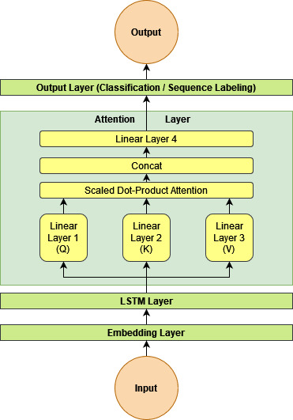
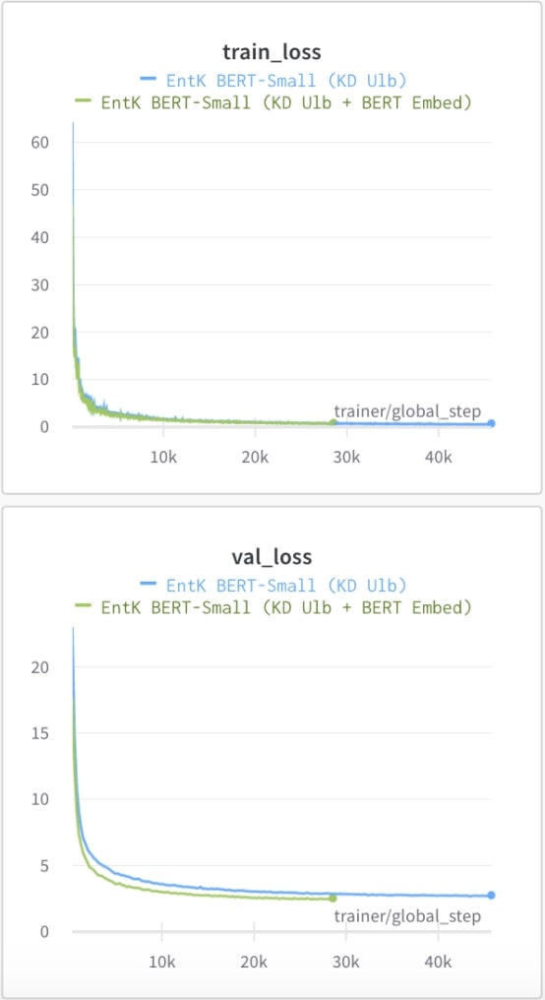

[orcid=0000-0002-5570-4676]

[orcid=0000-0001-7457-2165]

[orcid=0000-0002-7917-6556]

[orcid=0000-0002-5148-7299]

[orcid=0000-0001-7665-0673]

# Which Student is Best? A Comprehensive Knowledge Distillation Exam for Task-Specific BERT Models

Made Nindyatama Nityasya  made@kata.ai  Haryo Akbarianto Wibowo  haryo@kata.ai  Rendi Chevi  rendi.chevi@kata.ai  Radityo Eko Prasojo  ridho@kata.ai  Alham Fikri Aji  aji@kata.ai  organization=Kata.ai Research Team, city=Jakarta, country=Indonesia  organization=University of Indonesia, city=Depok, country=Indonesia 

###### Abstract

We perform knowledge distillation (KD) benchmark from task-specific BERT-base teacher models to various student models: BiLSTM, CNN, BERT-Tiny, BERT-Mini, and BERT-Small. Our experiment involves 12 datasets grouped in two tasks: text classification and sequence labeling in the Indonesian language. We also compare various aspects of distillations including the usage of word embeddings and unlabeled data augmentation. Our experiments show that, despite the rising popularity of Transformer-based models, using BiLSTM and CNN student models provide the best trade-off between performance and computational resource (CPU, RAM, and storage) compared to pruned BERT models. We further propose some quick wins on performing KD to produce small NLP models via efficient KD training mechanisms involving simple choices of loss functions, word embeddings, and unlabeled data preparation.

###### keywords

Knowledge Distillation ,Text Classification ,Sequence Labeling ,BERT ,Indonesian 

## 1 Introduction

In recent years, Deep Learning (DL) models have been widely utilized to solve Natural Language Processing (NLP) problems like text classification, sequence labeling, and machine translation. Given a large amount of labeled data, DL can train a highly-generalizable model thanks to its internal complexity and depth.

In NLP, the data (or lack thereof) itself is an infamous problem, especially in low-resource languages. The current common solution to this problem is by (1) pretraining – to perform a large-scale representation learning of textual data, leveraging the abundance of unlabeled text data from the Internet, and then (2) fine-tuning – to carry the parameters learned from the representation learning step and continuing training with the real labeled data on the specific problem we want to solve. The general, intermediate model as a result of the pretraining step is usually called a language model (LM). Pretraining an LM typically requires significantly more data and computational resources than fine-tuning it, and therefore takes longer. However, an LM can be fine-tuned into several models serving different purposes, therefore potentially reducing the overall training time and cost.

Due to this benefit, several studies have focused on improving the pretraining step. To this end, there is a trend of rising size and complexity of the resulted language models, starting from distributed representation learning of words like word2vec ([Mikolov et al. 2013](https://arxiv.org/html/2201.00558#bib.bib30)) and GloVe ([Pennington et al. 2014](https://arxiv.org/html/2201.00558#bib.bib33)), subword information enrichment ([Bojanowski et al. 2017](https://arxiv.org/html/2201.00558#bib.bib3)), contextual representation using Recurrent Neural Networks (RNNs) ([Peters et al. 2018](https://arxiv.org/html/2201.00558#bib.bib34)), and finally the Transformer-based models ([Vaswani et al. 2017](https://arxiv.org/html/2201.00558#bib.bib49)) that ranges from hundreds of millions to billions of trainable parameters.

Transformer ([Vaswani et al. 2017](https://arxiv.org/html/2201.00558#bib.bib49)), like RNN, uses an encoder-decoder architecture and therefore is originally designed for sequence-to-sequence learning like machine translation. However, previous work discovered several ways to utilize Transformer to train language models, such as (1) autoregressive models trained using only the decoder blocks of Transformer, like GPT ([Radford et al. a](https://arxiv.org/html/2201.00558#bib.bib37)), GPT-2 ([Radford et al. b](https://arxiv.org/html/2201.00558#bib.bib38)), and GPT-3 ([Brown et al. 2020](https://arxiv.org/html/2201.00558#bib.bib4)), (2) masked-language models using only the encoder blocks, like BERT ([Devlin et al. 2019](https://arxiv.org/html/2201.00558#bib.bib9)) and its variants such as RoBERTa ([Liu et al. 2019](https://arxiv.org/html/2201.00558#bib.bib29)) and ELECTRA ([Duan et al. 2020](https://arxiv.org/html/2201.00558#bib.bib11)), and (3) a combination of both, like BART ([Lewis et al. 2020](https://arxiv.org/html/2201.00558#bib.bib27)) and T5 ([Raffel et al. 2019](https://arxiv.org/html/2201.00558#bib.bib39)). There is a similar trend that further fosters the notion of “bigger is better” in Transformer-based LMs. Evidently, common benchmark such as GLUE ([Wang et al. 2018](https://arxiv.org/html/2201.00558#bib.bib51)) shows that the larger version of a model (e.g. BERT-large; GPT-3) outperforms the smaller ones (e.g. BERT-base and BERT-small; GPT-2 and GPT) almost universally in terms of several performance metrics such as Precision, Recall, and F1-score on various NLP tasks.

Naturally, training and running larger models bear additional costs in terms of computational power. The costs mainly concern the Graphical Processing Unit (GPU), Tensor Processing Unit (TPU), or Central Processing Unit (CPU) used for training and inference, as well as the model size in terms of parameter size or memory requirement. Unfortunately, these costs are often not discussed in various model benchmarks, leaving the cost-performance trade-off unclear ([Nityasya et al. 2021](https://arxiv.org/html/2201.00558#bib.bib31)).

Typically, modern DL models require GPUs or TPUs to train, while using CPUs is generally considered infeasible, especially for large models with many fully connected (FC) layers ([Wang et al. 2019](https://arxiv.org/html/2201.00558#bib.bib52)) like Transformer. On the other hand, running the model for inference on CPU is feasible to some extent, that is, until scalability becomes a problem. An NLP model can be deployed within applications such as chatbots or search engines serving a large user base. In this case, using small classical machine learning (ML) models makes more sense than using big Transformer-based models ([Nityasya et al. 2021](https://arxiv.org/html/2201.00558#bib.bib31)) due to the scalability issue, while sacrificing accuracy. Still, depending on the difficulty of the NLP task, a classical ML model might not be powerful enough to produce consistently good results compared to a Transformer-based model. Besides scalability, another issue might arise when we want to deploy a large Transformer-based model on low-powered devices such as smartphones ([Sun et al. 2020](https://arxiv.org/html/2201.00558#bib.bib45)) or other embedded devices, where storage and CPU resource is at a minimum.

In this work, our general theme is finding a middle ground: can we build a small model close to the size of a typical classical ML model but with a great performance close to a typical Transformer-based model? More specifically, we focus on Knowledge Distillation (KD) approach ([Ganesh et al. 2021](https://arxiv.org/html/2201.00558#bib.bib13); [Kim and Rush 2016](https://arxiv.org/html/2201.00558#bib.bib24); [Tang et al. 2019](https://arxiv.org/html/2201.00558#bib.bib46); [Sanh et al. 2019](https://arxiv.org/html/2201.00558#bib.bib43); [Raffel et al. 2019](https://arxiv.org/html/2201.00558#bib.bib39); [Jiao et al. 2020](https://arxiv.org/html/2201.00558#bib.bib21); [Sun et al. 2020](https://arxiv.org/html/2201.00558#bib.bib45); [Chen et al. 2020](https://arxiv.org/html/2201.00558#bib.bib5); [He et al. 2021](https://arxiv.org/html/2201.00558#bib.bib15)) leveraging student-teacher models, that is to train smaller models (student) from a large model (teacher), resulting in students with similar performance to the teacher. Our contribution is as follows:

  * •

We perform KD from BERT-based teacher models fine-tuned on various tasks into several student models based on RNNs, Convolutional Neural Networks (CNNs), and Transformers. In the spirit of efficiency and reproducibility, we distill fine-tuned models instead of pretrained models because the former is much less resource-intensive.

  * •

We perform ablation studies on each student model by employing embedding weight transfer, leveraging data augmentation, and converting the final model into an optimized ONNX11 1 https://github.com/onnx/onnx version for the final inference test.

  * •

We compare the performance of the student models in terms of performance, running time, and memory/storage footprint. To the best of our knowledge, our work is the first to provide a comprehensive practical distillation benchmark of various student models in various tasks.

  * •

Our benchmark is done for various text classification and sequence labeling tasks in the Indonesian language. To the best of our knowledge, we are the first to develop and benchmark various distilled models in Indonesian. We argue that our approach can be generalized into any other language, provided that a teacher model and some labeled data for benchmarking exist in that language. We leave the benchmark for the sequence-to-sequence tasks as future work.

Based on our experiment, we found that the best distilled BiLSTM model has the size of only 3% of the original BERT and run 22x times faster in CPU machine with only 3-4 point of performance difference in F1-score. A better performed distilled BERT-Mini model has the size of 9% the BERT model and runs 10x faster. Converting the BiLSTM model to an ONNX further boosts the inference time into 100x faster than the BERT model, while having 2.5% of the size. At the end, we also perform several additional experiments to discuss some aspects affecting the distillation performance, and then propose some suggestions to improve the overall KD results involving domain, data balancing, and the length of unlabeled data augmentation, as well as hyperparameter tuning.

## 2 Related Work

The computational cost of running deeper neural models motivates the quest towards building smaller models at a low cost. One relevant topic, model compression, focuses on making smaller and faster models for inference while keeping performance loss at minimum. There are several ways to do the model compression, such as pruning, quantization ([Wu et al. 2018](https://arxiv.org/html/2201.00558#bib.bib54)), and knowledge distillation (KD).

KD was first introduced by [Hinton et al. 2015](https://arxiv.org/html/2201.00558#bib.bib17) to combat the need for multiple ensemble models and was shown to perform with great results on MNIST dataset. In NLP, KD had been used to compress large models for machine translation ([Kim and Rush 2016](https://arxiv.org/html/2201.00558#bib.bib24)), classification ([Tang et al. 2019](https://arxiv.org/html/2201.00558#bib.bib46)), and sequence labeling ([Tsai et al. 2019](https://arxiv.org/html/2201.00558#bib.bib47)). Following the trend of pretrained LMs, KD has also been performed to make smaller general-purpose language models like DistilBERT ([Sanh et al. 2019](https://arxiv.org/html/2201.00558#bib.bib43)) and MobileBERT ([Sun et al. 2020](https://arxiv.org/html/2201.00558#bib.bib45)). These pre-trained models can be fine-tuned for a specific task, just like how a regular pre-trained model can.

KD can also be performed on fine-tuned models, which is widely known as task-specific distilation ([Tang et al. 2019](https://arxiv.org/html/2201.00558#bib.bib46); [Adhikari et al. 2020](https://arxiv.org/html/2201.00558#bib.bib1); [Turc et al. 2019](https://arxiv.org/html/2201.00558#bib.bib48); [Hagström and Johansson 2021](https://arxiv.org/html/2201.00558#bib.bib14)). We first train a teacher model by fine-tuning a pre-existing language model over a task-specific dataset, then train the students from the teacher’s output. Distilling fine-tuned models this way is less computationally demanding compared to distilling general-purpose language models. Despite both having a smaller model size, the latter still requires lots of training data due to the nature of pretraining. In contrast, distilling fine-tuned models require much smaller training data. Therefore, in this work, we mainly focus on task-specific distillation.

Table 1: Comparison between our work and previous task-specific KD studies in NLP

Work | Student models | Tasks | Language | #Datasets  
---|---|---|---|---  
[Adhikari et al. 2020](https://arxiv.org/html/2201.00558#bib.bib1) | CNNs, LSTMs | Classification | English | 4  
[Tang et al. 2019](https://arxiv.org/html/2201.00558#bib.bib46) | LSTMs | Classification | English | 4  
[Turc et al. 2019](https://arxiv.org/html/2201.00558#bib.bib48) | Pruned Transformers | Classification | English | 6  
[Hagström and Johansson 2021](https://arxiv.org/html/2201.00558#bib.bib14) | CNNs, LSTMs | Sequence Labeling | Swedish | 1  
Ours | CNNs, LSTMs, pruned Transformers | Classification, Sequence Labeling | Indonesian | 12  
  
The work by [Adhikari et al. 2020](https://arxiv.org/html/2201.00558#bib.bib1) (See Table [1](https://arxiv.org/html/2201.00558#S2.T1 "Table 1 ‣ 2 Related Work ‣ Which Student is Best? A Comprehensive Knowledge Distillation Exam for Task-Specific BERT Models")) is the most similar to ours, although we extend the distillation benchmark to include also small Transformers on top of LSTMs and CNNs for the student models. Moreover, we also perform experiments on some sequence labeling tasks on top of the classification tasks. [Tang et al. 2019](https://arxiv.org/html/2201.00558#bib.bib46) and [Hagström and Johansson 2021](https://arxiv.org/html/2201.00558#bib.bib14) performed similar distillation benchmark, but focused on a smaller scope. [Turc et al. 2019](https://arxiv.org/html/2201.00558#bib.bib48) focused on pruned Transformer models, specifically on smaller-sized BERTs. They recommend the student models to be pretrained before the distillation process, as this boosts the final results. However, because it is computationally demanding, we forgo student pretraining in this work.

Recently, [Jiao et al. 2020](https://arxiv.org/html/2201.00558#bib.bib21) developed TinyBERT, which uses a two-staged learning framework where they performed distillation on both the pre-training and fine-tuning stages. As the two stages are orthogonal, it is possible to leverage its fine-tuning steps for task-specific distillation. However, we leave exploration in this direction for future work.

## 3 Methodology

### 3.1 Knowledge Distillation

Knowledge Distillation (KD) is a technique to transfer the knowledge from a cumbersome models to a new simpler model [Hinton et al. 2015](https://arxiv.org/html/2201.00558#bib.bib17). The cumbersome model, also known as teacher model, usually has a lost of parameter or is an ensemble of models which is difficult to deploy on device with a limited computing power. Meanwhile, the new simpler model, called the student model, usually has fewer parameters, hence more suitable for deployment. The goal of KD is to extract information from the teacher model to the student model while removing the unneeded information. The student try to mimic the teacher’s behaviour by producing similar outputs, thus gaining a performance similar to the teacher. The student model is trained to minimize the KD loss, that is, the difference between the teacher’s output and student’s output.

There are two common ways to compute KD loss: hard target and soft target. For hard target, we use the output labels from the teacher as the ground truth for the student model to compare its own output labels with. In soft target, we compare the error between the output logits or the probability distribution from the softmax output between the student and the teacher. Table [2](https://arxiv.org/html/2201.00558#S3.T2 "Table 2 ‣ 3.1 Knowledge Distillation ‣ 3 Methodology ‣ Which Student is Best? A Comprehensive Knowledge Distillation Exam for Task-Specific BERT Models") shows some examples between hard target and soft target.

Table 2: Difference between using hard target and soft target, using sentiment analysis task as example. Hard target are labels, while soft target are their probability distribution given by the teacher model. Input | hard target | soft target  
---|---|---  
I can see the sunset | neutral | [0.3 0.5 0.2]  
The room feels fresh | positive | [0.7 0.2 0.1]  
The food is very spicy | negative | [0.3 0.3 0.4]  
  
While previous KD studies have compared the use of soft target, hard target, and their combinations [Yang et al. 2021](https://arxiv.org/html/2201.00558#bib.bib57), more recent work ([Kim et al. 2021](https://arxiv.org/html/2201.00558#bib.bib22)) has also compared two different soft target losses: Mean Squared Error (MSE) and Kullback-Leibler Divergence (KLD). MSE is used to calculate the loss between the logits. It averages the square difference (error) between the teacher logits and student logits (Equation [1](https://arxiv.org/html/2201.00558#S3.E1 "In 3.1 Knowledge Distillation ‣ 3 Methodology ‣ Which Student is Best? A Comprehensive Knowledge Distillation Exam for Task-Specific BERT Models")). Meanwhile, KLD is used to calculate the loss between two probability distributions. Specifically, KLD measures relative entropy between the two distributions as the average difference of their log probabilities (Equation [2](https://arxiv.org/html/2201.00558#S3.E2 "In 3.1 Knowledge Distillation ‣ 3 Methodology ‣ Which Student is Best? A Comprehensive Knowledge Distillation Exam for Task-Specific BERT Models")). [Kim et al. 2021](https://arxiv.org/html/2201.00558#bib.bib22) results suggest that MSE is superior, though prior to that, KLD is more generally used.

| \[\text{MSE}=\displaystyle\frac{1}{n}\sum_{t=1}^{n}(x_{i}-y_{i})^{2}\] |  | (1)  
---|---|---|---  
| \[\text{KLD}=\displaystyle\frac{1}{n}\sum_{t=1}^{n}y_{i}.(\log(y_{i}-x_{i}))\] |  | (2)  
---|---|---|---  
  
In the original implementation oF KD leveraging soft target ([Hinton et al. 2015](https://arxiv.org/html/2201.00558#bib.bib17)), a hyperparameter called temperature \(T\) is used to divide the output logits \(z_{i}\) before passing it to the softmax function. This is done to make a softer probability distribution output \(q_{i}\) while retaining the relativeness22 2 that is, the sum of the distribution remains equal to 1 of the output ([Hinton et al. 2015](https://arxiv.org/html/2201.00558#bib.bib17)).

| \[q_{i}=\displaystyle\frac{\exp(z_{i}/T)}{\sum_{j}\exp(z_{j}/T)}\] |  | (3)  
---|---|---|---  
  
In a separate study, [Jiao et al. 2020](https://arxiv.org/html/2201.00558#bib.bib21) found that KD in NLP tasks yield the best results when the temperature value is set to 1 (tested on GLUE [Wang et al. 2018](https://arxiv.org/html/2201.00558#bib.bib51) datasets), which we follow throughout our experiment.

Beside soft target vs hard target, recent studies have explored various other losses, e.g. incorporating student loss using labeled data and comparing logits from layers before the output layer ([Yang et al. 2021](https://arxiv.org/html/2201.00558#bib.bib57)). We leave exploration in this direction as future work.

### 3.2 Model

We use fine-tuned BERT-base models as our teacher model. For the student, we used several smaller neural models such as Bi-LSTM, CNN, and some pruned BERT architecture.

#### 3.2.1 BERT

BERT ([Devlin et al. 2019](https://arxiv.org/html/2201.00558#bib.bib9)) is a Transformer-based model ([Vaswani et al. 2017](https://arxiv.org/html/2201.00558#bib.bib49)) that has since spawned several variations that often would top the chart of NLP benchmarks such as GLUE ([Wang et al. 2018](https://arxiv.org/html/2201.00558#bib.bib51)). BERT owes its great performance from its size and complexity, where it is able to accurately model a large amount of text data within its millions of parameters. As such, a BERT-based model is a suitable candidate for a teacher model due to its performance and sheer size.

In this work, we use fine-tuned BERT-based models as the teacher models. To obtain these teacher models, we fine-tune IndoBERT,33 3 <https://huggingface.co/indobenchmark/indobert-base-p1> an Indonesian pretrained language model from IndoNLU ([Wilie et al. 2020](https://arxiv.org/html/2201.00558#bib.bib53)), to several task-specific models using some labelled data. IndoBERT itself was trained on a large corpus of Indonesian language, containing around 240M sentences, and was shown to have a great performance when tested on IndoNLU’s benchmark ([Wilie et al. 2020](https://arxiv.org/html/2201.00558#bib.bib53)).

#### 3.2.2 LSTM

Long Short Term Memory (LSTM) is a variant of Recurrent Neural Network (RNN), which is widely used for sequence modeling such as in time-series analysis and NLP. Compared to vanilla RNN, LSTM has an additional feature called gating mechanism to filter the information to be passed to the next step, yielding better performance. Prior to Transformer, LSTM-based RNN models are often considered as the state-of-the-art neural models for solving NLP problems ([Huang et al. 2015](https://arxiv.org/html/2201.00558#bib.bib20); [Chen et al. 2017](https://arxiv.org/html/2201.00558#bib.bib6)). Coupled with its relatively-smaller size compared to Transformer-based models such as BERT, we consider LSTM as a great option for a student model.

Our LSTM student model consists of Bi-directional LSTM (Bi-LSTM), where the architecture will consider the left-to-right direction sequence of input and the opposite one. We add an attention mechanism to the model so that the model does not consider all tokens to be equal in value, i.e. it pays ‘more attention’ to the more important tokens by learning different weights over the tokens in the sequence. In this work, we use the self-attention mechanism from Transformer itself ([Vaswani et al. 2017](https://arxiv.org/html/2201.00558#bib.bib49)), which is one of the attention mechanism often used in sequential deep learning model. We plug it on top of the Bi-LSTM layers. Refer to Figure [1](https://arxiv.org/html/2201.00558#S3.F1 "Figure 1 ‣ 3.2.2 LSTM ‣ 3.2 Model ‣ 3 Methodology ‣ Which Student is Best? A Comprehensive Knowledge Distillation Exam for Task-Specific BERT Models") to see more details about the implementation.

To get the model’s logits, we put a linear layer to map the output of the LSTM model to its respective’s output. For the classification task, we follow BERT’s ([Devlin et al. 2019](https://arxiv.org/html/2201.00558#bib.bib9)) implementation to take the vector of the first sequence of the output, that represents the start of token, as the input of the linear layer. In the Token Labeling task, we use all of the sequence vector as the input of the linear layer.

Figure 1: Our LSTM implementation with self-attention. The implementation of the attention layer is based on [Vaswani et al. 2017](https://arxiv.org/html/2201.00558#bib.bib49).

#### 3.2.3 CNN

CNN is widely used in image processing. However, by changing the 2D convolution into 1D, it could be applied also for text data. CNN has been shown to have good results in text classification ([Kim 2014](https://arxiv.org/html/2201.00558#bib.bib23)).

Our CNN student model is composed of a backbone with stacks of residual convolutional network and classifier head for each task. The backbone starts with a word embedding layer, we apply absolute positional encoding ([Vaswani et al. 2017](https://arxiv.org/html/2201.00558#bib.bib49)) to inject positional information to the input texts. Then, we feed the embedding vectors into N-stacks convolution layers with residual connection ([He et al. 2016](https://arxiv.org/html/2201.00558#bib.bib16)). We use depth-wise separable convolution ([Chollet 2017](https://arxiv.org/html/2201.00558#bib.bib7)) to keep the student’s size relatively small and layer normalization as the activation function.

For the sequence labeling task, we directly feed the backbone’s output into a linear layer. For the classification task, we apply global average pooling ([Lin et al. 2013](https://arxiv.org/html/2201.00558#bib.bib28)) to the backbone’s output followed by a linear layer to obtain the output logits.

#### 3.2.4 Pruned Transformers: BERT-Tiny, Bert-Mini, and BERT-Small

As we still want to leverage the powerful architecture of a Transformer-based model, we tried to use some of the proposed smaller size BERTs by [Turc et al. 2019](https://arxiv.org/html/2201.00558#bib.bib48): BERT-Tiny, BERT-Mini, and BERT-Small, each having different sizes of attention heads, transformer layers, and embedding sizes, hence different total numbers of parameters as well (Table [3](https://arxiv.org/html/2201.00558#S3.T3 "Table 3 ‣ 3.2.4 Pruned Transformers: BERT-Tiny, Bert-Mini, and BERT-Small ‣ 3.2 Model ‣ 3 Methodology ‣ Which Student is Best? A Comprehensive Knowledge Distillation Exam for Task-Specific BERT Models")). We note again, as we did in Section [2](https://arxiv.org/html/2201.00558#S2 "2 Related Work ‣ Which Student is Best? A Comprehensive Knowledge Distillation Exam for Task-Specific BERT Models"), that we leverage these small BERT models for KD without first pretraining them to focus on more efficient KD approaches.

Table 3: Differences between BERT-base, BERT-small, BERT-Mini, and BERT-Tiny in terms of their attention heads, transformer layers, embedding sizes, and numbers of parameters. BERT model | #Attn | #TLayer | #Embed | #Param  
---|---|---|---|---  
BERT-base | 12 | 12 | 768 | 110.1M  
BERT-small | 8 | 4 | 512 | 29.1M  
BERT-mini | 4 | 4 | 256 | 11.3M  
BERT-tiny | 2 | 2 | 128 | 4.4M  
  
### 3.3 Unlabelled data augmentation

Adding more data during KD training can improve the overall performance ([Papernot et al. 2016](https://arxiv.org/html/2201.00558#bib.bib32); [Vongkulbhisal et al. 2019](https://arxiv.org/html/2201.00558#bib.bib50)). The data does not need to be labelled because we leverage the teacher’s model output instead. In this work, we will explore the effect of unlabeled data augmentation for each of the student models.

### 3.4 Word Embeddings

Pretrained word embeddings enable feature extraction to initialize the weights of the embedding layer of an NLP model. This has been empirically proven to boost model performance in several NLP tasks ([Sachan et al. 2019](https://arxiv.org/html/2201.00558#bib.bib42); [Qi et al. 2018](https://arxiv.org/html/2201.00558#bib.bib36); [Howard and Ruder 2018](https://arxiv.org/html/2201.00558#bib.bib19); [Dai and Le 2015](https://arxiv.org/html/2201.00558#bib.bib8)) and to help the model converges faster. Using word embeddings also serves as a cheaper alternative to student pretraining prior to KD, a recommended step ([Turc et al. 2019](https://arxiv.org/html/2201.00558#bib.bib48)) we skip in this work due to computational cost consideration.

In general, there are two types of word embeddings: non-contextual and contextual. In contextual embedding, a word can have several embeddings depending on the context (that is, the other words around it), whereas it can only have one in non-contextual embedding. Among the earliest non-contextual embeddings are word2vec ([Mikolov et al. 2013](https://arxiv.org/html/2201.00558#bib.bib30)) and GloVe ([Pennington et al. 2014](https://arxiv.org/html/2201.00558#bib.bib33)), while fasttext ([Bojanowski et al. 2017](https://arxiv.org/html/2201.00558#bib.bib3)) is a later improvement which utilizes subword embeddings to handle out-of-vocabulary. Meanwhile, contextual embeddings are typically obtained from the embedding layer44 4 though to fully obtain the contextuality BERT, embeddings can also be obtained from the middle or output layers ([Rogers et al. 2020](https://arxiv.org/html/2201.00558#bib.bib41)); we leave exploration in this direction as future work. of RNN-based or Transformer-based pretrained language models, such as ELMO ([Peters et al. 2018](https://arxiv.org/html/2201.00558#bib.bib34)) and BERT ([Devlin et al. 2019](https://arxiv.org/html/2201.00558#bib.bib9)). In this work, we explore the effect of leveraging contextual vs non-contextual word embeddings for KD.

## 4 Experiment

In this section, we first discuss the datasets that we use for experiment. Then, we describe the general experiment setup, the models that we train for the experiments, and the metrics that we use.

### 4.1 Dataset

We use six datasets for each task. The description of each dataset can be seen below in Sections [4.1.1](https://arxiv.org/html/2201.00558#S4.SS1.SSS1 "4.1.1 Text Classification Tasks ‣ 4.1 Dataset ‣ 4 Experiment ‣ Which Student is Best? A Comprehensive Knowledge Distillation Exam for Task-Specific BERT Models") and [4.1.2](https://arxiv.org/html/2201.00558#S4.SS1.SSS2 "4.1.2 Sequence Labeling Tasks ‣ 4.1 Dataset ‣ 4 Experiment ‣ Which Student is Best? A Comprehensive Knowledge Distillation Exam for Task-Specific BERT Models"), while the statistics can be seen in Table [4](https://arxiv.org/html/2201.00558#S4.T4 "Table 4 ‣ 4.1 Dataset ‣ 4 Experiment ‣ Which Student is Best? A Comprehensive Knowledge Distillation Exam for Task-Specific BERT Models"). For EmoT, NERGrit, NERP, and POSP dataset, we use the same split as [Wilie et al. 2020](https://arxiv.org/html/2201.00558#bib.bib53)’s ([Wilie et al. 2020](https://arxiv.org/html/2201.00558#bib.bib53)), while we perform our own split for the other datasets.

Table 4: Data statistic. Number of train, dev, and test data. For sequence labeling, number of classes was count without BIO. Dataset | Train | Dev | Test | #class  
---|---|---|---|---  
Text Classification Task  
Smltk | 1134 | 1280 | 1272 | 96  
Health | 57938 | 6894 | 6897 | 5  
Telco | 11520 | 1440 | 1440 | 144  
Sentiment | 3638 | 399 | 1011 | 2  
SMSA | 11000 | 1260 | 500 | 3  
EmoT | 3521 | 440 | 442 | 5  
Sequence Labeling Task  
EntK | 10955 | 1250 | 1372 | 14  
TermA | 3000 | 1000 | 1000 | 3  
POS | 7222 | 802 | 2006 | 23  
NERGrit | 1672 | 209 | 209 | 4  
NERP | 6720 | 840 | 840 | 5  
POSP | 6720 | 840 | 840 | 26  
  
#### 4.1.1 Text Classification Tasks

Smltk – A dataset containing intent classification for small talk conversations with chatbots in Indonesian. The language used is informal and the data is imbalanced. Example of classes: askJokes, askTime, greetings, askWeather, etc.

Health – A text classification dataset for an online medical consultant. It contains conversation between doctor and patient which grouped into complaint, patient’s actions, diagnosis, recommendation, and fallback.

Telco – A semi-formal classification dataset for questions and tasks that can be answered automatically by a telecommunication’s bot. Example of the classes: ask promo, error network, postpaid registration, 4G activation, etc.

SentA – A binary classification sentiment analysis dataset that contains text from Twitter and hotel review, obtained from IndoLEM ([Koto et al. 2020](https://arxiv.org/html/2201.00558#bib.bib25)).

SMSA55 5 <https://huggingface.co/datasets/indonlu> – A sentiment analysis dataset that that is grouped into three classes: positive, negative, and neutral. It contains comments and reviews from various Indonesian online platforms ([Purwarianti and Crisdayanti 2019](https://arxiv.org/html/2201.00558#bib.bib35)).

EmoT55footnotemark:  5 – A Twitter emotion classification dataset that was grouped into 5 classes: anger, fear, happiness, love, and sadness ([Saputri et al. 2018](https://arxiv.org/html/2201.00558#bib.bib44)).

#### 4.1.2 Sequence Labeling Tasks

EntK – A manually gathered and annotated NER dataset that contains fourteen different labels: person, location, email, number, phone,ur date-time, currency, and 5 different units.

TermA66 6 <https://github.com/jordhy97/final_project> – An aspect and opinion term extraction dataset from a hotel aggregator platform, AiryRooms, that contains sentiment for each aspect ([Fernando et al. 2019](https://arxiv.org/html/2201.00558#bib.bib12)).

POS77 7 <https://github.com/kmkurn/id-pos-tagging> – POS Tagging dataset that was collected from PAN Localization Project ([Dinakaramani et al. 2014](https://arxiv.org/html/2201.00558#bib.bib10)). We follow the data split provided by by [Kurniawan and Aji 2018](https://arxiv.org/html/2201.00558#bib.bib26).

NERGrit55footnotemark:  5 \-- A NER dataset from Grit-ID repository.88 8 <https://github.com/grit-id/nergrit-corpus> The tags are person, location, organization in IOB format.99 9 A common tagging format that indicate a chunk of text, using prefix B- as Begin and I- as Inside ([Ramshaw and Marcus 1995](https://arxiv.org/html/2201.00558#bib.bib40))

NERP55footnotemark:  5 A NER dataset containing articles from several Indonesia news website ([Hoesen and Purwarianti 2018](https://arxiv.org/html/2201.00558#bib.bib18)). The tags are PER (person), LOC (location), IND (product or brand), EVT (event), FNB (food and beverages) in its IOB format.

POSP55footnotemark:  5 A POS Tagging dataset with the same data as NERP. It contains 26 POS tag classes that follows Indonesian Association of Computational Linguistics (INACL).1010 10 <http://inacl.id/inacl/wp-content/uploads/2017/06/INACL-POS-Tagging-Convention-26-Mei.pdf>

### 4.2 Models to Train

In each task, we fine-tune a BERT-base model as the general baseline. Then, in a hill-climbing setting, we train several other models:

  1. 1.

Vanilla – vanilla student models, that is, “student” models trained without involving KD, using only the labeled data.

  2. 2.

KD – student models trained with KD using the BERT-base model as a techer. We use MSE loss over KLD following [Kim et al. 2021](https://arxiv.org/html/2201.00558#bib.bib22).

  3. 3.

KD Ulb – KD models that are improved by using unlabeled data.

  4. 4.

KD Ulb + Word Embeddings – KD models with unlabeled data that are trained leveraging pre-trained word embeddings. We compare two embeddings: a non-contextual one, FastText, and a contextual one, BERT.

Our objective is to observe whether the use of KD, the use of unlabeled data during KD, and the use of pretrained embedding (contextual vs non-contextual) affect the performance of our models. Later on, we transform the best performing models into an optimized ONNX version for inference tests on CPU. We compare the above models using several metrics to find the trade-offs between their performance and computational cost.

### 4.3 Metrics

We use macro F1 Score to measure the performance for both text classification and sequence labeling task. To calculate the cost of inference, we kept track of the model size and inference time. For the model size, we compare the number of each model’s parameters. For inference time, we compute the average time needed to run a single sentence inference over multiple iterations with various sentence length.

### 4.4 Experiment Setup

All experiments was trained on a single GPU RTX 3090. We set a very high number for number of training epoch but applied an early stopping mechanism with the patience of 10 based on validation loss. For learning rate, we choose the best from [5e-3, 1e-3, 5e-4, 1e-4, 5e-5, 1e-5]. For CPU inference tests, we use a machine with a 6-core Intel i5 CPU and 24 GB of RAM.

## 5 Results

Across the board, the BERT-base teacher model outperforms the other models, which we discuss thoroughly below. We first focus on the models’ performance in terms of F1 score (see Table [5](https://arxiv.org/html/2201.00558#S5.T5 "Table 5 ‣ 5.1 Model’s Performance ‣ 5 Results ‣ Which Student is Best? A Comprehensive Knowledge Distillation Exam for Task-Specific BERT Models") and Table [6](https://arxiv.org/html/2201.00558#S5.T6 "Table 6 ‣ 5.1 Model’s Performance ‣ 5 Results ‣ Which Student is Best? A Comprehensive Knowledge Distillation Exam for Task-Specific BERT Models") for the complete results of classification and sequence labeling tasks, respectively). Then, we discuss the models’ cost analysis in terms of their size and inference time (Table [7](https://arxiv.org/html/2201.00558#S5.T7 "Table 7 ‣ 5.2 Cost Analysis ‣ 5 Results ‣ Which Student is Best? A Comprehensive Knowledge Distillation Exam for Task-Specific BERT Models") and Table [8](https://arxiv.org/html/2201.00558#S5.T8 "Table 8 ‣ 5.2.3 Using ONNX ‣ 5.2 Cost Analysis ‣ 5 Results ‣ Which Student is Best? A Comprehensive Knowledge Distillation Exam for Task-Specific BERT Models")).

### 5.1 Model’s Performance

In this section, we discuss the model’s performance on each experiment setting. We start from the baseline experiment then continue with the KD experiment and several additional experiments to further improve the KD’s performance.

Table 5: Classification KD Models | Smltk | Health | Telco | SentA | EmoT | SMSA | avg  
---|---|---|---|---|---|---|---  
BERT | 96.83 | 80.01 | 94.96 | 90.01 | 72.30 | 91.49 | 87.60  
Bi-LSTM | 86.78 | 72.22 | 88.16 | 76.35 | 55.96 | 83.84 | 77.22  
KD | 92.96 | 74.25 | 91.41 | 82.28 | 66.72 | 88.67 | 82.72  
KD Ulb | 92.74 | 77.61 | 92.71 | 85.17 | 68.33 | 88.81 | 84.23  
KD Ulb + FastText | 93.03 | 77.97 | 92.57 | 85.80 | 69.40 | 88.34 | 84.52  
KD Ulb + BERT Embed | 92.79 | 78.78 | 92.15 | 86.28 | 69.54 | 88.77 | 84.72  
CNN | 88.24 | 71.97 | 88.22 | 77.95 | 57.57 | 84.12 | 78.01  
KD | 92.43 | 69.85 | 90.95 | 80.33 | 63.90 | 87.26 | 80.79  
KD Ulb | 84.50 | 74.32 | 84.05 | 82.46 | 63.92 | 87.75 | 79.50  
KD Ulb + FastText | 81.23 | 73.27 | 86.40 | 84.65 | 65.97 | 88.44 | 79.99  
KD Ulb + BERT Embed | 85.35 | 74.20 | 86.72 | 84.01 | 64.48 | 87.40 | 80.36  
BERT-Tiny | 89.89 | 69.46 | 86.31 | 77.36 | 60.42 | 79.88 | 77.22  
KD | 91.87 | 76.27 | 90.05 | 81.56 | 67.10 | 83.79 | 81.77  
KD Ulb | 94.02 | 77.74 | 92.17 | 83.06 | 66.21 | 86.39 | 83.26  
KD Ulb + FastText | 94.48 | 78.32 | 92.40 | 82.52 | 66.97 | 86.90 | 83.60  
KD Ulb + BERT Embed | 95.31 | 77.02 | 92.69 | 83.17 | 66.90 | 86.28 | 83.56  
BERT-Mini | 91.62 | 68.88 | 89.70 | 80.47 | 60.27 | 81.93 | 78.81  
KD | 94.40 | 77.95 | 92.96 | 81.78 | 68.26 | 86.81 | 83.69  
KD Ulb | 95.10 | 77.87 | 93.43 | 83.57 | 69.62 | 85.02 | 84.10  
KD Ulb + FastText | 96.37 | 77.93 | 93.72 | 83.95 | 68.87 | 86.10 | 84.49  
KD Ulb + BERT Embed | 95.73 | 77.95 | 94.22 | 81.95 | 69.75 | 87.99 | 84.60  
BERT-Small | 92.92 | 73.81 | 91.35 | 80.20 | 62.65 | 83.77 | 80.78  
KD | 94.74 | 78.82 | 92.69 | 80.78 | 69.01 | 87.21 | 83.88  
KD Ulb | 96.51 | 78.73 | 94.18 | 83.90 | 69.60 | 87.51 | 85.07  
KD Ulb + FastText | 96.38 | 77.94 | 94.25 | 82.43 | 69.83 | 87.85 | 84.78  
KD Ulb + BERT Embed | 96.30 | 77.95 | 94.54 | 85.16 | 70.53 | 88.32 | 85.47  
Table 6: Sequence Labelling KD Models | EntK | TermA | POS | NERGrit | NERP | POSP | avg  
---|---|---|---|---|---|---|---  
BERT | 90.86 | 90.38 | 95.66 | 75.78 | 78.35 | 95.81 | 87.81  
BiLSTM | 79.21 | 84.38 | 91.12 | 44.00 | 58.56 | 93.59 | 75.14  
KD | 85.99 | 88.08 | 93.56 | 56.80 | 69.10 | 95.05 | 81.43  
KD Ulb | 86.24 | 87.82 | 94.11 | 62.90 | 70.38 | 95.57 | 82.84  
KD Ulb + FastText | 86.50 | 88.15 | 94.29 | 66.52 | 72.27 | 95.70 | 83.91  
KD Ulb + BERT Embed | 86.28 | 88.22 | 94.44 | 68.26 | 72.40 | 95.77 | 84.23  
CNN | 80.17 | 84.70 | 91.94 | 39.86 | 59.52 | 94.45 | 75.11  
KD | 87.41 | 88.63 | 93.97 | 60.10 | 71.14 | 94.95 | 82.70  
KD Ulb | 87.91 | 89.11 | 94.49 | 70.28 | 73.33 | 95.87 | 85.17  
KD Ulb + FastText | 87.47 | 88.06 | 94.40 | 69.17 | 72.24 | 95.67 | 84.50  
KD Ulb + BERT Embed | 88.60 | 89.22 | 94.42 | 68.88 | 73.62 | 95.64 | 85.06  
BERT-Tiny | 67.53 | 78.60 | 89.83 | 34.06 | 48.14 | 93.02 | 68.53  
KD | 83.32 | 87.54 | 92.82 | 47.83 | 68.21 | 93.97 | 78.95  
KD Ulb | 86.38 | 87.21 | 94.56 | 64.65 | 71.87 | 95.37 | 83.34  
KD Ulb + FastText | 86.33 | 87.60 | 94.16 | 64.02 | 70.59 | 95.12 | 82.97  
KD Ulb + BERT Embed | 86.49 | 87.80 | 94.44 | 65.51 | 71.39 | 95.54 | 83.53  
BERT-Mini | 72.10 | 79.97 | 90.95 | 34.89 | 56.69 | 93.05 | 71.27  
KD | 88.41 | 88.62 | 94.21 | 55.59 | 72.78 | 95.38 | 82.50  
KD Ulb | 89.69 | 89.01 | 95.15 | 70.48 | 75.24 | 95.87 | 85.91  
KD Ulb + FastText | 89.86 | 89.34 | 95.28 | 70.73 | 75.31 | 95.95 | 86.08  
KD Ulb + BERT Embed | 90.20 | 89.14 | 95.23 | 71.72 | 76.16 | 96.05 | 86.42  
BERT-Small | 75.89 | 80.03 | 91.32 | 32.88 | 56.62 | 93.28 | 71.67  
KD | 88.27 | 88.33 | 94.18 | 60.37 | 72.05 | 95.14 | 83.06  
KD Ulb | 89.65 | 88.82 | 95.21 | 71.11 | 75.20 | 95.87 | 85.98  
KD Ulb + FastText | 90.00 | 88.70 | 95.37 | 70.86 | 75.96 | 96.02 | 86.15  
KD Ulb + BERT Embed | 90.65 | 88.97 | 95.32 | 72.58 | 76.52 | 96.10 | 86.69  
  
#### 5.1.1 Baseline

Before performing KD from the teacher model to each of the student models, we first explore each “student” performance under normal training condition without KD. We also train the “teacher” model, that is, the BERT-base model, to see the best performance a dataset can achieve.

For text classification, BERT-Small gets the best performance among the student models with an F1 score of 80.78, followed by BERT-Mini (see Table [5](https://arxiv.org/html/2201.00558#S5.T5 "Table 5 ‣ 5.1 Model’s Performance ‣ 5 Results ‣ Which Student is Best? A Comprehensive Knowledge Distillation Exam for Task-Specific BERT Models")). It reaffirms the power of Transformer-based models. Among the others, we find that CNN performs better than BiLSTM in the base settings.

Unlike the classification task, in sequence labeling, all BERT variant models perform worse than BiLSTM and CNN. Even the BERT-Small’s performance is lower, which is interesting. We assume that it is because BERT models need a larger amount of training data but our sequence labeling datasets are relatively small. Between the non-Transformer models, BiLSTM is slightly better than CNN.

For both classification and sequence labeling, we see the upwards trend in BERT’s variant. The bigger the model, the better its performance, similar to [Turc et al. 2019](https://arxiv.org/html/2201.00558#bib.bib48)’s reported results.

#### 5.1.2 Knowledge Distillation

After having the baseline, we continue with the KD experiment, using a fine-tuned BERT-base model as the teacher for each dataset. From this experiment, we find that all student models gain some improvement after training with KD compared to the baseline vanilla training.

In the classification task, BiLSTM gets the most gain with 5.5 points of improvement, followed by BERT-Mini with 4.88. These two models are almost as good as BERT-Small with KD. If we consider the model’s size and inference time (discussed more in Section [5.2](https://arxiv.org/html/2201.00558#S5.SS2 "5.2 Cost Analysis ‣ 5 Results ‣ Which Student is Best? A Comprehensive Knowledge Distillation Exam for Task-Specific BERT Models")), these methods can be more appealing to be used.

In sequence labeling, BERT-Small and BERT-Mini get the most gains with more than 11 points of improvement. For non-BERT variant, CNN is slightly better than BiLSTM after KD with around 7 points of improvement.

We also performed a small experiment to compare MSE vs KLD, where the former outperforms the latter by 1.66 points on average, further confirming [Kim et al. 2021](https://arxiv.org/html/2201.00558#bib.bib22) results.

#### 5.1.3 Unlabelled Data

KD naturally enables data augmentation because we can just use the result from the teacher’s model when fed with unlabeled data, instead of using real labeled data. In our experiment, our unlabeled data comes from all datasets for each task, merged into one, without considering the original labels. For classification, the total amount of unlabelled data is 74688 whereas for sequence labeling it is 30130. Note that some data would certainly be out-of-domain. As such, we can directly observe the effect of out-of-domain data on the KD’s performance.

On average, adding more data increases the overall model performance for both classification and sequence labeling tasks, despite the possible out-of-domain issues. For classification, Bi-LSTM improves the most in comparison to the regular KD with 1.51 points of improvement. For sequence labeling, Bert-Mini gains the largest improvement with 3.39 points, almost reaching the performance of BERT-Small with the same settings.

An interesting case happened for CNN in the classification task as adding unlabelled data worsens the final performance. We assume that adding many unlabelled data increases noise and could create data imbalance, for which the CNN model is more sensitive to, thus resulting in a worse performance. We further explore this in Section [6](https://arxiv.org/html/2201.00558#S6 "6 Discussion ‣ Which Student is Best? A Comprehensive Knowledge Distillation Exam for Task-Specific BERT Models").

#### 5.1.4 Embeddings

We want to explore the effect of initializing the embedding layer of our student models with pre-trained embeddings. We experimented with two types of embedding: non-contextual embedding using FastText and contextual embedding using pre-trained BERT.

On average, our results show that using BERT embeddings gives more improvement compared to FastText. At its best, it was just one to two points below the performance of the original teacher model. Though the improvements seem to be relatively small when compared to the gains from data augmentation, using pretrained embeddings also helps the models converge faster (see Figure [2](https://arxiv.org/html/2201.00558#S5.F2 "Figure 2 ‣ 5.1.4 Embeddings ‣ 5.1 Model’s Performance ‣ 5 Results ‣ Which Student is Best? A Comprehensive Knowledge Distillation Exam for Task-Specific BERT Models")).

Figure 2: Number of step it is needed for the training to converge between using pretrained embedding (green) and not (blue).

### 5.2 Cost Analysis

Though the F1 scores give a clear understanding of the model performance, as each student model has different sizes and complexity, there are some trade-offs. To give a deeper analysis, we compare each model size and its inference time to provide valuable insight towards model deployment. Table [7](https://arxiv.org/html/2201.00558#S5.T7 "Table 7 ‣ 5.2 Cost Analysis ‣ 5 Results ‣ Which Student is Best? A Comprehensive Knowledge Distillation Exam for Task-Specific BERT Models") contains our results.

Table 7: Model Size and Inference time comparison. Model size is in number of million (M) of parameters. Inference Time for both CPU and GPU are in milliseconds (ms). Model | Param | CPU | GPU  
---|---|---|---  
Classification  
BERT | 124.51 | 39.15 | 11.69  
Bi-LSTM | 3.35 | 1.74 | 1.09  
CNN | 4.02 | 2.36 | 2.96  
BERT-Tiny | 4.40 | 2.07 | 2.47  
BERT-Mini | 11.19 | 4.52 | 4.21  
BERT-Small | 28.81 | 8.93 | 4.28  
Sequence Labeling  
BERT | 124.46 | 67.18 | 12.43  
Bi-LSTM | 4.38 | 3.19 | 1.61  
CNN | 4.01 | 2.35 | 3.12  
BERT-Tiny | 4,40 | 2.24 | 2.46  
BERT-Mini | 11.18 | 6.32 | 4.48  
BERT-Small | 28.78 | 9.25 | 4.50  
  
#### 5.2.1 Model Size

On average, the older deep learning models like BiLSTM and CNN are 31x smaller with only 3-4 F1 score difference in its best KD setting compared to the teacher model. If we want to lessen the loss of performance, BERT-small and BERT-Mini are viable options, with 1-2 and 2-3 points below the teacher model, respectively, but at the cost of being up to 7x bigger than CNN and BiLSTM. When we need to store multiple versions of a model from various cases, a smaller-sized model could significantly save up space.

#### 5.2.2 Inference time

As expected from deep neural models, using GPUs can speed up the inference time. An exception occurred for convolutional models that used depthwise separable convolution operations (like our CNN models), which is not a hardware issue but a known software issue related to the CUDA library1111 11 <https://github.com/pytorch/pytorch/issues/18631>.

From Table [7](https://arxiv.org/html/2201.00558#S5.T7 "Table 7 ‣ 5.2 Cost Analysis ‣ 5 Results ‣ Which Student is Best? A Comprehensive Knowledge Distillation Exam for Task-Specific BERT Models") we can see that for most of the student models, the difference of using CPU and GPU is not that big, except for BERT-Small as it is the largest model. Bi-LSTM and CNN perform faster as it also has the least amount of parameter. BERT-Tiny also runs as fast as these two models but has the worst performance, and thus should never be considered. On the other hand, the better performing models like BERT-Small and BERT-Mini come with speed penalty, with each running 2-4x slower than BiLSTM/CNN, while only outperforming them in terms of F1 by 2-3 points on average. When scalability becomes an issue, it might be beneficial to opt for the smaller BiLSTM or CNN models instead.

#### 5.2.3 Using ONNX

ONNX is a cross-platform inferencing and training accelerator compatible with popular ML/DNN frameworks, including PyTorch, TensorFlow/Keras, scikit-learn, and more.1212 12 <https://onnx.ai/> It can be executed in different runtime environments and does not need to package every dependency.

ONNX Runtime has been shown to speed up model inference time on a CPU machine without any loss of accuracy ([Wu 2020](https://arxiv.org/html/2201.00558#bib.bib55); [Alluin 2021](https://arxiv.org/html/2201.00558#bib.bib2)). As a CPU server is typically cheaper and more available than a GPU server, it is often beneficial to provide an optimized model version that runs well on the CPU. Converting the model to ONNX is also shown to remove PyTorch library dependency, which results in a smaller model image size.

From Table [8](https://arxiv.org/html/2201.00558#S5.T8 "Table 8 ‣ 5.2.3 Using ONNX ‣ 5.2 Cost Analysis ‣ 5 Results ‣ Which Student is Best? A Comprehensive Knowledge Distillation Exam for Task-Specific BERT Models") we can see that using ONNX reduces the model size and in most cases, speeds up the inference time. On average, it reduces up to 60% of the original model size. For the student models, converting to ONNX also boost its inference time in CPU. For example, our BiLSTM ONNX model becomes 4x faster than the original performance, which is also 20x faster than the ONNX BERT-Small model. This further highlights the competitive advantages of the smaller BiLSTM and CNN student models over the BERT-Small model.

Table 8: Comparison between using original model and ONNX version. Model size in according to its file size in MB and inference time using CPU in milliseconds (ms). Model | Original | ONNX  
---|---|---  
Size | CPU | Size | CPU  
BERT | 1425.17 | 39.15 | 475.06 | 46.72  
Bi-LSTM | 38.40 | 1.74 | 12.80 | 0.36  
CNN | 46.06 | 2.36 | 15.35 | 0.34  
BERT-Tiny | 50.38 | 2.07 | 16.79 | 0.30  
BERT-Mini | 128.20 | 4.52 | 42.73 | 1.78  
BERT-Small | 329.81 | 8.93 | 109.94 | 7.25  
  
## 6 Discussion

In this section, we discuss more about some important caveats on our KD results, especially in some places where our pipeline via unlabeled data augmentation or embeddings worsens the results.

### 6.1 Hyperparameter Tuning

For some datasets on CNN student model, we find that some of our pipeline (unlabeled data augmentation or embeddings) does not increase the performance of our KD. We then seek to improve the results by performing hyperparameter optimization. Specifically, we focus on optimizing the learning rate via random search between [5e-5, 1e-2]. From this small experiment, we obtain the best performance for Health dataset (F1 Score=74.68) when using learning rate of 8e-4 and for Telco dataset (F1 score=87.74) when using learning rate of 2e-3. Both learning rates are different from the ones being used in the default experiment setup. It shows the importance of performing hyperparameter tuning for several datasets.

Figure 3: F1 score with different learning rate for health and telco dataset.\(0\)\(0.2\)\(0.4\)\(0.6\)\(0.8\)\(1\)\(\cdot 10^{-2}\)\(65\)\(70\)\(75\)\(80\)\(85\)learning ratehealthtelco

### 6.2 Out-of-Domain Data

As we state in Section [3.3](https://arxiv.org/html/2201.00558#S3.SS3 "3.3 Unlabelled data augmentation ‣ 3 Methodology ‣ Which Student is Best? A Comprehensive Knowledge Distillation Exam for Task-Specific BERT Models"), our unlabelled data augmentation comes from all datasets combined, which gives rise to the possibility of domain mismatch. We suspect this may worsen the performance for several KD with unlabelled data. For example, in Telco dataset, the performance for CNN ulb is worse than the baseline and BiLSTM KD-ulb only received a small gain in comparison to the vanilla KD. To test this hypothesis, we create two alternative scenarios to add new unlabeled data into the Telco dataset.

The first scenario is to perform data augmentation via back translation (BT), that is, by translating the Indonesian text data into English and then back to Indonesian using Google Translate, and then by randomly substituting some words by masking them and using some Indonesian BERT-based PLMs to predict the masked words. For the second scenario, we collect a new unlabeled dataset from Twitter which mentions the handle of some Indonesian telecommunication companies, thus ensuring the unlabeled data is within the same domain as the Telco dataset. We obtain 20000 new data for each scenario and combine each with the original Telco training dataset, resulting in 31520 text data for each scenario.

Table 9: Telco dataset with in-domain unlabelled data. data telco | BiLSTM | CNN | N  
---|---|---|---  
ulb | 92.71 | 84.05 | 74688  
BT+subs | 93.07 | 91.96 | 31520  
Twitter in-domain | 91.23 | 84.45 | 31520  
  
From Table [9](https://arxiv.org/html/2201.00558#S6.T9 "Table 9 ‣ 6.2 Out-of-Domain Data ‣ 6 Discussion ‣ Which Student is Best? A Comprehensive Knowledge Distillation Exam for Task-Specific BERT Models") we can see that the back-translation plus substitution scenario gives a better performance, especially for the CNN model which improves it by 7.91%. The second scenario which uses new Twitter data works as well as the original ulb strategy, but does not really improve it. This indicates that sometimes the domain of the unlabeled data matters, and that CNN student models might be more sensitive towards it. Using strategies that keep the augmented data as close as possible to the original data also seem to work well, as proven by the back-translation and substitution strategy.

### 6.3 Data Imbalance

Having imbalanced data for each label often makes training more difficult. Adding more unlabelled data might exacerbate this issue if the numbers of data generated per label are not controlled. We hypothesize that this might be the source of some worse results after applying the unlabeled data augmentation.

To validate this, we use again the Telco dataset. The original dataset contains a balanced label distribution with 144 labels having 80 training data each, resulting in a total of 11520 data. The testing and validation are 10 data for each label. With the addition of unlabelled data, this balance was disrupted. To ensure the balance is kept, we do the following.

First, we analyze the statistics of the labels of the unlabelled data. Using the teacher model, we run predictions to those data to know the resulting label distributions. We find that the data is highly imbalanced. There are labels with very few (0-10) additional data, while there are several others with very large (¿ 1000) additional data (with a maximum of 11050). The median additional data per label is 154. Next, to make it more balanced, for each label we randomly sample at most 154 additional unlabelled data, following the median. In this scenario, the total number of unlabeled data that we use is 26199.

With 154 additional data per label, the dataset is now balanced but the total number is much lower than the original augmentation which results in an average of 518.67 data per label in the Telco dataset. Therefore, we create a second scenario where we randomly sample 518 data per label. For labels that have less than 518 data, we perform oversampling so that they have 518 but with some duplicates.

Table 10: N=total unlabeled data, std=standard deviation of the numbers of augmented data per label. Lower std means more balanced data. The oversampling (-o) forces all labels to have exactly the same numbers of data each, hence the 0 std. Telco data augmentation | CNN (F1) | N | std  
---|---|---|---  
ulb | 84.05 | 74688 | 1234.33  
ulb-median | 83.27 | 26199 | 58.99  
ulb-mean-o | 80.68 | 74592 | 0.00  
ulb-mean-o min.max | 88.34 | 70139 | 55.14  
  
Based on Table [10](https://arxiv.org/html/2201.00558#S6.T10 "Table 10 ‣ 6.3 Data Imbalance ‣ 6 Discussion ‣ Which Student is Best? A Comprehensive Knowledge Distillation Exam for Task-Specific BERT Models"), we see that balancing the data does not improve influence KD training, but the opposite. Additionally, we find that filtering the augmented data based on length, so that only those between the minimum and the maximum length of the original Telco data are considered, improves the results. We explore this in the next subsection below.

### 6.4 Sentence length

BiLSTM is inherently designed to model long sequences, unlike CNN. Therefore, we suspect that the length of the text itself may play some part in worsening the CNN KD results after applying unlabeled data augmentation. Several datasets like Telco and Smltk contain short sentences and may be contaminated with longer sentences when augmented with other datasets.

To validate this, we use the Smltk dataset. We analyze the original sentence length of the Smltk dataset and the unlabelled dataset (without Smltk) using BERT Tokenizer. The original Smltk data has on average 6.4 tokens per text with std of 2.88. The minimum is 1 and the maximum is 21. The first quartile (\(Q_{1}\)) is 4 while the third quartile (\(Q_{3}\)) is 8. On the other hand, the unlabelled data (without smltk) has an average of 14.43, std if 15.88, min of 1, max of 130. We can immediately see the discrepancies between them in terms of length. Therefore, we aim to filter the unlabelled data so that it better matches the length of the Smltk data. We do this by taking only the texts with the length within a certain range. We test two ranges: (1) following the minimum and maximum of the Smltk data, and (2) following the \(Q_{1}\) and \(Q_{3}\) of the Smltk data. The filtered unlabeled dataset from each of the above scenarios is then combined with the original Smltk data. Table [11](https://arxiv.org/html/2201.00558#S6.T11 "Table 11 ‣ 6.4 Sentence length ‣ 6 Discussion ‣ Which Student is Best? A Comprehensive Knowledge Distillation Exam for Task-Specific BERT Models") shows the statistics of the resulting datasets, with both the two new datasets have a closer distribution in terms of sentence length to the original smalltalk dataset.

Table 11: Smltk dataset statistic based on tokens length data | mean | std | min | \(Q_{1}\) | \(Q_{3}\) | max  
---|---|---|---|---|---|---  
smltk | 6.40 | 2.88 | 1 | 4 | 8 | 21  
ulb (- smltk) | 15.81 | 16.78 | 1 | 5 | 18 | 130  
ulb-min.max | 8.00 | 4.47 | 1 | 5 | 10 | 21  
ulb-\(Q_{1}\).\(Q_{3}\) | 6.07 | 1.99 | 1 | 5 | 7 | 21  
Table 12: Smltk data F1 with unlabelled dataset comparison data smltk | BiLSTM | CNN  
---|---|---  
ulb | 92.74 | 84.50  
ulb-min.max | 91.53 | 91.66  
ulb-\(Q_{1}\).\(Q_{3}\) | 92.87 | 92.30  
  
Using the new unlabeled data, we retrain again the student models. The result is in Table [12](https://arxiv.org/html/2201.00558#S6.T12 "Table 12 ‣ 6.4 Sentence length ‣ 6 Discussion ‣ Which Student is Best? A Comprehensive Knowledge Distillation Exam for Task-Specific BERT Models"), from which we can see that sequence length matters a lot, especially for the CNN model.

Knowing these, the results of the domain-dependence test using back-translation and substitution (Section [6.2](https://arxiv.org/html/2201.00558#S6.SS2 "6.2 Out-of-Domain Data ‣ 6 Discussion ‣ Which Student is Best? A Comprehensive Knowledge Distillation Exam for Task-Specific BERT Models")) might be because the augmented data have similar token length to the original dataset, while the Twitter scraping approach might result in long texts. Other than that, we have seen that balancing the data (Section [6.3](https://arxiv.org/html/2201.00558#S6.SS3 "6.3 Data Imbalance ‣ 6 Discussion ‣ Which Student is Best? A Comprehensive Knowledge Distillation Exam for Task-Specific BERT Models")) with no attention to the token’s length fails to improve the result. We leave exploration into the interplay between these three factors in data augmentation as future work.

## 7 Conclusion and Future Work

We explored task specific distillation using Transformer based teacher model and several student models. Throughout our experiment, we have shown that some student models, BiLSTM and CNN, yield the best results when taking into account both F1-score and computational cost. When considering model compression focusing on scalability, using either of the two models for KD over small BERT models is recommended, as the performance gain on the BERT models do not scale-up with the computational burden. Practically, we recommend designing a cascading system, i.e. start your NLP service with the BERT teacher model, then downgrade to BERT-small, BERT-Mini, and BiLSTM/CNN when the service demand is rising. A separate model can be trained to track the demand fluctuations throughout days, weeks, months, or years, so that the best model at a given timeframe is chosen.

We additionally recommend some KD quick-wins, i.e., effective KD improvements with little-to-no drawbacks in terms of computational cost:

  1. 1.

use MSE over KLD,

  2. 2.

use pretrained word embeddings for student initialization, with higher priority on BERT embeddings compared to Fasttext, and

  3. 3.

perform unlabeled data augmentation during KD.

Our student models were limited to BiLSTM with attention, CNN, and some scaled-down BERT models. We recommend further exploration into specifically designed student models such as TinyBERT ([Jiao et al. 2020](https://arxiv.org/html/2201.00558#bib.bib21)), or efficient variants of Transformer such as Nystromformer ([Xiong et al. 2021](https://arxiv.org/html/2201.00558#bib.bib56)) in the future because they might provide better performance-computational trade-offs. For the word embeddings, we recommend exploration into the deeper layer of transformer-based models. For example, going into the first transformer block of a pretrained BERT model as the “embedding layer”. This certainly will make the model bigger and slower, but the performance gain might be worth it.

Though data augmentation works almost across the board, we recommend preparing data with similar length compared to the original labeled data, as some student models (especially CNN) are sensitive to input length variations. We also recommend augmenting data within the intended domain, while we also recommend against balancing the data for KD purposes. Though, results on this were inconclusive and might be affected by the text length itself, so we recommend further exploration in this direction.

Our hyperparameter tuning experiment shows promising results on the CNN model. We recommend using more computational power for this purpose instead of for deploying BERT-base models, as the final performance of the tuned CNN (or LSTM) student models can potentially reach the BERT models. Finally, we highly recommend transforming the student models into ONNX runtime as it further boosts the running time and model size.

## Acknowledgement

This research is fully and exclusively funded by PT. Yesboss Group Indonesia (Kata.ai), where the authors work.

## References

  * Adhikari et al. (2020) Adhikari, A., Ram, A., Tang, R., Hamilton, W.L., Lin, J., 2020.  Exploring the limits of simple learners in knowledge distillation for document classification with DocBERT, in: Proceedings of the 5th Workshop on Representation Learning for NLP, Association for Computational Linguistics, Online. pp. 72–77.  URL: <https://aclanthology.org/2020.repl4nlp-1.10>, doi:[10.18653/v1/2020.repl4nlp-1.10](https://doi.org/10.18653/v1/2020.repl4nlp-1.10). 
  * Alluin (2021) Alluin, M., 2021.  An empirical approach to speedup your bert inference with onnx/torchscript.  URL: [towardsdatascience.com/an-empirical-approach-to-speedup-your-bert-inference-with-onnx-torchscript-91da336b3a41](https://towardsdatascience.com/an-empirical-approach-to-speedup-your-bert-inference-with-onnx-torchscript-91da336b3a41). 
  * Bojanowski et al. (2017) Bojanowski, P., Grave, E., Joulin, A., Mikolov, T., 2017\.  Enriching word vectors with subword information.  Transactions of the Association for Computational Linguistics 5, 135–146. 
  * Brown et al. (2020) Brown, T.B., Mann, B., Ryder, N., Subbiah, M., Kaplan, J., Dhariwal, P., Neelakantan, A., Shyam, P., Sastry, G., Askell, A., et al., 2020\.  Language models are few-shot learners.  arXiv preprint arXiv:2005.14165 . 
  * Chen et al. (2020) Chen, D., Li, Y., Qiu, M., Wang, Z., Li, B., Ding, B., Deng, H., Huang, J., Lin, W., Zhou, J., 2020.  Adabert: Task-adaptive BERT compression with differentiable neural architecture search, in: Bessiere, C. (Ed.), Proceedings of the Twenty-Ninth International Joint Conference on Artificial Intelligence, IJCAI 2020, ijcai.org. pp. 2463–2469.  URL: <https://doi.org/10.24963/ijcai.2020/341>, doi:[10.24963/ijcai.2020/341](https://doi.org/10.24963/ijcai.2020/341). 
  * Chen et al. (2017) Chen, T., Xu, R., He, Y., Wang, X., 2017.  Improving sentiment analysis via sentence type classification using bilstm-crf and cnn.  Expert Systems with Applications 72, 221–230. 
  * Chollet (2017) Chollet, F., 2017.  Xception: Deep learning with depthwise separable convolutions, in: Proceedings of the IEEE conference on computer vision and pattern recognition, pp. 1251–1258. 
  * Dai and Le (2015) Dai, A.M., Le, Q.V., 2015.  Semi-supervised sequence learning, in: Cortes, C., Lawrence, N., Lee, D., Sugiyama, M., Garnett, R. (Eds.), Advances in Neural Information Processing Systems, Curran Associates, Inc.  URL: <https://proceedings.neurips.cc/paper/2015/file/7137debd45ae4d0ab9aa953017286b20-Paper.pdf>. 
  * Devlin et al. (2019) Devlin, J., Chang, M.W., Lee, K., Toutanova, K., 2019\.  Bert: Pre-training of deep bidirectional transformers for language understanding, in: Proceedings of NAACL-HLT, pp. 4171–4186. 
  * Dinakaramani et al. (2014) Dinakaramani, A., Rashel, F., Luthfi, A., Manurung, R., 2014\.  Designing an indonesian part of speech tagset and manually tagged indonesian corpus, in: 2014 International Conference on Asian Language Processing (IALP), IEEE. pp. 66–69. 
  * Duan et al. (2020) Duan, S., Matthey, L., Saraiva, A., Watters, N., Burgess, C., Lerchner, A., Higgins, I., 2020.  Unsupervised model selection for variational disentangled representation learning, in: 8th International Conference on Learning Representations, ICLR 2020, Addis Ababa, Ethiopia, April 26-30, 2020, OpenReview.net.  URL: <https://openreview.net/forum?id=SyxL2TNtvr>. 
  * Fernando et al. (2019) Fernando, J., Khodra, M.L., Septiandri, A.A., 2019.  Aspect and opinion terms extraction using double embeddings and attention mechanism for indonesian hotel reviews, in: 2019 International Conference of Advanced Informatics: Concepts, Theory and Applications (ICAICTA), IEEE. pp. 1–6. 
  * Ganesh et al. (2021) Ganesh, P., Chen, Y., Lou, X., Khan, M.A., Yang, Y., Sajjad, H., Nakov, P., Chen, D., Winslett, M., 2021\.  Compressing large-scale transformer-based models: A case study on bert.  Transactions of the Association for Computational Linguistics 9, 1061–1080. 
  * Hagström and Johansson (2021) Hagström, L., Johansson, R., 2021\.  Knowledge distillation for Swedish NER models: A search for performance and efficiency, in: Proceedings of the 23rd Nordic Conference on Computational Linguistics (NoDaLiDa), Linköping University Electronic Press, Sweden, Reykjavik, Iceland (Online). pp. 124–134.  URL: <https://aclanthology.org/2021.nodalida-main.13>. 
  * He et al. (2021) He, H., Shi, X., Mueller, J., Sheng, Z., Li, M., Karypis, G., 2021.  Distiller: A systematic study of model distillation methods in natural language processing.  arXiv preprint arXiv:2109.11105 . 
  * He et al. (2016) He, K., Zhang, X., Ren, S., Sun, J., 2016.  Deep residual learning for image recognition, in: Proceedings of the IEEE conference on computer vision and pattern recognition, pp. 770–778. 
  * Hinton et al. (2015) Hinton, G., Vinyals, O., Dean, J., 2015.  Distilling the knowledge in a neural network.  arXiv preprint arXiv:1503.02531 . 
  * Hoesen and Purwarianti (2018) Hoesen, D., Purwarianti, A., 2018\.  Investigating bi-lstm and crf with pos tag embedding for indonesian named entity tagger, in: 2018 International Conference on Asian Language Processing (IALP), IEEE. pp. 35–38. 
  * Howard and Ruder (2018) Howard, J., Ruder, S., 2018\.  Universal language model fine-tuning for text classification, in: Proceedings of the 56th Annual Meeting of the Association for Computational Linguistics (Volume 1: Long Papers), Association for Computational Linguistics, Melbourne, Australia. pp. 328–339.  URL: <https://aclanthology.org/P18-1031>, doi:[10.18653/v1/P18-1031](https://doi.org/10.18653/v1/P18-1031). 
  * Huang et al. (2015) Huang, Z., Xu, W., Yu, K., 2015.  Bidirectional lstm-crf models for sequence tagging.  arXiv preprint arXiv:1508.01991 . 
  * Jiao et al. (2020) Jiao, X., Yin, Y., Shang, L., Jiang, X., Chen, X., Li, L., Wang, F., Liu, Q., 2020.  TinyBERT: Distilling BERT for natural language understanding, in: Findings of the Association for Computational Linguistics: EMNLP 2020, Association for Computational Linguistics, Online. pp. 4163–4174.  URL: <https://aclanthology.org/2020.findings-emnlp.372>, doi:[10.18653/v1/2020.findings-emnlp.372](https://doi.org/10.18653/v1/2020.findings-emnlp.372). 
  * Kim et al. (2021) Kim, T., Oh, J., Kim, N., Cho, S., Yun, S., 2021.  Comparing kullback-leibler divergence and mean squared error loss in knowledge distillation, in: Zhou, Z. (Ed.), Proceedings of the Thirtieth International Joint Conference on Artificial Intelligence, IJCAI 2021, Virtual Event / Montreal, Canada, 19-27 August 2021, ijcai.org. pp. 2628–2635.  URL: <https://doi.org/10.24963/ijcai.2021/362>, doi:[10.24963/ijcai.2021/362](https://doi.org/10.24963/ijcai.2021/362). 
  * Kim (2014) Kim, Y., 2014.  Convolutional neural networks for sentence classification, in: Proceedings of the 2014 Conference on Empirical Methods in Natural Language Processing (EMNLP), Association for Computational Linguistics, Doha, Qatar. pp. 1746–1751.  URL: <https://aclanthology.org/D14-1181>, doi:[10.3115/v1/D14-1181](https://doi.org/10.3115/v1/D14-1181). 
  * Kim and Rush (2016) Kim, Y., Rush, A.M., 2016.  Sequence-level knowledge distillation, in: Su, J., Carreras, X., Duh, K. (Eds.), Proceedings of the 2016 Conference on Empirical Methods in Natural Language Processing, EMNLP 2016, Austin, Texas, USA, November 1-4, 2016, The Association for Computational Linguistics. pp. 1317–1327.  URL: <https://doi.org/10.18653/v1/d16-1139>, doi:[10.18653/v1/d16-1139](https://doi.org/10.18653/v1/d16-1139). 
  * Koto et al. (2020) Koto, F., Rahimi, A., Lau, J.H., Baldwin, T., 2020.  Indolem and indobert: A benchmark dataset and pre-trained language model for indonesian nlp.  arXiv preprint arXiv:2011.00677 . 
  * Kurniawan and Aji (2018) Kurniawan, K., Aji, A.F., 2018\.  Toward a standardized and more accurate indonesian part-of-speech tagging, in: 2018 International Conference on Asian Language Processing (IALP), IEEE. pp. 303–307. 
  * Lewis et al. (2020) Lewis, M., Liu, Y., Goyal, N., Ghazvininejad, M., Mohamed, A., Levy, O., Stoyanov, V., Zettlemoyer, L., 2020.  Bart: Denoising sequence-to-sequence pre-training for natural language generation, translation, and comprehension, in: Proceedings of the 58th Annual Meeting of the Association for Computational Linguistics, pp. 7871–7880. 
  * Lin et al. (2013) Lin, M., Chen, Q., Yan, S., 2013.  Network in network.  arXiv preprint arXiv:1312.4400 . 
  * Liu et al. (2019) Liu, Y., Ott, M., Goyal, N., Du, J., Joshi, M., Chen, D., Levy, O., Lewis, M., Zettlemoyer, L., Stoyanov, V., 2019.  Roberta: A robustly optimized bert pretraining approach.  arXiv preprint arXiv:1907.11692 . 
  * Mikolov et al. (2013) Mikolov, T., Sutskever, I., Chen, K., Corrado, G.S., Dean, J., 2013.  Distributed representations of words and phrases and their compositionality, in: Advances in neural information processing systems, pp. 3111–3119. 
  * Nityasya et al. (2021) Nityasya, M.N., Wibowo, H.A., Prasojo, R.E., Aji, A.F., 2021\.  Costs to consider in adopting nlp for your business.  arXiv preprint arXiv:2012.08958 [arXiv:2012.08958](http://arxiv.org/abs/2012.08958). 
  * Papernot et al. (2016) Papernot, N., Abadi, M., Erlingsson, U., Goodfellow, I., Talwar, K., 2016.  Semi-supervised knowledge transfer for deep learning from private training data.  arXiv preprint arXiv:1610.05755 . 
  * Pennington et al. (2014) Pennington, J., Socher, R., Manning, C.D., 2014.  Glove: Global vectors for word representation, in: Proceedings of the 2014 conference on empirical methods in natural language processing (EMNLP), pp. 1532–1543. 
  * Peters et al. (2018) Peters, M.E., Neumann, M., Iyyer, M., Gardner, M., Clark, C., Lee, K., Zettlemoyer, L., 2018.  Deep contextualized word representations, in: Proc. of NAACL. 
  * Purwarianti and Crisdayanti (2019) Purwarianti, A., Crisdayanti, I.A.P.A., 2019\.  Improving bi-lstm performance for indonesian sentiment analysis using paragraph vector, in: 2019 International Conference of Advanced Informatics: Concepts, Theory and Applications (ICAICTA), IEEE. pp. 1–5. 
  * Qi et al. (2018) Qi, Y., Sachan, D., Felix, M., Padmanabhan, S., Neubig, G., 2018\.  When and why are pre-trained word embeddings useful for neural machine translation?, in: Proceedings of the 2018 Conference of the North American Chapter of the Association for Computational Linguistics: Human Language Technologies, Volume 2 (Short Papers), Association for Computational Linguistics, New Orleans, Louisiana. pp. 529–535.  URL: <https://aclanthology.org/N18-2084>, doi:[10.18653/v1/N18-2084](https://doi.org/10.18653/v1/N18-2084). 
  * Radford et al. (a) Radford, A., Narasimhan, K., Salimans, T., Sutskever, I., a.  Improving language understanding by generative pre-training . 
  * Radford et al. (b) Radford, A., Wu, J., Child, R., Luan, D., Amodei, D., Sutskever, I., et al., b.  Language models are unsupervised multitask learners . 
  * Raffel et al. (2019) Raffel, C., Shazeer, N., Roberts, A., Lee, K., Narang, S., Matena, M., Zhou, Y., Li, W., Liu, P.J., 2019.  Exploring the limits of transfer learning with a unified text-to-text transformer.  arXiv preprint arXiv:1910.10683 . 
  * Ramshaw and Marcus (1995) Ramshaw, L., Marcus, M., 1995\.  Text chunking using transformation-based learning, in: Third Workshop on Very Large Corpora.  URL: <https://aclanthology.org/W95-0107>. 
  * Rogers et al. (2020) Rogers, A., Kovaleva, O., Rumshisky, A., 2020.  A primer in bertology: What we know about how bert works.  Transactions of the Association for Computational Linguistics 8, 842–866. 
  * Sachan et al. (2019) Sachan, D.S., Zaheer, M., Salakhutdinov, R., 2019.  Revisiting lstm networks for semi-supervised text classification via mixed objective function.  Proceedings of the AAAI Conference on Artificial Intelligence 33, 6940–6948.  URL: <http://dx.doi.org/10.1609/aaai.v33i01.33016940>, doi:[10.1609/aaai.v33i01.33016940](https://doi.org/10.1609/aaai.v33i01.33016940). 
  * Sanh et al. (2019) Sanh, V., Debut, L., Chaumond, J., Wolf, T., 2019\.  Distilbert, a distilled version of bert: smaller, faster, cheaper and lighter.  arXiv preprint arXiv:1910.01108 . 
  * Saputri et al. (2018) Saputri, M.S., Mahendra, R., Adriani, M., 2018.  Emotion classification on indonesian twitter dataset, in: 2018 International Conference on Asian Language Processing (IALP), IEEE. pp. 90–95. 
  * Sun et al. (2020) Sun, Z., Yu, H., Song, X., Liu, R., Yang, Y., Zhou, D., 2020.  Mobilebert: a compact task-agnostic bert for resource-limited devices, in: Proceedings of the 58th Annual Meeting of the Association for Computational Linguistics, pp. 2158–2170. 
  * Tang et al. (2019) Tang, R., Lu, Y., Liu, L., Mou, L., Vechtomova, O., Lin, J., 2019.  Distilling task-specific knowledge from bert into simple neural networks.  arXiv preprint arXiv:1903.12136 . 
  * Tsai et al. (2019) Tsai, H., Riesa, J., Johnson, M., Arivazhagan, N., Li, X., Archer, A., 2019.  Small and practical bert models for sequence labeling.  arXiv preprint arXiv:1909.00100 . 
  * Turc et al. (2019) Turc, I., Chang, M.W., Lee, K., Toutanova, K., 2019\.  Well-read students learn better: On the importance of pre-training compact models.  arXiv preprint arXiv:1908.08962v2 . 
  * Vaswani et al. (2017) Vaswani, A., Shazeer, N., Parmar, N., Uszkoreit, J., Jones, L., Gomez, A.N., Kaiser, Ł., Polosukhin, I., 2017\.  Attention is all you need, in: Advances in neural information processing systems, pp. 5998–6008. 
  * Vongkulbhisal et al. (2019) Vongkulbhisal, J., Vinayavekhin, P., Visentini-Scarzanella, M., 2019.  Unifying heterogeneous classifiers with distillation, in: Proceedings of the IEEE/CVF Conference on Computer Vision and Pattern Recognition, pp. 3175–3184. 
  * Wang et al. (2018) Wang, A., Singh, A., Michael, J., Hill, F., Levy, O., Bowman, S., 2018\.  Glue: A multi-task benchmark and analysis platform for natural language understanding, in: Proceedings of the 2018 EMNLP Workshop BlackboxNLP: Analyzing and Interpreting Neural Networks for NLP, pp. 353–355. 
  * Wang et al. (2019) Wang, Y.E., Wei, G.Y., Brooks, D., 2019.  Benchmarking tpu, gpu, and cpu platforms for deep learning.  arXiv preprint arXiv:1907.10701 . 
  * Wilie et al. (2020) Wilie, B., Vincentio, K., Winata, G.I., Cahyawijaya, S., Li, X., Lim, Z.Y., Soleman, S., Mahendra, R., Fung, P., Bahar, S., et al., 2020\.  Indonlu: Benchmark and resources for evaluating indonesian natural language understanding.  arXiv preprint arXiv:2009.05387 . 
  * Wu et al. (2018) Wu, S., Li, G., Chen, F., Shi, L., 2018.  Training and inference with integers in deep neural networks.  arXiv preprint arXiv:1802.04680 . 
  * Wu (2020) Wu, T., 2020.  Accelerate your nlp pipelines using hugging face transformers and onnx runtime.  URL: [medium.com/microsoftazure/accelerate-your-nlp-pipelines-using-hugging-face-transformers-and-onnx-runtime-2443578f4333](https://medium.com/microsoftazure/accelerate-your-nlp-pipelines-using-hugging-face-transformers-and-onnx-runtime-2443578f4333). 
  * Xiong et al. (2021) Xiong, Y., Zeng, Z., Chakraborty, R., Tan, M., Fung, G., Li, Y., Singh, V., 2021.  Nyströmformer: A nyström-based algorithm for approximating self-attention, in: Proceedings of the AAAI Conference on Artificial Intelligence, pp. 14138–14148. 
  * Yang et al. (2021) Yang, J., Martinez, B., Bulat, A., Tzimiropoulos, G., et al., 2021\.  Knowledge distillation via softmax regression representation learning, International Conference on Learning Representations (ICLR). 

