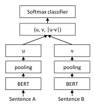
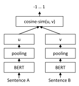

# Sentence-BERT: Sentence Embeddings using Siamese BERT-Networks

## Nils Reimers and Iryna Gurevych

Ubiquitous Knowledge Processing Lab (UKP-TUDA) Department of Computer Science, Technische Universitat Darmstadt ¨

<www.ukp.tu-darmstadt.de>

### Abstract

BERT [\(Devlin et al.,](#page-8-0) [2018\)](#page-8-0) and RoBERTa [\(Liu](#page-9-0) [et al.,](#page-9-0) [2019\)](#page-9-0) has set a new state-of-the-art performance on sentence-pair regression tasks like semantic textual similarity (STS). However, it requires that both sentences are fed into the network, which causes a massive computational overhead: Finding the most similar pair in a collection of 10,000 sentences requires about 50 million inference computations (~65 hours) with BERT. The construction of BERT makes it unsuitable for semantic similarity search as well as for unsupervised tasks like clustering.

In this publication, we present Sentence-BERT (SBERT), a modification of the pretrained BERT network that use siamese and triplet network structures to derive semantically meaningful sentence embeddings that can be compared using cosine-similarity. This reduces the effort for finding the most similar pair from 65 hours with BERT / RoBERTa to about 5 seconds with SBERT, while maintaining the accuracy from BERT.

We evaluate SBERT and SRoBERTa on common STS tasks and transfer learning tasks, where it outperforms other state-of-the-art sentence embeddings methods.[1](#page-0-0)

## 1 Introduction

In this publication, we present Sentence-BERT (SBERT), a modification of the BERT network using siamese and triplet networks that is able to derive semantically meaningful sentence embeddings[2](#page-0-1) . This enables BERT to be used for certain new tasks, which up-to-now were not applicable for BERT. These tasks include large-scale semantic similarity comparison, clustering, and information retrieval via semantic search.

BERT set new state-of-the-art performance on various sentence classification and sentence-pair regression tasks. BERT uses a cross-encoder: Two sentences are passed to the transformer network and the target value is predicted. However, this setup is unsuitable for various pair regression tasks due to too many possible combinations. Finding in a collection of n = 10 000 sentences the pair with the highest similarity requires with BERT n·(n−1)/2 = 49 995 000 inference computations. On a modern V100 GPU, this requires about 65 hours. Similar, finding which of the over 40 million existent questions of Quora is the most similar for a new question could be modeled as a pair-wise comparison with BERT, however, answering a single query would require over 50 hours.

A common method to address clustering and semantic search is to map each sentence to a vector space such that semantically similar sentences are close. Researchers have started to input individual sentences into BERT and to derive fixedsize sentence embeddings. The most commonly used approach is to average the BERT output layer (known as BERT embeddings) or by using the output of the first token (the [CLS] token). As we will show, this common practice yields rather bad sentence embeddings, often worse than averaging GloVe embeddings [\(Pennington et al.,](#page-9-1) [2014\)](#page-9-1).

To alleviate this issue, we developed SBERT. The siamese network architecture enables that fixed-sized vectors for input sentences can be derived. Using a similarity measure like cosinesimilarity or Manhatten / Euclidean distance, semantically similar sentences can be found. These similarity measures can be performed extremely efficient on modern hardware, allowing SBERT to be used for semantic similarity search as well as for clustering. The complexity for finding the

1Code available: [https://github.com/UKPLab/](https://github.com/UKPLab/sentence-transformers) [sentence-transformers](https://github.com/UKPLab/sentence-transformers)

2With *semantically meaningful* we mean that semantically similar sentences are close in vector space.

most similar sentence pair in a collection of 10,000 sentences is reduced from 65 hours with BERT to the computation of 10,000 sentence embeddings (~5 seconds with SBERT) and computing cosinesimilarity (~0.01 seconds). By using optimized index structures, finding the most similar Quora question can be reduced from 50 hours to a few milliseconds [\(Johnson et al.,](#page-9-2) [2017\)](#page-9-2).

We fine-tune SBERT on NLI data, which creates sentence embeddings that significantly outperform other state-of-the-art sentence embedding methods like InferSent [\(Conneau et al.,](#page-8-1) [2017\)](#page-8-1) and Universal Sentence Encoder [\(Cer et al.,](#page-8-2) [2018\)](#page-8-2). On seven Semantic Textual Similarity (STS) tasks, SBERT achieves an improvement of 11.7 points compared to InferSent and 5.5 points compared to Universal Sentence Encoder. On SentEval [\(Con](#page-8-3)[neau and Kiela,](#page-8-3) [2018\)](#page-8-3), an evaluation toolkit for sentence embeddings, we achieve an improvement of 2.1 and 2.6 points, respectively.

SBERT can be adapted to a specific task. It sets new state-of-the-art performance on a challenging argument similarity dataset [\(Misra et al.,](#page-9-3) [2016\)](#page-9-3) and on a triplet dataset to distinguish sentences from different sections of a Wikipedia article [\(Dor et al.,](#page-8-4) [2018\)](#page-8-4).

The paper is structured in the following way: Section [3](#page-2-0) presents SBERT, section [4](#page-3-0) evaluates SBERT on common STS tasks and on the challenging Argument Facet Similarity (AFS) corpus [\(Misra et al.,](#page-9-3) [2016\)](#page-9-3). Section [5](#page-5-0) evaluates SBERT on SentEval. In section [6,](#page-6-0) we perform an ablation study to test some design aspect of SBERT. In section [7,](#page-7-0) we compare the computational efficiency of SBERT sentence embeddings in contrast to other state-of-the-art sentence embedding methods.

### 2 Related Work

We first introduce BERT, then, we discuss stateof-the-art sentence embedding methods.

BERT [\(Devlin et al.,](#page-8-0) [2018\)](#page-8-0) is a pre-trained transformer network [\(Vaswani et al.,](#page-9-4) [2017\)](#page-9-4), which set for various NLP tasks new state-of-the-art results, including question answering, sentence classification, and sentence-pair regression. The input for BERT for sentence-pair regression consists of the two sentences, separated by a special [SEP] token. Multi-head attention over 12 (base-model) or 24 layers (large-model) is applied and the output is passed to a simple regression function to derive the final label. Using this setup, BERT set a new state-of-the-art performance on the Semantic Textual Semilarity (STS) benchmark [\(Cer et al.,](#page-8-5) [2017\)](#page-8-5). RoBERTa [\(Liu et al.,](#page-9-0) [2019\)](#page-9-0) showed, that the performance of BERT can further improved by small adaptations to the pre-training process. We also tested XLNet [\(Yang et al.,](#page-10-0) [2019\)](#page-10-0), but it led in general to worse results than BERT.

A large disadvantage of the BERT network structure is that no independent sentence embeddings are computed, which makes it difficult to derive sentence embeddings from BERT. To bypass this limitations, researchers passed single sentences through BERT and then derive a fixed sized vector by either averaging the outputs (similar to average word embeddings) or by using the output of the special CLS token (for example: [May et al.](#page-9-5) [\(2019\)](#page-9-5); [Zhang et al.](#page-10-1) [\(2019\)](#page-10-1); [Qiao et al.](#page-9-6) [\(2019\)](#page-9-6)). These two options are also provided by the popular bert-as-a-service-repository[3](#page-1-0) . Up to our knowledge, there is so far no evaluation if these methods lead to useful sentence embeddings.

Sentence embeddings are a well studied area with dozens of proposed methods. Skip-Thought [\(Kiros et al.,](#page-9-7) [2015\)](#page-9-7) trains an encoder-decoder architecture to predict the surrounding sentences. InferSent [\(Conneau et al.,](#page-8-1) [2017\)](#page-8-1) uses labeled data of the Stanford Natural Language Inference dataset [\(Bowman et al.,](#page-8-6) [2015\)](#page-8-6) and the Multi-Genre NLI dataset [\(Williams et al.,](#page-10-2) [2018\)](#page-10-2) to train a siamese BiLSTM network with max-pooling over the output. Conneau et al. showed, that InferSent consistently outperforms unsupervised methods like SkipThought. Universal Sentence Encoder [\(Cer et al.,](#page-8-2) [2018\)](#page-8-2) trains a transformer network and augments unsupervised learning with training on SNLI. [Hill et al.](#page-8-7) [\(2016\)](#page-8-7) showed, that the task on which sentence embeddings are trained significantly impacts their quality. Previous work [\(Conneau et al.,](#page-8-1) [2017;](#page-8-1) [Cer et al.,](#page-8-2) [2018\)](#page-8-2) found that the SNLI datasets are suitable for training sentence embeddings. [Yang et al.](#page-10-3) [\(2018\)](#page-10-3) presented a method to train on conversations from Reddit using siamese DAN and siamese transformer networks, which yielded good results on the STS benchmark dataset.

[Humeau et al.](#page-9-8) [\(2019\)](#page-9-8) addresses the run-time overhead of the cross-encoder from BERT and present a method (poly-encoders) to compute a score between m context vectors and pre-

3[https://github.com/hanxiao/](https://github.com/hanxiao/bert-as-service/) [bert-as-service/](https://github.com/hanxiao/bert-as-service/)

Figure 1: SBERT architecture with classification objective function, e.g., for fine-tuning on SNLI dataset. The two BERT networks have tied weights (siamese network structure).

computed candidate embeddings using attention. This idea works for finding the highest scoring sentence in a larger collection. However, polyencoders have the drawback that the score function is not symmetric and the computational overhead is too large for use-cases like clustering, which would require O(n 2 ) score computations.

Previous neural sentence embedding methods started the training from a random initialization. In this publication, we use the pre-trained BERT and RoBERTa network and only fine-tune it to yield useful sentence embeddings. This reduces significantly the needed training time: SBERT can be tuned in less than 20 minutes, while yielding better results than comparable sentence embedding methods.

### 3 Model

SBERT adds a pooling operation to the output of BERT / RoBERTa to derive a fixed sized sentence embedding. We experiment with three pooling strategies: Using the output of the CLS-token, computing the mean of all output vectors (MEANstrategy), and computing a max-over-time of the output vectors (MAX-strategy). The default configuration is MEAN.

In order to fine-tune BERT / RoBERTa, we create siamese and triplet networks [\(Schroff et al.,](#page-9-9) [2015\)](#page-9-9) to update the weights such that the produced sentence embeddings are semantically meaningful and can be compared with cosine-similarity.

The network structure depends on the available

Figure 2: SBERT architecture at inference, for example, to compute similarity scores. This architecture is also used with the regression objective function.

training data. We experiment with the following structures and objective functions.

Classification Objective Function. We concatenate the sentence embeddings u and v with the element-wise difference |u−v| and multiply it with the trainable weight Wt ∈ R 3n×k :

$$o = \operatorname{softmax}(W_t(u, v, |u - v|))$$

where n is the dimension of the sentence embeddings and k the number of labels. We optimize cross-entropy loss. This structure is depicted in Figure [1.](#page-2-1)

Regression Objective Function. The cosinesimilarity between the two sentence embeddings u and v is computed (Figure [2\)](#page-2-2). We use meansquared-error loss as the objective function.

Triplet Objective Function. Given an anchor sentence a, a positive sentence p, and a negative sentence n, triplet loss tunes the network such that the distance between a and p is smaller than the distance between a and n. Mathematically, we minimize the following loss function:

$$max(||s_a - s_p|| - ||s_a - s_n|| + \epsilon, 0)$$

with sx the sentence embedding for a/n/p, || · || a distance metric and margin . Margin ensures that sp is at least closer to sa than sn. As metric we use Euclidean distance and we set = 1 in our experiments.

## 3.1 Training Details

We train SBERT on the combination of the SNLI [\(Bowman et al.,](#page-8-6) [2015\)](#page-8-6) and the Multi-Genre NLI

| Model                      | STS12 | STS13 | STS14 | STS15 | STS16 | STSb  | SICK-R | Avg.  |
|----------------------------|-------|-------|-------|-------|-------|-------|--------|-------|
| Avg. GloVe embeddings      | 55.14 | 70.66 | 59.73 | 68.25 | 63.66 | 58.02 | 53.76  | 61.32 |
| Avg. BERT embeddings       | 38.78 | 57.98 | 57.98 | 63.15 | 61.06 | 46.35 | 58.40  | 54.81 |
| BERT CLS-vector            | 20.16 | 30.01 | 20.09 | 36.88 | 38.08 | 16.50 | 42.63  | 29.19 |
| InferSent - Glove          | 52.86 | 66.75 | 62.15 | 72.77 | 66.87 | 68.03 | 65.65  | 65.01 |
| Universal Sentence Encoder | 64.49 | 67.80 | 64.61 | 76.83 | 73.18 | 74.92 | 76.69  | 71.22 |
| SBERT-NLI-base             | 70.97 | 76.53 | 73.19 | 79.09 | 74.30 | 77.03 | 72.91  | 74.89 |
| SBERT-NLI-large            | 72.27 | 78.46 | 74.90 | 80.99 | 76.25 | 79.23 | 73.75  | 76.55 |
| SRoBERTa-NLI-base          | 71.54 | 72.49 | 70.80 | 78.74 | 73.69 | 77.77 | 74.46  | 74.21 |
| SRoBERTa-NLI-large         | 74.53 | 77.00 | 73.18 | 81.85 | 76.82 | 79.10 | 74.29  | 76.68 |

Table 1: Spearman rank correlation ρ between the cosine similarity of sentence representations and the gold labels for various Textual Similarity (STS) tasks. Performance is reported by convention as ρ × 100. STS12-STS16: SemEval 2012-2016, STSb: STSbenchmark, SICK-R: SICK relatedness dataset.

[\(Williams et al.,](#page-10-2) [2018\)](#page-10-2) dataset. The SNLI is a collection of 570,000 sentence pairs annotated with the labels *contradiction*, *eintailment*, and *neutral*. MultiNLI contains 430,000 sentence pairs and covers a range of genres of spoken and written text. We fine-tune SBERT with a 3-way softmaxclassifier objective function for one epoch. We used a batch-size of 16, Adam optimizer with learning rate 2e−5, and a linear learning rate warm-up over 10% of the training data. Our default pooling strategy is MEAN.

## 4 Evaluation - Semantic Textual Similarity

We evaluate the performance of SBERT for common Semantic Textual Similarity (STS) tasks. State-of-the-art methods often learn a (complex) regression function that maps sentence embeddings to a similarity score. However, these regression functions work pair-wise and due to the combinatorial explosion those are often not scalable if the collection of sentences reaches a certain size. Instead, we always use cosine-similarity to compare the similarity between two sentence embeddings. We ran our experiments also with negative Manhatten and negative Euclidean distances as similarity measures, but the results for all approaches remained roughly the same.

## 4.1 Unsupervised STS

We evaluate the performance of SBERT for STS without using any STS specific training data. We use the STS tasks 2012 - 2016 [\(Agirre et al.,](#page-8-8) [2012,](#page-8-8) [2013,](#page-8-9) [2014,](#page-8-10) [2015,](#page-8-11) [2016\)](#page-8-12), the STS benchmark [\(Cer](#page-8-5) [et al.,](#page-8-5) [2017\)](#page-8-5), and the SICK-Relatedness dataset [\(Marelli et al.,](#page-9-10) [2014\)](#page-9-10). These datasets provide labels between 0 and 5 on the semantic relatedness of sentence pairs. We showed in [\(Reimers et al.,](#page-9-11) [2016\)](#page-9-11) that Pearson correlation is badly suited for STS. Instead, we compute the Spearman's rank correlation between the cosine-similarity of the sentence embeddings and the gold labels. The setup for the other sentence embedding methods is equivalent, the similarity is computed by cosinesimilarity. The results are depicted in Table [1.](#page-3-1)

The results shows that directly using the output of BERT leads to rather poor performances. Averaging the BERT embeddings achieves an average correlation of only 54.81, and using the CLStoken output only achieves an average correlation of 29.19. Both are worse than computing average GloVe embeddings.

Using the described siamese network structure and fine-tuning mechanism substantially improves the correlation, outperforming both InferSent and Universal Sentence Encoder substantially. The only dataset where SBERT performs worse than Universal Sentence Encoder is SICK-R. Universal Sentence Encoder was trained on various datasets, including news, question-answer pages and discussion forums, which appears to be more suitable to the data of SICK-R. In contrast, SBERT was pre-trained only on Wikipedia (via BERT) and on NLI data.

While RoBERTa was able to improve the performance for several supervised tasks, we only observe minor difference between SBERT and SRoBERTa for generating sentence embeddings.

#### 4.2 Supervised STS

The STS benchmark (STSb) [\(Cer et al.,](#page-8-5) [2017\)](#page-8-5) provides is a popular dataset to evaluate supervised STS systems. The data includes 8,628 sentence pairs from the three categories *captions*, *news*, and *forums*. It is divided into train (5,749), dev (1,500) and test (1,379). BERT set a new state-of-the-art performance on this dataset by passing both sentences to the network and using a simple regression method for the output.

| Model                                    | Spearman     |  |  |  |  |
|------------------------------------------|--------------|--|--|--|--|
| Not trained for STS                      |              |  |  |  |  |
| Avg. GloVe embeddings                    | 58.02        |  |  |  |  |
| Avg. BERT embeddings                     | 46.35        |  |  |  |  |
| InferSent - GloVe                        | 68.03        |  |  |  |  |
| Universal Sentence Encoder               | 74.92        |  |  |  |  |
| SBERT-NLI-base                           | 77.03        |  |  |  |  |
| SBERT-NLI-large                          | 79.23        |  |  |  |  |
| Trained on STS benchmark dataset         |              |  |  |  |  |
| BERT-STSb-base                           | 84.30 ± 0.76 |  |  |  |  |
| SBERT-STSb-base                          | 84.67 ± 0.19 |  |  |  |  |
| SRoBERTa-STSb-base                       | 84.92 ± 0.34 |  |  |  |  |
| BERT-STSb-large                          | 85.64 ± 0.81 |  |  |  |  |
| SBERT-STSb-large                         | 84.45 ± 0.43 |  |  |  |  |
| SRoBERTa-STSb-large                      | 85.02 ± 0.76 |  |  |  |  |
| Trained on NLI data + STS benchmark data |              |  |  |  |  |
| BERT-NLI-STSb-base                       | 88.33 ± 0.19 |  |  |  |  |
| SBERT-NLI-STSb-base                      | 85.35 ± 0.17 |  |  |  |  |
| SRoBERTa-NLI-STSb-base                   | 84.79 ± 0.38 |  |  |  |  |
| BERT-NLI-STSb-large                      | 88.77 ± 0.46 |  |  |  |  |
| SBERT-NLI-STSb-large                     | 86.10 ± 0.13 |  |  |  |  |
| SRoBERTa-NLI-STSb-large                  | 86.15 ± 0.35 |  |  |  |  |

Table 2: Evaluation on the STS benchmark test set. BERT systems were trained with 10 random seeds and 4 epochs. SBERT was fine-tuned on the STSb dataset, SBERT-NLI was pretrained on the NLI datasets, then fine-tuned on the STSb dataset.

We use the training set to fine-tune SBERT using the regression objective function. At prediction time, we compute the cosine-similarity between the sentence embeddings. All systems are trained with 10 random seeds to counter variances [\(Reimers and Gurevych,](#page-9-12) [2018\)](#page-9-12).

The results are depicted in Table [2.](#page-4-0) We experimented with two setups: Only training on STSb, and first training on NLI, then training on STSb. We observe that the later strategy leads to a slight improvement of 1-2 points. This two-step approach had an especially large impact for the BERT cross-encoder, which improved the performance by 3-4 points. We do not observe a significant difference between BERT and RoBERTa.

#### 4.3 Argument Facet Similarity

We evaluate SBERT on the Argument Facet Similarity (AFS) corpus by [Misra et al.](#page-9-3) [\(2016\)](#page-9-3). The AFS corpus annotated 6,000 sentential argument pairs from social media dialogs on three controversial topics: *gun control*, *gay marriage*, and *death penalty*. The data was annotated on a scale from 0 ("different topic") to 5 ("completely equivalent"). The similarity notion in the AFS corpus is fairly different to the similarity notion in the STS datasets from SemEval. STS data is usually descriptive, while AFS data are argumentative excerpts from dialogs. To be considered similar, arguments must not only make similar claims, but also provide a similar reasoning. Further, the lexical gap between the sentences in AFS is much larger. Hence, simple unsupervised methods as well as state-of-the-art STS systems perform badly on this dataset [\(Reimers et al.,](#page-9-13) [2019\)](#page-9-13).

We evaluate SBERT on this dataset in two scenarios: 1) As proposed by Misra et al., we evaluate SBERT using 10-fold cross-validation. A drawback of this evaluation setup is that it is not clear how well approaches generalize to different topics. Hence, 2) we evaluate SBERT in a cross-topic setup. Two topics serve for training and the approach is evaluated on the left-out topic. We repeat this for all three topics and average the results.

SBERT is fine-tuned using the Regression Objective Function. The similarity score is computed using cosine-similarity based on the sentence embeddings. We also provide the Pearson correlation r to make the results comparable to Misra et al. However, we showed [\(Reimers et al.,](#page-9-11) [2016\)](#page-9-11) that Pearson correlation has some serious drawbacks and should be avoided for comparing STS systems. The results are depicted in Table [3.](#page-5-1)

Unsupervised methods like tf-idf, average GloVe embeddings or InferSent perform rather badly on this dataset with low scores. Training SBERT in the 10-fold cross-validation setup gives a performance that is nearly on-par with BERT.

However, in the cross-topic evaluation, we observe a performance drop of SBERT by about 7 points Spearman correlation. To be considered similar, arguments should address the same claims and provide the same reasoning. BERT is able to use attention to compare directly both sentences (e.g. word-by-word comparison), while SBERT must map individual sentences from an unseen topic to a vector space such that arguments with similar claims and reasons are close. This is a much more challenging task, which appears to require more than just two topics for training to work on-par with BERT.

#### 4.4 Wikipedia Sections Distinction

[Dor et al.](#page-8-4) [\(2018\)](#page-8-4) use Wikipedia to create a thematically fine-grained train, dev and test set for sentence embeddings methods. Wikipedia articles are separated into distinct sections focusing on certain aspects. Dor et al. assume that sen-

| Model                    | r     | ρ     |  |  |  |
|--------------------------|-------|-------|--|--|--|
| Unsupervised methods     |       |       |  |  |  |
| tf-idf                   | 46.77 | 42.95 |  |  |  |
| Avg. GloVe embeddings    | 32.40 | 34.00 |  |  |  |
| InferSent - GloVe        | 27.08 | 26.63 |  |  |  |
| 10-fold Cross-Validation |       |       |  |  |  |
| SVR (Misra et al., 2016) | 63.33 | -     |  |  |  |
| BERT-AFS-base            | 77.20 | 74.84 |  |  |  |
| SBERT-AFS-base           | 76.57 | 74.13 |  |  |  |
| BERT-AFS-large           | 78.68 | 76.38 |  |  |  |
| SBERT-AFS-large          | 77.85 | 75.93 |  |  |  |
| Cross-Topic Evaluation   |       |       |  |  |  |
| BERT-AFS-base            | 58.49 | 57.23 |  |  |  |
| SBERT-AFS-base           | 52.34 | 50.65 |  |  |  |
| BERT-AFS-large           | 62.02 | 60.34 |  |  |  |
| SBERT-AFS-large          | 53.82 | 53.10 |  |  |  |

Table 3: Average Pearson correlation r and average Spearman's rank correlation ρ on the Argument Facet Similarity (AFS) corpus [\(Misra et al.,](#page-9-3) [2016\)](#page-9-3). Misra et al. proposes 10-fold cross-validation. We additionally evaluate in a cross-topic scenario: Methods are trained on two topics, and are evaluated on the third topic.

tences in the same section are thematically closer than sentences in different sections. They use this to create a large dataset of weakly labeled sentence triplets: The anchor and the positive example come from the same section, while the negative example comes from a different section of the same article. For example, from the Alice Arnold article: Anchor: *Arnold joined the BBC Radio Drama Company in 1988.*, positive: *Arnold gained media attention in May 2012.*, negative: *Balding and Arnold are keen amateur golfers.*

We use the dataset from Dor et al. We use the Triplet Objective, train SBERT for one epoch on the about 1.8 Million training triplets and evaluate it on the 222,957 test triplets. Test triplets are from a distinct set of Wikipedia articles. As evaluation metric, we use accuracy: Is the positive example closer to the anchor than the negative example?

Results are presented in Table [4.](#page-5-2) Dor et al. finetuned a BiLSTM architecture with triplet loss to derive sentence embeddings for this dataset. As the table shows, SBERT clearly outperforms the BiLSTM approach by Dor et al.

## 5 Evaluation - SentEval

SentEval [\(Conneau and Kiela,](#page-8-3) [2018\)](#page-8-3) is a popular toolkit to evaluate the quality of sentence embeddings. Sentence embeddings are used as features for a logistic regression classifier. The logistic regression classifier is trained on various tasks in a 10-fold cross-validation setup and the prediction accuracy is computed for the test-fold.

| Model                  | Accuracy |
|------------------------|----------|
| mean-vectors           | 0.65     |
| skip-thoughts-CS       | 0.62     |
| Dor et al.             | 0.74     |
| SBERT-WikiSec-base     | 0.8042   |
| SBERT-WikiSec-large    | 0.8078   |
| SRoBERTa-WikiSec-base  | 0.7945   |
| SRoBERTa-WikiSec-large | 0.7973   |

Table 4: Evaluation on the Wikipedia section triplets dataset [\(Dor et al.,](#page-8-4) [2018\)](#page-8-4). SBERT trained with triplet loss for one epoch.

The purpose of SBERT sentence embeddings are not to be used for transfer learning for other tasks. Here, we think fine-tuning BERT as described by [Devlin et al.](#page-8-0) [\(2018\)](#page-8-0) for new tasks is the more suitable method, as it updates all layers of the BERT network. However, SentEval can still give an impression on the quality of our sentence embeddings for various tasks.

We compare the SBERT sentence embeddings to other sentence embeddings methods on the following seven SentEval transfer tasks:

- MR: Sentiment prediction for movie reviews snippets on a five start scale [\(Pang and Lee,](#page-9-14) [2005\)](#page-9-14).
- CR: Sentiment prediction of customer product reviews [\(Hu and Liu,](#page-9-15) [2004\)](#page-9-15).
- SUBJ: Subjectivity prediction of sentences from movie reviews and plot summaries [\(Pang and Lee,](#page-9-16) [2004\)](#page-9-16).
- MPQA: Phrase level opinion polarity classification from newswire [\(Wiebe et al.,](#page-9-17) [2005\)](#page-9-17).
- SST: Stanford Sentiment Treebank with binary labels [\(Socher et al.,](#page-9-18) [2013\)](#page-9-18).
- TREC: Fine grained question-type classification from TREC [\(Li and Roth,](#page-9-19) [2002\)](#page-9-19).
- MRPC: Microsoft Research Paraphrase Corpus from parallel news sources [\(Dolan et al.,](#page-8-13) [2004\)](#page-8-13).

The results can be found in Table [5.](#page-6-1) SBERT is able to achieve the best performance in 5 out of 7 tasks. The average performance increases by about 2 percentage points compared to InferSent as well as the Universal Sentence Encoder. Even though transfer learning is not the purpose of SBERT, it outperforms other state-of-the-art sentence embeddings methods on this task.

| Model                      | MR    | CR    | SUBJ  | MPQA  | SST   | TREC | MRPC  | Avg.  |
|----------------------------|-------|-------|-------|-------|-------|------|-------|-------|
| Avg. GloVe embeddings      | 77.25 | 78.30 | 91.17 | 87.85 | 80.18 | 83.0 | 72.87 | 81.52 |
| Avg. fast-text embeddings  | 77.96 | 79.23 | 91.68 | 87.81 | 82.15 | 83.6 | 74.49 | 82.42 |
| Avg. BERT embeddings       | 78.66 | 86.25 | 94.37 | 88.66 | 84.40 | 92.8 | 69.45 | 84.94 |
| BERT CLS-vector            | 78.68 | 84.85 | 94.21 | 88.23 | 84.13 | 91.4 | 71.13 | 84.66 |
| InferSent - GloVe          | 81.57 | 86.54 | 92.50 | 90.38 | 84.18 | 88.2 | 75.77 | 85.59 |
| Universal Sentence Encoder | 80.09 | 85.19 | 93.98 | 86.70 | 86.38 | 93.2 | 70.14 | 85.10 |
| SBERT-NLI-base             | 83.64 | 89.43 | 94.39 | 89.86 | 88.96 | 89.6 | 76.00 | 87.41 |
| SBERT-NLI-large            | 84.88 | 90.07 | 94.52 | 90.33 | 90.66 | 87.4 | 75.94 | 87.69 |

Table 5: Evaluation of SBERT sentence embeddings using the SentEval toolkit. SentEval evaluates sentence embeddings on different sentence classification tasks by training a logistic regression classifier using the sentence embeddings as features. Scores are based on a 10-fold cross-validation.

It appears that the sentence embeddings from SBERT capture well sentiment information: We observe large improvements for all sentiment tasks (MR, CR, and SST) from SentEval in comparison to InferSent and Universal Sentence Encoder.

The only dataset where SBERT is significantly worse than Universal Sentence Encoder is the TREC dataset. Universal Sentence Encoder was pre-trained on question-answering data, which appears to be beneficial for the question-type classification task of the TREC dataset.

Average BERT embeddings or using the CLStoken output from a BERT network achieved bad results for various STS tasks (Table [1\)](#page-3-1), worse than average GloVe embeddings. However, for Sent-Eval, average BERT embeddings and the BERT CLS-token output achieves decent results (Table [5\)](#page-6-1), outperforming average GloVe embeddings. The reason for this are the different setups. For the STS tasks, we used cosine-similarity to estimate the similarities between sentence embeddings. Cosine-similarity treats all dimensions equally. In contrast, SentEval fits a logistic regression classifier to the sentence embeddings. This allows that certain dimensions can have higher or lower impact on the classification result.

We conclude that average BERT embeddings / CLS-token output from BERT return sentence embeddings that are infeasible to be used with cosinesimilarity or with Manhatten / Euclidean distance. For transfer learning, they yield slightly worse results than InferSent or Universal Sentence Encoder. However, using the described fine-tuning setup with a siamese network structure on NLI datasets yields sentence embeddings that achieve a new state-of-the-art for the SentEval toolkit.

## 6 Ablation Study

We have demonstrated strong empirical results for the quality of SBERT sentence embeddings. In this section, we perform an ablation study of different aspects of SBERT in order to get a better understanding of their relative importance.

We evaluated different pooling strategies (MEAN, MAX, and CLS). For the classification objective function, we evaluate different concatenation methods. For each possible configuration, we train SBERT with 10 different random seeds and average the performances.

The objective function (classification vs. regression) depends on the annotated dataset. For the classification objective function, we train SBERTbase on the SNLI and the Multi-NLI dataset. For the regression objective function, we train on the training set of the STS benchmark dataset. Performances are measured on the development split of the STS benchmark dataset. Results are shown in Table [6.](#page-6-2)

|                        | NLI   | STSb  |
|------------------------|-------|-------|
| Pooling Strategy       |       |       |
| MEAN                   | 80.78 | 87.44 |
| MAX                    | 79.07 | 69.92 |
| CLS                    | 79.80 | 86.62 |
| Concatenation          |       |       |
| (u, v)                 | 66.04 | -     |
| ( u − v )              | 69.78 | -     |
| (u ∗ v)                | 70.54 | -     |
| ( u − v , u ∗ v)       | 78.37 | -     |
| (u, v, u ∗ v)          | 77.44 | -     |
| (u, v,  u − v )        | 80.78 | -     |
| (u, v,  u − v , u ∗ v) | 80.44 | -     |

Table 6: SBERT trained on NLI data with the classification objective function, on the STS benchmark (STSb) with the regression objective function. Configurations are evaluated on the development set of the STSb using cosine-similarity and Spearman's rank correlation. For the concatenation methods, we only report scores with MEAN pooling strategy.

When trained with the classification objective function on NLI data, the pooling strategy has a rather minor impact. The impact of the concatenation mode is much larger. InferSent [\(Conneau](#page-8-1) [et al.,](#page-8-1) [2017\)](#page-8-1) and Universal Sentence Encoder [\(Cer](#page-8-2) [et al.,](#page-8-2) [2018\)](#page-8-2) both use (u, v, |u − v|, u ∗ v) as input for a softmax classifier. However, in our architecture, adding the element-wise u ∗ v decreased the performance.

The most important component is the elementwise difference |u − v|. Note, that the concatenation mode is only relevant for training the softmax classifier. At inference, when predicting similarities for the STS benchmark dataset, only the sentence embeddings u and v are used in combination with cosine-similarity. The element-wise difference measures the distance between the dimensions of the two sentence embeddings, ensuring that similar pairs are closer and dissimilar pairs are further apart.

When trained with the regression objective function, we observe that the pooling strategy has a large impact. There, the MAX strategy perform significantly worse than MEAN or CLS-token strategy. This is in contrast to [\(Conneau et al.,](#page-8-1) [2017\)](#page-8-1), who found it beneficial for the BiLSTM-layer of InferSent to use MAX instead of MEAN pooling.

## 7 Computational Efficiency

Sentence embeddings need potentially be computed for Millions of sentences, hence, a high computation speed is desired. In this section, we compare SBERT to average GloVe embeddings, InferSent [\(Conneau et al.,](#page-8-1) [2017\)](#page-8-1), and Universal Sentence Encoder [\(Cer et al.,](#page-8-2) [2018\)](#page-8-2).

For our comparison we use the sentences from the STS benchmark [\(Cer et al.,](#page-8-5) [2017\)](#page-8-5). We compute average GloVe embeddings using a simple for-loop with python dictionary lookups and NumPy. InferSent[4](#page-7-1) is based on PyTorch. For Universal Sentence Encoder, we use the Tensor-Flow Hub version[5](#page-7-2) , which is based on Tensor-Flow. SBERT is based on PyTorch. For improved computation of sentence embeddings, we implemented a smart batching strategy: Sentences with similar lengths are grouped together and are only padded to the longest element in a mini-batch. This drastically reduces computational overhead from padding tokens.

Performances were measured on a server with Intel i7-5820K CPU @ 3.30GHz, Nvidia Tesla V100 GPU, CUDA 9.2 and cuDNN. The results are depicted in Table [7.](#page-7-3)

| Model                       | CPU  | GPU  |
|-----------------------------|------|------|
| Avg. GloVe embeddings       | 6469 | -    |
| InferSent                   | 137  | 1876 |
| Universal Sentence Encoder  | 67   | 1318 |
| SBERT-base                  | 44   | 1378 |
| SBERT-base - smart batching | 83   | 2042 |

Table 7: Computation speed (sentences per second) of sentence embedding methods. Higher is better.

On CPU, InferSent is about 65% faster than SBERT. This is due to the much simpler network architecture. InferSent uses a single Bi-LSTM layer, while BERT uses 12 stacked transformer layers. However, an advantage of transformer networks is the computational efficiency on GPUs. There, SBERT with smart batching is about 9% faster than InferSent and about 55% faster than Universal Sentence Encoder. Smart batching achieves a speed-up of 89% on CPU and 48% on GPU. Average GloVe embeddings is obviously by a large margin the fastest method to compute sentence embeddings.

## 8 Conclusion

We showed that BERT out-of-the-box maps sentences to a vector space that is rather unsuitable to be used with common similarity measures like cosine-similarity. The performance for seven STS tasks was below the performance of average GloVe embeddings.

To overcome this shortcoming, we presented Sentence-BERT (SBERT). SBERT fine-tunes BERT in a siamese / triplet network architecture. We evaluated the quality on various common benchmarks, where it could achieve a significant improvement over state-of-the-art sentence embeddings methods. Replacing BERT with RoBERTa did not yield a significant improvement in our experiments.

SBERT is computationally efficient. On a GPU, it is about 9% faster than InferSent and about 55% faster than Universal Sentence Encoder. SBERT can be used for tasks which are computationally not feasible to be modeled with BERT. For example, clustering of 10,000 sentences with hierarchical clustering requires with BERT about 65 hours, as around 50 Million sentence combinations must be computed. With SBERT, we were able to reduce the effort to about 5 seconds.

4[https://github.com/facebookresearch/](https://github.com/facebookresearch/InferSent) [InferSent](https://github.com/facebookresearch/InferSent)

5[https://tfhub.dev/google/](https://tfhub.dev/google/universal-sentence-encoder-large/3) [universal-sentence-encoder-large/3](https://tfhub.dev/google/universal-sentence-encoder-large/3)

## Acknowledgments

This work has been supported by the German Research Foundation through the German-Israeli Project Cooperation (DIP, grant DA 1600/1-1 and grant GU 798/17-1). It has been co-funded by the German Federal Ministry of Education and Research (BMBF) under the promotional references 03VP02540 (ArgumenText).

## References

- Eneko Agirre, Carmen Banea, Claire Cardie, Daniel Cer, Mona Diab, Aitor Gonzalez-Agirre, Weiwei Guo, Inigo Lopez-Gazpio, Montse Maritxalar, Rada Mihalcea, German Rigau, Larraitz Uria, and Janyce Wiebe. 2015. [SemEval-2015 Task 2: Semantic Tex](http://www.aclweb.org/anthology/S15-2045)[tual Similarity, English, Spanish and Pilot on Inter](http://www.aclweb.org/anthology/S15-2045)[pretability.](http://www.aclweb.org/anthology/S15-2045) In *Proceedings of the 9th International Workshop on Semantic Evaluation (SemEval 2015)*, pages 252–263, Denver, Colorado. Association for Computational Linguistics.
- Eneko Agirre, Carmen Banea, Claire Cardie, Daniel Cer, Mona Diab, Aitor Gonzalez-Agirre, Weiwei Guo, Rada Mihalcea, German Rigau, and Janyce Wiebe. 2014. [SemEval-2014 Task 10: Multilingual](https://doi.org/10.3115/v1/S14-2010) [Semantic Textual Similarity.](https://doi.org/10.3115/v1/S14-2010) In *Proceedings of the 8th International Workshop on Semantic Evaluation (SemEval 2014)*, pages 81–91, Dublin, Ireland. Association for Computational Linguistics.
- Eneko Agirre, Carmen Banea, Daniel M. Cer, Mona T. Diab, Aitor Gonzalez-Agirre, Rada Mihalcea, German Rigau, and Janyce Wiebe. 2016. [SemEval-](http://aclweb.org/anthology/S/S16/S16-1081.pdf)[2016 Task 1: Semantic Textual Similarity, Mono](http://aclweb.org/anthology/S/S16/S16-1081.pdf)[lingual and Cross-Lingual Evaluation.](http://aclweb.org/anthology/S/S16/S16-1081.pdf) In *Proceedings of the 10th International Workshop on Semantic Evaluation, SemEval@NAACL-HLT 2016, San Diego, CA, USA, June 16-17, 2016*, pages 497–511.
- Eneko Agirre, Daniel Cer, Mona Diab, Aitor Gonzalez-Agirre, and Weiwei Guo. 2013. [\\*SEM 2013 shared](https://www.aclweb.org/anthology/S13-1004) [task: Semantic Textual Similarity.](https://www.aclweb.org/anthology/S13-1004) In *Second Joint Conference on Lexical and Computational Semantics (\*SEM), Volume 1: Proceedings of the Main Conference and the Shared Task: Semantic Textual Similarity*, pages 32–43, Atlanta, Georgia, USA. Association for Computational Linguistics.
- Eneko Agirre, Mona Diab, Daniel Cer, and Aitor Gonzalez-Agirre. 2012. [SemEval-2012 Task 6: A](http://dl.acm.org/citation.cfm?id=2387636.2387697) [Pilot on Semantic Textual Similarity.](http://dl.acm.org/citation.cfm?id=2387636.2387697) In *Proceedings of the First Joint Conference on Lexical and Computational Semantics - Volume 1: Proceedings of the Main Conference and the Shared Task, and Volume 2: Proceedings of the Sixth International Workshop on Semantic Evaluation*, SemEval '12, pages 385–393, Stroudsburg, PA, USA. Association for Computational Linguistics.

- Samuel R. Bowman, Gabor Angeli, Christopher Potts, and Christopher D. Manning. 2015. [A large anno](https://doi.org/10.18653/v1/D15-1075)[tated corpus for learning natural language inference.](https://doi.org/10.18653/v1/D15-1075) In *Proceedings of the 2015 Conference on Empirical Methods in Natural Language Processing*, pages 632–642, Lisbon, Portugal. Association for Computational Linguistics.
- Daniel Cer, Mona Diab, Eneko Agirre, Iigo Lopez-Gazpio, and Lucia Specia. 2017. [SemEval-2017](http://arxiv.org/abs/1708.00055) [Task 1: Semantic Textual Similarity Multilingual](http://arxiv.org/abs/1708.00055) [and Crosslingual Focused Evaluation.](http://arxiv.org/abs/1708.00055) In *Proceedings of the 11th International Workshop on Semantic Evaluation (SemEval-2017)*, pages 1–14, Vancouver, Canada.
- Daniel Cer, Yinfei Yang, Sheng-yi Kong, Nan Hua, Nicole Limtiaco, Rhomni St. John, Noah Constant, Mario Guajardo-Cespedes, Steve Yuan, Chris Tar, Yun-Hsuan Sung, Brian Strope, and Ray Kurzweil. 2018. [Universal Sentence Encoder.](http://arxiv.org/abs/1803.11175) *arXiv preprint arXiv:1803.11175*.
- Alexis Conneau and Douwe Kiela. 2018. [SentEval: An](https://arxiv.org/abs/1803.05449) [Evaluation Toolkit for Universal Sentence Represen](https://arxiv.org/abs/1803.05449)[tations.](https://arxiv.org/abs/1803.05449) *arXiv preprint arXiv:1803.05449*.
- Alexis Conneau, Douwe Kiela, Holger Schwenk, Lo¨ıc Barrault, and Antoine Bordes. 2017. [Supervised](https://www.aclweb.org/anthology/D17-1070) [Learning of Universal Sentence Representations](https://www.aclweb.org/anthology/D17-1070) [from Natural Language Inference Data.](https://www.aclweb.org/anthology/D17-1070) In *Proceedings of the 2017 Conference on Empirical Methods in Natural Language Processing*, pages 670–680, Copenhagen, Denmark. Association for Computational Linguistics.
- Jacob Devlin, Ming-Wei Chang, Kenton Lee, and Kristina Toutanova. 2018. [BERT: Pre-training of](https://arxiv.org/abs/1810.04805) [Deep Bidirectional Transformers for Language Un](https://arxiv.org/abs/1810.04805)[derstanding.](https://arxiv.org/abs/1810.04805) *arXiv preprint arXiv:1810.04805*.
- Bill Dolan, Chris Quirk, and Chris Brockett. 2004. [Un](https://doi.org/10.3115/1220355.1220406)[supervised Construction of Large Paraphrase Cor](https://doi.org/10.3115/1220355.1220406)[pora: Exploiting Massively Parallel News Sources.](https://doi.org/10.3115/1220355.1220406) In *Proceedings of the 20th International Conference on Computational Linguistics*, COLING '04, Stroudsburg, PA, USA. Association for Computational Linguistics.
- Liat Ein Dor, Yosi Mass, Alon Halfon, Elad Venezian, Ilya Shnayderman, Ranit Aharonov, and Noam Slonim. 2018. [Learning Thematic Similarity Metric](https://doi.org/10.18653/v1/P18-2009) [from Article Sections Using Triplet Networks.](https://doi.org/10.18653/v1/P18-2009) In *Proceedings of the 56th Annual Meeting of the Association for Computational Linguistics (Volume 2: Short Papers)*, pages 49–54, Melbourne, Australia. Association for Computational Linguistics.
- Felix Hill, Kyunghyun Cho, and Anna Korhonen. 2016. [Learning Distributed Representations of Sen](https://doi.org/10.18653/v1/N16-1162)[tences from Unlabelled Data.](https://doi.org/10.18653/v1/N16-1162) In *Proceedings of the 2016 Conference of the North American Chapter of the Association for Computational Linguistics: Human Language Technologies*, pages 1367– 1377, San Diego, California. Association for Computational Linguistics.

- Minqing Hu and Bing Liu. 2004. [Mining and Sum](https://doi.org/10.1145/1014052.1014073)[marizing Customer Reviews.](https://doi.org/10.1145/1014052.1014073) In *Proceedings of the Tenth ACM SIGKDD International Conference on Knowledge Discovery and Data Mining*, KDD '04, pages 168–177, New York, NY, USA. ACM.
- Samuel Humeau, Kurt Shuster, Marie-Anne Lachaux, and Jason Weston. 2019. [Real-time Inference](http://arxiv.org/abs/1905.01969) [in Multi-sentence Tasks with Deep Pretrained](http://arxiv.org/abs/1905.01969) [Transformers.](http://arxiv.org/abs/1905.01969) *arXiv preprint arXiv:1905.01969*, abs/1905.01969.
- Jeff Johnson, Matthijs Douze, and Herve J ´ egou. 2017. ´ [Billion-scale similarity search with GPUs.](https://arxiv.org/abs/1702.08734) *arXiv preprint arXiv:1702.08734*.
- Ryan Kiros, Yukun Zhu, Ruslan R Salakhutdinov, Richard Zemel, Raquel Urtasun, Antonio Torralba, and Sanja Fidler. 2015. [Skip-Thought Vectors.](http://papers.nips.cc/paper/5950-skip-thought-vectors.pdf) In C. Cortes, N. D. Lawrence, D. D. Lee, M. Sugiyama, and R. Garnett, editors, *Advances in Neural Information Processing Systems 28*, pages 3294–3302. Curran Associates, Inc.
- Xin Li and Dan Roth. 2002. [Learning Question Classi](https://doi.org/10.3115/1072228.1072378)[fiers.](https://doi.org/10.3115/1072228.1072378) In *Proceedings of the 19th International Conference on Computational Linguistics - Volume 1*, COLING '02, pages 1–7, Stroudsburg, PA, USA. Association for Computational Linguistics.
- Yinhan Liu, Myle Ott, Naman Goyal, Jingfei Du, Mandar Joshi, Danqi Chen, Omer Levy, Mike Lewis, Luke Zettlemoyer, and Veselin Stoyanov. 2019. [RoBERTa: A Robustly Optimized BERT Pretrain](http://arxiv.org/abs/1907.11692)[ing Approach.](http://arxiv.org/abs/1907.11692) *arXiv preprint arXiv:1907.11692*.
- Marco Marelli, Stefano Menini, Marco Baroni, Luisa Bentivogli, Raffaella Bernardi, and Roberto Zamparelli. 2014. [A SICK cure for the evaluation of](http://www.lrec-conf.org/proceedings/lrec2014/pdf/363_Paper.pdf) [compositional distributional semantic models.](http://www.lrec-conf.org/proceedings/lrec2014/pdf/363_Paper.pdf) In *Proceedings of the Ninth International Conference on Language Resources and Evaluation (LREC'14)*, pages 216–223, Reykjavik, Iceland. European Language Resources Association (ELRA).
- Chandler May, Alex Wang, Shikha Bordia, Samuel R. Bowman, and Rachel Rudinger. 2019. [On Mea](http://arxiv.org/abs/1903.10561)[suring Social Biases in Sentence Encoders.](http://arxiv.org/abs/1903.10561) *arXiv preprint arXiv:1903.10561*.
- Amita Misra, Brian Ecker, and Marilyn A. Walker. 2016. [Measuring the Similarity of Sentential Ar](http://aclweb.org/anthology/W/W16/W16-3636.pdf)[guments in Dialogue.](http://aclweb.org/anthology/W/W16/W16-3636.pdf) In *Proceedings of the SIG-DIAL 2016 Conference, The 17th Annual Meeting of the Special Interest Group on Discourse and Dialogue, 13-15 September 2016, Los Angeles, CA, USA*, pages 276–287.
- Bo Pang and Lillian Lee. 2004. [A Sentimental Educa](https://doi.org/10.3115/1218955.1218990)[tion: Sentiment Analysis Using Subjectivity Sum](https://doi.org/10.3115/1218955.1218990)[marization Based on Minimum Cuts.](https://doi.org/10.3115/1218955.1218990) In *Proceedings of the 42nd Meeting of the Association for Computational Linguistics (ACL'04), Main Volume*, pages 271–278, Barcelona, Spain.

- Bo Pang and Lillian Lee. 2005. [Seeing Stars: Exploit](https://doi.org/10.3115/1219840.1219855)[ing Class Relationships for Sentiment Categoriza](https://doi.org/10.3115/1219840.1219855)[tion with Respect to Rating Scales.](https://doi.org/10.3115/1219840.1219855) In *Proceedings of the 43rd Annual Meeting of the Association for Computational Linguistics (ACL'05)*, pages 115– 124, Ann Arbor, Michigan. Association for Computational Linguistics.
- Jeffrey Pennington, Richard Socher, and Christopher D. Manning. 2014. [GloVe: Global Vectors for](https://www.aclweb.org/anthology/D14-1162) [Word Representation.](https://www.aclweb.org/anthology/D14-1162) In *Empirical Methods in Natural Language Processing (EMNLP)*, pages 1532– 1543.
- Yifan Qiao, Chenyan Xiong, Zheng-Hao Liu, and Zhiyuan Liu. 2019. [Understanding the Be](http://arxiv.org/abs/1904.07531)[haviors of BERT in Ranking.](http://arxiv.org/abs/1904.07531) *arXiv preprint arXiv:1904.07531*.
- Nils Reimers, Philip Beyer, and Iryna Gurevych. 2016. [Task-Oriented Intrinsic Evaluation of Semantic Tex](https://www.aclweb.org/anthology/C16-1009)[tual Similarity.](https://www.aclweb.org/anthology/C16-1009) In *Proceedings of the 26th International Conference on Computational Linguistics (COLING)*, pages 87–96.
- Nils Reimers and Iryna Gurevych. 2018. [Why Com](http://arxiv.org/abs/1803.09578)[paring Single Performance Scores Does Not Al](http://arxiv.org/abs/1803.09578)[low to Draw Conclusions About Machine Learn](http://arxiv.org/abs/1803.09578)[ing Approaches.](http://arxiv.org/abs/1803.09578) *arXiv preprint arXiv:1803.09578*, abs/1803.09578.
- Nils Reimers, Benjamin Schiller, Tilman Beck, Johannes Daxenberger, Christian Stab, and Iryna Gurevych. 2019. [Classification and Clustering of](https://www.aclweb.org/anthology/P19-1054) [Arguments with Contextualized Word Embeddings.](https://www.aclweb.org/anthology/P19-1054) In *Proceedings of the 57th Annual Meeting of the Association for Computational Linguistics*, pages 567– 578, Florence, Italy. Association for Computational Linguistics.
- Florian Schroff, Dmitry Kalenichenko, and James Philbin. 2015. [FaceNet: A Unified Embedding for](http://arxiv.org/abs/1503.03832) [Face Recognition and Clustering.](http://arxiv.org/abs/1503.03832) *arXiv preprint arXiv:1503.03832*, abs/1503.03832.
- Richard Socher, Alex Perelygin, Jean Wu, Jason Chuang, Christopher D. Manning, Andrew Ng, and Christopher Potts. 2013. [Recursive Deep Models for](https://www.aclweb.org/anthology/D13-1170) [Semantic Compositionality Over a Sentiment Tree](https://www.aclweb.org/anthology/D13-1170)[bank.](https://www.aclweb.org/anthology/D13-1170) In *Proceedings of the 2013 Conference on Empirical Methods in Natural Language Processing*, pages 1631–1642, Seattle, Washington, USA. Association for Computational Linguistics.
- Ashish Vaswani, Noam Shazeer, Niki Parmar, Jakob Uszkoreit, Llion Jones, Aidan N Gomez, Łukasz Kaiser, and Illia Polosukhin. 2017. [Attention is All](http://papers.nips.cc/paper/7181-attention-is-all-you-need.pdf) [you Need.](http://papers.nips.cc/paper/7181-attention-is-all-you-need.pdf) In I. Guyon, U. V. Luxburg, S. Bengio, H. Wallach, R. Fergus, S. Vishwanathan, and R. Garnett, editors, *Advances in Neural Information Processing Systems 30*, pages 5998–6008.
- Janyce Wiebe, Theresa Wilson, and Claire Cardie. 2005. [Annotating Expressions of Opinions and](https://doi.org/10.1007/s10579-005-7880-9) [Emotions in Language.](https://doi.org/10.1007/s10579-005-7880-9) *Language Resources and Evaluation*, 39(2):165–210.

- Adina Williams, Nikita Nangia, and Samuel Bowman. 2018. [A Broad-Coverage Challenge Corpus for](http://aclweb.org/anthology/N18-1101) [Sentence Understanding through Inference.](http://aclweb.org/anthology/N18-1101) In *Proceedings of the 2018 Conference of the North American Chapter of the Association for Computational Linguistics: Human Language Technologies, Volume 1 (Long Papers)*, pages 1112–1122. Association for Computational Linguistics.
- Yinfei Yang, Steve Yuan, Daniel Cer, Sheng-Yi Kong, Noah Constant, Petr Pilar, Heming Ge, Yun-hsuan Sung, Brian Strope, and Ray Kurzweil. 2018. [Learning Semantic Textual Similarity from Conver](https://www.aclweb.org/anthology/W18-3022)[sations.](https://www.aclweb.org/anthology/W18-3022) In *Proceedings of The Third Workshop on Representation Learning for NLP*, pages 164– 174, Melbourne, Australia. Association for Computational Linguistics.
- Zhilin Yang, Zihang Dai, Yiming Yang, Jaime G. Carbonell, Ruslan Salakhutdinov, and Quoc V. Le. 2019. [XLNet: Generalized Autoregressive Pretrain](http://arxiv.org/abs/1906.08237)[ing for Language Understanding.](http://arxiv.org/abs/1906.08237) *arXiv preprint arXiv:1906.08237*, abs/1906.08237.
- Tianyi Zhang, Varsha Kishore, Felix Wu, Kilian Q. Weinberger, and Yoav Artzi. 2019. [BERTScore:](http://arxiv.org/abs/1904.09675) [Evaluating Text Generation with BERT.](http://arxiv.org/abs/1904.09675) *arXiv preprint arXiv:1904.09675*.