# Language Modelling with Pixels

Phillip Rust Jonas F. Lotz Emanuele Bugliarello  Affiliation: University of Copenhagen  Affiliation: University of Copenhagen  Affiliation: University of Copenhagen  Affiliation: ROCKWOOL Foundation Research Unit  Elizabeth Salesky Miryam de Lhoneux Desmond Elliott Affiliation: University of Copenhagen  Affiliation: Johns Hopkins University  Affiliation: KU Leuven  Affiliation: Pioneer Centre for AIp.rust@di.ku.dk

###### Abstract

Language models are defined over a finite set of inputs, which creates a _vocabulary bottleneck_ when we attempt to scale the number of supported languages. Tackling this bottleneck results in a trade-off between what can be represented in the embedding matrix and computational issues in the output layer. This paper introduces pixel, the Pixel-based Encoder of Language, which suffers from neither of these issues. pixel is a pretrained language model that renders text as images, making it possible to transfer representations across languages based on orthographic similarity or the co-activation of pixels. pixel is trained to reconstruct the pixels of masked patches instead of predicting a distribution over tokens.11 1 See Appendix [A](https://arxiv.org/html/2207.06991#A1 "Appendix A Abstract Reconstructions ‣ Language Modelling with Pixels") for reconstructions of this abstract. We pretrain the \(86\)M parameter pixel model on the same English data as bert and evaluate on syntactic and semantic tasks in typologically diverse languages, including various non-Latin scripts. We find that pixel substantially outperforms bert on syntactic and semantic processing tasks on scripts that are not found in the pretraining data, but pixel is slightly weaker than bert when working with Latin scripts. Furthermore, we find that pixel is more robust than bert to orthographic attacks and linguistic code-switching, further confirming the benefits of modelling language with pixels.

## 1 Introduction

Natural language processing has rapidly progressed in recent years due to a combination of self-supervised representation learning, i.e. pretrained language models (PLMs) like bert ([Devlin et al. 2019](https://arxiv.org/html/2207.06991#bib.bib28)), GPT-3 ([Brown et al. 2020](https://arxiv.org/html/2207.06991#bib.bib17)), and XLM-R ([Conneau et al. 2020](https://arxiv.org/html/2207.06991#bib.bib27)); large unlabelled datasets; such as C4 ([Raffel et al. 2020](https://arxiv.org/html/2207.06991#bib.bib72)), The Pile ([Gao et al. 2020](https://arxiv.org/html/2207.06991#bib.bib33)); and large-scale computing power ([Hirschberg & Manning 2015](https://arxiv.org/html/2207.06991#bib.bib40)). Despite this progress, these models only cover a fraction of the world’s languages, with large inequalities in performance ([Pires et al. 2019](https://arxiv.org/html/2207.06991#bib.bib69); [Lauscher et al. 2020](https://arxiv.org/html/2207.06991#bib.bib51)), and the majority of languages are falling behind English ([Joshi et al. 2020b](https://arxiv.org/html/2207.06991#bib.bib43); [Bugliarello et al. 2022](https://arxiv.org/html/2207.06991#bib.bib18)). Even within English, these models struggle when tasked with processing noisy inputs ([Sun et al. 2020](https://arxiv.org/html/2207.06991#bib.bib85); [Eger & Benz 2020](https://arxiv.org/html/2207.06991#bib.bib32)). In this paper, we show how to effectively support thousands of written languages in a single model while being robust to variations caused by character-level noise.

Language models typically support a finite vocabulary of categorical inputs, e.g. characters, subwords or even words, and much effort has been devoted to vocabulary construction ([Wan 2022](https://arxiv.org/html/2207.06991#bib.bib94)). On one end of the spectrum, a vocabulary over words has three problems: (i) it is not possible to encode out-of-vocabulary words because they lack an entry in a closed vocabulary, e.g. “doxing”, (ii) there are too many parameters in the word embedding layer, and relatedly, (iii) the normalising constant for the softmax activation in the output layer is too expensive to compute. On the other end of the spectrum, vocabularies over bytes or characters are much smaller, which leads to increased sequence lengths ([Keren et al. 2022](https://arxiv.org/html/2207.06991#bib.bib45)). In practice, most current models operate over inputs smaller than words but larger than characters: subword units ([Sennrich et al. 2016](https://arxiv.org/html/2207.06991#bib.bib78); [Kudo 2018](https://arxiv.org/html/2207.06991#bib.bib49)). Subwords prevent the problem of extremely large embedding and output layers, and support open vocabulary processing. While this is a practical solution in a monolingual context and for some languages like English, dealing with many languages with a variety of scripts will either result in a very large vocabulary or a trade-off over what is represented within a fixed number of subwords (see §[5](https://arxiv.org/html/2207.06991#S5 "5 Related Work ‣ Language Modelling with Pixels")). Taken together, given a language model with a finite vocabulary, there is a bottleneck in two locations: at the level of the encoding of the inputs and at the level of estimating the probability distribution over the vocabulary. We call this the vocabulary bottleneck. A language model that can handle thousands of languages needs to deal with this problem.

We propose to rethink language modelling as a visual recognition task, removing the need for a finite vocabulary. Our proposal is inspired by [Salesky et al. 2021](https://arxiv.org/html/2207.06991#bib.bib76), who showed how to train a machine translation model with “visual text representations” in the encoder instead of subwords. Our Pixel-based Encoder of Language (pixel) is built on the Masked Autoencoding Visual Transformer ([He et al. 2022](https://arxiv.org/html/2207.06991#bib.bib36), ViT-MAE; ). ViT-MAE is a Transformer-based encoder-decoder trained to reconstruct the pixels in masked image patches. pixel does not have a vocabulary embedding layer; instead, text is rendered as a sequence of fixed-sized patches, which are processed using a Vision Transformer encoder ([Dosovitskiy et al. 2021](https://arxiv.org/html/2207.06991#bib.bib29)). pixel also does not have an expensive output layer when it reconstructs the pixels of the masked patches. In effect, pixel provides a solution to the vocabulary bottleneck without needing the prohibitively long sequences of character-based models.

pixel is pretrained on the same data as bert, given our computational resources. This means that it has encountered only \(\scriptstyle\sim\)0.05% non-English text ([Blevins & Zettlemoyer 2022](https://arxiv.org/html/2207.06991#bib.bib13)).22 2 We do not claim that a language model designed to support thousands of languages should be pretrained only on English text. We expect that pretraining on an appropriate choice of another language or multilingually may provide more remarkable results. pixel represents an initial effort at smaller scale.  We evaluate pixel on a range of syntactic and semantic tasks in 32 typologically diverse languages across 14 scripts, showing that it can rapidly adapt to new languages and unseen scripts. pixel is also evaluated on its ability to handle noisy text caused by orthographic attacks, where pixel-based encoding is a clear improvement over subword-based vocabularies. In lexical code-switching experiments, pixel performs on-par with bert and sometimes outperforms the multilingually pretrained mBert.

pixel is a new type of language model that can theoretically support any language that can be typeset by a modern computer. We make the implementation, the pretrained model including intermediate training checkpoints, and the fine-tuned models freely available for the community.33 3 <https://github.com/xplip/pixel>

(a) pixel pretraining

(b) pixel finetuning

Figure 1: Overview of pixel’s architecture. Following [He et al. 2022](https://arxiv.org/html/2207.06991#bib.bib36), we use a masked autoencoder with a ViT architecture and a lightweight decoder for pretraining (left). At finetuning time (right), the decoder is replaced by a task-specific classification head that sits on top of the encoder.

## 2 Approach

The Pixel-based Encoder of Language, pixel, consists of three major components: a text renderer, which draws text as an image; an encoder, which encodes the unmasked regions of the image; and a decoder, which reconstructs the masked regions at the pixel level. Figure [1](https://arxiv.org/html/2207.06991#S1.F1 "Figure 1 ‣ 1 Introduction ‣ Language Modelling with Pixels") provides an illustration.

### 2.1 Text Renderer

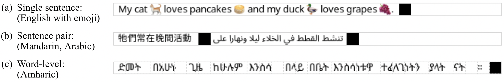 Figure 2: Illustrative examples of our rendered text. pixel natively supports most writing systems, colour emoji (a), and complex text layouts such as right-to-left writing and ligatures (b). Black patches serve as separators and end-of-sequence markers. Blank patches to the right of the end-of-sequence marker are treated as sequence padding. For word-level tasks, horizontal spacing can be added between words (c) so that every patch can be assigned to exactly one word (dotted lines indicate patch boundaries for demonstration).

The key component of pixel is a text renderer that takes one or more pieces of text and renders them onto a blank RGB image \(\bm{x}\in\mathbb{R}^{H\times W\times C}\). We set height \(H=16\) and width \(W=8464\) and choose \(C=3\) RGB input channels, which is equivalent to a square colour image with a \(368\times 368\) resolution and corresponds to a sequence of \(529\) image patches of size \(16\times 16\) pixels.44 4 We chose a sequence length of 529 so that the memory requirements at maximum length are approx. equal to those of bert. Forward and backward passes of the transformer layers at equal length are also equally fast. Figure [2](https://arxiv.org/html/2207.06991#S2.F2 "Figure 2 ‣ 2.1 Text Renderer ‣ 2 Approach ‣ Language Modelling with Pixels") shows examples of text inputs rendered by the text renderer. The renderer supports (a) colour emoji and hieroglyphs scripts, (b) left-to-right and right-to-left writing systems, and (c) text that requires ligatures. Analogous to bert, a sequence can either contain a single paragraph of text or a text pair; we use black \(16\times 16\) patches to serve as separators and end-of-sequence (EOS) markers. Blank (white) patches after the end-of-sequence marker are treated as padding by pixel, where no attention scores or losses are computed. Sequences longer than the maximum length are either truncated or split into multiple sequences. Further technical details about the renderer are provided in Appendix [D](https://arxiv.org/html/2207.06991#A4 "Appendix D Text Renderer Details ‣ Language Modelling with Pixels").

### 2.2 Architecture

pixel-base is a 112M parameter ViT-MAE architecture ([He et al. 2022](https://arxiv.org/html/2207.06991#bib.bib36)) with a 12-layer ViT encoder ([Dosovitskiy et al. 2021](https://arxiv.org/html/2207.06991#bib.bib29)) and an 8-layer Transformer decoder ([Vaswani et al. 2017](https://arxiv.org/html/2207.06991#bib.bib92)). The encoder has \(86\)M parameters and the decoder has \(26\)M parameters, respectively. The 8-layer decoder is not used for downstream tasks. We give an overview of the architecture below, with more details in Appendix [E](https://arxiv.org/html/2207.06991#A5 "Appendix E Architecture & Pretraining Details ‣ Language Modelling with Pixels"). We did not train larger pixel variants for lack of computational resources.

#### Patch Embeddings

The images produced by the text renderer (§[2.1](https://arxiv.org/html/2207.06991#S2.SS1 "2.1 Text Renderer ‣ 2 Approach ‣ Language Modelling with Pixels")) are patch-wise linearly projected to obtain a sequence of patch embeddings with a 16 \(\times\) 16 pixel resolution, to which fixed sinusoidal position embeddings are added.55 5 This is a fast operation that does not require the large text embedding layer found in subword-based models, saving parameters which could in theory be re-allocated to the self-attention stack. We refer to [Xue et al. 2022](https://arxiv.org/html/2207.06991#bib.bib103) for a discussion regarding benefits and drawbacks of re-allocation of embedding layer weights.

Algorithm 1 pixel Span Masking

Input: #Image patches \(N\), masking ratio \(R\), maximum masked span length \(S\), span length cumulative weights \({W=\{w_{1},\ldots,w_{S}\}}\) 

Output: Masked patches \(\mathcal{M}\) 

\(\mathcal{M}\leftarrow\emptyset\) 

repeat

\(s\leftarrow\text{randchoice}({\{1,\ldots,S\},W}\)) 

\(l\leftarrow\text{randint}(0,\text{max}(0,N-s))\) 

\(r\leftarrow l+s\) 

if \(\mathcal{M}\cap\{l-s,\ldots,l-1\}=\emptyset\) and

\(\mathcal{M}\cap\{r+1,\ldots,r+s\}=\emptyset\) then

\(\mathcal{M}\leftarrow\mathcal{M}\cup\{l,\ldots,r\}\) 

end if

until \(\lvert\mathcal{M}\rvert>R\cdot N\) return \(\mathcal{M}\) 

#### Patch Span Masking

Instead of the random masking procedure used in ViT-MAE or block-wise masking in BEiT ([Bao et al. 2022](https://arxiv.org/html/2207.06991#bib.bib11)), pixel uses span masking with a 25% masking ratio as outlined in Algorithm [1](https://arxiv.org/html/2207.06991#alg1 "Algorithm 1 ‣ Patch Embeddings ‣ 2.2 Architecture ‣ 2 Approach ‣ Language Modelling with Pixels"), which masks spans of up to \(S=6\) consecutive image patches with a dynamic number of unmasked patches left between them. The idea behind the span masking approach, inspired by T5 ([Raffel et al. 2020](https://arxiv.org/html/2207.06991#bib.bib72)) and SpanBERT ([Joshi et al. 2020a](https://arxiv.org/html/2207.06991#bib.bib42)), is that it masks more meaningful units of text (full words or phrases) than random masking where the model more often has to fill in (parts of) individual characters, thereby encouraging pixel to model a higher level of abstraction. In practice, span masking was slightly more effective than random masking in early prototypes of pixel. This effect may be less noticeable at higher masking ratios (such as the 75% used in ViT-MAE), when random masking would more often masks consecutive patches. We found 25% masking ratio to work well for pixel-base, which is in line with recent findings for bert-type models of similar size ([Wettig et al. 2022](https://arxiv.org/html/2207.06991#bib.bib99)). We mask spans of \(s\in\{1,2,3,4\}\) patches in length, each with 20% probability, and spans of \(s\in\{5,6\}\) patches with 10% probability each, so \(\mathbb{E}(s)=3.1\).

#### Encoder

Following ViT-MAE ([He et al. 2022](https://arxiv.org/html/2207.06991#bib.bib36)), the pixel encoder only processes unmasked patches (i.e., \(\approx\) 396 “visible” patches at 25% masking) rather than on a sequence including mask tokens, which not only reduces memory requirements and increases training speed, but also has the advantage of not creating a mismatch between pretraining and finetuning. This mismatch would occur when training the encoder with inserted mask tokens because they are not inserted during finetuning ([He et al. 2022](https://arxiv.org/html/2207.06991#bib.bib36)). We also prepend the special CLS embedding to the unmasked patches.66 6 In pretraining, no loss is computed for the CLS embedding but it can be used for finetuning. The resulting CLS and unmasked patches are processed by a 12-layer Transformer encoder to produce a sequence of encoder output representations.

#### Decoder

The pixel decoder first projects the encoder outputs into the same space as the decoder model hidden size. It then inserts learnable mask embeddings at the masked positions; these are what pixel tries to reconstruct at the pixel level. Fixed sinusoidal position embeddings ([Vaswani et al. 2017](https://arxiv.org/html/2207.06991#bib.bib92)) are added to inject order information. After processing this sequence via 8 Transformer layers, a linear projection yields patch logits. Note that the decoder does not have to compute an expensive softmax over a subword vocabulary and circumvents the question of whether to tie the subword embedding weights. pixel is trained with a normalised mean squared error (MSE) pixel reconstruction loss measuring the discrepancy between normalised target image patches and reconstructed patches. This loss is only computed for _masked, non-blank (text)_ patches.

### 2.3 Pretraining

pixel-base is pretrained on a rendered version of the English Wikipedia and the Bookcorpus ([Zhu et al. 2015](https://arxiv.org/html/2207.06991#bib.bib107)), which is roughly equivalent to the bert pretraining data.77 7 We use a similar Wikipedia dump [Devlin et al. 2019](https://arxiv.org/html/2207.06991#bib.bib28) used for bert (February 1, 2018) and a slightly newer version of the Bookcorpus available at <https://huggingface.co/datasets/bookcorpusopen>. For better compute efficiency, we concatenate paragraphs until the maximum sequence length is reached, albeit not across document and book boundaries. Wikipedia has 2B words rendered into 11.4M examples and the Bookcorpus has 1.1B words rendered into 5.4M examples; in total \(\scriptstyle\sim\)3.1B words (bert used 3.3B) rendered into 16.8M examples.88 8 This rendering is quite compact; see Appendix [D](https://arxiv.org/html/2207.06991#A4 "Appendix D Text Renderer Details ‣ Language Modelling with Pixels"). pixel is pretrained for 1M steps with batch size 256 (i.e. \(\scriptstyle\sim\)16 epochs) using the AdamW optimizer ([Kingma & Ba 2015](https://arxiv.org/html/2207.06991#bib.bib46); [Loshchilov & Hutter 2019](https://arxiv.org/html/2207.06991#bib.bib57)) with a linear warmup over the first 50k steps to a peak learning rate of \(1.5\text{\times}{10}^{-4}\) and a cosine decay to a minimum learning rate of \(1\text{\times}{10}^{-5}\). Pretraining took 8 days on 8\(\times\)40GB Nvidia A100 GPUs. We show the loss curve and additional pretraining details in Appendix [E](https://arxiv.org/html/2207.06991#A5 "Appendix E Architecture & Pretraining Details ‣ Language Modelling with Pixels"). We stored pixel checkpoints every 10k steps and make them available alongside the fully trained model on the HuggingFace Hub ([Wolf et al. 2020](https://arxiv.org/html/2207.06991#bib.bib100)), which we hope will be useful to analyze training dynamics of pixel models ([Sellam et al. 2022](https://arxiv.org/html/2207.06991#bib.bib77)). Figure [5](https://arxiv.org/html/2207.06991#A2.F5 "Figure 5 ‣ Appendix B Web Text Reconstructions ‣ Language Modelling with Pixels") in Appendix [B](https://arxiv.org/html/2207.06991#A2 "Appendix B Web Text Reconstructions ‣ Language Modelling with Pixels") shows, for three unseen examples, how pixel learns to model language over the course of pretraining.

### 2.4 Finetuning

pixel can be finetuned for downstream NLP tasks in a similar fashion to bert-like encoders by simply replacing the pixel decoder with a suitable classification head. By truncating or interpolating the sinusoidal position embeddings, we can finetune with sequences shorter or longer than 529 patches, respectively. The latter, in particular, is common in computer vision applications to finetune on higher resolution images ([Touvron et al. 2019](https://arxiv.org/html/2207.06991#bib.bib89); [Kolesnikov et al. 2020](https://arxiv.org/html/2207.06991#bib.bib48); [Dosovitskiy et al. 2021](https://arxiv.org/html/2207.06991#bib.bib29); [He et al. 2022](https://arxiv.org/html/2207.06991#bib.bib36)). For most common NLP tasks, we can typically finetune with sequences shorter than 529 to accelerate training while retaining performance. To demonstrate that pixel supports a variety of downstream tasks, we conduct finetuning experiments in four settings as follows:

#### Word Classification

For word-level tasks like part-of-speech (POS) tagging and named entity recognition (NER), we render each word at the start of a new image patch so that we can create a bijective mapping between words and patches (see Figure [2](https://arxiv.org/html/2207.06991#S2.F2 "Figure 2 ‣ 2.1 Text Renderer ‣ 2 Approach ‣ Language Modelling with Pixels") for an example).99 9 This particular formulation assumes that word boundaries are available. We note that subword-based and character-based models also make this assumption. For further discussion on the implications, see Appendix [F](https://arxiv.org/html/2207.06991#A6 "Appendix F Finetuning Details ‣ Language Modelling with Pixels"). To finetune pixel on these images, we add a linear classifier with dropout. We assign the label of a word only to its first corresponding image patch and compute a cross-entropy loss with softmax.

#### Dependency Parsing

For dependency parsing, we render text as above but obtain word-level representations by mean pooling over all corresponding image patches of a word and employ a biaffine parsing head ([Dozat & Manning 2017](https://arxiv.org/html/2207.06991#bib.bib30)), following the implementation from [Glavaš & Vulić 2021](https://arxiv.org/html/2207.06991#bib.bib34).

#### Sequence Classification

For sequence-level tasks, e.g. in GLUE ([Wang et al. 2018](https://arxiv.org/html/2207.06991#bib.bib95)), we render text as in pretraining. For sentence-pair tasks like natural language inference (NLI) we separate the sentences with a black patch. We finetune with different strategies, including training a classifier on top of (1) the CLS embedding, (2) the mean-pooled or max-pooled representations of all patches, (3) a multi-head attention block. Although we did not notice significant performance differences between them in our experiments, we mainly used option (1), which is exactly the same as in bert, and (2), which has been shown to work well for image classification ([Liang et al. 2022](https://arxiv.org/html/2207.06991#bib.bib53)).

#### Extractive Question Answering (QA)

For extractive QA datasets like SQuAD ([Rajpurkar et al. 2016](https://arxiv.org/html/2207.06991#bib.bib73)), we render the question and context like in sequence-pair tasks above and, same as [Devlin et al. 2019](https://arxiv.org/html/2207.06991#bib.bib28), use a sliding window approach to extract answers for examples exceeding the maximum sequence length. We use a linear classifier to predict the start and end patches of the span containing the answer. Appendix [D](https://arxiv.org/html/2207.06991#A4 "Appendix D Text Renderer Details ‣ Language Modelling with Pixels") explains how we obtain the mapping between characters and rendered text.

## 3 Experiments

We finetune pixel on common NLP tasks and evaluate its syntactic and semantic processing capabilities in English, as well as its adaptability to unseen languages. Table [8](https://arxiv.org/html/2207.06991#A6.T8 "Table 8 ‣ Appendix F Finetuning Details ‣ Language Modelling with Pixels") (Appendix [F](https://arxiv.org/html/2207.06991#A6 "Appendix F Finetuning Details ‣ Language Modelling with Pixels")) describes the languages used in these experiments, and our language and data selection is also motivated below.

### 3.1 Tasks and Languages

#### Syntactic Tasks

We evaluate pixel on part-of-speech (POS) tagging and dependency parsing using data from Universal Dependencies v2.10 treebanks ([Nivre et al. 2020](https://arxiv.org/html/2207.06991#bib.bib64); [Zeman et al. 2022](https://arxiv.org/html/2207.06991#bib.bib105)) for a set of typologically diverse languages that captures a large variety of unseen scripts1010 10 By unseen, we mean not present in the pretraining data.: Arabic (ara), Coptic (cop), English (eng), Hindi (hin), Japanese (jpn), Korean (kor), Tamil (tam), Vietnamese (vie), Chinese (zho).1111 11 Table [10](https://arxiv.org/html/2207.06991#A6.T10 "Table 10 ‣ Appendix F Finetuning Details ‣ Language Modelling with Pixels") in Appendix [F](https://arxiv.org/html/2207.06991#A6 "Appendix F Finetuning Details ‣ Language Modelling with Pixels") gives an overview of the treebanks we use. We compare how well pixel transfers to these languages compared to bert. Note that bert does not support all of these writing systems. However, both models have been trained on the same data. This comparison allows us to gauge the extent to which pixel can overcome the script barrier and vocabulary bottleneck of subword-based models.

#### Semantic Tasks

We evaluate both monolingual (eng) and cross-lingual _word-level_ understanding on MasakhaNER ([Adelani et al. 2021](https://arxiv.org/html/2207.06991#bib.bib2)), a named entity recognition (NER) benchmark for 10 African languages (amh, hau, ibo, kin, lug, luo, pcm, swa, wol, yor), which also includes a copy of the ConLL-2003 dataset ([Tjong Kim Sang & De Meulder 2003](https://arxiv.org/html/2207.06991#bib.bib88), eng; ). For monolingual eng _sentence-level_ understanding we rely on GLUE ([Wang et al. 2018](https://arxiv.org/html/2207.06991#bib.bib95)) and SQuAD ([Rajpurkar et al. 2016](https://arxiv.org/html/2207.06991#bib.bib73)). Finally, we evaluate cross-lingual sentence-level understanding on TyDiQA-GoldP ([Clark et al. 2020](https://arxiv.org/html/2207.06991#bib.bib24)) in the _in-language multitask_ setting where we train on the combined gold data in all 9 target languages (ara, ben, eng, fin, ind, kor, rus, swa, tel) at once, and on two additional larger monolingual extractive question answering (QA) corpora: KorQuAD 1.0 ([Lim et al. 2019](https://arxiv.org/html/2207.06991#bib.bib54), kor; ) and JaQuAD ([So et al. 2022](https://arxiv.org/html/2207.06991#bib.bib82), jpn; ).

### 3.2 Baselines and Finetuning protocols

We compare results to bert-base which is trained on the same data.1212 12 We use bert weights from <https://huggingface.co/bert-base-cased>. We do not compare to newer monolingual English models like roberta ([Liu et al. 2019](https://arxiv.org/html/2207.06991#bib.bib55)), T5 ([Raffel et al. 2020](https://arxiv.org/html/2207.06991#bib.bib72)) or deberta ([He et al. 2021b](https://arxiv.org/html/2207.06991#bib.bib38); [He et al. 2021a](https://arxiv.org/html/2207.06991#bib.bib37)) because these models have been pretrained longer on much larger corpora.1313 13 We do not intend to claim state-of-the-art performance, but to demonstrate that pixel can overcome the vocabulary bottleneck and to provide a starting point for further research on pixel-based encoding of language. Likewise, we do not compare against models trained on massively multilingual corpora. However, to contextualise the performance of pixel in cross-lingual settings, we report results for mbert and, if results are available, for canine ([Clark et al. 2022](https://arxiv.org/html/2207.06991#bib.bib25)). For bert, we use the standard finetuning protocols used by [Devlin et al. 2019](https://arxiv.org/html/2207.06991#bib.bib28) and the same biaffine classifier for parsing as for pixel. We list finetuning details for all tasks in Appendix [F](https://arxiv.org/html/2207.06991#A6 "Appendix F Finetuning Details ‣ Language Modelling with Pixels").

### 3.3 Results

#### Syntactic Tasks

We present results for POS tagging and dependency parsing in Table [1](https://arxiv.org/html/2207.06991#S3.T1 "Table 1 ‣ Syntactic Tasks ‣ 3.3 Results ‣ 3 Experiments ‣ Language Modelling with Pixels"). While bert is slightly better than pixel in the monolingual setting (eng), pixel clearly outperforms bert in the remaining languages. On the lower end, the accuracy gap in favor of pixel in ara and vie, both languages covered by bert’s vocabulary, is relatively small (\(\scriptstyle\sim\)1%). On the higher end, in cop, where bert has an out-of-vocabulary ([UNK]) token ratio of 93%, the gap is \(\scriptstyle\sim\)70% for both tasks. There is a strong correlation1414 14 Pearson correlation \(r=0.9\), \(p<0.001\) for POS tagging, \(r=0.95\), \(p<0.0001\) for dependency parsing. between the proportion of [UNK]s (shown in Table [1](https://arxiv.org/html/2207.06991#S3.T1 "Table 1 ‣ Syntactic Tasks ‣ 3.3 Results ‣ 3 Experiments ‣ Language Modelling with Pixels") on the right) and the performance gap, which shows that pixel overcomes bert’s vocabulary bottleneck. These results are further analysed in Appendix [I](https://arxiv.org/html/2207.06991#A9 "Appendix I Further analysis ‣ Language Modelling with Pixels").

| \(\lvert\theta\rvert\) | eng | ara | cop | hin | jpn | kor | tam | vie | zho  
---|---|---|---|---|---|---|---|---|---|---  
POS Tagging (Accuracy)  
bert | 110M | 97.2 | 95.4 | 26.5 | 86.4 | 87.9 | 60.0 | 45.4 | 84.5 | 58.6  
pixel |  86M | 96.7 | 95.7 | 96.0 | 96.3 | 97.2 | 94.2 | 81.0 | 85.7 | 92.8  
Dependency Parsing (LAS)  
bert | 110M | 90.6 | 77.7 | 13.0 | 75.9 | 73.8 | 30.2 | 15.2 | 49.4 | 28.8  
pixel |  86M | 88.7 | 77.3 | 83.5 | 89.2 | 90.7 | 78.5 | 52.6 | 50.5 | 73.7  
  
| [UNK]% | Fertility  
---|---|---  
eng | 0 | 1.2  
ara | 1.8 | 3.7  
cop | 93.6 | 1.0  
hin | 32.6 | 2.7  
jpn | 45.5 | 1.5  
kor | 84.7 | 1.0  
tam | 82.3 | 1.3  
vie | 4.5 | 2.5  
zho | 73.2 | 1.5  
  
Table 1: Results for pixel and bert finetuned for POS tagging and dependency parsing on various Universal Dependencies treebanks. We report test set results averaged over 5 runs each. \(\lvert\theta\rvert\) denotes the number of model parameters. The table on the right shows bert’s proportion of [UNK]s as a measure of (inverse) vocabulary coverage and fertility ([Ács 2019](https://arxiv.org/html/2207.06991#bib.bib1); [Rust et al. 2021](https://arxiv.org/html/2207.06991#bib.bib75), i.e., number of subwords per tokenized word; ) as a measure of over-segmentation in respective UD treebanks. 

| #l | \(\lvert\theta\rvert\) | eng | amh | hau | ibo | kin | lug | luo | pcm | swa | wol | yor  
---|---|---|---|---|---|---|---|---|---|---|---|---|---  
mbert* | 104 | 179M | 92.2 | 0 | 87.3 | 85.3 | 72.6 | 79.3 | 73.5 | 86.4 | 87.5 | 62.2 | 80.0  
canine-c \+ n-gram* | 104 | 167M | 89.8 | 50.0 | 88.0 | 85.0 | 72.8 | 79.6 | 74.2 | 88.7 | 83.7 | 66.5 | 79.1  
canine-c* | 104 | 127M | 79.8 | 44.6 | 76.1 | 75.6 | 58.3 | 69.4 | 63.4 | 66.6 | 72.7 | 60.7 | 67.9  
bert |  1 | 110M | 92.9 | 0 | 86.6 | 83.5 | 72.0 | 78.4 | 73.2 | 87.0 | 83.3 | 62.2 | 73.8  
pixel |  1 |  86M | 89.5 | 47.7 | 82.4 | 79.9 | 64.2 | 76.5 | 66.6 | 78.7 | 79.8 | 59.7 | 70.7  
  
Table 2: Results for pixel and bert finetuned for NER on MasakhaNER. We report test set \(F_{1}\) scores averaged over 5 runs each. bert outperforms pixel in all of the languages that use Latin script, whereas pixel does better on amh, whose script is not covered by bert’s vocabulary. The performance gap is smaller for languages heavier in diacritics, e.g. yor. It is larger for languages closer to English such as Naija Pidgin (pcm), an English-based creole. #l denotes the number of pretraining languages and * indicates results taken from [Clark et al. 2022](https://arxiv.org/html/2207.06991#bib.bib25) for additional context.

#### Semantic Tasks

We present results for NER in Table [2](https://arxiv.org/html/2207.06991#S3.T2 "Table 2 ‣ Syntactic Tasks ‣ 3.3 Results ‣ 3 Experiments ‣ Language Modelling with Pixels"), for GLUE in Table [3](https://arxiv.org/html/2207.06991#S3.T3 "Table 3 ‣ Semantic Tasks ‣ 3.3 Results ‣ 3 Experiments ‣ Language Modelling with Pixels"), for QA in Table [4](https://arxiv.org/html/2207.06991#S3.T4 "Table 4 ‣ Semantic Tasks ‣ 3.3 Results ‣ 3 Experiments ‣ Language Modelling with Pixels"). We also conduct experiments on XNLI in the _translate-train-all_ setting which we present in Table [16](https://arxiv.org/html/2207.06991#A9.T16 "Table 16 ‣ Appendix I Further analysis ‣ Language Modelling with Pixels") in Appendix [I](https://arxiv.org/html/2207.06991#A9 "Appendix I Further analysis ‣ Language Modelling with Pixels"), for brevity. We find that bert consistently achieves higher performance than pixel in its pretraining language eng. Likewise, it often outperforms on languages using the Latin writing system; for instance in NER where all languages besides amh use Latin script, in QA for fin, ind and swa. Although bert has more trainable parameters, this finding indicates that a pixel model pretrained for the same number of steps as bert is slightly worse at semantic tasks, and it may require longer pretraining or an additional inductive bias to close the performance gap. Similarly, character-based models also tend to underperform subword-based models on NER ([Keren et al. 2022](https://arxiv.org/html/2207.06991#bib.bib45)), here seen by the canine-c results. Since the addition of n-gram embeddings improves the performance of canine-c, likely due to boosting entity memorisation capabilities ([Clark et al. 2022](https://arxiv.org/html/2207.06991#bib.bib25)), we hypothesize that pixel may benefit from equivalent enhancements.

For languages where bert only partially covers the script, such as kor, jpn and tel in QA, pixel consistently outperforms bert, sometimes by large amounts (e.g. , +63 \(F_{1}\) points better on KorQuAD). In the extreme case where bert has no coverage of the script whatsoever, seen in NER for amh, bert fails completely (0 \(F_{1}\)) while pixel outperforms the larger, multilingually trained canine and performs competitively with its n-gram variant. In other words, pixel also overcomes the vocabulary bottleneck of subword-based PLMs in semantics-driven tasks. Note that although bert was trained on English, its vocabulary has a high coverage of the Arabic script, explaining its good performance in ara and urd.1515 15 Arabic is lexically sparse ([Antoun et al. 2020](https://arxiv.org/html/2207.06991#bib.bib6); [Al-Sallab et al. 2017](https://arxiv.org/html/2207.06991#bib.bib4)), so the characters can be covered in the vocabulary. However, it is morphologically complex, which leads to over-segmentation, as the fertility of 3.7 in Table [1](https://arxiv.org/html/2207.06991#S3.T1 "Table 1 ‣ Syntactic Tasks ‣ 3.3 Results ‣ 3 Experiments ‣ Language Modelling with Pixels") shows. This over-segmentation is not necessarily problematic in our selection of tasks ([Keren et al. 2022](https://arxiv.org/html/2207.06991#bib.bib45)), e.g. due to the sliding window in QA, but can be a disadvantage in others ([Rust et al. 2021](https://arxiv.org/html/2207.06991#bib.bib75)).

While the same may apply to languages like ben and rus in QA, where one may otherwise expect pixel to outperform bert, there is an external factor at play; in the standard QA task formulation used by bert, answer spans are extracted by predicting start and end tokens. We adopt this procedure in pixel for simplicity. However, an image patch will often overlap two words at variable positions, so the answer may actually start or end mid-patch. By only predicting on a full-patch level, and extracting the entire content of the patch, pixel will sometimes extract leading and trailing characters that should not be part of the answer, which degrades the \(F_{1}\) score—even though the model may have correctly identified the span. Languages not using whitespace to delimit words are particularly affected, which also explains why pixel is only slightly better than bert in jpn.

| \(\lvert\theta\rvert\) |  | MNLI-M/MM  
---  
393k  
| QQP  
---  
364k  
| QNLI  
---  
105k  
| SST-2  
---  
67k  
| COLA  
---  
8.6k  
| STS-B  
---  
5.8k  
| MRPC  
---  
3.7k  
| RTE  
---  
2.5k  
| WNLI  
---  
635  
AVG  
bert | 110M | 84.0 / 84.2 | 87.6 | 91.0 | 92.6 | 60.3 | 88.8 | 90.2 | 69.5 | 51.8 | 80.0  
pixel |  86M | 78.1 / 78.9 | 84.5 | 87.8 | 89.6 | 38.4 | 81.1 | 88.2 | 60.5 | 53.8 | 74.1  
  
Table 3: Results for pixel and bert finetuned on glue. We report _validation_ set performance averaged over 5 runs. The metrics are \(F_{1}\) score for qqp and mrpc, Matthew’s correlation for cola, Spearman’s \(\rho\) for sts-b, and accuracy for the remaining datasets. pixel achieves non-trivial performance scores on glue, indicating _pixel-based encoders can learn higher-level semantic tasks_ , but performs worse overall than bert, so it may require (a) more pretraining steps than subword-tokenized PLMs or (b) additional inductive bias to acquire the same level of monolingual abstraction.

| #l | \(\lvert\theta\rvert\) | TyDiQA-GoldP | SQuAD | KorQuAD | JaQuAD  
---|---|---|---|---|---|---  
eng | ara | ben | fin | ind | kor | rus | swa | tel | AVG | eng | kor | jpn  
mbert | 104 | 179M | 75.6 | 78.1 | 74.7 | 75.5 | 84.3 | 64.8 | 74.9 | 83.1 | 81.6 | 77.1 | 88.6 | 90.0 | 76.4  
bert |  1 | 110M | 68.5 | 58.0 | 43.2 | 58.3 | 67.1 | 12.4 | 53.2 | 71.3 | 48.2 | 51.5 | 88.2 | 14.9 | 28.8  
pixel |  1 |  86M | 59.6 | 57.3 | 36.3 | 57.1 | 63.6 | 26.1 | 50.5 | 65.9 | 61.7 | 52.3 | 81.4 | 78.0 | 34.1  
  
Table 4: Results for pixel and bert finetuned on extractive QA datasets. We report validation set \(F_{1}\) scores averaged over 5 runs each. Average (avg) scores for TyDiQA-GoldP exclude eng as customary ([Clark et al. 2020](https://arxiv.org/html/2207.06991#bib.bib24)). While bert clearly outperforms pixel in eng, pixel is much better in kor, tel, and jpn—a consequence of the vocabulary bottleneck in bert—thereby gaining an edge on average. In some languages, answer span extraction adversely affects results (see §[3.3](https://arxiv.org/html/2207.06991#S3.SS3 "3.3 Results ‣ 3 Experiments ‣ Language Modelling with Pixels")).

Generally, and in particular when transferring to unseen scripts, we find that pixel performs best when finetuning on larger corpora. An example of this behaviour can be seen in QA, where pixel performs significantly better on KorQuAD (60k examples) than the kor subset of TyDi (1.6k examples). While large corpora may often not be available when dealing with unseen scripts, we hypothesize that multilingual pretraining will alleviate the need for long finetuning, while potentially being even more conducive to _positive transfer_ ([Conneau et al. 2020](https://arxiv.org/html/2207.06991#bib.bib27); [Chau et al. 2020](https://arxiv.org/html/2207.06991#bib.bib20); [Pfeiffer et al. 2021](https://arxiv.org/html/2207.06991#bib.bib68)) by not being vocabulary-bottlenecked.

## 4 Robustness to Orthographic Attacks and Code-Switching

Informal text, commonly found on social media, often contains orthographic noise such as typos and other variations ([Baldwin et al. 2015](https://arxiv.org/html/2207.06991#bib.bib10); [van Esch et al. 2019](https://arxiv.org/html/2207.06991#bib.bib91); [Caswell et al. 2020](https://arxiv.org/html/2207.06991#bib.bib19)). Previous work has demonstrated the vulnerability of pretrained language models to character-level adversarial attacks and noise ([Sun et al. 2020](https://arxiv.org/html/2207.06991#bib.bib85); [Eger & Benz 2020](https://arxiv.org/html/2207.06991#bib.bib32)), with text normalization typically required to maintain performance ([Pruthi et al. 2019](https://arxiv.org/html/2207.06991#bib.bib70); [Keller et al. 2021](https://arxiv.org/html/2207.06991#bib.bib44)). To evaluate pixel’s robustness to textual noise and variation and inspired by the robustness tests of [Salesky et al. 2021](https://arxiv.org/html/2207.06991#bib.bib76), we experiment with the Zeroé benchmark ([Eger & Benz 2020](https://arxiv.org/html/2207.06991#bib.bib32); [Keller et al. 2021](https://arxiv.org/html/2207.06991#bib.bib44)) which covers a variety of low-level orthographic attacks as illustrated in Table [13](https://arxiv.org/html/2207.06991#A7.T13 "Table 13 ‣ Appendix G Examples of Zeroé orthographic attacks ‣ Language Modelling with Pixels"). We replace their version of visual attacks with the Unicode Technical Standard #39 set of visually-confusable characters.1616 16 <https://util.unicode.org/UnicodeJsps/confusables.jsp> We apply Zeroé attacks during finetuning and evaluation of two English downstream tasks, POS tagging and NLI ([Bowman et al. 2015](https://arxiv.org/html/2207.06991#bib.bib15)), where we expect models to rely on different levels of abstraction.

Figures [8](https://arxiv.org/html/2207.06991#A7.F8 "Figure 8 ‣ Appendix G Examples of Zeroé orthographic attacks ‣ Language Modelling with Pixels") and [9](https://arxiv.org/html/2207.06991#A7.F9 "Figure 9 ‣ Appendix G Examples of Zeroé orthographic attacks ‣ Language Modelling with Pixels") in Appendix [G](https://arxiv.org/html/2207.06991#A7 "Appendix G Examples of Zeroé orthographic attacks ‣ Language Modelling with Pixels") compare pixel and bert across three levels of token-level noise for POS tagging and NLI. There is little impact on POS tagging performance with either model from most low-level attacks, with the exception of visually-confusable character substitutions (confusable); here pixel expectedly maintains performance above 92% as it generalizes across orthographic similarities but bert drops to 38%. For NLI, both models are negatively affected, but pixel exhibits less degradation than bert with higher proportions of noise, with the impact varying across the types of attacks which each affect subword tokenization differently. Figure [3](https://arxiv.org/html/2207.06991#S5.F3 "Figure 3 ‣ 5 Related Work ‣ Language Modelling with Pixels") shows relevancy heatmaps ([Chefer et al. 2021](https://arxiv.org/html/2207.06991#bib.bib21)) for SNLI predictions made with and without confusable substitutions. The heatmaps are similarly clear with and without noise, providing qualitative evidence that pixel is indeed robust to the noise. The illustrated robustness may be dependent upon finetuning, however; we find that pixel can struggle in zero-shot applications when text is rendered differently from observed during pretraining (see Appendix [D](https://arxiv.org/html/2207.06991#A4 "Appendix D Text Renderer Details ‣ Language Modelling with Pixels") on using different fonts). Future work could explore the impact of data augmentation during pretraining on pixel’s robustness and ability to transfer across scripts. Furthermore, it would be interesting to investigate how the choice of font influences the search space during reconstruction of masked patches ([Bland et al. 2022](https://arxiv.org/html/2207.06991#bib.bib12)).

| POS Tagging | Named Entity Recognition  
---|---|---  
spa-eng | hin-eng | spa-eng | hin-eng | msa-ea  
mbert | 97.1 | 86.3 | 64.0 | 72.6 | 65.4  
bert | 96.9 | 87.0 | 61.1 | 74.5 | 59.4  
pixel | 96.8 | 88.2 | 61.0 | 73.0 | 63.7  
  
Table 5: Code-switching results on LinCE.

In addition to robustness to orthographic noise, dealing with character-level substitutions is important for effectively modelling different morphological forms. There are also many types of higher-level token, phrase or sequence-level variations such as code-switching—when a speaker alternates between two or more languages in the same utterance, while being grammatically consistent in each language ([Joshi 1982](https://arxiv.org/html/2207.06991#bib.bib41))—or the lexical substitutions in social media text. We evaluate pixel on the LinCE benchmark ([Aguilar et al. 2020](https://arxiv.org/html/2207.06991#bib.bib3)), which includes core tasks and downstream applications for linguistic code-switching. pixel is fine-tuned on POS Tagging and NER in Spanish-English, Hindi-English and Modern Standard Arabic-Egyptian Arabic. Table [5](https://arxiv.org/html/2207.06991#S4.T5 "Table 5 ‣ 4 Robustness to Orthographic Attacks and Code-Switching ‣ Language Modelling with Pixels") shows that pixel and bert perform similarly on spa-eng tasks, with bert outperforming pixel on NER for (romanised) hin-eng. On the other tasks, pixel performs better than bert and even outperforms mbert on hin-eng POS tagging. The gap between mbert and pixel is larger on Arabic scripts, which were extensively seen by mbert during pretraining.

## 5 Related Work

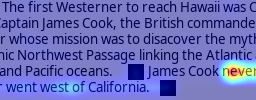

(a) 0%, _contradiction_

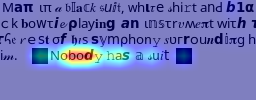

(b) 80%, _contradiction_

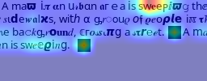

(c) 80%, _entailment_

Figure 3: Visual explanations of correct pixel predictions (for classes _contradiction_ and _entailment_) for NLI examples with 0% and 80% confusable substitutions using method by [Chefer et al. 2021](https://arxiv.org/html/2207.06991#bib.bib21), providing qualitative evidence for pixel’s robustness to character-level noise and the interpretability of its predictions. Red heatmap regions represent high relevancy.

The question of vocabulary construction is an open problem in NLP, especially in a multilingual context.1717 17 See [Mielke et al. 2021](https://arxiv.org/html/2207.06991#bib.bib61) for a recent, comprehensive survey on open-vocabulary modeling and tokenization. The most widely used language models, e.g. BERT, RoBERTa, T5, GPT-2 inter alia, rely on different tokenizers, such as WordPiece ([Devlin et al. 2019](https://arxiv.org/html/2207.06991#bib.bib28)), Byte-Pair Encoding ([Sennrich et al. 2016](https://arxiv.org/html/2207.06991#bib.bib78), BPE; ) and Unigram LM ([Kudo 2018](https://arxiv.org/html/2207.06991#bib.bib49)). There is an established ecosystem around subword tokenizers, such as the SentencePiece ([Kudo & Richardson 2018](https://arxiv.org/html/2207.06991#bib.bib50)) and HuggingFace Tokenizers.

In a monolingual context and for some languages like English, vocabularies of subwords are a good tradeoff between vocabularies of characters and vocabularies of words. When representing a large number of languages in multilingual PLMs like mBERT and XLM-R, adequately representing the vocabulary of each individual language would be computationally prohibitive. The tokenization then becomes a bottleneck when trying to scale up to a large number of languages ([Conneau et al. 2020](https://arxiv.org/html/2207.06991#bib.bib27); [Rust et al. 2021](https://arxiv.org/html/2207.06991#bib.bib75)), which manifests itself in degraded cross-lingual performance to languages and language families that are underrepresented in the data used for training multilingual PLMs. There are large inequalities in the performance of these models across typologically diverse languages ([Wu & Dredze 2020](https://arxiv.org/html/2207.06991#bib.bib101); [Lauscher et al. 2020](https://arxiv.org/html/2207.06991#bib.bib51)). This issue is further exacerbated by tokenizations out-of-the-box not being compatible across languages ([Maronikolakis et al. 2021](https://arxiv.org/html/2207.06991#bib.bib60)). Language imbalance and poor character coverage in the vocabulary can also decrease downstream performance ([Zhang et al. 2022](https://arxiv.org/html/2207.06991#bib.bib106)). To some extent, these problems can be attenuated through techniques such as subword mapping ([Vernikos & Popescu-Belis 2021](https://arxiv.org/html/2207.06991#bib.bib93)), transliteration ([Moosa et al. 2022](https://arxiv.org/html/2207.06991#bib.bib62)), leveraging lexical overlap ([Patil et al. 2022](https://arxiv.org/html/2207.06991#bib.bib67)), vocabulary clustering and reallocation ([Chung et al. 2020](https://arxiv.org/html/2207.06991#bib.bib23)), continued or language-adaptive pretraining ([Ebrahimi & Kann 2021](https://arxiv.org/html/2207.06991#bib.bib31)), adaptation via bilingual lexica ([Wang et al. 2022](https://arxiv.org/html/2207.06991#bib.bib97)), and embedding matrix adaptation ([Artetxe et al. 2020](https://arxiv.org/html/2207.06991#bib.bib7)). However, these are post-hoc workarounds to expand model vocabularies after training. They do not provide a direct solution to the vocabulary bottleneck problem.

Some subword-based algorithms can also produce undesirable segmentations for morphologically rich languages ([Klein & Tsarfaty 2020](https://arxiv.org/html/2207.06991#bib.bib47); [Amrhein & Sennrich 2021](https://arxiv.org/html/2207.06991#bib.bib5)), so dedicated morphologically-aware tokenizers have been developed (e.g. [Smit et al. 2014](https://arxiv.org/html/2207.06991#bib.bib81)), but this process often requires expert-level knowledge and may only work for individual languages.

Due to the limitations of subword vocabularies in multilingual language modelling, some works have used vocabularies over characters ([Lee et al. 2017](https://arxiv.org/html/2207.06991#bib.bib52); [Ma et al. 2020](https://arxiv.org/html/2207.06991#bib.bib58), _inter alia_) or bytes ([Wang et al. 2020](https://arxiv.org/html/2207.06991#bib.bib96); [Wei et al. 2021](https://arxiv.org/html/2207.06991#bib.bib98)). These provide benefits over purely subword-based models in terms of robustness and most of them are readily applicable in a multilingual context,1818 18 Character-aware models are not directly applicable to languages that do not use whitespace to delimit sentences ([Tay et al. 2021](https://arxiv.org/html/2207.06991#bib.bib86)), for example. but they typically come at the cost of increased sequence lengths or latency. Also, such models cannot exploit orthographic similarities between characters across and within scripts and do not account for the fact that meaning of language may be carried visually such as in writing systems that are (partially) logographic like Chinese, in ancient hieroglyphs, or when using emoji.

Finally, some works have developed pixel-based approaches. [Broscheit 2018](https://arxiv.org/html/2207.06991#bib.bib16) embedded images of Chinese glyphs but still relied on a fixed vocabulary. [Wu et al. 2019](https://arxiv.org/html/2207.06991#bib.bib102) combined character-level images and embeddings for a variety of Chinese tasks. [Radford et al. 2021](https://arxiv.org/html/2207.06991#bib.bib71) trained a linear probe for CLIP, which also incorporates a tokenizer, on a rendered version of SST-2 ([Socher et al. 2013](https://arxiv.org/html/2207.06991#bib.bib83)). Other works have trained pixel-based models that removed the need for a fixed vocabulary: [Sun et al. 2019](https://arxiv.org/html/2207.06991#bib.bib84) trained a convolutional sentiment classifier on pixels. [Mansimov et al. 2020](https://arxiv.org/html/2207.06991#bib.bib59) used images of text for in-image MT. [Salesky et al. 2021](https://arxiv.org/html/2207.06991#bib.bib76) employed a convolutional embedder for a Transformer-based MT system with a subword-based decoder. Our method differs from these in that it provides a general-purpose language encoder that completely removes the need for a vocabulary.

## 6 Conclusion

This paper introduced pixel, a pretrained language model that renders text as images, which allows it to represent any written language that can be typeset using its text renderer. pixel was pretrained on the predominantly English Wikipedia and Bookcorpus datasets, and evaluated on part-of-speech tagging, dependency parsing, question answering, and language understanding tasks. The results demonstrate that pixel readily transfers to unseen scripts, as shown by its performance on 14 scripts across 32 languages. pixel currently lags behind bert when processing languages with a Latin script, including English; however, pixel is more robust than bert against low-level orthographic attacks and performs competitively to bert and mBert on linguistic code-switching tasks. Overall, these results show that pixel-based representations are a strong backbone for cross-lingual and cross-script transfer learning. The limitations of this work are discussed in Appendix [J](https://arxiv.org/html/2207.06991#A10 "Appendix J Limitations ‣ Language Modelling with Pixels").

In future work, we will investigate inductive biases and additional objectives that can better capture long-range dependencies in pixel models. We hope that this will help overcome the limits of pixel in semantic processing. We also plan to pretrain pixel on multilingual text with a view to further improving its cross-script and cross-lingual abilities. This will also allow us to more fairly compare pixel-based models against larger subword-based and tokenization-free multilingual models. Finally, we will also develop new rendering and finetuning formulations that are better tailored to pixel-based models, e.g. for improving downstream question answering.

## Acknowledgments

We thank Ákos Kádár, Barbara Plank, and Kris Cao for their comments on an earlier draft. We also thank Davide Rigoni, Rita Ramos, Stella Frank, and members of the CoAStaL and LAMP groups for discussions. Miryam de Lhoneux is funded by the Swedish Research Council (grant 2020-00437). Phillip Rust is funded by the Novo Nordisk Foundation (grant NNF 20SA0066568). Jonas F. Lotz is funded by the ROCKWOOL Foundation (grant 1242).  Emanuele Bugliarello is supported by funding from the European Union’s Horizon 2020 research and innovation programme under the Marie Skłodowska-Curie grant agreement No 801199. Elizabeth Salesky is supported by the Apple Scholars in AI/ML fellowship. Desmond Elliott is partially supported by the Innovation Foundation (grant 0176-00013B) and the Novo Nordisk Foundation (grant NNF 20SA0066568). This work was supported by a research grant (VIL53122) from VILLUM FONDEN. The computing power was generously supported by EuroHPC grants 2010PA5869, 2021D02-068, and 2021D05-141, and with Cloud TPUs from Google’s TPU Research Cloud (TRC).

## References

  * Ács (2019) Judit Ács.  Exploring BERT’s Vocabulary.  _Blog Post_ , 2019.  URL <http://juditacs.github.io/2019/02/19/bert-tokenization-stats.html>. 
  * Adelani et al. (2021) David Ifeoluwa Adelani, Jade Abbott, Graham Neubig, Daniel D’souza, Julia Kreutzer, Constantine Lignos, Chester Palen-Michel, Happy Buzaaba, Shruti Rijhwani, Sebastian Ruder, Stephen Mayhew, Israel Abebe Azime, Shamsuddeen H. Muhammad, Chris Chinenye Emezue, Joyce Nakatumba-Nabende, Perez Ogayo, Aremu Anuoluwapo, Catherine Gitau, Derguene Mbaye, Jesujoba Alabi, Seid Muhie Yimam, Tajuddeen Rabiu Gwadabe, Ignatius Ezeani, Rubungo Andre Niyongabo, Jonathan Mukiibi, Verrah Otiende, Iroro Orife, Davis David, Samba Ngom, Tosin Adewumi, Paul Rayson, Mofetoluwa Adeyemi, Gerald Muriuki, Emmanuel Anebi, Chiamaka Chukwuneke, Nkiruka Odu, Eric Peter Wairagala, Samuel Oyerinde, Clemencia Siro, Tobius Saul Bateesa, Temilola Oloyede, Yvonne Wambui, Victor Akinode, Deborah Nabagereka, Maurice Katusiime, Ayodele Awokoya, Mouhamadane MBOUP, Dibora Gebreyohannes, Henok Tilaye, Kelechi Nwaike, Degaga Wolde, Abdoulaye Faye, Blessing Sibanda, Orevaoghene Ahia, Bonaventure F. P. Dossou, Kelechi Ogueji, Thierno Ibrahima DIOP, Abdoulaye Diallo, Adewale Akinfaderin, Tendai Marengereke, and Salomey Osei.  MasakhaNER: Named Entity Recognition for African Languages.  _Transactions of the Association for Computational Linguistics_ , 9:1116–1131, 10 2021.  ISSN 2307-387X.  doi: 10.1162/tacl_a_00416.  URL <https://doi.org/10.1162/tacl_a_00416>. 
  * Aguilar et al. (2020) Gustavo Aguilar, Sudipta Kar, and Thamar Solorio.  LinCE: A Centralized Benchmark for Linguistic Code-switching Evaluation.  In _Proceedings of The 12th Language Resources and Evaluation Conference_ , pp. 1803–1813, Marseille, France, May 2020. European Language Resources Association.  ISBN 979-10-95546-34-4.  URL <https://www.aclweb.org/anthology/2020.lrec-1.223>. 
  * Al-Sallab et al. (2017) Ahmad Al-Sallab, Ramy Baly, Hazem Hajj, Khaled Bashir Shaban, Wassim El-Hajj, and Gilbert Badaro.  Aroma: A recursive deep learning model for opinion mining in arabic as a low resource language.  _ACM Trans. Asian Low-Resour. Lang. Inf. Process._ , 16(4), jul 2017.  ISSN 2375-4699.  doi: 10.1145/3086575.  URL <https://doi.org/10.1145/3086575>. 
  * Amrhein & Sennrich (2021) Chantal Amrhein and Rico Sennrich.  How suitable are subword segmentation strategies for translating non-concatenative morphology?  In _Findings of the Association for Computational Linguistics: EMNLP 2021_ , pp. 689–705, Punta Cana, Dominican Republic, November 2021. Association for Computational Linguistics.  doi: 10.18653/v1/2021.findings-emnlp.60.  URL <https://aclanthology.org/2021.findings-emnlp.60>. 
  * Antoun et al. (2020) Wissam Antoun, Fady Baly, and Hazem Hajj.  AraBERT: Transformer-based model for Arabic language understanding.  In _Proceedings of the 4th Workshop on Open-Source Arabic Corpora and Processing Tools, with a Shared Task on Offensive Language Detection_ , pp. 9–15, Marseille, France, May 2020. European Language Resource Association.  ISBN 979-10-95546-51-1.  URL <https://aclanthology.org/2020.osact-1.2>. 
  * Artetxe et al. (2020) Mikel Artetxe, Sebastian Ruder, and Dani Yogatama.  On the cross-lingual transferability of monolingual representations.  In _Proceedings of the 58th Annual Meeting of the Association for Computational Linguistics_ , pp. 4623–4637, Online, July 2020. Association for Computational Linguistics.  doi: 10.18653/v1/2020.acl-main.421.  URL <https://aclanthology.org/2020.acl-main.421>. 
  * Asahara et al. (2018) Masayuki Asahara, Hiroshi Kanayama, Takaaki Tanaka, Yusuke Miyao, Sumire Uematsu, Shinsuke Mori, Yuji Matsumoto, Mai Omura, and Yugo Murawaki.  Universal Dependencies version 2 for Japanese.  In _Proceedings of the Eleventh International Conference on Language Resources and Evaluation (LREC 2018)_ , Miyazaki, Japan, May 2018. European Language Resources Association (ELRA).  URL <https://aclanthology.org/L18-1287>. 
  * Ba et al. (2016) Lei Jimmy Ba, Jamie Ryan Kiros, and Geoffrey E. Hinton.  Layer normalization.  _arXiv preprint_ , 2016.  URL <http://arxiv.org/abs/1607.06450>. 
  * Baldwin et al. (2015) Timothy Baldwin, Marie Catherine de Marneffe, Bo Han, Young-Bum Kim, Alan Ritter, and Wei Xu.  Shared tasks of the 2015 workshop on noisy user-generated text: Twitter lexical normalization and named entity recognition.  In _Proceedings of the Workshop on Noisy User-generated Text_ , pp. 126–135, Beijing, China, July 2015. Association for Computational Linguistics.  doi: 10.18653/v1/W15-4319.  URL <https://aclanthology.org/W15-4319>. 
  * Bao et al. (2022) Hangbo Bao, Li Dong, Songhao Piao, and Furu Wei.  BEiT: BERT pre-training of image transformers.  In _International Conference on Learning Representations_ , 2022.  URL <https://openreview.net/forum?id=p-BhZSz59o4>. 
  * Bland et al. (2022) Maxwell Troy Bland, Anushya Iyer, and Kirill Levchenko.  Story beyond the eye: Glyph positions break PDF text redaction.  _arXiv preprint_ , 2022.  URL <https://arxiv.org/abs/2206.02285>. 
  * Blevins & Zettlemoyer (2022) Terra Blevins and Luke Zettlemoyer.  Language contamination explains the cross-lingual capabilities of english pretrained models.  _arXiv preprint_ , 2022.  URL <https://doi.org/10.48550/arXiv.2204.08110>. 
  * Blevins et al. (2022) Terra Blevins, Hila Gonen, and Luke Zettlemoyer.  Analyzing the mono-and cross-lingual pretraining dynamics of multilingual language models.  _arXiv preprint_ , 2022.  URL <https://arxiv.org/abs/2205.11758>. 
  * Bowman et al. (2015) Samuel R. Bowman, Gabor Angeli, Christopher Potts, and Christopher D. Manning.  A large annotated corpus for learning natural language inference.  In _Proceedings of the 2015 Conference on Empirical Methods in Natural Language Processing_ , pp. 632–642, Lisbon, Portugal, September 2015\. Association for Computational Linguistics.  doi: 10.18653/v1/D15-1075.  URL <https://aclanthology.org/D15-1075>. 
  * Broscheit (2018) Samuel Broscheit.  Learning distributional token representations from visual features.  In _Proceedings of The Third Workshop on Representation Learning for NLP_ , pp. 187–194, Melbourne, Australia, July 2018. Association for Computational Linguistics.  doi: 10.18653/v1/W18-3025.  URL <https://aclanthology.org/W18-3025>. 
  * Brown et al. (2020) Tom Brown, Benjamin Mann, Nick Ryder, Melanie Subbiah, Jared D Kaplan, Prafulla Dhariwal, Arvind Neelakantan, Pranav Shyam, Girish Sastry, Amanda Askell, Sandhini Agarwal, Ariel Herbert-Voss, Gretchen Krueger, Tom Henighan, Rewon Child, Aditya Ramesh, Daniel Ziegler, Jeffrey Wu, Clemens Winter, Chris Hesse, Mark Chen, Eric Sigler, Mateusz Litwin, Scott Gray, Benjamin Chess, Jack Clark, Christopher Berner, Sam McCandlish, Alec Radford, Ilya Sutskever, and Dario Amodei.  Language models are few-shot learners.  In H. Larochelle, M. Ranzato, R. Hadsell, M.F. Balcan, and H. Lin (eds.), _Advances in Neural Information Processing Systems_ , volume 33, pp. 1877–1901. Curran Associates, Inc., 2020.  URL <https://proceedings.neurips.cc/paper/2020/file/1457c0d6bfcb4967418bfb8ac142f64a-Paper.pdf>. 
  * Bugliarello et al. (2022) Emanuele Bugliarello, Fangyu Liu, Jonas Pfeiffer, Siva Reddy, Desmond Elliott, Edoardo Maria Ponti, and Ivan Vulić.  IGLUE: A benchmark for transfer learning across modalities, tasks, and languages.  In _Proceedings of the 39th International Conference on Machine Learning_ , Balitmore, MA, July 2022. PMLR.  URL <https://arxiv.org/abs/2201.11732>. 
  * Caswell et al. (2020) Isaac Caswell, Theresa Breiner, Daan van Esch, and Ankur Bapna.  Language id in the wild: Unexpected challenges on the path to a thousand-language web text corpus.  In _Proceedings of the 28th International Conference on Computational Linguistics_ , pp. 6588–6608, Barcelona, Spain (Online), 2020\. Association for Computational Linguistics.  URL <https://aclanthology.org/2020.coling-main.579.pdf>. 
  * Chau et al. (2020) Ethan C. Chau, Lucy H. Lin, and Noah A. Smith.  Parsing with multilingual BERT, a small corpus, and a small treebank.  In _Findings of the Association for Computational Linguistics: EMNLP 2020_ , pp. 1324–1334, Online, November 2020. Association for Computational Linguistics.  doi: 10.18653/v1/2020.findings-emnlp.118.  URL <https://aclanthology.org/2020.findings-emnlp.118>. 
  * Chefer et al. (2021) Hila Chefer, Shir Gur, and Lior Wolf.  Generic attention-model explainability for interpreting bi-modal and encoder-decoder transformers.  In _Proceedings of the IEEE/CVF International Conference on Computer Vision (ICCV)_ , pp. 397–406, October 2021.  URL <https://openaccess.thecvf.com/content/ICCV2021/papers/Chefer_Generic_Attention-Model_Explainability_for_Interpreting_Bi-Modal_and_Encoder-Decoder_Transformers_ICCV_2021_paper.pdf>. 
  * Chun et al. (2018) Jayeol Chun, Na-Rae Han, Jena D. Hwang, and Jinho D. Choi.  Building Universal Dependency treebanks in Korean.  In _Proceedings of the Eleventh International Conference on Language Resources and Evaluation (LREC 2018)_ , Miyazaki, Japan, May 2018. European Language Resources Association (ELRA).  URL <https://aclanthology.org/L18-1347>. 
  * Chung et al. (2020) Hyung Won Chung, Dan Garrette, Kiat Chuan Tan, and Jason Riesa.  Improving multilingual models with language-clustered vocabularies.  In _Proceedings of the 2020 Conference on Empirical Methods in Natural Language Processing (EMNLP)_ , pp. 4536–4546, Online, November 2020\. Association for Computational Linguistics.  doi: 10.18653/v1/2020.emnlp-main.367.  URL <https://aclanthology.org/2020.emnlp-main.367>. 
  * Clark et al. (2020) Jonathan H. Clark, Eunsol Choi, Michael Collins, Dan Garrette, Tom Kwiatkowski, Vitaly Nikolaev, and Jennimaria Palomaki.  TyDi QA: A benchmark for information-seeking question answering in typologically diverse languages.  _Transactions of the Association for Computational Linguistics_ , 8:454–470, 2020.  doi: 10.1162/tacl_a_00317.  URL <https://aclanthology.org/2020.tacl-1.30>. 
  * Clark et al. (2022) Jonathan H. Clark, Dan Garrette, Iulia Turc, and John Wieting.  Canine: Pre-training an efficient tokenization-free encoder for language representation.  _Trans. Assoc. Comput. Linguistics_ , 10:73–91, 2022.  doi: 10.1162/tacl\\_a\\_00448.  URL <https://doi.org/10.1162/tacl_a_00448>. 
  * Conneau et al. (2018) Alexis Conneau, Ruty Rinott, Guillaume Lample, Adina Williams, Samuel Bowman, Holger Schwenk, and Veselin Stoyanov.  XNLI: Evaluating cross-lingual sentence representations.  In _Proceedings of the 2018 Conference on Empirical Methods in Natural Language Processing_ , pp. 2475–2485, Brussels, Belgium, October-November 2018. Association for Computational Linguistics.  doi: 10.18653/v1/D18-1269.  URL <https://aclanthology.org/D18-1269>. 
  * Conneau et al. (2020) Alexis Conneau, Kartikay Khandelwal, Naman Goyal, Vishrav Chaudhary, Guillaume Wenzek, Francisco Guzmán, Edouard Grave, Myle Ott, Luke Zettlemoyer, and Veselin Stoyanov.  Unsupervised cross-lingual representation learning at scale.  In _Proceedings of the 58th Annual Meeting of the Association for Computational Linguistics_ , pp. 8440–8451, Online, July 2020. Association for Computational Linguistics.  doi: 10.18653/v1/2020.acl-main.747.  URL <https://aclanthology.org/2020.acl-main.747>. 
  * Devlin et al. (2019) Jacob Devlin, Ming-Wei Chang, Kenton Lee, and Kristina Toutanova.  BERT: Pre-training of deep bidirectional transformers for language understanding.  In _Proceedings of the 2019 Conference of the North American Chapter of the Association for Computational Linguistics: Human Language Technologies, Volume 1 (Long and Short Papers)_ , pp. 4171–4186, Minneapolis, Minnesota, June 2019. Association for Computational Linguistics.  doi: 10.18653/v1/N19-1423.  URL <https://aclanthology.org/N19-1423>. 
  * Dosovitskiy et al. (2021) Alexey Dosovitskiy, Lucas Beyer, Alexander Kolesnikov, Dirk Weissenborn, Xiaohua Zhai, Thomas Unterthiner, Mostafa Dehghani, Matthias Minderer, Georg Heigold, Sylvain Gelly, Jakob Uszkoreit, and Neil Houlsby.  An image is worth 16x16 words: Transformers for image recognition at scale.  In _International Conference on Learning Representations_ , 2021.  URL <https://openreview.net/forum?id=YicbFdNTTy>. 
  * Dozat & Manning (2017) Timothy Dozat and Christopher D. Manning.  Deep biaffine attention for neural dependency parsing.  In _5th International Conference on Learning Representations, ICLR 2017, Toulon, France, April 24-26, 2017, Conference Track Proceedings_. OpenReview.net, 2017.  URL <https://openreview.net/forum?id=Hk95PK9le>. 
  * Ebrahimi & Kann (2021) Abteen Ebrahimi and Katharina Kann.  How to adapt your pretrained multilingual model to 1600 languages.  In _Proceedings of the 59th Annual Meeting of the Association for Computational Linguistics and the 11th International Joint Conference on Natural Language Processing (Volume 1: Long Papers)_ , pp. 4555–4567, Online, August 2021. Association for Computational Linguistics.  doi: 10.18653/v1/2021.acl-long.351.  URL <https://aclanthology.org/2021.acl-long.351>. 
  * Eger & Benz (2020) Steffen Eger and Yannik Benz.  From hero to zéroe: A benchmark of low-level adversarial attacks.  In _Proceedings of the 1st Conference of the Asia-Pacific Chapter of the Association for Computational Linguistics and the 10th International Joint Conference on Natural Language Processing_ , pp. 786–803, Suzhou, China, December 2020. Association for Computational Linguistics.  URL <https://aclanthology.org/2020.aacl-main.79>. 
  * Gao et al. (2020) Leo Gao, Stella Biderman, Sid Black, Laurence Golding, Travis Hoppe, Charles Foster, Jason Phang, Horace He, Anish Thite, Noa Nabeshima, et al.  The pile: An 800gb dataset of diverse text for language modeling.  _arXiv preprint_ , 2020.  URL <https://arxiv.org/abs/2101.00027>. 
  * Glavaš & Vulić (2021) Goran Glavaš and Ivan Vulić.  Is supervised syntactic parsing beneficial for language understanding tasks? an empirical investigation.  In _Proceedings of the 16th Conference of the European Chapter of the Association for Computational Linguistics: Main Volume_ , pp. 3090–3104, Online, April 2021. Association for Computational Linguistics.  doi: 10.18653/v1/2021.eacl-main.270.  URL <https://aclanthology.org/2021.eacl-main.270>. 
  * Hajič et al. (2009) Jan Hajič, Otakar Smrž, Petr Zemánek, Petr Pajas, Jan Šnaidauf, Emanuel Beška, Jakub Kracmar, and Kamila Hassanová.  Prague arabic dependency treebank 1.0, 2009.  URL <https://ufal.mff.cuni.cz/padt/PADT_1.0/docs/index.html>. 
  * He et al. (2022) Kaiming He, Xinlei Chen, Saining Xie, Yanghao Li, Piotr Dollár, and Ross Girshick.  Masked autoencoders are scalable vision learners.  In _Proceedings of the IEEE/CVF Conference on Computer Vision and Pattern Recognition_ , pp. 16000–16009, 2022.  URL <https://openaccess.thecvf.com/content/CVPR2022/papers/He_Masked_Autoencoders_Are_Scalable_Vision_Learners_CVPR_2022_paper.pdf>. 
  * He et al. (2021a) Pengcheng He, Jianfeng Gao, and Weizhu Chen.  Debertav3: Improving deberta using electra-style pre-training with gradient-disentangled embedding sharing.  _arXiv preprint_ , 2021a.  URL <https://arxiv.org/abs/2111.09543>. 
  * He et al. (2021b) Pengcheng He, Xiaodong Liu, Jianfeng Gao, and Weizhu Chen.  Deberta: Decoding-enhanced BERT with disentangled attention.  In _International Conference on Learning Representations_ , 2021b.  URL <https://openreview.net/forum?id=XPZIaotutsD>. 
  * Hendrycks & Gimpel (2016) Dan Hendrycks and Kevin Gimpel.  Bridging nonlinearities and stochastic regularizers with gaussian error linear units.  _arXiv preprint_ , 2016.  URL <http://arxiv.org/abs/1606.08415>. 
  * Hirschberg & Manning (2015) Julia Hirschberg and Christopher D Manning.  Advances in natural language processing.  _Science_ , 349(6245):261–266, 2015.  URL <https://cs224d.stanford.edu/papers/advances.pdf>. 
  * Joshi (1982) Aravind K. Joshi.  Processing of sentences with intra-sentential code-switching.  In _Coling 1982: Proceedings of the Ninth International Conference on Computational Linguistics_ , 1982.  URL <https://aclanthology.org/C82-1023>. 
  * Joshi et al. (2020a) Mandar Joshi, Danqi Chen, Yinhan Liu, Daniel S. Weld, Luke Zettlemoyer, and Omer Levy.  SpanBERT: Improving pre-training by representing and predicting spans.  _Transactions of the Association for Computational Linguistics_ , 8:64–77, 2020a.  doi: 10.1162/tacl_a_00300.  URL <https://aclanthology.org/2020.tacl-1.5>. 
  * Joshi et al. (2020b) Pratik Joshi, Sebastin Santy, Amar Budhiraja, Kalika Bali, and Monojit Choudhury.  The state and fate of linguistic diversity and inclusion in the NLP world.  In _Proceedings of the 58th Annual Meeting of the Association for Computational Linguistics_ , pp. 6282–6293, Online, July 2020b. Association for Computational Linguistics.  doi: 10.18653/v1/2020.acl-main.560.  URL <https://aclanthology.org/2020.acl-main.560>. 
  * Keller et al. (2021) Yannik Keller, Jan Mackensen, and Steffen Eger.  BERT-defense: A probabilistic model based on BERT to combat cognitively inspired orthographic adversarial attacks.  In _Findings of the Association for Computational Linguistics: ACL-IJCNLP 2021_ , pp. 1616–1629, Online, August 2021. Association for Computational Linguistics.  doi: 10.18653/v1/2021.findings-acl.141.  URL <https://aclanthology.org/2021.findings-acl.141>. 
  * Keren et al. (2022) Omri Keren, Tal Avinari, Reut Tsarfaty, and Omer Levy.  Breaking character: Are subwords good enough for mrls after all?  _arXiv preprint_ , 2022.  URL <https://arxiv.org/abs/2204.04748>. 
  * Kingma & Ba (2015) Diederik P. Kingma and Jimmy Ba.  Adam: A method for stochastic optimization.  In Yoshua Bengio and Yann LeCun (eds.), _Proceedings of the 3rd International Conference on Learning Representations (ICLR)_ , San Diego, CA, USA, 2015.  URL <http://arxiv.org/abs/1412.6980>. 
  * Klein & Tsarfaty (2020) Stav Klein and Reut Tsarfaty.  Getting the ##life out of living: How adequate are word-pieces for modelling complex morphology?  In _Proceedings of the 17th SIGMORPHON Workshop on Computational Research in Phonetics, Phonology, and Morphology_ , pp. 204–209, Online, July 2020. Association for Computational Linguistics.  doi: 10.18653/v1/2020.sigmorphon-1.24.  URL <https://aclanthology.org/2020.sigmorphon-1.24>. 
  * Kolesnikov et al. (2020) Alexander Kolesnikov, Lucas Beyer, Xiaohua Zhai, Joan Puigcerver, Jessica Yung, Sylvain Gelly, and Neil Houlsby.  Big transfer (bit): General visual representation learning.  In Andrea Vedaldi, Horst Bischof, Thomas Brox, and Jan-Michael Frahm (eds.), _Computer Vision – ECCV 2020_ , pp. 491–507, Cham, 2020. Springer International Publishing.  ISBN 978-3-030-58558-7.  URL <https://link.springer.com/chapter/10.1007/978-3-030-58558-7_29>. 
  * Kudo (2018) Taku Kudo.  Subword regularization: Improving neural network translation models with multiple subword candidates.  In _Proceedings of the 56th Annual Meeting of the Association for Computational Linguistics (Volume 1: Long Papers)_ , pp. 66–75, Melbourne, Australia, July 2018. Association for Computational Linguistics.  doi: 10.18653/v1/P18-1007.  URL <https://aclanthology.org/P18-1007>. 
  * Kudo & Richardson (2018) Taku Kudo and John Richardson.  SentencePiece: A simple and language independent subword tokenizer and detokenizer for neural text processing.  In _Proceedings of the 2018 Conference on Empirical Methods in Natural Language Processing: System Demonstrations_ , pp. 66–71, Brussels, Belgium, November 2018. Association for Computational Linguistics.  doi: 10.18653/v1/D18-2012.  URL <https://aclanthology.org/D18-2012>. 
  * Lauscher et al. (2020) Anne Lauscher, Vinit Ravishankar, Ivan Vulić, and Goran Glavaš.  From zero to hero: On the limitations of zero-shot language transfer with multilingual Transformers.  In _Proceedings of the 2020 Conference on Empirical Methods in Natural Language Processing (EMNLP)_ , pp. 4483–4499, Online, November 2020\. Association for Computational Linguistics.  doi: 10.18653/v1/2020.emnlp-main.363.  URL <https://aclanthology.org/2020.emnlp-main.363>. 
  * Lee et al. (2017) Jason Lee, Kyunghyun Cho, and Thomas Hofmann.  Fully character-level neural machine translation without explicit segmentation.  _Transactions of the Association for Computational Linguistics_ , 5:365–378, 2017.  doi: 10.1162/tacl_a_00067.  URL <https://aclanthology.org/Q17-1026>. 
  * Liang et al. (2022) Feng Liang, Yangguang Li, and Diana Marculescu.  Supmae: Supervised masked autoencoders are efficient vision learners.  _arXiv preprint_ , 2022.  URL <https://arxiv.org/abs/2205.14540>. 
  * Lim et al. (2019) Seungyoung Lim, Myungji Kim, and Jooyoul Lee.  Korquad1.0: Korean QA dataset for machine reading comprehension.  _arXiv preprint_ , 2019.  URL <http://arxiv.org/abs/1909.07005>. 
  * Liu et al. (2019) Yinhan Liu, Myle Ott, Naman Goyal, Jingfei Du, Mandar Joshi, Danqi Chen, Omer Levy, Mike Lewis, Luke Zettlemoyer, and Veselin Stoyanov.  Roberta: A robustly optimized BERT pretraining approach.  _arXiv preprint_ , 2019.  URL <http://arxiv.org/abs/1907.11692>. 
  * Loshchilov & Hutter (2017) Ilya Loshchilov and Frank Hutter.  SGDR: stochastic gradient descent with warm restarts.  In _5th International Conference on Learning Representations, ICLR 2017, Toulon, France, April 24-26, 2017, Conference Track Proceedings_. OpenReview.net, 2017.  URL <https://openreview.net/forum?id=Skq89Scxx>. 
  * Loshchilov & Hutter (2019) Ilya Loshchilov and Frank Hutter.  Decoupled weight decay regularization.  In _Proceedings of the 7th International Conference on Learning Representations (ICLR)_ , New Orleans, LA, USA, 2019. OpenReview.net.  URL <https://openreview.net/forum?id=Bkg6RiCqY7>. 
  * Ma et al. (2020) Wentao Ma, Yiming Cui, Chenglei Si, Ting Liu, Shijin Wang, and Guoping Hu.  CharBERT: Character-aware pre-trained language model.  In _Proceedings of the 28th International Conference on Computational Linguistics_ , pp. 39–50, Barcelona, Spain (Online), December 2020\. International Committee on Computational Linguistics.  doi: 10.18653/v1/2020.coling-main.4.  URL <https://aclanthology.org/2020.coling-main.4>. 
  * Mansimov et al. (2020) Elman Mansimov, Mitchell Stern, Mia Chen, Orhan Firat, Jakob Uszkoreit, and Puneet Jain.  Towards end-to-end in-image neural machine translation.  In _Proceedings of the First International Workshop on Natural Language Processing Beyond Text_ , pp. 70–74, Online, November 2020. Association for Computational Linguistics.  doi: 10.18653/v1/2020.nlpbt-1.8.  URL <https://aclanthology.org/2020.nlpbt-1.8>. 
  * Maronikolakis et al. (2021) Antonis Maronikolakis, Philipp Dufter, and Hinrich Schütze.  Wine is not v i n. on the compatibility of tokenizations across languages.  In _Findings of the Association for Computational Linguistics: EMNLP 2021_ , pp. 2382–2399, Punta Cana, Dominican Republic, November 2021. Association for Computational Linguistics.  doi: 10.18653/v1/2021.findings-emnlp.205.  URL <https://aclanthology.org/2021.findings-emnlp.205>. 
  * Mielke et al. (2021) Sabrina J. Mielke, Zaid Alyafeai, Elizabeth Salesky, Colin Raffel, Manan Dey, Matthias Gallé, Arun Raja, Chenglei Si, Wilson Y. Lee, Benoît Sagot, and Samson Tan.  Between words and characters: A brief history of open-vocabulary modeling and tokenization in NLP.  _arXiv preprint_ , 2021.  URL <https://arxiv.org/abs/2112.10508>. 
  * Moosa et al. (2022) Ibraheem Muhammad Moosa, Mahmud Elahi Akhter, and Ashfia Binte Habib.  Does transliteration help multilingual language modeling?  _arXiv preprint_ , 2022.  URL <https://arxiv.org/abs/2201.12501>. 
  * Nguyen et al. (2009) Phuong-Thai Nguyen, Xuan-Luong Vu, Thi-Minh-Huyen Nguyen, Van-Hiep Nguyen, and Hong-Phuong Le.  Building a large syntactically-annotated corpus of Vietnamese.  In _Proceedings of the Third Linguistic Annotation Workshop (LAW III)_ , pp. 182–185, Suntec, Singapore, August 2009. Association for Computational Linguistics.  URL <https://aclanthology.org/W09-3035>. 
  * Nivre et al. (2020) Joakim Nivre, Marie-Catherine de Marneffe, Filip Ginter, Jan Hajič, Christopher D. Manning, Sampo Pyysalo, Sebastian Schuster, Francis Tyers, and Daniel Zeman.  Universal Dependencies v2: An evergrowing multilingual treebank collection.  In _Proceedings of the 12th Language Resources and Evaluation Conference_ , pp. 4034–4043, Marseille, France, May 2020. European Language Resources Association.  ISBN 979-10-95546-34-4.  URL <https://aclanthology.org/2020.lrec-1.497>. 
  * Palmer et al. (2009) Martha Palmer, Owen Rambow, Rajesh Bhatt, Dipti Misra Sharma, Bhuvana Narasimhan, and F. Xia.  Hindi syntax: Annotating dependency, lexical predicate-argument structure, and phrase structure.  In _Proceedings of ICON-2009: 7th International Conference on Natural Language Processing_ , India, 2009. Macmillan Publishers.  URL <http://cdn.iiit.ac.in/cdn/ltrc.iiit.ac.in/hutb_release/related_publications/ICON09.pdf>. 
  * Paszke et al. (2019) Adam Paszke, Sam Gross, Francisco Massa, Adam Lerer, James Bradbury, Gregory Chanan, Trevor Killeen, Zeming Lin, Natalia Gimelshein, Luca Antiga, Alban Desmaison, Andreas Köpf, Edward Z. Yang, Zachary DeVito, Martin Raison, Alykhan Tejani, Sasank Chilamkurthy, Benoit Steiner, Lu Fang, Junjie Bai, and Soumith Chintala.  Pytorch: An imperative style, high-performance deep learning library.  In Hanna M. Wallach, Hugo Larochelle, Alina Beygelzimer, Florence d’Alché-Buc, Emily B. Fox, and Roman Garnett (eds.), _Advances in Neural Information Processing Systems 32: Annual Conference on Neural Information Processing Systems 2019, NeurIPS 2019, December 8-14, 2019, Vancouver, BC, Canada_ , pp. 8024–8035, 2019.  URL <https://proceedings.neurips.cc/paper/2019/hash/bdbca288fee7f92f2bfa9f7012727740-Abstract.html>. 
  * Patil et al. (2022) Vaidehi Patil, Partha Talukdar, and Sunita Sarawagi.  Overlap-based vocabulary generation improves cross-lingual transfer among related languages.  In _Proceedings of the 60th Annual Meeting of the Association for Computational Linguistics (Volume 1: Long Papers)_ , pp. 219–233, Dublin, Ireland, May 2022. Association for Computational Linguistics.  doi: 10.18653/v1/2022.acl-long.18.  URL <https://aclanthology.org/2022.acl-long.18>. 
  * Pfeiffer et al. (2021) Jonas Pfeiffer, Ivan Vulić, Iryna Gurevych, and Sebastian Ruder.  UNKs everywhere: Adapting multilingual language models to new scripts.  In _Proceedings of the 2021 Conference on Empirical Methods in Natural Language Processing_ , pp. 10186–10203, Online and Punta Cana, Dominican Republic, November 2021. Association for Computational Linguistics.  doi: 10.18653/v1/2021.emnlp-main.800.  URL <https://aclanthology.org/2021.emnlp-main.800>. 
  * Pires et al. (2019) Telmo Pires, Eva Schlinger, and Dan Garrette.  How multilingual is multilingual BERT?  In _Proceedings of the 57th Annual Meeting of the Association for Computational Linguistics_ , pp. 4996–5001, Florence, Italy, July 2019. Association for Computational Linguistics.  doi: 10.18653/v1/P19-1493.  URL <https://aclanthology.org/P19-1493>. 
  * Pruthi et al. (2019) Danish Pruthi, Bhuwan Dhingra, and Zachary C. Lipton.  Combating adversarial misspellings with robust word recognition.  In _Proceedings of the 57th Annual Meeting of the Association for Computational Linguistics_ , pp. 5582–5591, Florence, Italy, July 2019. Association for Computational Linguistics.  doi: 10.18653/v1/P19-1561.  URL <https://aclanthology.org/P19-1561>. 
  * Radford et al. (2021) Alec Radford, Jong Wook Kim, Chris Hallacy, Aditya Ramesh, Gabriel Goh, Sandhini Agarwal, Girish Sastry, Amanda Askell, Pamela Mishkin, Jack Clark, Gretchen Krueger, and Ilya Sutskever.  Learning transferable visual models from natural language supervision.  In Marina Meila and Tong Zhang (eds.), _Proceedings of the 38th International Conference on Machine Learning, ICML 2021, 18-24 July 2021, Virtual Event_ , volume 139 of _Proceedings of Machine Learning Research_ , pp. 8748–8763. PMLR, 2021.  URL <http://proceedings.mlr.press/v139/radford21a.html>. 
  * Raffel et al. (2020) Colin Raffel, Noam Shazeer, Adam Roberts, Katherine Lee, Sharan Narang, Michael Matena, Yanqi Zhou, Wei Li, and Peter J. Liu.  Exploring the limits of transfer learning with a unified text-to-text transformer.  _Journal of Machine Learning Research_ , 21(140):1–67, 2020.  URL <http://jmlr.org/papers/v21/20-074.html>. 
  * Rajpurkar et al. (2016) Pranav Rajpurkar, Jian Zhang, Konstantin Lopyrev, and Percy Liang.  SQuAD: 100,000+ questions for machine comprehension of text.  In _Proceedings of the 2016 Conference on Empirical Methods in Natural Language Processing_ , pp. 2383–2392, Austin, Texas, November 2016. Association for Computational Linguistics.  doi: 10.18653/v1/D16-1264.  URL <https://aclanthology.org/D16-1264>. 
  * Ramasamy & Žabokrtský (2012) Loganathan Ramasamy and Zdeněk Žabokrtský.  Prague dependency style treebank for Tamil.  In _Proceedings of the Eighth International Conference on Language Resources and Evaluation (LREC’12)_ , pp. 1888–1894, Istanbul, Turkey, May 2012. European Language Resources Association (ELRA).  URL <http://www.lrec-conf.org/proceedings/lrec2012/pdf/456_Paper.pdf>. 
  * Rust et al. (2021) Phillip Rust, Jonas Pfeiffer, Ivan Vulić, Sebastian Ruder, and Iryna Gurevych.  How good is your tokenizer? on the monolingual performance of multilingual language models.  In _Proceedings of the 59th Annual Meeting of the Association for Computational Linguistics and the 11th International Joint Conference on Natural Language Processing (Volume 1: Long Papers)_ , pp. 3118–3135, Online, August 2021. Association for Computational Linguistics.  doi: 10.18653/v1/2021.acl-long.243.  URL <https://aclanthology.org/2021.acl-long.243>. 
  * Salesky et al. (2021) Elizabeth Salesky, David Etter, and Matt Post.  Robust open-vocabulary translation from visual text representations.  In _Proceedings of the 2021 Conference on Empirical Methods in Natural Language Processing_ , pp. 7235–7252, Online and Punta Cana, Dominican Republic, November 2021. Association for Computational Linguistics.  doi: 10.18653/v1/2021.emnlp-main.576.  URL <https://aclanthology.org/2021.emnlp-main.576>. 
  * Sellam et al. (2022) Thibault Sellam, Steve Yadlowsky, Ian Tenney, Jason Wei, Naomi Saphra, Alexander D’Amour, Tal Linzen, Jasmijn Bastings, Iulia Raluca Turc, Jacob Eisenstein, Dipanjan Das, and Ellie Pavlick.  The multiBERTs: BERT reproductions for robustness analysis.  In _International Conference on Learning Representations_ , 2022.  URL <https://openreview.net/forum?id=K0E_F0gFDgA>. 
  * Sennrich et al. (2016) Rico Sennrich, Barry Haddow, and Alexandra Birch.  Neural machine translation of rare words with subword units.  In _Proceedings of the 54th Annual Meeting of the Association for Computational Linguistics (Volume 1: Long Papers)_ , pp. 1715–1725, Berlin, Germany, August 2016. Association for Computational Linguistics.  doi: 10.18653/v1/P16-1162.  URL <https://aclanthology.org/P16-1162>. 
  * Shen et al. (2016) Mo Shen, Ryan McDonald, Daniel Zeman, and Peng Qi.  Ud_chinese-gsd.  _GitHub repository_ , 2016.  URL <https://github.com/UniversalDependencies/UD_Chinese-GSD>. 
  * Silveira et al. (2014) Natalia Silveira, Timothy Dozat, Marie-Catherine de Marneffe, Samuel Bowman, Miriam Connor, John Bauer, and Chris Manning.  A gold standard dependency corpus for English.  In _Proceedings of the Ninth International Conference on Language Resources and Evaluation (LREC’14)_ , pp. 2897–2904, Reykjavik, Iceland, May 2014. European Language Resources Association (ELRA).  URL <http://www.lrec-conf.org/proceedings/lrec2014/pdf/1089_Paper.pdf>. 
  * Smit et al. (2014) Peter Smit, Sami Virpioja, Stig-Arne Grönroos, and Mikko Kurimo.  Morfessor 2.0: Toolkit for statistical morphological segmentation.  In _Proceedings of the Demonstrations at the 14th Conference of the European Chapter of the Association for Computational Linguistics_ , pp. 21–24, Gothenburg, Sweden, April 2014. Association for Computational Linguistics.  doi: 10.3115/v1/E14-2006.  URL <https://aclanthology.org/E14-2006>. 
  * So et al. (2022) ByungHoon So, Kyuhong Byun, Kyungwon Kang, and Seongjin Cho.  JaQuAD: Japanese question answering dataset for machine reading comprehension.  _ArXiv preprint_ , 2022.  URL <https://arxiv.org/abs/2202.01764>. 
  * Socher et al. (2013) Richard Socher, Alex Perelygin, Jean Wu, Jason Chuang, Christopher D. Manning, Andrew Ng, and Christopher Potts.  Recursive deep models for semantic compositionality over a sentiment treebank.  In _Proceedings of the 2013 Conference on Empirical Methods in Natural Language Processing_ , pp. 1631–1642, Seattle, Washington, USA, October 2013. Association for Computational Linguistics.  URL <https://aclanthology.org/D13-1170>. 
  * Sun et al. (2019) Baohua Sun, Lin Yang, Catherine Chi, Wenhan Zhang, and Michael Lin.  Squared english word: A method of generating glyph to use super characters for sentiment analysis.  In _AffCon@AAAI_ , 2019.  URL <https://arxiv.org/abs/1902.02160>. 
  * Sun et al. (2020) Lichao Sun, Kazuma Hashimoto, Wenpeng Yin, Akari Asai, Jia Li, Philip S. Yu, and Caiming Xiong.  Adv-bert: BERT is not robust on misspellings! generating nature adversarial samples on BERT.  _arXiv preprint_ , 2020.  URL <https://arxiv.org/abs/2003.04985>. 
  * Tay et al. (2021) Yi Tay, Vinh Q Tran, Sebastian Ruder, Jai Gupta, Hyung Won Chung, Dara Bahri, Zhen Qin, Simon Baumgartner, Cong Yu, and Donald Metzler.  Charformer: Fast character transformers via gradient-based subword tokenization.  In _International Conference on Learning Representations_ , 2021.  URL <https://openreview.net/forum?id=JtBRnrlOEFN>. 
  * Taylor (2004) Owen Taylor.  Pango, an open-source unicode text layout engine.  In _Proceedings of the 25th Internationalization and Unicode Conference_ , Washington, D.C., USA, 2004. The Unicode Consortium.  URL <https://people.redhat.com/otaylor/iuc25/pango-unicode-paper.pdf>. 
  * Tjong Kim Sang & De Meulder (2003) Erik F. Tjong Kim Sang and Fien De Meulder.  Introduction to the CoNLL-2003 shared task: Language-independent named entity recognition.  In _Proceedings of the Seventh Conference on Natural Language Learning at HLT-NAACL 2003_ , pp. 142–147, 2003.  URL <https://aclanthology.org/W03-0419>. 
  * Touvron et al. (2019) Hugo Touvron, Andrea Vedaldi, Matthijs Douze, and Herve Jegou.  Fixing the train-test resolution discrepancy.  In H. Wallach, H. Larochelle, A. Beygelzimer, F. d’Alché Buc, E. Fox, and R. Garnett (eds.), _Advances in Neural Information Processing Systems_ , volume 32. Curran Associates, Inc., 2019.  URL <https://proceedings.neurips.cc/paper/2019/file/d03a857a23b5285736c4d55e0bb067c8-Paper.pdf>. 
  * Turc et al. (2021) Iulia Turc, Kenton Lee, Jacob Eisenstein, Ming-Wei Chang, and Kristina Toutanova.  Revisiting the primacy of english in zero-shot cross-lingual transfer.  _arXiv preprint_ , 2021.  URL <https://arxiv.org/abs/2106.16171>. 
  * van Esch et al. (2019) Daan van Esch, Elnaz Sarbar, Tamar Lucassen, Jeremy O’Brien, Theresa Breiner, Manasa Prasad, Evan Crew, Chieu Nguyen, and Françoise Beaufays.  Writing across the world’s languages: Deep internationalization for gboard, the google keyboard.  _Technical report_ , 2019.  URL <http://arxiv.org/abs/1912.01218>. 
  * Vaswani et al. (2017) Ashish Vaswani, Noam Shazeer, Niki Parmar, Jakob Uszkoreit, Llion Jones, Aidan N. Gomez, Lukasz Kaiser, and Illia Polosukhin.  Attention is all you need.  In Isabelle Guyon, Ulrike von Luxburg, Samy Bengio, Hanna M. Wallach, Rob Fergus, S. V. N. Vishwanathan, and Roman Garnett (eds.), _Advances in Neural Information Processing Systems 30: Annual Conference on Neural Information Processing Systems 2017, December 4-9, 2017, Long Beach, CA, USA_ , pp. 5998–6008, 2017.  URL <https://proceedings.neurips.cc/paper/2017/hash/3f5ee243547dee91fbd053c1c4a845aa-Abstract.html>. 
  * Vernikos & Popescu-Belis (2021) Giorgos Vernikos and Andrei Popescu-Belis.  Subword mapping and anchoring across languages.  In _Findings of the Association for Computational Linguistics: EMNLP 2021_ , pp. 2633–2647, Punta Cana, Dominican Republic, November 2021. Association for Computational Linguistics.  doi: 10.18653/v1/2021.findings-emnlp.224.  URL <https://aclanthology.org/2021.findings-emnlp.224>. 
  * Wan (2022) Ada Wan.  Fairness in representation for multilingual NLP: Insights from controlled experiments on conditional language modeling.  In _International Conference on Learning Representations_ , 2022.  URL <https://openreview.net/forum?id=-llS6TiOew>. 
  * Wang et al. (2018) Alex Wang, Amanpreet Singh, Julian Michael, Felix Hill, Omer Levy, and Samuel Bowman.  GLUE: A multi-task benchmark and analysis platform for natural language understanding.  In _Proceedings of the 2018 EMNLP Workshop BlackboxNLP: Analyzing and Interpreting Neural Networks for NLP_ , pp. 353–355, Brussels, Belgium, November 2018. Association for Computational Linguistics.  doi: 10.18653/v1/W18-5446.  URL <https://aclanthology.org/W18-5446>. 
  * Wang et al. (2020) Changhan Wang, Kyunghyun Cho, and Jiatao Gu.  Neural machine translation with byte-level subwords.  In _The Thirty-Fourth AAAI Conference on Artificial Intelligence, AAAI 2020, The Thirty-Second Innovative Applications of Artificial Intelligence Conference, IAAI 2020, The Tenth AAAI Symposium on Educational Advances in Artificial Intelligence, EAAI 2020, New York, NY, USA, February 7-12, 2020_ , pp. 9154–9160. AAAI Press, 2020.  URL <https://ojs.aaai.org/index.php/AAAI/article/view/6451>. 
  * Wang et al. (2022) Xinyi Wang, Sebastian Ruder, and Graham Neubig.  Expanding pretrained models to thousands more languages via lexicon-based adaptation.  In _Proceedings of the 60th Annual Meeting of the Association for Computational Linguistics (Volume 1: Long Papers)_ , pp. 863–877, Dublin, Ireland, May 2022. Association for Computational Linguistics.  doi: 10.18653/v1/2022.acl-long.61.  URL <https://aclanthology.org/2022.acl-long.61>. 
  * Wei et al. (2021) Junqiu Wei, Qun Liu, Yinpeng Guo, and Xin Jiang.  Training multilingual pre-trained language model with byte-level subwords.  _arXiv preprint_ , 2021.  URL <https://arxiv.org/abs/2101.09469>. 
  * Wettig et al. (2022) Alexander Wettig, Tianyu Gao, Zexuan Zhong, and Danqi Chen.  Should you mask 15% in masked language modeling?  _arXiv preprint_ , 2022.  URL <https://arxiv.org/abs/2202.08005>. 
  * Wolf et al. (2020) Thomas Wolf, Lysandre Debut, Victor Sanh, Julien Chaumond, Clement Delangue, Anthony Moi, Pierric Cistac, Tim Rault, Remi Louf, Morgan Funtowicz, Joe Davison, Sam Shleifer, Patrick von Platen, Clara Ma, Yacine Jernite, Julien Plu, Canwen Xu, Teven Le Scao, Sylvain Gugger, Mariama Drame, Quentin Lhoest, and Alexander Rush.  Transformers: State-of-the-art natural language processing.  In _Proceedings of the 2020 Conference on Empirical Methods in Natural Language Processing: System Demonstrations_ , pp. 38–45, Online, October 2020. Association for Computational Linguistics.  doi: 10.18653/v1/2020.emnlp-demos.6.  URL <https://aclanthology.org/2020.emnlp-demos.6>. 
  * Wu & Dredze (2020) Shijie Wu and Mark Dredze.  Are all languages created equal in multilingual BERT?  In _Proceedings of the 5th Workshop on Representation Learning for NLP_ , pp. 120–130, Online, July 2020. Association for Computational Linguistics.  doi: 10.18653/v1/2020.repl4nlp-1.16.  URL <https://aclanthology.org/2020.repl4nlp-1.16>. 
  * Wu et al. (2019) Wei Wu, Yuxian Meng, Fei Wang, Qinghong Han, Muyu Li, Xiaoya Li, Jie Mei, Ping Nie, Xiaofei Sun, and Jiwei Li.  Glyce: Glyph-vectors for chinese character representations.  In _Neural Information Processing Systems_ , 2019. 
  * Xue et al. (2022) Linting Xue, Aditya Barua, Noah Constant, Rami Al-Rfou, Sharan Narang, Mihir Kale, Adam Roberts, and Colin Raffel.  ByT5: Towards a Token-Free Future with Pre-trained Byte-to-Byte Models.  _Transactions of the Association for Computational Linguistics_ , 10:291–306, 03 2022.  ISSN 2307-387X.  doi: 10.1162/tacl_a_00461.  URL <https://doi.org/10.1162/tacl_a_00461>. 
  * Zeldes & Abrams (2018) Amir Zeldes and Mitchell Abrams.  The Coptic Universal Dependency treebank.  In _Proceedings of the Second Workshop on Universal Dependencies (UDW 2018)_ , pp. 192–201, Brussels, Belgium, November 2018. Association for Computational Linguistics.  doi: 10.18653/v1/W18-6022.  URL <https://aclanthology.org/W18-6022>. 
  * Zeman et al. (2022) Daniel Zeman, Joakim Nivre, Mitchell Abrams, Elia Ackermann, Noëmi Aepli, Hamid Aghaei, Željko Agić, Amir Ahmadi, Lars Ahrenberg, Chika Kennedy Ajede, Gabrielė Aleksandravičiūtė, Ika Alfina, Avner Algom, Erik Andersen, Lene Antonsen, Katya Aplonova, Angelina Aquino, Carolina Aragon, Glyd Aranes, Maria Jesus Aranzabe, Bilge Nas Arıcan, H͡órunn Arnardóttir, Gashaw Arutie, Jessica Naraiswari Arwidarasti, Masayuki Asahara, Deniz Baran Aslan, Cengiz Asmazoğlu, Luma Ateyah, Furkan Atmaca, Mohammed Attia, Aitziber Atutxa, Liesbeth Augustinus, Elena Badmaeva, Keerthana Balasubramani, Miguel Ballesteros, Esha Banerjee, Sebastian Bank, Verginica Barbu Mititelu, Starkaður Barkarson, Rodolfo Basile, Victoria Basmov, Colin Batchelor, John Bauer, Seyyit Talha Bedir, Kepa Bengoetxea, Yifat Ben Moshe, Gözde Berk, Yevgeni Berzak, Irshad Ahmad Bhat, Riyaz Ahmad Bhat, Erica Biagetti, Eckhard Bick, Agnė Bielinskienė, Kristín Bjarnadóttir, Rogier Blokland, Victoria Bobicev, Loïc Boizou, Emanuel Borges Völker, Carl Börstell, Cristina Bosco, Gosse Bouma, Sam Bowman, Adriane Boyd, Anouck Braggaar, Kristina Brokaitė, Aljoscha Burchardt, Marie Candito, Bernard Caron, Gauthier Caron, Lauren Cassidy, Tatiana Cavalcanti, Gülşen Cebiroğlu Eryiğit, Flavio Massimiliano Cecchini, Giuseppe G. A. Celano, Slavomír Čéplö, Neslihan Cesur, Savas Cetin, Özlem Çetinoğlu, Fabricio Chalub, Shweta Chauhan, Ethan Chi, Taishi Chika, Yongseok Cho, Jinho Choi, Jayeol Chun, Juyeon Chung, Alessandra T. Cignarella, Silvie Cinková, Aurélie Collomb, Çağrı Çöltekin, Miriam Connor, Daniela Corbetta, Marine Courtin, Mihaela Cristescu, Philemon Daniel, Elizabeth Davidson, Mathieu Dehouck, Martina de Laurentiis, Marie-Catherine de Marneffe, Valeria de Paiva, Mehmet Oguz Derin, Elvis de Souza, Arantza Diaz de Ilarraza, Carly Dickerson, Arawinda Dinakaramani, Elisa Di Nuovo, Bamba Dione, Peter Dirix, Kaja Dobrovoljc, Timothy Dozat, Kira Droganova, Puneet Dwivedi, Hanne Eckhoff, Sandra Eiche, Marhaba Eli, Ali Elkahky, Binyam Ephrem, Olga Erina, Tomaž Erjavec, Aline Etienne, Wograine Evelyn, Sidney Facundes, Richárd Farkas, Federica Favero, Jannatul Ferdaousi, Marília Fernanda, Hector Fernandez Alcalde, Jennifer Foster, Cláudia Freitas, Kazunori Fujita, Katarína Gajdošová, Daniel Galbraith, Federica Gamba, Marcos Garcia, Moa Gärdenfors, Sebastian Garza, Fabrício Ferraz Gerardi, Kim Gerdes, Filip Ginter, Gustavo Godoy, Iakes Goenaga, Koldo Gojenola, Memduh Gökırmak, Yoav Goldberg, Xavier Gómez Guinovart, Berta González Saavedra, Bernadeta Griciūtė, Matias Grioni, Loïc Grobol, Normunds Grūzītis, Bruno Guillaume, Céline Guillot-Barbance, Tunga Güngör, Nizar Habash, Hinrik Hafsteinsson, Jan Hajič, Jan Hajič jr., Mika Hämäläinen, Linh Hà Mỹ, Na-Rae Han, Muhammad Yudistira Hanifmuti, Takahiro Harada, Sam Hardwick, Kim Harris, Dag Haug, Johannes Heinecke, Oliver Hellwig, Felix Hennig, Barbora Hladká, Jaroslava Hlaváčová, Florinel Hociung, Petter Hohle, Jena Hwang, Takumi Ikeda, Anton Karl Ingason, Radu Ion, Elena Irimia, Ọlájídé Ishola, Kaoru Ito, Siratun Jannat, Tomáš Jelínek, Apoorva Jha, Anders Johannsen, Hildur Jónsdóttir, Fredrik Jørgensen, Markus Juutinen, Sarveswaran K, Hüner Kaşıkara, Andre Kaasen, Nadezhda Kabaeva, Sylvain Kahane, Hiroshi Kanayama, Jenna Kanerva, Neslihan Kara, Ritván Karahóǧa, Boris Katz, Tolga Kayadelen, Jessica Kenney, Václava Kettnerová, Jesse Kirchner, Elena Klementieva, Elena Klyachko, Arne Köhn, Abdullatif Köksal, Kamil Kopacewicz, Timo Korkiakangas, Mehmet Köse, Natalia Kotsyba, Jolanta Kovalevskaitė, Simon Krek, Parameswari Krishnamurthy, Sandra Kübler, Oğuzhan Kuyrukçu, Aslı Kuzgun, Sookyoung Kwak, Veronika Laippala, Lucia Lam, Lorenzo Lambertino, Tatiana Lando, Septina Dian Larasati, Alexei Lavrentiev, John Lee, Phương Lê Hồng, Alessandro Lenci, Saran Lertpradit, Herman Leung, Maria Levina, Cheuk Ying Li, Josie Li, Keying Li, Yuan Li, KyungTae Lim, Bruna Lima Padovani, Krister Lindén, Nikola Ljubešić, Olga Loginova, Stefano Lusito, Andry Luthfi, Mikko Luukko, Olga Lyashevskaya, Teresa Lynn, Vivien Macketanz, Menel Mahamdi, Jean Maillard, Aibek Makazhanov, Michael Mandl, Christopher Manning, Ruli Manurung, Büşra Marşan, Cătălina Mărănduc, David Mareček, Katrin Marheinecke, Stella Markantonatou, Héctor Martínez Alonso, Lorena Martín Rodríguez, André Martins, Jan Mašek, Hiroshi Matsuda, Yuji Matsumoto, Alessandro Mazzei, Ryan McDonald, Sarah McGuinness, Gustavo Mendonça, Tatiana Merzhevich, Niko Miekka, Karina Mischenkova, Margarita Misirpashayeva, Anna Missilä, Cătălin Mititelu, Maria Mitrofan, Yusuke Miyao, AmirHossein Mojiri Foroushani, Judit Molnár, Amirsaeid Moloodi, Simonetta Montemagni, Amir More, Laura Moreno Romero, Giovanni Moretti, Keiko Sophie Mori, Shinsuke Mori, Tomohiko Morioka, Shigeki Moro, Bjartur Mortensen, Bohdan Moskalevskyi, Kadri Muischnek, Robert Munro, Yugo Murawaki, Kaili Müürisep, Pinkey Nainwani, Mariam Nakhlé, Juan Ignacio Navarro Horñiacek, Anna Nedoluzhko, Gunta Nešpore-Bērzkalne, Manuela Nevaci, Lương Nguyễn Thị, Huyền Nguyễn Thị Minh, Yoshihiro Nikaido, Vitaly Nikolaev, Rattima Nitisaroj, Alireza Nourian, Hanna Nurmi, Stina Ojala, Atul Kr. Ojha, Adédayò Olúòkun, Mai Omura, Emeka Onwuegbuzia, Noam Ordan, Petya Osenova, Robert Östling, Lilja Øvrelid, Şaziye Betül Özateş, Merve Özçelik, Arzucan Özgür, Balkız Öztürk Başaran, Teresa Paccosi, Alessio Palmero Aprosio, Hyunji Hayley Park, Niko Partanen, Elena Pascual, Marco Passarotti, Agnieszka Patejuk, Guilherme Paulino-Passos, Giulia Pedonese, Angelika Peljak-Łapińska, Siyao Peng, Cenel-Augusto Perez, Natalia Perkova, Guy Perrier, Slav Petrov, Daria Petrova, Andrea Peverelli, Jason Phelan, Jussi Piitulainen, Tommi A Pirinen, Emily Pitler, Barbara Plank, Thierry Poibeau, Larisa Ponomareva, Martin Popel, Lauma Pretkalniņa, Sophie Prévost, Prokopis Prokopidis, Adam Przepiórkowski, Tiina Puolakainen, Sampo Pyysalo, Peng Qi, Andriela Rääbis, Alexandre Rademaker, Mizanur Rahoman, Taraka Rama, Loganathan Ramasamy, Carlos Ramisch, Fam Rashel, Mohammad Sadegh Rasooli, Vinit Ravishankar, Livy Real, Petru Rebeja, Siva Reddy, Mathilde Regnault, Georg Rehm, Ivan Riabov, Michael Rießler, Erika Rimkutė, Larissa Rinaldi, Laura Rituma, Putri Rizqiyah, Luisa Rocha, Eiríkur Rögnvaldsson, Mykhailo Romanenko, Rudolf Rosa, Valentin Ro  s  
---  
,  
ca, Davide Rovati, Ben Rozonoyer, Olga Rudina, Jack Rueter, Kristján Rúnarsson, Shoval Sadde, Pegah Safari, Benoît Sagot, Aleksi Sahala, Shadi Saleh, Alessio Salomoni, Tanja Samardžić, Stephanie Samson, Manuela Sanguinetti, Ezgi Sanıyar, Dage Särg, Baiba Saulīte, Yanin Sawanakunanon, Shefali Saxena, Kevin Scannell, Salvatore Scarlata, Nathan Schneider, Sebastian Schuster, Lane Schwartz, Djamé Seddah, Wolfgang Seeker, Mojgan Seraji, Syeda Shahzadi, Mo Shen, Atsuko Shimada, Hiroyuki Shirasu, Yana Shishkina, Muh Shohibussirri, Dmitry Sichinava, Janine Siewert, Einar Freyr Sigurðsson, Aline Silveira, Natalia Silveira, Maria Simi, Radu Simionescu, Katalin Simkó, Mária Šimková, Kiril Simov, Maria Skachedubova, Aaron Smith, Isabela Soares-Bastos, Shafi Sourov, Carolyn Spadine, Rachele Sprugnoli, Vivian Stamou, Steinh͡ór Steingrímsson, Antonio Stella, Milan Straka, Emmett Strickland, Jana Strnadová, Alane Suhr, Yogi Lesmana Sulestio, Umut Sulubacak, Shingo Suzuki, Daniel Swanson, Zsolt Szántó, Chihiro Taguchi, Dima Taji, Yuta Takahashi, Fabio Tamburini, Mary Ann C. Tan, Takaaki Tanaka, Dipta Tanaya, Mirko Tavoni, Samson Tella, Isabelle Tellier, Marinella Testori, Guillaume Thomas, Sara Tonelli, Liisi Torga, Marsida Toska, Trond Trosterud, Anna Trukhina, Reut Tsarfaty, Utku Türk, Francis Tyers, Sumire Uematsu, Roman Untilov, Zdeňka Urešová, Larraitz Uria, Hans Uszkoreit, Andrius Utka, Elena Vagnoni, Sowmya Vajjala, Rob van der Goot, Martine Vanhove, Daniel van Niekerk, Gertjan van Noord, Viktor Varga, Uliana Vedenina, Eric Villemonte de la Clergerie, Veronika Vincze, Natalia Vlasova, Aya Wakasa, Joel C. Wallenberg, Lars Wallin, Abigail Walsh, Jing Xian Wang, Jonathan North Washington, Maximilan Wendt, Paul Widmer, Shira Wigderson, Sri Hartati Wijono, Seyi Williams, Mats Wirén, Christian Wittern, Tsegay Woldemariam, Tak-sum Wong, Alina Wróblewska, Mary Yako, Kayo Yamashita, Naoki Yamazaki, Chunxiao Yan, Koichi Yasuoka, Marat M. Yavrumyan, Arife Betül Yenice, Olcay Taner Yıldız, Zhuoran Yu, Arlisa Yuliawati, Zdeněk Žabokrtský, Shorouq Zahra, Amir Zeldes, He Zhou, Hanzhi Zhu, Anna Zhuravleva, and Rayan Ziane.  Universal dependencies 2.10, 2022.  URL <http://hdl.handle.net/11234/1-4758>.  LINDAT/CLARIAH-CZ digital library at the Institute of Formal and Applied Linguistics (ÚFAL), Faculty of Mathematics and Physics, Charles University. 
  * Zhang et al. (2022) Shiyue Zhang, Vishrav Chaudhary, Naman Goyal, James Cross, Guillaume Wenzek, Mohit Bansal, and Francisco Guzmán.  How robust is neural machine translation to language imbalance in multilingual tokenizer training?  _arXiv preprint_ , 2022.  URL <https://arxiv.org/abs/2204.14268>. 
  * Zhu et al. (2015) Yukun Zhu, Ryan Kiros, Rich Zemel, Ruslan Salakhutdinov, Raquel Urtasun, Antonio Torralba, and Sanja Fidler.  Aligning books and movies: Towards story-like visual explanations by watching movies and reading books.  In _The IEEE International Conference on Computer Vision (ICCV)_ , December 2015.  URL <https://www.cv-foundation.org/openaccess/content_iccv_2015/papers/Zhu_Aligning_Books_and_ICCV_2015_paper.pdf>. 

## Appendix A Abstract Reconstructions

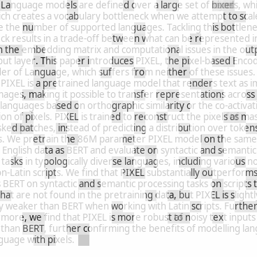

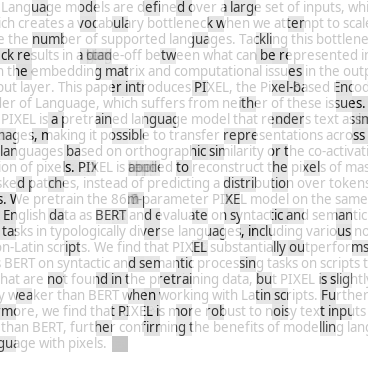

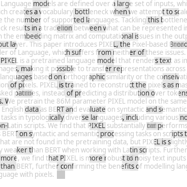

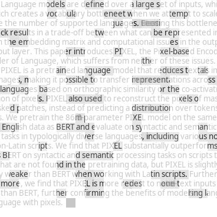

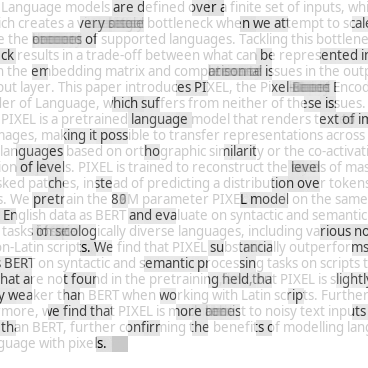

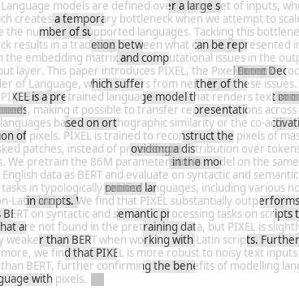

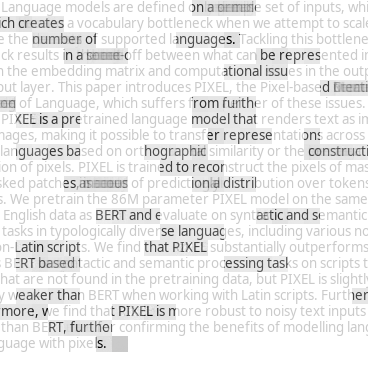

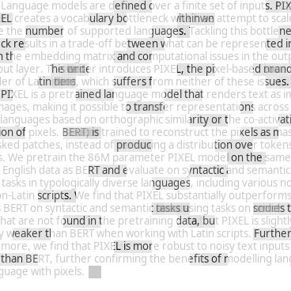

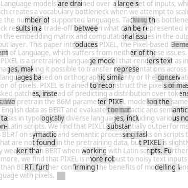

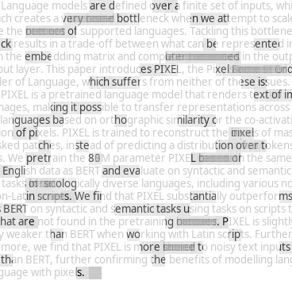

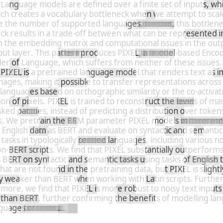

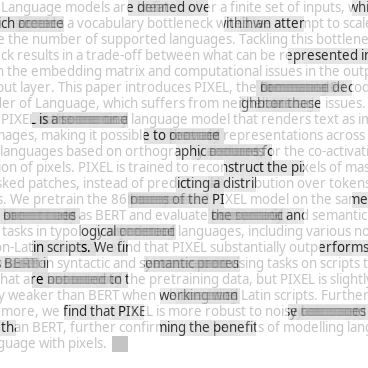

Figure 4: pixel image reconstructions of the abstract with different span masks.

## Appendix B Web Text Reconstructions

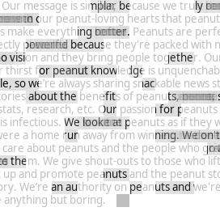

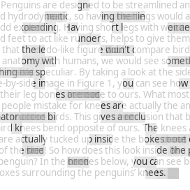

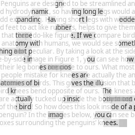

(a) 100k steps

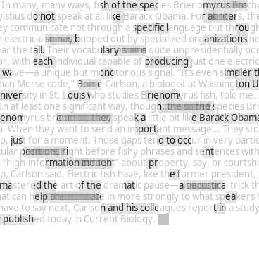

(b) 500k steps

(c) 1M steps

Figure 5: pixel image reconstructions after 100k, 500k, and 1M steps of pretraining. We overlay the masked original image with the model’s predictions. Images are wrapped into squares and resized for visualization purposes only. The texts were not part of the training data. We see that the fully trained pixel (1M) predicts masked spans more clearly and accurately. For longer spans with a larger possible prediction space, multiple predictions may appear together creating blurred text.

Reconstructions of three sources of text1919 19 <https://www.nationalpeanutboard.org/peanut-info/our-message.htm>2020 20 <https://www.penguinsinternational.org/2019/07/10/do-penguins-have-knees-and-other-frequently-asked-questions/>2121 21 <https://www.theatlantic.com/science/archive/2021/05/electric-fish-pause/618993/> after 100K, 500K and 1M pretraining steps. The figure also shows how pixel (visually) expresses uncertainty, e.g. for reconstructions of long spans where the space of possible outputs is much larger than for short spans, and how it captures long-range dependencies. In the third row, we can for instance see that pixel uses context from the beginning of a sequence (_Barack Obama_) to correctly fill in a gap later in the sequence, and vice-versa (_Brienomyrus_).

## Appendix C Code

pixel is implemented in PyTorch ([Paszke et al. 2019](https://arxiv.org/html/2207.06991#bib.bib66)) and built on HuggingFace transformers ([Wolf et al. 2020](https://arxiv.org/html/2207.06991#bib.bib100)). We make our code available at <https://github.com/xplip/pixel>. Our pretrained pixel model, including a large number of intermediate checkpoints, is available at <https://huggingface.co/Team-PIXEL/pixel-base> and our finetuned models, including multiple seeds each, are available through the model hub.

## Appendix D Text Renderer Details

#### Rendering backend

We experimented with different text rendering backends. Following [Salesky et al. 2021](https://arxiv.org/html/2207.06991#bib.bib76), our first implementation was based on PyGame,2222 22 <https://www.pygame.org/> which pixel was also pretrained with. Later on, we switched to a backend based on Pango ([Taylor 2004](https://arxiv.org/html/2207.06991#bib.bib87)) and Cairographics,2323 23 <https://www.cairographics.org/> which has native support for complex text layouts, making it possible to specify fallback fonts, and has faster rendering speed. Without fallback fonts, we would be limited to a maximum number of \(2^{16}-1\) glyphs that can fit into a single OpenType or TrueType font file due to a technical limitation.2424 24 See <https://en.wikipedia.org/wiki/Unicode_font> for an explanation. By leveraging fallback fonts, we can theoretically cover all Unicode codepoints, including emojis.

#### Fonts

We rely on the Google Noto Sans fonts collection,2525 25 <https://fonts.google.com/noto> which covers the majority of Unicode codepoints and is actively growing.2626 26 See <https://notofonts.github.io/overview/> for an overview of Noto’s Unicode coverage.. Note, however, that pixel is compatible with any font and can therefore encode anything that can be typeset on a computer screen. We used a font size of 8 at 120 DPI for pretraining with PyGame, which was selected manually to fit most scripts into a rendered height of 16px. It can, however, also be adjusted at finetuning time. For finetuning with PangoCairo, we use a font size of \(8\cdot(120/72)\approx 13.33\) which yields roughly the same outputs as the PyGame renderer. Due to how glyphs are shaped by the two backends, the outputs of the two renderers do not _exactly_ match. Because we did not employ data augmentation to make pixel robust to such changes in font size, we recommend using the PyGame renderer it was pretrained with for _zero-shot_ applications with pixel. When finetuning, this minor mismatch in rendering outputs is easily overcome by pixel, so we generally recommend using the PangoCairo renderer.

#### Characters versus glyphs

For extractive QA, it is necessary to obtain a mapping between the characters in the context paragraph and where they appear on the rendered image. Obtaining this mapping is not straightforward due to how text is rendered. The _shaping_ step in the rendering pipeline converts characters into glyphs.2727 27 See <https://docs.gtk.org/Pango/pango_rendering.html> for an overview of the rendering pipeline. In ligatures, as common for instance in Arabic, a glyph is composed of multiple characters. Likewise, an emoji often consists of a base codepoint and a modifier codepoint (e.g. to change the emoji skin colour) which are represented by a single glyph. For accents, on the other hand, one character might yield multiple glyphs.2828 28 <https://docs.gtk.org/Pango/pango_fonts.html#glyphs> In practice, the renderer therefore uses grapheme clusters, whose logical boundaries in the rendered image we can map to the input characters.2929 29 <https://unicode.org/reports/tr29/#Grapheme_Cluster_Boundaries> For simplicity, we assign each codepoint of a grapheme cluster to the logical horizontal offset at which the cluster starts on the rendered image. Future work may investigate alternative mapping strategies.

#### RGB rendering

pixel supports RGB rendering which may be useful to accurately represent colour emoji and for multimodal applications in the future. However, 24-bit RGB rendering is slightly slower than 8-bit grayscale rendering (see Table [6](https://arxiv.org/html/2207.06991#A4.T6 "Table 6 ‣ Right-to-left scripts ‣ Appendix D Text Renderer Details ‣ Language Modelling with Pixels") below) for text written in Latin script, which is why we made RGB rendering an optional setting. In our pretraining and finetuning experiments we rendered text in grayscale, and we generally recommend doing so when not working with coloured inputs.

#### Right-to-left scripts

pixel’s renderer natively supports right-to-left (RTL) writing. In the default setting, the base text direction (which for instance determines on which side of a sentence punctuation marks are placed) is inferred automatically by the rendering backend based on the first ‘‘strong directional’’ character in a given paragraph.3030 30 See <https://unicode.org/reports/tr9/> for an overview of the Unicode bidi algorithm. The mirroring of RTL characters is also handled automatically according to their Unicode bidi attributes. Optionally, the base text direction can be set manually, which is useful when working on monolingual data, e.g. in Arabic or Hebrew, as the renderer does not have to go through the direction check. In §[J](https://arxiv.org/html/2207.06991#A10 "Appendix J Limitations ‣ Language Modelling with Pixels"), we describe limitations of how we currently handle RTL writing.

Figure 6: Distributions of sentence lengths from monolingual UD corpora after tokenizing by bert and mbert and rendering by pixel, compared to the reference by UD treebank annotators.

Processor | Batched | Throughput [ex / s]  
---|---|---  
|  |  eng |  zho  
Renderer (Grayscale) | ✗ |  3944.1 |  6309.0  
Renderer (RGB) | ✗ |  3615.1 |  6849.5  
Tokenizer (Rust) | ✓ | 19128.9 | 18550.5  
✗ |  4782.9 |  5684.4  
Tokenizer (Python) | ✓ |  1286.6 |  2637.1  
✗ |  1286.8 |  2580.9  
  
Table 6: Throughput comparison between pixel’s PangoCairo renderer and the fast and slow bert tokenizers, implemented in Rust and Python respectively, from the HuggingFace tokenizers library. We estimate throughput, measured in examples per second, by how long it takes to process 1M lines of English (eng) and Chinese (zho) Wikipedia text on the same desktop workstation (AMD Ryzen 9 3900X 12-core CPU). We distinguish between tokenizing all lines individually (Batched = ✗) and as one single batch (✓). 

#### Efficiency analysis

We briefly analyze the text processing (rendering versus tokenizing) efficiency in terms of a) length of the processed sequence, which has a direct effect on GPU memory consumption and the time it takes to compute forward and backward passes, and b) processing throughput.

For a), we follow [Rust et al. 2021](https://arxiv.org/html/2207.06991#bib.bib75) and process the training and validation splits of all available UD v2.10 treebanks in various languages with the pixel renderer and the tokenizers of bert and mbert. We plot the resulting sentence length distributions in Figure [6](https://arxiv.org/html/2207.06991#A4.F6 "Figure 6 ‣ Right-to-left scripts ‣ Appendix D Text Renderer Details ‣ Language Modelling with Pixels"), including a comparison with the reference segmentations from the UD annotators. For English text, the pixel renderer is slightly less efficient, i.e., it produces slightly longer sequences on average than the tokenizers. For other languages with Latin script, e.g. Finnish and Turkish, the renderer is more efficient than the bert tokenizer, albeit slightly less efficient than the mbert tokenizer. For non-Latin scripts such as Arabic and Japanese, we see that the renderer can be a lot more efficient than both tokenizers. The English bert tokenizer is technically fairly space-efficient for non-Latin scripts but this is misleading because it largely produces [UNK]s (recall right side of Table [1](https://arxiv.org/html/2207.06991#S3.T1 "Table 1 ‣ Syntactic Tasks ‣ 3.3 Results ‣ 3 Experiments ‣ Language Modelling with Pixels")) and each [UNK] is a single token; the functionality of the bert model on a sequence of [UNK] is strongly compromised.

For b), we compare the processing throughput of HuggingFace’s bert tokenizers and our pixel renderer in Table [6](https://arxiv.org/html/2207.06991#A4.T6 "Table 6 ‣ Right-to-left scripts ‣ Appendix D Text Renderer Details ‣ Language Modelling with Pixels"). We find that the Rust-based bert tokenizer with batch processing achieves the highest throughput by leveraging parallelization. When not using batch processing, it is comparable in throughput with pixel’s renderer, i.e. depending on the language or script, rendering can be slightly slower (eng) or faster (zho) than tokenizing. Since the rendering backend (PangoCairo) is implemented in C, we expect to achieve similar gains in rendering throughput by also leveraging parallelization for batch processing (in contrast to the Python-based tokenizer which is limited by Python’s global interpreter lock (GIL)). We plan to implement batch rendering functionality in the future.

## Appendix E Architecture & Pretraining Details

parameter | value  
---|---  
Image size | (16, 8464, 3)  
Patch size \(P\) | 16  
Encoder hidden size \(D_{\text{enc}}\) | 768  
Encoder intermediate size | 3072  
Encoder num attention heads | 12  
Encoder num layers \(L\) | 12  
Decoder hidden size \(D_{\text{dec}}\) | 512  
Decoder intermediate size | 2048  
Decoder num attention heads | 16  
Decoder num layers \(K\) | 8  
Layer norm \(\varepsilon\) ([Ba et al. 2016](https://arxiv.org/html/2207.06991#bib.bib9)) | \(1\text{\times}{10}^{-12}\)  
Span masking ratio \(R\) | 0.25  
Span masking max length \(S\) | 6  
Span masking cumulative weights \(W\) | \(\{0.2,0.4,0.6,0.8,0.9,1\}\)  
Span masking spacing | Dynamic  
Dropout probability | 0.1  
Hidden activation | GeLU ([Hendrycks & Gimpel 2016](https://arxiv.org/html/2207.06991#bib.bib39))  
Optimizer | AdamW ([Loshchilov & Hutter 2019](https://arxiv.org/html/2207.06991#bib.bib57); [Kingma & Ba 2015](https://arxiv.org/html/2207.06991#bib.bib46))  
Adam \(\beta\) | (0.9, 0.999)  
Adam \(\varepsilon\) | \(1\text{\times}{10}^{-8}\)  
Weight decay | 0.05  
Peak learning rate | \(1.5\text{\times}{10}^{-4}\)  
Learning rate schedule | Cosine Decay ([Loshchilov & Hutter 2017](https://arxiv.org/html/2207.06991#bib.bib56))  
Minimum learning rate | \(1\text{\times}{10}^{-5}\)  
Learning rate warmup ratio | 0.05  
Training steps | 1M  
Batch size | 256  
  
Table 7: pixel pretraining settings Figure 7: pixel pretraining loss curve

#### Patch Embeddings

pixel reshapes each image \(\bm{x}\) into a sequence of \(N=W/P\) non-overlapping flattened 2D patches \({\bm{x}_{f}\in\mathbb{R}^{N\times(P^{2}C)}}\), where \(P=16\) is the patch size, and linearly projects them via \({\bm{E}\in\mathbb{R}^{(P^{2}C)\times D_{\text{enc}}}}\) to obtain patch embeddings \(\bm{x}_{p}=(\bm{x}_{f}\bm{E})\in\mathbb{R}^{N\times D_{\text{enc}}}\) with encoder hidden size \({D_{\text{enc}}=P^{2}C=768}\).3131 31 This is equivalent to projecting each rendered image \(\bm{x}\in\mathbb{R}^{H\times W\times C}\) via a 2D-convolutional layer with \(C\) input channels and \(D_{\text{enc}}\) output channels and kernel size and stride both equal to the patch size \(P\), which we do in practice. Afterwards, fixed sinusoidal position embeddings \(\bm{E}_{\text{pos}}\in\mathbb{R}^{(N+1)\times D_{\text{enc}}}\) are added, leaving out the position vector in position 0 for a classification (CLS) embedding later: \(\bm{\tilde{x}}_{p}=\bm{x}_{p}+[\bm{E}_{\text{pos}}^{1},\ldots,\bm{E}_{\text{pos}}^{(N+1)}]\).

#### Span Masking

pixel then masks out \({R=25\%}\) of the \(N=529\) embedded patches via span masking with max span length \(S=6\) and cumulative span weights \(W=\{0.2,0.4,0.6,0.8,0.9,1\}\), i.e. \(\mathbb{E}(s)=3.1\), as outlined in Algorithm [1](https://arxiv.org/html/2207.06991#alg1 "Algorithm 1 ‣ Patch Embeddings ‣ 2.2 Architecture ‣ 2 Approach ‣ Language Modelling with Pixels"). Applying the mask \(\mathcal{M}\), we obtain the unmasked patches \({\bm{\tilde{x}}_{\text{vis}}=\{\bm{\tilde{x}}_{p}^{i}:i\notin\mathcal{M}\}_{i=0}^{N}}\).

#### Encoder

Following ViT-MAE ([He et al. 2022](https://arxiv.org/html/2207.06991#bib.bib36)), the pixel encoder only operates on unmasked patches (i.e., \(\approx\) 396 patches at 25% masking) and a special CLS embedding with its positional encoding \({\bm{c}=\bm{x}_{[\text{cls}]}+\bm{E}_{\text{pos}}^{0}\in\mathbb{R}^{1\times D_{\text{enc}}}}\) is prepended to the sequence: \(\bm{h}_{0}=[\bm{c},\bm{\tilde{x}}_{\text{vis}}]\in\mathbb{R}^{(1+\lfloor R\cdot N\rfloor)\times D_{\text{enc}}}\).3232 32 In pretraining, no loss is computed for the CLS embedding but it can optionally be used when finetuning pixel for sequence-level downstream tasks. Let \(\{\bm{h}_{i}\}_{i=1}^{L}\) be the encoder hidden states after each of the \(L=12\) encoder transformer layers, and \(\bm{h}_{0}\) denotes the input sequence. The outputs of each transformer layer are computed as detailed in ([Vaswani et al. 2017](https://arxiv.org/html/2207.06991#bib.bib92)), 3333 33 Note that encoder and decoder do not attend to the blank (padding) patches that appear after the EOS patch. and the last layer’s output \(\bm{h}_{L}\in\mathbb{R}^{(1+\lfloor R\cdot N\rfloor)\times D_{\text{enc}}}\) is passed to the decoder.

#### Decoder

The pixel decoder first projects the encoder outputs via \(\bm{E}_{\text{dec}}\in\mathbb{R}^{D_{\text{enc}}\times D_{\text{dec}}}\) to obtain decoder embeddings \(\bm{x}_{d}=\bm{h}_{L}\bm{E}_{\text{dec}}\in\mathbb{R}^{(1+\lfloor R\cdot N\rfloor)\times D_{\text{dec}}}\), where \(D_{\text{dec}}=512\). Next, mask embeddings \(x_{[\text{mask}]}\in\mathbb{R}^{1\times D_{\text{dec}}}\) are inserted at the masked-out positions and fixed sinusoidal position embeddings are added to obtain \(\bm{d}_{0}=[(\bm{x_{d}}\cup\{x_{[\text{mask}]}:i\in\mathcal{M}\}_{i=0}^{N})+\bm{E}_{\text{pos}}]\in\mathbb{R}^{(N+1)\times D_{\text{\text{dec}}}}\). \(\{\bm{d}_{i}\}_{i=1}^{K}\) are the decoder hidden states after each of the \(K=8\) decoder transformer layers, computed in the same way as the encoder hidden states, and \(\bm{d}_{0}\) denotes the input sequence. There is no encoder-decoder cross-attention. The decoder output \(\bm{d}_{K}\in\mathbb{R}^{(N+1)\times D_{\text{\text{dec}}}}\) is projected via \(\bm{O}\in\mathbb{R}^{D_{\text{\text{dec}}}\times(P^{2}C)}\) to obtain patch-wise logits \(\bm{o}=(\bm{d}_{K}\bm{O})\in\mathbb{R}^{(N+1)\times(P^{2}C)}\). Finally, the CLS logits are removed and a normalized mean squared error (MSE) pixel reconstruction loss is computed: \(\bm{\mathcal{L}}_{\text{normpix}}=\frac{1}{\lvert Q\rvert}\sum_{i\in Q}{\lvert\text{normalize}(\bm{x}_{f}^{i})-\bm{o}^{i}\rvert^{2}}\) with \(i\) denoting the indices in the set of _masked, non-blank (text)_ patches \(Q=\{i:i\in(\mathcal{M}\cap\mathcal{T})\}_{i=0}^{N}\) and \(\text{normalize}(\cdot)\) dividing the difference between the target patch and its mean by its standard deviation.

## Appendix F Finetuning Details

Table [8](https://arxiv.org/html/2207.06991#A6.T8 "Table 8 ‣ Appendix F Finetuning Details ‣ Language Modelling with Pixels") gives an overview of all languages used in our finetuning experiments, Table [9](https://arxiv.org/html/2207.06991#A6.T9 "Table 9 ‣ Appendix F Finetuning Details ‣ Language Modelling with Pixels") links to our finetuning datasets, and Table [10](https://arxiv.org/html/2207.06991#A6.T10 "Table 10 ‣ Appendix F Finetuning Details ‣ Language Modelling with Pixels") lists the UD treebanks we used.

We list our finetuning recipes in Table [11](https://arxiv.org/html/2207.06991#A6.T11 "Table 11 ‣ Appendix F Finetuning Details ‣ Language Modelling with Pixels") for pos tagging, dependency parsing, ner, qa, and xnli and in Table [12](https://arxiv.org/html/2207.06991#A6.T12 "Table 12 ‣ Appendix F Finetuning Details ‣ Language Modelling with Pixels") for the GLUE tasks. Due to compute limitations we did not run comprehensive hyperparameter sweeps. Instead, we relied on sensible priors from finetuning bert and made slight modifications as needed. In most cases, hyperparameters that work well for bert also work well for pixel. For some of the semantic tasks, in particular nli and sst-2, we found that some random initializations did not converge. In those cases, minor tweaks to the learning rate or increasing the batch size usually helped. For glue, we found that pixel performed slightly better on some tasks with the PangoCairo renderer, whereas for others, using the PyGame renderer (which pixel was pretrained with) was more stable. We plan to further optimize the training recipes and study pixel’s convergence behaviour in the future.

For word-level tasks, we add padding in order to render each word at the start of a new image patch and so create a bijective mapping between words and patches. Doing so assumes that word boundaries are available. We note that subword-based and character-based models also make this assumption. In bert, for instance, word-level tasks are formulated such that a word’s label is assigned to its first subword token, requiring word boundaries. During training, continuation tokens are then masked out when computing the loss. Consequently, predictions for continuation tokens also need to be masked out at inference time, which again requires word boundaries or aggregation strategies that may introduce errors. The same applies to character-based models. For pixel, should this assumption be violated, it is still possible to render the text without adding spacing, although the mapping is then no longer bijective as multiple words can overlap on one image patch. In such cases, assigning the prediction for a patch to either word can cause loss of information. Although in practice this approach does not necessarily affect performance negatively, future work will investigate alternative approaches.

Language | ISO 639-3 | Language Family | Script  
---|---|---|---  
Amharic | amh | Afro-Asiatic | Ge\textrevapostropheez  
Arabic | ara | Afro-Asiatic | Arabic  
Bengali | ben | Indo-European | Bengali  
Bulgarian | bul | Indo-European | Cyrillic  
Chinese | zho | Sino-Tibetan | Chinese  
Coptic | cop | Afro-Asiatic | Coptic  
English | eng | Indo-European | Latin  
Finnish | fin | Uralic | Latin  
French | fra | Indo-European | Latin  
German | deu | Indo-European | Latin  
Greek | ell | Indo-European | Greek  
Hausa | hau | Afro-Asiatic | Latin  
Hindi | hin | Indo-European | Devanagari  
Igbo | ibo | Niger-Congo | Latin  
Indonesian | ind | Austronesian | Latin  
Japanese | jpn | Japonic | Japanese  
Kinyarwanda | kin | Niger-Congo | Latin  
Korean | kor | Koreanic | Korean  
Luganda | lug | Niger-Congo | Latin  
Luo | luo | Nilo-Saharan | Latin  
Naija Pidgin | pcm | English Creole | Latin  
Russian | rus | Indo-European | Cyrillic  
Spanish | spa | Indo-European | Latin  
Swahili | swa | Niger-Congo | Latin  
Tamil | tam | Dravidian | Tamil  
Telugu | tel | Dravidian | Telugu  
Thai | tha | Kra-Dai | Thai  
Turkish | tur | Turkic | Latin  
Urdu | urd | Indo-European | Perso-Arabic  
Vietnamese | vie | Austro-Asiatic | Latin  
Wolof | wol | Niger-Congo | Latin  
Yorùbá | yor | Niger-Congo | Latin  
  
Table 8: Overview of languages used in our experiments.

Dataset | Download Link | Reference  
---|---|---  
Universal Dependencies 2.10 | <https://lindat.mff.cuni.cz/repository/xmlui/handle/11234/1-4758> | ([Zeman et al. 2022](https://arxiv.org/html/2207.06991#bib.bib105); [Nivre et al. 2020](https://arxiv.org/html/2207.06991#bib.bib64))  
MasakhaNER | <https://github.com/masakhane-io/masakhane-ner/tree/main/data> | ([Adelani et al. 2021](https://arxiv.org/html/2207.06991#bib.bib2))  
GLUE | <https://huggingface.co/datasets/glue> | ([Wang et al. 2018](https://arxiv.org/html/2207.06991#bib.bib95))  
TyDiQA-GoldP | <https://huggingface.co/datasets/tydiqa> | ([Clark et al. 2020](https://arxiv.org/html/2207.06991#bib.bib24))  
SQuADv1.1 | <https://huggingface.co/datasets/squad> | ([Rajpurkar et al. 2016](https://arxiv.org/html/2207.06991#bib.bib73))  
KorQuAD 1.0 | <https://huggingface.co/datasets/squad_kor_v1> | ([Lim et al. 2019](https://arxiv.org/html/2207.06991#bib.bib54))  
JaQuAD | <https://huggingface.co/datasets/SkelterLabsInc/JaQuAD> | ([So et al. 2022](https://arxiv.org/html/2207.06991#bib.bib82))  
XNLI | <https://huggingface.co/datasets/xnli> | ([Conneau et al. 2018](https://arxiv.org/html/2207.06991#bib.bib26))  
  
Table 9: Links and references to the datasets we used in our finetuning experiments.

Language | Treebank | #Sentences | Reference  
---|---|---|---  
eng | English-EWT | 16621 | [Silveira et al. 2014](https://arxiv.org/html/2207.06991#bib.bib80)  
ara | Arabic-PADT | 7664 | [Hajič et al. 2009](https://arxiv.org/html/2207.06991#bib.bib35)  
cop | Coptic-Scriptorium | 2011 | [Zeldes & Abrams 2018](https://arxiv.org/html/2207.06991#bib.bib104)  
hin | Hindi-HDTB | 16647 | [Palmer et al. 2009](https://arxiv.org/html/2207.06991#bib.bib65)  
jpn | Japanese-GSD | 8100 | [Asahara et al. 2018](https://arxiv.org/html/2207.06991#bib.bib8)  
kor | Korean-GSD | 6339 | [Chun et al. 2018](https://arxiv.org/html/2207.06991#bib.bib22)  
tam | Tamil-TTB | 600 | [Ramasamy & Žabokrtský 2012](https://arxiv.org/html/2207.06991#bib.bib74)  
vie | Vietnamese-VTB | 3000 | [Nguyen et al. 2009](https://arxiv.org/html/2207.06991#bib.bib63)  
zho | Chinese-GSD | 4997 | [Shen et al. 2016](https://arxiv.org/html/2207.06991#bib.bib79)  
  
Table 10: Overview of the Universal Dependencies v2.10 ([Zeman et al. 2022](https://arxiv.org/html/2207.06991#bib.bib105); [Nivre et al. 2020](https://arxiv.org/html/2207.06991#bib.bib64)) treebanks used in our POS tagging and dependency parsing experiments with the number of sentences in their respective training splits. As mentioned in §[3.1](https://arxiv.org/html/2207.06991#S3.SS1 "3.1 Tasks and Languages ‣ 3 Experiments ‣ Language Modelling with Pixels"), these treebanks were chosen with typological and script diversity in mind.

parameter | pos | dp | ner | qa | xnli  
---|---|---|---|---|---  
Rendering backend | PangoCairo  
Classification head pooling | — | — | — | — | CLS  
Optimizer | AdamW  
Adam \(\beta\) | (0.9, 0.999)  
Adam \(\varepsilon\) | \(1\text{\times}{10}^{-8}\)  
Weight decay | 0  
Learning rate | \(5\text{\times}{10}^{-5}\) | \(\{$5\text{\times}{10}^{-5}$,$8\text{\times}{10}^{-5}$\}\) | \(5\text{\times}{10}^{-5}\) | \(\{$3\text{\times}{10}^{-5}$,$5\text{\times}{10}^{-5}$,$7\text{\times}{10}^{-5}$\}\) | \(2\text{\times}{10}^{-5}\)  
Learning rate warmup steps | 100 | 100 | 100 | 100 | 1000  
Learning rate schedule | Linear decay  
Max sequence length | 256 | 256 | 196 | 400 | 196  
Stride | — | — | — | 160 | —  
Batch size | 64 | 64 | 64 | 32 | 256  
Max steps | 15000 | 15000 | 15000 | 20000 | 50000  
Early stopping | ✓  
Eval steps | 500 | 500 | 500 | 500 | 1000  
Dropout probability | 0.1  
  
Table 11: Finetuning settings for pos tagging, dependency parsing (dp), ner, qa, and xnli. We did not run a comprehensive hyperparameter search due to compute limitations; these settings were manually selected based on a small number of preliminary runs. Maximum performance was often reached well before the specified number of max steps.

parameter | mnli | qqp | qnli | sst-2 | cola | sts-b | mrpc | rte | wnli  
---|---|---|---|---|---|---|---|---|---  
Rendering backend | PangoCairo | PyGame | PangoCairo | PyGame | PyGame | PyGame | PyGame | PyGame | PyGame  
Classification head pooling | Mean  
Optimizer | AdamW  
Adam \(\beta\) | (0.9, 0.999)  
Adam \(\varepsilon\) | \(1\text{\times}{10}^{-8}\)  
Weight decay | 0  
Learning rate | \(3\text{\times}{10}^{-5}\) | \(3\text{\times}{10}^{-5}\) | \(3\text{\times}{10}^{-5}\) | \(3\text{\times}{10}^{-5}\) | \(2\text{\times}{10}^{-5}\) | \(2\text{\times}{10}^{-5}\) | \(3\text{\times}{10}^{-5}\) | \(3\text{\times}{10}^{-5}\) | \(1\text{\times}{10}^{-5}\)  
Learning rate warmup steps | 100 | 100 | 100 | 100 | 200 | 100 | 100 | 200 | 100  
Learning rate schedule | Linear decay  
Max sequence length | 256  
Batch size | 64 | 256 | 64 | 256 | 256 | 64 | 64 | 64 | 256  
Max steps | 15000 | 15000 | 15000 | 15000 | 15000 | 15000 | 15000 | 15000 | 400  
Early stopping | ✓  
Eval interval | 500 steps | 500 steps | 500 steps | 500 steps | 100 steps | 100 steps | 100 steps | 250 steps | 1 epoch  
Dropout probability | 0.1  
  
Table 12: Finetuning settings for glue tasks. We did not run a comprehensive hyperparameter search due to compute limitations; these settings were manually selected based on a small number of preliminary runs. Increasing the batch size to 256 and switching to the PyGame renderer helped achieve more consistent convergence behaviour for some tasks. For the smaller datasets (to the right of qqp), maximum performance was reached well before the specified number of max steps.

## Appendix G Examples of Zeroé orthographic attacks

Attack | Sentence  
---|---  
None | Penguins are designed to be streamlined  
Confusable | ![\[Uncaptioned image\]](2207.06991v2/figures/penguins_confusable.png)  
Shuffle (inner) | Pegnuins are dnesiged to be sieatrnmled  
Shuffle (full) | ngePnius rae dsgednei to be etimaslernd  
Disemvowel | Pngns r dsgnd to be strmlnd  
Intrude | Pe‘nguins a{re d)esigned t;o b*e stre<amlined  
Keyboard typo | Penguinz xre dwsigned ro ne streamllned  
Natural noise | Penguijs ard design4d ti bd streamlinfd  
Truncate | Penguin are designe to be streamline  
Segmentation | Penguinsaredesignedtobestreamlined  
Phonetic | Pengwains’s ar dhiseind te be storimlignd  
  
Table 13: Examples of low-level orthographic attacks based on the Zeroé benchmark. Figure 8: Test set accuracy for a single run of pixel and bert across different levels of noise introduced through various orthographic attacks in SNLI. The results show that pixel is more robust than bert to most of these attacks. Figure 9: Test set accuracy for a single run of pixel and bert across different levels of noise introduced through various orthographic attacks in POS tagging. The results show that pixel is more robust than bert to most of these attacks, especially when dealing with visually-confusable character substitutions. Segmentation is not applied to the task of POS tagging, since the joined words would not have a proper tag.

## Appendix H Font Transfer Analysis

In this section, we analyse the adaptation capabilities of pixel to new fonts at finetuning time. Specifically, we finetune pixel models for POS tagging and dependency parsing on the UD_English-EWT treebank and sentiment analysis on SST-2, once with a font similar to our GoNotoCurrent / NotoSans-Regular pretraining font, NotoSerif-Regular, and once with a font strikingly different from it, JournalDingbats1. We compare the three fonts in Table [14](https://arxiv.org/html/2207.06991#A8.T14 "Table 14 ‣ Appendix H Font Transfer Analysis ‣ Language Modelling with Pixels") below:

Font | Rendered Example Sentence  
---|---  
GoNotoCurrent | ![\[Uncaptioned image\]](2207.06991v2/figures/notosans-example.png)  
NotoSerif-Regular | ![\[Uncaptioned image\]](2207.06991v2/figures/notoserif-example.png)  
JournalDingbats1 | ![\[Uncaptioned image\]](2207.06991v2/figures/journaldingbats1-example.png)  
  
Table 14: An example sentence rendered in three different fonts.

| GoNotoCurrent | NotoSerif-Regular | JournalDingbats1  
---|---|---|---  
POS | 96.7 | 95.9 | 93.9  
DP | 90.6 | 88.1 | 81.3  
SST-2 | 89.6 | 84.2 | 72.9  
  
Table 15: Results for fine-tuning pixel for POS tagging, dependency parsing (DP), and sentiment analysis on SST-2 with three different fonts: the font used in pretraining (GoNotoCurrent), a visually similar font (NotoSerif-Regular), and a highly dissimilar font (JournalDingbats1). We report test accuracy for POS, test LAS for DP, and validation accuracy for SST-2, each averaged over 5 runs.

The font transfer results are shown in Table [15](https://arxiv.org/html/2207.06991#A8.T15 "Table 15 ‣ Appendix H Font Transfer Analysis ‣ Language Modelling with Pixels"). We find that pixel exhibits fairly high font transfer ability _out-of-the-box_ , i.e. without any font or image augmentation strategies employed during pretraining.3434 34 We believe such augmentation strategies would further improve robustness to font variations and leave this experiment to future work. Considering that we have full control over the font when working with NLP text datasets, robustness to font variations was not a primary goal in this work. In line with our expectations, transfer to a visually similar font (NotoSerif-Regular) is easier than to a dissimilar font (JournalDingbats1). Nevertheless, pixel is able to transfer surprisingly well to the JournalDingbats1 font, in which every letter is simply mapped to the icon of an object or animal.

## Appendix I Further analysis

To investigate where pixel currently lags behind bert, we analyse the impact that dependency length has on both models in dependency parsing in eng. We can see in Figure [10](https://arxiv.org/html/2207.06991#A9.F10 "Figure 10 ‣ Appendix I Further analysis ‣ Language Modelling with Pixels") that the LAS gap between bert and pixel increases with longer dependencies, indicating that pixel struggles slightly more with long syntactic dependencies.

Figure 10: LAS scores (eng) across different dependency lengths averaged over 5 random intitializations of bert and pixel. In eng, long syntactic dependencies are more challenging for pixel.

| #l | \(\theta\) | eng | ara | bul | deu | ell | fra | hin | rus | spa | swa | tha | tur | urd | vie | zho  
---|---|---|---|---|---|---|---|---|---|---|---|---|---|---|---|---|---  
mbert | 104 | 179M | 83.3 | 73.2 | 77.9 | 78.1 | 75.8 | 78.5 | 70.1 | 76.5 | 79.7 | 67.2 | 67.7 | 73.3 | 66.1 | 77.2 | 77.7  
bert |  1 | 110M | 83.7 | 64.8 | 69.1 | 70.4 | 67.7 | 72.4 | 59.2 | 66.4 | 72.4 | 62.2 | 35.7 | 66.3 | 54.5 | 67.6 | 46.2  
pixel |  1 |  86M | 77.2 | 58.9 | 66.5 | 68.0 | 64.9 | 69.4 | 57.8 | 63.4 | 70.3 | 60.8 | 50.2 | 64.0 | 54.1 | 64.8 | 52.0  
  
Table 16: Results for pixel and bert finetuned on XNLI in the _translate-train-all_ setting where we train on the joint training data in all 15 languages, originally translated from eng by [Conneau et al. 2018](https://arxiv.org/html/2207.06991#bib.bib26). We report test set accuracy averaged over 5 runs each. Despite the relatively large performance gap in favor of bert in eng (which is in line with the GLUE results in Table [3](https://arxiv.org/html/2207.06991#S3.T3 "Table 3 ‣ Semantic Tasks ‣ 3.3 Results ‣ 3 Experiments ‣ Language Modelling with Pixels")), the gap is much smaller for other languages, particularly those not using the Latin writing system. pixel is overall more consistent across scripts, outperforming bert in tha and zho.

## Appendix J Limitations

This paper introduces a new approach to processing written language as images, which removes the need for a finite vocabulary, providing a solution to the _vocabulary bottleneck_. While our results show that pixel is a promising approach in this direction, this is only the first step. Here, we highlight current limitations and avenues for future work for pixel-based models:

  * •

pixel is pretrained on predominantly English text written in the Latin script. The choice of English is driven by the scientific goal of comparing against a widely used model (English bert) but English may not be the best source language for cross-lingual transfer ([Turc et al. 2021](https://arxiv.org/html/2207.06991#bib.bib90); [Blevins et al. 2022](https://arxiv.org/html/2207.06991#bib.bib14)). We expect that pixel trained on typologically diverse languages in multiple scripts would considerably surpass the cross-script and cross-lingual transferability of English-only pixel but this remains to be verified, and training a model on large amounts of data will require large computational resources.

  * •

pixel currently seems to be less sample-efficient than subword-based PLMs. pixel excels at syntactic tasks after being pretrained for the same number of steps/datapoints as bert (a challenging setup within an academic budget), but still lags behind in semantic processing. As a consequence, it also requires more training steps than bert to converge during finetuning. Closing this gap might involve longer pretraining with additional (long-dependency) objectives.

  * •

There are challenges to be addressed when working with languages written right-to-left. pixel currently processes sentences in such languages from the end to the beginning which may lead to learning inadequate features for sentence separation and position embeddings.

  * •

pixel cannot be used for language generation tasks because it is not possible to produce discrete words from the pretrained decoder.

  * •

Rendering text as images requires more disk space than reading text from a file. This can be alleviated by caching the dataset in a compressed format, or rendering the images on-the-fly. Rendering images on-the-fly will create additional overhead when training for multiple epochs.

