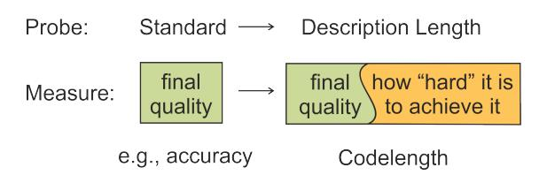
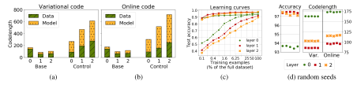
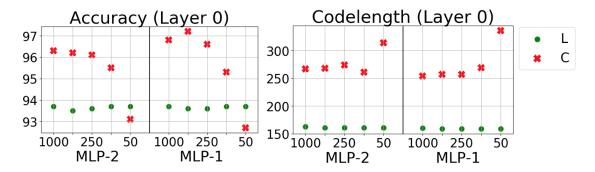
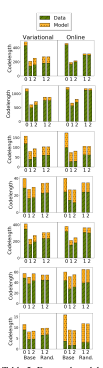
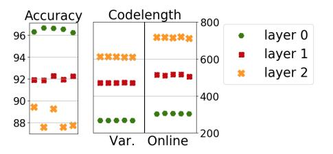
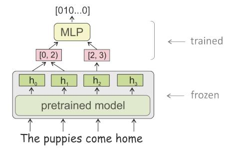

# Information-Theoretic Probing with Minimum Description Length

Elena Voita1,2

Ivan Titov1,2

1University of Edinburgh, Scotland 2University of Amsterdam, Netherlands

lena-voita@hotmail.com ititov@inf.ed.ac.uk

### Abstract

To measure how well pretrained representations encode some linguistic property, it is common to use accuracy of a probe, i.e. a classifier trained to predict the property from the representations. Despite widespread adoption of probes, differences in their accuracy fail to adequately reflect differences in representations. For example, they do not substantially favour pretrained representations over randomly initialized ones. Analogously, their accuracy can be similar when probing for genuine linguistic labels and probing for random synthetic tasks. To see reasonable differences in accuracy with respect to these random baselines, previous work had to constrain either the amount of probe training data or its model size. Instead, we propose an alternative to the standard probes, information-theoretic probing with *minimum description length* (MDL). With MDL probing, training a probe to predict labels is recast as teaching it to effectively transmit the data. Therefore, the measure of interest changes from probe accuracy to the description length of labels given representations. In addition to probe quality, the description length evaluates 'the amount of effort' needed to achieve the quality. This amount of effort characterizes either (i) size of a probing model, or (ii) the amount of data needed to achieve the high quality. We consider two methods for estimating MDL which can be easily implemented on top of the standard probing pipelines: variational coding and online coding. We show that these methods agree in results and are more informative and stable than the standard probes.[1](#page-0-0)

# 1 Introduction

To estimate to what extent representations (e.g., ELMo [\(Peters et al.,](#page-9-0) [2018\)](#page-9-0) or BERT [\(Devlin et al.,](#page-9-1) [2019\)](#page-9-1)) capture a linguistic property, most previous

Figure 1: Illustration of the idea behind MDL probes.

work uses 'probing tasks' (aka 'probes' and 'diagnostic classifiers'); see [Belinkov and Glass](#page-8-0) [\(2019\)](#page-8-0) for a comprehensive review. These classifiers are trained to predict a linguistic property from 'frozen' representations, and accuracy of the classifier is used to measure how well these representations encode the property.

Despite widespread adoption of such probes, they fail to adequately reflect differences in representations. This is clearly seen when using them to compare pretrained representations with randomly initialized ones [\(Zhang and Bowman,](#page-10-0) [2018\)](#page-10-0). Analogously, their accuracy can be similar when probing for genuine linguistic labels and probing for tags randomly associated to word types ('control tasks', [Hewitt and Liang](#page-9-2) [\(2019\)](#page-9-2)). To see differences in the accuracy with respect to these *random baselines*, previous work had to reduce the amount of a probe training data [\(Zhang and Bowman,](#page-10-0) [2018\)](#page-10-0) or use smaller models for probes [\(Hewitt and Liang,](#page-9-2) [2019\)](#page-9-2).

As an alternative to the standard probing, we take an information-theoretic view at the task of measuring relations between representations and labels. Any regularity in representations with respect to labels can be exploited both to make predictions and to compress these labels, i.e., reduce length of the code needed to transmit them. Formally, we recast learning a model of data (i.e., training a probing classifier) as training it to transmit the data (i.e., labels) in as few bits as possible. This naturally leads to a change of measure: instead of evaluating

1We release code at [https://github.com/](https://github.com/lena-voita/description-length-probing) [lena-voita/description-length-probing](https://github.com/lena-voita/description-length-probing).

probe accuracy, we evaluate *minimum description length (MDL)* of labels given representations, i.e. the minimum number of bits needed to transmit the labels knowing the representations. Note that since labels are transmitted using a model, the model has to be transmitted as well (directly or indirectly). Thus, the overall codelength is a combination of the quality of fit of the model (compressed data length) with the cost of transmitting the model itself.

Intuitively, codelength characterizes not only the final quality of a probe, but also the 'amount of effort' needed achieve this quality (Figure [1\)](#page-0-1). If representations have some clear structure with respect to labels, the relation between the representations and the labels can be understood with less effort; for example, (i) the 'rule' predicting the label (i.e., the probing model) can be simple, and/or (ii) the amount of data needed to reveal this structure can be small. This is exactly how our vague (so far) notion of 'the amount of effort' is translated into codelength. We explain this more formally when describing the two methods for evaluating MDL we use: *variational coding* and *online coding*; they differ in a way they incorporate model cost: directly or indirectly.

*Variational code* explicitly incorporates cost of transmitting the model (probe weights) in addition to the cost of transmitting the labels; this joint cost is exactly the loss function of a variational learning algorithm [\(Honkela and Valpola,](#page-9-3) [2004\)](#page-9-3). As we will see in the experiments, close probe accuracies often come at a very different model cost: the 'rule' (the probing model) explaining regularity in the data can be either simple (i.e., easy to communicate) or complicated (i.e., hard to communicate) depending on the strength of this regularity.

*Online code* provides a way to transmit data without directly transmitting the model. Intuitively, it measures the ability to learn from different amounts of data. In this setting, the data is transmitted in a sequence of portions; at each step, the data transmitted so far is used to understand the regularity in this data and compress the following portion. If the regularity in the data is strong, it can be revealed using a small subset of the data, i.e., early in the transmission process, and can be exploited to efficiently transmit the rest of the dataset. The online code is related to the area under the learning curve, which plots quality as a function of the number of training examples.

If we now recall that, to get reasonable differ-

ences with random baselines, previous work manually tuned (i) model size and/or (ii) the amount of data, we will see that these were indirect ways of accounting for the 'amount of effort' component of (i) variational and (ii) online codes, respectively. Interestingly, since variational and online codes are different methods to estimate the same quantity (and, as we will show, they agree in the results), we can conclude that the ability of a probe to achieve good quality using a *small amount of data* and its ability to achieve good quality using a *small probe architecture* reflect the same property: *strength of the regularity in the data*. In contrast to previous work, MDL incorporates this naturally in a theoretically justified way. Moreover, our experiments show that, differently from accuracy, conclusions made by MDL probes are not affected by an underlying probe setting, thus no manual search for settings is required.

We illustrate the effectiveness of MDL for different kinds of random baselines. For example, when considering control tasks [\(Hewitt and Liang,](#page-9-2) [2019\)](#page-9-2), while probes have similar accuracies, these accuracies are achieved with a small probe model for the linguistic task and a large model for the random baseline (control task); these architectures are obtained as a byproduct of MDL optimization and not by manual search.

Our contributions are as follows:

- we propose information-theoretic probing which measures MDL of labels given representations;
- we show that MDL naturally characterizes not only probe quality, but also 'the amount of effort' needed to achieve it;
- we explain how to easily measure MDL on top of standard probe-training pipelines;
- we show that, compared to standard probes, MDL results are more informative and stable.

# 2 Information-Theoretic Viewpoint

Let D = {(x1, y1), . . . ,(xn, yn)} be a dataset, where x1:n = (x1, x2, . . . , xn) are representations from a model and y1:n = (y1, y2, . . . , yn) are labels for some linguistic task (we assume that yi ∈ {1, 2, . . . , K}, i.e. we consider classification tasks). As in standard probing task, we want to measure to what extent x1:n encode y1:n. Differently from standard probes, we propose to look at

this question from the information-theoretic perspective and define the goal of a probe as learning to effectively transmit the data.

Setting. Following the standard information theory notation, let us imagine that Alice has all (xi , yi) pairs in D, Bob has just the xi's from D, and that Alice wants to communicate the yi's to Bob. The task is to encode the labels y1:n knowing the inputs x1:n in an optimal way, i.e. with minimal codelength (in bits) needed to transmit y1:n.

Transmission: Data and Model. Alice can transmit the labels using some probabilistic model of data p(y|x) (e.g., it can be a trained probing classifier). Since Bob does not know the precise trained model that Alice is using, some explicit or implicit transmission of the model itself is also required. In Section [2.1,](#page-2-0) we explain how to transmit data using a model p. In Section [2.2,](#page-2-1) we show direct and indirect ways of transmitting the model.

# Interpretation: quality and 'amount of effort'. In Section [2.3,](#page-3-0) we show that total codelength characterizes both probe quality and the 'amount of

effort' needed to achieve it. We draw connections between different interpretations of this 'amount of effort' part of the code and manual search for probe settings done in previous work.[2](#page-2-2)

### 2.1 Transmission of Data Using a Model

Suppose that Alice and Bob have agreed in advance on a model p, and both know the inputs x1:n. Then there exists a code to transmit the labels y1:n losslessly with codelength[3](#page-2-3)

$$L_p(y_{1:n}|x_{1:n}) = -\sum_{i=1}^n \log_2 p(y_i|x_i).$$
 (1)

This is the *Shannon-Huffman code*, which gives an optimal bound on the codelength if the data are independent and come from a conditional probability distribution p(y|x).

Learning is compression. The bound [\(1\)](#page-2-4) is exactly the categorical cross-entropy loss evaluated on the model p. This shows that the task of compressing labels y1:n is equivalent to learning a model p(y|x): quality of a learned model p(y|x) is the codelength needed to transmit the data.

Compression is usually compared against *uniform encoding* which does not require any learning from data. It assumes p(y|x) = punif (y|x) = 1 K , and yields codelength Lunif (y1:n|x1:n) = n log2 K bits. Another trivial encoding ignores input x and relies on class priors p(y), resulting in codelength H(y) for a datapoint.

Relation to Mutual Information. If the inputs and the outputs come from a true joint distribution q(x, y), then, for any transmission method with codelength L, it holds Eq[L(y|x)] ≥ H(y|x) [\(Grunwald,](#page-9-4) [2004\)](#page-9-4). Therefore, the gain in codelength over the trivial codelength H(y) is H(y) − Eq[L(y|x)] ≤ H(y) − H(y|x) = I(y; x). In other words, the compression is limited by the mutual information (MI) between inputs (i.e. pretrained representations) and outputs (i.e. labels).

Note that total codelength includes model codelength in addition to the data code. This means that while high MI is necessary for effective compression, a good representation is the one which also yields simple models predicting y from x, as we formalize in the next section.

# 2.2 Transmission of the Model (Explicit or Implicit)

We consider two compression methods that can be used with deep learning models (probing classifiers):

- *variational code* an instance of *two-part* codes, where a model is transmitted explicitly and then used to encode the data;
- *online code* a way to encode both model and data without *directly* transmitting the model.

### 2.2.1 Variational Code

We assume that Alice and Bob have agreed on a model class H = {pθ|θ ∈ Θ}. With *two-part* codes, for any model pθ ∗ , Alice first transmits its parameters θ ∗ and then encodes the data while relying on the model. The description length decomposes accordingly:

$$L_{\theta^*}^{2\text{-}part}(y_{1:n}|x_{1:n}) = = L_{param}(\theta^*) + L_{p_{\theta^*}}(y_{1:n}|x_{1:n})$$

To compute the description length of the parameters Lparam(θ ∗ ), we can further assume that Alice and Bob have agreed on a prior distribution over the parameters α(θ ∗ ). Now, we can rewrite the total description length (using also eq. [\(1\)](#page-2-4)) as

2Note that in this work, we do not consider practical implementations of transmission algorithms; everywhere in the text, 'codelength' refers to the theoretical codelength of the associated encodings.

3Up to at most one bit on the whole sequence; for datasets of reasonable size this can be ignored.

$$-\log_2(\alpha(\theta^*)\epsilon^m) - \sum_{i=1}^n \log_2 p_{\theta^*}(y_i|x_i),$$

where m is the number of parameters and  $\epsilon$  is a prearranged precision for each parameter. With deep learning models, such straightforward codes for parameters are highly inefficient. Instead, in the variational approach, weights are treated as random variables, and the description length is given by the expectation

$$L_{\beta}^{var}(y_{1:n}|x_{1:n}) =$$

$$= -\mathbb{E}_{\theta \sim \beta} \left[ \log_2 \alpha(\theta) - \log_2 \beta(\theta) + \sum_{i=1}^n \log_2 p_{\theta}(y_i|x_i) \right]$$

$$= KL(\beta \parallel \alpha) - \mathbb{E}_{\theta \sim \beta} \sum_{i=1}^n \log_2 p_{\theta}(y_i|x_i), \quad (2)$$

where  $\beta(\theta) = \prod_{i=1}^m \beta_i(\theta_i)$  is a distribution encoding uncertainty about the parameter values. The distribution  $\beta(\theta)$  is chosen by minimizing the codelength given in Expression (2). The formal justification for the description length relies on the bits-back argument (Hinton and von Cramp, 1993; Honkela and Valpola, 2004; MacKay, 2003). However, the underlying intuition is straightforward: parameters we are uncertain about can be transmitted at a lower cost as the uncertainty can be used to determine the required precision. The entropy term in Equation (2),  $H(\beta) = -\mathbb{E}_{\theta \sim \beta} \log_2 \beta(\theta)$ , quantifies this discount.

The negated codelength  $-L_{\beta}^{var}(y_{1:n}|x_{1:n})$  is known as the evidence-lower-bound (ELBO) and used as the objective in variational inference. The distribution  $\beta(\theta)$  approximates the intractable posterior distribution  $p(\theta|x_{1:n},y_{1:n})$ . Consequently, any variational method can in principle be used to estimate the codelength.

In our experiments, we use the network compression method of Louizos et al. (2017). Similarly to variational dropout (Molchanov et al., 2017), it uses sparsity-inducing priors on the parameters, pruning neurons from the probing classifier as a byproduct of optimizing the ELBO. As a result we can assess the probe complexity both using its description length  $KL(\beta \parallel \alpha)$  and by inspecting the discovered architecture.

#### 2.2.2 Online (or Prequential) Code

The online (or prequential) code (Rissanen, 1984) is a way to encode both the model and the labels without directly encoding the model weights. In

the online setting, Alice and Bob agree on the form of the model  $p_{\theta}(y|x)$  with learnable parameters  $\theta$ , its initial random seeds, and its learning algorithm. They also choose timesteps  $1=t_0 < t_1 < \cdots < t_S = n$  and encode data by blocks. Alice starts by communicating  $y_{1:t_1}$  with a uniform code, then both Alice and Bob learn a model  $p_{\theta_1}(y|x)$  that predicts y from x using data  $\{(x_i,y_i)\}_{i=1}^{t_1}$ , and Alice uses that model to communicate the next data block  $y_{t_1+1:t_2}$ . Then both Alice and Bob learn a model  $p_{\theta_2}(y|x)$  from a larger block  $\{(x_i,y_i)\}_{i=1}^{t_2}$  and use it to encode  $y_{t_2+1:t_3}$ . This process continues until the entire dataset has been transmitted. The resulting online codelength is

$$L^{online}(y_{1:n}|x_{1:n}) = t_1 \log_2 K$$

$$-\sum_{i=1}^{S-1} \log_2 p_{\theta_i}(y_{t_i+1:t_{i+1}}|x_{t_i+1:t_{i+1}}).$$
 (3)

In this sequential evaluation, a model that performs well with a limited number of training examples will be rewarded by having a shorter codelength (Alice will require fewer bits to transmit the subsequent  $y_{t_i:t_{i+1}}$  to Bob). The online code is related to the area under the learning curve, which plots quality (in case of probes, accuracy) as a function of the number of training examples. We will illustrate this in Section 3.2.

#### 2.3 Interpretations of Codelength

Connection to previous work. To get larger differences in scores compared to random baselines, previous work tried to (i) reduce size of a probing model and (ii) reduce the amount of a probe training data. Now we can see that these were indirect ways to account for the 'amount of effort' component of (i) variational and (ii) online codes, respectively.

Online code and model size. While the online code does not incorporate model cost explicitly, we can still evaluate model cost by interpreting the difference between the cross-entropy of the model trained on all data and online codelength as the cost of the model. The former is codelength of the data if one knows model parameters, the latter (online codelength) — if one does not know them. In Section 3.2 we will show that trends for model cost evaluated for the online code are similar to those for the variational code. It means that in terms of a

&lt;sup>4In all experiments in this paper, the timesteps correspond to 0.1, 0.2, 0.4, 0.8, 1.6, 3.2, 6.25, 12.5, 25, 50, 100 percent of the dataset.

code, the ability of a probe to achieve good quality using *small amount of data* or using *a small probe architecture* reflect the same property: the *strength of the regularity in the data*.

Which code to choose? In terms of implementation, the online code uses a standard probe along with its training setting: it trains the probe on increasing subsets of the dataset. Using the variational code requires changing (i) a probing model to a Bayesian model and (ii) the loss function to the corresponding variational loss [\(2\)](#page-3-1) (i.e. adding the model KL term to the standard data cross-entropy). As we will show later, these methods agree in results. Therefore, the choice of the method can be done depending on the preferences: the variational code can be used to inspect the induced probe architecture, but the online code is easier to implement.

### 3 Description Length and Control Tasks

[Hewitt and Liang](#page-9-2) [\(2019\)](#page-9-2) note that probe accuracy does not necessarily reveal if the representations encode the linguistic annotation or if the probe 'itself' learned to predict this annotation. They introduce control tasks which associate word types with random outputs, and each word token is assigned its type's output, regardless of context. By construction, such tasks can only be learned by the probe itself. The authors argue that selectivity, i.e. difference between linguistic task accuracy and control task accuracy, reveals how much the linguistic probe relies on the regularities encoded in the representations. They propose to tune probe hyperparameters to maximize selectivity. In contrast, we will show that MDL probes do not require such tuning.

#### 3.1 Experimental Setting

In all experiments, we use the data and follow the setting of [Hewitt and Liang](#page-9-2) [\(2019\)](#page-9-2); we build on top of their code and release our extended version to reproduce the experiments.

In the main text, we use a probe with default hyperparameters which was a starting point in [He](#page-9-2)[witt and Liang](#page-9-2) [\(2019\)](#page-9-2) and was shown to have low selectivity. In the appendix, we provide results for 10 different settings and show that, in contrast to accuracy, codelength is stable across settings.

Task: part of speech. Control tasks were designed for two tasks: part-of-speech (PoS) tagging and dependency edge prediction. In this work, we

focus only on the PoS tagging task, the task of assigning tags, such as noun, verb, and adjective, to individual word tokens. For the control task, for each word type, a PoS tag is independently sampled from the empirical distribution of the tags in the linguistic data.

Data. The pretrained model is the 5.5 billionword pre-trained ELMo [\(Peters et al.,](#page-9-0) [2018\)](#page-9-0). The data comes from Penn Treebank [\(Marcus](#page-9-9) [et al.,](#page-9-9) [1993\)](#page-9-9) with the traditional parsing training/development/testing splits[5](#page-4-1) without extra preprocessing. Table [7](#page-12-0) shows dataset statistics.

Probes. The probe is MLP-2 of [Hewitt and](#page-9-2) [Liang](#page-9-2) [\(2019\)](#page-9-2) with the default hyperparameters. Namely, it is a multi-layer perceptron with two hidden layers defined as: yi ∼ softmax(W3ReLU(W2ReLU(W1hi))); hidden layer size h is 1000 and no dropout is used. Additionally, in the appendix, we provide results for both MLP-2 and MLP-1 for several h values: 1000, 500, 250, 100, 50.

For the variational code, we replace dense layers with the Bayesian compression layers from [Louizos](#page-9-7) [et al.](#page-9-7) [\(2017\)](#page-9-7); the loss function changes to Eq. [\(2\)](#page-3-1).

Optimizer. All of our probing models are trained with Adam [\(Kingma and Ba,](#page-9-10) [2015\)](#page-9-10) with learning rate 0.001. With standard probes, we follow the original paper [\(Hewitt and Liang,](#page-9-2) [2019\)](#page-9-2) and anneal the learning rate by a factor of 0.5 once the epoch does not lead to a new minimum loss on the development set; we stop training when 4 such epochs occur in a row. With variational probes, we do not anneal learning rate and train probes for 200 epochs; long training is recommended to enable pruning [\(Louizos et al.,](#page-9-7) [2017\)](#page-9-7).

#### 3.2 Experimental Results

Results are shown in Table [1.](#page-5-0) [6](#page-4-2)

#### Different compression methods, similar results.

First, we see that both compression methods show similar trends in codelength. For the linguistic task, the best layer is the first one. For the control task, codes become larger as we move up from the embedding layer; this is expected since the control

5As given by the code of [Qi and Manning](#page-10-2) [\(2017\)](#page-10-2) at <https://github.com/qipeng/arc-swift>.

6Accuracies can differ from the ones reported in [Hewitt](#page-9-2) [and Liang](#page-9-2) [\(2019\)](#page-9-2): we report accuracy on the test set, while they – on the development set. Since the development set is used for stopping criteria, we believe that test scores are more reliable.

|         | Accuracy    | Variational code |               |            | Online code  |
|---------|-------------|------------------|---------------|------------|--------------|
|         |             | codelength       | compression   | codelength | compression  |
| LAYER 0 | 93.7 / 96.3 | 163 / 267        | 31.32 / 19.09 | 173 / 302  | 29.5 / 16.87 |
| LAYER 1 | 97.5 / 91.9 | 85 / 470         | 59.76 / 10.85 | 96 / 515   | 53.06 / 9.89 |
| LAYER 2 | 97.3 / 89.4 | 103 / 612        | 49.67 / 8.33  | 115 / 717  | 44.3 / 7.11  |

Table 1: Experimental results (MLP-2, h = 1000); shown in pairs: linguistic task / control task. Codelength is measured in kbits (variational codelength is given in equation [\(2\)](#page-3-1), online – in equation [\(3\)](#page-3-3)). Accuracy is shown for the standard probe as in [Hewitt and Liang](#page-9-2) [\(2019\)](#page-9-2); for the variational probe, scores are similar (see Table [2\)](#page-6-0).

Figure 2: (a), (b): codelength split into data and model codes; (c): learning curves corresponding to online code (solid lines for linguistic task, dashed – for control); (d): results for 5 random seeds, linguistic task (for control task, see appendix).

task measures the ability to memorize word type. Note that codelengths for control tasks are substantially larger than for the linguistic task (at least twice larger). This again illustrates that description length is preferable to probe accuracy: in contrast to accuracy, codelength is able to distinguish these tasks without any search for settings.

LAYER 0: MDL is correct, accuracy is not. What is even more surprising, *codelength identifies the control task even when accuracy indicates the opposite*: for LAYER 0, accuracy for the control task is higher, but the code is twice longer than for the linguistic task. This is because codelength characterizes how hard it is to achieve this accuracy: for the control task, accuracy is higher, but the cost of achieving this score is very big. We will illustrate this later in this section.

Embedding vs contextual: drastic difference. For the linguistic task, note that codelength for the embedding layer is approximately twice larger than that for the first layer. Later in Section [4](#page-6-1) we will see the same trends for several other tasks, and will show that even contextualized representations obtained with a randomly initialized model are a lot better than with the embedding layer alone.

Model: small for linguistic, large for control. Figure [2\(](#page-5-1)a) shows data and model components of the variational code. For control tasks, model size is several times larger than for the linguistic task. This is something that probe accuracy alone is not able to reflect: representations have structure with respect to the linguistic labels and this structure can be 'explained' with a small model. The same representations do not have structure with respect to random labels, therefore these labels can be predicted only using a larger model.

Using interpretation from Section [2.3](#page-3-0) to split the online code into data and model codelength, we get Figure [2\(](#page-5-1)b). The trends are similar to the ones with the variational code; but with the online code, the model component shows how easy it is to learn from small amount of data: if the representations have structure with respect to some labels, this structure can be revealed with a few training examples. Figure [2\(](#page-5-1)c) shows learning curves showing the difference between behavior of the linguistic and control tasks. In addition to probe accuracy, such learning curves have also been used by [Yo](#page-10-3)[gatama et al.](#page-10-3) [\(2019\)](#page-10-3) and [Talmor et al.](#page-10-4) [\(2019\)](#page-10-4).

Architecture: sparse for linguistic, dense for control. The method for the variational code we use, Bayesian compression of [Louizos et al.](#page-9-7) [\(2017\)](#page-9-7), lets us assess the induced probe complexity not only by using its description length (as we did above), but also by looking at the induced architecture (Table [2\)](#page-6-0). Probes learned for linguistic tasks are much smaller than those for control tasks, with only 33-75 neurons at the second and third layers. This relates to the work by [Hewitt and Liang](#page-9-2) [\(2019\)](#page-9-2).

| Layer | Task    | Accuracy | Final probe |
|-------|---------|----------|-------------|
| 0     | base    | 93.5     | 406-33-49   |
|       | control | 96.3     | 427-214-137 |
| 1     | base    | 97.7     | 664-55-35   |
|       | control | 92.2     | 824-272-260 |
| 2     | base    | 97.3     | 750-75-41   |
|       | control | 88.7     | 815-308-481 |

Table 2: Pruned architecture of a trained variational probe (starting probe: 1024-1000-1000).

The authors considered several predefined probe architectures and picked one of them based on a manually defined criterion. In contrast, the variational code gives probe architecture as a byproduct of training and does not need human guidance.

#### 3.3 Stability and Reliability of MDL Probes

Here we discuss stability of MDL results across compression methods, underlying probing classifier setting and random seeds.

#### The two compression methods agree in results.

Note that the observed agreement in codelengths from different methods (Table [1\)](#page-5-0) is rather surprising: this contrasts to [Blier and Ollivier](#page-9-11) [\(2018\)](#page-9-11), who experimented with images (MNIST, CIFAR-10) and argued that the variational code yields very poor compression bounds compared to online code. We can speculate that their results may be due to the particular variational approach they use. The agreement between different codes is desirable and suggests sensibility and reliability of the results.

Hyperparameters: change results for accuracy, do not for MDL. While here we will discuss in detail results for the default settings, in the appendix we provide results for 10 different settings; for LAYER 0, results are given in Figure [3.](#page-6-2) We see that accuracy can change greatly with the settings. For example, difference in accuracy for linguistic and control tasks varies a lot; for LAYER 0 there are settings with contradictory results: accuracy can be higher either for the linguistic or for the control task depending on the settings (Figure [3\)](#page-6-2). In striking contrast to accuracy, *MDL results are stable across settings*, thus *MDL does not require search for probe settings*.

# Random seed: affects accuracy but not MDL. We evaluated results from Table [1](#page-5-0) for random seeds from 0 to 4; for the linguistic task, results are shown

Figure 3: Results for 10 probe settings: accuracy is wrong for 8 out of 10 settings, MDL is always correct (for accuracy higher is better, for codelength – lower).

in Figure [2\(](#page-5-1)d). We see that using accuracy can lead to different rankings of layers depending on a random seed, making it hard to draw conclusions about their relative qualities. For example, accuracy for LAYER 1 and LAYER 2 are 97.48 and 97.31 for seed 1, but 97.38 and 97.48 for seed 0. On the contrary, the MDL results are stable and the scores given to different layers are well separated.

Note that for this 'real' task, where the true ranking of layers 1 and 2 is not known in advance, tuning a probe setting by maximizing difference with the synthetic control task (as done by [Hewitt and](#page-9-2) [Liang](#page-9-2) [\(2019\)](#page-9-2)) does not help: in the tuned setting, scores for these layers remain very close (e.g., 97.3 and 97.0 [\(Hewitt and Liang,](#page-9-2) [2019\)](#page-9-2)).

# 4 MDL and Random Models

Now, from random labels for word types, we come to another type of random baselines: randomly initialized models. Probes using these representations show surprisingly strong performance for both token [\(Zhang and Bowman,](#page-10-0) [2018\)](#page-10-0) and sentence [\(Wieting and Kiela,](#page-10-5) [2019\)](#page-10-5) representations. This again confirms that accuracy alone does not reflect what a representation encodes. With MDL probes, we will see that codelength shows large difference between trained and randomly initialized representations.

In this part, we also experiment with ELMo and compare it with a version of the ELMo model in which all weights above the lexical layer (LAYER 0) are replaced with random orthonormal matrices (but LAYER 0, is retained from trained ELMo). We conduct a line of experiments using a suite of edge probing tasks [\(Tenney et al.,](#page-10-6) [2019\)](#page-10-6). In these tasks, a probe can access only representations within given spans, such as a predicate-argument pair, and must predict properties, such as semantic roles.

We build our experiments on top of the original code by [Tenney et al.](#page-10-6) [\(2019\)](#page-10-6) and release our extended version. Examples for each task are shown in Table [3;](#page-7-0) more details on dataset statistics, probe architecture and optimization are in the appendix.

| I want to find more , [something] bigger or deeper . −→ NN (Noun)                    |
|-----------------------------------------------------------------------------------------|
| I want to find more , [something bigger or deeper] . −→ NP (Noun Phrase)             |
| how reliable that is , though . −→ [I]1 am not [sure]2 nsubj (nominal subject) |
| The most fascinating is the maze known as [Wind Cave] . −→ LOC                       |
| . −→ I want to [find]1 [more , something bigger or deeper]2 Agr1 (Agent)       |
| saw . −→ So [the followers]1 waited to say anything about what [they]2 True    |
| . −→ The [shaman]1 cured him with [herbs]2 Instrument-Agency(e2, e1)           |
|                                                                                         |

Table 3: Examples of sentences, spans, and target labels for each task.

|                | Accuracy    |             | Variational code |            | Online code |
|----------------|-------------|-------------|------------------|------------|-------------|
|                |             | codelength  | compression      | codelength | compression |
| Part-of-speech |             |             |                  |            |             |
| LAYER 0        | 91.3        | 483         | 23.4             | 462        | 24.5        |
| LAYER 1        | 97.8 / 95.7 | 209 / 273   | 54.0 / 41.4      | 192 / 294  | 58.8 / 38.5 |
| LAYER 2        | 97.5 / 95.7 | 252 / 273   | 44.7 / 41.4      | 216 / 294  | 52.3 / 38.5 |
| Constituents   |             |             |                  |            |             |
| LAYER 0        | 75.9        | 1181        | 7.5              | 1149       | 7.7         |
| LAYER 1        | 86.4 / 77.6 | 603 / 877   | 14.7 / 10.1      | 570 / 1081 | 15.6 / 8.2  |
| LAYER 2        | 85.1 / 77.6 | 719 / 875   | 12.3 / 10.1      | 680 / 1074 | 13.1 / 8.3  |
| Dependencies   |             |             |                  |            |             |
| LAYER 0        | 80.9        | 158         | 7.1              | 175        | 6.4         |
| LAYER 1        | 94.0 / 90.3 | 80 / 103    | 14.0 / 10.8      | 74 / 106   | 15.1 / 10.5 |
| LAYER 2        | 92.8 / 90.4 | 94 / 103    | 11.9 / 10.8      | 82 / 106   | 13.7 / 10.6 |
| Entities       |             |             |                  |            |             |
| LAYER 0        | 92.3        | 40          | 13.2             | 40         | 13.1        |
| LAYER 1        | 95.0 / 93.5 | 27 / 34     | 19.3 / 15.4      | 27 / 35    | 19.8 / 15.1 |
| LAYER 2        | 95.3 / 93.6 | 30 / 34     | 17.7 / 15.2      | 26 / 35    | 19.9 / 15.1 |
| SRL            |             |             |                  |            |             |
| LAYER 0        | 81.1        | 411         | 8.6              | 381        | 9.3         |
| LAYER 1        | 91.9 / 84.4 | 228 / 306   | 15.5 / 11.5      | 212 / 365  | 16.7 / 9.7  |
| LAYER 2        | 90.2 / 84.5 | 272 / 306   | 13.0 / 11.6      | 245 / 363  | 14.4 / 9.7  |
| Coreference    |             |             |                  |            |             |
| LAYER 0        | 89.9        | 57.4        | 3.54             | 60         | 3.4         |
| LAYER 1        | 92.9 / 90.7 | 50.3 / 54.5 | 4.04 / 3.72      | 51 / 65    | 4.0 / 3.1   |
| LAYER 2        | 92.2 / 90.4 | 56.8 / 54.3 | 3.57 / 3.74      | 55 / 65    | 3.7 / 3.1   |
| Rel. (SemEval) |             |             |                  |            |             |
| LAYER 0        | 55.8        | 11.5        | 2.48             | 15.9       | 1.79        |
| LAYER 1        | 75.2 / 69.1 | 8.0 / 9.7   | 3.56 / 2.94      | 8.8 / 11.8 | 3.2 / 2.4   |
| LAYER 2        | 77.0 / 68.9 | 8.4 / 9.7   | 3.40 / 2.92      | 8.6 / 11.7 | 3.3 / 2.4   |

Table 4: Results are shown in pairs: trained / randomly initialized model. Codelength is measured in kbits (variational codelength is given in equation [\(2\)](#page-3-1), online – in [\(3\)](#page-3-3)), compression – with respect to the corresponding uniform code.

Table 5: Data and model code components for the tasks from Table [4.](#page-7-1)

#### 4.1 Experimental Results

Results are shown in Table [4.](#page-7-1)

LAYER 0 vs contextual. As we have already seen in the previous section, codelength shows drastic difference between the embedding layer (LAYER 0) and contextualized representations: codelengths differ about twice for most of the tasks. Both compression methods show that even for the randomly initialized model, contextualized representations are better than lexical representations. This is because context-agnostic embeddings do not contain

enough information about the task, i.e., MI between labels and context-agnostic representations is smaller than between labels and contextualized representations. Since compression of the labels given model (i.e., data component of the code) is limited by the MI between the representations and the labels (Section [2.1\)](#page-2-0), the data component of the codelength is much bigger for the embedding layer than for contextualized representations.

Trained vs random. As expected, codelengths for the randomly initialized model are larger than for the trained one. This is more prominent when not just looking at the bare scores, but comparing compression against context-agnostic representations. For all tasks, compression bounds for the randomly initialized model are closer to those of context-agnostic LAYER 0 than representations from the trained model. This shows that gain from using context for the randomly initialized model is at least twice smaller than for the trained model.

Note also that *randomly initialized layers do not evolve*: for all tasks, MDL for layers of the randomly initialized model is the same. Moreover, Table [5](#page-7-1) shows that not only total codelength but data and model components of the code for random model layers are also identical. For the trained model, this is not the case: LAYER 2 is worse than LAYER 1 for all tasks. This is one more illustration of the general process explained in [Voita et al.](#page-10-7) [\(2019a\)](#page-10-7): the way representations evolve between layers is defined by the training objective. For the randomly initialized model, since no training objective has been optimized, no evolution happens.

### 5 Related work

Probing classifiers are the most common approach for associating representations with linguistic properties (see [Belinkov and Glass](#page-8-0) [\(2019\)](#page-8-0) for a survey). Among the works highlighting limitations of standard probes (not mentioned above) is the work by [Saphra and Lopez](#page-10-8) [\(2019\)](#page-10-8), who show that probes are not suitable for analyzing learning dynamics.

In addition to task performance, learning curves have also been used before by [Yogatama et al.](#page-10-3) [\(2019\)](#page-10-3) to evaluate how quickly a model learns a new task, and by [Talmor et al.](#page-10-4) [\(2019\)](#page-10-4) to understand whether the performance of a LM on a task should be attributed to the pre-trained representations or to the process of fine-tuning on the task data.

Other methods for analyzing NLP models include (i) inspecting the mechanisms a model uses to encode information, e.g. attention weights [\(Voita](#page-10-9) [et al.,](#page-10-9) [2018;](#page-10-9) [Raganato and Tiedemann,](#page-10-10) [2018;](#page-10-10) [Voita](#page-10-11) [et al.,](#page-10-11) [2019b;](#page-10-11) [Clark et al.,](#page-9-12) [2019;](#page-9-12) [Kovaleva et al.,](#page-9-13) [2019\)](#page-9-13) or individual neurons [\(Karpathy et al.,](#page-9-14) [2015;](#page-9-14) [Pham et al.,](#page-10-12) [2016;](#page-10-12) [Bau et al.,](#page-8-1) [2019\)](#page-8-1), (ii) looking at model predictions using manually defined templates, either evaluating sensitivity to specific grammatical errors [\(Linzen et al.,](#page-9-15) [2016;](#page-9-15) [Gulordava](#page-9-16) [et al.,](#page-9-16) [2018;](#page-9-16) [Tran et al.,](#page-10-13) [2018;](#page-10-13) [Marvin and Linzen,](#page-9-17) [2018\)](#page-9-17) or understanding what language models know when applying them as knowledge bases

or in QA settings [\(Radford et al.,](#page-10-14) [2019;](#page-10-14) [Petroni](#page-10-15) [et al.,](#page-10-15) [2019;](#page-10-15) [Poerner et al.,](#page-10-16) [2019;](#page-10-16) [Jiang et al.,](#page-9-18) [2019\)](#page-9-18). An information-theoretic view on analysis of NLP models has been previously attempted in [Voita et al.](#page-10-7) [\(2019a\)](#page-10-7) when explaining how representations in the Transformer evolve between layers under different training objectives.

In context of probing, [Pimentel et al.](#page-10-17) [\(2020\)](#page-10-17) attempted to formalize probing for linguistic structure from the information-theoretic perspective. The authors measure mutual information between representations and labels, and argue the importance of defining and taking into account "ease of extraction", though they do not formalize this notion. That work can serve as an additional motivation for using MDL. Namely, minimum description length is the sum of (i) the data codelength, which is related to mutual information, and (ii) the model codelength, which measures "the amount of effort" needed to extract labels from representations; in [Pimentel et al.](#page-10-17) [\(2020\)](#page-10-17), this is referred to as "ease of extraction".

# 6 Conclusions

We propose information-theoretic probing which measures *minimum description length (MDL)* of labels given representations. We show that MDL naturally characterizes not only probe quality, but also 'the amount of effort' needed to achieve it (or, intuitively, *strength of the regularity* in representations with respect to the labels); this is done in a theoretically justified way without manual search for settings. We explain how to easily measure MDL on top of standard probe-training pipelines. We show that results of MDL probing are more sensible compared to standard probes.

# Acknowledgments

The work is partially supported by the European Research Council (ERC StG BroadSem 678254) and the Dutch National Science Foundation (NWO VIDI 639.022.518).

### References

Anthony Bau, Yonatan Belinkov, Hassan Sajjad, Nadir Durrani, Fahim Dalvi, and James Glass. 2019. [Iden](https://openreview.net/pdf?id=H1z-PsR5KX)[tifying and controlling important neurons in neural](https://openreview.net/pdf?id=H1z-PsR5KX) [machine translation.](https://openreview.net/pdf?id=H1z-PsR5KX) In *International Conference on Learning Representations*, New Orleans.

Yonatan Belinkov and James Glass. 2019. [Analysis](https://doi.org/10.1162/tacl_a_00254) [methods in neural language processing: A survey.](https://doi.org/10.1162/tacl_a_00254)

- *Transactions of the Association for Computational Linguistics*, 7:49–72.
- Léonard Blier and Yann Ollivier. 2018. [The descrip](http://papers.nips.cc/paper/7490-the-description-length-of-deep-learning-models.pdf)[tion length of deep learning models.](http://papers.nips.cc/paper/7490-the-description-length-of-deep-learning-models.pdf) In *Advances in Neural Information Processing Systems*, pages 2216–2226.
- Ciprian Chelba, Tomas Mikolov, Mike Schuster, Qi Ge, Thorsten Brants, Phillipp Koehn, and Tony Robinson. 2014. One billion word benchmark for measuring progress in statistical language modeling. In *Fifteenth Annual Conference of the International Speech Communication Association*.
- Kevin Clark, Urvashi Khandelwal, Omer Levy, and Christopher D. Manning. 2019. [What does BERT](https://doi.org/10.18653/v1/W19-4828) [look at? an analysis of BERT's attention.](https://doi.org/10.18653/v1/W19-4828) In *Proceedings of the 2019 ACL Workshop BlackboxNLP: Analyzing and Interpreting Neural Networks for NLP*, pages 276–286, Florence, Italy. Association for Computational Linguistics.
- Jacob Devlin, Ming-Wei Chang, Kenton Lee, and Kristina Toutanova. 2019. [BERT: Pre-training of](https://doi.org/10.18653/v1/N19-1423) [deep bidirectional transformers for language under](https://doi.org/10.18653/v1/N19-1423)[standing.](https://doi.org/10.18653/v1/N19-1423) In *Proceedings of the 2019 Conference of the North American Chapter of the Association for Computational Linguistics: Human Language Technologies, Volume 1 (Long and Short Papers)*, pages 4171–4186, Minneapolis, Minnesota. Association for Computational Linguistics.
- Peter Grunwald. 2004. A tutorial introduction to the minimum description length principle. *arXiv preprint math/0406077*.
- Kristina Gulordava, Piotr Bojanowski, Edouard Grave, Tal Linzen, and Marco Baroni. 2018. [Colorless](https://doi.org/10.18653/v1/N18-1108) [green recurrent networks dream hierarchically.](https://doi.org/10.18653/v1/N18-1108) In *Proceedings of the 2018 Conference of the North American Chapter of the Association for Computational Linguistics: Human Language Technologies, Volume 1 (Long Papers)*, pages 1195–1205. Association for Computational Linguistics.
- John Hewitt and Percy Liang. 2019. [Designing and](https://doi.org/10.18653/v1/D19-1275) [interpreting probes with control tasks.](https://doi.org/10.18653/v1/D19-1275) In *Proceedings of the 2019 Conference on Empirical Methods in Natural Language Processing and the 9th International Joint Conference on Natural Language Processing (EMNLP-IJCNLP)*, pages 2733–2743, Hong Kong, China. Association for Computational Linguistics.
- GE Hinton and D von Cramp. 1993. Keeping neural networks simple by minimising the description length of weights. In *Proceedings of COLT-93*, pages 5–13.
- Antti Honkela and Harri Valpola. 2004. [Variational](https://doi.org/10.1109/TNN.2004.828762) [learning and bits-back coding: an information](https://doi.org/10.1109/TNN.2004.828762)[theoretic view to bayesian learning.](https://doi.org/10.1109/TNN.2004.828762) In *IEEE Transactions on Neural Networks*, volume 15, pages 800– 810.

- Zhengbao Jiang, Frank F Xu, Jun Araki, and Graham Neubig. 2019. How can we know what language models know? *arXiv preprint arXiv:1911.12543*.
- Andrej Karpathy, Justin Johnson, and Li Fei-Fei. 2015. Visualizing and understanding recurrent networks. *arXiv preprint arXiv:1506.02078*.
- Diederik Kingma and Jimmy Ba. 2015. Adam: A method for stochastic optimization. In *Proceedings of the International Conference on Learning Representation (ICLR 2015)*.
- Olga Kovaleva, Alexey Romanov, Anna Rogers, and Anna Rumshisky. 2019. [Revealing the dark secrets](https://doi.org/10.18653/v1/D19-1445) [of BERT.](https://doi.org/10.18653/v1/D19-1445) In *Proceedings of the 2019 Conference on Empirical Methods in Natural Language Processing and the 9th International Joint Conference on Natural Language Processing (EMNLP-IJCNLP)*, pages 4365–4374, Hong Kong, China. Association for Computational Linguistics.
- Kenton Lee, Luheng He, Mike Lewis, and Luke Zettlemoyer. 2017. [End-to-end neural coreference reso](https://doi.org/10.18653/v1/D17-1018)[lution.](https://doi.org/10.18653/v1/D17-1018) In *Proceedings of the 2017 Conference on Empirical Methods in Natural Language Processing*, pages 188–197, Copenhagen, Denmark. Association for Computational Linguistics.
- Tal Linzen, Emmanuel Dupoux, and Yoav Goldberg. 2016. [Assessing the ability of lstms to learn syntax](http://aclweb.org/anthology/Q16-1037)[sensitive dependencies.](http://aclweb.org/anthology/Q16-1037) *Transactions of the Association for Computational Linguistics*, 4:521–535.
- Christos Louizos, Karen Ullrich, and Max Welling. 2017. [Bayesian compression for deep learning.](http://papers.nips.cc/paper/6921-bayesian-compression-for-deep-learning.pdf) In *Advances in Neural Information Processing Systems*, pages 3288–3298.
- David JC MacKay. 2003. *Information theory, inference and learning algorithms*. Cambridge university press.
- Mitchell P. Marcus, Beatrice Santorini, and Mary Ann Marcinkiewicz. 1993. [Building a large annotated](https://www.aclweb.org/anthology/J93-2004) [corpus of English: The Penn Treebank.](https://www.aclweb.org/anthology/J93-2004) *Computational Linguistics*, 19(2):313–330.
- Rebecca Marvin and Tal Linzen. 2018. [Targeted syn](https://doi.org/10.18653/v1/D18-1151)[tactic evaluation of language models.](https://doi.org/10.18653/v1/D18-1151) In *Proceedings of the 2018 Conference on Empirical Methods in Natural Language Processing*, pages 1192–1202, Brussels, Belgium. Association for Computational Linguistics.
- Dmitry Molchanov, Arsenii Ashukha, and Dmitry Vetrov. 2017. Variational dropout sparsifies deep neural networks. In *Proceedings of the 34th International Conference on Machine Learning*.
- Matthew Peters, Mark Neumann, Mohit Iyyer, Matt Gardner, Christopher Clark, Kenton Lee, and Luke Zettlemoyer. 2018. [Deep contextualized word rep](https://doi.org/10.18653/v1/N18-1202)[resentations.](https://doi.org/10.18653/v1/N18-1202) In *Proceedings of the 2018 Conference of the North American Chapter of the Association for Computational Linguistics: Human Language Technologies, Volume 1 (Long Papers)*, pages

- 2227–2237, New Orleans, Louisiana. Association for Computational Linguistics.
- Fabio Petroni, Tim Rocktäschel, Sebastian Riedel, Patrick Lewis, Anton Bakhtin, Yuxiang Wu, and Alexander Miller. 2019. [Language models as knowl](https://doi.org/10.18653/v1/D19-1250)[edge bases?](https://doi.org/10.18653/v1/D19-1250) In *Proceedings of the 2019 Conference on Empirical Methods in Natural Language Processing and the 9th International Joint Conference on Natural Language Processing (EMNLP-IJCNLP)*, pages 2463–2473, Hong Kong, China. Association for Computational Linguistics.
- Ngoc-Quan Pham, German Kruszewski, and Gemma Boleda. 2016. [Convolutional neural network lan](https://doi.org/10.18653/v1/D16-1123)[guage models.](https://doi.org/10.18653/v1/D16-1123) In *Proceedings of the 2016 Conference on Empirical Methods in Natural Language Processing*, pages 1153–1162, Austin, Texas. Association for Computational Linguistics.
- Tiago Pimentel, Josef Valvoda, Rowan Hall Maudslay, Ran Zmigrod, Adina Williams, and Ryan Cotterell. 2020. [Information-theoretic probing for linguistic](https://doi.org/10.18653/v1/2020.acl-main.420) [structure.](https://doi.org/10.18653/v1/2020.acl-main.420) In *Proceedings of the 58th Annual Meeting of the Association for Computational Linguistics*, pages 4609–4622, Online. Association for Computational Linguistics.
- Nina Poerner, Ulli Waltinger, and Hinrich Schütze. 2019. Bert is not a knowledge base (yet): Factual knowledge vs. name-based reasoning in unsupervised qa. *arXiv preprint arXiv:1911.03681*.
- Peng Qi and Christopher D. Manning. 2017. [Arc-swift:](https://doi.org/10.18653/v1/P17-2018) [A novel transition system for dependency parsing.](https://doi.org/10.18653/v1/P17-2018) In *Proceedings of the 55th Annual Meeting of the Association for Computational Linguistics (Volume 2: Short Papers)*, pages 110–117, Vancouver, Canada. Association for Computational Linguistics.
- Alec Radford, Jeffrey Wu, Rewon Child, David Luan, Dario Amodei, and Ilya Sutskever. 2019. Language models are unsupervised multitask learners. *OpenAI Blog*, 1(8):9.
- Alessandro Raganato and Jörg Tiedemann. 2018. [An](http://www.aclweb.org/anthology/W18-5431) [analysis of encoder representations in transformer](http://www.aclweb.org/anthology/W18-5431)[based machine translation.](http://www.aclweb.org/anthology/W18-5431) In *Proceedings of the 2018 EMNLP Workshop BlackboxNLP: Analyzing and Interpreting Neural Networks for NLP*, pages 287–297, Brussels, Belgium. Association for Computational Linguistics.
- Jorma Rissanen. 1984. Universal coding, information, prediction, and estimation. *IEEE Transactions on Information theory*, 30(4):629–636.
- Naomi Saphra and Adam Lopez. 2019. [Understand](https://doi.org/10.18653/v1/N19-1329)[ing learning dynamics of language models with](https://doi.org/10.18653/v1/N19-1329) [SVCCA.](https://doi.org/10.18653/v1/N19-1329) In *Proceedings of the 2019 Conference of the North American Chapter of the Association for Computational Linguistics: Human Language Technologies, Volume 1 (Long and Short Papers)*, pages 3257–3267, Minneapolis, Minnesota. Association for Computational Linguistics.

- Alon Talmor, Yanai Elazar, Yoav Goldberg, and Jonathan Berant. 2019. [olmpics – on what lan](https://arxiv.org/abs/1912.13283)[guage model pre-training captures.](https://arxiv.org/abs/1912.13283) *arXiv preprint arXiv:1912.13283*.
- Ian Tenney, Patrick Xia, Berlin Chen, Alex Wang, Adam Poliak, R Thomas McCoy, Najoung Kim, Benjamin Van Durme, Samuel R Bowman, Dipanjan Das, et al. 2019. [What do you learn from con](https://openreview.net/pdf?id=SJzSgnRcKX)[text? probing for sentence structure in contextual](https://openreview.net/pdf?id=SJzSgnRcKX)[ized word representations.](https://openreview.net/pdf?id=SJzSgnRcKX) In *International Conference on Learning Representations*.
- Ke Tran, Arianna Bisazza, and Christof Monz. 2018. [The importance of being recurrent for modeling hi](https://doi.org/10.18653/v1/D18-1503)[erarchical structure.](https://doi.org/10.18653/v1/D18-1503) In *Proceedings of the 2018 Conference on Empirical Methods in Natural Language Processing*, pages 4731–4736, Brussels, Belgium. Association for Computational Linguistics.
- Elena Voita, Rico Sennrich, and Ivan Titov. 2019a. [The](https://doi.org/10.18653/v1/D19-1448) [bottom-up evolution of representations in the trans](https://doi.org/10.18653/v1/D19-1448)[former: A study with machine translation and lan](https://doi.org/10.18653/v1/D19-1448)[guage modeling objectives.](https://doi.org/10.18653/v1/D19-1448) In *Proceedings of the 2019 Conference on Empirical Methods in Natural Language Processing and the 9th International Joint Conference on Natural Language Processing (EMNLP-IJCNLP)*, pages 4396–4406, Hong Kong, China. Association for Computational Linguistics.
- Elena Voita, Pavel Serdyukov, Rico Sennrich, and Ivan Titov. 2018. [Context-aware neural machine trans](https://doi.org/10.18653/v1/P18-1117)[lation learns anaphora resolution.](https://doi.org/10.18653/v1/P18-1117) In *Proceedings of the 56th Annual Meeting of the Association for Computational Linguistics (Volume 1: Long Papers)*, pages 1264–1274, Melbourne, Australia. Association for Computational Linguistics.
- Elena Voita, David Talbot, Fedor Moiseev, Rico Sennrich, and Ivan Titov. 2019b. [Analyzing multi-head](https://doi.org/10.18653/v1/P19-1580) [self-attention: Specialized heads do the heavy lift](https://doi.org/10.18653/v1/P19-1580)[ing, the rest can be pruned.](https://doi.org/10.18653/v1/P19-1580) In *Proceedings of the 57th Annual Meeting of the Association for Computational Linguistics*, pages 5797–5808, Florence, Italy. Association for Computational Linguistics.
- John Wieting and Douwe Kiela. 2019. [No train](https://openreview.net/forum?id=BkgPajAcY7)[ing required: Exploring random encoders for sen](https://openreview.net/forum?id=BkgPajAcY7)[tence classification.](https://openreview.net/forum?id=BkgPajAcY7) In *International Conference on Learning Representations*.
- Dani Yogatama, Cyprien de Masson d'Autume, Jerome Connor, Tomas Kocisky, Mike Chrzanowski, Lingpeng Kong, Angeliki Lazaridou, Wang Ling, Lei Yu, Chris Dyer, and Phil Blunsom. 2019. [Learning](https://arxiv.org/abs/1901.11373) [and evaluating general linguistic intelligence.](https://arxiv.org/abs/1901.11373) *arXiv preprint arXiv:1901.11373*.
- Kelly Zhang and Samuel Bowman. 2018. [Language](https://www.aclweb.org/anthology/W18-5448) [modeling teaches you more than translation does:](https://www.aclweb.org/anthology/W18-5448) [Lessons learned through auxiliary syntactic task](https://www.aclweb.org/anthology/W18-5448) [analysis.](https://www.aclweb.org/anthology/W18-5448) In *Proceedings of the 2018 EMNLP Workshop BlackboxNLP: Analyzing and Interpreting Neural Networks for NLP*, pages 359–361, Brussels, Belgium. Association for Computational Linguistics.

# A Description Length and Control Tasks

| Accuracy                  | Description Length |         |                              |         |
|---------------------------|--------------------|---------|------------------------------|---------|
|                           | variational code   |         | online code                  |         |
|                           |                    |         | codelength compr. codelength | compr.  |
| MLP-2, h=1000             |                    |         |                              |         |
| L 0 93.7 / 96.3 163 / 267 |                    | 32 / 19 | 173 / 302                    | 30 / 17 |
| L 1 97.5 / 91.9           | 85 / 470           | 60 / 11 | 96 / 515                     | 53 / 10 |
| L 2 97.3 / 89.4 103 / 612 |                    | 50 / 8  | 115 / 717                    | 44 / 7  |
| MLP-2, h=500              |                    |         |                              |         |
| L 0 93.5 / 96.2 161 / 268 |                    | 32 / 19 | 170 / 313 30 / 16            |         |
| L 1 97.8 / 92.1           | 84 / 470           | 61 / 11 | 93 / 547                     | 55 / 9  |
| L 2 97.1 / 86.5 102 / 611 |                    | 50 / 8  | 112 / 755                    | 46 / 7  |
| MLP-2, h=250              |                    |         |                              |         |
| L 0 93.6 / 96.1 161 / 274 |                    | 32 / 19 | 169 / 328 30 / 16            |         |
| L 1 97.7 / 90.3           | 84 / 470           | 61 / 11 | 91 / 582                     | 56 / 9  |
| L 2 97.1 / 85.2 101 / 611 |                    | 50 / 8  | 112 / 799                    | 46 / 6  |
| MLP-2, h=100              |                    |         |                              |         |
| L 0 93.7 / 95.5 161 / 261 |                    | 32 / 20 | 167 / 367 31 / 14            |         |
| L 1 97.6 / 86.9           | 84 / 492           | 61 / 10 | 91 / 678                     | 56 / 8  |
| L 2 97.2 / 80.9 102 / 679 |                    | 50 / 8  | 112 / 901                    | 46 / 6  |
| MLP-2, h=50               |                    |         |                              |         |
| L 0 93.7 / 93.1 161 / 314 |                    | 32 / 16 | 166 / 416 31 / 12            |         |
| L 1 97.6 / 82.7           | 84 / 605           | 61 / 8  | 93 / 781                     | 55 / 7  |
| L 2 97.0 / 76.2 102 / 833 |                    | 50 / 6  | 116 / 1007 44 / 5            |         |
| MLP-1, h=1000             |                    |         |                              |         |
| L 0 93.7 / 96.8 160 / 254 |                    | 32 / 20 | 166 / 275 31 / 19            |         |
| L 1 97.7 / 92.7           | 82 / 468           | 62 / 11 | 88 / 477                     | 58 / 11 |
| L 2 97.0 / 86.7 100 / 618 |                    | 51 / 8  | 107 / 696                    | 48 / 7  |
| MLP-1, h=500              |                    |         |                              |         |
| L 0 93.6 / 97.2 159 / 257 |                    | 32 / 20 | 164 / 295 31 / 17            |         |
| L 1 97.5 / 91.6           | 82 / 468           | 62 / 11 | 88 / 516                     | 58 / 10 |
| L 2 97.0 / 86.3 100 / 619 |                    | 51 / 8  | 107 / 736                    | 48 / 7  |
| MLP-1, h=250              |                    |         |                              |         |
| L 0 93.6 / 96.6 159 / 257 |                    | 32 / 20 | 164 / 316 31 / 16            |         |
| L 1 97.5 / 89.9           | 82 / 473           | 62 / 11 | 87 / 574                     | 58 / 9  |
| L 2 97.1 / 84.2           | 99 / 632           | 51 / 8  | 109 / 795                    | 47 / 6  |
| MLP-1, h=100              |                    |         |                              |         |
| L 0 93.7 / 95.3 159 / 269 |                    | 32 / 19 | 163 / 374 31 / 14            |         |
| L 1 97.6 / 86.4           | 82 / 525           | 62 / 10 | 87 / 683                     | 58 / 8  |
| L 2 97.1 / 80.0 100 / 731 |                    | 51 / 7  | 109 / 905                    | 47 / 6  |
| MLP-1, h=50               |                    |         |                              |         |
| L 0 93.7 / 92.7 159 / 336 |                    | 32 / 15 | 164 / 438 31 / 11            |         |
|                           | 82 / 648           | 62 / 8  | 90 / 790                     | 56 / 7  |
| L 1 97.6 / 82.0           |                    |         |                              |         |

Table 6: Experimental results; shown in pairs: linguistic task / control task. Codelength is measured in kbits (variational codelength is given in equation [\(2\)](#page-3-1), online – in equation [\(3\)](#page-3-3)). h is the probe hidden layer size.

#### A.1 Results for Different Settings

Results are given in Table [6.](#page-11-0)

### A.2 Results for Random Seeds: Control Task

Results are shown in Figure [4.](#page-11-1)

Figure 4: Results for 5 random seeds, control task (default setting: MLP-2, h = 1000).

# B MDL and Random Models

#### B.1 Experimental Setting

Tasks and datasets. We focus on several core NLP tasks: PoS tagging, syntactic constituent and dependency labeling, named entity recognition, semantic role labeling, coreference resolution, and relation classification. Examples for each task are shown in Table [3,](#page-7-0) dataset statistics are in Table [8.](#page-12-1) See extra details in [Tenney et al.](#page-10-6) [\(2019\)](#page-10-6).

We follow [Tenney et al.](#page-10-6) [\(2019\)](#page-10-6) and use ELMo [\(Peters et al.,](#page-9-0) [2018\)](#page-9-0) trained on the Billion Word Benchmark dataset [\(Chelba et al.,](#page-9-19) [2014\)](#page-9-19).

Probes and optimization. Probing architecture is illustrated in Figure [5.](#page-12-2) It takes a list of contextual vectors [e0, e1, . . . , en] and integer spans s1 = [i1, j1) and (optionally) s2 = [i2, j2) as inputs, and uses a projection layer followed by the self-attention pooling operator of [Lee et al.](#page-9-20) [\(2017\)](#page-9-20) to compute fixed-length span representations. The span representations are concatenated and fed into a two-layer MLP followed by a softmax output layer. As in the original paper, we use the standard cross-entropy loss, hidden layer size of 256 and dropout of 0.3. For further details on training, we refer the reader to the original paper by [Tenney](#page-10-6) [et al.](#page-10-6) [\(2019\)](#page-10-6).[7](#page-11-2)

For the variational code, the layers are replaced with that of Bayesian compression by [Louizos et al.](#page-9-7) [\(2017\)](#page-9-7); loss function changes to [\(2\)](#page-3-1) and no dropout is used. Similar to the experiments in the previous section, we do not anneal learning rate and train at least 200 validations to enable pruning.

We build our experiments on top of the original code by [Tenney et al.](#page-10-6) [\(2019\)](#page-10-6) and release our extended version.

7The differences with the original implementation by [Ten](#page-10-6)[ney et al.](#page-10-6) [\(2019\)](#page-10-6) are: softmax with the cross-entropy loss instead of sigmoid with binary cross-entropy, using the loss instead of F1 in the early stopping criterion.

|                | Labels | Number of sentences | Number of targets      |
|----------------|--------|---------------------|------------------------|
| Part-of-speech | 45     | 39832 / 1700 / 2416 | 950028 / 40117 / 56684 |

Table 7: Dataset statistics. Numbers of sentences and targets are given for train / dev / test sets.

|                | Labels | Number of sentences    | Number of targets         |
|----------------|--------|------------------------|---------------------------|
| Part-of-speech | 48     | 115812 / 15680 / 12217 | 2070382 / 290013 / 212121 |
| Constituents   | 30     | 115812 / 15680 / 12217 | 1851590 / 255133 / 190535 |
| Dependencies   | 49     | 12522 / 2000 / 2075    | 203919 / 25110 / 25049    |
| Entities       | 18     | 115812 / 15680 / 12217 | 128738 / 20354 / 12586    |
| SRL            | 66     | 253070 / 35297 / 26715 | 598983 / 83362 / 61716    |
| Coreference    | 2      | 115812 / 15680 / 12217 | 207830 / 26333 / 27800    |
| Rel. (SemEval) | 19     | 6851 / 1149 / 2717     | 6851 / 1149 / 2717        |

Table 8: Dataset statistics. Numbers of sentences and targets are given for train / dev / test sets.

Figure 5: Probing model architecture for an edge probing task. The example is for semantic role labeling; for PoS, NER and constituents, only a single span is used.

#### B.2 Pruned Probe Architectures

For each task, we provide pruned architecture of trained variational probes in Tables [9-](#page-12-3)[15.](#page-13-0)

| Accuracy | Final probe |
|----------|-------------|
|          |             |
| 91.31    | 728-31-154  |
|          |             |
| 97.7     | 878-42-172  |
| 96.76    | 876-50-228  |
|          |             |
| 97.32    | 872-50-211  |
| 96.76    | 929-47-229  |
|          |             |

Table 9: Pruned architecture of a trained variational probe, Part of Speech (starting probe: 1024-256-256).

|         | Accuracy | Final probe |
|---------|----------|-------------|
| layer 0 |          |             |
| base    | 75.61    | 976-47-242  |
| layer 1 |          |             |
| base    | 86.01    | 1011-53-227 |
| random  | 81.35    | 1001-57-235 |
| layer 2 |          |             |
| base    | 84.36    | 985-61-238  |
| random  | 81.42    | 971-57-234  |
|         |          |             |

Table 10: Pruned architecture of a trained variational probe, constituent labeling (starting probe: 1024-256- 256).

|         | Accuracy | Final probe      |
|---------|----------|------------------|
| layer 0 |          |                  |
| base    | 80.11    | (423+356)-36-119 |
| layer 1 |          |                  |
| base    | 92.3     | (682+565)-38-85  |
| random  | 89.86    | (635+548)-40-98  |
| layer 2 |          |                  |
| base    | 90.6     | (581+422)-42-104 |
| random  | 89.96    | (646+538)-38-94  |

Table 11: Pruned architecture of a trained variational probe, dependency labeling (starting probe: (1024+1024)-512-256).

|         | Accuracy | Final probe |
|---------|----------|-------------|
| layer 0 |          |             |
| base    | 91.7     | 450-16-36   |
| layer 1 |          |             |
| base    | 94.95    | 509-16-35   |
| random  | 93.36    | 551-18-36   |
| layer 2 |          |             |
| base    | 94.93    | 527-17-41   |
| random  | 93.57    | 536-18-34   |

Table 12: Pruned architecture of a trained variational probe, named entity recognition (starting probe: 1024- 256-256).

|         | Accuracy | Final probe      |
|---------|----------|------------------|
| layer 0 |          |                  |
| base    | 79.1     | (567+754)-46-158 |
| layer 1 |          |                  |
| base    | 90.25    | (709+937)-48-140 |
| random  | 86.59    | (678+857)-55-148 |
| layer 2 |          |                  |
| base    | 88.5     | (601+863)-52-142 |
| random  | 86.34    | (744+889)-53-151 |

Table 13: Pruned architecture of a trained variational probe, semantic role labeling (starting probe: (1024+1024)-512-256).

|         | Accuracy | Final probe     |
|---------|----------|-----------------|
| layer 0 |          |                 |
| base    | 48.77    | (138+137)-10-14 |
| layer 1 |          |                 |
| base    | 71.07    | (116+178)-16-17 |
| random  | 60.73    | (168+135)-15-15 |
| layer 2 |          |                 |
| base    | 71.59    | (123+164)-14-18 |
| random  | 60.69    | (167+125)-13-15 |

Table 15: Pruned architecture of a trained variational probe, relation classification (starting probe: (1024+1024)-512-256).

|         | Accuracy | Final probe     |
|---------|----------|-----------------|
| layer 0 |          |                 |
| base    | 88.87    | (358+352)-16-20 |
| layer 1 |          |                 |
| base    | 91.6     | (497+492)-20-22 |
| random  | 90.35    | (363+357)-23-21 |
| layer 2 |          |                 |
| base    | 90.29    | (519+505)-18-19 |
| random  | 90.45    | (375+377)-21-21 |

Table 14: Pruned architecture of a trained variational probe, coreference resolution (starting probe: (1024+1024)-512-256).