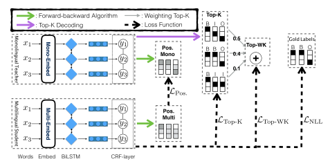
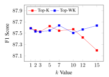

# Structure-Level Knowledge Distillation For Multilingual Sequence Labeling

Xinyu Wang , Yong Jiang† , Nguyen Bach† , Tao Wang† , Fei Huang† , Kewei Tu∗

School of Information Science and Technology, ShanghaiTech University Shanghai Engineering Research Center of Intelligent Vision and Imaging Shanghai Institute of Microsystem and Information Technology, Chinese Academy of Sciences University of Chinese Academy of Sciences †DAMO Academy, Alibaba Group

{wangxy1,tukw}@shanghaitech.edu.cn {yongjiang.jy,nguyen.bach,leeo.wangt,f.huang}@alibaba-inc.com

## Abstract

Multilingual sequence labeling is a task of predicting label sequences using a single unified model for multiple languages. Compared with relying on multiple monolingual models, using a multilingual model has the benefit of a smaller model size, easier in online serving, and generalizability to low-resource languages. However, current multilingual models still underperform individual monolingual models significantly due to model capacity limitations. In this paper, we propose to reduce the gap between monolingual models and the unified multilingual model by distilling the structural knowledge of several monolingual models (teachers) to the unified multilingual model (student). We propose two novel KD methods based on structure-level information: (1) approximately minimizes the distance between the student's and the teachers' structurelevel probability distributions, (2) aggregates the structure-level knowledge to local distributions and minimizes the distance between two local probability distributions. Our experiments on 4 multilingual tasks with 25 datasets show that our approaches outperform several strong baselines and have stronger zero-shot generalizability than both the baseline model and teacher models.

## 1 Introduction

Sequence labeling is an important task in natural language processing. Many tasks such as named entity recognition (NER) and part-of-speech (POS) tagging can be formulated as sequence labeling problems and these tasks can provide extra information to many downstream tasks and products such as searching engine, chat-bot and syntax parsing [\(Jurafsky and Martin,](#page-9-0) [2009\)](#page-9-0). Most of the previ-

ous work on sequence labeling focused on monolingual models, and the work on multilingual sequence labeling mainly focused on cross-lingual transfer learning to improve the performance of low-resource or zero-resource languages [\(Johnson](#page-9-1) [et al.,](#page-9-1) [2019;](#page-9-1) [Huang et al.,](#page-9-2) [2019a;](#page-9-2) [Rahimi et al.,](#page-10-0) [2019;](#page-10-0) [Huang et al.,](#page-9-3) [2019b;](#page-9-3) [Keung et al.,](#page-9-4) [2019\)](#page-9-4), but their work still trains monolingual models. However, it would be very resource consuming considering if we train monolingual models for all the 7,000+ languages in the world. Besides, there are languages with limited labeled data that are required for training. Therefore it is beneficial to have a single unified multilingual sequence labeling model to handle multiple languages, while less attention is paid to the unified multilingual models due to the significant difference between different languages. Recently, Multilingual BERT (M-BERT) [\(Devlin et al.,](#page-9-5) [2019\)](#page-9-5) is surprisingly good at zero-shot cross-lingual model transfer on tasks such as NER and POS tagging [\(Pires et al.,](#page-10-1) [2019\)](#page-10-1). M-BERT bridges multiple languages and makes training a multilingual sequence labeling model with high performance possible [\(Wu and](#page-11-0) [Dredze,](#page-11-0) [2019\)](#page-11-0). However, accuracy of the multilingual model is still inferior to monolingual models that utilize different kinds of strong pretrained word representations such as contextual string embeddings (Flair) proposed by [Akbik et al.](#page-9-6) [\(2018\)](#page-9-6).

To diminish the performance gap between monolingual and multilingual models, we propose to utilize knowledge distillation to transfer the knowledge from several monolingual models with strong word representations into a single multilingual model. Knowledge distillation [\(Bucilua et al.](#page-9-7) ˇ , [2006;](#page-9-7) [Hinton et al.,](#page-9-8) [2015\)](#page-9-8) is a technique that first trains a strong teacher model and then trains a weak student model through mimicking the output probabilities [\(Hinton et al.,](#page-9-8) [2015;](#page-9-8) [Lan et al.,](#page-10-2) [2018;](#page-10-2) [Mirzadeh et al.,](#page-10-3) [2019\)](#page-10-3) or hidden states [\(Romero](#page-10-4)

<sup>∗</sup> Kewei Tu is the corresponding author. This work was conducted when Xinyu Wang was interning at Alibaba DAMO Academy.

et al., 2014; Seunghyun Lee, 2019) of the teacher model. The student model can achieve an accuracy comparable to that of the teacher model and usually has a smaller model size through KD. Inspired by KD applied in neural machine translation (NMT) (Kim and Rush, 2016) and multilingual NMT (Tan et al., 2019), our approach contains a set of monolingual teacher models, one for each language, and a single multilingual student model. Both groups of models are based on BiLSTM-CRF (Lample et al., 2016; Ma and Hovy, 2016), one of the state-of-the-art models in sequence labeling. In BiLSTM-CRF, the CRF layer models the relation between neighbouring labels which leads to better results than simply predicting each label separately based on the BiLSTM outputs. However, the CRF structure models the label sequence globally with the correlations between neighboring labels, which increases the difficulty in distilling the knowledge from the teacher models. In this paper, we propose two novel KD approaches that take structure-level knowledge into consideration for multilingual sequence labeling. To share the structure-level knowledge, we either minimize the difference between the student's and the teachers' distribution of global sequence structure directly through an approximation approach or aggregate the global sequence structure into local posterior distributions and minimize the difference of aggregated local knowledge. Experimental results show that our proposed approach boosts the performance of the multilingual model in 4 tasks with 25 datasets. Furthermore, our approach has better performance in zero-shot transfer compared with the baseline multilingual model and several monolingual teacher models.

#### 2 Background

### <span id="page-1-1"></span>2.1 Sequence Labeling

BiLSTM-CRF (Lample et al., 2016; Ma and Hovy, 2016) is one of the most popular approaches to sequence labeling. Given a sequence of n word tokens  $\mathbf{x} = \{x_1, \dots, x_n\}$  and the corresponding sequence of gold labels  $\mathbf{y}^* = \{y_1^*, \dots, y_n^*\}$ , we first feed the token representations of  $\mathbf{x}$  into a BiLSTM to get the contextual token representations  $\mathbf{r} = \{\mathbf{r}_1, \dots, \mathbf{r}_n\}$ . The conditional probability  $p(\mathbf{y}|\mathbf{x})$  is defined by:

$$\psi(y', y, \mathbf{r}_i) = \exp(\mathbf{W}_y^T \mathbf{r}_i + \mathbf{b}_{y',y})$$
 (1)

<span id="page-1-3"></span>
$$p(\mathbf{y}|\mathbf{x}) = \frac{\prod_{i=1}^{n} \psi(y_{i-1}, y_i, \mathbf{r}_i)}{\sum_{\mathbf{y}' \in \mathcal{Y}(\mathbf{x})} \prod_{i=1}^{n} \psi(y'_{i-1}, y'_i, \mathbf{r}_i)}$$
(2)

where  $\mathcal{Y}(\mathbf{x})$  denotes the set of all possible label sequences for  $\mathbf{x}$ ,  $\psi$  is the potential function,  $\mathbf{W}_y$  and  $\mathbf{b}_{y',y}$  are parameters and  $y_0$  is defined to be a special start symbol.  $\mathbf{W}_y^T r_i$  and  $\mathbf{b}_{y',y}$  are usually called emission and transition scores respectively. During training, the negative log-likelihood loss for an input sequence is defined by:

$$\mathcal{L}_{NLL} = -\log p(\mathbf{y}^*|\mathbf{x})$$

BiLSTM-Softmax approach to sequence labeling reduces the task to a set of label classification problem by disregarding label transitions and simply feeding the emission scores  $\mathbf{W}^T\mathbf{r}_i$  into a softmax layer to get the probability distribution of each variable  $y_i$ .

<span id="page-1-0"></span>
$$p(y_i|\mathbf{x}) = \operatorname{softmax}(\mathbf{W}^T \mathbf{r}_i)$$
 (3)

The loss function then becomes:

$$\mathcal{L}_{\text{NLL}} = -\sum_{i=1}^{n} \log p(y_i^* | \mathbf{x})$$

In spite of its simplicity, this approach ignores correlations between neighboring labels and hence does not adequately model the sequence structure. Consequently, it empirically underperforms the first approach in many applications.

### 2.2 Knowledge Distillation

A typical approach to KD is training a student network by imitating a teacher's predictions (Hinton et al., 2015). The simplest approach to KD on BiLSTM-Softmax sequence labeling follows Eq. 3 and performs **token-level** distillation through minimizing the cross-entropy loss between the individual label distributions predicted by the teacher model and the student model:

<span id="page-1-4"></span>
$$\mathcal{L}_{\text{Token}} = -\sum_{i=1}^{n} \sum_{j=1}^{|\mathcal{V}|} p_t(y_i = j | \mathbf{x}) \log p_s(y_i = j | \mathbf{x})$$
 (4)

<span id="page-1-2"></span>where  $p_t(y_i = j | \mathbf{x})$  and  $p_s(y_i = j | \mathbf{x})$  are the label distributions predicted by the teacher model and the student model respectively and  $|\mathcal{V}|$  is the number of possible labels. The final loss of the student

<span id="page-2-0"></span>

Figure 1: Structure-level knowledge distillation approaches. *Mono/Multi* represents Monolingual and Multilingual, respectively. *Pos.* represents the posterior distribution.

model combines the KD loss and the negative loglikelihood loss:

$$L = \lambda \mathcal{L}_{Token} + (1 - \lambda) \mathcal{L}_{NLL}$$

where λ is a hyperparameter. As pointed out in Section [2.1,](#page-1-1) however, sequence labeling based on Eq. [3](#page-1-0) has the problem of ignoring structure-level knowledge. In the BiLSTM-CRF approach, we can also apply an Emission distillation through feeding emission scores in Eq. [3](#page-1-0) and get emission probabilities p˜(y<sup>i</sup> |x), then the loss function becomes:

$$\mathcal{L}_{\text{Emission}} = -\sum_{i=1}^{n} \sum_{j=1}^{|\mathcal{V}|} \tilde{p}_t(y_i = j|\mathbf{x}) \log \tilde{p}_s(y_i = j|\mathbf{x})$$
 (5)

## 3 Approach

In this section, we propose two approaches to learning a single multilingual sequence labeling model (student) by distilling structure-level knowledge from multiple mono-lingual models. The first approach approximately minimizes the difference between structure-level probability distributions predicted by the student and teachers. The second aggregates structure-level knowledge into local posterior distributions and then minimizes the difference between local distributions produced by the student and teachers. Our approaches are illustrated in Figure [1.](#page-2-0)

Both the student and the teachers are BiLSTM-CRF models [\(Lample et al.,](#page-10-5) [2016;](#page-10-5) [Ma and Hovy,](#page-10-6) [2016\)](#page-10-6), one of the state-of-the-art models in sequence labeling. A BiLSTM-CRF predicts the distribution of the whole label sequence structure, so token-level distillation is no longer possible and structure-level distillation is required.

## 3.1 Top-K Distillation

Inspired by [Kim and Rush](#page-9-9) [\(2016\)](#page-9-9), we propose to encourage the student to mimic the teachers' global structural probability distribution over all possible label sequences:

<span id="page-2-1"></span>
$$\mathcal{L}_{Str} = -\sum_{\mathbf{y} \in \mathcal{Y}(\mathbf{x})} p_t(\mathbf{y}|\mathbf{x}) \log p_s(\mathbf{y}|\mathbf{x})$$
 (6)

<span id="page-2-3"></span>However, |Y(x)| is exponentially large as it represents all possible label sequences. We propose two methods to alleviates this issue through efficient approximations of pt(y|x) using the k-best label sequences.

Top-K Eq. [6](#page-2-1) can be seen as computing the expected student log probability with respect to the teacher's structural distribution:

<span id="page-2-2"></span>
$$\mathcal{L}_{Str} = -\mathbb{E}_{p_t(\mathbf{y}|\mathbf{x})}[\log p_s(\mathbf{y}|\mathbf{x})]$$
 (7)

The expectation can be approximated by sampling from the teacher's distribution pt(y|x). However, unbiased sampling from the distribution is difficult. We instead apply a biased approach that regards the k-best label sequences predicted by the

<span id="page-3-5"></span>

|          | ψ(yk−1, yk, rk) |        |    |    |    | LABEL SEQ. PROBS. | STRUCTURAL KNOWLEDGE |       |      |       |         |  |  |
|----------|-----------------|--------|----|----|----|-------------------|----------------------|-------|------|-------|---------|--|--|
|          |                 |        | y1 | y2 | y3 | Prob.             |                      | y1    | y2   | y3    | Weights |  |  |
|          | k = 2           |        | F  | F  | F  | 0.035             |                      | T     | T    | F     | 0.57    |  |  |
| yk−1\ yk | y2 = F          | y2 = T | F  | F  | T  | 0.316             | Top-2                | F     | F    | T     | 0.43    |  |  |
| y1 = F   | 2               | 1/2    | F  | T  | F  | 0.105             | α(yk = F)            | 1.00  | 2.50 | 10.83 |         |  |  |
| y1 = T   | 1/2             | 2      | F  | T  | T  | 0.007             | α(yk = T)            | 1.00  | 2.50 | 8.13  |         |  |  |
|          | k = 3           |        | T  | F  | F  | 0.009             | β(yk = F)            | 8.79  | 3.33 | 1.00  |         |  |  |
| yk−1\ yk | y3 = F          | y3 = T | T  | F  | T  | 0.079             | β(yk = T)            | 10.17 | 4.25 | 1.00  |         |  |  |
| y2 = F   | 1/3             | 3      | T  | T  | F  | 0.422             | q(yk = F x)          | 0.46  | 0.44 | 0.57  |         |  |  |
| y2 = T   | 4               | 1/4    | T  | T  | T  | 0.026             | q(yk = T x)          | 0.54  | 0.56 | 0.43  |         |  |  |

Table 1: Example of computing the structural knowledge for a sequence of 3 tokens with a label set of {T, F}. ψ(yk−1, yk, rk) represents the potential formulated in Eq. [1.](#page-1-2) Each Label Seq. Probs. is defined in Eq. [2](#page-1-3) for the corresponding label sequence. Top-2 represents the two label sequences with the highest scores and Weights are their corresponding weights for KD (Eq. [8,](#page-3-0) [9\)](#page-3-1). α(yk), β(yk) and the posterior distribution q(yk|x) are computed based on Eq. [11,](#page-3-2) [12](#page-3-3) and [10](#page-3-4) respectively. We assume that ψ(y0, y1, r1) = 1 regardless of whether y<sup>1</sup> is T or F.

teacher model as our samples. We use a modified Viterbi algorithm to predict the k-best label sequences T = {yˆ 1 , . . . , yˆ <sup>k</sup>}. Eq. [7](#page-2-2) is then approximated as:

$$\mathcal{L}_{\text{Top-K}} = -\frac{1}{k} \sum_{\hat{\mathbf{y}} \in \mathcal{T}} \log p_s(\hat{\mathbf{y}}|\mathbf{x})$$
 (8)

This can also be seen as data augmentation through generating k pseudo target label sequences for each input sentence by the teacher.

Weighted Top-K The Top-K method is highly biased in that the approximation becomes worse with a larger k . A better method is to associate weights to the k samples to better approximate pt(y|x).

$$p_t'(\mathbf{y}|\mathbf{x}) = \begin{cases} \frac{p_t(\mathbf{y}|\mathbf{x})}{\sum\limits_{\hat{\mathbf{y}} \in \mathcal{T}} p_t(\hat{\mathbf{y}}|\mathbf{x})} & \mathbf{y} \in \mathcal{T} \\ 0 & \mathbf{y} \notin \mathcal{T} \end{cases}$$

Eq. [7](#page-2-2) is then approximated as:

$$\mathcal{L}_{\text{Top-WK}} = -\sum_{\mathbf{y} \in \mathcal{T}} p_t'(\mathbf{y}|\mathbf{x}) \log p_s(\mathbf{y}|\mathbf{x}) \quad (9)$$

This can be seen as the student learning weighted pseudo target label sequences produced by the teacher for each input sentence.

The Top-K approach is related to the previous work on model compression in neural machine translation [\(Kim and Rush,](#page-9-9) [2016\)](#page-9-9) and multilingual neural machine translation [\(Tan et al.,](#page-11-2) [2019\)](#page-11-2). In neural machine translation, producing k-best label sequences is intractable in general and in practice, beam search decoding has been used to approximate the k-best label sequences. However, for linear-chain CRF model, k-best label sequences can be produced exactly with the modified Viterbi algorithm.

## 3.2 Posterior Distillation

<span id="page-3-0"></span>The Top-K is approximate with respect to the teacher's structural distribution and still is slow on large k. Our second approach tries to distill structure-level knowledge based on tractable local (token-wise) distributions q(yk|x), which can be exactly computed.

$$q(y_k|\mathbf{x}) = \sum_{\{y_1, \dots, y_n\} \setminus y_k} p(y_1, \dots, y_n|\mathbf{x})$$

$$= \frac{\sum_{\{y_1, \dots, y_n\} \setminus y_k} \prod_{i=1}^n \psi(y_{i-1}, y_i, \mathbf{r}_i)}{\mathcal{Z}}$$

$$\propto \alpha(y_k) \times \beta(y_k)$$

$$\alpha(y_k) = \sum_{i=1}^k \psi(y_{i-1}, y_i, \mathbf{r}_i)$$
 (11)

<span id="page-3-4"></span><span id="page-3-2"></span>
$$\alpha(y_k) = \sum_{\{y_0, \dots, y_{k-1}\}} \prod_{i=1} \psi(y_{i-1}, y_i, \mathbf{r}_i)$$
 (11)

<span id="page-3-3"></span>
$$\beta(y_k) = \sum_{\{y_{k+1},\dots,y_n\}} \prod_{i=k+1}^n \psi(y_{i-1}, y_i, \mathbf{r}_i)$$
 (12)

<span id="page-3-1"></span>where Z is the denominator of Eq. [2](#page-1-3) that is usually called the *partition function* and α(yk) and β(yk) are calculated in forward and backward pass utilizing the forward-backward algorithm. We assume that β(yn) = 1.

Given the local probability distribution for each token, we define the KD loss function in a similar manner with the token-level distillation in Eq. [5.](#page-2-3)

<span id="page-3-6"></span>
$$\mathcal{L}_{Pos.} = -\sum_{i=1}^{n} \sum_{j=1}^{|\mathcal{V}|} q_t(y_i = j|\mathbf{x}) \log q_s(y_i = j|\mathbf{x})$$
(13)

The difference between token-level distillation and posterior distillation is that posterior distillation is based on BiLSTM-CRF and conveys global

#### <span id="page-4-0"></span>Algorithm 1 KD for Multilingual Sequence Labeling

- 1: **Input**: Training corpora  $\mathcal{D} = \{D^1, \dots, D^l\}$  with l languages, monolingual models  $\mathcal{T} = \{T^1, \dots, T^l\}$  pretrained on the corresponding training corpus, learning rate  $\eta$ , multilingual student model  $\mathcal{M}$  with parameters  $\theta$ , total training epochs  $\mathcal{S}$ , loss interpolation coefficient  $\lambda$ , interpolation annealing rate  $\tau$ .
- 2: **Initialize**: Randomly initialize multilingual model parameters  $\theta$ . Set the current training epoch S=0, current loss interpolation  $\lambda=1$ . Create an new empty training dataset  $\hat{\mathcal{D}}$ .

```
3:
 4: for D^i \in \mathcal{D} do
 5:
         for (\mathbf{x}_i^i, \mathbf{y}_i^i) \in D^i do
                Teacher model T_i reads the input \mathbf{x}_i^i and predicts
      probability distributions \hat{p}_{i}^{i} required for KD.
                Append (\mathbf{x}_{i}^{i}, \mathbf{y}_{i}^{i}, \hat{p}_{i}^{i}) into the new training dataset
 7:
      \mathcal{D}.
          end for
 8:
 9: end for
10.
11: while S < \mathcal{S} do
            S = S + 1.
12:
13:
            for mini-batch (\mathbf{x}, \mathbf{y}, \hat{p}) sampled from \hat{\mathcal{D}} do
14:
               Compute the KD loss \mathcal{L}_{\text{KD}}(\mathbf{x}, \hat{p}).
               Compute the golden target loss \mathcal{L}_{NLL}(\mathbf{x}, \mathbf{y}).
15:
16:
               Compute the final loss L = \lambda \mathcal{L}_{KD} + (1 - \lambda)\mathcal{L}_{NLL}.
17:
               Update \theta: \theta = \theta - \eta * \partial \mathcal{L}/\partial \theta.
18:
            if \lambda - \tau > 0 do
19:
               Update interpolation factor \lambda: \lambda = \lambda - \tau
20:
               Update interpolation factor \lambda: \lambda = 0
21:
22:
            end if
23: end while
```

structural knowledge in the local probability distribution

Posterior distillation has not been used in the related research of knowledge distillation in neural machine translation because of intractable computation of local distributions. In sequence labeling, however, local distributions in a BiLSTM-CRF can be computed exactly using the forward-backward algorithm.

An example of computing the structural knowledge discussed in this and last subsections is shown in Table 1.

### 3.3 Multilingual Knowledge Distillation

Let  $\mathcal{D}=\{D^1,\dots,D^l\}$  denotes a set of training data with l languages.  $D^i$  denotes the corpus of the i-th language that contains multiple sentence and label sequence pairs  $D^i=\{(\mathbf{x}_j^i,\mathbf{y}_j^i)\}_{j=1}^{m_i}$ . To train a single multilingual student model from multiple monolingual pretrained teachers, for each input sentence, we first use the teacher model of the corresponding language to predict the pseudo targets (k-best label sequences or posterior distribution for posterior distillation). Then the student jointly

learns from the gold targets and pseudo targets in training by optimizing the following loss function:

$$\mathcal{L}_{ALL} = \lambda \mathcal{L}_{KD} + (1 - \lambda) \mathcal{L}_{NLL}$$

where  $\lambda$  decreases from 1 to 0 throughout training following Clark et al. (2019),  $\mathcal{L}_{KD}$  is one of the Eq. 5, 8, 9, 13 or an averaging of Eq. 9, 13. The overall distillation process is summarized in Algorithm 1.

### 4 Experiment

#### 4.1 Setup

**Dataset** We use datasets from 4 sequence labeling tasks in our experiment.

- CoNLL NER: We collect the corpora of 4 languages from the CoNLL 2002 and 2003 shared task (Tjong Kim Sang, 2002; Tjong Kim Sang and De Meulder, 2003)
- WikiAnn NER (Pan et al., 2017): The dataset contains silver standard NER tags that are annotated automatically on 282 languages that exist in Wikipedia. We select the data of 8 languages from different language families or from different language subgroups of Indo-European languages. We randomly choose 5000 sentences from the dataset for each language except English, and choose 10000 sentences for English to reflect the abundance of English corpora in practice. We split the dataset by 8:1:1 for training/development/test.
- Universal Dependencies (UD) (Nivre et al., 2016): We use universal POS tagging annotations in the UD datasets. We choose 8 languages from different language families or language subgroups and one dataset for each language.
- Aspect Extraction: The dataset is from an aspect-based sentiment analysis task in SemEval-2016 Task 5 (Pontiki et al., 2016). We choose subtask 1 of the restaurants domain which has the most languages in all domains<sup>1</sup>, and split 10% of the training data as the development data.

<span id="page-4-1"></span><sup>&</sup>lt;sup>1</sup>Subtask 1 of the restaurants domain contains 6 languages but we failed to get the French dataset as the dataset is not accessible from the provided crawling toolkit.

<span id="page-5-1"></span>

|      | Task        |       |       | CoNLL NER |                                   |       |       | SemEval 2016 Aspect Extraction             |       |       |       |       |
|------|-------------|-------|-------|-----------|-----------------------------------|-------|-------|--------------------------------------------|-------|-------|-------|-------|
|      | Approach    |       |       |           | English Dutch Spanish German Avg. |       |       | Turkish Spanish Dutch English Russian Avg. |       |       |       |       |
|      | TEACHERS    | 92.43 | 91.90 | 89.19     | 84.00                             | 89.38 | 59.29 | 74.29                                      | 72.85 | 72.80 | 71.77 | 70.20 |
| REF  | SOFTMAX     | 90.08 | 88.99 | 87.72     | 81.40                             | 87.05 | 52.39 | 71.54                                      | 68.86 | 65.87 | 66.85 | 65.10 |
|      | TOKEN       | 90.02 | 88.87 | 88.24     | 81.30                             | 87.11 | 52.56 | 72.12                                      | 69.33 | 66.81 | 67.20 | 65.61 |
|      | BASELINE    | 90.13 | 89.11 | 88.06     | 82.16                             | 87.36 | 55.79 | 72.02                                      | 69.35 | 67.54 | 68.02 | 66.54 |
| BASE | EMISSION    | 90.28 | 89.31 | 88.65     | 81.96                             | 87.55 | 51.52 | 72.60                                      | 69.10 | 67.21 | 68.52 | 65.79 |
|      | TOP-K       | 90.57 | 89.33 | 88.61     | 81.99                             | 87.62 | 55.74 | 73.13                                      | 69.81 | 67.99 | 69.21 | 67.18 |
|      | TOP-WK      | 90.52 | 89.24 | 88.64     | 82.15                             | 87.64 | 56.40 | 72.81                                      | 69.33 | 68.16 | 69.42 | 67.22 |
| OURS | POSTERIOR   | 90.68 | 89.41 | 88.57     | 82.22                             | 87.72 | 56.69 | 73.47                                      | 69.98 | 68.11 | 69.22 | 67.49 |
|      | POS.+TOP-WK | 90.53 | 89.58 | 88.66     | 82.31                             | 87.77 | 55.00 | 73.97                                      | 70.15 | 67.83 | 69.76 | 67.34 |

<span id="page-5-2"></span>Table 2: Results in F1 score of CoNLL 2002/2003 NER task and Aspect Extraction of SemEval 2016 Task 5.

|      | Approach    |       |       |       |       | English Tamil Basque Hebrew Indonesian Persian Slovenian French |       |       |       | Avg.  |
|------|-------------|-------|-------|-------|-------|-----------------------------------------------------------------|-------|-------|-------|-------|
|      | TEACHERS    | 83.80 | 86.72 | 94.68 | 83.72 | 90.48                                                           | 90.37 | 91.66 | 90.29 | 88.97 |
| REF  | SOFTMAX     | 81.86 | 80.72 | 93.72 | 77.11 | 90.64                                                           | 90.03 | 91.05 | 88.18 | 86.66 |
|      | TOKEN       | 81.33 | 80.88 | 93.56 | 77.47 | 90.50                                                           | 89.83 | 91.08 | 87.93 | 86.57 |
|      | BASELINE    | 82.56 | 82.39 | 94.13 | 78.89 | 91.11                                                           | 90.23 | 91.62 | 88.92 | 87.48 |
| BASE | EMISSION    | 82.54 | 82.23 | 94.37 | 78.45 | 90.92                                                           | 89.92 | 91.56 | 89.47 | 87.43 |
|      | TOP-K       | 82.39 | 82.94 | 94.13 | 78.93 | 90.93                                                           | 90.12 | 91.56 | 89.25 | 87.53 |
|      | TOP-WK      | 82.55 | 82.71 | 94.44 | 78.79 | 91.18                                                           | 90.22 | 91.37 | 89.32 | 87.57 |
| OURS | POSTERIOR   | 83.03 | 83.02 | 94.35 | 78.77 | 91.75                                                           | 90.11 | 91.95 | 89.65 | 87.83 |
|      | Pos.+Top-WK | 82.77 | 82.81 | 94.47 | 78.87 | 91.18                                                           | 90.31 | 91.84 | 89.42 | 87.71 |

Table 3: F1 scores in the WikiAnn NER task.

<span id="page-5-3"></span>

|      | Approach    |       |       |       |       |       | English Hebrew Japanese Slovenian French Indonesian Persian Tamil |       |             | Avg. |
|------|-------------|-------|-------|-------|-------|-------|-------------------------------------------------------------------|-------|-------------|------|
|      | TEACHERS    | 96.94 | 97.54 | 96.81 | 95.01 | 99.10 | 94.02                                                             | 98.07 | 93.01 96.31 |      |
| REF  | SOFTMAX     | 95.61 | 96.25 | 96.59 | 90.66 | 97.94 | 92.56                                                             | 96.62 | 86.58 94.10 |      |
|      | TOKEN       | 95.66 | 96.28 | 96.47 | 90.82 | 97.95 | 92.70                                                             | 96.58 | 86.41 94.11 |      |
|      | BASELINE    | 95.71 | 96.18 | 96.60 | 90.64 | 97.89 | 92.62                                                             | 96.63 | 86.19 94.06 |      |
| BASE | EMISSION    | 95.63 | 96.21 | 96.52 | 90.76 | 97.98 | 92.64                                                             | 96.61 | 86.66 94.13 |      |
|      | TOP-K       | 95.74 | 96.27 | 96.56 | 90.66 | 97.96 | 92.58                                                             | 96.64 | 86.57 94.12 |      |
|      | TOP-WK      | 95.68 | 96.23 | 96.58 | 90.73 | 97.89 | 92.62                                                             | 96.62 | 86.74 94.14 |      |
| OURS | POSTERIOR   | 95.71 | 96.34 | 96.59 | 90.91 | 97.99 | 92.72                                                             | 96.69 | 87.36 94.29 |      |
|      | POS.+TOP-WK | 95.74 | 96.27 | 96.47 | 90.84 | 98.02 | 92.58                                                             | 96.73 | 86.97 94.20 |      |

Table 4: Accuracies in UD POS tagging.

Model Configurations In our experiment, all the word embeddings are fixed and M-BERT token embeddings are obtained by average pooling. We feed the token embeddings into the BiLSTM-CRF for decoding. The hidden size of the BiLSTM layer is 256 for the monolingual teacher models and 600 or 800 for the multilingual student model depending on the dataset as larger hidden size for the multilingual model results in better performance in our experiment. The settings of teacher and student models are as follows:

• Monolingual Teachers: Each teacher is trained with a dataset of a specific language. We use M-BERT concatenated with languagespecific *Flair* [\(Akbik et al.,](#page-9-6) [2018\)](#page-9-6) embeddings and *fastText* [\(Bojanowski et al.,](#page-9-11) [2017\)](#page-9-11) word embeddings as token embeddings[2](#page-5-0) for all the

monolingual teacher models.

• Multilingual Student: The student model is trained with the datasets of all the languages combined. We only use M-BERT as token embeddings for the multilingual student model.

Training For model training, the mini-batch size is set to 2000 tokens. We train all models with SGD optimizer with a learning rate of 0.1 and anneal the learning rate by 0.5 if there is no improvements on the development set for 10 epochs. For all models, we use a single NVIDIA Tesla V100 GPU for training including the student model. We tune the loss interpolation anneal rate in {0.5, 1.0} and the k value of Top-K ranging from [1, 10].

## <span id="page-5-4"></span>4.2 Results

We report results of the following approaches.

<span id="page-5-0"></span><sup>2</sup>We use fastText + M-BERT instead if the Flair embedding is not available for a certain language.

<span id="page-6-0"></span>

|                  | Tamil | Basque | Hebrew | Indonesian | Persian | Slovenian | French | Avg.  |
|------------------|-------|--------|--------|------------|---------|-----------|--------|-------|
| TEACHERS         | 24.98 | 40.51  | 25.39  | 35.54      | 11.05   | 59.95     | 60.54  | 36.85 |
| BASELINE         | 37.83 | 47.80  | 47.96  | 38.71      | 16.23   | 61.22     | 59.34  | 44.15 |
| EMISSION         | 37.99 | 46.69  | 47.34  | 38.52      | 16.11   | 60.75     | 59.81  | 43.89 |
| POSTERIOR        | 38.93 | 47.52  | 48.33  | 38.76      | 16.69   | 62.04     | 60.77  | 44.72 |
| POSTERIOR+TOP-WK | 38.23 | 47.49  | 48.79  | 39.32      | 16.19   | 62.03     | 60.34  | 44.63 |

Table 5: Results of zero-shot transfer in the NER task (CoNLL ⇒ WikiAnn).

- Baseline represents training the multilingual model with the datasets of all the languages combined and without knowledge distillation.
- Emission is the KD method based on Eq. [5.](#page-2-3)
- Top-K, Top-WK and Posterior are our KD methods formulated by Eq. [8,](#page-3-0) Eq. [9](#page-3-1) and Eq. [13](#page-3-6) resprectively.
- Pos.+Top-WK is a mixture of posterior and weighted Top-K distillation.

We also report the results of monolingual models as Teachers and multilingual BiLSTM-Softmax model with token-level KD based on Eq. [4](#page-1-4) as Softmax and Token for reference.

Table [2,](#page-5-1) [3,](#page-5-2) and [4](#page-5-3) show the effectiveness of our approach on 4 tasks over 25 datasets. In all the tables, we report scores averaged over 5 runs.

Observation #0. BiLSTM-Softmax models perform inferior to BiLSTM-CRF models in most cases in the multilingual setting: The results show that the BiLSTM-CRF approach is stronger than the BiLSTM-Softmax approach on three of the four tasks, which are consistent with previous work on sequence labeling [\(Ma and Hovy,](#page-10-6) [2016;](#page-10-6) [Reimers and Gurevych,](#page-10-10) [2017;](#page-10-10) [Yang et al.,](#page-11-5) [2018\)](#page-11-5). The token-level KD approach performs almost the same as the BiLSTM-Softmax baseline in most of the tasks except the Aspect Extraction task.

Observation #1. Monolingual teacher models outperform multilingual student models: This is probably because the monolingual teacher models are based on both multilingual embeddings M-BERT and strong monolingual embeddings (Flair/fastText). The monolingual embedding may provide additional information that is not available to the multilingual student models. Furthermore, note that the learning problem faced by a multilingual student model is much more difficult than that of a teacher model because a student model has to handle all the languages using roughly the same model size as a teacher model.

Observation #2. Emission fails to transfer knowledge: Emission outperforms the baseline

<span id="page-6-1"></span>

|                 | NER   | POS   |
|-----------------|-------|-------|
| TEACHERS        | 41.85 | 56.01 |
| BASELINE        | 50.86 | 84.11 |
| EMISSION        | 50.19 | 84.17 |
| POSTERIOR       | 51.43 | 84.28 |
| POSTERIOR+TOP-K | 51.14 | 84.24 |

Table 6: Averaged results of zero-shot transfer on another 28 languages of the NER task and 24 languages of the POS tagging task.

only on 12 out of 25 datasets. This shows that simply following the standard approach of knowledge distillation from emission scores is not sufficient for the BiLSTM-CRF models.

Observation #3. Top-K and Top-WK outperform the baseline: Top-K outperforms the baseline on 15 datasets. It outperforms Emission on average on Wikiann NER and Aspect Extraction and is competitive with Emission in the other two tasks. Top-WK outperforms the baseline on 18 datasets and it outperforms Top-K in all the tasks. Observation #4. Posterior achieves the best performance on most of the tasks: The Posterior approach outperforms the baseline on 21 datasets and only underperforms the baseline by 0.12 on 2 languages in WikiAnn and by 0.01 on one language in UD POS tagging. It outperforms the other methods on average in all the tasks except that is slightly underperforms Pos.+Top-WK in the CoNLL NER task.

Observation #5. Top-WK+Posterior stays in between: Pos.+Top-WK outperforms both Top-WK and Posterior only in the CoNLL NER task. In the other three tasks, its performance is above that of Top-WK but below that of Posterior.

## 4.3 Zero-shot Transfer

We use the monolingual teacher models, multilingual baseline models and our Posterior and Pos.+Top-WK models trained on the CoNLL NER datasets to predict NER tags on the test sets of 7 languages in WikiAnn that used in Section [4.2.](#page-5-4) Table [5](#page-6-0) shows the results. For the teacher models, we report the maximum score over all the teachers for

<span id="page-7-0"></span>

|           |       |       | English Dutch Spanish German |       | Avg.  |
|-----------|-------|-------|------------------------------|-------|-------|
| TEACHERS  | 90.63 | 89.65 | 88.05                        | 81.81 | 87.54 |
| BASELINE  | 90.13 | 89.11 | 88.06                        | 82.16 | 87.36 |
| POSTERIOR | 90.57 | 89.17 | 88.61                        | 82.16 | 87.63 |

Table 7: Posterior distillation with weaker teachers.

each language. The results show that multilingual models significantly outperform the teacher models. For languages such as Tamil and Hebrew, which are very different from the languages in the CoNLL datasets, the performance of the teacher models drops dramatically compared with the multilingual models. It shows that the language specific features in teacher models limits their generalizability on new languages. Our multilingual models, Posterior and Pos.+Top-WK outperform the baseline on all the languages. Emission slightly underperforms *Baseline*, once again showing its ineffectiveness in knowledge distillation.

We also conduct experiments on zero-shot transferring over other 28 languages on WikiAnn NER datasets and 24 languages on UD POS tagging datasets. The averaged results are shown in Table [6.](#page-6-1) The NER experiment shows that our approaches outperforms Baseline on 24 out of 28 languages and the Posterior is stronger than Pos.+Top-WK by 0.29 F1 score on average. The POS tagging experiment shows that our approach outperforms Baseline on 20 out of 24 languages. For more details, please refer to the Appendices [A.](#page-11-6)

## 4.4 KD with Weaker Teachers

To show the effectiveness of our approach, we train weaker monolingual teachers using only M-BERT embeddings on four datasets of the CoNLL NER task. We run Posterior distillation and keep the setting of the student model unchanged. In this setting, Posterior not only outperforms the baseline, but also outperforms the teacher model on average. This shows that our approaches still work when the teachers have the same token embeddings as the student. By comparing Table [7](#page-7-0) and [2,](#page-5-1) we can also see that stronger teachers lead to better students.

### 4.5 k Value in Top-K

To show how the k value affects the performance of Top-K and Top-WK distillation methods, we compare the models with two distillation methods and different k values on the CoNLL NER task. Figure [2](#page-7-1) shows that Top-K drops dramatically when k gets larger while Top-WK performs stably. Therefore

<span id="page-7-1"></span>

<span id="page-7-2"></span>Figure 2: Averaged F1 scores on the CoNLL NER task versus the k values of Top-K distillation.

|           | Training Time (hours) |
|-----------|-----------------------|
| BASELINE  | 11                    |
| EMISSION  | 11.5                  |
| TOP-WK    | 18                    |
| POSTERIOR | 16                    |

Table 8: Training time of the Baseline and KD approaches on CoNLL NER datasets. The training time of KD approaches includes teachers predicting and student training.

Top-WK is less sensitive to the hyper-parameter k and might be practical in real applications.

## 4.6 Training Time and Memory Consumption

We compare the training time of different approaches on the CoNLL NER task and report the results in Table [8.](#page-7-2) Our Top-WK and Posterior approaches take 1.45 and 1.63 times the training time of the Baseline approach. For the memory consumption in training, the GPU memory cost does not vary significantly for all the approaches, while the CPU memory cost for all the KD approaches is about 2 times that of the baseline model, because training models with KD requires storing predictions of the teachers in the CPU memory.

## 5 Related Work

Multilingual Sequence Labeling Many important tasks such as NER and POS tagging can be reduced to a sequence labeling problem. Most of the recent work on multilingual NER [\(Täck](#page-11-7)[ström,](#page-11-7) [2012;](#page-11-7) [Fang et al.,](#page-9-12) [2017;](#page-9-12) [Enghoff et al.,](#page-9-13) [2018;](#page-9-13) [Rahimi et al.,](#page-10-0) [2019;](#page-10-0) [Johnson et al.,](#page-9-1) [2019\)](#page-9-1) and POS tagging [\(Snyder et al.,](#page-11-8) [2009;](#page-11-8) [Plank and Agic´,](#page-10-11) [2018\)](#page-10-11) focuses on transferring the knowledge of a specific language to another (low-resource) language. For example, [Johnson et al.](#page-9-1) [\(2019\)](#page-9-1) proposed crosslingual transfer learning for NER focusing on bootstrapping Japanese from English, which has a different character set than Japanese.

Pretrained Word Representations Recent progress on pretrained word representations such as ELMo [\(Peters et al.,](#page-10-12) [2018\)](#page-10-12), BERT [\(Devlin et al.,](#page-9-5) [2019\)](#page-9-5) and XLNet [\(Yang et al.,](#page-11-9) [2019\)](#page-11-9) significantly improve the performance of multiple NLP tasks. Multilingual BERT is a pretrained BERT model incorporating 104 languages into a single multilingual model. [Pires et al.](#page-10-1) [\(2019\)](#page-10-1) showed its ability of generalization and zero-shot transfer learning on NER and POS tagging and [Keung et al.](#page-9-4) [\(2019\)](#page-9-4) used adversarial learning with M-BERT and significantly improved zero-resource cross-lingual NER. On the tasks of NER and POS tagging, Flair embeddings [\(Akbik et al.,](#page-9-6) [2018,](#page-9-6) [2019\)](#page-8-0) is a state-of-the-art method based on character-level language models. [Straka et al.](#page-11-10) [\(2019\)](#page-11-10) found that concatenating Flair embeddings with BERT embeddings outperforms other mixtures of ELMo, BERT and Flair embeddings in most of the subtasks on the CoNLL 2018 Shared Task [\(Zeman](#page-11-11) [and Hajicˇ,](#page-11-11) [2018\)](#page-11-11) datasets on 54 languages, which inspired us to use M-BERT + Flair embeddings as the word representation of teachers.

Knowledge Distillation Knowledge distillation has been used to improve the performance of small models with the guidance of big models, with applications in natural language processing [\(Kim and](#page-9-9) [Rush,](#page-9-9) [2016;](#page-9-9) [Kuncoro et al.,](#page-10-13) [2016;](#page-10-13) [Tan et al.,](#page-11-2) [2019;](#page-11-2) [Clark et al.,](#page-9-10) [2019;](#page-9-10) [Sun et al.,](#page-11-12) [2019\)](#page-11-12), computer vision [\(Ba and Caruana,](#page-9-14) [2014\)](#page-9-14) and speech recognition [\(Huang et al.,](#page-9-15) [2018\)](#page-9-15). For simple classification problems, there is a variety of work on tasks such as sentiment analysis [\(Clark et al.,](#page-9-10) [2019\)](#page-9-10), image recognition [\(Hinton et al.,](#page-9-8) [2015\)](#page-9-8) and cross-lingual text classification [\(Xu and Yang,](#page-11-13) [2017\)](#page-11-13). For structured prediction problems, there are lines of work on neural machine translation [\(Kim and Rush,](#page-9-9) [2016;](#page-9-9) [Tan et al.,](#page-11-2) [2019\)](#page-11-2), connectionist temporal classification in the field of speech recognition [\(Huang](#page-9-15) [et al.,](#page-9-15) [2018\)](#page-9-15) and dependency parsing [\(Kuncoro](#page-10-13) [et al.,](#page-10-13) [2016;](#page-10-13) [Liu et al.,](#page-10-14) [2018\)](#page-10-14). Many recent researches on BERT with knowledge distillation are focused on distilling a large BERT model into a smaller one. [\(Tsai et al.,](#page-11-14) [2019\)](#page-11-14) distilled a large M-BERT model into a three layer M-BERT model for sequence labeling and achieved a competitively

high accuracy with significant speed improvements. [\(Jiao et al.,](#page-9-16) [2019\)](#page-9-16) proposed TinyBERT for natural language understanding. [\(Sanh et al.,](#page-10-15) [2019\)](#page-10-15) proposed a distilled version of the BERT model which achieves a 60% faster speed and maintains 97% performance of the larger BERT model.

## 6 Discussion on Flair/M-BERT Fine-tuning

Previous work has discussed and empirically investigated two ways of adapting monolingual pretrained embedding models to monolingual downstream tasks [\(Peters et al.,](#page-10-16) [2019\)](#page-10-16): either fixing the models and using them for feature extraction, or fine-tuning them in downstream tasks. They found that both settings have comparable performance in most cases. [Wu and Dredze](#page-11-0) [\(2019\)](#page-11-0) found that fine-tuning M-BERT with the bottom layers fixed provides further performance gains in multilingual setting. In this paper, we mainly focus on the first approach and utilize the pretrained embedding as fixed feature extractor because Flair/M-BERT finetuning is too slow for our large-scale experimental design of multilingual KD. Designing a cheap and fast fine-tuning approach for pretrained embedding models might be an interesting direction for future work.

## 7 Conclusion

In this paper our major contributions are the two structure-level methods to distill the knowledge of monolingual models to a single multilingual model in sequence labeling: Top-K knowledge distillation and posterior distillation. The experimental results show that our approach improves the performance of multilingual models over 4 tasks on 25 datasets. The analysis also shows that our model has stronger zero-shot transfer ability on unseen languages on the NER and POS tagging task. Our code is publicly available at [https://github.](https://github.com/Alibaba-NLP/MultilangStructureKD) [com/Alibaba-NLP/MultilangStructureKD](https://github.com/Alibaba-NLP/MultilangStructureKD).

## Acknowledgement

This work was supported by the National Natural Science Foundation of China (61976139).

## References

<span id="page-8-0"></span>Alan Akbik, Tanja Bergmann, and Roland Vollgraf. 2019. [Pooled contextualized embeddings for named](https://doi.org/10.18653/v1/N19-1078)

- [entity recognition.](https://doi.org/10.18653/v1/N19-1078) In *Proceedings of the 2019 Conference of the North American Chapter of the Association for Computational Linguistics: Human Language Technologies, Volume 1 (Long and Short Papers)*, pages 724–728, Minneapolis, Minnesota. Association for Computational Linguistics.
- <span id="page-9-6"></span>Alan Akbik, Duncan Blythe, and Roland Vollgraf. 2018. [Contextual string embeddings for sequence](https://www.aclweb.org/anthology/C18-1139) [labeling.](https://www.aclweb.org/anthology/C18-1139) In *Proceedings of the 27th International Conference on Computational Linguistics*, pages 1638–1649, Santa Fe, New Mexico, USA. Association for Computational Linguistics.
- <span id="page-9-14"></span>Jimmy Ba and Rich Caruana. 2014. [Do deep nets really](http://papers.nips.cc/paper/5484-do-deep-nets-really-need-to-be-deep.pdf) [need to be deep?](http://papers.nips.cc/paper/5484-do-deep-nets-really-need-to-be-deep.pdf) In Z. Ghahramani, M. Welling, C. Cortes, N. D. Lawrence, and K. Q. Weinberger, editors, *Advances in Neural Information Processing Systems 27*, pages 2654–2662. Curran Associates, Inc.
- <span id="page-9-11"></span>Piotr Bojanowski, Edouard Grave, Armand Joulin, and Tomas Mikolov. 2017. Enriching word vectors with subword information. *Transactions of the Association for Computational Linguistics*, 5:135–146.
- <span id="page-9-7"></span>Cristian Bucilua, Rich Caruana, and Alexandru ˇ Niculescu-Mizil. 2006. [Model compression.](https://doi.org/10.1145/1150402.1150464) In *Proceedings of the 12th ACM SIGKDD International Conference on Knowledge Discovery and Data Mining*, KDD '06, pages 535–541, New York, NY, USA. ACM.
- <span id="page-9-10"></span>Kevin Clark, Minh-Thang Luong, Urvashi Khandelwal, Christopher D. Manning, and Quoc V. Le. 2019. [BAM! born-again multi-task networks for natural](https://doi.org/10.18653/v1/P19-1595) [language understanding.](https://doi.org/10.18653/v1/P19-1595) In *Proceedings of the 57th Annual Meeting of the Association for Computational Linguistics*, pages 5931–5937, Florence, Italy. Association for Computational Linguistics.
- <span id="page-9-5"></span>Jacob Devlin, Ming-Wei Chang, Kenton Lee, and Kristina Toutanova. 2019. [BERT: Pre-training of](https://doi.org/10.18653/v1/N19-1423) [deep bidirectional transformers for language under](https://doi.org/10.18653/v1/N19-1423)[standing.](https://doi.org/10.18653/v1/N19-1423) In *Proceedings of the 2019 Conference of the North American Chapter of the Association for Computational Linguistics: Human Language Technologies, Volume 1 (Long and Short Papers)*, pages 4171–4186, Minneapolis, Minnesota. Association for Computational Linguistics.
- <span id="page-9-13"></span>Jan Vium Enghoff, Søren Harrison, and Željko Agic.´ 2018. [Low-resource named entity recognition via](https://doi.org/10.18653/v1/W18-6125) [multi-source projection: Not quite there yet?](https://doi.org/10.18653/v1/W18-6125) In *Proceedings of the 2018 EMNLP Workshop W-NUT: The 4th Workshop on Noisy User-generated Text*, pages 195–201, Brussels, Belgium. Association for Computational Linguistics.
- <span id="page-9-12"></span>Meng Fang, Yuan Li, and Trevor Cohn. 2017. [Learning](https://doi.org/10.18653/v1/D17-1063) [how to active learn: A deep reinforcement learning](https://doi.org/10.18653/v1/D17-1063) [approach.](https://doi.org/10.18653/v1/D17-1063) In *Proceedings of the 2017 Conference on Empirical Methods in Natural Language Processing*, pages 595–605, Copenhagen, Denmark. Association for Computational Linguistics.

- <span id="page-9-8"></span>Geoffrey Hinton, Oriol Vinyals, and Jeffrey Dean. 2015. [Distilling the knowledge in a neural network.](http://arxiv.org/abs/1503.02531) In *NIPS Deep Learning and Representation Learning Workshop*.
- <span id="page-9-2"></span>Lifu Huang, Heng Ji, and Jonathan May. 2019a. [Cross](https://doi.org/10.18653/v1/N19-1383)[lingual multi-level adversarial transfer to enhance](https://doi.org/10.18653/v1/N19-1383) [low-resource name tagging.](https://doi.org/10.18653/v1/N19-1383) In *Proceedings of the 2019 Conference of the North American Chapter of the Association for Computational Linguistics: Human Language Technologies, Volume 1 (Long and Short Papers)*, pages 3823–3833, Minneapolis, Minnesota. Association for Computational Linguistics.
- <span id="page-9-15"></span>Mingkun Huang, Yongbin You, Zhehuai Chen, Yanmin Qian, and Kai Yu. 2018. [Knowledge distillation for](https://doi.org/10.21437/Interspeech.2018-1589) [sequence model.](https://doi.org/10.21437/Interspeech.2018-1589) In *Proc. Interspeech 2018*, pages 3703–3707.
- <span id="page-9-3"></span>Xiaolei Huang, Jonathan May, and Nanyun Peng. 2019b. [What matters for neural cross-lingual named](https://doi.org/10.18653/v1/D19-1672) [entity recognition: An empirical analysis.](https://doi.org/10.18653/v1/D19-1672) In *Proceedings of the 2019 Conference on Empirical Methods in Natural Language Processing and the 9th International Joint Conference on Natural Language Processing (EMNLP-IJCNLP)*, pages 6396–6402, Hong Kong, China. Association for Computational Linguistics.
- <span id="page-9-16"></span>Xiaoqi Jiao, Yichun Yin, Lifeng Shang, Xin Jiang, Xiao Chen, Linlin Li, Fang Wang, and Qun Liu. 2019. Tinybert: Distilling bert for natural language understanding. *arXiv preprint arXiv:1909.10351*.
- <span id="page-9-1"></span>Andrew Johnson, Penny Karanasou, Judith Gaspers, and Dietrich Klakow. 2019. [Cross-lingual transfer](https://doi.org/10.18653/v1/N19-2023) [learning for Japanese named entity recognition.](https://doi.org/10.18653/v1/N19-2023) In *Proceedings of the 2019 Conference of the North American Chapter of the Association for Computational Linguistics: Human Language Technologies, Volume 2 (Industry Papers)*, pages 182–189, Minneapolis - Minnesota. Association for Computational Linguistics.
- <span id="page-9-0"></span>Daniel Jurafsky and James H. Martin. 2009. *Speech and Language Processing (2Nd Edition)*. Prentice-Hall, Inc., Upper Saddle River, NJ, USA.
- <span id="page-9-4"></span>Phillip Keung, yichao lu, and Vikas Bhardwaj. 2019. [Adversarial learning with contextual embeddings for](https://doi.org/10.18653/v1/D19-1138) [zero-resource cross-lingual classification and NER.](https://doi.org/10.18653/v1/D19-1138) In *Proceedings of the 2019 Conference on Empirical Methods in Natural Language Processing and the 9th International Joint Conference on Natural Language Processing (EMNLP-IJCNLP)*, pages 1355– 1360, Hong Kong, China. Association for Computational Linguistics.
- <span id="page-9-9"></span>Yoon Kim and Alexander M. Rush. 2016. [Sequence](https://doi.org/10.18653/v1/D16-1139)[level knowledge distillation.](https://doi.org/10.18653/v1/D16-1139) In *Proceedings of the 2016 Conference on Empirical Methods in Natural Language Processing*, pages 1317–1327, Austin, Texas. Association for Computational Linguistics.

- <span id="page-10-13"></span>Adhiguna Kuncoro, Miguel Ballesteros, Lingpeng Kong, Chris Dyer, and Noah A. Smith. 2016. [Distill](https://doi.org/10.18653/v1/D16-1180)[ing an ensemble of greedy dependency parsers into](https://doi.org/10.18653/v1/D16-1180) [one MST parser.](https://doi.org/10.18653/v1/D16-1180) In *Proceedings of the 2016 Conference on Empirical Methods in Natural Language Processing*, pages 1744–1753, Austin, Texas. Association for Computational Linguistics.
- <span id="page-10-5"></span>Guillaume Lample, Miguel Ballesteros, Sandeep Subramanian, Kazuya Kawakami, and Chris Dyer. 2016. [Neural architectures for named entity recognition.](https://doi.org/10.18653/v1/N16-1030) In *Proceedings of the 2016 Conference of the North American Chapter of the Association for Computational Linguistics: Human Language Technologies*, pages 260–270, San Diego, California. Association for Computational Linguistics.
- <span id="page-10-2"></span>Xu Lan, Xiatian Zhu, and Shaogang Gong. 2018. [Knowledge distillation by on-the-fly native ensem](http://papers.nips.cc/paper/7980-knowledge-distillation-by-on-the-fly-native-ensemble.pdf)[ble.](http://papers.nips.cc/paper/7980-knowledge-distillation-by-on-the-fly-native-ensemble.pdf) In S. Bengio, H. Wallach, H. Larochelle, K. Grauman, N. Cesa-Bianchi, and R. Garnett, editors, *Advances in Neural Information Processing Systems 31*, pages 7517–7527. Curran Associates, Inc.
- <span id="page-10-14"></span>Yijia Liu, Wanxiang Che, Huaipeng Zhao, Bing Qin, and Ting Liu. 2018. Distilling knowledge for searchbased structured prediction. In *Proceedings of the 56th Annual Meeting of the Association for Computational Linguistics (Volume 1: Long Papers)*, pages 1393–1402.
- <span id="page-10-6"></span>Xuezhe Ma and Eduard Hovy. 2016. [End-to-end](https://doi.org/10.18653/v1/P16-1101) [sequence labeling via bi-directional LSTM-CNNs-](https://doi.org/10.18653/v1/P16-1101)[CRF.](https://doi.org/10.18653/v1/P16-1101) In *Proceedings of the 54th Annual Meeting of the Association for Computational Linguistics (Volume 1: Long Papers)*, pages 1064–1074, Berlin, Germany. Association for Computational Linguistics.
- <span id="page-10-3"></span>Seyed-Iman Mirzadeh, Mehrdad Farajtabar, Ang Li, and Hassan Ghasemzadeh. 2019. [Improved knowl](http://arxiv.org/abs/1902.03393)[edge distillation via teacher assistant: Bridging](http://arxiv.org/abs/1902.03393) [the gap between student and teacher.](http://arxiv.org/abs/1902.03393) *CoRR*, abs/1902.03393.
- <span id="page-10-8"></span>Joakim Nivre, Marie-Catherine de Marneffe, Filip Ginter, Yoav Goldberg, Jan Hajic, Christopher D. Man- ˇ ning, Ryan McDonald, Slav Petrov, Sampo Pyysalo, Natalia Silveira, Reut Tsarfaty, and Daniel Zeman. 2016. [Universal dependencies v1: A multilingual](https://www.aclweb.org/anthology/L16-1262) [treebank collection.](https://www.aclweb.org/anthology/L16-1262) In *Proceedings of the Tenth International Conference on Language Resources and Evaluation (LREC 2016)*, pages 1659–1666, Portorož, Slovenia. European Language Resources Association (ELRA).
- <span id="page-10-7"></span>Xiaoman Pan, Boliang Zhang, Jonathan May, Joel Nothman, Kevin Knight, and Heng Ji. 2017. [Cross](https://doi.org/10.18653/v1/P17-1178)[lingual name tagging and linking for 282 languages.](https://doi.org/10.18653/v1/P17-1178) In *Proceedings of the 55th Annual Meeting of the Association for Computational Linguistics (Volume 1: Long Papers)*, pages 1946–1958, Vancouver, Canada. Association for Computational Linguistics.
- <span id="page-10-12"></span>Matthew Peters, Mark Neumann, Mohit Iyyer, Matt Gardner, Christopher Clark, Kenton Lee, and Luke

- Zettlemoyer. 2018. [Deep contextualized word rep](https://doi.org/10.18653/v1/N18-1202)[resentations.](https://doi.org/10.18653/v1/N18-1202) In *Proceedings of the 2018 Conference of the North American Chapter of the Association for Computational Linguistics: Human Language Technologies, Volume 1 (Long Papers)*, pages 2227–2237, New Orleans, Louisiana. Association for Computational Linguistics.
- <span id="page-10-16"></span>Matthew E. Peters, Sebastian Ruder, and Noah A. Smith. 2019. [To tune or not to tune? adapting pre](https://doi.org/10.18653/v1/W19-4302)[trained representations to diverse tasks.](https://doi.org/10.18653/v1/W19-4302) In *Proceedings of the 4th Workshop on Representation Learning for NLP (RepL4NLP-2019)*, pages 7–14, Florence, Italy. Association for Computational Linguistics.
- <span id="page-10-1"></span>Telmo Pires, Eva Schlinger, and Dan Garrette. 2019. [How multilingual is multilingual BERT?](https://doi.org/10.18653/v1/P19-1493) In *Proceedings of the 57th Annual Meeting of the Association for Computational Linguistics*, pages 4996– 5001, Florence, Italy. Association for Computational Linguistics.
- <span id="page-10-11"></span>Barbara Plank and Željko Agic. 2018. ´ [Distant super](https://doi.org/10.18653/v1/D18-1061)[vision from disparate sources for low-resource part](https://doi.org/10.18653/v1/D18-1061)[of-speech tagging.](https://doi.org/10.18653/v1/D18-1061) In *Proceedings of the 2018 Conference on Empirical Methods in Natural Language Processing*, pages 614–620, Brussels, Belgium. Association for Computational Linguistics.
- <span id="page-10-9"></span>Maria Pontiki, Dimitris Galanis, Haris Papageorgiou, Ion Androutsopoulos, Suresh Manandhar, Mohammad AL-Smadi, Mahmoud Al-Ayyoub, Yanyan Zhao, Bing Qin, Orphée De Clercq, Véronique Hoste, Marianna Apidianaki, Xavier Tannier, Natalia Loukachevitch, Evgeniy Kotelnikov, Nuria Bel, Salud María Jiménez-Zafra, and Gül¸sen Eryigit. ˘ 2016. [SemEval-2016 task 5: Aspect based senti](https://doi.org/10.18653/v1/S16-1002)[ment analysis.](https://doi.org/10.18653/v1/S16-1002) In *Proceedings of the 10th International Workshop on Semantic Evaluation (SemEval-2016)*, pages 19–30, San Diego, California. Association for Computational Linguistics.
- <span id="page-10-0"></span>Afshin Rahimi, Yuan Li, and Trevor Cohn. 2019. [Mas](https://doi.org/10.18653/v1/P19-1015)[sively multilingual transfer for NER.](https://doi.org/10.18653/v1/P19-1015) In *Proceedings of the 57th Annual Meeting of the Association for Computational Linguistics*, pages 151–164, Florence, Italy. Association for Computational Linguistics.
- <span id="page-10-10"></span>Nils Reimers and Iryna Gurevych. 2017. Optimal hyperparameters for deep lstm-networks for sequence labeling tasks. In *Proceedings of the 2017 Conference on Empirical Methods in Natural Language Processing (EMNLP)*.
- <span id="page-10-4"></span>Adriana Romero, Nicolas Ballas, Samira Ebrahimi Kahou, Antoine Chassang, Carlo Gatta, and Yoshua Bengio. 2014. Fitnets: Hints for thin deep nets. *CoRR*, abs/1412.6550.
- <span id="page-10-15"></span>Victor Sanh, Lysandre Debut, Julien Chaumond, and Thomas Wolf. 2019. Distilbert, a distilled version of bert: smaller, faster, cheaper and lighter. *The 5th Workshop on Energy Efficient Machine Learning and Cognitive Computing - NeurIPS 2019*.

- <span id="page-11-1"></span>Byung Cheol Song Seunghyun Lee. 2019. Graphbased knowledge distillation by multi-head attention network. In *British Machine Vision Conference (BMVC)*.
- <span id="page-11-8"></span>Benjamin Snyder, Tahira Naseem, Jacob Eisenstein, and Regina Barzilay. 2009. [Adding more languages](https://www.aclweb.org/anthology/N09-1010) [improves unsupervised multilingual part-of-speech](https://www.aclweb.org/anthology/N09-1010) [tagging: a Bayesian non-parametric approach.](https://www.aclweb.org/anthology/N09-1010) In *Proceedings of Human Language Technologies: The 2009 Annual Conference of the North American Chapter of the Association for Computational Linguistics*, pages 83–91, Boulder, Colorado. Association for Computational Linguistics.
- <span id="page-11-10"></span>Milan Straka, Jana Straková, and Jan Hajic. 2019. Eval- ˇ uating contextualized embeddings on 54 languages in pos tagging, lemmatization and dependency parsing. *arXiv preprint arXiv:1908.07448*.
- <span id="page-11-12"></span>Siqi Sun, Yu Cheng, Zhe Gan, and Jingjing Liu. 2019. Patient knowledge distillation for bert model compression. In *Proceedings of the 2019 Conference on Empirical Methods in Natural Language Processing and the 9th International Joint Conference on Natural Language Processing (EMNLP-IJCNLP)*, pages 4314–4323.
- <span id="page-11-7"></span>Oscar Täckström. 2012. [Nudging the envelope of](https://www.aclweb.org/anthology/W12-1908) [direct transfer methods for multilingual named en](https://www.aclweb.org/anthology/W12-1908)[tity recognition.](https://www.aclweb.org/anthology/W12-1908) In *Proceedings of the NAACL-HLT Workshop on the Induction of Linguistic Structure*, pages 55–63, Montréal, Canada. Association for Computational Linguistics.
- <span id="page-11-2"></span>Xu Tan, Yi Ren, Di He, Tao Qin, and Tie-Yan Liu. 2019. [Multilingual neural machine translation with](https://openreview.net/forum?id=S1gUsoR9YX) [knowledge distillation.](https://openreview.net/forum?id=S1gUsoR9YX) In *International Conference on Learning Representations*.
- <span id="page-11-3"></span>Erik F. Tjong Kim Sang. 2002. [Introduction to the](https://www.aclweb.org/anthology/W02-2024) [CoNLL-2002 shared task: Language-independent](https://www.aclweb.org/anthology/W02-2024) [named entity recognition.](https://www.aclweb.org/anthology/W02-2024) In *COLING-02: The 6th Conference on Natural Language Learning 2002 (CoNLL-2002)*.
- <span id="page-11-4"></span>Erik F. Tjong Kim Sang and Fien De Meulder. 2003. [Introduction to the CoNLL-2003 shared task:](https://www.aclweb.org/anthology/W03-0419) [Language-independent named entity recognition.](https://www.aclweb.org/anthology/W03-0419) In *Proceedings of the Seventh Conference on Natural Language Learning at HLT-NAACL 2003*, pages 142–147.
- <span id="page-11-14"></span>Henry Tsai, Jason Riesa, Melvin Johnson, Naveen Arivazhagan, Xin Li, and Amelia Archer. 2019. [Small](https://doi.org/10.18653/v1/D19-1374) [and practical BERT models for sequence labeling.](https://doi.org/10.18653/v1/D19-1374) In *Proceedings of the 2019 Conference on Empirical Methods in Natural Language Processing and the 9th International Joint Conference on Natural Language Processing (EMNLP-IJCNLP)*, pages 3632– 3636, Hong Kong, China. Association for Computational Linguistics.
- <span id="page-11-0"></span>Shijie Wu and Mark Dredze. 2019. [Beto, bentz, be](https://www.aclweb.org/anthology/D19-1077)[cas: The surprising cross-lingual effectiveness of](https://www.aclweb.org/anthology/D19-1077)

- [BERT.](https://www.aclweb.org/anthology/D19-1077) In *Proceedings of the 2019 Conference on Empirical Methods in Natural Language Processing and the 9th International Joint Conference on Natural Language Processing (EMNLP-IJCNLP)*, pages 833–844, Hong Kong, China. Association for Computational Linguistics.
- <span id="page-11-13"></span>Ruochen Xu and Yiming Yang. 2017. [Cross-lingual](https://doi.org/10.18653/v1/P17-1130) [distillation for text classification.](https://doi.org/10.18653/v1/P17-1130) In *Proceedings of the 55th Annual Meeting of the Association for Computational Linguistics (Volume 1: Long Papers)*, pages 1415–1425, Vancouver, Canada. Association for Computational Linguistics.
- <span id="page-11-5"></span>Jie Yang, Shuailong Liang, and Yue Zhang. 2018. [De](https://www.aclweb.org/anthology/C18-1327)[sign challenges and misconceptions in neural se](https://www.aclweb.org/anthology/C18-1327)[quence labeling.](https://www.aclweb.org/anthology/C18-1327) In *Proceedings of the 27th International Conference on Computational Linguistics*, pages 3879–3889, Santa Fe, New Mexico, USA. Association for Computational Linguistics.
- <span id="page-11-9"></span>Zhilin Yang, Zihang Dai, Yiming Yang, Jaime Carbonell, Russ R Salakhutdinov, and Quoc V Le. 2019. [Xlnet: Generalized autoregressive pretrain](http://papers.nips.cc/paper/8812-xlnet-generalized-autoregressive-pretraining-for-language-understanding.pdf)[ing for language understanding.](http://papers.nips.cc/paper/8812-xlnet-generalized-autoregressive-pretraining-for-language-understanding.pdf) In H. Wallach, H. Larochelle, A. Beygelzimer, F. d Alché-Buc, E. Fox, and R. Garnett, editors, *Advances in Neural Information Processing Systems 32*, pages 5753– 5763. Curran Associates, Inc.
- <span id="page-11-11"></span>Daniel Zeman and Jan Hajic, editors. 2018. ˇ *[Proceed](https://www.aclweb.org/anthology/K18-2000)[ings of the CoNLL 2018 Shared Task: Multilingual](https://www.aclweb.org/anthology/K18-2000) [Parsing from Raw Text to Universal Dependencies](https://www.aclweb.org/anthology/K18-2000)*. Association for Computational Linguistics, Brussels, Belgium.

## <span id="page-11-6"></span>A Appendices

In this appendices, we use ISO 639-1 codes[3](#page-11-15) to represent each language for simplification.

### A.1 Zero-shot Transfer

Table [9,](#page-12-0) [10](#page-13-0) shows performance of zero-shot transfer on the NER and POS tagging datasets. Our Posterior approach outperforms Baseline in 24 out of 28 languages on NER and 20 out of 24 languages on POS tagging.

<span id="page-11-15"></span><sup>3</sup>[https://en.wikipedia.org/wiki/List\\_](https://en.wikipedia.org/wiki/List_of_ISO_639-1_codes) [of\\_ISO\\_639-1\\_codes](https://en.wikipedia.org/wiki/List_of_ISO_639-1_codes)

<span id="page-12-0"></span>

|                                                           | 0.00           | h a            |                |                | da                    | el             |                       | at.                   | fi                    | al             |
|-----------------------------------------------------------|----------------|----------------|----------------|----------------|-----------------------|----------------|-----------------------|-----------------------|-----------------------|----------------|
| (1): TEACHER                                              | ar<br>14.77    | be<br>26.96    | 57.75          | 57.16          | 65.19                 | 45.70          | eo<br>35.81           | et<br>49.66           | 55.61                 | gl<br>63.73    |
| · /                                                       | 27.72          | <b>64.64</b>   | 55.78          | 65.40          | 68.33                 | 60.76          | 37.94                 | 59.54                 | 63.41                 | 64.83          |
| (2): BASELINE                                             |                |                |                |                |                       |                |                       |                       |                       |                |
| (3): EMISSION                                             | 26.92<br>27.83 | 63.75<br>64.62 | 55.30<br>56.82 | 64.27<br>65.69 | 68.09<br><b>69.08</b> | 59.86<br>60.66 | 37.28<br><b>38.44</b> | 59.23<br><b>60.47</b> | 63.68<br><b>64.03</b> | 64.99<br>65.07 |
| (4): POSTERIOR                                            | 28.31          | 64.54          | 56.34          | 65.80          | 69.08                 | <b>61.33</b>   | 38.14                 | 60.16                 | 63.62                 | <b>65.12</b>   |
| $\frac{(5): POSTERIOR+TOP-K}{\Delta \cdot (4) \cdot (1)}$ | 13.06          | 37.66          | -0.93          | 8.53           | 3.89                  | 14.96          | 2.63                  | 10.81                 | 8.42                  | 1.34           |
| $\Delta$ : (4)-(1) $\Delta$ : (5)-(1)                     | 13.54          | 37.58          | -0.93<br>-1.41 | 8.64           | 3.89                  | 15.63          | 2.33                  | 10.51                 | 8.42<br>8.01          | 1.34           |
|                                                           | 0.11           | -0.02          | 1.04           | 0.29           | 0.76                  | -0.10          | 0.49                  | 0.93                  | 0.61                  | 0.24           |
| $\Delta$ : (4)-(2) $\Delta$ : (5)-(2)                     | 0.11           | -0.02<br>-0.10 | 0.55           | 0.29           | 0.76                  | 0.57           | 0.49                  | 0.93                  | 0.01                  | 0.24           |
| $\Delta$ : (4)-(3)                                        | 0.00           | 0.88           | 1.53           | 1.42           | 1.00                  | 0.80           | 1.16                  | 1.24                  | 0.20                  | 0.29           |
| $\Delta$ : (4)-(3) $\Delta$ : (5)-(3)                     | 1.40           | 0.88           | 1.04           | 1.53           | 0.99                  | 1.47           | 0.86                  | 0.93                  | -0.06                 | 0.08           |
| <u>Δ. (3)-(3)</u>                                         |                |                |                |                |                       |                |                       |                       |                       |                |
|                                                           | hr             | hu             | hy             | kk             | ko                    | lt             | ms                    | no                    | pl                    | pt             |
| (1): TEACHER                                              | 50.53          | 52.49          | 21.55          | 22.82          | 26.88                 | 45.35          | 24.09                 | 62.76                 | 56.53                 | 51.77          |
| (2): BASELINE                                             | 60.19          | 62.75          | 32.32          | 35.85          | 35.56                 | 52.31          | 24.76                 | 67.38                 | 69.31                 | 52.10          |
| (3): EMISSION                                             | 59.79          | 61.37          | 30.69          | 31.63          | 35.26                 | 51.95          | 25.07                 | 67.49                 | 69.07                 | 52.30          |
| (4): POSTERIOR                                            | 61.10          | 63.34          | 32.80          | 37.38          | 36.19                 | 52.75          | 25.42                 | 68.58                 | 70.27                 | 53.51          |
| (5): POSTERIOR+TOP-K                                      | 60.58          | 63.21          | 32.57          | 34.10          | 36.70                 | 52.83          | 25.14                 | 67.51                 | 69.90                 | 53.53          |
| Δ: (4)-(1)                                                | 10.57          | 10.85          | 11.25          | 14.56          | 9.31                  | 7.40           | 1.33                  | 5.82                  | 13.74                 | 1.74           |
| Δ: (5)-(1)                                                | 10.05          | 10.72          | 11.02          | 11.28          | 9.82                  | 7.48           | 1.05                  | 4.75                  | 13.37                 | 1.76           |
| Δ: (4)-(2)                                                | 0.91           | 0.60           | 0.49           | 1.53           | 0.63                  | 0.44           | 0.66                  | 1.20                  | 0.96                  | 1.42           |
| Δ: (5)-(2)                                                | 0.40           | 0.46           | 0.25           | -1.75          | 1.14                  | 0.53           | 0.38                  | 0.13                  | 0.58                  | 1.44           |
| Δ: (4)-(3)                                                | 1.31           | 1.97           | 2.12           | 5.75           | 0.93                  | 0.80           | 0.35                  | 1.09                  | 1.20                  | 1.22           |
| $\Delta$ : (5)-(3)                                        | 0.79           | 1.83           | 1.88           | 2.47           | 1.44                  | 0.88           | 0.07                  | 0.03                  | 0.83                  | 1.23           |
|                                                           | ro             | ru             | sk             | SV             | tr                    | uk             | vi                    | zh                    | Avg.                  |                |
| (1): TEACHER                                              | 34.96          | 21.91          | 52.84          | 70.44          | 45.98                 | 25.04          | 30.05                 | 3.40                  | 41.85                 |                |
| (2): BASELINE                                             | 36.46          | 28.68          | 60.44          | 68.91          | 57.14                 | 49.19          | 33.38                 | 28.94                 | 50.86                 |                |
| (3): EMISSION                                             | 36.20          | 28.63          | 60.08          | 69.48          | 56.29                 | 46.23          | 33.27                 | 27.25                 | 50.19                 |                |
| (4): <b>Posterior</b>                                     | 37.06          | 29.07          | 61.09          | 68.23          | 57.88                 | 48.76          | 33.64                 | 30.15                 | 51.43                 |                |
| (5): <b>Posterior+Top-K</b>                               | 36.33          | 29.05          | 60.78          | 69.30          | 57.68                 | 46.82          | 33.28                 | 30.04                 | 51.14                 |                |
| $\Delta$ : (4)-(1)                                        | 2.10           | 7.16           | 8.25           | -2.21          | 11.90                 | 23.72          | 3.59                  | 26.75                 | 9.58                  |                |
| $\Delta$ : (5)-(1)                                        | 1.37           | 7.14           | 7.94           | -1.14          | 11.70                 | 21.78          | 3.23                  | 26.64                 | 9.29                  |                |
| $\Delta$ : (4)-(2)                                        | 0.60           | 0.40           | 0.65           | -0.68          | 0.74                  | -0.44          | 0.26                  | 1.21                  | 0.57                  |                |
| $\Delta$ : (5)-(2)                                        | -0.13          | 0.37           | 0.34           | 0.39           | 0.54                  | -2.38          | -0.10                 | 1.11                  | 0.28                  |                |
| $\Delta$ : (4)-(3)                                        | 0.86           | 0.45           | 1.01           | -1.25          | 1.59                  | 2.53           | 0.37                  | 2.90                  | 1.23                  |                |
| $\Delta$ : (5)-(3)                                        | 0.13           | 0.42           | 0.70           | -0.18          | 1.39                  | 0.58           | 0.02                  | 2.79                  | 0.94                  |                |

Table 9: F1 scores of zero-shot transfer on the WikiAnn NER datasets.  $\Delta$  represents the difference of F1 score.

<span id="page-13-0"></span>

|                             | ar    | bg    | ca    | cs    | da    | de    | es    | eu    | fi    |
|-----------------------------|-------|-------|-------|-------|-------|-------|-------|-------|-------|
| (1): TEACHER                | 47.85 | 48.24 | 80.04 | 51.62 | 53.79 | 44.35 | 81.03 | 44.29 | 51.50 |
| (2): BASELINE               | 80.82 | 88.59 | 89.95 | 87.55 | 88.35 | 87.70 | 91.32 | 69.62 | 80.06 |
| (3): EMISSION               | 80.85 | 88.62 | 90.00 | 87.56 | 88.47 | 87.89 | 91.27 | 69.68 | 80.10 |
| (4): <b>POSTERIOR</b>       | 80.95 | 88.26 | 89.77 | 87.50 | 88.68 | 87.79 | 91.48 | 70.03 | 80.52 |
| (5): Posterior+Top-K        | 80.77 | 88.30 | 89.77 | 87.46 | 88.58 | 87.84 | 91.29 | 70.17 | 80.38 |
| $\Delta$ : (4)-(1)          | 33.10 | 40.02 | 9.73  | 35.88 | 34.89 | 43.44 | 10.45 | 25.74 | 29.02 |
| $\Delta$ : (5)-(1)          | 32.92 | 40.06 | 9.73  | 35.84 | 34.79 | 43.49 | 10.26 | 25.88 | 28.88 |
| $\Delta$ : (4)-(2)          | 0.12  | -0.33 | -0.18 | -0.05 | 0.33  | 0.09  | 0.15  | 0.41  | 0.47  |
| $\Delta$ : (5)-(2)          | -0.05 | -0.30 | -0.18 | -0.09 | 0.23  | 0.14  | -0.03 | 0.55  | 0.32  |
| $\Delta$ : (4)-(3)          | 0.09  | -0.36 | -0.24 | -0.06 | 0.21  | -0.10 | 0.20  | 0.34  | 0.42  |
| $\Delta$ : (5)-(3)          | -0.08 | -0.33 | -0.23 | -0.10 | 0.11  | -0.05 | 0.02  | 0.49  | 0.28  |
|                             | hi    | hr    | it    | ko    | nl    | no    | pl    | pt    | ro    |
| (1): TEACHER                | 33.09 | 69.40 | 79.33 | 37.90 | 40.02 | 50.86 | 48.68 | 77.66 | 70.45 |
| (2): BASELINE               | 76.41 | 88.28 | 93.66 | 58.47 | 87.30 | 88.84 | 85.26 | 93.38 | 86.20 |
| (3): EMISSION               | 76.15 | 88.17 | 93.74 | 58.65 | 87.32 | 88.94 | 85.27 | 93.49 | 86.15 |
| (4): <b>Posterior</b>       | 76.64 | 88.46 | 93.70 | 59.09 | 87.19 | 88.91 | 85.31 | 93.42 | 86.33 |
| (5): <b>POSTERIOR+TOP-K</b> | 76.44 | 88.34 | 93.83 | 58.85 | 87.20 | 88.83 | 85.60 | 93.15 | 86.57 |
| $\Delta$ : (4)-(1)          | 43.55 | 19.06 | 14.37 | 21.19 | 47.17 | 38.05 | 36.63 | 15.76 | 15.88 |
| $\Delta$ : (5)-(1)          | 43.35 | 18.94 | 14.50 | 20.95 | 47.18 | 37.97 | 36.92 | 15.49 | 16.12 |
| $\Delta$ : (4)-(2)          | 0.23  | 0.18  | 0.03  | 0.62  | -0.11 | 0.07  | 0.05  | 0.03  | 0.13  |
| $\Delta$ : (5)-(2)          | 0.03  | 0.06  | 0.17  | 0.38  | -0.10 | 0.00  | 0.34  | -0.23 | 0.36  |
| $\Delta$ : (4)-(3)          | 0.50  | 0.29  | -0.05 | 0.45  | -0.13 | -0.03 | 0.04  | -0.07 | 0.18  |
| $\Delta$ : (5)-(3)          | 0.30  | 0.18  | 0.09  | 0.21  | -0.11 | -0.10 | 0.33  | -0.34 | 0.41  |
|                             | ru    | sk    | sr    | sv    | tr    | zh    | Avg.  |       |       |
| (1): TEACHER                | 50.81 | 56.09 | 70.04 | 50.63 | 54.93 | 51.55 | 56.01 |       |       |
| (2): BASELINE               | 88.15 | 87.67 | 89.70 | 89.73 | 71.49 | 70.24 | 84.11 |       |       |
| (3): EMISSION               | 88.10 | 87.73 | 89.60 | 89.91 | 71.68 | 70.72 | 84.17 |       |       |
| (4): <b>POSTERIOR</b>       | 88.22 | 87.83 | 89.95 | 89.96 | 71.93 | 70.93 | 84.28 |       |       |
| (5): Posterior+Top-K        | 88.10 | 87.84 | 89.92 | 89.69 | 71.99 | 70.74 | 84.24 |       |       |
| $\Delta$ : (4)-(1)          | 37.41 | 31.74 | 19.91 | 39.33 | 17.00 | 19.38 | 28.28 |       |       |
| $\Delta$ : (5)-(1)          | 37.29 | 31.75 | 19.88 | 39.06 | 17.06 | 19.19 | 28.23 |       |       |
| $\Delta$ : (4)-(2)          | 0.07  | 0.16  | 0.25  | 0.23  | 0.44  | 0.69  | 0.17  |       |       |
| $\Delta$ : (5)-(2)          | -0.05 | 0.18  | 0.22  | -0.04 | 0.50  | 0.50  | 0.12  |       |       |
| $\Delta$ : (4)-(3)          | 0.12  | 0.10  | 0.35  | 0.05  | 0.24  | 0.21  | 0.12  |       |       |
| $\Delta$ : (5)-(3)          | 0.00  | 0.11  | 0.32  | -0.21 | 0.31  | 0.02  | 0.07  |       |       |

Table 10: F1 scores of zero-shot transfer on the UD POS tagging datasets.  $\Delta$  represents the difference of F1 score.