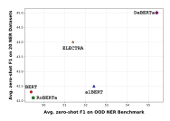
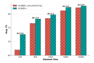
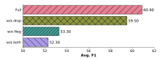

# GLiNER: Generalist Model for Named Entity Recognition using Bidirectional Transformer

Urchade Zaratiana<sup>1,2</sup>, Nadi Tomeh<sup>2</sup>, Pierre Holat<sup>1,2</sup>, Thierry Charnois<sup>2</sup>

<sup>1</sup> FI Group, <sup>2</sup> LIPN, CNRS UMR 7030, France

zaratiana@lipn.fr

https://github.com/urchade/GLiNER

#### **Abstract**

Named Entity Recognition (NER) is essential in various Natural Language Processing (NLP) applications. Traditional NER models are effective but limited to a set of predefined entity types. In contrast, Large Language Models (LLMs) can extract arbitrary entities through natural language instructions, offering greater flexibility. However, their size and cost, particularly for those accessed via APIs like ChatGPT, make them impractical in resource-limited scenarios. In this paper, we introduce a compact NER model trained to identify any type of entity. Leveraging a bidirectional transformer encoder, our model, GLiNER, facilitates parallel entity extraction, an advantage over the slow sequential token generation of LLMs. Through comprehensive testing, GLiNER demonstrate strong performance, outperforming both Chat-GPT and fine-tuned LLMs in zero-shot evaluations on various NER benchmarks.

#### 1 Introduction

Named Entity Recognition plays a crucial role in various real-world applications, such as constructing knowledge graphs (Ye et al., 2022; Zaratiana et al., 2024). Traditional NER models are limited to a predefined set of entity types. Expanding the number of entity types can be beneficial for many applications, but it may require labeling data and retraining a model, which can be costly and time-consuming. The emergence of large language models (LLMs), like GPT-3 (Brown et al., 2020), has introduced a new era for Open NER by enabling the extraction of any entity type using only natural language instructions. However, powerful LLMs typically comprise billions of parameters and thus require substantial computing resources. Although it is possible to access some LLMs via APIs (OpenAI, 2023), using them at scale can incur high costs.

In spite of cost considerations, researchers have recently explored the fine-tuning of open-source

```
# Installation: pip install gliner
from gliner import GLiNER

# load model
model = GLiNER.from_pretrained("urchade/gliner_base")

# choose labels
labels = ["person", "organization", "date"]

text = "Bill Gates founded Microsoft on April 4, 1975."\nentities = model.predict_entities(text, labels)

for entity in entities:
    print(entity["text"], "=>", entity["label"])

## Expected output:
# Bill Gates => person
# Microsoft => organization
# April 4, 1975 => date
```

Figure 1: **GLiNER for open type NER.** GLiNER is capable of identifying any entity type using a bidirectional transformer encoder (BERT-like). It provides a practical alternative to traditional NER models, which are limited to predefined entities, and Large Language Models (LLMs) that, despite their flexibility, are costly and large for resource-constrained scenarios. GLiNER can be easily installed via pip and its pretrained models are hosted on HuggingFace, ensuring easy accessibility. Moreover, it can run efficiently on CPU, making GLiNER especially suitable for environments with limited computing power.

language models such as LLaMa (Touvron et al., 2023) for NER. Wang et al. (2023), for example, introduced InstructUIE, a fine-tuned FlanT5-11B model (Raffel et al., 2019; Chung et al., 2022) on existing information extraction (IE) datasets, achieving high performance in zero-shot settings. Sainz et al. (2023) proposed GoLLIE as an extension of InstructUIE which work by fine-tuning a CodeLLaMa (Rozière et al., 2023) using detailed annotation guidelines, obtaining significant performance improvements. Another recent proposal by Zhou et al. (2023), called UniversalNER, involves the fine-tuning of LLMs using diverse datasets from various domains, annotated with ChatGPT instead of relying on standard NER datasets. Remarkably, their approach not only replicates but also surpasses the original capability of ChatGPT when evaluated in zero-shot settings.


Figure 2: **Model architecture**. GLiNER employs a BiLM and takes as input entity type prompts and a sentence/text. Each entity is separated by a learned token [ENT]. The BiLM outputs representations for each token. Entity embeddings are passed into a FeedForward Network, while input word representations are passed into a span representation layer to compute embeddings for each span. Finally, we compute a matching score between entity representations and span representations (using dot product and sigmoid activation). For instance, in the figure, the span representation of (0, 1), corresponding to "Alain Farley," has a high matching score with the entity embeddings of "Person".

While these approaches have achieved remarkable results, they present certain limitations we seek to address. They use autoregressive language models, which can be slow due to sequential generation. Moreover, these models have several billion parameters, limiting their deployment in compute-limited scenarios.

In this paper, we propose a model that addresses the above-mentioned problems. Instead of relying on large autoregressive models, we use a smaller and more compute-efficient Bidirectional Language Models (BiLM), such as BERT (Devlin et al., 2019) or DeBERTa (He et al., 2021). The core concept of our model involves treating the task of Open NER as matching entity type embeddings to textual span representations in the latent space, rather than as a generation task. This approach naturally solves the scalability issues of autoregressive models and allows for bidirectional context processing, which enables richer representations. When trained on the Pile-NER dataset released by Zhou et al. (2023), which comprises texts from numerous domains and thousands of entity types, our model demonstrates impressive zero-shot performance. More specifically, it outperforms both ChatGPT and fine-tuned LLMs on various NER datasets without fine-tuning (Table 1). The robustness of our model is particularly highlighted by its capability to process languages that were not part of its training data. Notably, it outperforms ChatGPT in 8 out of 10 such languages, as detailed in Table 3.

#### 2 Method

This section presents our model, GLiNER, which is trained to extract any type of entity using a Bidirectional Language Models. Our model has three main components: i) a pre-trained textual encoder (a BiLM such as BERT), ii) a span representation module which computes span embeddings from token embeddings, iii) an entity representation module which computes entity embeddings that the model seeks to extract. The goal is to have entity and span embeddings in the same latent space to assess their compatibility (degree of matching). The overall architecture of our model is depicted in Figure 2.

#### 2.1 Architecture

**Input format** The input to our model comprises a unified sequence combining entity types (expressed in natural language) and the input text from which entities are to be extracted. The input format is as follows:

[ENT] 
$$t_0$$
 [ENT]  $t_1$  ... [ENT]  $t_{M-1}$  [SEP]  $x_0$   $x_2$  ...  $x_{N-1}$ 

[ENT] token represents a special token placed before each entity type and the [SEP] token functions as a delimiter, separating the sequence of entity types from the input text. They are initialized randomly at the start of training.

**Token representation** The token encoder processes the input to compute interactions between all tokens (both entity types and input text), producing contextualized representations. Let  $\boldsymbol{p} = \{\boldsymbol{p}_i\}_0^{M-1} \in \mathbb{R}^{M \times D}$  denote the encoder's output for the <code>[ENT]</code> tokens, representing all entity types. Similarly,  $\boldsymbol{h} = \{\boldsymbol{h}_i\}_0^{N-1} \in \mathbb{R}^{N \times D}$  denotes the representation of each word in the input text. For words tokenized into multiple subwords, we use the representation of the first subword, which is a standard choice in the NER literature.

Entity and Span Representation In our model, we aim to encode entity types and span embeddings into a unified latent space. The entity representation is computed by refining the initial representation p using a two-layer feedforward network, resulting in  $q = \{q_i\}_0^{M-1} \in \mathbb{R}^{M \times D}$ . The representation of a span starting at position i and ending at position j in the input text,  $S_{ij} \in \mathbb{R}^D$ , is computed as:

$$S_{ij} = FFN(h_i \otimes h_j)$$
 (1)

Here, FFN denotes a two-layer feedforward network, and  $\otimes$  represents the concatenation operation. Moreover, we set an upper bound to the length (K=12) of the span in order to keep linear complexity in the size of the input text, without harming recall.

Entity Type and Span Matching To evaluate whether a span (i, j) corresponds to entity type t, we calculate the following matching score:

$$\phi(i, j, t) = \sigma(\mathbf{S}_{ij}^T \mathbf{q}_t) \in \mathbb{R}$$
 (2)

In this equation,  $\sigma$  denotes a sigmoid activation function. As we train with binary cross-entropy

loss (see next sec. 2.2),  $\phi(i, j, t)$  can be interpreted as the probability of the span (i, j) being of type t.

#### 2.2 Training

During training, our objective is to optimize model parameters to enhance the matching score for correct span-type pairs (positive pairs) and reduce it for incorrect pairs (negative pairs). A span (i, j) paired with an entity type t forms a positive pair  $(s \in \mathcal{P})$  if the span is labeled with type t in the training data. Otherwise, it is a negative pair  $(s \in \mathcal{N})$ . The training loss for an individual example, comprising spans  $\mathcal{S}$  and entity types  $\mathcal{T}$ , is defined as:

$$\mathcal{L}_{BCE} = -\sum_{s \in \mathcal{S} \times \mathcal{T}} \mathbb{I}_{s \in \mathcal{P}} \log \phi(s) +$$

$$\mathbb{I}_{s \in \mathcal{N}} \log (1 - \phi(s))$$
(3)

The variable s represents a pair of span/entity type and  $\mathbb{I}$  is an indicator function, which returns 1 when the specified condition is true and 0 otherwise. This loss function corresponds to binary cross-entropy.

#### 2.3 Decoding algorithm

In the decoding phase, we employ a greedy span section that selects entity spans based on matching scores, to ensure task/dataset specific constraints. This strategy is applied independently to each sentence. Only, spans (i,j) with matching scores  $\phi(i,j,c)>0.5$  are considered for selection.

**Flat NER:** The algorithm chooses the highest-scoring non-overlapping span and continues this process until all spans are evaluated.

**Nested NER:** Similar to Flat NER, but the algorithm allows selection of fully nested spans within other entities while still avoiding partial overlaps.

**Algorithm Efficiency:** The decoding is implemented using a priority queue for spans, ensuring an  $O(n \log n)$  complexity, with n being the number of candidate spans. Empirically, the size of n is usually lower than the input sequence length (Zaratiana et al., 2023).

#### 3 Experimental Setting

#### 3.1 Training data

Our objective is to construct a versatile NER model capable of accurately identifying any entity types across different textual domains. To achieve this,

| Model       | Params | Movie | Restaurant | AI   | Literature | Music | Politics | Science | Average |
|-------------|--------|-------|------------|------|------------|-------|----------|---------|---------|
| Vicuna-7B   | 7B     | 6.0   | 5.3        | 12.8 | 16.1       | 17.0  | 20.5     | 13.0    | 13.0    |
| Vicuna-13B  | 13B    | 0.9   | 0.4        | 22.7 | 22.7       | 26.6  | 27.0     | 22.0    | 17.5    |
| USM         | 0.3B   | 37.7  | 17.7       | 28.2 | 56.0       | 44.9  | 36.1     | 44.0    | 37.8    |
| ChatGPT     | _      | 5.3   | 32.8       | 52.4 | 39.8       | 66.6  | 68.5     | 67.0    | 47.5    |
| InstructUIE | 11B    | 63.0  | 21.0       | 49.0 | 47.2       | 53.2  | 48.1     | 49.2    | 47.2    |
| UniNER-7B   | 7B     | 42.4  | 31.7       | 53.6 | 59.3       | 67.0  | 60.9     | 61.1    | 53.7    |
| UniNER-13B  | 13B    | 48.7  | 36.2       | 54.2 | 60.9       | 64.5  | 61.4     | 63.5    | 55.6    |
| GoLLIE      | 7B     | 63.0  | 43.4       | 59.1 | 62.7       | 67.8  | 57.2     | 55.5    | 58.0    |
| GLiNER-S    | 50M    | 46.9  | 33.3       | 50.7 | 60.0       | 60.9  | 61.5     | 55.6    | 52.7    |
| GLiNER-M    | 90M    | 42.9  | 37.3       | 51.8 | 59.7       | 69.4  | 68.6     | 58.1    | 55.4    |
| GLiNER-L    | 0.3B   | 57.2  | 42.9       | 57.2 | 64.4       | 69.6  | 72.6     | 62.6    | 60.9    |

Table 1: **Zero-Shot Scores on Out-of-Domain NER Benchmark.** We report the performance of GLiNER with various deberta-v3 (He et al., 2021) model sizes. Results for Vicuna, ChatGPT, and UniNER are from Zhou et al. (2023); USM and InstructUIE are from Wang et al. (2023); and GoLLIE is from Sainz et al. (2023).

it is essential that our training dataset includes a diverse range of entity types from various domains. For this, we utilize the training data released by Zhou et al. (2023), known as Pile-NER<sup>1</sup>. This dataset is derived from the Pile corpus (Gao et al., 2020), commonly used for pretraining large language models, and comprises text from diverse sources. More specifically, to construct the dataset Zhou et al. (2023) sampled 50,000 texts from the Pile data and employed ChatGPT to extract their associated entity types. Notably, they did not specify the entity types to the LLMs, aiming to extract a diverse range of entity types. They used the prompting approach shown in Figure 3.

```
System Message: You are a helpful information extraction system.

Prompt: Given a passage, your task is to extract all entities and identify their entity types. The output should be in a list of tuples of the following format: [("entity 1", "type of entity 1"), ...].

Passage: {input_passage}
```

Figure 3: **Prompting ChatGPT for entity extraction.** This prompt was used Zhou et al. (2023) to construct the Pile-NER dataset.

Finally, after filtering bad outputs their datasets result in 44,889 passages containing in total 240k entity spans and 13k distinct entity types.

#### 3.2 Hyperparameters

Our model, GLiNER, is trained on the Pile-NER dataset, which we described in the previous section. We use the deberta-v3 (He et al., 2021) as

our backbone due to its proven empirical performance. All non-pretrained layers have a width dimension of 768 and a dropout rate of 0.4. Regarding the training process, we employ the AdamW optimizer (Loshchilov and Hutter, 2017), setting a base learning rate of 1e-5 for pretrained layers (the transformer backbone) and 5e-5 for non-pretrained layers (FFN layers and span representation). We trained our models for a maximum of 30k steps, starting with a 10% warmup phase, followed by a decay phase using a cosine scheduler. The Pile-NER dataset natively contains only positive entities (i.e., entities that are present in the sentence), and we found it useful to include negative entity types during training. This is achieved by sampling random entities from other examples in the same batch. In addition, we follow the strategies outlined in Sainz et al. (2023) as a form of regularization, which includes shuffling entity order and randomly dropping entities. Furthermore, we limit the number of entity types to 25 per sentence during training. The larger variant of our model, GLiNER-L, takes 5 hours to train on an A100 GPU 80 GB memory.

#### 3.3 Baselines

In our evaluation, we compare our model, GLiNER, with several recent models designed for Open NER. First, we examine chat models like **ChatGPT** and **Vicuna** (Chiang et al., 2023), which utilize the prompting from Ye et al. (2023); we present their results as reported by Zhou et al. (2023). We also compare our method to three recent Large Language Models (LLMs) that have been fine-tuned for NER: **InstructUIE** (Wang et al., 2023), based

<sup>&</sup>lt;sup>1</sup>https://huggingface.co/datasets/Universal-NER/Pile-NER-type

on the FlanT5 11B model and fine-tuned on various NER datasets; UniNER (Zhou et al., 2023), which employs a LLaMa model fine-tuned on a dataset generated by ChatGPT; GoLLIE (Sainz et al., 2023), fine-tuned to adhere to detailed annotation guidelines for enhanced performance in unseen IE tasks, utilizing CodeLLama as its base model. Finally, we include USM (Lou et al., 2023) in our comparison, which is similar in size to ours but features a different architecture.

#### 3.4 Evaluation

Datasets We primarily evaluate our model in a zero-shot (i.e, without fine-tuning on the target dataset) on common NER benchmarks, following previous works (Wang et al., 2023; Zhou et al., 2023). The first is the *OOD NER Benchmark* (Table 1), which comprises seven diverse NER datasets from CrossNER (Liu et al., 2020) and MIT (Liu et al., 2013). This benchmark is typically used for evaluating out-of-domain generalization capabilities of NER models. The second benchmark consists of *20 NER datasets* (Table 2) from a wide range of domains, including biomedical, news articles, and tweets. These datasets are commonly used for training supervised NER models. Additionally, we evaluate our model on multilingual NER datasets (Table 3) for further investigation. For this purpose, we use the recently released *MultiCoNER* (Multilingual Complex NER) (Malmasi et al., 2022), which contains data in 11 languages across various domains.

Metric We adopt the standard NER evaluation methodology, calculating F1-score based on the exact match (span boundary and span type) between predicted and reference entities.

## 4 Results

### 4.1 Zero-shot on English datasets

In this section, we discuss the performance of our model in a zero-shot context, i.e., by only training on the Pile-NER dataset without further fine-tuning on target datasets.

OOD NER Benchmark We first evaluate our model on the OOD benchmark as reported in Table 1. We compare three different sizes of our model (small, medium, and large) against the baselines. The results demonstrate our model's impressive capability, irrespective of its size. For example, even our smallest model, with only 50M

| Dataset        | ChatGPT | UniNER-7B | GLiNER-L |  |
|----------------|---------|-----------|----------|--|
| ACE05          | 26.6    | 36.9      | 27.3     |  |
| AnatEM         | 30.7    | 25.1      | 33.3     |  |
| bc2gm          | 40.2    | 46.2      | 47.9     |  |
| bc4chemd       | 35.5    | 47.9      | 43.1     |  |
| bc5cdr         | 52.4    | 68.0      | 66.4     |  |
| Broad Tweeter  | 61.8    | 67.9      | 61.2     |  |
| CoNLL03        | 52.5    | 72.2      | 64.6     |  |
| FabNER         | 15.3    | 24.8      | 23.6     |  |
| FindVehicle    | 10.5    | 22.2      | 41.9     |  |
| GENIA          | 41.6    | 54.1      | 55.5     |  |
| HarveyNER      | 11.6    | 18.2      | 22.7     |  |
| MIT Movie      | 5.3     | 42.4      | 57.2     |  |
| MIT Restaurant | 32.8    | 31.7      | 42.9     |  |
| MultiNERD      | 58.1    | 59.3      | 59.7     |  |
| ncbi           | 42.1    | 60.4      | 61.9     |  |
| OntoNotes      | 29.7    | 27.8      | 32.2     |  |
| PolyglotNER    | 33.6    | 41.8      | 42.9     |  |
| TweetNER7      | 40.1    | 42.7      | 41.4     |  |
| WikiANN        | 52.0    | 55.4      | 58.9     |  |
| WikiNeural     | 57.7    | 69.2      | 71.8     |  |
| Average        | 36.5    | 45.7      | 47.8     |  |

Table 2: Zero-shot performance on 20 NER datasets. Results of ChatGPT and UniNER are reported from (Zhou et al., 2023).

parameters, outperforms general-purpose models such as ChatGPT and Vicuna. It also shows better performance than the 11B InstructUIE, which has been instruction-tuned for the NER task. Furthermore, when compared to UniNER, which used the same training data as GLiNER, our mediumsized model (90M) achieves comparable results to UniNER-13B (55 F1 for both), despite being 140 times smaller. Meanwhile, our largest variant consistently outperforms UniNER by an average margin of 5 points.. Our best competitor, GoL-LIE, which leads among the LLMs, achieves better performance than most of our models but is still less effective than GLiNER-L. When compared to USM, which has a comparable number of parameters to ours, our model demonstrates significantly superior performance, showing the superiority of our architecture.

20 NER Benchmark table 2 presents a comparison of our model against ChatGPT and UniNER across 20 diverse NER datasets. First, similar to the OOD benchmark, ChatGPT significantly lags behind fine-tuned models for NER. Furthermore, GLiNER achieves the highest performance on 13 of these datasets, surpassing UniNER by an average of 2 points. This superior performance underscores GLiNER's robustness and adaptability across a broad spectrum of domains. However, a notable observation is that GLiNER underperforms

|           |          | Sup. |         | GLiNER |       |  |
|-----------|----------|------|---------|--------|-------|--|
|           | Language |      | ChatGPT | En     | Multi |  |
|           | German   | 64.6 | 37.1    | 35.6   | 39.5  |  |
| Latin     | English  | 62.7 | 37.2    | 42.4   | 41.7  |  |
|           | Spanish  | 58.7 | 34.7    | 38.7   | 42.1  |  |
|           | Dutch    | 62.6 | 35.7    | 35.6   | 38.9  |  |
|           | Bengali  | 39.7 | 23.3    | 0.89   | 25.9  |  |
|           | Persian  | 52.3 | 25.9    | 14.9   | 30.2  |  |
|           | Hindi    | 47.8 | 27.3    | 11.3   | 27.8  |  |
|           | Korean   | 55.8 | 30.0    | 20.5   | 28.7  |  |
| Non-Latin | Russian  | 59.7 | 27.4    | 30.3   | 33.3  |  |
|           | Turkish  | 46.8 | 31.9    | 22.0   | 30.0  |  |
|           | Chinese  | 53.1 | 18.8    | 6.59   | 24.3  |  |
| Average   |          | 54.9 | 29.9    | 23.6   | 32.9  |  |

Table 3: Zero-Shot Scores on Different Languages. The baseline, Sup., is an XLM-R (Conneau et al., 2019) model fine-tuned on the training set of each language separately, as reported by Malmasi et al. (2022). ChatGPT evaluation is taken from Lai et al. (2023). GLiNER-En employs deberta-v3-large, and Multi uses mdeberta-v3-base.

compared to UniNER on tweet-based NER datasets. This highlights potential areas for improvement in GLiNER's ability to process informal, colloquial, or noisy data, typical of social media content.

#### 4.2 Zero-Shot Multilingual Evaluation

In this section, we evaluate the performance of our model in a zero-shot context on unseen languages to assess its generalizability. This evaluation uses the MultiCONER (Malmasi et al., 2022), with results detailed in Table 3. Our model, GLiNER, is presented in two variants: En, which employs deberta-v3-large as its backbone, and Multi, which utilizes a multilingual version of deberta-v3 (mdeberta-v3). Both versions were fine-tuned on the Pile-NER dataset. For comparative purposes, we report results from ChatGPT and a supervised baseline, the latter being fine-tuned on the training set of each dataset using separate models.

Results As expected, the supervised baseline demonstrated superior performance, significantly outperforming the zero-shot models. Notably, among these models, GLiNER-Multi showed the most promising results, surpassing ChatGPT in the majority of languages. This is particularly noteworthy given that the fine-tuning dataset, Pile-NER, comprises solely English examples. While GLiNER-En generally underperformed compared to ChatGPT on average, it demonstrated competitive, and occasionally superior, performance in languages that utilize the Latin script, such as Span-

|                | InstructUIE<br>UniNER-7B |      | GLiNER-L |      |  |
|----------------|--------------------------|------|----------|------|--|
| Dataset        | w/o                      | w/   | w/       | w/o  |  |
| ACE05          | 79.9                     | 86.7 | 82.8     | 81.3 |  |
| AnatEM         | 88.5                     | 88.5 | 88.9     | 88.4 |  |
| bc2gm          | 80.7                     | 82.4 | 83.7     | 82.0 |  |
| bc4chemd       | 87.6                     | 89.2 | 87.9     | 86.7 |  |
| bc5cdr         | 89.0                     | 89.3 | 88.7     | 88.7 |  |
| Broad Twitter  | 80.3                     | 81.2 | 82.5     | 82.7 |  |
| CoNLL03        | 91.5                     | 93.3 | 92.6     | 92.5 |  |
| FabNER         | 78.4                     | 81.9 | 77.8     | 74.8 |  |
| FindVehicle    | 87.6                     | 98.3 | 95.7     | 95.2 |  |
| GENIA          | 75.7                     | 77.5 | 78.9     | 77.4 |  |
| HarveyNER      | 74.7                     | 74.2 | 68.6     | 67.4 |  |
| MIT Movie      | 89.6                     | 90.2 | 87.9     | 87.5 |  |
| MIT Restaurant | 82.6                     | 82.3 | 83.6     | 83.3 |  |
| MultiNERD      | 90.3                     | 93.7 | 93.8     | 93.3 |  |
| ncbi           | 86.2                     | 87.0 | 87.8     | 87.1 |  |
| OntoNotes      | 88.6                     | 89.9 | 89.0     | 88.1 |  |
| PolyglotNER    | 53.3                     | 65.7 | 61.5     | 60.6 |  |
| TweetNER7      | 65.9                     | 65.8 | 51.4     | 50.3 |  |
| WikiANN        | 64.5                     | 84.9 | 83.7     | 82.8 |  |
| wikiNeural     | 88.3                     | 93.3 | 91.3     | 91.4 |  |
| Average        | 81.2                     | 84.8 | 82.9     | 82.1 |  |

Table 4: In-domain Supervised fine-tuning. All the models are fine-tuned on the mix of all training data of the benchmark. w/ indicates that the model was trained on the Pile-NER dataset before fine-tuning.

ish and German. However, its effectiveness was substantially less in non-Latin languages, with a marked underperformance in Bengali, where it achieved only a 0.89 F1 score.

#### 4.3 In-domain Supervised tuning

In this section, we perform in-domain supervised fine-tuning (on 20 NER datasets) of our model to compare its capabilities against LLMs under this setup. Specifically, we compare our model against InstructUIE and UniNER, both of which have also been fine-tuned. The main difference is that UniNER has been pre-trained on the Pile-NER dataset before fine-tuning.

Training Setup For the supervised setting, we adhere to the same experimental setup as described in the main experiment (using deberta-v3 large). Regarding the training data, we follow the approach of InstructUIE: we randomly sample 10,000 data points for each dataset in the 20 NER benchmark. If a dataset does not contain 10,000 samples, we include all available data. We implement two variants of our model: the first one initializes the weights from our zero-shot model, which is a pretrained on the Pile-NER dataset. The second variant is trained without the Pile-NER dataset, same as InstructUIE.



Figure 4: **Zero-shot performance for different back-bones.** It reports the avg. results on 20 NER and OOD NER datasets

Result Firstly, we observe that for the in-domain fine-tuning, our GLiNER model, pretrained on Pile-NER, achieves slightly better results than the non-pretrained variant, with an average difference of 0.8. Moreover, our pretrained GLiNER model outperforms InstructUIE (with an average difference of 0.9) despite being fine-tuned on the same dataset, whereas InstructUIE is significantly larger (approximately 30 times so). This demonstrates that our proposed architecture is indeed competitive. However, our model falls behind UniNER by almost 3 points. Nevertheless, our model still manages to achieve the best score in 7 out of 20 datasets.

#### 5 Further analysis and ablations

In this section, we conduct different set of experiments to better investigate our model.

#### 5.1 Effect of Different Backbones

In our work, we primarily utilize the deberta-v3 model as our backbone due to its strong empirical performance. However, we demonstrate here that our method is adaptable to a wide range of BiLMs.

Setup Specifically, we investigate the performance of our model using other popular BiLMs, including BERT (Devlin et al., 2019), RoBERTa (Liu et al., 2019), AIBERT (Lan et al., 2019), and ELECTRA (Clark et al., 2020). We also conducted experiments with XLNet (Yang et al., 2019) but did not achieve acceptable performance (achieving at most 3 F1 on the OOD benchmark) despite extensive hyperparameter tuning. For a fair comparison, we employed the base size (GLiNER-M) and tuned the learning rate for each model. We report the zero-shot results on both the OOD benchmark and the 20 NER benchmark in Figure 4.



Figure 5: **Supervised performance across different dataset sizes.** The evaluation is conducted on the 20 NER datasets (in Table 4).

Result The results of our experiment, as shown in the Figure 4, clearly demonstrate the superiority of deberta-v3 over other pretrained BiLMs. It achieves the highest performance on both benchmarks by a clear margin. ELECTRA and AlBERT also show notable performance, albeit slightly lower, while BERT and RoBERTa lag behind with similar scores. However, it should be noted that all of the backbones we tested demonstrate strong performance compared to existing models. More specifically, even BERT-base, which ranks among the lower performers, achieves around 49 F1 on the OOD benchmark. This score is still 2 F1 points higher than the average for models like ChatGPT and InstructUIE.

## **5.2** Effect of Pretraining on In-domain Performance

In this section, we investigate the impact of pretraining on the Pile-NER dataset for supervised in-domain training on the 20 NER datasets, across various data sizes. The experiments range from 100 samples per dataset to 10,000 (full training setup). We use the same hyperparameters for all configurations. The results are reported in Figure 5.

**Results** As shown in the figure, models pretrained on Pile-NER consistently outperform their counterparts that are only trained on supervised data, indicating successful positive transfer. We further observe that the gain is larger when supervised data is limited. For instance, the difference in performance is 5.6 when employing 100 samples per dataset, and the gap becomes smaller as the size of the dataset increases.

| Negative Samples | Prec | Rec  | F1   |
|------------------|------|------|------|
| 0%               | 49.3 | 58.1 | 53.3 |
| 50%              | 62.3 | 59.7 | 60.9 |
| 75%              | 61.1 | 56.5 | 58.6 |

Table 5: Effect of negative entity types sampling.

### 5.3 Ablations

Negative Entity Sampling The original Pile-NER dataset, curated by Zhou et al. (2023), features passages with positive entity instances, i.e., entities that are directly present in the text. To better align training with real-world scenarios, where some entity types might be absent, we implemented negative entity sampling as mentioned in Section 3.2. We evaluate different sampling ratios: 0% (only positive entities), 50%, and 75% negative entities. table 5 shows that training with only positive entities results in lower precision but higher recall, indicating that the model often makes false positive errors. Conversely, using 75% negative entities increases precision but decreases recall, as the abundance of negatives makes the model more cautious, leading to missed correct entities. A 50% negative entity ratio proves to be the most effective, providing a balanced approach.

Entity type dropping In our experiments, we employed a strategy of randomly varying the number of entity prompts during training. This approach aimed to expose the model to different quantities of entity types in each training instance, thereby increasing its adaptability to handle scenarios with varying numbers of entities. The usage of this technique results in an average improvement of over 1.4 points in out-of-domain evaluation, as shown in the Figure 5.

#### 6 Related Works

Named Entity Recognition NER is a wellestablished task in the field of NLP, with numerous applications. Initially, NER models relied on rulebased system (Weischedel et al., 1996) that were built using handcrafted algorithms and gazetteers (Mikheev et al., 1999; Nadeau et al., 2006; Zamin and Oxley, 2011). However, these models had limitations in terms of scalability and adaptability to new domains or languages. To overcome these issues, machine learning approaches have been proposed (Lafferty et al., 2001). In the early stages, NER tasks were designed as sequence la-



Figure 6: Randomly dropping entity types. We report the results with and without negative entity sampling.

beling (Huang et al., 2015; Lample et al., 2016; Akbik et al., 2018) where the objective was to predict tagged sequences (e.g., BILOU tags (Ratinov and Roth, 2009)). Since then, several paradigm shifts have occurred: span-based approaches treating NER as span classification (Sarawagi and Cohen, 2004; Fu et al., 2021; Li et al., 2021; Zaratiana et al., 2022a,b,c, 2023); NER being treated as a question answering problem (Li et al., 2019); and even as a generation task (Yan et al., 2021).

Zero-shot learning for NER The advent of large-scale autoregressive models has recently transformed many paradigms in NLP through natural language prompting (Min et al., 2022; Wei et al., 2022; Qin et al., 2023). This is also the case for NER (Li et al., 2022; Ashok and Lipton, 2023; Agrawal et al., 2022). Others have fine-tuned these models for tasks to better align their capabilities with the requirements of entity recognition (Cui et al., 2021; Zhou et al., 2023) or information extraction in general (Wu et al., 2020; Lou et al., 2023; Wang et al., 2023; Sainz et al., 2023; Lu et al., 2022; Geng et al., 2023). This is sometime done through-instruction tuning (Mishra et al., 2021; Wang et al., 2022; Longpre et al., 2023).

## 7 Conclusion

In this paper, we introduced GLiNER, a new method for identifying various types of entities in text using bidirectional language models. Our model not only outperforms state-of-the-art Large Language Models like ChatGPT in zero-shot scenarios but also offers a more resource-efficient alternative, crucial for environments with limited computing power. GLiNER is versatile, performing well in multiple languages, including those it wasn't trained on. In future work, we aim to further improve GLiNER's design for enhanced performance and to better adapt it for low-resource languages.

## Limitations

While our GLiNER model offers several advantages, it also has limitations that should be considered. One notable limitation is the model's inability to extract discontinuous entities. This constraint sets GLiNER apart from some Large Language Models (LLMs) that have this capability, potentially limiting its effectiveness in complex text scenarios where entities are not contiguous. Additionally, our evaluation methodology primarily relies on the exact matching metric. While this is a robust measure, it may not fully capture more nuanced aspects of the model's output. Subtleties such as partial matches or context-sensitive interpretations of entities are not adequately represented in this metric, suggesting that our evaluation might overlook some fine-grained characteristics of the model's performance.

## Acknowledgments

This work was granted access to the HPC resources of IDRIS under the allocation 2023-AD011014472 and AD011013682R1 made by GENCI. This work is partially supported by a public grantoverseen by the French National Research Agency (ANR) as part of the program Investissements d'Avenir (ANR-10-LABX-0083).

#### References

- Monica Agrawal, Stefan Hegselmann, Hunter Lang, Yoon Kim, and David A. Sontag. 2022. [Large lan](https://api.semanticscholar.org/CorpusID:249062918)[guage models are few-shot clinical information ex](https://api.semanticscholar.org/CorpusID:249062918)[tractors.](https://api.semanticscholar.org/CorpusID:249062918) In *Conference on Empirical Methods in Natural Language Processing*.
- Alan Akbik, Duncan Blythe, and Roland Vollgraf. 2018. [Contextual string embeddings for sequence label](https://aclanthology.org/C18-1139)[ing.](https://aclanthology.org/C18-1139) In *Proceedings of the 27th International Conference on Computational Linguistics*, pages 1638– 1649, Santa Fe, New Mexico, USA. Association for Computational Linguistics.
- Rami Al-Rfou, Vivek Kulkarni, Bryan Perozzi, and Steven Skiena. 2015. Polyglot-ner: Massive multilingual named entity recognition. In *Proceedings of the 2015 SIAM International Conference on Data Mining*, pages 586–594. SIAM.
- Dhananjay Ashok and Zachary Chase Lipton. 2023. [Promptner: Prompting for named entity recognition.](https://api.semanticscholar.org/CorpusID:258887456) *ArXiv*, abs/2305.15444.
- Tom B. Brown, Benjamin Mann, Nick Ryder, Melanie Subbiah, Jared Kaplan, Prafulla Dhariwal, Arvind Neelakantan, Pranav Shyam, Girish Sastry, Amanda

- Askell, Sandhini Agarwal, Ariel Herbert-Voss, Gretchen Krueger, T. J. Henighan, Rewon Child, Aditya Ramesh, Daniel M. Ziegler, Jeff Wu, Clemens Winter, Christopher Hesse, Mark Chen, Eric Sigler, Mateusz Litwin, Scott Gray, Benjamin Chess, Jack Clark, Christopher Berner, Sam McCandlish, Alec Radford, Ilya Sutskever, and Dario Amodei. 2020. [Language models are few-shot learners.](https://api.semanticscholar.org/CorpusID:218971783) *ArXiv*, abs/2005.14165.
- Pei Chen, Haotian Xu, Cheng Zhang, and Ruihong Huang. 2022. [Crossroads, buildings and neighbor](https://doi.org/10.18653/v1/2022.naacl-main.243)[hoods: A dataset for fine-grained location recog](https://doi.org/10.18653/v1/2022.naacl-main.243)[nition.](https://doi.org/10.18653/v1/2022.naacl-main.243) In *Proceedings of the 2022 Conference of the North American Chapter of the Association for Computational Linguistics: Human Language Technologies*, pages 3329–3339, Seattle, United States. Association for Computational Linguistics.
- Wei-Lin Chiang, Zhuohan Li, Zi Lin, Ying Sheng, Zhanghao Wu, Hao Zhang, Lianmin Zheng, Siyuan Zhuang, Yonghao Zhuang, Joseph E. Gonzalez, Ion Stoica, and Eric P. Xing. 2023. [Vicuna: An open](https://lmsys.org/blog/2023-03-30-vicuna/)[source chatbot impressing gpt-4 with 90%\\* chatgpt](https://lmsys.org/blog/2023-03-30-vicuna/) [quality.](https://lmsys.org/blog/2023-03-30-vicuna/)
- Hyung Won Chung, Le Hou, Shayne Longpre, Barret Zoph, Yi Tay, William Fedus, Yunxuan Li, Xuezhi Wang, Mostafa Dehghani, Siddhartha Brahma, Albert Webson, Shixiang Shane Gu, Zhuyun Dai, Mirac Suzgun, Xinyun Chen, Aakanksha Chowdhery, Alex Castro-Ros, Marie Pellat, Kevin Robinson, Dasha Valter, Sharan Narang, Gaurav Mishra, Adams Yu, Vincent Zhao, Yanping Huang, Andrew Dai, Hongkun Yu, Slav Petrov, Ed H. Chi, Jeff Dean, Jacob Devlin, Adam Roberts, Denny Zhou, Quoc V. Le, and Jason Wei. 2022. [Scaling instruction-finetuned](http://arxiv.org/abs/2210.11416) [language models.](http://arxiv.org/abs/2210.11416)
- Kevin Clark, Minh-Thang Luong, Quoc V. Le, and Christopher D. Manning. 2020. [Electra: Pre-training](http://arxiv.org/abs/2003.10555) [text encoders as discriminators rather than genera](http://arxiv.org/abs/2003.10555)[tors.](http://arxiv.org/abs/2003.10555)
- Alexis Conneau, Kartikay Khandelwal, Naman Goyal, Vishrav Chaudhary, Guillaume Wenzek, Francisco Guzmán, Edouard Grave, Myle Ott, Luke Zettlemoyer, and Veselin Stoyanov. 2019. [Unsupervised](https://api.semanticscholar.org/CorpusID:207880568) [cross-lingual representation learning at scale.](https://api.semanticscholar.org/CorpusID:207880568) In *Annual Meeting of the Association for Computational Linguistics*.
- Leyang Cui, Yu Wu, Jian Liu, Sen Yang, and Yue Zhang. 2021. [Template-based named entity recognition us](https://api.semanticscholar.org/CorpusID:235313658)[ing bart.](https://api.semanticscholar.org/CorpusID:235313658) In *Findings*.
- Leon Derczynski, Kalina Bontcheva, and Ian Roberts. 2016. [Broad Twitter corpus: A diverse named entity](https://aclanthology.org/C16-1111) [recognition resource.](https://aclanthology.org/C16-1111) In *Proceedings of COLING 2016, the 26th International Conference on Computational Linguistics: Technical Papers*, pages 1169– 1179, Osaka, Japan. The COLING 2016 Organizing Committee.
- Jacob Devlin, Ming-Wei Chang, Kenton Lee, and Kristina Toutanova. 2019. [Bert: Pre-training of deep](https://api.semanticscholar.org/CorpusID:52967399)

- [bidirectional transformers for language understand](https://api.semanticscholar.org/CorpusID:52967399)[ing.](https://api.semanticscholar.org/CorpusID:52967399) In *North American Chapter of the Association for Computational Linguistics*.
- Rezarta Islamaj Dogan, Robert Leaman, and Zhiyong ˘ Lu. 2014. Ncbi disease corpus: a resource for disease name recognition and concept normalization. *Journal of biomedical informatics*, 47:1–10.
- Jinlan Fu, Xuanjing Huang, and Pengfei Liu. 2021. [SpanNER: Named entity re-/recognition as span pre](https://doi.org/10.18653/v1/2021.acl-long.558)[diction.](https://doi.org/10.18653/v1/2021.acl-long.558) In *Proceedings of the 59th Annual Meeting of the Association for Computational Linguistics and the 11th International Joint Conference on Natural Language Processing (Volume 1: Long Papers)*, pages 7183–7195, Online. Association for Computational Linguistics.
- Leo Gao, Stella Rose Biderman, Sid Black, Laurence Golding, Travis Hoppe, Charles Foster, Jason Phang, Horace He, Anish Thite, Noa Nabeshima, Shawn Presser, and Connor Leahy. 2020. [The pile: An](https://api.semanticscholar.org/CorpusID:230435736) [800gb dataset of diverse text for language modeling.](https://api.semanticscholar.org/CorpusID:230435736) *ArXiv*, abs/2101.00027.
- Saibo Geng, Martin Josifoski, Maxime Peyrard, and Robert West. 2023. [Grammar-constrained decoding](https://doi.org/10.18653/v1/2023.emnlp-main.674) [for structured NLP tasks without finetuning.](https://doi.org/10.18653/v1/2023.emnlp-main.674) In *Proceedings of the 2023 Conference on Empirical Methods in Natural Language Processing*, pages 10932– 10952, Singapore. Association for Computational Linguistics.
- Runwei Guan, Ka Lok Man, Feifan Chen, Shanliang Yao, Rongsheng Hu, Xiaohui Zhu, Jeremy Smith, Eng Gee Lim, and Yutao Yue. 2023. Findvehicle and vehiclefinder: A ner dataset for natural languagebased vehicle retrieval and a keyword-based crossmodal vehicle retrieval system. *arXiv preprint arXiv:2304.10893*.
- Pengcheng He, Jianfeng Gao, and Weizhu Chen. 2021. [Debertav3: Improving deberta using electra-style pre](https://api.semanticscholar.org/CorpusID:244346093)[training with gradient-disentangled embedding shar](https://api.semanticscholar.org/CorpusID:244346093)[ing.](https://api.semanticscholar.org/CorpusID:244346093) *ArXiv*, abs/2111.09543.
- Zhiheng Huang, Wei Xu, and Kai Yu. 2015. [Bidirec](http://arxiv.org/abs/1508.01991)[tional lstm-crf models for sequence tagging.](http://arxiv.org/abs/1508.01991)
- J-D Kim, Tomoko Ohta, Yuka Tateisi, and Jun'ichi Tsujii. 2003. Genia corpus—a semantically annotated corpus for bio-textmining. *Bioinformatics*, 19(suppl\_1):i180–i182.
- Martin Krallinger, Obdulia Rabal, Florian Leitner, Miguel Vazquez, David Salgado, Zhiyong Lu, Robert Leaman, Yanan Lu, Donghong Ji, Daniel M Lowe, et al. 2015. The chemdner corpus of chemicals and drugs and its annotation principles. *Journal of cheminformatics*, 7(1):1–17.
- Aman Kumar and Binil Starly. 2022. "fabner": information extraction from manufacturing process science domain literature using named entity recognition. *Journal of Intelligent Manufacturing*, 33(8):2393– 2407.

- John D. Lafferty, Andrew McCallum, and Fernando Pereira. 2001. [Conditional random fields: Probabilis](https://api.semanticscholar.org/CorpusID:219683473)[tic models for segmenting and labeling sequence data.](https://api.semanticscholar.org/CorpusID:219683473) In *International Conference on Machine Learning*.
- Viet Dac Lai, Nghia Trung Ngo, Amir Pouran Ben Veyseh, Hieu Man, Franck Dernoncourt, Trung Bui, and Thien Huu Nguyen. 2023. [Chatgpt beyond en](https://api.semanticscholar.org/CorpusID:258079179)[glish: Towards a comprehensive evaluation of large](https://api.semanticscholar.org/CorpusID:258079179) [language models in multilingual learning.](https://api.semanticscholar.org/CorpusID:258079179) *ArXiv*, abs/2304.05613.
- Guillaume Lample, Miguel Ballesteros, Sandeep Subramanian, Kazuya Kawakami, and Chris Dyer. 2016. Neural architectures for named entity recognition. In *North American Chapter of the Association for Computational Linguistics*.
- Zhenzhong Lan, Mingda Chen, Sebastian Goodman, Kevin Gimpel, Piyush Sharma, and Radu Soricut. 2019. [Albert: A lite bert for self-supervised learning](https://api.semanticscholar.org/CorpusID:202888986) [of language representations.](https://api.semanticscholar.org/CorpusID:202888986) *ArXiv*, abs/1909.11942.
- Dongfang Li, Baotian Hu, and Qingcai Chen. 2022. [Prompt-based text entailment for low-resource](https://api.semanticscholar.org/CorpusID:252819341) [named entity recognition.](https://api.semanticscholar.org/CorpusID:252819341) *ArXiv*, abs/2211.03039.
- Jiao Li, Yueping Sun, Robin J Johnson, Daniela Sciaky, Chih-Hsuan Wei, Robert Leaman, Allan Peter Davis, Carolyn J Mattingly, Thomas C Wiegers, and Zhiyong Lu. 2016. Biocreative v cdr task corpus: a resource for chemical disease relation extraction. *Database*, 2016.
- Xiaoya Li, Jingrong Feng, Yuxian Meng, Qinghong Han, Fei Wu, and Jiwei Li. 2019. [A unified mrc](https://api.semanticscholar.org/CorpusID:204902024) [framework for named entity recognition.](https://api.semanticscholar.org/CorpusID:204902024) *ArXiv*, abs/1910.11476.
- Yangming Li, lemao liu, and Shuming Shi. 2021. [Em](https://openreview.net/forum?id=5jRVa89sZk)[pirical analysis of unlabeled entity problem in named](https://openreview.net/forum?id=5jRVa89sZk) [entity recognition.](https://openreview.net/forum?id=5jRVa89sZk) In *International Conference on Learning Representations*.
- Jingjing Liu, Panupong Pasupat, D. Scott Cyphers, and James R. Glass. 2013. [Asgard: A portable architec](https://api.semanticscholar.org/CorpusID:14903208)[ture for multilingual dialogue systems.](https://api.semanticscholar.org/CorpusID:14903208) *2013 IEEE International Conference on Acoustics, Speech and Signal Processing*, pages 8386–8390.
- Yinhan Liu, Myle Ott, Naman Goyal, Jingfei Du, Mandar Joshi, Danqi Chen, Omer Levy, Mike Lewis, Luke Zettlemoyer, and Veselin Stoyanov. 2019. [Roberta: A robustly optimized bert pretraining ap](https://api.semanticscholar.org/CorpusID:198953378)[proach.](https://api.semanticscholar.org/CorpusID:198953378) *ArXiv*, abs/1907.11692.
- Zihan Liu, Yan Xu, Tiezheng Yu, Wenliang Dai, Ziwei Ji, Samuel Cahyawijaya, Andrea Madotto, and Pascale Fung. 2020. [Crossner: Evaluating cross-domain](https://api.semanticscholar.org/CorpusID:227736891) [named entity recognition.](https://api.semanticscholar.org/CorpusID:227736891) In *AAAI Conference on Artificial Intelligence*.
- S. Longpre, Le Hou, Tu Vu, Albert Webson, Hyung Won Chung, Yi Tay, Denny Zhou, Quoc V. Le, Barret Zoph, Jason Wei, and Adam Roberts. 2023. [The flan](https://api.semanticscholar.org/CorpusID:256415991) [collection: Designing data and methods for effective](https://api.semanticscholar.org/CorpusID:256415991)

- [instruction tuning.](https://api.semanticscholar.org/CorpusID:256415991) In *International Conference on Machine Learning*.
- Ilya Loshchilov and Frank Hutter. 2017. [Decoupled](https://api.semanticscholar.org/CorpusID:53592270) [weight decay regularization.](https://api.semanticscholar.org/CorpusID:53592270) In *International Conference on Learning Representations*.
- Jie Lou, Yaojie Lu, Dai Dai, Wei Jia, Hongyu Lin, Xianpei Han, Le Sun, and Hua Wu. 2023. [Universal](https://api.semanticscholar.org/CorpusID:255546103) [information extraction as unified semantic matching.](https://api.semanticscholar.org/CorpusID:255546103) In *AAAI Conference on Artificial Intelligence*.
- Yaojie Lu, Qing Liu, Dai Dai, Xinyan Xiao, Hongyu Lin, Xianpei Han, Le Sun, and Hua Wu. 2022. [Uni](https://api.semanticscholar.org/CorpusID:247619149)[fied structure generation for universal information](https://api.semanticscholar.org/CorpusID:247619149) [extraction.](https://api.semanticscholar.org/CorpusID:247619149) In *Annual Meeting of the Association for Computational Linguistics*.
- Shervin Malmasi, Anjie Fang, Besnik Fetahu, Sudipta Kar, and Oleg Rokhlenko. 2022. [Multiconer: A large](https://api.semanticscholar.org/CorpusID:251953674)[scale multilingual dataset for complex named entity](https://api.semanticscholar.org/CorpusID:251953674) [recognition.](https://api.semanticscholar.org/CorpusID:251953674) In *International Conference on Computational Linguistics*.
- Andrei Mikheev, Marc Moens, and Claire Grover. 1999. [Named entity recognition without gazetteers.](https://api.semanticscholar.org/CorpusID:7332330) In *Conference of the European Chapter of the Association for Computational Linguistics*.
- Sewon Min, Xinxi Lyu, Ari Holtzman, Mikel Artetxe, Mike Lewis, Hannaneh Hajishirzi, and Luke Zettlemoyer. 2022. [Rethinking the role of demonstra](https://api.semanticscholar.org/CorpusID:247155069)[tions: What makes in-context learning work?](https://api.semanticscholar.org/CorpusID:247155069) *ArXiv*, abs/2202.12837.
- Swaroop Mishra, Daniel Khashabi, Chitta Baral, and Hannaneh Hajishirzi. 2021. [Cross-task generaliza](https://api.semanticscholar.org/CorpusID:237421373)[tion via natural language crowdsourcing instructions.](https://api.semanticscholar.org/CorpusID:237421373) In *Annual Meeting of the Association for Computational Linguistics*.
- David Nadeau, Peter D. Turney, and Stan Matwin. 2006. [Unsupervised named-entity recognition: Generating](https://api.semanticscholar.org/CorpusID:17071982) [gazetteers and resolving ambiguity.](https://api.semanticscholar.org/CorpusID:17071982) In *Canadian Conference on AI*.
- OpenAI. 2023. [Gpt-4 technical report.](http://arxiv.org/abs/2303.08774)
- Xiaoman Pan, Boliang Zhang, Jonathan May, Joel Nothman, Kevin Knight, and Heng Ji. 2017. [Cross-lingual](https://doi.org/10.18653/v1/P17-1178) [name tagging and linking for 282 languages.](https://doi.org/10.18653/v1/P17-1178) In *Proceedings of the 55th Annual Meeting of the Association for Computational Linguistics (Volume 1: Long Papers)*, pages 1946–1958, Vancouver, Canada. Association for Computational Linguistics.
- Sampo Pyysalo and Sophia Ananiadou. 2014. Anatomical entity mention recognition at literature scale. *Bioinformatics*, 30(6):868–875.
- Chengwei Qin, Aston Zhang, Zhuosheng Zhang, Jiaao Chen, Michihiro Yasunaga, and Diyi Yang. 2023. [Is](https://api.semanticscholar.org/CorpusID:256827430) [chatgpt a general-purpose natural language process](https://api.semanticscholar.org/CorpusID:256827430)[ing task solver?](https://api.semanticscholar.org/CorpusID:256827430) *ArXiv*, abs/2302.06476.

- Colin Raffel, Noam M. Shazeer, Adam Roberts, Katherine Lee, Sharan Narang, Michael Matena, Yanqi Zhou, Wei Li, and Peter J. Liu. 2019. [Exploring the](https://api.semanticscholar.org/CorpusID:204838007) [limits of transfer learning with a unified text-to-text](https://api.semanticscholar.org/CorpusID:204838007) [transformer.](https://api.semanticscholar.org/CorpusID:204838007) *J. Mach. Learn. Res.*, 21:140:1–140:67.
- Lev-Arie Ratinov and Dan Roth. 2009. [Design chal](https://api.semanticscholar.org/CorpusID:1859014)[lenges and misconceptions in named entity recog](https://api.semanticscholar.org/CorpusID:1859014)[nition.](https://api.semanticscholar.org/CorpusID:1859014) In *Conference on Computational Natural Language Learning*.
- Baptiste Rozière, Jonas Gehring, Fabian Gloeckle, Sten Sootla, Itai Gat, Xiaoqing Tan, Yossi Adi, Jingyu Liu, Tal Remez, Jérémy Rapin, Artyom Kozhevnikov, I. Evtimov, Joanna Bitton, Manish P Bhatt, Cristian Cantón Ferrer, Aaron Grattafiori, Wenhan Xiong, Alexandre D'efossez, Jade Copet, Faisal Azhar, Hugo Touvron, Louis Martin, Nicolas Usunier, Thomas Scialom, and Gabriel Synnaeve. 2023. [Code](https://api.semanticscholar.org/CorpusID:261100919) [llama: Open foundation models for code.](https://api.semanticscholar.org/CorpusID:261100919) *ArXiv*, abs/2308.12950.
- Oscar Sainz, Iker García-Ferrero, Rodrigo Agerri, Oier Lopez de Lacalle, German Rigau, and Eneko Agirre. 2023. [Gollie: Annotation guidelines im](https://api.semanticscholar.org/CorpusID:263671572)[prove zero-shot information-extraction.](https://api.semanticscholar.org/CorpusID:263671572) *ArXiv*, abs/2310.03668.
- Sunita Sarawagi and William W. Cohen. 2004. [Semi](https://api.semanticscholar.org/CorpusID:14036493)[markov conditional random fields for information](https://api.semanticscholar.org/CorpusID:14036493) [extraction.](https://api.semanticscholar.org/CorpusID:14036493) In *Neural Information Processing Systems*.
- Larry Smith, Lorraine K Tanabe, Cheng-Ju Kuo, I Chung, Chun-Nan Hsu, Yu-Shi Lin, Roman Klinger, Christoph M Friedrich, Kuzman Ganchev, Manabu Torii, et al. 2008. Overview of biocreative ii gene mention recognition. *Genome biology*, 9(2):1–19.
- Simone Tedeschi and Roberto Navigli. 2022. [MultiN-](https://doi.org/10.18653/v1/2022.findings-naacl.60)[ERD: A multilingual, multi-genre and fine-grained](https://doi.org/10.18653/v1/2022.findings-naacl.60) [dataset for named entity recognition \(and disambigua](https://doi.org/10.18653/v1/2022.findings-naacl.60)[tion\).](https://doi.org/10.18653/v1/2022.findings-naacl.60) In *Findings of the Association for Computational Linguistics: NAACL 2022*, pages 801–812, Seattle, United States. Association for Computational Linguistics.
- Erik F. Tjong Kim Sang and Fien De Meulder. 2003. [Introduction to the CoNLL-2003 shared task:](https://aclanthology.org/W03-0419) [Language-independent named entity recognition.](https://aclanthology.org/W03-0419) In *Proceedings of the Seventh Conference on Natural Language Learning at HLT-NAACL 2003*, pages 142– 147.
- Hugo Touvron, Thibaut Lavril, Gautier Izacard, Xavier Martinet, Marie-Anne Lachaux, Timothée Lacroix, Baptiste Rozière, Naman Goyal, Eric Hambro, Faisal Azhar, Aurelien Rodriguez, Armand Joulin, Edouard Grave, and Guillaume Lample. 2023. [Llama: Open](https://api.semanticscholar.org/CorpusID:257219404) [and efficient foundation language models.](https://api.semanticscholar.org/CorpusID:257219404) *ArXiv*, abs/2302.13971.
- Asahi Ushio, Leonardo Neves, Vitor Silva, Francesco. Barbieri, and Jose Camacho-Collados. 2022. Named Entity Recognition in Twitter: A Dataset and Analysis on Short-Term Temporal Shifts. In *The 2nd*

- *Conference of the Asia-Pacific Chapter of the Association for Computational Linguistics and the 12th International Joint Conference on Natural Language Processing*, Online. Association for Computational Linguistics.
- Christopher Walker, Stephanie Strassel, Julie Medero, and Kazuaki Maeda. 2006. Ace 2005 multilingual training corpus. *Linguistic Data Consortium, Philadelphia*, 57:45.
- Xiao Wang, Wei Zhou, Can Zu, Han Xia, Tianze Chen, Yuan Zhang, Rui Zheng, Junjie Ye, Qi Zhang, Tao Gui, Jihua Kang, J. Yang, Siyuan Li, and Chunsai Du. 2023. [Instructuie: Multi-task instruction](https://api.semanticscholar.org/CorpusID:258179792) [tuning for unified information extraction.](https://api.semanticscholar.org/CorpusID:258179792) *ArXiv*, abs/2304.08085.
- Yizhong Wang, Swaroop Mishra, Pegah Alipoormolabashi, Yeganeh Kordi, Amirreza Mirzaei, Anjana Arunkumar, Arjun Ashok, Arut Selvan Dhanasekaran, Atharva Naik, David Stap, Eshaan Pathak, Giannis Karamanolakis, Haizhi Gary Lai, Ishan Purohit, Ishani Mondal, Jacob Anderson, Kirby Kuznia, Krima Doshi, Maitreya Patel, Kuntal Kumar Pal, M. Moradshahi, Mihir Parmar, Mirali Purohit, Neeraj Varshney, Phani Rohitha Kaza, Pulkit Verma, Ravsehaj Singh Puri, Rushang Karia, Shailaja Keyur Sampat, Savan Doshi, Siddharth Deepak Mishra, Sujan Reddy, Sumanta Patro, Tanay Dixit, Xudong Shen, Chitta Baral, Yejin Choi, Noah A. Smith, Hannaneh Hajishirzi, and Daniel Khashabi. 2022. [Super](https://api.semanticscholar.org/CorpusID:253098274)[naturalinstructions: Generalization via declarative](https://api.semanticscholar.org/CorpusID:253098274) [instructions on 1600+ nlp tasks.](https://api.semanticscholar.org/CorpusID:253098274) In *Conference on Empirical Methods in Natural Language Processing*.
- Jason Wei, Xuezhi Wang, Dale Schuurmans, Maarten Bosma, Ed Huai hsin Chi, F. Xia, Quoc Le, and Denny Zhou. 2022. [Chain of thought prompting](https://api.semanticscholar.org/CorpusID:246411621) [elicits reasoning in large language models.](https://api.semanticscholar.org/CorpusID:246411621) *ArXiv*, abs/2201.11903.
- Ralph Weischedel, Sean Boisen, Daniel Bikel, Robert Bobrow, Michael Crystal, William Ferguson, Allan Wechsler, and The PLUM Research Group. 1996. [Progress in information extraction.](https://doi.org/10.3115/1119018.1119050) In *TIPSTER TEXT PROGRAM PHASE II: Proceedings of a Workshop held at Vienna, Virginia, May 6-8, 1996*, pages 127–138, Vienna, Virginia, USA. Association for Computational Linguistics.
- Ralph Weischedel, Martha Palmer, Mitchell Marcus, Eduard Hovy, Sameer Pradhan, Lance Ramshaw, Nianwen Xue, Ann Taylor, Jeff Kaufman, Michelle Franchini, et al. 2013. Ontonotes release 5.0 ldc2013t19. *Linguistic Data Consortium, Philadelphia, PA*, 23:170.
- Ledell Wu, Fabio Petroni, Martin Josifoski, Sebastian Riedel, and Luke Zettlemoyer. 2020. Zero-shot entity linking with dense entity retrieval. In *EMNLP*.
- Hang Yan, Tao Gui, Junqi Dai, Qipeng Guo, Zheng Zhang, and Xipeng Qiu. 2021. [A unified generative](http://arxiv.org/abs/2106.01223) [framework for various ner subtasks.](http://arxiv.org/abs/2106.01223)

- Zhilin Yang, Zihang Dai, Yiming Yang, Jaime G. Carbonell, Ruslan Salakhutdinov, and Quoc V. Le. 2019. [Xlnet: Generalized autoregressive pretraining for lan](https://api.semanticscholar.org/CorpusID:195069387)[guage understanding.](https://api.semanticscholar.org/CorpusID:195069387) In *Neural Information Processing Systems*.
- Hongbin Ye, Ningyu Zhang, Hui Chen, and Huajun Chen. 2022. [Generative knowledge graph construc](https://aclanthology.org/2022.emnlp-main.1)[tion: A review.](https://aclanthology.org/2022.emnlp-main.1) In *Proceedings of the 2022 Conference on Empirical Methods in Natural Language Processing*, pages 1–17, Abu Dhabi, United Arab Emirates. Association for Computational Linguistics.
- Junjie Ye, Xuanting Chen, Nuo Xu, Can Zu, Zekai Shao, Shichun Liu, Yuhan Cui, Zeyang Zhou, Chao Gong, Yang Shen, Jie Zhou, Siming Chen, Tao Gui, Qi Zhang, and Xuanjing Huang. 2023. [A comprehen](https://api.semanticscholar.org/CorpusID:257632113)[sive capability analysis of gpt-3 and gpt-3.5 series](https://api.semanticscholar.org/CorpusID:257632113) [models.](https://api.semanticscholar.org/CorpusID:257632113) *ArXiv*, abs/2303.10420.
- Norshuhani Zamin and Alan Oxley. 2011. [Building a](https://api.semanticscholar.org/CorpusID:27060266) [corpus-derived gazetteer for named entity recogni](https://api.semanticscholar.org/CorpusID:27060266)[tion.](https://api.semanticscholar.org/CorpusID:27060266) In *International Conference on Software Engineering and Computer Systems*.
- Urchade Zaratiana, Niama Elkhbir, Pierre Holat, Nadi Tomeh, and Thierry Charnois. 2022a. [Global span](https://aclanthology.org/2022.umios-1.2) [selection for named entity recognition.](https://aclanthology.org/2022.umios-1.2) In *Proceedings of the Workshop on Unimodal and Multimodal Induction of Linguistic Structures (UM-IoS)*, pages 11–17, Abu Dhabi, United Arab Emirates (Hybrid). Association for Computational Linguistics.
- Urchade Zaratiana, Nadi Tomeh, Niama El Khbir, Pierre Holat, and Thierry Charnois. 2023. [Filtered semi-](https://aclanthology.org/2023.findings-emnlp.17)[Markov CRF.](https://aclanthology.org/2023.findings-emnlp.17) In *Findings of the Association for Computational Linguistics: EMNLP 2023*, pages 222–235, Singapore. Association for Computational Linguistics.
- Urchade Zaratiana, Nadi Tomeh, Pierre Holat, and Thierry Charnois. 2022b. [GNNer: Reducing overlap](https://doi.org/10.18653/v1/2022.acl-srw.9)[ping in span-based NER using graph neural networks.](https://doi.org/10.18653/v1/2022.acl-srw.9) In *Proceedings of the 60th Annual Meeting of the Association for Computational Linguistics: Student Research Workshop*, pages 97–103, Dublin, Ireland. Association for Computational Linguistics.
- Urchade Zaratiana, Nadi Tomeh, Pierre Holat, and Thierry Charnois. 2022c. [Named entity recognition](https://aclanthology.org/2022.umios-1.1) [as structured span prediction.](https://aclanthology.org/2022.umios-1.1) In *Proceedings of the Workshop on Unimodal and Multimodal Induction of Linguistic Structures (UM-IoS)*, pages 1–10, Abu Dhabi, United Arab Emirates (Hybrid). Association for Computational Linguistics.
- Urchade Zaratiana, Nadi Tomeh, Pierre Holat, and Thierry Charnois. 2024. [An autoregressive text-to](https://doi.org/10.1609/aaai.v38i17.29919)[graph framework for joint entity and relation extrac](https://doi.org/10.1609/aaai.v38i17.29919)[tion.](https://doi.org/10.1609/aaai.v38i17.29919) *Proceedings of the AAAI Conference on Artificial Intelligence*, 38(17):19477–19487.
- Wenxuan Zhou, Sheng Zhang, Yu Gu, Muhao Chen, and Hoifung Poon. 2023. [Universalner: Targeted dis](http://arxiv.org/abs/2308.03279)[tillation from large language models for open named](http://arxiv.org/abs/2308.03279) [entity recognition.](http://arxiv.org/abs/2308.03279)

| Dataset                                        | # train | # dev | # test | # types | Avg. tokens | Avg. entities |
|------------------------------------------------|---------|-------|--------|---------|-------------|---------------|
| ACE05 (Walker et al., 2006)                    | 7299    | 971   | 1060   | 7       | 21          | 2.8           |
| AnatEM (Pyysalo and Ananiadou, 2014)           | 5861    | 2118  | 3830   | 1       | 37          | 0.7           |
| bc2gm (Smith et al., 2008)                     | 12500   | 2500  | 5000   | 1       | 36          | 0.4           |
| bc4chemd (Krallinger et al., 2015)             | 30682   | 30639 | 26364  | 1       | 45          | 0.9           |
| bc5cdr (Li et al., 2016)                       | 4560    | 4581  | 4797   | 2       | 41          | 2.2           |
| Broad Tweet Corpus (Derczynski et al., 2016)   | 5334    | 2001  | 2000   | 3       | 28          | 0.5           |
| conll 03 (Tjong Kim Sang and De Meulder, 2003) | 14041   | 3250  | 3453   | 3       | 25          | 1.9           |
| FabNER (Kumar and Starly, 2022)                | 9435    | 2182  | 2064   | 12      | 36          | 5.1           |
| GENIA (Kim et al., 2003)                       | 15023   | 1669  | 1854   | 5       | 43          | 3.5           |
| HarveyNER (Chen et al., 2022)                  | 3967    | 1301  | 1303   | 4       | 48          | 0.4           |
| MultiNERD (Tedeschi and Navigli, 2022)         | 134144  | 10000 | 10000  | 16      | 28          | 1.6           |
| ncbi (Doğan et al., 2014)                      | 5432    | 923   | 940    | 1       | 39          | 1.0           |
| Ontonotes (Weischedel et al., 2013)            | 59924   | 8528  | 8262   | 18      | 18          | 0.9           |
| PolyglotNER (Al-Rfou et al., 2015)             | 393982  | 10000 | 10000  | 3       | 34          | 1.0           |
| TweetNER7 (Ushio et al., 2022)                 | 7111    | 886   | 576    | 7       | 52          | 3.1           |
| WikiANN en (Pan et al., 2017)                  | 20000   | 10000 | 10000  | 3       | 15          | 1.4           |
| FindVehicle (Guan et al., 2023)                | 21565   | 20777 | 20777  | 21      | 33          | 5.5           |
| CrossNER AI (Liu et al., 2020)                 | 100     | 350   | 431    | 13      | 52          | 5.3           |
| CrossNER Literature (Liu et al., 2020)         | 100     | 400   | 416    | 11      | 54          | 5.4           |
| CrossNER Music (Liu et al., 2020)              | 100     | 380   | 465    | 12      | 57          | 6.5           |
| CrossNER Politics (Liu et al., 2020)           | 199     | 540   | 650    | 8       | 61          | 6.5           |
| CrossNER Science (Liu et al., 2020)            | 200     | 450   | 543    | 16      | 54          | 5.4           |

Table 6: Dataset statistics.

#### A Appendix

#### A.1 Hyperparameters

In the table 7, we present detailed values of hyperparameters used in our study. Our model was trained utilizing the AdamW optimizer, with a learning rate set to  $1 \times 10^{-5}$  for the pretrained encoder and  $5 \times 10^{-5}$  for randomly initialized parameters. The initial 10% of training incorporates a warmup phase, where the learning rate increases from 0 to the specified base rate, followed by a decay back to 0 for the remaining steps. Training was conducted for up to 30,000 steps, with a batch size of 8. This setup approximates to about 5 epochs on the PILE-NER dataset. We limited the maximum span size to 12 words and employed the representation of the first subtoken from the encoder as the word representation. The projection/MLP layers are configured with a hidden dimension of 768 and a dropout rate of 0.4. Our models were trained on an A100 80G Nvidia GPU, with the training duration for the large model totaling approximately 3 hours and 50 minutes.

#### A.2 Prompt

The prompting template in Figure 7 was used for evaluating ChatGPT and Vicuna for named entity recognition. This prompting has been borrowed from Ye et al. (2023).

```
Please identify Organization, Person, Location, and Miscellaneous Entity from the given text, output using the format as:

Entity: Organization: None | Person: None | Location: Word1, Word2 | Miscellaneous: Word3

Text: {text}

Entity:
```

Figure 7: Prompting template for evaluating **ChatGPT** and **Vicuna**.

| Hyperparameter             | Value      |  |  |  |
|----------------------------|------------|--|--|--|
| Optimizer                  |            |  |  |  |
| Optimizer                  | AdamW      |  |  |  |
| lr_encoder                 | 1e-5       |  |  |  |
| lr_others                  | 5e-5       |  |  |  |
| <b>Training Parameters</b> |            |  |  |  |
| num_steps                  | 30000      |  |  |  |
| warmup_ratio               | 0.1        |  |  |  |
| train_batch_size           | 8          |  |  |  |
| eval_every                 | 5000       |  |  |  |
| <b>Model Configuration</b> |            |  |  |  |
| max_span_width             | 12         |  |  |  |
| model_name                 | deberta-v3 |  |  |  |
| fine_tune                  | true       |  |  |  |
| subtoken_pooling           | first      |  |  |  |
| hidden_size                | 768        |  |  |  |
| dropout                    | 0.4        |  |  |  |

Table 7: Hyperparameter configuration.