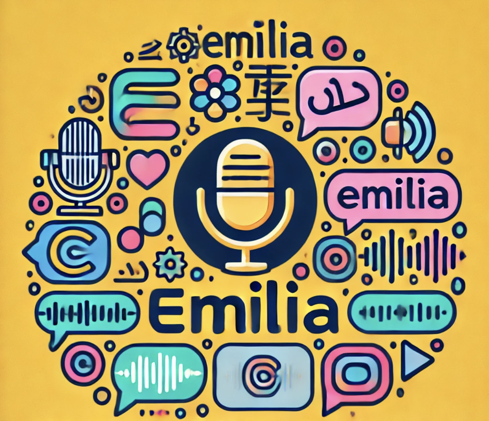

**Source:** *Emilia dataset card* — [original page](https://huggingface.co/datasets/amphion/Emilia-Dataset)

# [ 

 Datasets:](https://huggingface.co/datasets)

* * *

[amphion](https://huggingface.co/amphion)

/

[Emilia-Dataset](https://huggingface.co/datasets/amphion/Emilia-Dataset) 

 

 Like 491

Follow

 Amphion 438

Tasks: [ 

  Text-to-Speech ](https://huggingface.co/datasets?task_categories=task_categories%3Atext-to-speech)[ 

  Automatic Speech Recognition ](https://huggingface.co/datasets?task_categories=task_categories%3Aautomatic-speech-recognition)

Modalities: [ 

 Audio ](https://huggingface.co/datasets?modality=modality%3Aaudio)[ 

 Text ](https://huggingface.co/datasets?modality=modality%3Atext)

Formats: [ 

 webdataset ](https://huggingface.co/datasets?format=format%3Awebdataset)

Languages: [ 

 Chinese ](https://huggingface.co/datasets?language=language%3Azh)[ 

 English ](https://huggingface.co/datasets?language=language%3Aen)[ 

 Japanese ](https://huggingface.co/datasets?language=language%3Aja) \+ 3

Size: [ 10M - 100M ](https://huggingface.co/datasets?size_categories=size_categories%3A10M%3Cn%3C100M)

ArXiv:

 arxiv: 2407.05361

 arxiv: 2501.15907

Libraries: [ 

 Datasets ](https://huggingface.co/datasets?library=library%3Adatasets)[ 

 WebDataset ](https://huggingface.co/datasets?library=library%3Awebdataset)

 Croissant

License:

 cc-by-4.0

[ 

 Dataset card ](https://huggingface.co/datasets/amphion/Emilia-Dataset)[ 

 Data Studio ](https://huggingface.co/datasets/amphion/Emilia-Dataset/viewer/)[ 

 Files Files and versions 

 xet ](https://huggingface.co/datasets/amphion/Emilia-Dataset/tree/main)[ 

 Community 21 ](https://huggingface.co/datasets/amphion/Emilia-Dataset/discussions)

##  

 You need to agree to share your contact information to access this dataset

This repository is publicly accessible, but you have to accept the conditions to access its files and content.

Terms of Access: The researcher has requested permission to use the Emilia dataset, the Emilia-Pipe preprocessing pipeline, and the Emilia-Yodas dataset. In exchange for such permission, the researcher hereby agrees to the following terms and conditions:

  1. The researcher shall use the Emilia dataset under the CC-BY-NC license and  
the Emilia-YODAS dataset under the CC-BY license.
  2. The authors make no representations or warranties regarding the datasets,  
including but not limited to warranties of non-infringement or fitness for  
a particular purpose.
  3. The researcher accepts full responsibility for their use of the datasets and  
shall defend and indemnify the authors of Emilia, Emilia-Pipe, and  
Emilia-Yodas, including their employees, trustees, officers, and agents,  
against any and all claims arising from the researcher's use of the datasets,  
including but not limited to the researcher's use of any copies of copyrighted  
content that they may create from the datasets.
  4. The researcher may provide research associates and colleagues with access  
to the datasets, provided that they first agree to be bound by these terms  
and conditions.
  5. The authors reserve the right to terminate the researcher's access to the  
datasets at any time.
  6. If the researcher is employed by a for-profit, commercial entity, the  
researcher's employer shall also be bound by these terms and conditions,  
and the researcher hereby represents that they are fully authorized to enter  
into this agreement on behalf of such employer.

[Log in](https://huggingface.co/login?next=/datasets/amphion/Emilia-Dataset) or [Sign Up](https://huggingface.co/join?next=/datasets/amphion/Emilia-Dataset) to review the conditions and access this dataset content.

 

  * [News 🔥](https://huggingface.co/datasets/amphion/Emilia-Dataset#news-🔥 "News 🔥")
  * [Emilia-Large Overview ⭐️](https://huggingface.co/datasets/amphion/Emilia-Dataset#emilia-large-overview-⭐️ "Emilia-Large Overview ⭐️")
  * [Emilia Dataset Usage 📖](https://huggingface.co/datasets/amphion/Emilia-Dataset#emilia-dataset-usage-📖 "Emilia Dataset Usage 📖")
    * [Use cases](https://huggingface.co/datasets/amphion/Emilia-Dataset#use-cases "Use cases")
    * [Re-build or Processing your own data](https://huggingface.co/datasets/amphion/Emilia-Dataset#re-build-or-processing-your-own-data "Re-build or Processing your own data")
    * [Notes](https://huggingface.co/datasets/amphion/Emilia-Dataset#notes "Notes")
  * [Emilia Dataset Structure ⛪️](https://huggingface.co/datasets/amphion/Emilia-Dataset#emilia-dataset-structure-⛪️ "Emilia Dataset Structure ⛪️")
    * [Structure on HuggingFace](https://huggingface.co/datasets/amphion/Emilia-Dataset#structure-on-huggingface "Structure on HuggingFace")
    * [Structure on OpenDataLab](https://huggingface.co/datasets/amphion/Emilia-Dataset#structure-on-opendatalab "Structure on OpenDataLab")
  * [Reference 📖](https://huggingface.co/datasets/amphion/Emilia-Dataset#reference-📖 "Reference 📖")

#   Emilia: An Extensive, Multilingual, and Diverse Speech Dataset for Large-Scale Speech Generation 

This is the official repository 👑 for the **Emilia** dataset and the source code for the **Emilia-Pipe** speech data preprocessing pipeline. 

 

##   News 🔥 

  * **2025/02/26** : _The Emilia-Large dataset, featuring over 200,000 hours of data, is now available!!!_ Emilia-Large combines the original 101k-hour Emilia dataset (licensed under `CC BY-NC 4.0`) with the brand-new 114k-hour **Emilia-YODAS dataset** (licensed under `CC BY 4.0`)!!!
  * **2025/01/27** : We release the extended version of Emilia's paper on [arXiv](https://arxiv.org/abs/2501.15907)! More experiments and more insights! 
  * **2024/12/04** : We present Emilia at the [IEEE SLT 2024](https://2024.ieeeslt.org/)! 
  * **2024/08/28** : Welcome to join Amphion's [Discord channel](https://discord.com/invite/ZxxREr3Y) to stay connected and engage with our community!
  * **2024/08/27** : _The Emilia dataset is now publicly available!_ Discover the most extensive and diverse speech generation dataset with 101k hours of in-the-wild speech data now at [HuggingFace](https://huggingface.co/datasets/amphion/Emilia-Dataset) or [OpenDataLab](https://opendatalab.com/Amphion/Emilia)! 👑👑👑
  * **2024/07/08** : Our preprint [paper](https://arxiv.org/abs/2407.05361) is now available! 🔥🔥🔥
  * **2024/07/03** : We welcome everyone to check our [homepage](https://emilia-dataset.github.io/Emilia-Demo-Page/) for our brief introduction for Emilia dataset and our demos!
  * **2024/07/01** : We release of Emilia and Emilia-Pipe! We welcome everyone to explore it on our [GitHub](https://github.com/open-mmlab/Amphion/tree/main/preprocessors/Emilia)! 🎉🎉🎉

##   Emilia-Large Overview ⭐️ 

The **Emilia-Large** dataset is a comprehensive, multilingual dataset with the following features:

  * with _Emilia_ containing over _101k_ hours and _Emilia-YODAS_ containing over _114k_ hours of speech data;
  * covering six different languages: _English (En), Chinese (Zh), German (De), French (Fr), Japanese (Ja), and Korean (Ko)_ ;
  * containing diverse speech data with _various speaking styles_ from diverse video platforms and podcasts on the Internet, covering various content genres such as talk shows, interviews, debates, sports commentary, and audiobooks.

The table below provides the duration statistics for each language in the dataset.

Language | Emilia Duration (hours) | Emilia-YODAS Duration (hours) | Total Duration (hours)  
---|---|---|---  
English | 46.8k | 92.2k | 139.0k  
Chinese | 49.9k | 0.3k | 50.3k  
German | 1.6k | 5.6k | 7.2k  
French | 1.4k | 7.4k | 8.8k  
Japanese | 1.7k | 1.1k | 2.8k  
Korean | 0.2k | 7.3k | 7.5k  
**Total** | **101.7k** | **113.9k** | **215.6k**

 

The **Emilia-Pipe** is the first open-source preprocessing pipeline designed to transform raw, in-the-wild speech data into high-quality training data with annotations for speech generation. This pipeline can process one hour of raw audio into model-ready data in just a few minutes, requiring only the raw speech data. 

Detailed descriptions for the Emilia and Emilia-Pipe can be found in our [paper](https://arxiv.org/abs/2407.05361), and [extended version](https://arxiv.org/abs/2501.15907).

##   Emilia Dataset Usage 📖 

Emilia and Emilia-YODAS is publicly available at [HuggingFace](https://huggingface.co/datasets/amphion/Emilia-Dataset).

  * Option 1: Download from HuggingFace:

    1. Gain access to the dataset and get the HF access token from: <https://huggingface.co/settings/tokens>.
    2. Install dependencies and login HF:
       * Install Python
       * Run `pip install librosa soundfile datasets huggingface_hub[cli]`
       * Login by `huggingface-cli login` and paste the HF access token. Check [here](https://huggingface.co/docs/huggingface_hub/guides/cli#huggingface-cli-login) for details.
    3. Use following code to load Emilia and Emilia-YODAS:
    
    from datasets import load_dataset
    dataset = load_dataset("amphion/Emilia-Dataset", streaming=True)
    print(dataset) # features: ['json', 'mp3', '__key__', '__url__'], num_shards: 4343
    print(next(iter(dataset['train'])))
    

  * Option 2: Download from [OpenDataLab](https://opendatalab.com/Amphion/Emilia) (i.e., OpenXLab)

    * If you are from mainland China or having a connecting issue with HuggingFace, you can download Emilia from OpenDataLab.
    * Please follow the guidance [here](https://speechteam.feishu.cn/wiki/PC8Ew5igviqBiJkElMJcJxNonJc) to gain access.
    * Note: On OpenDataLab, Emilia is available, but Emilia-YODAS is not.

**ENJOY USING EMILIA!!!** 🔥

###   Use cases 

If you only want to use Emilia-YODAS, you can use:
    
    
    from datasets import load_dataset
    path = "Emilia-YODAS/**/*.tar" # Same for Emilia; just replace "Emilia-YODAS/" with "Emilia/"
    dataset = load_dataset("amphion/Emilia-Dataset", data_files={"train": path}, split="train", streaming=True)
    print(dataset) # here should only shows 1983 n_shards
    print(next(iter(dataset)))
    

If you want to load a subset of Emilia/Emilia-YODAS, e.g., only language `DE`, you can use the following code:
    
    
    from datasets import load_dataset
    path = "Emilia/DE/*.tar" # Same for Emilia-YODAS; just replace "Emilia/" with "Emilia-YODAS/"
    dataset = load_dataset("amphion/Emilia-Dataset", data_files={"de": path}, split="de", streaming=True)
    print(dataset) # here should only shows 90 n_shards
    print(next(iter(dataset)))
    

If you want to download all files to your local before using Emilia and Emilia-YODAS, remove the `streaming=True` argument:
    
    
    from datasets import load_dataset
    dataset = load_dataset("amphion/Emilia-Dataset")
    print(dataset)
    

###   Re-build or Processing your own data 

If you wish to re-build Emilia from scratch, you may download the raw audio files from the [provided URL list](https://huggingface.co/datasets/amphion/Emilia) and use our open-source [Emilia-Pipe](https://github.com/open-mmlab/Amphion/tree/main/preprocessors/Emilia) preprocessing pipeline to preprocess the raw data. Additionally, users can easily use Emilia-Pipe to preprocess their own raw speech data for custom needs. By open-sourcing the Emilia-Pipe code, we aim to enable the speech community to collaborate on large-scale speech generation research.

###   Notes 

  1. Please note that Emilia does not own the copyright to the audio files; the copyright remains with the original owners of the videos or audio. Users are permitted to use Emilia dataset only for non-commercial purposes under the `CC BY-NC-4.0` license.
  2. For data in Emilia-YODSA, we download the raw data from [espnet/yodas2](https://huggingface.co/datasets/espnet/yodas2), and use the same license family: `CC BY 4.0`.

##   Emilia Dataset Structure ⛪️ 

###   Structure on HuggingFace 

On HuggingFace, Emilia and Emilia-YODAS is formatted as [WebDataset](https://github.com/webdataset/webdataset).

Each audio is tared with a corresponding JSON file (having the same prefix filename) within 4,343 tar files.

Dataset | Size | # of Tars  
---|---|---  
Emilia | 2.4TB | 2,360  
Emilia-YODAS | 2.1TB | 1,983  
**Total** | 4.5TB | 4,343

 

By utilizing WebDataset, you can easily stream audio data, which is magnitude faster than reading separate data files one by one.

Read the _Emilia Dataset Usage 📖_ part for a detailed usage guide.

Learn more about WebDataset [here](https://huggingface.co/docs/hub/datasets-webdataset).

_PS: If you want to download the`OpenDataLab` format from HuggingFace, you can specify the `revision` argument to `fc71e07e8572f5f3be1dbd02ed3172a4d298f152`, [which](https://huggingface.co/datasets/amphion/Emilia-Dataset/tree/fc71e07e8572f5f3be1dbd02ed3172a4d298f152) is the old format._

###   Structure on OpenDataLab 

On OpenDataLab, Emilia is formatted using the following structure. _Note: On OpenDataLab, Emilia is available, but Emilia-YODAS is not._

Structure example:
    
    
    |-- openemilia_all.tar.gz (all .JSONL files are gzipped with directory structure in this file)
    |-- EN (114 batches)
    |   |-- EN_B00000.jsonl
    |   |-- EN_B00000 (= EN_B00000.tar.gz)
    |   |   |-- EN_B00000_S00000
    |   |   |   `-- mp3
    |   |   |       |-- EN_B00000_S00000_W000000.mp3
    |   |   |       `-- EN_B00000_S00000_W000001.mp3
    |   |   |-- ...
    |   |-- ...
    |   |-- EN_B00113.jsonl
    |   `-- EN_B00113
    |-- ZH (92 batches)
    |-- DE (9 batches)
    |-- FR (10 batches)
    |-- JA (7 batches)
    |-- KO (4 batches)
    

JSONL files example:
    
    
    {"id": "EN_B00000_S00000_W000000", "wav": "EN_B00000/EN_B00000_S00000/mp3/EN_B00000_S00000_W000000.mp3", "text": " You can help my mother and you- No. You didn't leave a bad situation back home to get caught up in another one here. What happened to you, Los Angeles?", "duration": 6.264, "speaker": "EN_B00000_S00000", "language": "en", "dnsmos": 3.2927}
    {"id": "EN_B00000_S00000_W000001", "wav": "EN_B00000/EN_B00000_S00000/mp3/EN_B00000_S00000_W000001.mp3", "text": " Honda's gone, 20 squads done. X is gonna split us up and put us on different squads. The team's come and go, but 20 squad, can't believe it's ending.", "duration": 8.031, "speaker": "EN_B00000_S00000", "language": "en", "dnsmos": 3.0442}
    

##   Reference 📖 

If you use the Emilia dataset or the Emilia-Pipe pipeline, please cite the following papers:
    
    
    @inproceedings{emilialarge,
        author={He, Haorui and Shang, Zengqiang and Wang, Chaoren and Li, Xuyuan and Gu, Yicheng and Hua, Hua and Liu, Liwei and Yang, Chen and Li, Jiaqi and Shi, Peiyang and Wang, Yuancheng and Chen, Kai and Zhang, Pengyuan and Wu, Zhizheng},
        title={Emilia: A Large-Scale, Extensive, Multilingual, and Diverse Dataset for Speech Generation},
        booktitle={arXiv:2501.15907},
        year={2025}
    }
    
    @inproceedings{emilia,
        author={He, Haorui and Shang, Zengqiang and Wang, Chaoren and Li, Xuyuan and Gu, Yicheng and Hua, Hua and Liu, Liwei and Yang, Chen and Li, Jiaqi and Shi, Peiyang and Wang, Yuancheng and Chen, Kai and Zhang, Pengyuan and Wu, Zhizheng},
        title={Emilia: An Extensive, Multilingual, and Diverse Speech Dataset for Large-Scale Speech Generation},
        booktitle={Proc.~of SLT},
        year={2024}
    }
    
    @inproceedings{amphion,
        author={Zhang, Xueyao and Xue, Liumeng and Gu, Yicheng and Wang, Yuancheng and Li, Jiaqi and He, Haorui and Wang, Chaoren and Song, Ting and Chen, Xi and Fang, Zihao and Chen, Haopeng and Zhang, Junan and Tang, Tze Ying and Zou, Lexiao and Wang, Mingxuan and Han, Jun and Chen, Kai and Li, Haizhou and Wu, Zhizheng},
        title={Amphion: An Open-Source Audio, Music and Speech Generation Toolkit},
        booktitle={Proc.~of SLT},
        year={2024}
    }
    

 Copy to bucket new

 

Downloads last month

    40,379

Total file size: 4.75 TB

##  

 Models trained or fine-tuned on amphion/Emilia-Dataset

[ 

  SWivid/F5-TTS 

 Text-to-Speech • Updated Mar 21, 2025 • 

 882k • 

 1.21k  ](https://huggingface.co/SWivid/F5-TTS)

[ 

  remsky/kokoro-inno-clone-tuner 

 Text-to-Speech • 

 9.65M • Updated 16 days ago • 

 618k • 

 16  ](https://huggingface.co/remsky/kokoro-inno-clone-tuner)

[ 

  SWivid/E2-TTS 

 Text-to-Speech • Updated Mar 12, 2025 • 

 114k • 

 57  ](https://huggingface.co/SWivid/E2-TTS)

[ 

  Aratako/MioTTS-2.6B 

 Text-to-Speech • 

 3B • Updated Feb 10 • 

 53.5k • 

 81  ](https://huggingface.co/Aratako/MioTTS-2.6B)

[ 

  neuphonic/neucodec 

 Audio-to-Audio • 

 0.6B • Updated 29 days ago • 

 48.8k • 

 148  ](https://huggingface.co/neuphonic/neucodec)

[ 

  Aratako/MioCodec-25Hz-24kHz 

 Audio-to-Audio • 

 0.1B • Updated Feb 3 • 

 12.8k • 

 17  ](https://huggingface.co/Aratako/MioCodec-25Hz-24kHz)

[Browse 147 models trained on this dataset](https://huggingface.co/models?dataset=dataset:amphion/Emilia-Dataset)

##  

 Spaces using amphion/Emilia-Dataset 24

[🗣️ mrfakename/E2-F5-TTS 

  ](https://huggingface.co/spaces/mrfakename/E2-F5-TTS)[🗣️ abidlabs/E2-F5-TTS ](https://huggingface.co/spaces/abidlabs/E2-F5-TTS)[🔊 Steveeeeeeen/SpeechLLM-Playbook ](https://huggingface.co/spaces/Steveeeeeeen/SpeechLLM-Playbook)[💻 mrfakename/DMOSpeech2 ](https://huggingface.co/spaces/mrfakename/DMOSpeech2)[🥤 potsawee/soda-demo ](https://huggingface.co/spaces/potsawee/soda-demo)[💫 mrfakename/VoiceStar ](https://huggingface.co/spaces/mrfakename/VoiceStar)[🗣️ JyuViole/E2-F5-TTS-RUS ](https://huggingface.co/spaces/JyuViole/E2-F5-TTS-RUS)[🗣️ YetNak/E2-F5-TTSi ](https://huggingface.co/spaces/YetNak/E2-F5-TTSi) \+ 19 Spaces \+ 16 Spaces

##  

 Papers for amphion/Emilia-Dataset

#### [Emilia: A Large-Scale, Extensive, Multilingual, and Diverse Dataset for Speech Generation 

 Paper • 2501.15907 • Published Jan 27, 2025 • 

 18 ](https://huggingface.co/papers/2501.15907)#### [Emilia: An Extensive, Multilingual, and Diverse Speech Dataset for Large-Scale Speech Generation 

 Paper • 2407.05361 • Published Jul 7, 2024 • 

 2 ](https://huggingface.co/papers/2407.05361)
