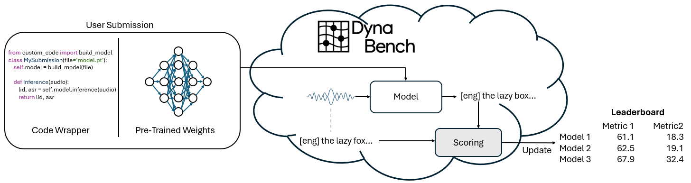
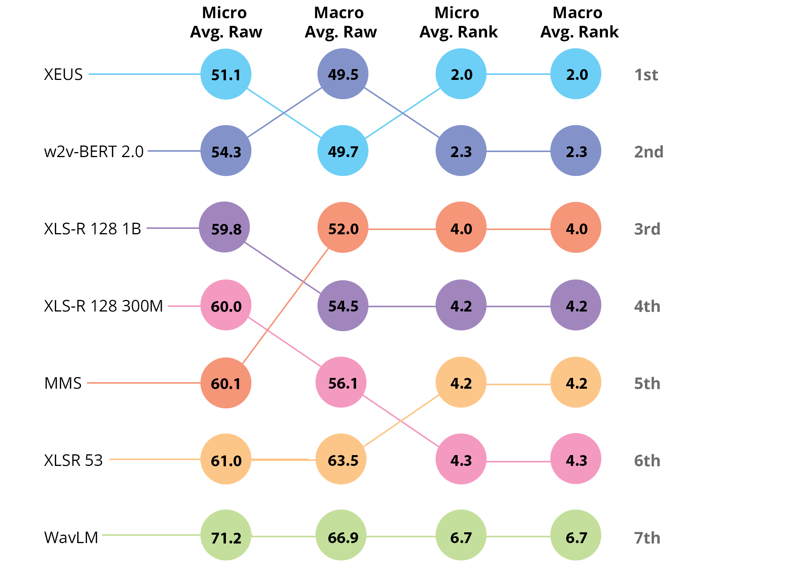
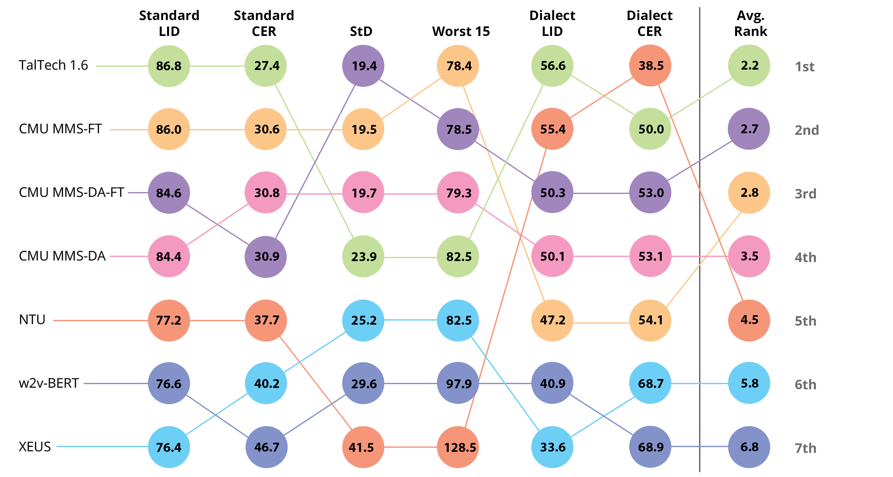

**Source:** *The ML-SUPERB 2.0 Challenge: Towards Inclusive ASR Benchmarking for All Language Varieties* — [PDF](https://arxiv.org/pdf/2509.07139) · [arXiv](https://arxiv.org/abs/2509.07139)

Chen Meng Shi Bartelds Wang Wang Mosquera Hincapie Jurafsky Anastasopoulos Lee Livescu Watanabe Carnegie Mellon University, 2George Mason University, 3Stanford University, 4National Taiwan University, 5ML Commons, 6TTI-Chicago, 7Archimedes, Athena RC, 8Factored AI

# The ML-SUPERB 2.0 Challenge:   
Towards Inclusive ASR Benchmarking for All Language Varieties

William  Chutong  Jiatong  Martijn  Shih-Heng  Hsiu-Hsuan  Rafael  Sara  Dan  Antonis  Hung-yi  Karen  Shinji  Affiliation: 

###### Abstract

Recent improvements in multilingual ASR have not been equally distributed across languages and language varieties. To advance state-of-the-art (SOTA) ASR models, we present the Interspeech 2025 ML-SUPERB 2.0 Challenge. We construct a new test suite that consists of data from 200+ languages, accents, and dialects to evaluate SOTA multilingual speech models. The challenge also introduces an online evaluation server based on DynaBench, allowing for flexibility in model design and architecture for participants. The challenge received 5 submissions from 3 teams, all of which outperformed our baselines. The best-performing submission achieved an absolute improvement in LID accuracy of 23% and a reduction in CER of 18% when compared to the best baseline on a general multilingual test set. On accented and dialectal data, the best submission obtained 30.2% lower CER and 15.7% higher LID accuracy, showing the importance of community challenges in making speech technologies more inclusive.

###### keywords

multilingual, speech recognition 

††email: williamchen@cmu.edu

## 1 Introduction

In the past decade, studies on scaling end-to-end neural networks have led to dramatic improvements in models for Automatic Speech Recognition (ASR) [[1](https://arxiv.org/html/2509.07139#bib.bibx1), [2](https://arxiv.org/html/2509.07139#bib.bibx2)]. Importantly, ASR systems are no longer limited to solely the English language: state-of-the-art (SOTA) models achieve strong performance on over 50 languages [[3](https://arxiv.org/html/2509.07139#bib.bibx3), [4](https://arxiv.org/html/2509.07139#bib.bibx4), [5](https://arxiv.org/html/2509.07139#bib.bibx5)].

However, these benefits have not been equally distributed among all languages and language varieties. Many works have shown that SOTA models perform significantly worse on accented speech or dialects that are not considered “standard" [[6](https://arxiv.org/html/2509.07139#bib.bibx6), [7](https://arxiv.org/html/2509.07139#bib.bibx7), [8](https://arxiv.org/html/2509.07139#bib.bibx8)]. This causes many downstream technologies, such as virtual assistants, closed captioning, and translation services to function substantially worse for many subgroups that may already be disadvantaged.

To address this limitation, this paper presents the Interspeech 2025 ML-SUPERB 2.0 Challenge. The goal of the challenge is to encourage the development of systems that can perform well across languages and language varieties. In total, the challenge evaluates ASR models on speech data from 149 languages and 93 language varieties. Unlike other SUPERB-based benchmarks and challenges [[9](https://arxiv.org/html/2509.07139#bib.bibx9), [10](https://arxiv.org/html/2509.07139#bib.bibx10), [11](https://arxiv.org/html/2509.07139#bib.bibx11), [12](https://arxiv.org/html/2509.07139#bib.bibx12), [13](https://arxiv.org/html/2509.07139#bib.bibx13), [14](https://arxiv.org/html/2509.07139#bib.bibx14), [15](https://arxiv.org/html/2509.07139#bib.bibx15)], which focused on smaller probe-based experiments on limited amounts of data, the ML-SUPERB 2.0 Challenge has no restrictions on what data or pre-trained models can be used. Participants can curate training data or leverage the latest advances in speech modeling to train the best possible models. Evaluation of these models is facilitated by our online evaluation server that is hosted by DynaBench [[16](https://arxiv.org/html/2509.07139#bib.bibx16)]. This server performs inference for the participants by having all submissions adhere to an API. As such, the test set remains fully hidden to participants, preventing benchmark overfitting.

The focus on robustness to both different languages and language varieties is novel, as research in these areas has often been disjoint. Many works aim to solely increase the amount of languages a system can handle, but ignore variation that occurs within languages [[17](https://arxiv.org/html/2509.07139#bib.bibx17), [5](https://arxiv.org/html/2509.07139#bib.bibx5), [18](https://arxiv.org/html/2509.07139#bib.bibx18)]. On the other hand, research on improving ASR performance on different accents or dialects often focuses on variation within single languages [[6](https://arxiv.org/html/2509.07139#bib.bibx6), [19](https://arxiv.org/html/2509.07139#bib.bibx19), [20](https://arxiv.org/html/2509.07139#bib.bibx20), [21](https://arxiv.org/html/2509.07139#bib.bibx21)]. This benchmark acts as a first step towards better unifying the fields of multilingual and fair speech processing. We hope such cross-disciplinary interactions can lead to both a more inclusive speech processing community and more inclusive speech processing models. This paper is outlined as follows:

  * [left=6pt,nolistsep,noitemsep] 
  * Section [2](https://arxiv.org/html/2509.07139#S2 "2 Challenge Data ‣ The ML-SUPERB 2.0 Challenge: Towards Inclusive ASR Benchmarking for All Language Varieties") details the collection and cleaning process for the data used in the challenge, while discussing the difficulties in developing a benchmark with such a wide coverage of languages and language varieties. 
  * Section [3](https://arxiv.org/html/2509.07139#S3 "3 Challenge Task and Rules ‣ The ML-SUPERB 2.0 Challenge: Towards Inclusive ASR Benchmarking for All Language Varieties") outlines the challenge rules and design decisions. 
  * Section [4](https://arxiv.org/html/2509.07139#S4 "4 Benchmark and Submission Results ‣ The ML-SUPERB 2.0 Challenge: Towards Inclusive ASR Benchmarking for All Language Varieties") presents baseline results with SOTA self-supervised and supervised ASR models, and compares them to the submitted systems. 

Our contributions can thus be summarized as:

  1. [left=6pt,noitemsep,nolistsep] 
  2. 1\. We introduce a new challenge that evaluates multilingual ASR performance across 149 languages and 93 language varieties, representing the broadest coverage of any speech benchmark to date. 
  3. 2\. We compare 5 submitted systems, which all out-performed our baseline systems, showing that community challenges can lead to better-performing systems. 
  4. 3\. Despite these advancements, we find that SOTA ASR systems continue to underperform on accented and dialectal speech. 

 Figure 1: Overview of the challenge submission system. Participants upload their model weights and inference code to DynaBench, which runs the evaluation online and returns the evaluation metrics.

## 2 Challenge Data

### 2.1 General Multilingual Data

The data described in this section is designed to evaluate the general multilingual capabilities of ASR models across 149 languages. We obtain this data by combining previous ML-SUPERB benchmarks [[11](https://arxiv.org/html/2509.07139#bib.bibx11), [13](https://arxiv.org/html/2509.07139#bib.bibx13), [14](https://arxiv.org/html/2509.07139#bib.bibx14)]. In doing so, we found several issues with the data used in these existing benchmarks or the corpora they were sourced from. Many of these issues originate from cases where a language may use several different orthographies. For example, we removed all Norwegian data (nor, nno, and nob), because (1) some data sources do not clearly indicate which written standard they represent; (2) nno and nob differ only in writing systems and they do not have a clear relationship with the spoken dialects. Similar issues were observed in Serbian: FLEURS [[22](https://arxiv.org/html/2509.07139#bib.bibx22)] had Latin transcripts while Common Voice [[23](https://arxiv.org/html/2509.07139#bib.bibx23)] used Cyrillic. Normalizing these factors is particularly important for our challenge, as otherwise our metrics on fairness and robustness will be severely impacted (Section [3.6](https://arxiv.org/html/2509.07139#S3.SS6 "3.6 Evaluation Data and Metrics ‣ 3 Challenge Task and Rules ‣ The ML-SUPERB 2.0 Challenge: Towards Inclusive ASR Benchmarking for All Language Varieties")). Another common problem was the distinction between similar languages. Although Tagalog (tgl) and Filipino (fil) are technically distinct languages, the source datasets do not explicitly distinguish them. Therefore, we decided to merge them. Also, the choice of ISO code used by different datasets posed a problem, where some datasets use the macro-language designation and others use a dialect-specific code, as seen with Malay (msa vs zlm) and Odia (ory vs ori). These issues highlight the difficulties associated with crowd-sourced data collection efforts [[23](https://arxiv.org/html/2509.07139#bib.bibx23), [22](https://arxiv.org/html/2509.07139#bib.bibx22)] and show the necessity of linguistic expertise during data development. As multilingual models become increasingly more common in both research and production [[3](https://arxiv.org/html/2509.07139#bib.bibx3), [17](https://arxiv.org/html/2509.07139#bib.bibx17), [5](https://arxiv.org/html/2509.07139#bib.bibx5), [24](https://arxiv.org/html/2509.07139#bib.bibx24), [18](https://arxiv.org/html/2509.07139#bib.bibx18)], proper linguistic meta-data is necessary to guarantee that models are configured properly.

After data cleaning, we segment the data into 3 splits: a baseline training set, a development set, and a test set. The baseline training set consists of 1 hour of data per language, while the development and test sets contain 10 minutes of data per language. The baseline training and development sets contain 139 languages, leading to a total of 139 hours of training data and 23 hours of development data. The test set contains an additional 10 languages from the ML-SUPERB Challenge hidden set [[13](https://arxiv.org/html/2509.07139#bib.bibx13)], totaling to 26 hours11 1 Participants were made aware of which exact languages were included in the test set but not the training set..

### 2.2 Accented and Dialectal Multilingual Data

To evaluate the performance of ASR models on different accents and dialects, we collect more evaluation data from new data sources, totaling to 93 accents and dialects. We create 10-minute development and test subsets for each accent or dialect from each of these corpora in the same style as Section [2](https://arxiv.org/html/2509.07139#S2 "2 Challenge Data ‣ The ML-SUPERB 2.0 Challenge: Towards Inclusive ASR Benchmarking for All Language Varieties"). The development set contains data sourced from 9 accented or dialectal speech corpora [[25](https://arxiv.org/html/2509.07139#bib.bibx25), [26](https://arxiv.org/html/2509.07139#bib.bibx26), [27](https://arxiv.org/html/2509.07139#bib.bibx27), [28](https://arxiv.org/html/2509.07139#bib.bibx28), [29](https://arxiv.org/html/2509.07139#bib.bibx29), [30](https://arxiv.org/html/2509.07139#bib.bibx30), [31](https://arxiv.org/html/2509.07139#bib.bibx31), [32](https://arxiv.org/html/2509.07139#bib.bibx32), [33](https://arxiv.org/html/2509.07139#bib.bibx33)]. The hidden test set contains data sourced from the same corpora as the development set along with 4 additional corpora [[34](https://arxiv.org/html/2509.07139#bib.bibx34), [35](https://arxiv.org/html/2509.07139#bib.bibx35), [36](https://arxiv.org/html/2509.07139#bib.bibx36), [37](https://arxiv.org/html/2509.07139#bib.bibx37)]. While we list these datasets here for transparency, participants were not made aware of which datasets were used during the challenge. We also did not reveal which accents or dialects were included in the challenge.

## 3 Challenge Task and Rules

### 3.1 Updates from Previous Challenges and Benchmarks

The goal of this challenge is to encourage the development of ASR systems that are robust to languages, accents, and dialects. Importantly, we avoid constraining participants to certain datasets or modeling approaches. This is distinct from the goals of previous ML-SUPERB benchmarks or challenges [[15](https://arxiv.org/html/2509.07139#bib.bibx15)]. The original benchmark constrained systems to a fixed training set, as it was designed to probe the multilingual capabilities of SSL models and not develop SOTA ASR systems. The ML-SUPERB 1.0 Challenge [[13](https://arxiv.org/html/2509.07139#bib.bibx13)] was proposed to extend the benchmark to new languages, but enforced the same training constraints. Finally, the ML-SUPERB 2.0 benchmark22 2 We emphasize that [[14](https://arxiv.org/html/2509.07139#bib.bibx14)] is a benchmark while this paper implements its findings into a challenge. [[14](https://arxiv.org/html/2509.07139#bib.bibx14)] was designed to consider differences in architectures and training strategies when evaluating multilingual SSL models and proposed metrics to evaluate model robustness. However, it was also constrained to a fixed training set and did not consider robustness to accents or dialects. The differences are summarized in Table [1](https://arxiv.org/html/2509.07139#S3.T1 "Table 1 ‣ 3.1 Updates from Previous Challenges and Benchmarks ‣ 3 Challenge Task and Rules ‣ The ML-SUPERB 2.0 Challenge: Towards Inclusive ASR Benchmarking for All Language Varieties").

Table 1: Comparison of different ML-SUPERB versions.

Version | Langs. | Models | Fairness | Dialectal  
---|---|---|---|---  
1.0 Benchmark | 143 | SSL | ✗ | ✗  
1.0 Challenge | 154 | SSL | ✗ | ✗  
2.0 Benchmark | 142 | ASR+SSL | ✓ | ✗  
2.0 Challenge (ours) | 149 | Any | ✓ | ✓

 

### 3.2 Task

Contrary to previous SUPERB benchmarks [[9](https://arxiv.org/html/2509.07139#bib.bibx9), [10](https://arxiv.org/html/2509.07139#bib.bibx10), [11](https://arxiv.org/html/2509.07139#bib.bibx11), [12](https://arxiv.org/html/2509.07139#bib.bibx12), [13](https://arxiv.org/html/2509.07139#bib.bibx13), [14](https://arxiv.org/html/2509.07139#bib.bibx14), [15](https://arxiv.org/html/2509.07139#bib.bibx15)], the ML-SUPERB 2.0 Challenge only features a single evaluation track. Participants are tasked with developing SOTA multilingual ASR systems for 154 languages. During the evaluation phase of the challenge, the participants are given audio files and asked to both transcribe the speech (ASR) and predict the language being spoken (LID prediction). We opted not to include more complex tasks, such as Spoken Language Understanding, as it would lead to many low-resource languages being excluded.

### 3.3 Submission

We use DynaBench [[16](https://arxiv.org/html/2509.07139#bib.bibx16)] as the challenge submission platform, as it was successfully used in previous competitions that required the test set to remain completely hidden, such as the FLoReS-101 Large-Scale MT challenge at WMT 2021 [[38](https://arxiv.org/html/2509.07139#bib.bibx38), [39](https://arxiv.org/html/2509.07139#bib.bibx39)]. Rather than submitting decoded inference results, participants instead upload their model submission to DynaBench. DynaBench interfaces with the uploaded model via a standardized, pre-defined API (Listing [2](https://arxiv.org/html/2509.07139#S3.F2 "Figure 2 ‣ 3.4 Allowed Models and Methods ‣ 3 Challenge Task and Rules ‣ The ML-SUPERB 2.0 Challenge: Towards Inclusive ASR Benchmarking for All Language Varieties")) and then performs inference and scoring on the evaluation server. Participants are only able to view the final evaluation scores, and do not have access to the input audio, ground truth text, nor their model outputs. This allows the evaluation to remain fully blind and robust, alleviating issues with community benchmark overfitting. A summary of the submission process is visualized in Figure [1](https://arxiv.org/html/2509.07139#S1.F1 "Figure 1 ‣ 1 Introduction ‣ The ML-SUPERB 2.0 Challenge: Towards Inclusive ASR Benchmarking for All Language Varieties").

### 3.4 Allowed Models and Methods

Unlike the ML-SUPERB 1.0 challenge that constrained participants to fixed data or training methods [[13](https://arxiv.org/html/2509.07139#bib.bibx13)], participants are allowed to use almost any resource in this benchmark. The only rule is that inference for the final evaluation must be performed on our server without internet connection (See Section [3.3](https://arxiv.org/html/2509.07139#S3.SS3 "3.3 Submission ‣ 3 Challenge Task and Rules ‣ The ML-SUPERB 2.0 Challenge: Towards Inclusive ASR Benchmarking for All Language Varieties")). Furthermore, the submitted model must be able to perform inference within the server’s memory limitations (around 46 GB of GPU VRAM).

These flexible constraints allow participants to use the latest pre-trained models, such as self-supervised speech encoders [[18](https://arxiv.org/html/2509.07139#bib.bibx18), [17](https://arxiv.org/html/2509.07139#bib.bibx17)], supervised ASR models [[3](https://arxiv.org/html/2509.07139#bib.bibx3), [4](https://arxiv.org/html/2509.07139#bib.bibx4), [40](https://arxiv.org/html/2509.07139#bib.bibx40), [24](https://arxiv.org/html/2509.07139#bib.bibx24)], or even Large Language Models (LLMs) [[41](https://arxiv.org/html/2509.07139#bib.bibx41)], while preventing submissions that only use API-based models [[42](https://arxiv.org/html/2509.07139#bib.bibx42)]. We note that participants are allowed to use API-based solutions to aid their own model development, such as for the purpose of distillation or pseudo-labelling.

⬇

def API(waveform): 

"""

Args:

waveform (np.array): speech waveform

Returns:

pred_lid (str): ISO3 code of LID pred

pred_asr (str): predicted transcript

"""

# participants must fill in the below

# lines to connect their model

pred_lid =

pred_asr =

return pred_lid, pred_asr 

Figure 2: Pseudo-code for the API used to interface with the DynaBench, which participants customize for their model.

### 3.5 Training and Development Data

Similar to Section [3.4](https://arxiv.org/html/2509.07139#S3.SS4 "3.4 Allowed Models and Methods ‣ 3 Challenge Task and Rules ‣ The ML-SUPERB 2.0 Challenge: Towards Inclusive ASR Benchmarking for All Language Varieties"), we do not have any explicit constraints on which datasets are allowed: participants are free to use an existing dataset for model development. They are also allowed to collect external data from new resources, as long as they mention how that data was obtained. To ease model development, we provide participants with the baseline training and development set based on the ML-SUPERB 2.0 public set [[14](https://arxiv.org/html/2509.07139#bib.bibx14)], as described in Section [2.1](https://arxiv.org/html/2509.07139#S2.SS1 "2.1 General Multilingual Data ‣ 2 Challenge Data ‣ The ML-SUPERB 2.0 Challenge: Towards Inclusive ASR Benchmarking for All Language Varieties"). We also provide participants with a secondary accented and dialectal development set (Section [2.2](https://arxiv.org/html/2509.07139#S2.SS2 "2.2 Accented and Dialectal Multilingual Data ‣ 2 Challenge Data ‣ The ML-SUPERB 2.0 Challenge: Towards Inclusive ASR Benchmarking for All Language Varieties")) to help them assess the robustness of their models to different language varieties. Participants are not required to use any of the provided data.

### 3.6 Evaluation Data and Metrics

 Figure 3: Comparison of different aggregation methods used to compute the final rankings across all metrics. Accuracies are inverted by subtracting from 100 when calculating the aggregate raw scores, such that a lower score is better.

The submissions of participants are evaluated on the accuracy of their speech recognition systems on different languages and language varieties. We separate our metrics into three categories: standard, language robustness, and dialectal robustness. Each of these categories are expanded upon in detail below.

Standard:  This category mostly follows the original scoring system of ML-SUPERB’s multilingual ASR+LID task with two main metrics: average language identification accuracy (ACC) and ASR character error rate (CER) across languages. The scores for this category are obtained from the inference results on the ML-SUPERB test sets discussed in Section [2.1](https://arxiv.org/html/2509.07139#S2.SS1 "2.1 General Multilingual Data ‣ 2 Challenge Data ‣ The ML-SUPERB 2.0 Challenge: Towards Inclusive ASR Benchmarking for All Language Varieties").

Language Robustness:  The language robustness metrics are designed to encourage consistency in performance across languages.33 3 These metrics were first explored in the ML-SUPERB 2.0 benchmark [[14](https://arxiv.org/html/2509.07139#bib.bibx14)], but were not considered for model ranking. We use two metrics to measure this: average ASR CER of a system’s worst performing 15 languages and the standard deviation (StD) of a system’s ASR CER across all languages. These scores are also obtained from the inference results on the ML-SUPERB test sets discussed in Section [2.1](https://arxiv.org/html/2509.07139#S2.SS1 "2.1 General Multilingual Data ‣ 2 Challenge Data ‣ The ML-SUPERB 2.0 Challenge: Towards Inclusive ASR Benchmarking for All Language Varieties"). For both metrics, a lower score indicates a better result.

Dialectal Robustness:  The dialectal robustness evaluation metrics encourage systems that are robust to different varieties within languages. The metrics used for robustness mirror those of the standard evaluation category: language identification ACC and ASR CER on the accented and dialectal speech data. Participants are not required to identify the specific dialect spoken in an utterance. Since this evaluation requires accent/dialect labels, the scores are obtained from inference results on our new accented and dialectal test set discussed in Section [2.2](https://arxiv.org/html/2509.07139#S2.SS2 "2.2 Accented and Dialectal Multilingual Data ‣ 2 Challenge Data ‣ The ML-SUPERB 2.0 Challenge: Towards Inclusive ASR Benchmarking for All Language Varieties").

### 3.7 Ranking

 Figure 4: Raw scores/rankings of each system submission and the best 2 SSL model baselines on our challenge evaluation metrics.

The overall ranking on the challenge is calculated by taking the average rank of each model on each of the 6 metrics. The methodology can be summarized as follows:

  1. [left=12pt, before= 

, after=

, itemsep=3pt]

  2. 1\. Calculate rankings for each model on each metric. 
  3. 2\. Calculate the average ranking for each model across metrics. 
  4. 3\. Rank models by average ranking. 

We use the average rank of a system rather than the average of the raw metric scores to avoid the ranking being skewed by differences in the metrics’ dynamic ranges, which was effective in previous speech challenges [[43](https://arxiv.org/html/2509.07139#bib.bibx43), [44](https://arxiv.org/html/2509.07139#bib.bibx44)]. For example, the first two columns in Figure [3](https://arxiv.org/html/2509.07139#S3.F3 "Figure 3 ‣ 3.6 Evaluation Data and Metrics ‣ 3 Challenge Task and Rules ‣ The ML-SUPERB 2.0 Challenge: Towards Inclusive ASR Benchmarking for All Language Varieties") show how rankings can shift significantly between a macro-average across the 3 categories (Standard, Language Robustness, Dialectal Robustness) and micro-average across the 6 individual metrics (Standard CER, Standard LID, Worst 15 CER, StD, Dialectal CER, Dialectal LID) when using raw scores, which is undesirable. On the other hand, there is no change in the overall ranking for the 7 SSL models between a macro-average and micro-average when using per-metric rank (Figure [3](https://arxiv.org/html/2509.07139#S3.F3 "Figure 3 ‣ 3.6 Evaluation Data and Metrics ‣ 3 Challenge Task and Rules ‣ The ML-SUPERB 2.0 Challenge: Towards Inclusive ASR Benchmarking for All Language Varieties"), left 2 columns). We therefore use the micro-average across per-metric ranks as the aggregation method for simplicity and consistency, with tie-breakers decided by the micro-average of raw scores.

## 4 Benchmark and Submission Results

Self-Supervised Models:  We obtained baseline results with 7 systems based on SSL speech encoders: WavLM [[45](https://arxiv.org/html/2509.07139#bib.bibx45)], XLSR-53 [[46](https://arxiv.org/html/2509.07139#bib.bibx46)], XLS-R 128 300M [[47](https://arxiv.org/html/2509.07139#bib.bibx47)], XLS-R 128 1B [[47](https://arxiv.org/html/2509.07139#bib.bibx47)], MMS 1B [[17](https://arxiv.org/html/2509.07139#bib.bibx17)], w2v-BERT 2.0 [[24](https://arxiv.org/html/2509.07139#bib.bibx24)], and XEUS [[18](https://arxiv.org/html/2509.07139#bib.bibx18)]. Since all of these models are self-supervised, we develop ASR systems via fine-tuning on the ML-SUPERB 2.0 public set [[14](https://arxiv.org/html/2509.07139#bib.bibx14)]. Each self-supervised speech encoder is frozen during fine-tuning, and a weighted sum of the layer-wise representations is used as input into a 2-layer Transformer encoder [[48](https://arxiv.org/html/2509.07139#bib.bibx48)] that is trained using the CTC loss [[49](https://arxiv.org/html/2509.07139#bib.bibx49)].

Table 2: Raw scores of SOTA supervised and SSL models on the ML-SUPERB and Dialectal test sets.

<table id="S4.T2.4.1" class="ltx_tabular ltx_guessed_headers ltx_align_middle">
<tbody class="ltx_tbody">
<tr id="S4.T2.4.1.1" class="ltx_tr">
<th id="S4.T2.4.1.1.1" class="ltx_td ltx_th ltx_th_row ltx_border_r ltx_border_tt"></th>
<td id="S4.T2.4.1.1.2" class="ltx_td ltx_align_center ltx_border_tt" colspan="2">Standard</td>
<td id="S4.T2.4.1.1.3" class="ltx_td ltx_align_center ltx_border_tt" colspan="2">Language</td>
<td id="S4.T2.4.1.1.4" class="ltx_td ltx_align_center ltx_border_tt" colspan="2">Dialectal</td></tr>
<tr id="S4.T2.4.1.2" class="ltx_tr">
<th id="S4.T2.4.1.2.1" class="ltx_td ltx_align_left ltx_th ltx_th_row ltx_border_r">Model</th>
<td id="S4.T2.4.1.2.2" class="ltx_td ltx_align_right">LID</td>
<td id="S4.T2.4.1.2.3" class="ltx_td ltx_align_right ltx_border_r">CER</td>
<td id="S4.T2.4.1.2.4" class="ltx_td ltx_align_right">StD</td>
<td id="S4.T2.4.1.2.5" class="ltx_td ltx_align_right ltx_border_r">Worst</td>
<td id="S4.T2.4.1.2.6" class="ltx_td ltx_align_right">LID</td>
<td id="S4.T2.4.1.2.7" class="ltx_td ltx_align_right">CER</td></tr>
<tr id="S4.T2.4.1.3" class="ltx_tr">
<th id="S4.T2.4.1.3.1" class="ltx_td ltx_align_left ltx_th ltx_th_row ltx_border_r ltx_border_t">WavLM</th>
<td id="S4.T2.4.1.3.2" class="ltx_td ltx_align_right ltx_border_t">55.9</td>
<td id="S4.T2.4.1.3.3" class="ltx_td ltx_align_right ltx_border_r ltx_border_t">72.0</td>
<td id="S4.T2.4.1.3.4" class="ltx_td ltx_align_right ltx_border_t">38.3</td>
<td id="S4.T2.4.1.3.5" class="ltx_td ltx_align_right ltx_border_r ltx_border_t">122.1</td>
<td id="S4.T2.4.1.3.6" class="ltx_td ltx_align_right ltx_border_t">27.2</td>
<td id="S4.T2.4.1.3.7" class="ltx_td ltx_align_right ltx_border_t">79.0</td></tr>
<tr id="S4.T2.4.1.4" class="ltx_tr">
<th id="S4.T2.4.1.4.1" class="ltx_td ltx_align_left ltx_th ltx_th_row ltx_border_r">XLSR 53</th>
<td id="S4.T2.4.1.4.2" class="ltx_td ltx_align_right">53.8</td>
<td id="S4.T2.4.1.4.3" class="ltx_td ltx_align_right ltx_border_r">51.9</td>
<td id="S4.T2.4.1.4.4" class="ltx_td ltx_align_right">19.4</td>
<td id="S4.T2.4.1.4.5" class="ltx_td ltx_align_right ltx_border_r">92.8</td>
<td id="S4.T2.4.1.4.6" class="ltx_td ltx_align_right">18.8</td>
<td id="S4.T2.4.1.4.7" class="ltx_td ltx_align_right">74.5</td></tr>
<tr id="S4.T2.4.1.5" class="ltx_tr">
<th id="S4.T2.4.1.5.1" class="ltx_td ltx_align_left ltx_th ltx_th_row ltx_border_r">XLS-R 300M</th>
<td id="S4.T2.4.1.5.2" class="ltx_td ltx_align_right">72.6</td>
<td id="S4.T2.4.1.5.3" class="ltx_td ltx_align_right ltx_border_r">53.0</td>
<td id="S4.T2.4.1.5.4" class="ltx_td ltx_align_right">31.4</td>
<td id="S4.T2.4.1.5.5" class="ltx_td ltx_align_right ltx_border_r">104.3</td>
<td id="S4.T2.4.1.5.6" class="ltx_td ltx_align_right">30.5</td>
<td id="S4.T2.4.1.5.7" class="ltx_td ltx_align_right">74.5</td></tr>
<tr id="S4.T2.4.1.6" class="ltx_tr">
<th id="S4.T2.4.1.6.1" class="ltx_td ltx_align_left ltx_th ltx_th_row ltx_border_r">XLS-R 1B</th>
<td id="S4.T2.4.1.6.2" class="ltx_td ltx_align_right">71.0</td>
<td id="S4.T2.4.1.6.3" class="ltx_td ltx_align_right ltx_border_r">53.5</td>
<td id="S4.T2.4.1.6.4" class="ltx_td ltx_align_right">31.4</td>
<td id="S4.T2.4.1.6.5" class="ltx_td ltx_align_right ltx_border_r">110.0</td>
<td id="S4.T2.4.1.6.6" class="ltx_td ltx_align_right">32.7</td>
<td id="S4.T2.4.1.6.7" class="ltx_td ltx_align_right">68.0</td></tr>
<tr id="S4.T2.4.1.7" class="ltx_tr">
<th id="S4.T2.4.1.7.1" class="ltx_td ltx_align_left ltx_th ltx_th_row ltx_border_r">MMS 1B</th>
<td id="S4.T2.4.1.7.2" class="ltx_td ltx_align_right">74.6</td>
<td id="S4.T2.4.1.7.3" class="ltx_td ltx_align_right ltx_border_r">57.1</td>
<td id="S4.T2.4.1.7.4" class="ltx_td ltx_align_right">33.5</td>
<td id="S4.T2.4.1.7.5" class="ltx_td ltx_align_right ltx_border_r">118.8</td>
<td id="S4.T2.4.1.7.6" class="ltx_td ltx_align_right">40.4</td>
<td id="S4.T2.4.1.7.7" class="ltx_td ltx_align_right">65.9</td></tr>
<tr id="S4.T2.4.1.8" class="ltx_tr">
<th id="S4.T2.4.1.8.1" class="ltx_td ltx_align_left ltx_th ltx_th_row ltx_border_r">w2v-BERT</th>
<td id="S4.T2.4.1.8.2" class="ltx_td ltx_align_right">76.6</td>
<td id="S4.T2.4.1.8.3" class="ltx_td ltx_align_right ltx_border_r">46.7</td>
<td id="S4.T2.4.1.8.4" class="ltx_td ltx_align_right">29.6</td>
<td id="S4.T2.4.1.8.5" class="ltx_td ltx_align_right ltx_border_r">97.9</td>
<td id="S4.T2.4.1.8.6" class="ltx_td ltx_align_right">40.9</td>
<td id="S4.T2.4.1.8.7" class="ltx_td ltx_align_right">68.9</td></tr>
<tr id="S4.T2.4.1.9" class="ltx_tr">
<th id="S4.T2.4.1.9.1" class="ltx_td ltx_align_left ltx_th ltx_th_row ltx_border_r">XEUS</th>
<td id="S4.T2.4.1.9.2" class="ltx_td ltx_align_right">76.4</td>
<td id="S4.T2.4.1.9.3" class="ltx_td ltx_align_right ltx_border_r">40.2</td>
<td id="S4.T2.4.1.9.4" class="ltx_td ltx_align_right">25.2</td>
<td id="S4.T2.4.1.9.5" class="ltx_td ltx_align_right ltx_border_r">82.5</td>
<td id="S4.T2.4.1.9.6" class="ltx_td ltx_align_right">33.6</td>
<td id="S4.T2.4.1.9.7" class="ltx_td ltx_align_right">68.7</td></tr>
<tr id="S4.T2.4.1.10" class="ltx_tr">
<th id="S4.T2.4.1.10.1" class="ltx_td ltx_align_left ltx_th ltx_th_row ltx_border_r ltx_border_t">Whisper</th>
<td id="S4.T2.4.1.10.2" class="ltx_td ltx_align_right ltx_border_t">42.3</td>
<td id="S4.T2.4.1.10.3" class="ltx_td ltx_align_right ltx_border_r ltx_border_t">43.2</td>
<td id="S4.T2.4.1.10.4" class="ltx_td ltx_align_right ltx_border_t">41.0</td>
<td id="S4.T2.4.1.10.5" class="ltx_td ltx_align_right ltx_border_r ltx_border_t">122.9</td>
<td id="S4.T2.4.1.10.6" class="ltx_td ltx_align_right ltx_border_t">54.7</td>
<td id="S4.T2.4.1.10.7" class="ltx_td ltx_align_right ltx_border_t">44.3</td></tr>
<tr id="S4.T2.4.1.11" class="ltx_tr">
<th id="S4.T2.4.1.11.1" class="ltx_td ltx_align_left ltx_th ltx_th_row ltx_border_bb ltx_border_r">OWSM</th>
<td id="S4.T2.4.1.11.2" class="ltx_td ltx_align_right ltx_border_bb">64.8</td>
<td id="S4.T2.4.1.11.3" class="ltx_td ltx_align_right ltx_border_bb ltx_border_r">43.0</td>
<td id="S4.T2.4.1.11.4" class="ltx_td ltx_align_right ltx_border_bb">50.0</td>
<td id="S4.T2.4.1.11.5" class="ltx_td ltx_align_right ltx_border_bb ltx_border_r">122.8</td>
<td id="S4.T2.4.1.11.6" class="ltx_td ltx_align_right ltx_border_bb">51.0</td>
<td id="S4.T2.4.1.11.7" class="ltx_td ltx_align_right ltx_border_bb">109.5</td></tr>
</tbody>
</table>

 

Supervised Models:  We also evaluate the capabilities of 2 multilingual pre-trained ASR foundation models: OWSM 4B [[50](https://arxiv.org/html/2509.07139#bib.bibx50)] and Whisper Large v3 [[3](https://arxiv.org/html/2509.07139#bib.bibx3)]. These are run in a zero-shot manner, as they are designed to be used out-of-the-box.

### 4.1 Results

Supervised vs Self-Supervised:  Table [2](https://arxiv.org/html/2509.07139#S4.T2 "Table 2 ‣ 4 Benchmark and Submission Results ‣ The ML-SUPERB 2.0 Challenge: Towards Inclusive ASR Benchmarking for All Language Varieties") shows the scores of each supervised and SSL model. We find that SSL models generally achieve better scores due to the wide coverage of the fine-tuning dataset; supervised models yield inconsistent performances (high StD) since their original training set does not cover all languages. XEUS is the best overall model, while the English-only WavLM yields the worst results. Table [3](https://arxiv.org/html/2509.07139#S4.T3 "Table 3 ‣ 4.1 Results ‣ 4 Benchmark and Submission Results ‣ The ML-SUPERB 2.0 Challenge: Towards Inclusive ASR Benchmarking for All Language Varieties") breaks down the two supervised models’ scores, separating languages seen in their training set from those that are unseen, showing the substantial impact of unseen languages on CER.

Table 3: CERs of supervised models when considering if languages were seen during training. 

<table id="S4.T3.4" class="ltx_tabular ltx_centering ltx_guessed_headers ltx_align_middle">
<thead class="ltx_thead">
<tr id="S4.T3.4.1" class="ltx_tr">
<th id="S4.T3.4.1.1" class="ltx_td ltx_th ltx_th_column ltx_th_row ltx_border_r ltx_border_tt"></th>
<th id="S4.T3.4.1.2" class="ltx_td ltx_align_center ltx_th ltx_th_column ltx_border_tt" colspan="2">Standard</th>
<th id="S4.T3.4.1.3" class="ltx_td ltx_align_center ltx_th ltx_th_column ltx_border_tt" colspan="2">Dialectal</th></tr>
<tr id="S4.T3.4.2" class="ltx_tr">
<th id="S4.T3.4.2.1" class="ltx_td ltx_align_left ltx_th ltx_th_column ltx_th_row ltx_border_r">Model</th>
<th id="S4.T3.4.2.2" class="ltx_td ltx_align_right ltx_th ltx_th_column">Seen</th>
<th id="S4.T3.4.2.3" class="ltx_td ltx_align_right ltx_th ltx_th_column ltx_border_r">Unseen</th>
<th id="S4.T3.4.2.4" class="ltx_td ltx_align_right ltx_th ltx_th_column">Seen</th>
<th id="S4.T3.4.2.5" class="ltx_td ltx_align_right ltx_th ltx_th_column">Unseen</th></tr>
</thead>
<tbody class="ltx_tbody">
<tr id="S4.T3.4.3" class="ltx_tr">
<th id="S4.T3.4.3.1" class="ltx_td ltx_align_left ltx_th ltx_th_row ltx_border_r ltx_border_t">Whisper</th>
<td id="S4.T3.4.3.2" class="ltx_td ltx_align_right ltx_border_t">40.7</td>
<td id="S4.T3.4.3.3" class="ltx_td ltx_align_right ltx_border_r ltx_border_t">76.2</td>
<td id="S4.T3.4.3.4" class="ltx_td ltx_align_right ltx_border_t">28.0</td>
<td id="S4.T3.4.3.5" class="ltx_td ltx_align_right ltx_border_t">59.9</td></tr>
<tr id="S4.T3.4.4" class="ltx_tr">
<th id="S4.T3.4.4.1" class="ltx_td ltx_align_left ltx_th ltx_th_row ltx_border_bb ltx_border_r">OWSM</th>
<td id="S4.T3.4.4.2" class="ltx_td ltx_align_right ltx_border_bb">26.0</td>
<td id="S4.T3.4.4.3" class="ltx_td ltx_align_right ltx_border_bb ltx_border_r">69.3</td>
<td id="S4.T3.4.4.4" class="ltx_td ltx_align_right ltx_border_bb">102.6</td>
<td id="S4.T3.4.4.5" class="ltx_td ltx_align_right ltx_border_bb">157.7</td></tr>
</tbody>
</table>

 

System Submissions:  The 5 systems from the 3 teams are compared to the 2 best SSL baselines in Figure [4](https://arxiv.org/html/2509.07139#S3.F4 "Figure 4 ‣ 3.7 Ranking ‣ 3 Challenge Task and Rules ‣ The ML-SUPERB 2.0 Challenge: Towards Inclusive ASR Benchmarking for All Language Varieties"). All submitted systems achieved a higher overall ranking than the SSL baselines, showing the progress made during the challenge. No submission obtained the best results across all 6 metrics: each team had a system submission that ranked 1st in at least 1 metric. Comparing the best system per metric to XEUS, the best SSL baseline, we observed an absolute improvement of 12.4, 19.3, 5.8, 4.1, 23.0, and 30.2 on Standard LID, Standard CER, StD, Worst 15 CER, Dialect LID, and Dialect CER, respectively.

## 5 Conclusion

We propose the ML-SUPERB 2.0 Challenge, a novel speech processing challenge with the goal of inclusive ASR benchmarking for a large number (200+) of languages, accents, and dialects. The challenge introduces a novel multilingual test suite of accented and dialect speech and uses new metrics to test the robustness of ASR systems. The challenge received 5 system submissions from 3 teams, all of which outperformed baselines derived from SOTA SSL models. We hope future work can build on this challenge and its findings to make speech technologies more accessible for all.   

Acknowledgments Antonios Anastasopoulos is supported by the National Science Foundation (NSF)under awards IIS-2125466 and IIS-2327143. Parts of this work used the PSC Bridges2 system at and Delta system at NCSA through allocations CIS210014 and IRI120008P from the ACCESS program, supported by NSF grants #2138259,#:2138286, #:2138307, #:2137603, and #:2138296.

## 6 References

## References

  * [1] Alexei Baevski et al.  “wav2vec 2.0: A framework for self-supervised learning of speech representations”  In _Proc. NeurIPS_ 33, 2020, pp. 12449–12460 
  * [2] Wei-Ning Hsu et al.  “Hubert: Self-supervised speech representation learning by masked prediction of hidden units”  In _TASLP_ 29, 2021, pp. 3451–3460 
  * [3] Alec Radford et al.  “Robust speech recognition via large-scale weak supervision”  In _International conference on machine learning_ , 2023, pp. 28492–28518 
  * [4] Yifan Peng et al.  “OWSM v3. 1: Better and faster open whisper-style speech models based on e-branchformer”  In _arXiv preprint arXiv:2401.16658_ , 2024 
  * [5] Yu Zhang et al.  “Google usm: Scaling automatic speech recognition beyond 100 languages”  In _arXiv preprint arXiv:2303.01037_ , 2023 
  * [6] Kalvin Chang et al.  “Self-supervised Speech Representations Still Struggle with African American Vernacular English”  In _INTERSPEECH_ , 2024 
  * [7] Siyuan Feng et al.  “Towards inclusive automatic speech recognition”  In _Computer Speech & Language_ 84, 2024, pp. 101567 
  * [8] Milind Agarwal et al.  “Findings of the IWSLT 2023 Evaluation Campaign”  In _Proc. IWSLT_ , 2023  DOI: [10.18653/v1/2023.iwslt-1.1](https://dx.doi.org/10.18653/v1/2023.iwslt-1.1)
  * [9] Hsiang-Sheng Tsai  “SUPERB-SG: Enhanced Speech processing Universal PERformance Benchmark for Semantic and Generative Capabilities”  In _ACL_ , 2022 
  * [10] Yuan Tseng et al.  “AV-SUPERB: A Multi-Task Evaluation Benchmark for Audio-Visual Representation Models”  In _ICASSP_ , 2024  DOI: [10.1109/ICASSP48485.2024.10445941](https://dx.doi.org/10.1109/ICASSP48485.2024.10445941)
  * [11] Jiatong Shi et al.  “ML-SUPERB: Multilingual Speech Universal PERformance Benchmark”  In _Proc. INTERSPEECH_ , 2023  DOI: [10.21437/Interspeech.2023-1316](https://dx.doi.org/10.21437/Interspeech.2023-1316)
  * [12] Tzu-hsun Feng et al.  “SUPERB@ SLT 2022: Challenge on Generalization and Efficiency of Self-Supervised Speech Representation Learning”  In _SLT_ , 2023, pp. 1096–1103 
  * [13] Jiatong Shi  “Findings of the 2023 ML-SUPERB Challenge: Pre-Training And Evaluation Over More Languages And Beyond”  In _ASRU_ , 2023  DOI: [10.1109/ASRU57964.2023.10389628](https://dx.doi.org/10.1109/ASRU57964.2023.10389628)
  * [14] Jiatong Shi  “ML-SUPERB 2.0: Benchmarking Multilingual Speech Models Across Modeling Constraints, Languages, and Datasets”  In _Proc. INTERSPEECH_ , 2024 
  * [15] Shuwen Yang et al.  “SUPERB: Speech Processing Universal PERformance Benchmark”  In _Interspeech_ , 2021  DOI: [10.21437/Interspeech.2021-1775](https://dx.doi.org/10.21437/Interspeech.2021-1775)
  * [16] Douwe Kiela et al.  “Dynabench: Rethinking Benchmarking in NLP”  In _NAACL_ , 2021  DOI: [10.18653/v1/2021.naacl-main.324](https://dx.doi.org/10.18653/v1/2021.naacl-main.324)
  * [17] Vineel Pratap  “Scaling speech technology to 1,000+ languages”  In _JMLR_ 25.97, 2024, pp. 1–52 
  * [18] William Chen et al.  “Towards robust speech representation learning for thousands of languages”  In _arXiv preprint arXiv:2407.00837_ , 2024 
  * [19] Josh Meyer et al.  “Artie Bias Corpus: An Open Dataset for Detecting Demographic Bias in Speech Applications”  In _LREC_ , 2020, pp. 6462–6468  URL: <https://aclanthology.org/2020.lrec-1.796>
  * [20] Steven Weinberger  “Speech Accent Archive”  In _Retrieved from http://accent.gmu.edu_ , 2015 
  * [21] Irina-Elena Veliche et al.  “Towards measuring fairness in speech recognition: Fair-Speech dataset”  In _arXiv preprint arXiv:2408.12734_ , 2024 
  * [22] Alexis Conneau et al.  “Fleurs: Few-shot learning evaluation of universal representations of speech”  In _SLT_ , 2023, pp. 798–805 
  * [23] Rosana Ardila et al.  “Common Voice: A Massively-Multilingual Speech Corpus”  In _Proc. LREC_ , 2020, pp. 4218–4222 
  * [24] Loı̈c Barrault et al.  “SeamlessM4T-Massively Multilingual & Multimodal Machine Translation”  In _arXiv preprint arXiv:2308.11596_ , 2023 
  * [25] Sadeen Alharbi et al.  “SADA: Saudi Audio Dataset for Arabic”  In _ICASSP_ , 2024, pp. 10286–10290  DOI: [10.1109/ICASSP48485.2024.10446243](https://dx.doi.org/10.1109/ICASSP48485.2024.10446243)
  * [26] Changhan Wang et al.  “VoxPopuli: A Large-Scale Multilingual Speech Corpus for Representation Learning, Semi-Supervised Learning and Interpretation”  In _ACL_ , 2021, pp. 993–1003 
  * [27] Isin Demirsahin et al.  “Open-source Multi-speaker Corpora of the English Accents in the British Isles”  In _LREC_ , 2020, pp. 6532–6541  URL: <https://aclanthology.org/2020.lrec-1.804/>
  * [28] Wenbin Wang, Yang Song and Sanjay Jha  “GLOBE: A High-quality English Corpus with Global Accents for Zero-shot Speaker Adaptive Text-to-Speech”  In _Interspeech_ , 2024, pp. 1365–1369  DOI: [10.21437/Interspeech.2024-70](https://dx.doi.org/10.21437/Interspeech.2024-70)
  * [29] Guanlong Zhao et al.  “L2-ARCTIC: A Non-native English Speech Corpus”  In _Interspeech_ , 2018, pp. 2783–2787  DOI: [10.21437/Interspeech.2018-1110](https://dx.doi.org/10.21437/Interspeech.2018-1110)
  * [30] Pelin Dogan-Schönberger, Julian Mäder and Thomas Hofmann  “SwissDial: Parallel Multidialectal Corpus of Spoken Swiss German”, 2021  arXiv: <https://arxiv.org/abs/2103.11401>
  * [31] Socrates Vakirtzian et al.  “Speech Recognition for Greek Dialects: A Challenging Benchmark”  In _Interspeech_ , 2024, pp. 3974–3978  DOI: [10.21437/Interspeech.2024-2443](https://dx.doi.org/10.21437/Interspeech.2024-2443)
  * [32] Brij Srivastava et al.  “Interspeech 2018 Low Resource Automatic Speech Recognition Challenge for Indian Languages”  In _6th Workshop on Spoken Language Technologies for Under-Resourced Languages (SLTU 2018)_ , 2018, pp. 11–14  DOI: [10.21437/SLTU.2018-3](https://dx.doi.org/10.21437/SLTU.2018-3)
  * [33] Adriana Guevara-Rukoz et al.  “Crowdsourcing Latin American Spanish for Low-Resource Text-to-Speech”  In _LREC_ , 2020, pp. 6504–6513  URL: <https://aclanthology.org/2020.lrec-1.801/>
  * [34] Ahmed Abdallah et al.  “Leveraging Data Collection and Unsupervised Learning for Code-Switched Tunisian Arabic Automatic Speech Recognition”  In _ICASSP_ , 2024, pp. 12607–12611  DOI: [10.1109/ICASSP48485.2024.10445734](https://dx.doi.org/10.1109/ICASSP48485.2024.10445734)
  * [35] Bashar Talafha et al.  “Casablanca: Data and Models for Multidialectal Arabic Speech Recognition”  In _arXiv preprint arXiv:2410.04527_ , 2024 
  * [36] Tiezheng Yu et al.  “Automatic Speech Recognition Datasets in Cantonese: A Survey and New Dataset”  In _LREC_ , 2022, pp. 6487–6494  URL: <https://aclanthology.org/2022.lrec-1.696>
  * [37] Mika Hämäläinen et al.  “Finnish Dialect Identification: The Effect of Audio and Text”  In _EMNLP_ , 2021, pp. 8777–8783  DOI: [10.18653/v1/2021.emnlp-main.692](https://dx.doi.org/10.18653/v1/2021.emnlp-main.692)
  * [38] Guillaume Wenzek et al.  “Findings of the WMT 2021 Shared Task on Large-Scale Multilingual Machine Translation”  In _Proc. WMT_ , 2021, pp. 89–99  URL: <https://aclanthology.org/2021.wmt-1.2/>
  * [39] Farhad Akhbardeh et al.  “Findings of the 2021 Conference on Machine Translation (WMT21)”  In _Proc. WMT_
  * [40] Yifan Peng  “OWSM v3.1: Better and Faster Open Whisper-Style Speech Models based on E-Branchformer”  In _Proc. INTERSPEECH_ , 2024 
  * [41] Hugo Touvron et al.  “LLaMA: Open and efficient foundation language models”  In _arxiv:2302.13971_ , 2023 
  * [42] Tom Brown et al.  “Language Models are Few-Shot Learners”  In _Proc. NeurIPS_ 33, 2020, pp. 1877–1901 
  * [43] Xuankai Chang et al.  “The Interspeech 2024 Challenge on Speech Processing Using Discrete Units”  In _arXiv preprint arXiv:2406.07725_ , 2024 
  * [44] Wangyou Zhang et al.  “NeurIPS 2024 Competition Proposal: URGENT Challenge”  In _NeurIPS 2024 Competition Track_ , 2024  URL: <https://openreview.net/forum?id=tVthtKNCGB>
  * [45] Sanyuan Chen et al.  “Wavlm: Large-scale self-supervised pre-training for full stack speech processing”  In _JSTSP_ 16.6, 2022, pp. 1505–1518 
  * [46] Alexis Conneau et al.  “Unsupervised cross-lingual representation learning for speech recognition”  In _arXiv preprint arXiv:2006.13979_ , 2020 
  * [47] Arun Babu et al.  “XLS-R: Self-supervised cross-lingual speech representation learning at scale”  In _arXiv preprint arXiv:2111.09296_ , 2021 
  * [48] Ashish Vaswani et al.  “Attention is All you Need”  In _NeurIPS 2017_ , 2017 
  * [49] Alex Graves et al.  “Connectionist temporal classification: labelling unsegmented sequence data with recurrent neural networks”  In _ICML 2006_ , 2006, pp. 369–376 
  * [50] William Chen et al.  “OWLS: Scaling Laws for Multilingual Speech Recognition and Translation Models”  In _arXiv preprint arXiv:2502.10373_ , 2025 

