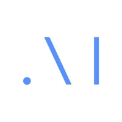

**Source:** *Massively Multilingual Speech (MMS) - Finetuned LID* — [original page](https://huggingface.co/facebook/mms-lid-4017)

# 

[facebook](https://huggingface.co/facebook)

/

[mms-lid-4017](https://huggingface.co/facebook/mms-lid-4017) 

 

 Like 17

Follow

 AI at Meta 15k

[ 

  Audio Classification ](https://huggingface.co/models?pipeline_tag=audio-classification)[ 

 Transformers ](https://huggingface.co/models?library=transformers)[ 

 PyTorch ](https://huggingface.co/models?library=pytorch)[ 

 Safetensors ](https://huggingface.co/models?library=safetensors)

 google/fleurs

 158 languages

[ wav2vec2 ](https://huggingface.co/models?other=wav2vec2)[ mms ](https://huggingface.co/models?other=mms)

 arxiv: 2305.13516

 License: cc-by-nc-4.0

[ 

 Model card ](https://huggingface.co/facebook/mms-lid-4017)[ 

 Files Files and versions 

 xet ](https://huggingface.co/facebook/mms-lid-4017/tree/main)[ 

 Community ](https://huggingface.co/facebook/mms-lid-4017/discussions)

 

 Deploy 

 

 Copy to bucket new

 Use this model 

 

### Instructions to use facebook/mms-lid-4017 with libraries, inference providers, notebooks, and local apps. Follow these links to get started.

  * Libraries
  * [ 

 Transformers](https://huggingface.co/facebook/mms-lid-4017?library=transformers)

How to use facebook/mms-lid-4017 with Transformers:
        
        # Use a pipeline as a high-level helper
        from transformers import pipeline
        
        pipe = pipeline("audio-classification", model="facebook/mms-lid-4017")
        
        # Load model directly
        from transformers import AutoProcessor, AutoModelForAudioClassification
        
        processor = AutoProcessor.from_pretrained("facebook/mms-lid-4017")
        model = AutoModelForAudioClassification.from_pretrained("facebook/mms-lid-4017", device_map="auto")

  * Notebooks
  * [ 

 Google Colab](https://huggingface.co/facebook/mms-lid-4017/colab)
  * [ 

 Kaggle](https://huggingface.co/facebook/mms-lid-4017/kaggle)

 

  * [Massively Multilingual Speech (MMS) - Finetuned LID](https://huggingface.co/facebook/mms-lid-4017#massively-multilingual-speech-mms---finetuned-lid "Massively Multilingual Speech \(MMS\) - Finetuned LID")
    * [Table Of Content](https://huggingface.co/facebook/mms-lid-4017#table-of-content "Table Of Content")
    * [Example](https://huggingface.co/facebook/mms-lid-4017#example "Example")
    * [Supported Languages](https://huggingface.co/facebook/mms-lid-4017#supported-languages "Supported Languages")
    * [Model details](https://huggingface.co/facebook/mms-lid-4017#model-details "Model details")
    * [Additional Links](https://huggingface.co/facebook/mms-lid-4017#additional-links "Additional Links")

#   Massively Multilingual Speech (MMS) - Finetuned LID 

This checkpoint is a model fine-tuned for speech language identification (LID) and part of Facebook's [Massive Multilingual Speech project](https://research.facebook.com/publications/scaling-speech-technology-to-1000-languages/). This checkpoint is based on the [Wav2Vec2 architecture](https://huggingface.co/docs/transformers/model_doc/wav2vec2) and classifies raw audio input to a probability distribution over 4017 output classes (each class representing a language). The checkpoint consists of **1 billion parameters** and has been fine-tuned from [facebook/mms-1b](https://huggingface.co/facebook/mms-1b) on 4017 languages.

##   Table Of Content 

  * [Example](https://huggingface.co/facebook/mms-lid-4017#example)
  * [Supported Languages](https://huggingface.co/facebook/mms-lid-4017#supported-languages)
  * [Model details](https://huggingface.co/facebook/mms-lid-4017#model-details)
  * [Additional links](https://huggingface.co/facebook/mms-lid-4017#additional-links)

##   Example 

This MMS checkpoint can be used with [Transformers](https://github.com/huggingface/transformers) to identify the spoken language of an audio. It can recognize the [following 4017 languages](https://huggingface.co/facebook/mms-lid-4017#supported-languages).

Let's look at a simple example.

First, we install transformers and some other libraries
    
    
    pip install torch accelerate torchaudio datasets
    pip install --upgrade transformers
    

**Note** : In order to use MMS you need to have at least `transformers >= 4.30` installed. If the `4.30` version is not yet available [on PyPI](https://pypi.org/project/transformers/) make sure to install `transformers` from source:
    
    
    pip install git+https://github.com/huggingface/transformers.git
    

Next, we load a couple of audio samples via `datasets`. Make sure that the audio data is sampled to 16000 kHz.
    
    
    from datasets import load_dataset, Audio
    
    # English
    stream_data = load_dataset("mozilla-foundation/common_voice_13_0", "en", split="test", streaming=True)
    stream_data = stream_data.cast_column("audio", Audio(sampling_rate=16000))
    en_sample = next(iter(stream_data))["audio"]["array"]
    
    # Arabic
    stream_data = load_dataset("mozilla-foundation/common_voice_13_0", "ar", split="test", streaming=True)
    stream_data = stream_data.cast_column("audio", Audio(sampling_rate=16000))
    ar_sample = next(iter(stream_data))["audio"]["array"]
    

Next, we load the model and processor
    
    
    from transformers import Wav2Vec2ForSequenceClassification, AutoFeatureExtractor
    import torch
    
    model_id = "facebook/mms-lid-4017"
    
    processor = AutoFeatureExtractor.from_pretrained(model_id)
    model = Wav2Vec2ForSequenceClassification.from_pretrained(model_id)
    

Now we process the audio data, pass the processed audio data to the model to classify it into a language, just like we usually do for Wav2Vec2 audio classification models such as [ehcalabres/wav2vec2-lg-xlsr-en-speech-emotion-recognition](https://huggingface.co/harshit345/xlsr-wav2vec-speech-emotion-recognition)
    
    
    # English
    inputs = processor(en_sample, sampling_rate=16_000, return_tensors="pt")
    
    with torch.no_grad():
        outputs = model(**inputs).logits
    
    lang_id = torch.argmax(outputs, dim=-1)[0].item()
    detected_lang = model.config.id2label[lang_id]
    # 'eng'
    
    # Arabic
    inputs = processor(ar_sample, sampling_rate=16_000, return_tensors="pt")
    
    with torch.no_grad():
        outputs = model(**inputs).logits
    
    lang_id = torch.argmax(outputs, dim=-1)[0].item()
    detected_lang = model.config.id2label[lang_id]
    # 'ara'
    

To see all the supported languages of a checkpoint, you can print out the language ids as follows:
    
    
    processor.id2label.values()
    

For more details, about the architecture please have a look at [the official docs](https://huggingface.co/docs/transformers/main/en/model_doc/mms).

##   Supported Languages 

This model supports 4017 languages. Unclick the following to toogle all supported languages of this checkpoint in [ISO 639-3 code](https://en.wikipedia.org/wiki/ISO_639-3). You can find more details about the languages and their ISO 649-3 codes in the [MMS Language Coverage Overview](https://dl.fbaipublicfiles.com/mms/misc/language_coverage_mms.html).

Click to toggle

  * ara
  * cmn
  * eng
  * spa
  * fra
  * mlg
  * swe
  * ful
  * por
  * vie
  * sun
  * zlm
  * ben
  * kor
  * tuk
  * hin
  * asm
  * ind
  * urd
  * swh
  * aze
  * hau
  * som
  * mon
  * tel
  * bod
  * rus
  * tat
  * tgl
  * slv
  * tur
  * mar
  * heb
  * tha
  * ron
  * yor
  * bel
  * mal
  * cat
  * amh
  * bul
  * hat
  * mkd
  * pol
  * nld
  * hun
  * tam
  * hrv
  * fas
  * afr
  * nya
  * cym
  * isl
  * orm
  * kmr
  * lin
  * jav
  * snd
  * nob
  * uzb
  * bos
  * deu
  * lit
  * mya
  * lat
  * grn
  * kaz
  * npi
  * kik
  * ell
  * sqi
  * yue
  * cak
  * hye
  * kat
  * kan
  * jpn
  * pan
  * lav
  * guj
  * ces
  * tgk
  * khm
  * bak
  * ukr
  * che
  * fao
  * mam
  * xog
  * glg
  * ltz
  * quc
  * aka
  * lao
  * crh
  * sna
  * mlt
  * poh
  * sin
  * cfm
  * ixl
  * aiw
  * mri
  * tuv
  * gag
  * pus
  * ita
  * srp
  * lug
  * eus
  * kia
  * nno
  * nhx
  * gur
  * ory
  * luo
  * sxn
  * xsm
  * cmo
  * kbp
  * slk
  * ewe
  * dtp
  * fin
  * acr
  * ayo
  * quy
  * saq
  * quh
  * rif
  * bre
  * bqc
  * tzj
  * mos
  * bwq
  * yao
  * cac
  * xon
  * new
  * yid
  * hne
  * dan
  * hus
  * dyu
  * uig
  * pse
  * bam
  * bus
  * ttq
  * ngl
  * est
  * txa
  * tso
  * gng
  * seh
  * wlx
  * sck
  * rjs
  * ntm
  * lok
  * tcc
  * mup
  * dga
  * lis
  * kru
  * cnh
  * bxk
  * mnk
  * amf
  * dos
  * guh
  * rmc
  * rel
  * zne
  * teo
  * mzi
  * tpi
  * ycl
  * bis
  * xsr
  * ddn
  * thl
  * wal
  * ctg
  * onb
  * uhn
  * gbo
  * vmw
  * beh
  * mip
  * lnd
  * khg
  * bfz
  * ifa
  * gna
  * rol
  * nzi
  * ceb
  * lcp
  * kml
  * sxb
  * nym
  * acn
  * bfo
  * mhy
  * adx
  * mqj
  * bbc
  * pmf
  * dsh
  * bfy
  * sid
  * nko
  * grc
  * bno
  * bfa
  * pxm
  * sda
  * oku
  * mbu
  * pwg
  * qxl
  * ndv
  * nmz
  * soy
  * vut
  * tzh
  * mcr
  * box
  * iri
  * nxq
  * ayr
  * ikk
  * bgq
  * bbo
  * gof
  * bmq
  * kdt
  * cla
  * asa
  * lew
  * war
  * muv
  * bqp
  * kfx
  * zpu
  * txu
  * xal
  * fon
  * maj
  * mag
  * kle
  * alp
  * hlb
  * any
  * poe
  * bjw
  * rro
  * pil
  * rej
  * lbw
  * bdu
  * dgi
  * mgo
  * mkl
  * mco
  * maa
  * vif
  * btd
  * kcg
  * tng
  * pls
  * kdl
  * tzo
  * pui
  * pap
  * lns
  * kyb
  * ksb
  * akp
  * zar
  * gil
  * blt
  * ctd
  * mhx
  * mtg
  * gud
  * hnn
  * kek
  * mxt
  * frd
  * bmv
  * krc
  * suz
  * ndy
  * pny
  * ava
  * cwa
  * icr
  * mcp
  * hyw
  * bov
  * hlt
  * zim
  * dnw
  * naw
  * udm
  * xed
  * kqp
  * kpv
  * bkd
  * xnj
  * atb
  * cwe
  * lje
  * nog
  * kij
  * ttc
  * sch
  * mqn
  * mbj
  * btx
  * atg
  * ife
  * bgw
  * gri
  * trs
  * kjh
  * bhz
  * moz
  * mjv
  * kyf
  * chv
  * ati
  * ybb
  * did
  * gau
  * dnj
  * bzh
  * kbo
  * cle
  * pib
  * crs
  * had
  * nhy
  * yba
  * zpz
  * yka
  * tgo
  * dgk
  * mgd
  * twb
  * lon
  * cek
  * tuo
  * cab
  * muy
  * rug
  * taq
  * tex
  * tlj
  * sne
  * smo
  * nsu
  * enx
  * bqj
  * nin
  * cnl
  * btt
  * nlc
  * nlg
  * mcq
  * tly
  * mge
  * prk
  * ium
  * zpt
  * aeu
  * eka
  * mfk
  * akb
  * mxb
  * cso
  * kak
  * yre
  * obo
  * tgj
  * abi
  * yas
  * men
  * nga
  * blh
  * kdc
  * cmr
  * zyp
  * bom
  * aia
  * zpg
  * yea
  * xuo
  * ubl
  * hwc
  * xtm
  * mhr
  * avn
  * log
  * xsb
  * kri
  * idd
  * mnw
  * plw
  * nuj
  * ted
  * guq
  * sbp
  * lln
  * blx
  * tmc
  * knb
  * kwf
  * met
  * rkt
  * mib
  * miy
  * lsi
  * zaj
  * mih
  * myv
  * luc
  * rnl
  * tob
  * mpm
  * kfw
  * kne
  * asg
  * pps
  * ake
  * amk
  * flr
  * trn
  * tom
  * yat
  * tna
  * xmm
  * poi
  * qxr
  * myy
  * bep
  * tte
  * zmz
  * kqe
  * sjm
  * kwd
  * abp
  * kmd
  * tih
  * pez
  * urt
  * mim
  * knj
  * gqr
  * kvn
  * suc
  * med
  * ury
  * kpq
  * tbl
  * mto
  * kzf
  * lex
  * bdh
  * zpc
  * hoc
  * mbc
  * moa
  * krs
  * mej
  * snp
  * nlk
  * wsg
  * zaq
  * far
  * rap
  * bmr
  * gwr
  * not
  * yaz
  * ess
  * pss
  * cgc
  * dbq
  * gub
  * kje
  * azg
  * ktj
  * sil
  * kqr
  * tnt
  * pjt
  * cul
  * tmf
  * tav
  * stn
  * cjo
  * mil
  * kir
  * cbi
  * dav
  * gai
  * sey
  * ppk
  * xtd
  * pis
  * qvh
  * cbr
  * mai
  * omw
  * tao
  * prt
  * tnr
  * tlb
  * kin
  * ami
  * agu
  * cok
  * san
  * kaq
  * lif
  * arl
  * tvw
  * atq
  * iba
  * knk
  * wap
  * kog
  * rub
  * tuf
  * zga
  * crt
  * jun
  * yal
  * ksr
  * boj
  * run
  * tye
  * cpu
  * ngu
  * huu
  * mcd
  * byr
  * dah
  * cpb
  * nas
  * nij
  * pkb
  * gux
  * dig
  * gog
  * gbm
  * kmu
  * tbk
  * nhe
  * snn
  * cui
  * lid
  * hnj
  * ojb
  * ubu
  * nyy
  * sho
  * mpd
  * tir
  * kdj
  * gvc
  * urb
  * awa
  * bcc
  * cof
  * cot
  * bgr
  * sus
  * nan
  * ame
  * kno
  * nyn
  * nyf
  * bor
  * dnt
  * grt
  * xte
  * mdy
  * hak
  * guo
  * ses
  * suk
  * mqf
  * bjr
  * bem
  * keo
  * guk
  * mtj
  * bbb
  * crk
  * lam
  * kue
  * khq
  * kus
  * lsm
  * bwu
  * dug
  * nsk
  * sbd
  * kdh
  * crq
  * sah
  * mur
  * shn
  * spy
  * cko
  * aha
  * mfz
  * rmy
  * nim
  * gjn
  * kde
  * bsq
  * spp
  * esi
  * kqn
  * zyb
  * oci
  * nnw
  * qva
  * cly
  * rim
  * oss
  * vag
  * bru
  * dag
  * ade
  * gum
  * law
  * yaa
  * tem
  * hap
  * kaa
  * raw
  * mpx
  * kff
  * lhu
  * taj
  * dyo
  * hui
  * kbr
  * mpg
  * mwq
  * guc
  * niy
  * nus
  * mzj
  * mnx
  * tbz
  * bib
  * quz
  * mev
  * kma
  * ptu
  * wme
  * lef
  * mfi
  * bky
  * mdm
  * mgh
  * bvc
  * bim
  * eip
  * mnb
  * fij
  * maw
  * dip
  * qul
  * bgc
  * mxv
  * thf
  * bud
  * dzo
  * lom
  * ztq
  * urk
  * mfq
  * ach
  * las
  * kyz
  * nia
  * sgb
  * tpm
  * tbt
  * dgo
  * qvo
  * zab
  * dik
  * pbb
  * cas
  * kac
  * dop
  * pcm
  * shk
  * xnr
  * zpo
  * ktb
  * bba
  * sba
  * myb
  * quw
  * emp
  * ctu
  * gbk
  * guw
  * blz
  * nst
  * cnt
  * ilo
  * cme
  * yan
  * srx
  * qvm
  * mhi
  * mzw
  * fal
  * zao
  * set
  * csk
  * wol
  * nnb
  * zas
  * zaw
  * cap
  * mgq
  * yam
  * sig
  * kam
  * biv
  * laj
  * otq
  * pce
  * mwv
  * mak
  * bvz
  * kfb
  * alz
  * dwr
  * hif
  * hag
  * kao
  * rav
  * mor
  * lme
  * nav
  * lob
  * cax
  * cdj
  * upv
  * dhi
  * knf
  * mad
  * kfy
  * alt
  * tgw
  * ceg
  * wwa
  * ljp
  * myk
  * acd
  * jow
  * sag
  * ntr
  * kbq
  * jiv
  * mxq
  * ahk
  * kab
  * mie
  * car
  * nfr
  * mfe
  * cni
  * led
  * mbb
  * twu
  * nag
  * cya
  * kum
  * tsz
  * cco
  * mnf
  * prf
  * bgt
  * nhu
  * mzm
  * trq
  * ken
  * ker
  * bpr
  * cou
  * kyq
  * pkr
  * xpe
  * zpl
  * kyc
  * enb
  * yva
  * zad
  * bcl
  * bex
  * huv
  * sas
  * ruf
  * srn
  * vun
  * gor
  * tik
  * xtn
  * gmv
  * kez
  * sld
  * kss
  * vid
  * old
  * nod
  * kxm
  * lia
  * izr
  * ozm
  * bfd
  * acf
  * thk
  * mah
  * sgw
  * mfh
  * daa
  * yuz
  * ifb
  * jmc
  * nyo
  * anv
  * cbt
  * myx
  * zai
  * nhw
  * tby
  * ncu
  * nhi
  * adj
  * wba
  * usp
  * lgg
  * irk
  * iou
  * tca
  * mjl
  * ote
  * kpz
  * bdq
  * qub
  * jam
  * agr
  * zpi
  * sml
  * soq
  * mvp
  * kxc
  * bsc
  * hay
  * dyi
  * ilb
  * itv
  * hil
  * bkv
  * poy
  * tgp
  * awb
  * cuk
  * miz
  * bmu
  * txq
  * gyr
  * kdi
  * zpm
  * adh
  * npl
  * tue
  * mrw
  * lee
  * bss
  * pam
  * aaz
  * kqy
  * pau
  * key
  * cpa
  * alj
  * kkj
  * tap
  * sbl
  * qvw
  * yua
  * ziw
  * xrb
  * msy
  * mcu
  * sur
  * heh
  * con
  * lwo
  * gej
  * gnd
  * ace
  * zos
  * agd
  * bci
  * cce
  * toc
  * mbt
  * shi
  * tll
  * cjp
  * kjb
  * toi
  * pbi
  * ann
  * krl
  * bht
  * vmy
  * bst
  * gkn
  * klv
  * nwb
  * bng
  * shp
  * pag
  * jbu
  * klu
  * gso
  * kyu
  * mio
  * ngp
  * zaa
  * eza
  * omi
  * izz
  * loq
  * pww
  * udu
  * miq
  * tnk
  * min
  * pab
  * cuc
  * mca
  * agn
  * lem
  * bav
  * bzj
  * jac
  * gbi
  * pko
  * noa
  * dts
  * bnp
  * gxx
  * haw
  * ood
  * qxh
  * bts
  * crn
  * krj
  * umb
  * sgj
  * tbc
  * tpp
  * zty
  * kki
  * rai
  * qwh
  * kub
  * ndj
  * hns
  * chz
  * ksp
  * qvn
  * gde
  * mfy
  * bjv
  * udg
  * mpp
  * sja
  * cbs
  * ese
  * ded
  * rng
  * bao
  * muh
  * mif
  * cwt
  * wmw
  * ign
  * acu
  * ndp
  * mir
  * bzi
  * bps
  * ycn
  * snw
  * jnj
  * ifu
  * iqw
  * djk
  * lip
  * gvl
  * kdn
  * mzk
  * tnn
  * toh
  * apb
  * qxn
  * nnq
  * rmo
  * xsu
  * ncj
  * nyu
  * mop
  * mrj
  * tpt
  * wob
  * ifk
  * mog
  * ter
  * bcw
  * boa
  * stp
  * hig
  * mit
  * maz
  * way
  * tee
  * ban
  * srm
  * pao
  * pbc
  * mas
  * mda
  * nse
  * gym
  * tri
  * hto
  * mfx
  * hno
  * bgd
  * cbc
  * mqb
  * yli
  * gwi
  * tac
  * cbv
  * bxg
  * npy
  * qvs
  * ura
  * nch
  * hub
  * coe
  * ibg
  * pir
  * mbh
  * mey
  * meq
  * zae
  * neb
  * ldi
  * ify
  * qvz
  * zca
  * gam
  * pad
  * jvn
  * kwi
  * tfr
  * ata
  * bxh
  * mox
  * nab
  * ndz
  * sri
  * guu
  * quf
  * csy
  * yad
  * cbu
  * mza
  * inb
  * qve
  * qvc
  * waw
  * saj
  * caa
  * wbi
  * alw
  * lgl
  * jic
  * lac
  * apr
  * azz
  * cnw
  * tos
  * qxo
  * ibo
  * des
  * nca
  * mkw
  * avu
  * otn
  * stb
  * kby
  * xho
  * bcq
  * pae
  * aui
  * lnl
  * tbg
  * tnc
  * guz
  * ksw
  * syl
  * tyv
  * lww
  * zul
  * lai
  * mww
  * mcb
  * loz
  * beq
  * mer
  * mwt
  * arn
  * ore
  * bza
  * lun
  * lbj
  * apf
  * bto
  * mnh
  * sab
  * kxf
  * pov
  * nbw
  * ckb
  * bdg
  * epo
  * sfw
  * knc
  * tzm
  * top
  * lus
  * ige
  * tum
  * gvr
  * bjz
  * csh
  * xdy
  * bho
  * abk
  * ijc
  * nso
  * vai
  * neq
  * gkp
  * dje
  * bev
  * jen
  * lub
  * ndc
  * lrc
  * qug
  * aca
  * bax
  * bum
  * srr
  * tiv
  * sea
  * maf
  * pci
  * xkl
  * rhg
  * dgr
  * bft
  * ngc
  * tew
  * lua
  * kck
  * awn
  * cag
  * lag
  * tdy
  * ada
  * soe
  * swk
  * mni
  * pdt
  * ebu
  * bwr
  * etu
  * krw
  * gaa
  * isn
  * sru
  * mkn
  * gle
  * ubr
  * mzz
  * mug
  * kqs
  * ipi
  * ssn
  * ida
  * kvj
  * knp
  * trc
  * zza
  * nzb
  * mcn
  * wed
  * lol
  * lic
  * jaa
  * zpq
  * skr
  * dww
  * rml
  * ggu
  * hdy
  * ktu
  * mgw
  * lmp
  * mfa
  * enl
  * cje
  * ijn
  * mwm
  * vmk
  * mua
  * ngb
  * dur
  * nup
  * tsc
  * bkm
  * kpm
  * ayz
  * wim
  * idu
  * ksf
  * kqf
  * kea
  * urh
  * ksz
  * mro
  * ego
  * gya
  * kfc
  * nnc
  * mrt
  * ndi
  * ena
  * ogo
  * tui
  * bhi
  * bzw
  * elm
  * okr
  * its
  * adi
  * geb
  * dow
  * kng
  * mhw
  * mgr
  * ast
  * igb
  * kfi
  * dzg
  * mzl
  * gvs
  * ncl
  * rao
  * kmb
  * krr
  * sat
  * unr
  * ald
  * bhb
  * glk
  * gnn
  * iso
  * sef
  * bin
  * sgc
  * coh
  * dua
  * aoi
  * swp
  * viv
  * acz
  * nbq
  * wbp
  * gvo
  * giz
  * tod
  * mwf
  * khe
  * dks
  * kaj
  * wlo
  * ady
  * ntj
  * emk
  * suj
  * lzz
  * snf
  * tvs
  * wnc
  * jra
  * zav
  * bbj
  * mhu
  * kel
  * njz
  * tuy
  * efi
  * lgr
  * bmk
  * dhg
  * lgm
  * tdh
  * lue
  * tke
  * igl
  * bzd
  * nde
  * tsn
  * beo
  * gom
  * nyd
  * trp
  * kjl
  * haq
  * byv
  * ven
  * gvj
  * mpj
  * fan
  * ble
  * jmx
  * byd
  * toq
  * snc
  * bvu
  * sdr
  * wes
  * her
  * swb
  * wod
  * dbj
  * bcp
  * lma
  * nhr
  * dde
  * haj
  * mzp
  * wbf
  * ktz
  * qxu
  * bvd
  * mlk
  * bee
  * rmn
  * mwc
  * sou
  * sot
  * pln
  * rag
  * glv
  * bjg
  * mve
  * kha
  * nmn
  * xuu
  * mjt
  * jmd
  * koe
  * mwn
  * yml
  * wof
  * tvk
  * xer
  * oki
  * dim
  * nnh
  * tbo
  * kjc
  * sep
  * gno
  * mix
  * trd
  * sco
  * klr
  * evn
  * brv
  * kjg
  * nuy
  * srq
  * tkr
  * tsb
  * djr
  * kgk
  * mfv
  * div
  * msc
  * rki
  * fmu
  * mch
  * eyo
  * aoz
  * twm
  * nfa
  * mhs
  * hvn
  * chf
  * kls
  * ggw
  * mym
  * lbx
  * are
  * mjx
  * mtd
  * ghr
  * nys
  * lrm
  * hni
  * pmy
  * lbm
  * akh
  * kay
  * rgs
  * lwg
  * nuz
  * khw
  * the
  * pof
  * seg
  * wci
  * tpe
  * bqi
  * bjn
  * bmf
  * kiw
  * khz
  * ccp
  * cto
  * abt
  * sbe
  * suv
  * nos
  * tog
  * llc
  * zac
  * tet
  * kuj
  * tab
  * tcz
  * psa
  * kyg
  * zin
  * yup
  * ajg
  * bkx
  * imo
  * iru
  * knx
  * knu
  * llg
  * nyk
  * ymm
  * xmc
  * lig
  * bgz
  * ina
  * xem
  * mau
  * wat
  * hix
  * rgu
  * mbp
  * cnk
  * nni
  * kpc
  * bfg
  * kud
  * tnv
  * loe
  * slu
  * ztg
  * dwy
  * esg
  * thq
  * pgg
  * snk
  * nza
  * srb
  * blo
  * otd
  * yrl
  * adq
  * cjs
  * bbr
  * gup
  * pht
  * lbf
  * blr
  * scg
  * awi
  * tpa
  * xdn
  * xdo
  * tix
  * dnn
  * fli
  * zam
  * lla
  * hts
  * agg
  * xta
  * nuf
  * tro
  * tlr
  * ssy
  * rah
  * pbo
  * ckt
  * pri
  * yon
  * duc
  * ctp
  * kpo
  * pnb
  * mki
  * zpv
  * bha
  * maq
  * tth
  * nwi
  * eto
  * bob
  * atd
  * beu
  * bhw
  * gwn
  * phr
  * mxx
  * mui
  * sdq
  * xsq
  * tkt
  * xky
  * mee
  * tsj
  * uki
  * mgp
  * kap
  * vaa
  * awu
  * afz
  * mvv
  * enq
  * bxr
  * qxp
  * sza
  * tdt
  * olu
  * bji
  * ton
  * knl
  * pdu
  * blb
  * pwo
  * bon
  * kei
  * xav
  * zgb
  * bug
  * yiu
  * cbn
  * ckh
  * tpr
  * age
  * sie
  * gah
  * nes
  * jml
  * dgc
  * kvo
  * kmw
  * mrr
  * asy
  * oyb
  * ria
  * ghe
  * shr
  * gnk
  * vah
  * djo
  * krn
  * khb
  * tpx
  * vaj
  * kas
  * hii
  * bun
  * jab
  * sbu
  * hmd
  * aoj
  * yoy
  * dhw
  * lir
  * kvw
  * dhn
  * onr
  * lyn
  * skx
  * cao
  * ssw
  * iii
  * kca
  * kps
  * row
  * pcf
  * peg
  * itl
  * agx
  * kib
  * bap
  * brx
  * tqo
  * jna
  * apz
  * gaj
  * dry
  * mho
  * bmb
  * wmt
  * dre
  * leu
  * srl
  * nbe
  * kup
  * gld
  * kqb
  * dar
  * anu
  * nti
  * ncm
  * kmc
  * mxn
  * ksd
  * tnl
  * sei
  * ino
  * lep
  * zyn
  * rwr
  * pcc
  * kpy
  * hmt
  * kxv
  * dta
  * fwe
  * aix
  * mxj
  * sdo
  * hea
  * kfv
  * lae
  * cns
  * aso
  * lri
  * nmi
  * ong
  * cdm
  * nii
  * mji
  * zik
  * dib
  * ewo
  * yom
  * bpe
  * cli
  * cro
  * mrm
  * wib
  * cch
  * kfq
  * bzf
  * shj
  * apw
  * mlu
  * xmz
  * vay
  * yiz
  * kai
  * afe
  * kcl
  * gea
  * bcf
  * ish
  * wbr
  * tpj
  * kgp
  * mrd
  * sgp
  * ola
  * thr
  * pmi
  * sip
  * xri
  * xtl
  * twe
  * ekg
  * aly
  * kqm
  * kvf
  * pav
  * ygr
  * ybi
  * kwv
  * bas
  * kfk
  * bku
  * amn
  * njb
  * zzj
  * rab
  * pex
  * boq
  * lot
  * bzy
  * syw
  * stt
  * ppt
  * tnp
  * afu
  * dhd
  * ulu
  * pud
  * mjc
  * bwi
  * ram
  * gol
  * tsx
  * twh
  * cfa
  * hut
  * snx
  * dhm
  * bfb
  * tdf
  * onp
  * wbm
  * kpb
  * blk
  * ass
  * bhj
  * kge
  * att
  * swv
  * giw
  * krv
  * nmo
  * cua
  * tpu
  * ikx
  * bwx
  * kjp
  * mgm
  * ahl
  * cik
  * wtm
  * xuj
  * nbu
  * mle
  * tjg
  * les
  * ntp
  * gju
  * kwl
  * kyo
  * goj
  * cgk
  * zpj
  * szb
  * ysn
  * haz
  * niq
  * xra
  * tsr
  * mpr
  * yig
  * dby
  * sfm
  * mtr
  * ttr
  * kzs
  * pah
  * sdp
  * bpx
  * wlv
  * mfc
  * dwz
  * kpr
  * sya
  * uth
  * aai
  * tes
  * myl
  * brg
  * lar
  * aii
  * uar
  * bde
  * shg
  * bzz
  * cux
  * kty
  * say
  * nfu
  * hmo
  * meu
  * shy
  * kjo
  * ian
  * mde
  * mke
  * tic
  * txo
  * baa
  * lml
  * knv
  * agw
  * dao
  * bco
  * ywq
  * jul
  * lbq
  * grv
  * kgq
  * kxz
  * gjk
  * ztp
  * aau
  * sso
  * mks
  * mbz
  * lra
  * tsg
  * mte
  * dob
  * all
  * lpo
  * qud
  * gdb
  * kwx
  * kbd
  * loy
  * mrg
  * xub
  * yss
  * kun
  * scp
  * arr
  * kbc
  * slr
  * nkb
  * ica
  * pkh
  * lec
  * raa
  * sjp
  * wad
  * mnz
  * soi
  * sax
  * ybh
  * tld
  * klz
  * bpp
  * mql
  * sif
  * uss
  * hoe
  * arv
  * tbf
  * lsr
  * mxu
  * skj
  * nmf
  * xmt
  * mdk
  * soa
  * kbl
  * mdb
  * bns
  * byn
  * mvg
  * tba
  * klw
  * mdd
  * mdr
  * tcy
  * cnb
  * tio
  * xtc
  * asc
  * tar
  * amr
  * tan
  * dot
  * plj
  * blw
  * lbe
  * aks
  * yij
  * mjg
  * puu
  * uri
  * byx
  * noe
  * lhm
  * kft
  * grj
  * shb
  * mcf
  * mpc
  * hca
  * kwj
  * ruk
  * bcs
  * eja
  * btu
  * msi
  * grd
  * jao
  * tcu
  * gwj
  * sly
  * mmg
  * pnq
  * ssx
  * hmr
  * lnu
  * mzr
  * mgu
  * mlm
  * lbk
  * jms
  * brh
  * kjd
  * cub
  * bkq
  * bla
  * nbl
  * xkk
  * bfw
  * ott
  * ldl
  * lyg
  * wbl
  * lax
  * ort
  * hms
  * zpa
  * juk
  * jmn
  * nku
  * nlx
  * yet
  * bge
  * rog
  * bec
  * jda
  * anr
  * kxj
  * pug
  * tcs
  * llp
  * ksu
  * poc
  * bkk
  * prp
  * wuu
  * zua
  * npb
  * gry
  * kex
  * kcv
  * bhu
  * lle
  * cna
  * hsn
  * kui
  * zlj
  * mxe
  * mjz
  * pai
  * bqg
  * kfp
  * bca
  * ksg
  * aar
  * kdp
  * ssk
  * cog
  * wmo
  * brt
  * khr
  * swi
  * nto
  * xkf
  * kzr
  * pwr
  * tyz
  * dus
  * kua
  * dzl
  * bgp
  * hoy
  * oro
  * cnc
  * xwe
  * gec
  * bli
  * myp
  * nao
  * inj
  * lhi
  * sqq
  * nnu
  * bww
  * hia
  * mxy
  * bix
  * msm
  * bma
  * zau
  * tdd
  * roh
  * sui
  * xkz
  * bhx
  * lmx
  * pwb
  * ahr
  * lro
  * clo
  * jer
  * saw
  * mpq
  * xbi
  * nfd
  * dad
  * cin
  * hal
  * tcn
  * der
  * mng
  * roo
  * apt
  * wsi
  * muk
  * jib
  * nnm
  * jbj
  * sjl
  * qwa
  * fod
  * cta
  * kej
  * zom
  * keu
  * gbe
  * tyr
  * gga
  * aro
  * ebo
  * tgs
  * gia
  * anm
  * bda
  * zyj
  * ssb
  * scu
  * bra
  * bio
  * lea
  * foi
  * chq
  * nbm
  * kad
  * kil
  * abo
  * kpl
  * ysp
  * kph
  * aup
  * cav
  * abs
  * kmi
  * kvi
  * pcn
  * dka
  * esk
  * nhp
  * bhd
  * isu
  * kzq
  * ppq
  * sce
  * ums
  * aim
  * ril
  * xua
  * aac
  * bbk
  * kfg
  * mab
  * wno
  * bfu
  * ttv
  * tsv
  * iyo
  * xkb
  * gaw
  * pid
  * alu
  * lch
  * apu
  * bei
  * kgr
  * mdv
  * ths
  * sss
  * kvx
  * lhp
  * ygw
  * jid
  * phk
  * dai
  * jio
  * hmg
  * hld
  * myu
  * cvg
  * auc
  * okv
  * zyg
  * bkl
  * lmn
  * wog
  * kgy
  * diu
  * alk
  * tcf
  * dub
  * lkt
  * aot
  * tuz
  * kxp
  * nke
  * sgh
  * tts
  * qvi
  * moc
  * pmj
  * yuf
  * ngt
  * gdn
  * duh
  * khn
  * xwl
  * nar
  * ndd
  * mme
  * alf
  * lkr
  * bcn
  * bvr
  * kif
  * mpt
  * gaq
  * ldj
  * tja
  * koi
  * bkr
  * thy
  * ayg
  * zak
  * tcx
  * hre
  * hmj
  * nbr
  * vav
  * tdj
  * tvd
  * suy
  * esu
  * yes
  * bwd
  * nbc
  * tgd
  * ncq
  * irx
  * dbv
  * vas
  * tpq
  * xsn
  * bkc
  * xbr
  * bdv
  * lpn
  * jwi
  * bgg
  * muz
  * bjx
  * lbo
  * apn
  * aol
  * dcc
  * gdr
  * sbx
  * ssi
  * bqv
  * ctl
  * scl
  * kul
  * skn
  * aon
  * eve
  * pih
  * bby
  * lsh
  * lez
  * eot
  * cih
  * tkb
  * jae
  * bdi
  * rop
  * bvh
  * can
  * zay
  * kpk
  * dbm
  * juy
  * ngn
  * buu
  * bxa
  * bfr
  * spn
  * fai
  * zpk
  * mfl
  * kky
  * wiu
  * bhf
  * ndx
  * dir
  * faa
  * bcg
  * tww
  * xac
  * ktn
  * yiq
  * bew
  * avt
  * cjv
  * cqd
  * mtt
  * lhl
  * pnc
  * wew
  * iws
  * stk
  * bfm
  * luj
  * mkz
  * hmb
  * hbn
  * dza
  * tqu
  * kra
  * moi
  * kgj
  * lkh
  * pne
  * dmg
  * kxw
  * dso
  * mnl
  * mse
  * doz
  * hve
  * ggb
  * gru
  * ich
  * mig
  * ute
  * anp
  * ayb
  * oub
  * ghs
  * rmb
  * kwe
  * cjk
  * wti
  * agl
  * xtj
  * nac
  * kga
  * brd
  * los
  * khj
  * noi
  * emn
  * brr
  * ndr
  * ldb
  * ymk
  * gwd
  * pcg
  * ktv
  * arg
  * mbk
  * bjj
  * nqg
  * fie
  * mln
  * nms
  * hru
  * wau
  * suo
  * nxr
  * kwa
  * tis
  * tva
  * pca
  * bwo
  * zdj
  * kmo
  * qxs
  * bef
  * emb
  * mqu
  * nzy
  * fir
  * drg
  * kmy
  * wja
  * arh
  * drs
  * yaq
  * saf
  * bqh
  * pll
  * gmb
  * ksm
  * jeh
  * kwc
  * kmt
  * azo
  * nux
  * lbn
  * gyz
  * bol
  * baw
  * cdh
  * amb
  * yeu
  * tig
  * kjq
  * muo
  * byc
  * uiv
  * bab
  * nnp
  * bac
  * yde
  * xty
  * fqs
  * kwn
  * oym
  * nhb
  * bwe
  * uis
  * dmo
  * dio
  * gby
  * ibb
  * mjs
  * nxk
  * drd
  * apj
  * pua
  * wmd
  * sme
  * lmd
  * mvn
  * tlx
  * biz
  * gdf
  * otx
  * prm
  * nud
  * yno
  * sgz
  * bfh
  * aps
  * ekr
  * zaz
  * aoe
  * otr
  * ppo
  * res
  * brf
  * vmz
  * aez
  * sbn
  * brb
  * vmc
  * krx
  * usi
  * nco
  * mzq
  * nut
  * ndm
  * ihp
  * tkx
  * kvb
  * gas
  * aio
  * heg
  * mfn
  * juo
  * ywl
  * kvl
  * plc
  * tlf
  * nsm
  * thz
  * vig
  * mfd
  * adl
  * thm
  * jbm
  * bej
  * sen
  * mgb
  * hoo
  * liq
  * tpl
  * tek
  * kid
  * tcp
  * rin
  * chw
  * xkn
  * kbx
  * bbt
  * cjm
  * mrn
  * khs
  * gvn
  * siw
  * udi
  * mjw
  * nlu
  * kmn
  * rnd
  * wrm
  * kix
  * bsp
  * pqa
  * hio
  * ynq
  * yev
  * lev
  * ldm
  * dnd
  * aki
  * ktm
  * sym
  * bnj
  * hul
  * bys
  * swo
  * nbn
  * yay
  * jkp
  * amu
  * stj
  * pma
  * yrk
  * cyo
  * isi
  * grh
  * naq
  * bau
  * bsh
  * mrq
  * pbm
  * kkn
  * crw
  * nja
  * erk
  * dgh
  * bdl
  * ags
  * ite
  * int
  * kcc
  * svs
  * bpn
  * nuk
  * kkc
  * tvu
  * ybj
  * mxp
  * myw
  * kio
  * bsf
  * mxs
  * lga
  * twx
  * pmq
  * zns
  * bzu
  * dni
  * itd
  * ndb
  * gfk
  * zwa
  * gel
  * hmz
  * nma
  * pck
  * sng
  * scs
  * dgz
  * gue
  * nlv
  * ghk
  * clj
  * xwg
  * lop
  * fvr
  * snl
  * blf
  * sre
  * zkr
  * khy
  * bfj
  * kfr
  * tku
  * zps
  * ksn
  * mgc
  * bdd
  * kwk
  * ciw
  * rue
  * eky
  * anj
  * tdn
  * lky
  * hue
  * zln
  * taw
  * zkn
  * tlp
  * ayu
  * wuv
  * ula
  * zkd
  * dia
  * szp
  * hot
  * nbb
  * alh
  * aom
  * bpz
  * ito
  * ukw
  * byp
  * tdg
  * kys
  * duv
  * mkk
  * auu
  * aof
  * bhq
  * kyv
  * wms
  * sge
  * pym
  * kku
  * eit
  * kee
  * uta
  * vrs
  * hmw
  * ncr
  * mlq
  * snm
  * wut
  * spt
  * wni
  * kzi
  * nnd
  * mdt
  * wlc
  * nna
  * pio
  * duw
  * xkt
  * bui
  * mcc
  * mmm
  * jum
  * miu
  * ngw
  * ksa
  * lur
  * ilk
  * cde
  * mez
  * kvr
  * mus
  * tmn
  * pmx
  * asb
  * ppm
  * mlf
  * btg
  * ppl
  * ykm
  * cod
  * rar
  * nri
  * jmr
  * ttk
  * abz
  * osi
  * jax
  * bse
  * dsq
  * doy
  * naj
  * kmm
  * hoj
  * pch
  * jit
  * for
  * jmb
  * yin
  * kji
  * kgo
  * akg
  * yuq
  * loa
  * jnl
  * bgf
  * nez
  * tji
  * kow
  * wlw
  * ybl
  * pot
  * ape
  * klo
  * xks
  * lkn
  * zpx
  * kwo
  * bpy
  * jle
  * bqr
  * bdb
  * git
  * wle
  * nir
  * wyy
  * pbs
  * cdo
  * nbh
  * isd
  * nhn
  * ckx
  * gim
  * kla
  * sjo
  * kvq
  * vmx
  * jad
  * cdr
  * mvo
  * uya
  * cho
  * aqm
  * mea
  * krf
  * ijj
  * dez
  * gnm
  * cbj
  * bgn
  * mbl
  * utr
  * bcy
  * cry
  * spo
  * alx
  * ukp
  * bhh
  * ahp
  * kht
  * wwo
  * bya
  * mlv
  * qvj
  * nix
  * xkv
  * has
  * slp
  * kza
  * mxd
  * dna
  * bmi
  * ont
  * rbb
  * auk
  * mov
  * bsn
  * mck
  * odu
  * kvt
  * nrf
  * rmt
  * duu
  * nnj
  * csa
  * sps
  * dox
  * kal
  * bri
  * piy
  * atp
  * loh
  * ets
  * ccl
  * djm
  * nak
  * png
  * hoa
  * bgs
  * bbq
  * tnb
  * aab
  * cnq
  * lmu
  * pha
  * kvu
  * cpx
  * nih
  * sjb
  * how
  * nxd
  * gis
  * xns
  * hbb
  * sde
  * ior
  * mmd
  * pnu
  * ngs
  * hrm
  * bze
  * byz
  * cov
  * oma
  * bfs
  * bfq
  * mdj
  * syk
  * pei
  * mmz
  * ldg
  * tds
  * tkd
  * wow
  * cox
  * czt
  * coj
  * akc
  * grx
  * jiu
  * zng
  * kdu
  * iry
  * vam
  * siu
  * bmd
  * nyi
  * lcm
  * gut
  * bcj
  * ogc
  * add
  * huc
  * bbf
  * wud
  * pwm
  * dms
  * lva
  * pum
  * emg
  * zms
  * bhs
  * cuv
  * adn
  * tvn
  * pwa
  * cyb
  * ale
  * kis
  * kql
  * yae
  * ncg
  * mzb
  * tgc
  * gdl
  * msw
  * yah
  * erh
  * smf
  * ppi
  * cdi
  * clk
  * knm
  * ktp
  * nkx
  * das
  * smq
  * mkc
  * apm
  * bbp
  * bkw
  * rhp
  * itz
  * yuy
  * nbp
  * mlw
  * iar
  * cut
  * lht
  * ekl
  * tty
  * mhp
  * slz
  * khc
  * boh
  * var
  * kdx
  * nou
  * khl
  * wbq
  * atu
  * rir
  * bkg
  * mls
  * cky
  * sku
  * anc
  * mmc
  * bnx
  * pbp
  * sua
  * puc
  * mav
  * tif
  * nmb
  * goa
  * bet
  * bly
  * kcx
  * mfb
  * zmb
  * btm
  * hml
  * nau
  * ikw
  * zoc
  * pia
  * afo
  * bpw
  * mxa
  * mvz
  * ccg
  * tvl
  * pta
  * sol
  * sto
  * rad
  * hra
  * vkn
  * xom
  * lgt
  * nnz
  * qws
  * ngi
  * dtb
  * sbr
  * aug
  * tfn
  * skt
  * ibl
  * pem
  * gpa
  * byo
  * psn
  * nka
  * akw
  * xmh
  * jya
  * yui
  * jub
  * agc
  * njo
  * won
  * mxl
  * tcd
  * ikt
  * hwo
  * ged
  * yuj
  * txn
  * kch
  * bhy
  * aal
  * kci
  * gro
  * liu
  * crx
  * yum
  * mdu
  * mds
  * dgd
  * bjp
  * vkl
  * aun
  * byj
  * thd
  * mrh
  * ost
  * swj
  * bey
  * bip
  * kfh
  * qxa
  * mbi
  * ntu
  * nbi
  * gra
  * azd
  * kuy
  * llu
  * zpn
  * jog
  * bxq
  * jni
  * pnz
  * nxg
  * jiy
  * sse
  * njm
  * ors
  * kmp
  * kkf
  * rkm
  * wan
  * bjt
  * bxs
  * ywa
  * ono
  * mgg
  * cbk
  * tce
  * xod
  * oia
  * moh
  * kih
  * nyq
  * akt
  * mct
  * prx
  * nyh
  * weh
  * bil
  * mkf
  * mmx
  * nba
  * rau
  * taz
  * ddg
  * quv
  * clt
  * pow
  * mfg
  * abr
  * bqt
  * ktc
  * pkt
  * ver
  * jnd
  * caq
  * mgi
  * trf
  * sed
  * nyb
  * cvn
  * zhi
  * mum
  * bqa
  * nbv
  * nid
  * kvy
  * hnd
  * gbz
  * liw
  * max
  * sad
  * mcs
  * dru
  * hav
  * ntk
  * teq
  * kxx
  * kna
  * rdb
  * kmq
  * ega
  * nhz
  * klg
  * twy
  * bhp
  * lel
  * ner
  * dri
  * kpw
  * dun
  * aty
  * mbq
  * kny
  * cfg
  * hop
  * lgq
  * kbj
  * amm
  * tml
  * bag
  * zts
  * gnu
  * pwn
  * yer
  * daq
  * shw
  * plg
  * kfo
  * yak
  * cfd
  * kce
  * kxb
  * kpj
  * gbg
  * mhl
  * buz
  * phl
  * org
  * chx
  * gvf
  * qux
  * lgu
  * xkg
  * kie
  * yif
  * onn
  * nxa
  * buk
  * pip
  * doo
  * tdk
  * kvv
  * mpn
  * bjh
  * tfi
  * kmh
  * xkc
  * chr
  * sst
  * wrp
  * bbw
  * bje
  * raf
  * mhz
  * sez
  * ato
  * yle
  * nat
  * zag
  * kfa
  * mut
  * wrs
  * yyu
  * mta
  * cld
  * kjs
  * jdg
  * nmk
  * dij
  * bgv
  * buo
  * geg
  * gvp
  * sle
  * opa
  * hac
  * mqg
  * ert
  * gbh
  * ndu
  * gmz
  * glw
  * tli
  * kcq
  * aog
  * win
  * tmy
  * mqx
  * wgi
  * hah
  * dln
  * fak
  * rey
  * czh
  * diw
  * bjk
  * bdm
  * stf
  * tal
  * nqy
  * ymb
  * nce
  * bqo
  * bbu
  * kqi
  * tii
  * pru
  * aww
  * ahg
  * nit
  * sop
  * wsk
  * gqa
  * kbv
  * weo
  * nof
  * nmc
  * nap
  * jei
  * ndo
  * gcf
  * sgi
  * buh
  * gbr
  * tbp
  * she
  * bxb
  * mij
  * auy
  * bye
  * txt
  * kqo
  * umu
  * pku
  * cll
  * yun
  * mfm
  * kcr
  * ryu
  * kli
  * kfm
  * deg
  * bvm
  * gow
  * jgk
  * kvd
  * bhl
  * odk
  * gdu
  * ems
  * syb
  * nng
  * gig
  * ggg
  * etr
  * yix
  * asr
  * sbk
  * tov
  * pbn
  * ktf
  * jqr
  * slx
  * yis
  * alq
  * kfd
  * klq
  * oso
  * aku
  * pak
  * iyx
  * vmm
  * bga
  * mtk
  * mbd
  * sxw
  * gew
  * dbi
  * rwa
  * xmg
  * kvm
  * tru
  * kdz
  * kxh
  * sjr
  * lse
  * chp
  * tay
  * nuo
  * mep
  * wji
  * elk
  * crj
  * fut
  * jns
  * agf
  * kyk
  * iqu
  * mfo
  * jeb
  * sbz
  * xrw
  * mml
  * acv
  * kdq
  * tiw
  * jaq
  * kfz
  * aqg
  * kks
  * knt
  * gou
  * pdo
  * kcs
  * uba
  * abn
  * iti
  * amo
  * gye
  * kbz
  * wem
  * yap
  * ghl
  * zbu
  * mgk
  * nen
  * uuu
  * bit
  * vum
  * bvw
  * itt
  * kod
  * slc
  * awe
  * ccj
  * orh
  * dih
  * kbh
  * jig
  * one
  * zaf
  * mqh
  * bub
  * siy
  * aad
  * kjr
  * ruy
  * kqj
  * hum
  * jku
  * xti
  * ydg
  * ots
  * thp
  * dtm
  * jru
  * yaf
  * tsw
  * mma
  * rei
  * mtu
  * gdx
  * ttm
  * mbx
  * smy
  * nzm
  * ncf
  * anw
  * adz
  * ank
  * koh
  * lan
  * tuq
  * otm
  * kip
  * aik
  * ldq
  * tak
  * wca
  * wom
  * huh
  * jup
  * nhv
  * def
  * mfj
  * mtf
  * tsp
  * bnv
  * hch
  * fun
  * dil
  * ttb
  * dof
  * nyg
  * src
  * ael
  * scv
  * gop
  * xnz
  * sti
  * ebr
  * ahb
  * due
  * spm
  * wss
  * kdm
  * ldp
  * mcw
  * mbv
  * sct
  * vra
  * mkg
  * agy
  * cib
  * vmp
  * sdh
  * brq
  * bmj
  * vls
  * kcd
  * akq
  * rwk
  * dbd
  * spu
  * udl
  * meh
  * auq
  * liz
  * cdn
  * kmk
  * mmp
  * bwm
  * akr
  * sor
  * xtt
  * kqa
  * ruz
  * afi
  * tma
  * laa
  * ctt
  * bux
  * ldk
  * jma
  * kwu
  * klk
  * ybe
  * szg
  * pyu
  * frc
  * itr
  * bvi
  * ala
  * pbl
  * kni
  * dya
  * ahs
  * msl
  * nlo
  * bof
  * mhk
  * kic
  * gid
  * ung
  * boo
  * bpu
  * eze
  * yns
  * tvt
  * mla
  * sob
  * kzc
  * ywn
  * mku
  * mef
  * mxh
  * kpa
  * whg
  * akl
  * zsm
  * bqx
  * iko
  * krh
  * bcz
  * clc
  * rat
  * zro
  * dkx
  * sau
  * zpr
  * mqz
  * mii
  * duq
  * fla
  * yim
  * mne
  * tny
  * sok
  * saz
  * skv
  * kcj
  * zrg
  * dyg
  * mph
  * enn
  * jkr
  * blc
  * skd
  * kmj
  * gmm
  * gab
  * hkk
  * com
  * ttj
  * ckl
  * aaw
  * xvi
  * nfl
  * see
  * dak
  * pdc
  * iow
  * ogb
  * twp
  * ocu
  * hdn
  * bni
  * rcf
  * soo
  * fap
  * nhg
  * ike
  * smt
  * snq
  * mrz
  * zcd
  * rui
  * ksj
  * msg
  * kwb
  * fll
  * zuy
  * bja
  * bwt
  * mtp
  * kot
  * irr
  * tsu
  * dgx
  * gek
  * ncb
  * mek
  * klx
  * aif
  * mmn
  * piu
  * gaf
  * mat
  * kqk
  * arx
  * glr
  * orx
  * fay
  * tiy
  * msn
  * cdf
  * bcv
  * big
  * agh
  * leq
  * nrg
  * amc
  * pmm
  * epi
  * kev
  * njj
  * hol
  * bif
  * eme
  * ilp
  * pbv
  * hux
  * srz
  * lmk
  * esh
  * anl
  * coc
  * kvg
  * bva
  * iwm
  * trv
  * lie
  * aqt
  * sky
  * lrl
  * nph
  * dor
  * cob
  * sry
  * sgd
  * scn
  * tla
  * lor
  * anf
  * ado
  * kqw
  * mtb
  * tou
  * mna
  * bez
  * tlq
  * was
  * vaf
  * cgg
  * zrs
  * asu
  * yax
  * bxl
  * hgm
  * wbb
  * sug
  * cte
  * ykg
  * akf
  * dee
  * goz
  * xkj
  * kbm
  * mae
  * arp
  * avi
  * nmh
  * bpv
  * aaf
  * mdn
  * arw
  * cku
  * bzx
  * apy
  * pcl
  * job
  * sgr
  * vmh
  * mdh
  * bhg
  * wbj
  * dbn
  * ctz
  * nsa
  * rtm
  * sbg
  * bbv
  * buf
  * bqs
  * bea
  * idi
  * lna
  * gcr
  * njh
  * chd
  * skq
  * van
  * shc
  * iby
  * hla
  * toj
  * pac
  * ifm
  * gul
  * tug
  * xmf
  * sev
  * cos
  * gox
  * okh
  * tyy
  * nev
  * knz
  * jrt
  * nuq
  * moe
  * psw
  * sek
  * ngz
  * kzm
  * tdv
  * nyw
  * asi
  * plv
  * shs
  * pbg
  * ity
  * gua
  * plr
  * hna
  * vem
  * mic
  * pcb
  * tti
  * qus
  * zpy
  * tiq
  * lih
  * mkb
  * ldo
  * pqm
  * mye
  * nre
  * bsy
  * atk
  * lwl
  * gar
  * too
  * yra
  * yrb
  * buw
  * kit
  * ksv
  * nge
  * twr
  * ekp
  * tol
  * zte
  * agb
  * crv
  * ivb
  * dis
  * kjt
  * bfe
  * ney
  * sao
  * dbb
  * sha
  * keb
  * zia
  * bws
  * cra
  * bou
  * scw
  * avd
  * mti
  * sns
  * cae
  * chy
  * wdj
  * dsn
  * mlx
  * mwe
  * lki
  * luz
  * grs
  * dem
  * nlj
  * kkh
  * njs
  * aba
  * biu
  * mbf
  * tgy
  * nal
  * pfe
  * mnv
  * ijs
  * oke
  * ykk
  * tdl
  * mot
  * plu
  * tls
  * abu
  * shh
  * bid
  * tsa
  * kfe
  * pek
  * irn
  * tto
  * nyj
  * pos
  * nmm
  * kst
  * nkw
  * gbn
  * abm
  * brl
  * xes
  * kmz
  * zbc
  * lik
  * nil
  * kkk
  * erg
  * brp
  * mtl
  * blq
  * coz
  * stv
  * djn
  * tbj
  * knn
  * tkq
  * yog
  * mwg
  * mtq
  * tdc
  * bgi
  * nwm
  * dhv
  * tau
  * phq
  * vnk
  * yhd
  * iai
  * gnb
  * ema
  * daw
  * dge
  * ler
  * bdw
  * agt
  * mmy
  * orz
  * dma
  * pkg
  * mnp
  * chk
  * kpx
  * aul
  * pcj
  * zmq
  * ztx
  * aee
  * kdd
  * lil
  * azt
  * kof
  * tdo
  * zoh
  * lum
  * une
  * nds
  * bnn
  * usa
  * soz
  * aey
  * rji
  * mgf
  * tow
  * anx
  * caz
  * peb
  * dmr
  * okx
  * uni
  * ibd
  * oyd
  * umm
  * tef
  * nun
  * tul
  * gla
  * biy
  * bjo
  * bar
  * unx
  * bks
  * lvk
  * moy
  * hur
  * mxm
  * lek
  * dme
  * mnm
  * axk
  * oni
  * env
  * gni
  * rwo
  * ogg
  * niu
  * iki
  * mzn
  * cbg
  * mbs
  * saa
  * owi
  * puo
  * lmg
  * oka
  * lal
  * hid
  * kbb
  * kuh
  * dwa
  * plk
  * bwf
  * gwa
  * ral
  * aji
  * zmp
  * kyy
  * tkp
  * jaf
  * ivv
  * bek
  * yur
  * ndh
  * pdn
  * sys
  * gae
  * hvv
  * kdy
  * oks
  * kkd
  * hei
  * bjc
  * dva
  * mzv
  * dgg
  * sir
  * lad
  * sbh
  * mdw
  * sjg
  * moj
  * cja
  * diz
  * lti
  * kos
  * psi
  * ofu
  * bgx
  * snv
  * pon
  * sro
  * yki
  * bte
  * sgy
  * onj
  * poo
  * yaw
  * gyd
  * gad
  * mps
  * ipo
  * blm
  * nqt
  * prc
  * sos
  * kol
  * kxn
  * kwt
  * buj
  * haa
  * cbo
  * kfu
  * zpw
  * noz
  * wgb
  * kms
  * etx
  * sbc
  * end
  * sby
  * huf
  * msk
  * crc
  * wsa
  * mhc
  * kyh
  * pic
  * tof
  * niw
  * ilu
  * xok
  * ttw
  * sbb
  * zun
  * tnm
  * mnu
  * glo
  * tsi
  * nkh
  * ugo
  * gsw
  * dei
  * skb
  * chj
  * mbo
  * kkz
  * kgb
  * huz
  * jge
  * ano
  * lmi
  * vmj
  * tft
  * svb
  * hgw
  * swr
  * mrp
  * cma
  * wkd
  * kep
  * yot
  * zpe
  * zpd
  * har
  * fry
  * gbv
  * clu
  * kcf
  * wro
  * ayt
  * qun
  * bta
  * lcc
  * wbk
  * mwp
  * mrf
  * sny
  * nzk
  * xgu
  * knw
  * psh
  * smn
  * zat
  * ngj
  * shq
  * amt
  * qui
  * gww
  * caf
  * agi
  * pay
  * cbd
  * suq
  * djc
  * mwa
  * gcn
  * aaa
  * etn

##   Model details 

  * **Developed by:** Vineel Pratap et al.

  * **Model type:** Multi-Lingual Automatic Speech Recognition model

  * **Language(s):** 4017 languages, see [supported languages](https://huggingface.co/facebook/mms-lid-4017#supported-languages)

  * **License:** CC-BY-NC 4.0 license

  * **Num parameters** : 1 billion

  * **Audio sampling rate** : 16,000 kHz

  * **Cite as:**
        
        @article{pratap2023mms,
          title={Scaling Speech Technology to 1,000+ Languages},
          author={Vineel Pratap and Andros Tjandra and Bowen Shi and Paden Tomasello and Arun Babu and Sayani Kundu and Ali Elkahky and Zhaoheng Ni and Apoorv Vyas and Maryam Fazel-Zarandi and Alexei Baevski and Yossi Adi and Xiaohui Zhang and Wei-Ning Hsu and Alexis Conneau and Michael Auli},
        journal={arXiv},
        year={2023}
        }
        

##   Additional Links 

  * [Blog post](https://ai.facebook.com/blog/multilingual-model-speech-recognition/)
  * [Transformers documentation](https://huggingface.co/docs/transformers/main/en/model_doc/mms).
  * [Paper](https://arxiv.org/abs/2305.13516)
  * [GitHub Repository](https://github.com/facebookresearch/fairseq/tree/main/examples/mms#asr)
  * [Other **MMS** checkpoints](https://huggingface.co/models?other=mms)
  * MMS base checkpoints:
    * [facebook/mms-1b](https://huggingface.co/facebook/mms-1b)
    * [facebook/mms-300m](https://huggingface.co/facebook/mms-300m)
  * [Official Space](https://huggingface.co/spaces/facebook/MMS)

Downloads last month
    14,826

 

 Safetensors

Model size

1.0B params

Tensor type

F32 

·

 

Files info

 Inference Providers [NEW](https://huggingface.co/docs/inference-providers)

[ 

 Audio Classification](https://huggingface.co/tasks/audio-classification "Learn more about audio-classification")

This model isn't deployed by any Inference Provider. [🙋 Ask for provider support](https://huggingface.co/spaces/huggingface/InferenceSupport/discussions/new?title=facebook/mms-lid-4017&description=React%20to%20this%20comment%20with%20an%20emoji%20to%20vote%20for%20%5Bfacebook%2Fmms-lid-4017%5D\(%2Ffacebook%2Fmms-lid-4017\)%20to%20be%20supported%20by%20Inference%20Providers.%0A%0A\(optional\)%20Which%20providers%20are%20you%20interested%20in%3F%20\(Novita%2C%20Hyperbolic%2C%20Together%E2%80%A6\)%0A)

##  

 Model tree for facebook/mms-lid-4017 

 

Finetunes

[4 models](https://huggingface.co/models?other=base_model:finetune:facebook/mms-lid-4017)

 

Quantizations

[3 models](https://huggingface.co/models?other=base_model:quantized:facebook/mms-lid-4017)

##  

 Dataset used to train facebook/mms-lid-4017

[ 

 google/fleurs 

 Viewer • Updated May 15 • 

 768k • 

 108k • 

 472  ](https://huggingface.co/datasets/google/fleurs)

##  

 Spaces using facebook/mms-lid-4017 3

[🏷️ eustlb/audio-classification-models-on-the-hub ](https://huggingface.co/spaces/eustlb/audio-classification-models-on-the-hub)[📉 hafsaabd82/Audio-Analyzer ](https://huggingface.co/spaces/hafsaabd82/Audio-Analyzer)[🚀 hafsaabd82/LID ](https://huggingface.co/spaces/hafsaabd82/LID)

##  

 Paper for facebook/mms-lid-4017

#### [Scaling Speech Technology to 1,000+ Languages 

 Paper • 2305.13516 • Published May 22, 2023 • 

 13 ](https://huggingface.co/papers/2305.13516)
