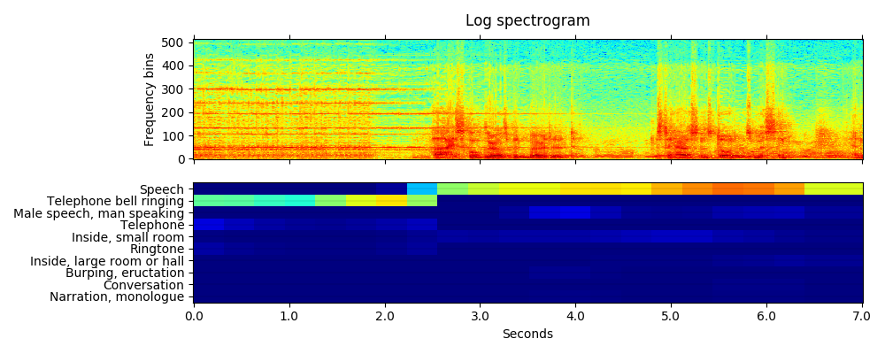
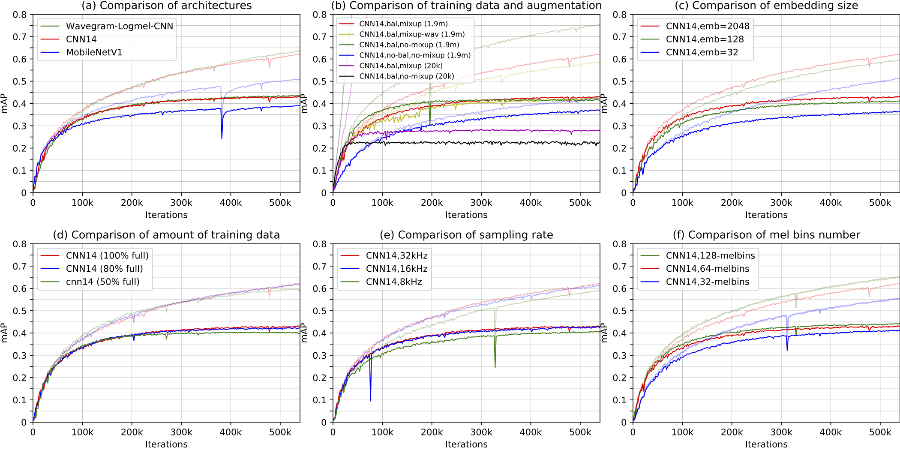
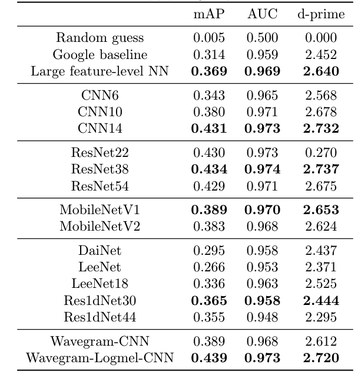

**Source:** *PANNs audio tagging and sound event detection documentation* — [original page](https://github.com/qiuqiangkong/audioset_tagging_cnn)

  [ qiuqiangkong ](https://github.com/qiuqiangkong) / **[audioset_tagging_cnn](https://github.com/qiuqiangkong/audioset_tagging_cnn) ** Public

  * [ 

 Notifications ](https://github.com/login?return_to=%2Fqiuqiangkong%2Faudioset_tagging_cnn) You must be signed in to change notification settings
  * [ 

 Fork 312 ](https://github.com/login?return_to=%2Fqiuqiangkong%2Faudioset_tagging_cnn)
  * [ 

  Star  1.8k ](https://github.com/login?return_to=%2Fqiuqiangkong%2Faudioset_tagging_cnn)

  * [ 

 Code ](https://github.com/qiuqiangkong/audioset_tagging_cnn)
  * [ 

 Issues 56 ](https://github.com/qiuqiangkong/audioset_tagging_cnn/issues)
  * [ 

 Pull requests 5 ](https://github.com/qiuqiangkong/audioset_tagging_cnn/pulls)
  * [ 

 Actions ](https://github.com/qiuqiangkong/audioset_tagging_cnn/actions)
  * [ 

 Projects ](https://github.com/qiuqiangkong/audioset_tagging_cnn/projects)
  * [ 

 Security and quality 0 ](https://github.com/qiuqiangkong/audioset_tagging_cnn/security)
  * [ 

 Insights ](https://github.com/qiuqiangkong/audioset_tagging_cnn/pulse)

 Additional navigation options

  * [ 

  Code  ](https://github.com/qiuqiangkong/audioset_tagging_cnn)
  * [ 

  Issues  ](https://github.com/qiuqiangkong/audioset_tagging_cnn/issues)
  * [ 

  Pull requests  ](https://github.com/qiuqiangkong/audioset_tagging_cnn/pulls)
  * [ 

  Actions  ](https://github.com/qiuqiangkong/audioset_tagging_cnn/actions)
  * [ 

  Projects  ](https://github.com/qiuqiangkong/audioset_tagging_cnn/projects)
  * [ 

  Security and quality  ](https://github.com/qiuqiangkong/audioset_tagging_cnn/security)
  * [ 

  Insights  ](https://github.com/qiuqiangkong/audioset_tagging_cnn/pulse)

 

master

 

[ 

 Branches](https://github.com/qiuqiangkong/audioset_tagging_cnn/branches)[ 

 Tags](https://github.com/qiuqiangkong/audioset_tagging_cnn/tags)

 

Go to file

 Code 

 

 Open more actions menu

## Latest commit

## History

[ 

 122 Commits](https://github.com/qiuqiangkong/audioset_tagging_cnn/commits/master/)

122 Commits

## Folders and files

<table class="Table-module__Box__HZKiQ DirectoryContent-module__OverviewTable__fe0iH" aria-labelledby="folders-and-files"><thead class="DirectoryContent-module__OverviewHeaderRow__hOrKy Table-module__Box_1__VacXC"><tr class="Table-module__Box_2__PBp9s"><th colspan="2" class="DirectoryContent-module__Box__iC_5e">Name</th><th colspan="1" class="DirectoryContent-module__Box_1__fuSBO">Name</th><th class="hide-sm">
Last commit message
</th><th colspan="1" class="DirectoryContent-module__Box_2__Ccrx7">
Last commit date
</th></tr></thead><tbody><tr class="react-directory-row undefined" id="folder-row-0"><td class="react-directory-row-name-cell-small-screen" colspan="2">

<a title="metadata" aria-label="metadata, (Directory)" class="Link--primary" href="https://github.com/qiuqiangkong/audioset_tagging_cnn/tree/master/metadata" data-discover="true">metadata</a>

</td><td class="react-directory-row-name-cell-large-screen" colspan="1">

<a title="metadata" aria-label="metadata, (Directory)" class="Link--primary" href="https://github.com/qiuqiangkong/audioset_tagging_cnn/tree/master/metadata" data-discover="true">metadata</a>

</td><td class="react-directory-row-commit-cell">
 
</td><td>

 

</td></tr><tr class="react-directory-row undefined" id="folder-row-1"><td class="react-directory-row-name-cell-small-screen" colspan="2">

<a title="pytorch" aria-label="pytorch, (Directory)" class="Link--primary" href="https://github.com/qiuqiangkong/audioset_tagging_cnn/tree/master/pytorch" data-discover="true">pytorch</a>

</td><td class="react-directory-row-name-cell-large-screen" colspan="1">

<a title="pytorch" aria-label="pytorch, (Directory)" class="Link--primary" href="https://github.com/qiuqiangkong/audioset_tagging_cnn/tree/master/pytorch" data-discover="true">pytorch</a>

</td><td class="react-directory-row-commit-cell">
 
</td><td>

 

</td></tr><tr class="react-directory-row undefined" id="folder-row-2"><td class="react-directory-row-name-cell-small-screen" colspan="2">

<a title="resources" aria-label="resources, (Directory)" class="Link--primary" href="https://github.com/qiuqiangkong/audioset_tagging_cnn/tree/master/resources" data-discover="true">resources</a>

</td><td class="react-directory-row-name-cell-large-screen" colspan="1">

<a title="resources" aria-label="resources, (Directory)" class="Link--primary" href="https://github.com/qiuqiangkong/audioset_tagging_cnn/tree/master/resources" data-discover="true">resources</a>

</td><td class="react-directory-row-commit-cell">
 
</td><td>

 

</td></tr><tr class="react-directory-row undefined" id="folder-row-3"><td class="react-directory-row-name-cell-small-screen" colspan="2">

<a title="scripts" aria-label="scripts, (Directory)" class="Link--primary" href="https://github.com/qiuqiangkong/audioset_tagging_cnn/tree/master/scripts" data-discover="true">scripts</a>

</td><td class="react-directory-row-name-cell-large-screen" colspan="1">

<a title="scripts" aria-label="scripts, (Directory)" class="Link--primary" href="https://github.com/qiuqiangkong/audioset_tagging_cnn/tree/master/scripts" data-discover="true">scripts</a>

</td><td class="react-directory-row-commit-cell">
 
</td><td>

 

</td></tr><tr class="react-directory-row undefined" id="folder-row-4"><td class="react-directory-row-name-cell-small-screen" colspan="2">

<a title="utils" aria-label="utils, (Directory)" class="Link--primary" href="https://github.com/qiuqiangkong/audioset_tagging_cnn/tree/master/utils" data-discover="true">utils</a>

</td><td class="react-directory-row-name-cell-large-screen" colspan="1">

<a title="utils" aria-label="utils, (Directory)" class="Link--primary" href="https://github.com/qiuqiangkong/audioset_tagging_cnn/tree/master/utils" data-discover="true">utils</a>

</td><td class="react-directory-row-commit-cell">
 
</td><td>

 

</td></tr><tr class="react-directory-row undefined" id="folder-row-5"><td class="react-directory-row-name-cell-small-screen" colspan="2">

<a title=".gitignore" aria-label=".gitignore, (File)" class="Link--primary" href="https://github.com/qiuqiangkong/audioset_tagging_cnn/blob/master/.gitignore" data-discover="true">.gitignore</a>

</td><td class="react-directory-row-name-cell-large-screen" colspan="1">

<a title=".gitignore" aria-label=".gitignore, (File)" class="Link--primary" href="https://github.com/qiuqiangkong/audioset_tagging_cnn/blob/master/.gitignore" data-discover="true">.gitignore</a>

</td><td class="react-directory-row-commit-cell">
 
</td><td>

 

</td></tr><tr class="react-directory-row undefined" id="folder-row-6"><td class="react-directory-row-name-cell-small-screen" colspan="2">

<a title="LICENSE.MIT" aria-label="LICENSE.MIT, (File)" class="Link--primary" href="https://github.com/qiuqiangkong/audioset_tagging_cnn/blob/master/LICENSE.MIT" data-discover="true">LICENSE.MIT</a>

</td><td class="react-directory-row-name-cell-large-screen" colspan="1">

<a title="LICENSE.MIT" aria-label="LICENSE.MIT, (File)" class="Link--primary" href="https://github.com/qiuqiangkong/audioset_tagging_cnn/blob/master/LICENSE.MIT" data-discover="true">LICENSE.MIT</a>

</td><td class="react-directory-row-commit-cell">
 
</td><td>

 

</td></tr><tr class="react-directory-row undefined" id="folder-row-7"><td class="react-directory-row-name-cell-small-screen" colspan="2">

<a title="README.md" aria-label="README.md, (File)" class="Link--primary" href="https://github.com/qiuqiangkong/audioset_tagging_cnn/blob/master/README.md" data-discover="true">README.md</a>

</td><td class="react-directory-row-name-cell-large-screen" colspan="1">

<a title="README.md" aria-label="README.md, (File)" class="Link--primary" href="https://github.com/qiuqiangkong/audioset_tagging_cnn/blob/master/README.md" data-discover="true">README.md</a>

</td><td class="react-directory-row-commit-cell">
 
</td><td>

 

</td></tr><tr class="react-directory-row undefined" id="folder-row-8"><td class="react-directory-row-name-cell-small-screen" colspan="2">

<a title="requirements.txt" aria-label="requirements.txt, (File)" class="Link--primary" href="https://github.com/qiuqiangkong/audioset_tagging_cnn/blob/master/requirements.txt" data-discover="true">requirements.txt</a>

</td><td class="react-directory-row-name-cell-large-screen" colspan="1">

<a title="requirements.txt" aria-label="requirements.txt, (File)" class="Link--primary" href="https://github.com/qiuqiangkong/audioset_tagging_cnn/blob/master/requirements.txt" data-discover="true">requirements.txt</a>

</td><td class="react-directory-row-commit-cell">
 
</td><td>

 

</td></tr><tr class="d-none DirectoryContent-module__Box_4__RhIsE" data-testid="view-all-files-row"><td colspan="3" class="DirectoryContent-module__Box_5__GaE8N">
<button class="prc-Link-Link-9ZwDx" data-component="Link">View all files</button>
</td></tr></tbody></table>

 

## Repository files navigation

  *   * [ 

 README](https://github.com/qiuqiangkong/audioset_tagging_cnn)
  * [ 

 MIT license](https://github.com/qiuqiangkong/audioset_tagging_cnn)

More items 

 

 

# PANNs: Large-Scale Pretrained Audio Neural Networks for Audio Pattern Recognition

This repo contains code for our paper: **PANNs: Large-Scale Pretrained Audio Neural Networks for Audio Pattern Recognition** [1]. A variety of CNNs are trained on the large-scale AudioSet dataset [2] containing 5000 hours audio with 527 sound classes. A mean average precision (mAP) of 0.439 is achieved using our proposed Wavegram-Logmel-CNN system, outperforming the Google baseline of 0.317 [3]. The PANNs have been used for audio tagging and sound event detection. The PANNs have been used to fine-tune several audio pattern recoginition tasks, and have outperformed several state-of-the-art systems.

## Environments

The codebase is developed with Python 3.7. Install requirements as follows:
    
    
    pip install -r requirements.txt
    

## Audio tagging using pretrained models

Users can inference the tags of an audio recording using pretrained models without training. Details can be viewed at [scripts/0_inference.sh](https://github.com/qiuqiangkong/audioset_tagging_cnn/blob/master/scripts/0_inference.sh) First, downloaded one pretrained model from <https://zenodo.org/record/3987831>, for example, the model named "Cnn14_mAP=0.431.pth". Then, execute the following commands to inference this [audio](https://github.com/qiuqiangkong/audioset_tagging_cnn/blob/master/resources/R9_ZSCveAHg_7s.wav):
    
    
    CHECKPOINT_PATH="Cnn14_mAP=0.431.pth"
    wget -O $CHECKPOINT_PATH https://zenodo.org/record/3987831/files/Cnn14_mAP%3D0.431.pth?download=1
    MODEL_TYPE="Cnn14"
    CUDA_VISIBLE_DEVICES=0 python3 pytorch/inference.py audio_tagging \
        --model_type=$MODEL_TYPE \
        --checkpoint_path=$CHECKPOINT_PATH \
        --audio_path="resources/R9_ZSCveAHg_7s.wav" \
        --cuda
    

Then the result will be printed on the screen looks like:
    
    
    Speech: 0.893
    Telephone bell ringing: 0.754
    Inside, small room: 0.235
    Telephone: 0.183
    Music: 0.092
    Ringtone: 0.047
    Inside, large room or hall: 0.028
    Alarm: 0.014
    Animal: 0.009
    Vehicle: 0.008
    embedding: (2048,)
    

If users would like to use 16 kHz model for inference, just do:
    
    
    CHECKPOINT_PATH="Cnn14_16k_mAP=0.438.pth"   # Trained by a later code version, achieves higher mAP than the paper.
    wget -O $CHECKPOINT_PATH https://zenodo.org/record/3987831/files/Cnn14_16k_mAP%3D0.438.pth?download=1
    MODEL_TYPE="Cnn14_16k"
    CUDA_VISIBLE_DEVICES=0 python3 pytorch/inference.py audio_tagging \
        --sample_rate=16000 \
        --window_size=512 \
        --hop_size=160 \
        --mel_bins=64 \
        --fmin=50 \
        --fmax=8000 \
        --model_type=$MODEL_TYPE \
        --checkpoint_path=$CHECKPOINT_PATH \
        --audio_path='resources/R9_ZSCveAHg_7s.wav' \
        --cuda
    

## Sound event detection using pretrained models

Some of PANNs such as DecisionLevelMax (the best), DecisionLevelAvg, DecisionLevelAtt) can be used for frame-wise sound event detection. For example, execute the following commands to inference sound event detection results on this [audio](https://github.com/qiuqiangkong/audioset_tagging_cnn/blob/master/resources/R9_ZSCveAHg_7s.wav):
    
    
    CHECKPOINT_PATH="Cnn14_DecisionLevelMax_mAP=0.385.pth"
    wget -O $CHECKPOINT_PATH https://zenodo.org/record/3987831/files/Cnn14_DecisionLevelMax_mAP%3D0.385.pth?download=1
    MODEL_TYPE="Cnn14_DecisionLevelMax"
    CUDA_VISIBLE_DEVICES=0 python3 pytorch/inference.py sound_event_detection \
        --model_type=$MODEL_TYPE \
        --checkpoint_path=$CHECKPOINT_PATH \
        --audio_path="resources/R9_ZSCveAHg_7s.wav" \
        --cuda
    

The visualization of sound event detection result looks like: 

Please see <https://www.youtube.com/watch?v=QyFNIhRxFrY> for a sound event detection demo.

For those users who only want to use the pretrained models for inference, we have prepared a **panns_inference** tool which can be easily installed by:
    
    
    pip install panns_inference
    

Please visit <https://github.com/qiuqiangkong/panns_inference> for details of panns_inference.

## Train PANNs from scratch

Users can train PANNs from scratch as follows.

## 1\. Download dataset

The [scripts/1_download_dataset.sh](https://github.com/qiuqiangkong/audioset_tagging_cnn/blob/master/scripts/1_download_dataset.sh) script is used for downloading all audio and metadata from the internet. The total size of AudioSet is around 1.1 TB. Notice there can be missing files on YouTube, so the numebr of files downloaded by users can be different from time to time. Our downloaded version contains 20550 / 22160 of the balaned training subset, 1913637 / 2041789 of the unbalanced training subset, and 18887 / 20371 of the evaluation subset.

For reproducibility, our downloaded dataset can be accessed at: link: <https://pan.baidu.com/s/13WnzI1XDSvqXZQTS-Kqujg>, password: 0vc2

The downloaded data looks like:
    
    
    dataset_root
    ├── audios
    │    ├── balanced_train_segments
    │    |    └── ... (~20550 wavs, the number can be different from time to time)
    │    ├── eval_segments
    │    |    └── ... (~18887 wavs)
    │    └── unbalanced_train_segments
    │         ├── unbalanced_train_segments_part00
    │         |    └── ... (~46940 wavs)
    │         ...
    │         └── unbalanced_train_segments_part40
    │              └── ... (~39137 wavs)
    └── metadata
         ├── balanced_train_segments.csv
         ├── class_labels_indices.csv
         ├── eval_segments.csv
         ├── qa_true_counts.csv
         └── unbalanced_train_segments.csv
    

## 2\. Pack waveforms into hdf5 files

The [scripts/2_pack_waveforms_to_hdf5s.sh](https://github.com/qiuqiangkong/audioset_tagging_cnn/blob/master/scripts/2_pack_waveforms_to_hdf5s.sh) script is used for packing all raw waveforms into 43 large hdf5 files for speed up training: one for balanced training subset, one for evaluation subset and 41 for unbalanced traning subset. The packed files looks like:
    
    
    workspace
    └── hdf5s
         ├── targets (2.3 GB)
         |    ├── balanced_train.h5
         |    ├── eval.h5
         |    └── unbalanced_train
         |        ├── unbalanced_train_part00.h5
         |        ...
         |        └── unbalanced_train_part40.h5
         └── waveforms (1.1 TB)
              ├── balanced_train.h5
              ├── eval.h5
              └── unbalanced_train
                  ├── unbalanced_train_part00.h5
                  ...
                  └── unbalanced_train_part40.h5
    

## 3\. Create training indexes

The [scripts/3_create_training_indexes.sh](https://github.com/qiuqiangkong/audioset_tagging_cnn/blob/master/scripts/3_create_training_indexes.sh) is used for creating training indexes. Those indexes are used for sampling mini-batches.

## 4\. Train

The [scripts/4_train.sh](https://github.com/qiuqiangkong/audioset_tagging_cnn/blob/master/scripts/4_train.sh) script contains training, saving checkpoints, and evaluation.
    
    
    WORKSPACE="your_workspace"
    CUDA_VISIBLE_DEVICES=0 python3 pytorch/main.py train \
      --workspace=$WORKSPACE \
      --data_type='full_train' \
      --window_size=1024 \
      --hop_size=320 \
      --mel_bins=64 \
      --fmin=50 \
      --fmax=14000 \
      --model_type='Cnn14' \
      --loss_type='clip_bce' \
      --balanced='balanced' \
      --augmentation='mixup' \
      --batch_size=32 \
      --learning_rate=1e-3 \
      --resume_iteration=0 \
      --early_stop=1000000 \
      --cuda
    

## Results

The CNN models are trained on a single card Tesla-V100-PCIE-32GB. (The training also works on a GPU card with 12 GB). The training takes around 3 - 7 days.
    
    
    Validate bal mAP: 0.005
    Validate test mAP: 0.005
        Dump statistics to /workspaces/pub_audioset_tagging_cnn_transfer/statistics/main/sample_rate=32000,window_size=1024,hop_size=320,mel_bins=64,fmin=50,fmax=14000/data_type=full_train/Cnn13/loss_type=clip_bce/balanced=balanced/augmentation=mixup/batch_size=32/statistics.pkl
        Dump statistics to /workspaces/pub_audioset_tagging_cnn_transfer/statistics/main/sample_rate=32000,window_size=1024,hop_size=320,mel_bins=64,fmin=50,fmax=14000/data_type=full_train/Cnn13/loss_type=clip_bce/balanced=balanced/augmentation=mixup/batch_size=32/statistics_2019-09-21_04-05-05.pickle
    iteration: 0, train time: 8.261 s, validate time: 219.705 s
    ------------------------------------
    ...
    ------------------------------------
    Validate bal mAP: 0.637
    Validate test mAP: 0.431
        Dump statistics to /workspaces/pub_audioset_tagging_cnn_transfer/statistics/main/sample_rate=32000,window_size=1024,hop_size=320,mel_bins=64,fmin=50,fmax=14000/data_type=full_train/Cnn13/loss_type=clip_bce/balanced=balanced/augmentation=mixup/batch_size=32/statistics.pkl
        Dump statistics to /workspaces/pub_audioset_tagging_cnn_transfer/statistics/main/sample_rate=32000,window_size=1024,hop_size=320,mel_bins=64,fmin=50,fmax=14000/data_type=full_train/Cnn13/loss_type=clip_bce/balanced=balanced/augmentation=mixup/batch_size=32/statistics_2019-09-21_04-05-05.pickle
    iteration: 600000, train time: 3253.091 s, validate time: 1110.805 s
    ------------------------------------
    Model saved to /workspaces/pub_audioset_tagging_cnn_transfer/checkpoints/main/sample_rate=32000,window_size=1024,hop_size=320,mel_bins=64,fmin=50,fmax=14000/data_type=full_train/Cnn13/loss_type=clip_bce/balanced=balanced/augmentation=mixup/batch_size=32/600000_iterations.pth
    ...
    

An **mean average precision (mAP)** of **0.431** is obtained. The training curve looks like:

Results of PANNs on AudioSet tagging. Dash and solid lines are training mAP and evaluation mAP, respectively. The six plots show the results with different: (a) architectures; (b) data balancing and data augmentation; (c) embedding size; (d) amount of training data; (e) sampling rate; (f) number of mel bins.

## Performance of differernt systems

Top rows show the previously proposed methods using embedding features provided by Google. Previous best system achieved an mAP of 0.369 using large feature-attention neural networks. We propose to train neural networks directly from audio recordings. Our CNN14 achieves an mAP of 0.431, and Wavegram-Logmel-CNN achieves an mAP of 0.439.

## Plot figures of [1]

To reproduce all figures of [1], just do:
    
    
    wget -O paper_statistics.zip https://zenodo.org/record/3987831/files/paper_statistics.zip?download=1
    unzip paper_statistics.zip
    python3 utils/plot_for_paper.py plot_classwise_iteration_map
    python3 utils/plot_for_paper.py plot_six_figures
    python3 utils/plot_for_paper.py plot_complexity_map
    python3 utils/plot_for_paper.py plot_long_fig
    

## Fine-tune on new tasks

After downloading the pretrained models. Build fine-tuned systems for new tasks is simple!
    
    
    MODEL_TYPE="Transfer_Cnn14"
    CHECKPOINT_PATH="Cnn14_mAP=0.431.pth"
    CUDA_VISIBLE_DEVICES=0 python3 pytorch/finetune_template.py train \
        --sample_rate=32000 \
        --window_size=1024 \
        --hop_size=320 \
        --mel_bins=64 \
        --fmin=50 \
        --fmax=14000 \
        --model_type=$MODEL_TYPE \
        --pretrained_checkpoint_path=$CHECKPOINT_PATH \
        --cuda
    

Here is an example of fine-tuning PANNs to GTZAN music classification: <https://github.com/qiuqiangkong/panns_transfer_to_gtzan>

## Demos

We apply the audio tagging system to build a sound event detection (SED) system. The SED prediction is obtained by applying the audio tagging system on consecutive 2-second segments. The video of demo can be viewed at:   
<https://www.youtube.com/watch?v=7TEtDMzdLeY>

## FAQs

If users came across out of memory error, then try to reduce the batch size.

## Cite

[1] Qiuqiang Kong, Yin Cao, Turab Iqbal, Yuxuan Wang, Wenwu Wang, and Mark D. Plumbley. "Panns: Large-scale pretrained audio neural networks for audio pattern recognition." IEEE/ACM Transactions on Audio, Speech, and Language Processing 28 (2020): 2880-2894.

## Reference

[2] Gemmeke, J.F., Ellis, D.P., Freedman, D., Jansen, A., Lawrence, W., Moore, R.C., Plakal, M. and Ritter, M., 2017, March. Audio set: An ontology and human-labeled dataset for audio events. In IEEE International Conference on Acoustics, Speech and Signal Processing (ICASSP), pp. 776-780, 2017

[3] Hershey, S., Chaudhuri, S., Ellis, D.P., Gemmeke, J.F., Jansen, A., Moore, R.C., Plakal, M., Platt, D., Saurous, R.A., Seybold, B. and Slaney, M., 2017, March. CNN architectures for large-scale audio classification. In 2017 IEEE International Conference on Acoustics, Speech and Signal Processing (ICASSP), pp. 131-135, 2017

## External links

Other work on music transfer learning includes:   
<https://github.com/jordipons/sklearn-audio-transfer-learning>   
<https://github.com/keunwoochoi/transfer_learning_music>

## About

No description, website, or topics provided.

### Resources

[ 

 Readme](https://github.com/qiuqiangkong/audioset_tagging_cnn#readme-ov-file)

[ 

 MIT license](https://github.com/qiuqiangkong/audioset_tagging_cnn#MIT-1-ov-file)

[ 

 Activity](https://github.com/qiuqiangkong/audioset_tagging_cnn/activity)

### Stars

 **1.8k** stars

### Watchers

 **12** watching

### Forks

[ 

 **312** forks](https://github.com/qiuqiangkong/audioset_tagging_cnn/forks)

[Report repository](https://github.com/contact/report-content?content_url=https%3A%2F%2Fgithub.com%2Fqiuqiangkong%2Faudioset_tagging_cnn&report=qiuqiangkong+%28user%29)

## Releases

## Packages

## Used by

## Contributors

## Languages
