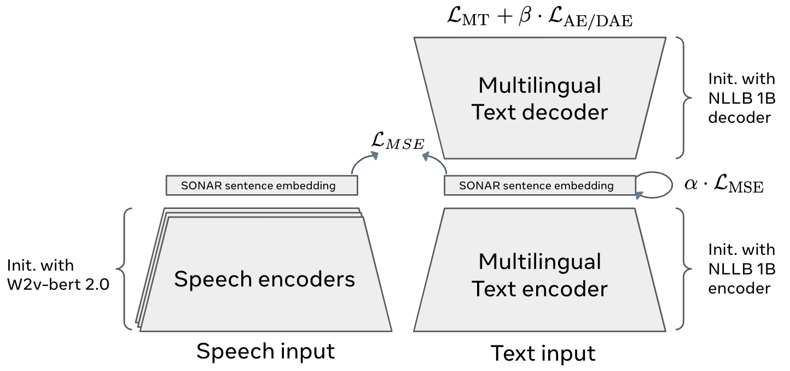
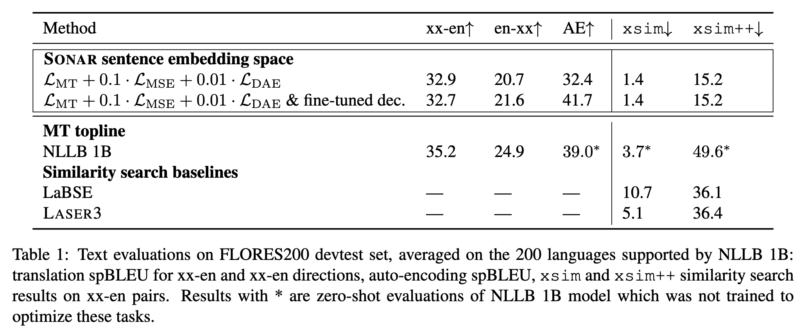
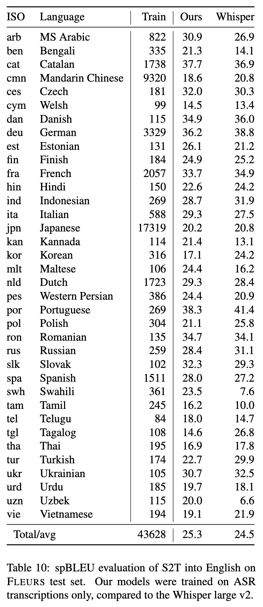

**Source:** *SONAR release documentation* — [original page](https://github.com/facebookresearch/SONAR)

  [ facebookresearch ](https://github.com/facebookresearch) / **[SONAR](https://github.com/facebookresearch/SONAR) ** Public

  * [ 

 Notifications ](https://github.com/login?return_to=%2Ffacebookresearch%2FSONAR) You must be signed in to change notification settings
  * [ 

 Fork 103 ](https://github.com/login?return_to=%2Ffacebookresearch%2FSONAR)
  * [ 

  Star  911 ](https://github.com/login?return_to=%2Ffacebookresearch%2FSONAR)

  * [ 

 Code ](https://github.com/facebookresearch/SONAR)
  * [ 

 Issues 13 ](https://github.com/facebookresearch/SONAR/issues)
  * [ 

 Pull requests 3 ](https://github.com/facebookresearch/SONAR/pulls)
  * [ 

 Actions ](https://github.com/facebookresearch/SONAR/actions)
  * [ 

 Projects ](https://github.com/facebookresearch/SONAR/projects)
  * [ 

 Security and quality 0 ](https://github.com/facebookresearch/SONAR/security)
  * [ 

 Insights ](https://github.com/facebookresearch/SONAR/pulse)

 Additional navigation options

  * [ 

  Code  ](https://github.com/facebookresearch/SONAR)
  * [ 

  Issues  ](https://github.com/facebookresearch/SONAR/issues)
  * [ 

  Pull requests  ](https://github.com/facebookresearch/SONAR/pulls)
  * [ 

  Actions  ](https://github.com/facebookresearch/SONAR/actions)
  * [ 

  Projects  ](https://github.com/facebookresearch/SONAR/projects)
  * [ 

  Security and quality  ](https://github.com/facebookresearch/SONAR/security)
  * [ 

  Insights  ](https://github.com/facebookresearch/SONAR/pulse)

 

main

 

[ 

 Branches](https://github.com/facebookresearch/SONAR/branches)[ 

 Tags](https://github.com/facebookresearch/SONAR/tags)

 

Go to file

 Code 

 

 Open more actions menu

## Latest commit

## History

[ 

 33 Commits](https://github.com/facebookresearch/SONAR/commits/main/)

33 Commits

## Folders and files

<table class="Table-module__Box__HZKiQ DirectoryContent-module__OverviewTable__fe0iH" aria-labelledby="folders-and-files"><thead class="DirectoryContent-module__OverviewHeaderRow__hOrKy Table-module__Box_1__VacXC"><tr class="Table-module__Box_2__PBp9s"><th colspan="2" class="DirectoryContent-module__Box__iC_5e">Name</th><th colspan="1" class="DirectoryContent-module__Box_1__fuSBO">Name</th><th class="hide-sm">
Last commit message
</th><th colspan="1" class="DirectoryContent-module__Box_2__Ccrx7">
Last commit date
</th></tr></thead><tbody><tr class="react-directory-row undefined" id="folder-row-0"><td class="react-directory-row-name-cell-small-screen" colspan="2">

<a title=".github" aria-label=".github, (Directory)" class="Link--primary" href="https://github.com/facebookresearch/SONAR/tree/main/.github" data-discover="true">.github</a>

</td><td class="react-directory-row-name-cell-large-screen" colspan="1">

<a title=".github" aria-label=".github, (Directory)" class="Link--primary" href="https://github.com/facebookresearch/SONAR/tree/main/.github" data-discover="true">.github</a>

</td><td class="react-directory-row-commit-cell">
 
</td><td>

 

</td></tr><tr class="react-directory-row undefined" id="folder-row-1"><td class="react-directory-row-name-cell-small-screen" colspan="2">

<a title="examples" aria-label="examples, (Directory)" class="Link--primary" href="https://github.com/facebookresearch/SONAR/tree/main/examples" data-discover="true">examples</a>

</td><td class="react-directory-row-name-cell-large-screen" colspan="1">

<a title="examples" aria-label="examples, (Directory)" class="Link--primary" href="https://github.com/facebookresearch/SONAR/tree/main/examples" data-discover="true">examples</a>

</td><td class="react-directory-row-commit-cell">
 
</td><td>

 

</td></tr><tr class="react-directory-row undefined" id="folder-row-2"><td class="react-directory-row-name-cell-small-screen" colspan="2">

<a title="huggingface_pipelines" aria-label="huggingface_pipelines, (Directory)" class="Link--primary" href="https://github.com/facebookresearch/SONAR/tree/main/huggingface_pipelines" data-discover="true">huggingface_pipelines</a>

</td><td class="react-directory-row-name-cell-large-screen" colspan="1">

<a title="huggingface_pipelines" aria-label="huggingface_pipelines, (Directory)" class="Link--primary" href="https://github.com/facebookresearch/SONAR/tree/main/huggingface_pipelines" data-discover="true">huggingface_pipelines</a>

</td><td class="react-directory-row-commit-cell">
 
</td><td>

 

</td></tr><tr class="react-directory-row undefined" id="folder-row-3"><td class="react-directory-row-name-cell-small-screen" colspan="2">

<a title="materials" aria-label="materials, (Directory)" class="Link--primary" href="https://github.com/facebookresearch/SONAR/tree/main/materials" data-discover="true">materials</a>

</td><td class="react-directory-row-name-cell-large-screen" colspan="1">

<a title="materials" aria-label="materials, (Directory)" class="Link--primary" href="https://github.com/facebookresearch/SONAR/tree/main/materials" data-discover="true">materials</a>

</td><td class="react-directory-row-commit-cell">
 
</td><td>

 

</td></tr><tr class="react-directory-row undefined" id="folder-row-4"><td class="react-directory-row-name-cell-small-screen" colspan="2">

<a title="sonar" aria-label="sonar, (Directory)" class="Link--primary" href="https://github.com/facebookresearch/SONAR/tree/main/sonar" data-discover="true">sonar</a>

</td><td class="react-directory-row-name-cell-large-screen" colspan="1">

<a title="sonar" aria-label="sonar, (Directory)" class="Link--primary" href="https://github.com/facebookresearch/SONAR/tree/main/sonar" data-discover="true">sonar</a>

</td><td class="react-directory-row-commit-cell">
 
</td><td>

 

</td></tr><tr class="react-directory-row undefined" id="folder-row-5"><td class="react-directory-row-name-cell-small-screen" colspan="2">

<a title="tests" aria-label="tests, (Directory)" class="Link--primary" href="https://github.com/facebookresearch/SONAR/tree/main/tests" data-discover="true">tests</a>

</td><td class="react-directory-row-name-cell-large-screen" colspan="1">

<a title="tests" aria-label="tests, (Directory)" class="Link--primary" href="https://github.com/facebookresearch/SONAR/tree/main/tests" data-discover="true">tests</a>

</td><td class="react-directory-row-commit-cell">
 
</td><td>

 

</td></tr><tr class="react-directory-row undefined" id="folder-row-6"><td class="react-directory-row-name-cell-small-screen" colspan="2">

<a title=".gitignore" aria-label=".gitignore, (File)" class="Link--primary" href="https://github.com/facebookresearch/SONAR/blob/main/.gitignore" data-discover="true">.gitignore</a>

</td><td class="react-directory-row-name-cell-large-screen" colspan="1">

<a title=".gitignore" aria-label=".gitignore, (File)" class="Link--primary" href="https://github.com/facebookresearch/SONAR/blob/main/.gitignore" data-discover="true">.gitignore</a>

</td><td class="react-directory-row-commit-cell">
 
</td><td>

 

</td></tr><tr class="react-directory-row undefined" id="folder-row-7"><td class="react-directory-row-name-cell-small-screen" colspan="2">

<a title=".pre-commit-config.yaml" aria-label=".pre-commit-config.yaml, (File)" class="Link--primary" href="https://github.com/facebookresearch/SONAR/blob/main/.pre-commit-config.yaml" data-discover="true">.pre-commit-config.yaml</a>

</td><td class="react-directory-row-name-cell-large-screen" colspan="1">

<a title=".pre-commit-config.yaml" aria-label=".pre-commit-config.yaml, (File)" class="Link--primary" href="https://github.com/facebookresearch/SONAR/blob/main/.pre-commit-config.yaml" data-discover="true">.pre-commit-config.yaml</a>

</td><td class="react-directory-row-commit-cell">
 
</td><td>

 

</td></tr><tr class="react-directory-row undefined" id="folder-row-8"><td class="react-directory-row-name-cell-small-screen" colspan="2">

<a title="CODE_LICENSE.md" aria-label="CODE_LICENSE.md, (File)" class="Link--primary" href="https://github.com/facebookresearch/SONAR/blob/main/CODE_LICENSE.md" data-discover="true">CODE_LICENSE.md</a>

</td><td class="react-directory-row-name-cell-large-screen" colspan="1">

<a title="CODE_LICENSE.md" aria-label="CODE_LICENSE.md, (File)" class="Link--primary" href="https://github.com/facebookresearch/SONAR/blob/main/CODE_LICENSE.md" data-discover="true">CODE_LICENSE.md</a>

</td><td class="react-directory-row-commit-cell">
 
</td><td>

 

</td></tr><tr class="react-directory-row undefined" id="folder-row-9"><td class="react-directory-row-name-cell-small-screen" colspan="2">

<a title="CODE_OF_CONDUCT.md" aria-label="CODE_OF_CONDUCT.md, (File)" class="Link--primary" href="https://github.com/facebookresearch/SONAR/blob/main/CODE_OF_CONDUCT.md" data-discover="true">CODE_OF_CONDUCT.md</a>

</td><td class="react-directory-row-name-cell-large-screen" colspan="1">

<a title="CODE_OF_CONDUCT.md" aria-label="CODE_OF_CONDUCT.md, (File)" class="Link--primary" href="https://github.com/facebookresearch/SONAR/blob/main/CODE_OF_CONDUCT.md" data-discover="true">CODE_OF_CONDUCT.md</a>

</td><td class="react-directory-row-commit-cell">
 
</td><td>

 

</td></tr><tr class="react-directory-row truncate-for-mobile" id="folder-row-10"><td class="react-directory-row-name-cell-small-screen" colspan="2">

<a title="CONTRIBUTING.md" aria-label="CONTRIBUTING.md, (File)" class="Link--primary" href="https://github.com/facebookresearch/SONAR/blob/main/CONTRIBUTING.md" data-discover="true">CONTRIBUTING.md</a>

</td><td class="react-directory-row-name-cell-large-screen" colspan="1">

<a title="CONTRIBUTING.md" aria-label="CONTRIBUTING.md, (File)" class="Link--primary" href="https://github.com/facebookresearch/SONAR/blob/main/CONTRIBUTING.md" data-discover="true">CONTRIBUTING.md</a>

</td><td class="react-directory-row-commit-cell">
 
</td><td>

 

</td></tr><tr class="react-directory-row truncate-for-mobile" id="folder-row-11"><td class="react-directory-row-name-cell-small-screen" colspan="2">

<a title="LICENSE.md" aria-label="LICENSE.md, (File)" class="Link--primary" href="https://github.com/facebookresearch/SONAR/blob/main/LICENSE.md" data-discover="true">LICENSE.md</a>

</td><td class="react-directory-row-name-cell-large-screen" colspan="1">

<a title="LICENSE.md" aria-label="LICENSE.md, (File)" class="Link--primary" href="https://github.com/facebookresearch/SONAR/blob/main/LICENSE.md" data-discover="true">LICENSE.md</a>

</td><td class="react-directory-row-commit-cell">
 
</td><td>

 

</td></tr><tr class="react-directory-row truncate-for-mobile" id="folder-row-12"><td class="react-directory-row-name-cell-small-screen" colspan="2">

<a title="NC_MODEL_LICENSE.md" aria-label="NC_MODEL_LICENSE.md, (File)" class="Link--primary" href="https://github.com/facebookresearch/SONAR/blob/main/NC_MODEL_LICENSE.md" data-discover="true">NC_MODEL_LICENSE.md</a>

</td><td class="react-directory-row-name-cell-large-screen" colspan="1">

<a title="NC_MODEL_LICENSE.md" aria-label="NC_MODEL_LICENSE.md, (File)" class="Link--primary" href="https://github.com/facebookresearch/SONAR/blob/main/NC_MODEL_LICENSE.md" data-discover="true">NC_MODEL_LICENSE.md</a>

</td><td class="react-directory-row-commit-cell">
 
</td><td>

 

</td></tr><tr class="react-directory-row truncate-for-mobile" id="folder-row-13"><td class="react-directory-row-name-cell-small-screen" colspan="2">

<a title="README.md" aria-label="README.md, (File)" class="Link--primary" href="https://github.com/facebookresearch/SONAR/blob/main/README.md" data-discover="true">README.md</a>

</td><td class="react-directory-row-name-cell-large-screen" colspan="1">

<a title="README.md" aria-label="README.md, (File)" class="Link--primary" href="https://github.com/facebookresearch/SONAR/blob/main/README.md" data-discover="true">README.md</a>

</td><td class="react-directory-row-commit-cell">
 
</td><td>

 

</td></tr><tr class="react-directory-row truncate-for-mobile" id="folder-row-14"><td class="react-directory-row-name-cell-small-screen" colspan="2">

<a title="pyproject.toml" aria-label="pyproject.toml, (File)" class="Link--primary" href="https://github.com/facebookresearch/SONAR/blob/main/pyproject.toml" data-discover="true">pyproject.toml</a>

</td><td class="react-directory-row-name-cell-large-screen" colspan="1">

<a title="pyproject.toml" aria-label="pyproject.toml, (File)" class="Link--primary" href="https://github.com/facebookresearch/SONAR/blob/main/pyproject.toml" data-discover="true">pyproject.toml</a>

</td><td class="react-directory-row-commit-cell">
 
</td><td>

 

</td></tr><tr class="show-for-mobile DirectoryContent-module__Box_4__RhIsE" data-testid="view-all-files-row"><td colspan="3" class="DirectoryContent-module__Box_5__GaE8N">
<button class="prc-Link-Link-9ZwDx" data-component="Link">View all files</button>
</td></tr></tbody></table>

 

## Repository files navigation

  *   * [ 

 README](https://github.com/facebookresearch/SONAR)
  * [ 

 Code of conduct](https://github.com/facebookresearch/SONAR)
  * [ 

 Contributing](https://github.com/facebookresearch/SONAR)
  * [ 

 License](https://github.com/facebookresearch/SONAR)
  * [ 

 MIT license](https://github.com/facebookresearch/SONAR)
  * [ 

 Security](https://github.com/facebookresearch/SONAR)

More items 

 

 

# SONAR

[[Paper]](https://ai.meta.com/research/publications/sonar-sentence-level-multimodal-and-language-agnostic-representations/) [[Demo]](https://github.com/facebookresearch/SONAR#usage)

We introduce SONAR, a new multilingual and multimodal fixed-size sentence embedding space, with a full suite of speech and text encoders and decoders. It substantially outperforms existing sentence embeddings such as LASER3 and LabSE on the xsim and xsim++ multilingual similarity search tasks.

Speech segments can be embedded in the same SONAR embedding space using language-specific speech encoders trained in a teacher-student setting on speech transcription data. We also provide a single text decoder, which allows us to perform text-to-text and speech-to-text machine translation, including for zero-shot language and modality combinations.

_SONAR_ stands for **S** entence-level multim**O** dal and la**N** guage-**A** gnostic **R** epresentations

The full list of supported languages (along with download links) can be found here [below](https://github.com/facebookresearch/SONAR#supported-languages-and-download-links).

## SONAR Architecture:

  

## Text results

  

## Speech results

  

## Installing

You can install SONAR with `pip install sonar-space`. Note that there is another `sonar` package on pip that IS NOT this project, make sure to use `sonar-space` in your dependencies.

Note that SONAR depends on [Fairseq2](https://github.com/facebookresearch/fairseq2), which should precisely match the versions of `pytorch` and `CUDA` (here are the [possible variants](https://github.com/facebookresearch/fairseq2?tab=readme-ov-file#variants)). You can check with `pip show torch` which version of pytorch you gave. For example, if it equals `2.6.0+cu124`, you should install `fairseq2` with from the following source:
    
    
    pip install fairseq2 --extra-index-url https://fair.pkg.atmeta.com/fairseq2/whl/pt2.6.0/cu124

If [fairseq2](https://github.com/facebookresearch/fairseq2) does not provide a build for your machine, check the readme of that project to build it locally.

We recommend installing SONAR only after you have a correct version of `fairseq2` installed. Note that SONAR currently relies on the stable version of `fairseq2>=0.5.2` (with minor variations possible).

If you want to install SONAR manually, you can install it localy:
    
    
    pip install --upgrade pip
    pip install -e .

### Versions

Unfortunately, SONAR code is very much tied to fairseq2 code, and thus only specific version are compatible with each other:

  * `sonar-space~=0.5.0` (the current version) requires `fairseq2>=0.5.2`
  * `sonar-space~=0.4.0` required `fairseq2~=0.4.0`
  * `sonar-space~=0.2.0` required `fairseq2~=0.2.0`

In the future, when the `fairseq2` interface stabilizes, we hope to keep the version dependencies less loosely coupled.

## Usage

fairseq2 will automatically download models into your `$TORCH_HOME/hub` directory upon using the commands below.

### Compute text sentence embeddings with SONAR:

    
    
    from sonar.inference_pipelines.text import TextToEmbeddingModelPipeline
    t2vec_model = TextToEmbeddingModelPipeline(encoder="text_sonar_basic_encoder",
                                               tokenizer="text_sonar_basic_encoder")
    sentences = ['My name is SONAR.', 'I can embed the sentences into vectorial space.']
    embeddings = t2vec_model.predict(sentences, source_lang="eng_Latn")
    print(embeddings.shape)
    # torch.Size([2, 1024])

Note that by default, all SONAR models are loaded to a CPU device, which is relatively slow. If you want to use a GPU instead, you should provide the `device` argument when initializing the model (this applies to every model). Similarly, you can pass a `dtype` argument. For example:
    
    
    import torch
    from sonar.inference_pipelines.text import TextToEmbeddingModelPipeline
    
    embedder = TextToEmbeddingModelPipeline(
      encoder="text_sonar_basic_encoder", 
      tokenizer="text_sonar_basic_encoder", 
      device=torch.device("cuda"),
      dtype=torch.float16,
    )

### Reconstruct text from SONAR embeddings

    
    
    from sonar.inference_pipelines.text import EmbeddingToTextModelPipeline
    vec2text_model = EmbeddingToTextModelPipeline(decoder="text_sonar_basic_decoder",
                                                  tokenizer="text_sonar_basic_encoder")
    reconstructed = vec2text_model.predict(embeddings, target_lang="eng_Latn", max_seq_len=512)
    # max_seq_len is a keyword argument passed to the fairseq2 BeamSearchSeq2SeqGenerator.
    print(reconstructed)
    # ['My name is SONAR.', 'I can embed the sentences into vector space.']

By default, text generation in SONAR is based on beam search ([BeamSearchSeq2SeqGenerator](https://github.com/facebookresearch/fairseq2/blob/v0.4.5/src/fairseq2/generation/_beam_search/_generator.py#L45) from fairseq2) with the default setting of `beam_size=5`. If one passes a `sampler` argument, we will use a [SamplingSeq2SeqGenerator](https://github.com/facebookresearch/fairseq2/blob/v0.4.5/src/fairseq2/generation/_sampling/_generator.py#L200) instead. All additional arguments are passed to the generator constructor. For example:
    
    
    from fairseq2.generation import TopPSampler, TopKSampler
    embeddings = t2vec_model.predict(["Bonjour le monde!"] * 10, source_lang="fra_Latn")
    vec2text_model.predict(embeddings, target_lang="eng_Latn", sampler=TopPSampler(0.99), max_seq_len=128)
    # ['Hello, the world!',
    #  'Hey, everybody!',
    #  'Good day to you, world!',
    #  'Hello, the world!',
    #  'Hello, people.',
    #  'Hello, everybody, around the world.',
    #  'Hello, world. How are you?',
    #  "Hey, what's up?",
    #  'Good afternoon, everyone.',
    #  'Hello to the world!']
    # the outputs are now random, so they will be different every time

Note that the `sampler` argument was a singal to use a `SamplingSeq2SeqGenerator` instead of a `BeamSearchSeq2SeqGenerator`, and the `max_seq_len` argument was passed to the `SamplingSeq2SeqGenerator` constructor.

### Translate text with SONAR

    
    
    from sonar.inference_pipelines.text import TextToTextModelPipeline
    t2t_model = TextToTextModelPipeline(encoder="text_sonar_basic_encoder",
                                        decoder="text_sonar_basic_decoder",
                                        tokenizer="text_sonar_basic_encoder")  # tokenizer is attached to both encoder and decoder cards
    
    sentences = ['My name is SONAR.', 'I can embed the sentences into vectorial space.']
    t2t_model.predict(sentences, source_lang="eng_Latn", target_lang="fra_Latn")
    # ['Mon nom est SONAR.', "Je peux intégrer les phrases dans l'espace vectoriel."]

### Compute speech sentence embeddings with SONAR

    
    
    from sonar.inference_pipelines.speech import SpeechToEmbeddingModelPipeline
    s2vec_model = SpeechToEmbeddingModelPipeline(encoder="sonar_speech_encoder_eng")
    
    s2vec_model.predict(["./tests/integration_tests/data/audio_files/audio_1.wav",
                         "./tests/integration_tests/data/audio_files/audio_2.wav"]).shape
    # torch.Size([2, 1024])
    import torchaudio
    inp, sr = torchaudio.load("./tests/integration_tests/data/audio_files/audio_1.wav")
    assert sr == 16000, "Sample rate should be 16kHz"
    
    s2vec_model.predict([inp]).shape
    # torch.Size([1, 1024])

### Speech-to-text translation with SONAR

    
    
    from sonar.inference_pipelines.speech import SpeechToTextModelPipeline
    
    s2t_model = SpeechToTextModelPipeline(encoder="sonar_speech_encoder_eng",
                                          decoder="text_sonar_basic_decoder",
                                          tokenizer="text_sonar_basic_decoder")
    
    import torchaudio
    inp, sr = torchaudio.load("./tests/integration_tests/data/audio_files/audio_1.wav")
    assert sr == 16000, "Sample rate should be 16kHz"
    
    # passing loaded audio files
    s2t_model.predict([inp], target_lang="eng_Latn")
    # ['Television reports show white smoke coming from the plant.']
    
    # passing multiple wav files
    s2t_model.predict(["./tests/integration_tests/data/audio_files/audio_1.wav",
                       "./tests/integration_tests/data/audio_files/audio_2.wav"], target_lang="eng_Latn")
    # ['Television reports show white smoke coming from the plant.',
    # 'These couples may choose to make an adoption plan for their baby.']

### Predicting sentence similarity with BLASER 2.0 models

BLASER 2.0 is a family of models for automatic evaluation of machine translation quality based on SONAR embeddings. They predict [cross-lingual semantic similarity](https://github.com/facebookresearch/fairseq/tree/nllb/examples/nllb/human_XSTS_eval) between the translation and the source (optionally, also using a reference translation).
    
    
    from sonar.inference_pipelines.text import TextToEmbeddingModelPipeline
    from sonar.models.blaser.loader import load_blaser_model
    
    blaser_ref = load_blaser_model("blaser_2_0_ref").eval()
    blaser_qe = load_blaser_model("blaser_2_0_qe").eval()
    text_embedder = TextToEmbeddingModelPipeline(encoder="text_sonar_basic_encoder", tokenizer="text_sonar_basic_encoder")
    
    src_embs = text_embedder.predict(["Le chat s'assit sur le tapis."], source_lang="fra_Latn")
    ref_embs = text_embedder.predict(["The cat sat on the mat."], source_lang="eng_Latn")
    mt_embs = text_embedder.predict(["The cat sat down on the carpet."], source_lang="eng_Latn")
    
    with torch.inference_mode():
        print(blaser_ref(src=src_embs, ref=ref_embs, mt=mt_embs).item())  # 4.688
        print(blaser_qe(src=src_embs, mt=mt_embs).item())  # 4.708

Detailed model cards with more examples: [facebook/blaser-2.0-ref](https://huggingface.co/facebook/blaser-2.0-ref), [facebook/blaser-2.0-qe](https://huggingface.co/facebook/blaser-2.0-qe).

### Classifying the toxicity of sentences with MuTox

[MuTox](https://github.com/facebookresearch/seamless_communication/tree/main/src/seamless_communication/cli/toxicity/mutox), the first highly multilingual audio-based classifier (binary) and dataset with toxicity labels. The dataset consists of 20k audio utterances for English and Spanish, and 4k for the other 19 languages, and uses the multi-model and multilingual encoders from SONAR. The output of the MuTox classifier is a logit of the evaluated being _"toxic"_ , according to the definition adopted in the corresponding dataset.
    
    
    from sonar.models.mutox.loader import load_mutox_model
    from sonar.inference_pipelines.text import TextToEmbeddingModelPipeline
    import torch
    
    if torch.cuda.is_available():
        device = torch.device("cuda:0")
        dtype = torch.float16
    else:
        device = torch.device("cpu")
        dtype = torch.float32
    
    t2vec_model = TextToEmbeddingModelPipeline(
        encoder="text_sonar_basic_encoder",
        tokenizer="text_sonar_basic_encoder",
        device=device,
    )
    text_column='lang_txt'
    classifier = load_mutox_model(
        "sonar_mutox",
        device=device,
        dtype=dtype,
    ).eval()
    
    with torch.inference_mode():
        emb = t2vec_model.predict(["De peur que le pays ne se prostitue et ne se remplisse de crimes."], source_lang='fra_Latn')
        x = classifier(emb.to(device).to(dtype)) 
        print(x) # tensor([[-19.7812]], device='cuda:0', dtype=torch.float16)
    
    with torch.inference_mode():
        emb = t2vec_model.predict(["She worked hard and made a significant contribution to the team."], source_lang='eng_Latn')
        x = classifier(emb.to(device).to(dtype))
        print(x) # tensor([[-53.5938]], device='cuda:0', dtype=torch.float16)
    
    with torch.inference_mode():
        emb = t2vec_model.predict(["El no tiene ni el más mínimo talento, todo lo que ha logrado ha sido gracias a sobornos y manipulaciones."], source_lang='spa_Latn')
        x = classifier(emb.to(device).to(dtype))
        print(x) # tensor([[-21.4062]], device='cuda:0', dtype=torch.float16)

For a CLI way of running the MuTox pipeline, go to [Seamless Communication/.../MuTox](https://github.com/facebookresearch/seamless_communication/tree/main/src/seamless_communication/cli/toxicity/mutox).

### Demo notebooks

See more complete demo notebooks :

  * [sonar text2text similarity and translation](https://github.com/facebookresearch/SONAR/blob/main/examples/sonar_text_demo.ipynb)
  * [sonar speech2text and other data pipeline examples](https://github.com/facebookresearch/SONAR/blob/main/examples/inference_pipelines.ipynb)
  * [sonar bilingual document alignment with sonar text similarity](https://github.com/facebookresearch/SONAR/blob/main/examples/bilingual_document.ipynb)

### Troubleshooting

  * In case of errors like `fairseq2.assets.card.AssetCardError: Model checkpoint of the blaser_2_0_qe asset card cannot be loaded`, try removing the fairseq2 assets cache (located in `~/.cache/fairseq2`); it might be that some of the downloaded model checkpoints are invalid.

## Supported languages and download links

The SONAR text encoder & decoder supports 200 languages. SONAR speech encoders support 37 languages.

Available text encoders/decoders 

model | link  
---|---  
encoder | [download](https://dl.fbaipublicfiles.com/SONAR/sonar_text_encoder.pt)  
decoder | [download](https://dl.fbaipublicfiles.com/SONAR/sonar_text_decoder.pt)  
finetuned decoder | [download](https://dl.fbaipublicfiles.com/SONAR/finetuned_decoder.pt)  
tokenizer | [download](https://dl.fbaipublicfiles.com/SONAR/sentencepiece.source.256000.model)

 

The languages supported by SONAR text encoders/decoders are all the 202 languages from the NLLB-200 models. They comprise all 204 [FLORES-200 languages](https://github.com/facebookresearch/flores/tree/main/flores200), except `arb_Latn` and `min_Arab` (note that `sat_Olck` is supported under the name `sat_Beng`, alghough `Olck` is the right scripts).

See more details on the languages list in the [No Language Left Behind paper](https://arxiv.org/abs/2207.04672) (the table below is based on Table 1 in this paper):

flores_lang_code | sonar_lang_code | lang_name | script | family | subgrouping | resource_level | variety  
---|---|---|---|---|---|---|---  
ace_Arab | ace_Arab | Acehnese | Arabic | Austronesian | Malayo-Polynesian | Low | North Acehnese  
ace_Latn | ace_Latn | Acehnese | Latin | Austronesian | Malayo-Polynesian | Low | North Acehnese  
acm_Arab | acm_Arab | Mesopotamian Arabic | Arabic | Afro-Asiatic | Semitic | Low | Baghdadi  
acq_Arab | acq_Arab | Taʽizzi-Adeni Arabic | Arabic | Afro-Asiatic | Semitic | Low |   
aeb_Arab | aeb_Arab | Tunisian Arabic | Arabic | Afro-Asiatic | Semitic | Low | Derja  
afr_Latn | afr_Latn | Afrikaans | Latin | Indo-European | Germanic | High |   
ajp_Arab | ajp_Arab | South Levantine Arabic | Arabic | Afro-Asiatic | Semitic | Low | Ammani  
aka_Latn | aka_Latn | Akan | Latin | Atlantic-Congo | Kwa Volta-Congo | Low | Asante  
amh_Ethi | amh_Ethi | Amharic | Geʽez | Afro-Asiatic | Semitic | Low | Addis Ababa  
apc_Arab | apc_Arab | North Levantine Arabic | Arabic | Afro-Asiatic | Semitic | Low |   
arb_Arab | arb_Arab | Modern Standard Arabic | Arabic | Afro-Asiatic | Semitic | High |   
arb_Latn | - | Modern Standard Arabic | Latin | Afro-Asiatic | Semitic | Low |   
ars_Arab | ars_Arab | Najdi Arabic | Arabic | Afro-Asiatic | Semitic | Low |   
ary_Arab | ary_Arab | Moroccan Arabic | Arabic | Afro-Asiatic | Semitic | Low |   
arz_Arab | arz_Arab | Egyptian Arabic | Arabic | Afro-Asiatic | Semitic | Low |   
asm_Beng | asm_Beng | Assamese | Bengali | Indo-European | Indo-Aryan | Low | Eastern  
ast_Latn | ast_Latn | Asturian | Latin | Indo-European | Italic | Low | Central  
awa_Deva | awa_Deva | Awadhi | Devanagari | Indo-European | Indo-Aryan | Low | Ayodhya  
ayr_Latn | ayr_Latn | Central Aymara | Latin | Aymaran | Central Southern Aymara | Low | Aymara La Paz jilata  
azb_Arab | azb_Arab | South Azerbaijani | Arabic | Turkic | Common Turkic | Low | Tabrizi  
azj_Latn | azj_Latn | North Azerbaijani | Latin | Turkic | Common Turkic | Low | Shirvan  
bak_Cyrl | bak_Cyrl | Bashkir | Cyrillic | Turkic | Common Turkic | Low | Literary  
bam_Latn | bam_Latn | Bambara | Latin | Mande | Western Mande | Low |   
ban_Latn | ban_Latn | Balinese | Latin | Austronesian | Malayo-Polynesian | Low |   
bel_Cyrl | bel_Cyrl | Belarusian | Cyrillic | Indo-European | Balto-Slavic | Low | Central  
bem_Latn | bem_Latn | Bemba | Latin | Atlantic-Congo | Benue-Congo | Low | Central  
ben_Beng | ben_Beng | Bengali | Bengali | Indo-European | Indo-Aryan | High | Rarhi  
bho_Deva | bho_Deva | Bhojpuri | Devanagari | Indo-European | Indo-Aryan | Low |   
bjn_Arab | bjn_Arab | Banjar | Arabic | Austronesian | Malayo-Polynesian | Low | Banjar Kuala  
bjn_Latn | bjn_Latn | Banjar | Latin | Austronesian | Malayo-Polynesian | Low | Banjar Kuala  
bod_Tibt | bod_Tibt | Standard Tibetan | Tibetan | Sino-Tibetan | Bodic | Low | Lhasa  
bos_Latn | bos_Latn | Bosnian | Latin | Indo-European | Balto-Slavic | High |   
bug_Latn | bug_Latn | Buginese | Latin | Austronesian | Malayo-Polynesian | Low | Bone  
bul_Cyrl | bul_Cyrl | Bulgarian | Cyrillic | Indo-European | Balto-Slavic | High |   
cat_Latn | cat_Latn | Catalan | Latin | Indo-European | Italic | High |   
ceb_Latn | ceb_Latn | Cebuano | Latin | Austronesian | Malayo-Polynesian | Low |   
ces_Latn | ces_Latn | Czech | Latin | Indo-European | Balto-Slavic | High |   
cjk_Latn | cjk_Latn | Chokwe | Latin | Atlantic-Congo | Benue-Congo | Low |   
ckb_Arab | ckb_Arab | Central Kurdish | Arabic | Indo-European | Iranian | Low |   
crh_Latn | crh_Latn | Crimean Tatar | Latin | Turkic | Common Turkic | Low |   
cym_Latn | cym_Latn | Welsh | Latin | Indo-European | Celtic | Low | Y Wyndodeg  
dan_Latn | dan_Latn | Danish | Latin | Indo-European | Germanic | High |   
deu_Latn | deu_Latn | German | Latin | Indo-European | Germanic | High |   
dik_Latn | dik_Latn | Southwestern Dinka | Latin | Nilotic | Western Nilotic | Low | Rek  
dyu_Latn | dyu_Latn | Dyula | Latin | Mande | Western Mande | Low |   
dzo_Tibt | dzo_Tibt | Dzongkha | Tibetan | Sino-Tibetan | Bodic | Low |   
ell_Grek | ell_Grek | Greek | Greek | Indo-European | Graeco-Phrygian | High |   
eng_Latn | eng_Latn | English | Latin | Indo-European | Germanic | High |   
epo_Latn | epo_Latn | Esperanto | Latin | Constructed | Esperantic | Low |   
est_Latn | est_Latn | Estonian | Latin | Uralic | Finnic | High |   
eus_Latn | eus_Latn | Basque | Latin | Basque | – | High |   
ewe_Latn | ewe_Latn | Ewe | Latin | Atlantic-Congo | Kwa Volta-Congo | Low | Aŋlo  
fao_Latn | fao_Latn | Faroese | Latin | Indo-European | Germanic | Low |   
fij_Latn | fij_Latn | Fijian | Latin | Austronesian | Malayo-Polynesian | Low | Bau  
fin_Latn | fin_Latn | Finnish | Latin | Uralic | Finnic | High |   
fon_Latn | fon_Latn | Fon | Latin | Atlantic-Congo | Kwa Volta-Congo | Low |   
fra_Latn | fra_Latn | French | Latin | Indo-European | Italic | High |   
fur_Latn | fur_Latn | Friulian | Latin | Indo-European | Italic | Low | Central  
fuv_Latn | fuv_Latn | Nigerian Fulfulde | Latin | Atlantic-Congo | North-Central Atlantic | Low | Sokoto  
gla_Latn | gla_Latn | Scottish Gaelic | Latin | Indo-European | Celtic | Low | Northern Hebrides  
gle_Latn | gle_Latn | Irish | Latin | Indo-European | Celtic | Low |   
glg_Latn | glg_Latn | Galician | Latin | Indo-European | Italic | Low |   
grn_Latn | grn_Latn | Guarani | Latin | Tupian | Maweti-Guarani | Low |   
guj_Gujr | guj_Gujr | Gujarati | Gujarati | Indo-European | Indo-Aryan | Low | Amdavadi/Surti  
hat_Latn | hat_Latn | Haitian Creole | Latin | Indo-European | Italic | Low |   
hau_Latn | hau_Latn | Hausa | Latin | Afro-Asiatic | Chadic | Low |   
heb_Hebr | heb_Hebr | Hebrew | Hebrew | Afro-Asiatic | Semitic | High |   
hin_Deva | hin_Deva | Hindi | Devanagari | Indo-European | Indo-Aryan | High |   
hne_Deva | hne_Deva | Chhattisgarhi | Devanagari | Indo-European | Indo-Aryan | Low |   
hrv_Latn | hrv_Latn | Croatian | Latin | Indo-European | Balto-Slavic | High |   
hun_Latn | hun_Latn | Hungarian | Latin | Uralic | – | High |   
hye_Armn | hye_Armn | Armenian | Armenian | Indo-European | Armenic | Low | Yerevan  
ibo_Latn | ibo_Latn | Igbo | Latin | Atlantic-Congo | Benue-Congo | Low | Central  
ilo_Latn | ilo_Latn | Ilocano | Latin | Austronesian | Malayo-Polynesian | Low |   
ind_Latn | ind_Latn | Indonesian | Latin | Austronesian | Malayo-Polynesian | High |   
isl_Latn | isl_Latn | Icelandic | Latin | Indo-European | Germanic | High |   
ita_Latn | ita_Latn | Italian | Latin | Indo-European | Italic | High |   
jav_Latn | jav_Latn | Javanese | Latin | Austronesian | Malayo-Polynesian | Low |   
jpn_Jpan | jpn_Jpan | Japanese | Japanese | Japonic | Japanesic | High |   
kab_Latn | kab_Latn | Kabyle | Latin | Afro-Asiatic | Berber | Low | North Eastern  
kac_Latn | kac_Latn | Jingpho | Latin | Sino-Tibetan | Brahmaputran | Low |   
kam_Latn | kam_Latn | Kamba | Latin | Atlantic-Congo | Benue-Congo | Low | Machakos  
kan_Knda | kan_Knda | Kannada | Kannada | Dravidian | South Dravidian | Low | Central  
kas_Arab | kas_Arab | Kashmiri | Arabic | Indo-European | Indo-Aryan | Low | Kishtwari  
kas_Deva | kas_Deva | Kashmiri | Devanagari | Indo-European | Indo-Aryan | Low | Kishtwari  
kat_Geor | kat_Geor | Georgian | Georgian | Kartvelian | Georgian-Zan | Low | Kartlian  
knc_Arab | knc_Arab | Central Kanuri | Arabic | Saharan | Western Saharan | Low | Yerwa  
knc_Latn | knc_Latn | Central Kanuri | Latin | Saharan | Western Saharan | Low | Yerwa  
kaz_Cyrl | kaz_Cyrl | Kazakh | Cyrillic | Turkic | Common Turkic | High |   
kbp_Latn | kbp_Latn | Kabiyè | Latin | Atlantic-Congo | North Volta-Congo | Low | Kɛ̀̀wɛ  
kea_Latn | kea_Latn | Kabuverdianu | Latin | Indo-European | Italic | Low | Sotavento  
khm_Khmr | khm_Khmr | Khmer | Khmer | Austroasiatic | Khmeric | Low | Central  
kik_Latn | kik_Latn | Kikuyu | Latin | Atlantic-Congo | Benue-Congo | Low | Southern  
kin_Latn | kin_Latn | Kinyarwanda | Latin | Atlantic-Congo | Benue-Congo | Low |   
kir_Cyrl | kir_Cyrl | Kyrgyz | Cyrillic | Turkic | Common Turkic | Low | Northern  
kmb_Latn | kmb_Latn | Kimbundu | Latin | Atlantic-Congo | Benue-Congo | Low |   
kmr_Latn | kmr_Latn | Northern Kurdish | Latin | Indo-European | Iranian | Low |   
kon_Latn | kon_Latn | Kikongo | Latin | Atlantic-Congo | Benue-Congo | Low |   
kor_Hang | kor_Hang | Korean | Hangul | Koreanic | Korean | High |   
lao_Laoo | lao_Laoo | Lao | Lao | Tai-Kadai | Kam-Tai | Low | Vientiane  
lij_Latn | lij_Latn | Ligurian | Latin | Indo-European | Italic | Low | Zeneise  
lim_Latn | lim_Latn | Limburgish | Latin | Indo-European | Germanic | Low | Maastrichtian  
lin_Latn | lin_Latn | Lingala | Latin | Atlantic-Congo | Benue-Congo | Low |   
lit_Latn | lit_Latn | Lithuanian | Latin | Indo-European | Balto-Slavic | High |   
lmo_Latn | lmo_Latn | Lombard | Latin | Indo-European | Italic | Low | Western  
ltg_Latn | ltg_Latn | Latgalian | Latin | Indo-European | Balto-Slavic | Low | Central  
ltz_Latn | ltz_Latn | Luxembourgish | Latin | Indo-European | Germanic | Low |   
lua_Latn | lua_Latn | Luba-Kasai | Latin | Atlantic-Congo | Benue-Congo | Low |   
lug_Latn | lug_Latn | Ganda | Latin | Atlantic-Congo | Benue-Congo | Low |   
luo_Latn | luo_Latn | Luo | Latin | Nilotic | Western Nilotic | Low |   
lus_Latn | lus_Latn | Mizo | Latin | Sino-Tibetan | Kuki-Chin-Naga | Low | Aizawl  
lvs_Latn | lvs_Latn | Standard Latvian | Latin | Indo-European | Balto-Slavic | High |   
mag_Deva | mag_Deva | Magahi | Devanagari | Indo-European | Indo-Aryan | Low | Gaya  
mai_Deva | mai_Deva | Maithili | Devanagari | Indo-European | Indo-Aryan | Low |   
mal_Mlym | mal_Mlym | Malayalam | Malayalam | Dravidian | South Dravidian | Low |   
mar_Deva | mar_Deva | Marathi | Devanagari | Indo-European | Indo-Aryan | Low | Varhadi  
min_Arab | - | Minangkabau | Arabic | Austronesian | Malayo-Polynesian | Low | Agam-Tanah Datar  
min_Latn | min_Latn | Minangkabau | Latin | Austronesian | Malayo-Polynesian | Low | Agam-Tanah Datar  
mkd_Cyrl | mkd_Cyrl | Macedonian | Cyrillic | Indo-European | Balto-Slavic | High |   
plt_Latn | plt_Latn | Plateau Malagasy | Latin | Austronesian | Malayo-Polynesian | Low | Merina  
mlt_Latn | mlt_Latn | Maltese | Latin | Afro-Asiatic | Semitic | High |   
mni_Beng | mni_Beng | Meitei | Bengali | Sino-Tibetan | Kuki-Chin-Naga | Low |   
khk_Cyrl | khk_Cyrl | Halh Mongolian | Cyrillic | Mongolic-Khitan | Mongolic | Low |   
mos_Latn | mos_Latn | Mossi | Latin | Atlantic-Congo | North Volta-Congo | Low | Ouagadougou  
mri_Latn | mri_Latn | Maori | Latin | Austronesian | Malayo-Polynesian | Low | Waikato-Ngapuhi  
mya_Mymr | mya_Mymr | Burmese | Myanmar | Sino-Tibetan | Burmo-Qiangic | Low | Mandalay-Yangon  
nld_Latn | nld_Latn | Dutch | Latin | Indo-European | Germanic | High |   
nno_Latn | nno_Latn | Norwegian Nynorsk | Latin | Indo-European | Germanic | Low |   
nob_Latn | nob_Latn | Norwegian Bokmål | Latin | Indo-European | Germanic | Low |   
npi_Deva | npi_Deva | Nepali | Devanagari | Indo-European | Indo-Aryan | Low | Eastern  
nso_Latn | nso_Latn | Northern Sotho | Latin | Atlantic-Congo | Benue-Congo | Low |   
nus_Latn | nus_Latn | Nuer | Latin | Nilotic | Western Nilotic | Low |   
nya_Latn | nya_Latn | Nyanja | Latin | Atlantic-Congo | Benue-Congo | Low |   
oci_Latn | oci_Latn | Occitan | Latin | Indo-European | Italic | Low |   
gaz_Latn | gaz_Latn | West Central Oromo | Latin | Afro-Asiatic | Cushitic | Low |   
ory_Orya | ory_Orya | Odia | Oriya | Indo-European | Indo-Aryan | Low | Baleswari (Northern)  
pag_Latn | pag_Latn | Pangasinan | Latin | Austronesian | Malayo-Polynesian | Low |   
pan_Guru | pan_Guru | Eastern Panjabi | Gurmukhi | Indo-European | Indo-Aryan | Low | Majhi  
pap_Latn | pap_Latn | Papiamento | Latin | Indo-European | Italic | Low | Römer-Maduro-Jonis  
pes_Arab | pes_Arab | Western Persian | Arabic | Indo-European | Iranian | High |   
pol_Latn | pol_Latn | Polish | Latin | Indo-European | Balto-Slavic | High |   
por_Latn | por_Latn | Portuguese | Latin | Indo-European | Italic | High | Brazil  
prs_Arab | prs_Arab | Dari | Arabic | Indo-European | Iranian | Low | Kabuli  
pbt_Arab | pbt_Arab | Southern Pashto | Arabic | Indo-European | Iranian | Low | Literary  
quy_Latn | quy_Latn | Ayacucho Quechua | Latin | Quechuan | Chinchay | Low | Southern Quechua  
ron_Latn | ron_Latn | Romanian | Latin | Indo-European | Italic | High |   
run_Latn | run_Latn | Rundi | Latin | Atlantic-Congo | Benue-Congo | Low |   
rus_Cyrl | rus_Cyrl | Russian | Cyrillic | Indo-European | Balto-Slavic | High |   
sag_Latn | sag_Latn | Sango | Latin | Atlantic-Congo | North Volta-Congo | Low |   
san_Deva | san_Deva | Sanskrit | Devanagari | Indo-European | Indo-Aryan | Low |   
sat_Olck | sat_Beng | Santali | Ol Chiki | Austroasiatic | Mundaic | Low |   
scn_Latn | scn_Latn | Sicilian | Latin | Indo-European | Italic | Low | Literary Sicilian  
shn_Mymr | shn_Mymr | Shan | Myanmar | Tai-Kadai | Kam-Tai | Low |   
sin_Sinh | sin_Sinh | Sinhala | Sinhala | Indo-European | Indo-Aryan | Low |   
slk_Latn | slk_Latn | Slovak | Latin | Indo-European | Balto-Slavic | High |   
slv_Latn | slv_Latn | Slovenian | Latin | Indo-European | Balto-Slavic | High |   
smo_Latn | smo_Latn | Samoan | Latin | Austronesian | Malayo-Polynesian | Low |   
sna_Latn | sna_Latn | Shona | Latin | Atlantic-Congo | Benue-Congo | Low |   
snd_Arab | snd_Arab | Sindhi | Arabic | Indo-European | Indo-Aryan | Low | Vicholi  
som_Latn | som_Latn | Somali | Latin | Afro-Asiatic | Cushitic | Low | Nsom  
sot_Latn | sot_Latn | Southern Sotho | Latin | Atlantic-Congo | Benue-Congo | High |   
spa_Latn | spa_Latn | Spanish | Latin | Indo-European | Italic | High | Latin American  
als_Latn | als_Latn | Tosk Albanian | Latin | Indo-European | Albanian | High |   
srd_Latn | srd_Latn | Sardinian | Latin | Indo-European | Italic | Low | Logudorese and Campidanese  
srp_Cyrl | srp_Cyrl | Serbian | Cyrillic | Indo-European | Balto-Slavic | Low |   
ssw_Latn | ssw_Latn | Swati | Latin | Atlantic-Congo | Benue-Congo | Low |   
sun_Latn | sun_Latn | Sundanese | Latin | Austronesian | Malayo-Polynesian | Low |   
swe_Latn | swe_Latn | Swedish | Latin | Indo-European | Germanic | High |   
swh_Latn | swh_Latn | Swahili | Latin | Atlantic-Congo | Benue-Congo | High | Kiunguja  
szl_Latn | szl_Latn | Silesian | Latin | Indo-European | Balto-Slavic | Low |   
tam_Taml | tam_Taml | Tamil | Tamil | Dravidian | South Dravidian | Low | Chennai  
tat_Cyrl | tat_Cyrl | Tatar | Cyrillic | Turkic | Common Turkic | Low | Central and Middle  
tel_Telu | tel_Telu | Telugu | Telugu | Dravidian | South Dravidian | Low | Coastal  
tgk_Cyrl | tgk_Cyrl | Tajik | Cyrillic | Indo-European | Iranian | Low |   
tgl_Latn | tgl_Latn | Tagalog | Latin | Austronesian | Malayo-Polynesian | High |   
tha_Thai | tha_Thai | Thai | Thai | Tai-Kadai | Kam-Tai | High |   
tir_Ethi | tir_Ethi | Tigrinya | Geʽez | Afro-Asiatic | Semitic | Low |   
taq_Latn | taq_Latn | Tamasheq | Latin | Afro-Asiatic | Berber | Low | Kal Ansar  
taq_Tfng | taq_Tfng | Tamasheq | Tifinagh | Afro-Asiatic | Berber | Low | Kal Ansar  
tpi_Latn | tpi_Latn | Tok Pisin | Latin | Indo-European | Germanic | Low |   
tsn_Latn | tsn_Latn | Tswana | Latin | Atlantic-Congo | Benue-Congo | High | Sehurutshe  
tso_Latn | tso_Latn | Tsonga | Latin | Atlantic-Congo | Benue-Congo | Low |   
tuk_Latn | tuk_Latn | Turkmen | Latin | Turkic | Common Turkic | Low | Teke  
tum_Latn | tum_Latn | Tumbuka | Latin | Atlantic-Congo | Benue-Congo | Low | Rumphi  
tur_Latn | tur_Latn | Turkish | Latin | Turkic | Common Turkic | High |   
twi_Latn | twi_Latn | Twi | Latin | Atlantic-Congo | Kwa Volta-Congo | Low | Akuapem  
tzm_Tfng | tzm_Tfng | Central Atlas Tamazight | Tifinagh | Afro-Asiatic | Berber | Low |   
uig_Arab | uig_Arab | Uyghur | Arabic | Turkic | Common Turkic | Low |   
ukr_Cyrl | ukr_Cyrl | Ukrainian | Cyrillic | Indo-European | Balto-Slavic | High |   
umb_Latn | umb_Latn | Umbundu | Latin | Atlantic-Congo | Benue-Congo | Low |   
urd_Arab | urd_Arab | Urdu | Arabic | Indo-European | Indo-Aryan | Low | Lashkari  
uzn_Latn | uzn_Latn | Northern Uzbek | Latin | Turkic | Common Turkic | High |   
vec_Latn | vec_Latn | Venetian | Latin | Indo-European | Italic | Low | Venice  
vie_Latn | vie_Latn | Vietnamese | Latin | Austroasiatic | Vietic | High |   
war_Latn | war_Latn | Waray | Latin | Austronesian | Malayo-Polynesian | Low | Tacloban  
wol_Latn | wol_Latn | Wolof | Latin | Atlantic-Congo | North-Central Atlantic | Low | Dakkar  
xho_Latn | xho_Latn | Xhosa | Latin | Atlantic-Congo | Benue-Congo | High | Ngqika  
ydd_Hebr | ydd_Hebr | Eastern Yiddish | Hebrew | Indo-European | Germanic | Low | Hasidic  
yor_Latn | yor_Latn | Yoruba | Latin | Atlantic-Congo | Benue-Congo | Low | Ọyọ and Ibadan  
yue_Hant | yue_Hant | Yue Chinese | Han (Traditional) | Sino-Tibetan | Sinitic | Low |   
zho_Hans | zho_Hans | Chinese | Han (Simplified) | Sino-Tibetan | Sinitic | High |   
zho_Hant | zho_Hant | Chinese | Han (Traditional) | Sino-Tibetan | Sinitic | High |   
zsm_Latn | zsm_Latn | Standard Malay | Latin | Austronesian | Malayo-Polynesian | High |   
zul_Latn | zul_Latn | Zulu | Latin | Atlantic-Congo | Benue-Congo | High |

  Available speech encoders 

lang_code | language | link  
---|---|---  
arb | ms arabic | [download](https://dl.fbaipublicfiles.com/SONAR/spenc.v3ap.arb.pt)  
asm | assamese | [download](https://dl.fbaipublicfiles.com/SONAR/spenc.v5ap.asm.pt)  
bel | belarussian | [download](https://dl.fbaipublicfiles.com/SONAR/spenc.v5ap.bel.pt)  
ben | bengali | [download](https://dl.fbaipublicfiles.com/SONAR/spenc.v5ap.ben.pt)  
bos | bosnian | [download](https://dl.fbaipublicfiles.com/SONAR/spenc.v5ap.bos.pt)  
bul | bulgarian | [download](https://dl.fbaipublicfiles.com/SONAR/spenc.v5ap.bul.pt)  
cat | catalan | [download](https://dl.fbaipublicfiles.com/SONAR/spenc.v3ap.cat.pt)  
ces | czech | [download](https://dl.fbaipublicfiles.com/SONAR/spenc.v5ap.ces.pt)  
cmn | mandarin chinese | [download](https://dl.fbaipublicfiles.com/SONAR/spenc.v5ap.cmn.pt)  
cym | welsh | [download](https://dl.fbaipublicfiles.com/SONAR/spenc.v3ap.cym.pt)  
dan | danish | [download](https://dl.fbaipublicfiles.com/SONAR/spenc.v3ap.dan.pt)  
deu | german | [download](https://dl.fbaipublicfiles.com/SONAR/spenc.v3ap.deu.pt)  
est | estonian | [download](https://dl.fbaipublicfiles.com/SONAR/spenc.v3ap.est.pt)  
fin | finnish | [download](https://dl.fbaipublicfiles.com/SONAR/spenc.v3ap.fin.pt)  
fra | french | [download](https://dl.fbaipublicfiles.com/SONAR/spenc.v3ap.fra.pt)  
guj | gujurati | [download](https://dl.fbaipublicfiles.com/SONAR/spenc.v5ap.guj.pt)  
heb | hebrew | [download](https://dl.fbaipublicfiles.com/SONAR/spenc.v5ap.heb.pt)  
hin | hindi | [download](https://dl.fbaipublicfiles.com/SONAR/spenc.v5ap.hin.pt)  
hrv | croatian | [download](https://dl.fbaipublicfiles.com/SONAR/spenc.v5ap.hrv.pt)  
ind | indonesian | [download](https://dl.fbaipublicfiles.com/SONAR/spenc.v3ap.ind.pt)  
ita | italian | [download](https://dl.fbaipublicfiles.com/SONAR/spenc.v3ap.ita.pt)  
jpn | japanse | [download](https://dl.fbaipublicfiles.com/SONAR/spenc.v5ap.jpn.pt)  
kan | kannada | [download](https://dl.fbaipublicfiles.com/SONAR/spenc.v5ap.jan.pt)  
kor | korean | [download](https://dl.fbaipublicfiles.com/SONAR/spenc.v3ap.kor.pt)  
lao | lao | [download](https://dl.fbaipublicfiles.com/SONAR/spenc.v5ap.lao.pt)  
lit | lithaian | [download](https://dl.fbaipublicfiles.com/SONAR/spenc.v5ap.lit.pt)  
lvs | standard latvian | [download](https://dl.fbaipublicfiles.com/SONAR/spenc.v5ap.lvs.pt)  
mal | malayalam | [download](https://dl.fbaipublicfiles.com/SONAR/spenc.v5ap.mal.pt)  
mar | marathi | [download](https://dl.fbaipublicfiles.com/SONAR/spenc.v5ap.mar.pt)  
mkd | macedonian | [download](https://dl.fbaipublicfiles.com/SONAR/spenc.v5ap.mkd.pt)  
mlt | maltese | [download](https://dl.fbaipublicfiles.com/SONAR/spenc.v5ap.mlt.pt)  
npi | nepali | [download](https://dl.fbaipublicfiles.com/SONAR/spenc.v5ap.npi.pt)  
nld | dutch | [download](https://dl.fbaipublicfiles.com/SONAR/spenc.v3ap.nld.pt)  
ory | odia | [download](https://dl.fbaipublicfiles.com/SONAR/spenc.v5ap.ory.pt)  
pan | punjabi | [download](https://dl.fbaipublicfiles.com/SONAR/spenc.v5ap.pan.pt)  
pes | western persian | [download](https://dl.fbaipublicfiles.com/SONAR/spenc.v3ap.pes.pt)  
pol | polish | [download](https://dl.fbaipublicfiles.com/SONAR/spenc.v5ap.po.pt)  
por | portuguese | [download](https://dl.fbaipublicfiles.com/SONAR/spenc.v3ap.por.pt)  
ron | romanian | [download](https://dl.fbaipublicfiles.com/SONAR/spenc.v3ap.ron.pt)  
rus | russian | [download](https://dl.fbaipublicfiles.com/SONAR/spenc.v5ap.rus.pt)  
slk | slovak | [download](https://dl.fbaipublicfiles.com/SONAR/spenc.v5ap.slk.pt)  
slv | slovenian | [download](https://dl.fbaipublicfiles.com/SONAR/spenc.v5ap.slv.pt)  
snd | sindhi | [download](https://dl.fbaipublicfiles.com/SONAR/spenc.v5ap.snd.pt)  
srp | serbian | [download](https://dl.fbaipublicfiles.com/SONAR/spenc.v5ap.srp.pt)  
spa | spanish | [download](https://dl.fbaipublicfiles.com/SONAR/spenc.v3ap.spa.pt)  
swe | swedish | [download](https://dl.fbaipublicfiles.com/SONAR/spenc.v3ap.swe.pt)  
swh | swahili | [download](https://dl.fbaipublicfiles.com/SONAR/spenc.v3ap.swh.pt)  
tam | tamil | [download](https://dl.fbaipublicfiles.com/SONAR/spenc.v5ap.tam.pt)  
tel | telugu | [download](https://dl.fbaipublicfiles.com/SONAR/spenc.v5ap.tel.pt)  
tgl | tagalog | [download](https://dl.fbaipublicfiles.com/SONAR/spenc.v3ap.tgl.pt)  
tha | thai | [download](https://dl.fbaipublicfiles.com/SONAR/spenc.v5ap.tha.pt)  
tur | turkish | [download](https://dl.fbaipublicfiles.com/SONAR/spenc.v3ap.tur.pt)  
ukr | ukrainian | [download](https://dl.fbaipublicfiles.com/SONAR/spenc.v5ap.ukr.pt)  
urd | urdu | [download](https://dl.fbaipublicfiles.com/SONAR/spenc.v5ap.urd.pt)  
uzn | northern uzbek | [download](https://dl.fbaipublicfiles.com/SONAR/spenc.v3ap.uzn.pt)  
vie | vietnamese | [download](https://dl.fbaipublicfiles.com/SONAR/spenc.v5ap.vie.pt)  
yue | yue | [download](https://dl.fbaipublicfiles.com/SONAR/spenc.v5ap.yue.pt)

 

## Citation Information

Please cite the paper when referencing the SONAR embedding space, encoders and decoders as:
    
    
    @misc{Duquenne:2023:sonar_arxiv,
      author = {Paul-Ambroise Duquenne and Holger Schwenk and Benoit Sagot},
      title = {{SONAR:} Sentence-Level Multimodal and Language-Agnostic Representations},
      publisher = {arXiv},
      year = {2023},
      url = {https://arxiv.org/abs/2308.11466},
    }
    

## Contributing

See the [CONTRIBUTING](https://github.com/facebookresearch/SONAR/blob/main/CONTRIBUTING.md) file for how to help out.

## License

SONAR code is released under the MIT license (see [CODE_LICENSE](https://github.com/facebookresearch/SONAR/blob/main/CODE_LICENSE.md)).

Some of SONAR models are released with the same MIT license, BUT BEWARE, some of them are released under a non commercial license (see [NC_MODEL_LICENSE](https://github.com/facebookresearch/SONAR/blob/main/NC_MODEL_LICENSE.md)). Please refer to [LICENSE](https://github.com/facebookresearch/SONAR/blob/main/LICENSE.md) for the details.

## About

SONAR, a new multilingual and multimodal fixed-size sentence embedding space, with a full suite of speech and text encoders and decoders.

### Resources

[ 

 Readme](https://github.com/facebookresearch/SONAR#readme-ov-file)

 License, MIT licenses found

### Code of conduct

[ 

 Code of conduct](https://github.com/facebookresearch/SONAR#coc-ov-file)

### Contributing

[ 

 Contributing](https://github.com/facebookresearch/SONAR#contributing-ov-file)

### Security policy

[ 

 Security policy](https://github.com/facebookresearch/SONAR#security-ov-file)

[ 

 Activity](https://github.com/facebookresearch/SONAR/activity)

[ 

 Custom properties](https://github.com/facebookresearch/SONAR/custom-properties)

### Stars

 **911** stars

### Watchers

 **20** watching

### Forks

[ 

 **103** forks](https://github.com/facebookresearch/SONAR/forks)

[Report repository](https://github.com/contact/report-content?content_url=https%3A%2F%2Fgithub.com%2Ffacebookresearch%2FSONAR&report=facebookresearch+%28user%29)

## Releases

## Packages

## Used by

## Contributors

## Languages
