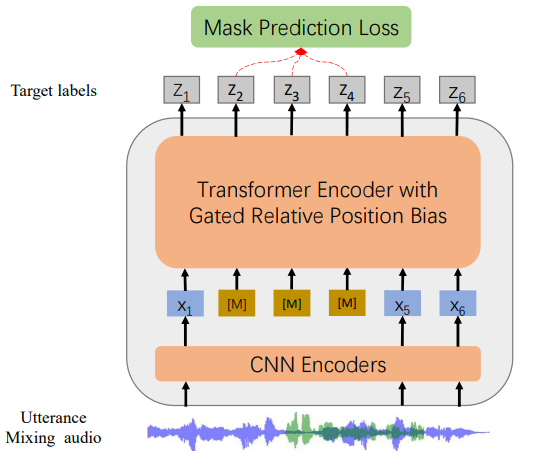

**Source:** *WavLM Base Plus model card* — [original page](https://huggingface.co/microsoft/wavlm-base-plus)

# 

[microsoft](https://huggingface.co/microsoft)

/

[wavlm-base-plus](https://huggingface.co/microsoft/wavlm-base-plus) 

 

 Like 41

Follow

 Microsoft 22.3k

[ 

  Feature Extraction ](https://huggingface.co/models?pipeline_tag=feature-extraction)[ 

 Transformers ](https://huggingface.co/models?library=transformers)[ 

 PyTorch ](https://huggingface.co/models?library=pytorch)[ 

 English ](https://huggingface.co/models?language=en)[ wavlm ](https://huggingface.co/models?other=wavlm)[ speech ](https://huggingface.co/models?other=speech)

 arxiv: 4 papers

[ 

 Model card ](https://huggingface.co/microsoft/wavlm-base-plus)[ 

 Files Files and versions 

 xet ](https://huggingface.co/microsoft/wavlm-base-plus/tree/main)[ 

 Community 2 ](https://huggingface.co/microsoft/wavlm-base-plus/discussions)

 

 Deploy 

 

 Copy to bucket new

 Use this model 

 

### Instructions to use microsoft/wavlm-base-plus with libraries, inference providers, notebooks, and local apps. Follow these links to get started.

  * Libraries
  * [ 

 Transformers](https://huggingface.co/microsoft/wavlm-base-plus?library=transformers)

How to use microsoft/wavlm-base-plus with Transformers:
        
        # Use a pipeline as a high-level helper
        from transformers import pipeline
        
        pipe = pipeline("feature-extraction", model="microsoft/wavlm-base-plus")
        
        # Load model directly
        from transformers import AutoProcessor, AutoModel
        
        processor = AutoProcessor.from_pretrained("microsoft/wavlm-base-plus")
        model = AutoModel.from_pretrained("microsoft/wavlm-base-plus", device_map="auto")

  * Notebooks
  * [ 

 Google Colab](https://huggingface.co/microsoft/wavlm-base-plus/colab)
  * [ 

 Kaggle](https://huggingface.co/microsoft/wavlm-base-plus/kaggle)

**YAML Metadata Error:** "datasets" must be a string

 

  * [WavLM-Base-Plus](https://huggingface.co/microsoft/wavlm-base-plus#wavlm-base-plus "WavLM-Base-Plus")
  * [Usage](https://huggingface.co/microsoft/wavlm-base-plus#usage "Usage")
    * [Speech Recognition](https://huggingface.co/microsoft/wavlm-base-plus#speech-recognition "Speech Recognition")
    * [Speech Classification](https://huggingface.co/microsoft/wavlm-base-plus#speech-classification "Speech Classification")
    * [Speaker Verification](https://huggingface.co/microsoft/wavlm-base-plus#speaker-verification "Speaker Verification")
    * [Speaker Diarization](https://huggingface.co/microsoft/wavlm-base-plus#speaker-diarization "Speaker Diarization")
  * [Contribution](https://huggingface.co/microsoft/wavlm-base-plus#contribution "Contribution")
  * [License](https://huggingface.co/microsoft/wavlm-base-plus#license "License")

#   WavLM-Base-Plus 

[Microsoft's WavLM](https://github.com/microsoft/unilm/tree/master/wavlm)

The base model pretrained on 16kHz sampled speech audio. When using the model, make sure that your speech input is also sampled at 16kHz. 

**Note** : This model does not have a tokenizer as it was pretrained on audio alone. In order to use this model **speech recognition** , a tokenizer should be created and the model should be fine-tuned on labeled text data. Check out [this blog](https://huggingface.co/blog/fine-tune-wav2vec2-english) for more in-detail explanation of how to fine-tune the model.

The model was pre-trained on:

  * 60,000 hours of [Libri-Light](https://arxiv.org/abs/1912.07875)
  * 10,000 hours of [GigaSpeech](https://arxiv.org/abs/2106.06909)
  * 24,000 hours of [VoxPopuli](https://arxiv.org/abs/2101.00390)

[Paper: WavLM: Large-Scale Self-Supervised Pre-Training for Full Stack Speech Processing](https://arxiv.org/abs/2110.13900)

Authors: Sanyuan Chen, Chengyi Wang, Zhengyang Chen, Yu Wu, Shujie Liu, Zhuo Chen, Jinyu Li, Naoyuki Kanda, Takuya Yoshioka, Xiong Xiao, Jian Wu, Long Zhou, Shuo Ren, Yanmin Qian, Yao Qian, Jian Wu, Michael Zeng, Furu Wei

**Abstract** _Self-supervised learning (SSL) achieves great success in speech recognition, while limited exploration has been attempted for other speech processing tasks. As speech signal contains multi-faceted information including speaker identity, paralinguistics, spoken content, etc., learning universal representations for all speech tasks is challenging. In this paper, we propose a new pre-trained model, WavLM, to solve full-stack downstream speech tasks. WavLM is built based on the HuBERT framework, with an emphasis on both spoken content modeling and speaker identity preservation. We first equip the Transformer structure with gated relative position bias to improve its capability on recognition tasks. For better speaker discrimination, we propose an utterance mixing training strategy, where additional overlapped utterances are created unsupervisely and incorporated during model training. Lastly, we scale up the training dataset from 60k hours to 94k hours. WavLM Large achieves state-of-the-art performance on the SUPERB benchmark, and brings significant improvements for various speech processing tasks on their representative benchmarks._

The original model can be found under <https://github.com/microsoft/unilm/tree/master/wavlm>.

#   Usage 

This is an English pre-trained speech model that has to be fine-tuned on a downstream task like speech recognition or audio classification before it can be used in inference. The model was pre-trained in English and should therefore perform well only in English. The model has been shown to work well on the [SUPERB benchmark](https://superbbenchmark.org/).

**Note** : The model was pre-trained on phonemes rather than characters. This means that one should make sure that the input text is converted to a sequence of phonemes before fine-tuning.

##   Speech Recognition 

To fine-tune the model for speech recognition, see [the official speech recognition example](https://github.com/huggingface/transformers/tree/master/examples/pytorch/speech-recognition).

##   Speech Classification 

To fine-tune the model for speech classification, see [the official audio classification example](https://github.com/huggingface/transformers/tree/master/examples/pytorch/audio-classification).

##   Speaker Verification 

TODO

##   Speaker Diarization 

TODO

#   Contribution 

The model was contributed by [cywang](https://huggingface.co/cywang) and [patrickvonplaten](https://huggingface.co/patrickvonplaten).

#   License 

The official license can be found [here](https://github.com/microsoft/UniSpeech/blob/main/LICENSE)

Downloads last month
    254,924

 

 Inference Providers [NEW](https://huggingface.co/docs/inference-providers)

[ 

 Feature Extraction](https://huggingface.co/tasks/feature-extraction "Learn more about feature-extraction")

This model isn't deployed by any Inference Provider. [🙋 Ask for provider support](https://huggingface.co/spaces/huggingface/InferenceSupport/discussions/new?title=microsoft/wavlm-base-plus&description=React%20to%20this%20comment%20with%20an%20emoji%20to%20vote%20for%20%5Bmicrosoft%2Fwavlm-base-plus%5D\(%2Fmicrosoft%2Fwavlm-base-plus\)%20to%20be%20supported%20by%20Inference%20Providers.%0A%0A\(optional\)%20Which%20providers%20are%20you%20interested%20in%3F%20\(Novita%2C%20Hyperbolic%2C%20Together%E2%80%A6\)%0A)

##  

 Model tree for microsoft/wavlm-base-plus 

 

Adapters

[1 model](https://huggingface.co/models?other=base_model:adapter:microsoft/wavlm-base-plus)

 

Finetunes

[36 models](https://huggingface.co/models?other=base_model:finetune:microsoft/wavlm-base-plus)

 

Quantizations

[2 models](https://huggingface.co/models?other=base_model:quantized:microsoft/wavlm-base-plus)

##  

 Spaces using microsoft/wavlm-base-plus 100

[📊 mteb/leaderboard ](https://huggingface.co/spaces/mteb/leaderboard)[🎤 smola/higgs_audio_v2 

  ](https://huggingface.co/spaces/smola/higgs_audio_v2)[🧢 OpenSound/CapSpeech-TTS 

  ](https://huggingface.co/spaces/OpenSound/CapSpeech-TTS)[🔊 hugging-apps/unise-speech-enhancement 

  ](https://huggingface.co/spaces/hugging-apps/unise-speech-enhancement)[🐆 nineninesix/gepard 

  ](https://huggingface.co/spaces/nineninesix/gepard)[😊🎙️📖 litagin/Style-Bert-VITS2-Editor-Demo ](https://huggingface.co/spaces/litagin/Style-Bert-VITS2-Editor-Demo)[💫 Plana-Archive/BanG-Dream-VITS ](https://huggingface.co/spaces/Plana-Archive/BanG-Dream-VITS)[📊 ALM/ARCH ](https://huggingface.co/spaces/ALM/ARCH) \+ 95 Spaces \+ 92 Spaces

##  

 Papers for microsoft/wavlm-base-plus

#### [WavLM: Large-Scale Self-Supervised Pre-Training for Full Stack Speech Processing 

 Paper • 2110.13900 • Published Oct 26, 2021 • 

 3 ](https://huggingface.co/papers/2110.13900)#### [GigaSpeech: An Evolving, Multi-domain ASR Corpus with 10,000 Hours of Transcribed Audio 

 Paper • 2106.06909 • Published Jun 13, 2021 • 

 1 ](https://huggingface.co/papers/2106.06909)#### [VoxPopuli: A Large-Scale Multilingual Speech Corpus for Representation Learning, Semi-Supervised Learning and Interpretation 

 Paper • 2101.00390 • Published Jan 2, 2021 • 

 1 ](https://huggingface.co/papers/2101.00390)#### [Libri-Light: A Benchmark for ASR with Limited or No Supervision 

 Paper • 1912.07875 • Published Dec 17, 2019 ](https://huggingface.co/papers/1912.07875)
