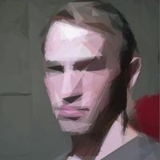

**Source:** *YODAS2 dataset card* — [original page](https://huggingface.co/datasets/espnet/yodas2)

# [ 

 Datasets:](https://huggingface.co/datasets)

* * *

[espnet](https://huggingface.co/espnet)

/

[yodas2](https://huggingface.co/datasets/espnet/yodas2) 

 

 Like 56

Follow

 ESPnet 400

ArXiv:

 arxiv: 2406.00899

License:

 cc-by-3.0

[ 

 Dataset card ](https://huggingface.co/datasets/espnet/yodas2)[ 

 Files Files and versions 

 xet ](https://huggingface.co/datasets/espnet/yodas2/tree/main)[ 

 Community 6 ](https://huggingface.co/datasets/espnet/yodas2/discussions)

 

Dataset Viewer

The viewer is disabled because this dataset repo requires arbitrary Python code execution. Please consider removing the [loading script](https://huggingface.co/docs/datasets/dataset_script) and relying on [automated data support](https://huggingface.co/docs/datasets/repository_structure) (you can use [`convert_to_parquet`](https://huggingface.co/docs/datasets/main/en/cli#convert-to-parquet) from the `datasets` library). If this is not possible, please [open a discussion](https://huggingface.co/datasets/espnet/yodas2/discussions/new?title=Dataset+Viewer+issue%3A+DatasetWithScriptNotSupportedError&description=The+dataset+viewer+is+not+working.%0A%0AError+details%3A%0A%0A%60%60%60%0AError+code%3A+++DatasetWithScriptNotSupportedError%0A%0A%60%60%60%0A%0A%0A---%0A%0A%F0%9F%91%8B+Before+opening+the+discussion%2C+have+you+considered+removing+the+%5Bloading+script%5D%28https%3A%2F%2Fhuggingface.co%2Fdocs%2Fdatasets%2Fdataset_script%29+and+relying+on+%5Bautomated+data+support%5D%28https%3A%2F%2Fhuggingface.co%2Fdocs%2Fdatasets%2Frepository_structure%29%3F%0A%0AYou+can+use+%5Bconvert_to_parquet%5D%28https%3A%2F%2Fhuggingface.co%2Fdocs%2Fdatasets%2Fmain%2Fen%2Fcli%23convert-to-parquet%29+from+the+datasets+library.%0A%0A---%0A%0A%0Acc+%40lhoestq+%40cfahlgren1.) for direct help.

 

  * [Usage:](https://huggingface.co/datasets/espnet/yodas2#usage "Usage:")
  * [Reference](https://huggingface.co/datasets/espnet/yodas2#reference "Reference")
  * [Contact](https://huggingface.co/datasets/espnet/yodas2#contact "Contact")

YODAS2 is the long-form dataset from YODAS dataset.

It provides the same dataset as [espnet/yodas](https://huggingface.co/datasets/espnet/yodas) but YODAS2 has the following new features:

  * formatted in the long-form (video-level) where audios are not segmented.
  * audios are encoded using higher sampling rates (i.e. 24k)

For detailed information about YODAS dataset, please refer to [our paper](https://arxiv.org/abs/2406.00899) and the [espnet/yodas repo](https://huggingface.co/datasets/espnet/yodas).

##   Usage: 

Each data point corresponds to an entire video on YouTube, it contains the following fields:

  * video_id: unique id of this video (note this id is not the video_id in Youtube)
  * duration: total duration in seconds of this video
  * audio
    * path: local path to wav file if in standard mode, otherwise empty in the streaming mode
    * sampling_rate: fixed to be 24k. (note that the sampling rate in `espnet/yodas` is 16k)
    * array: wav samples in float
  * utterances
    * utt_id: unique id of this utterance
    * text: transcription of this utterance
    * start: start timestamp in seconds of this utterance
    * end: end timestamp in seconds of this utterance

YODAS2 also supports two modes:

**standard mode** : each subset will be downloaded to the local dish before first iterating. 
    
    
    from datasets import load_dataset
    
    # Note this will take very long time to download and preprocess
    # you can try small subset for testing purpose
    ds = load_dataset('espnet/yodas2', 'en000')
    print(next(iter(ds['train'])))
    

**streaming mode** most of the files will be streamed instead of downloaded to your local deivce. It can be used to inspect this dataset quickly.
    
    
    from datasets import load_dataset
    
    # this streaming loading will finish quickly
    ds = load_dataset('espnet/yodas2', 'en000', streaming=True)
    

##   Reference 
    
    
    @inproceedings{li2023yodas,
      title={Yodas: Youtube-Oriented Dataset for Audio and Speech},
      author={Li, Xinjian and Takamichi, Shinnosuke and Saeki, Takaaki and Chen, William and Shiota, Sayaka and Watanabe, Shinji},
      booktitle={2023 IEEE Automatic Speech Recognition and Understanding Workshop (ASRU)},
      pages={1--8},
      year={2023},
      organization={IEEE}
    }
    

##   Contact 

If you have any questions, feel free to contact us at the following email address.

We made sure that our dataset only consisted of videos with CC licenses during our downloading. But in case you find your video unintentionally included in our dataset and would like to delete it, you can send a delete request to the following email.

Remove the parenthesis `()` from the following email address

`(lixinjian)(1217)@gmail.com`

 Copy to bucket new

 

Downloads last month

    55,021

Total file size: 60.3 TB

##  

 Models trained or fine-tuned on espnet/yodas2

[ 

  Yehor/hubert-uk 

 Automatic Speech Recognition • 

 94.4M • Updated Feb 20, 2025 • 

 43 • 

 4  ](https://huggingface.co/Yehor/hubert-uk)

[ 

  anak10thn/whisper-small-id 

 Automatic Speech Recognition • 

 0.2B • Updated about 20 hours ago • 

 4  ](https://huggingface.co/anak10thn/whisper-small-id)

[ 

  spacewave/sherpa-onnx-streaming-zipformer2-id 

 Automatic Speech Recognition • Updated Nov 22, 2025 ](https://huggingface.co/spacewave/sherpa-onnx-streaming-zipformer2-id)

##  

 Paper for espnet/yodas2

#### [YODAS: Youtube-Oriented Dataset for Audio and Speech 

 Paper • 2406.00899 • Published Jun 2, 2024 • 

 5 ](https://huggingface.co/papers/2406.00899)

##  

 Article mentioning espnet/yodas2

#### [YODAS v3: A 1 Million Hour Dataset for the Next Generation of Open Voice AI Research 

  * 

 
  * 
espnet • 4 days ago • 

 26](https://huggingface.co/blog/espnet/yodasv3)
