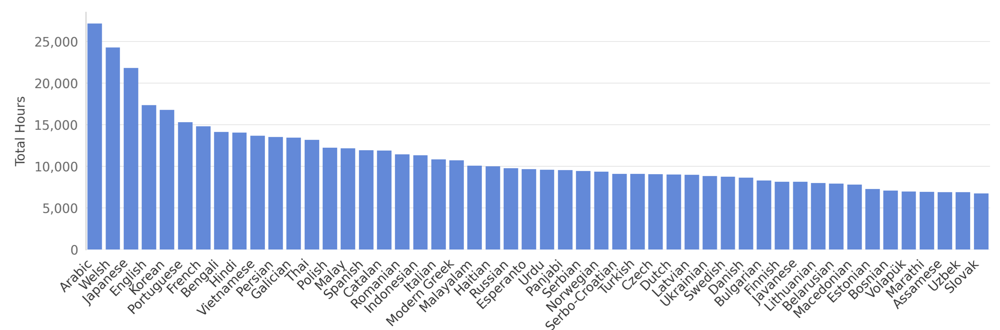
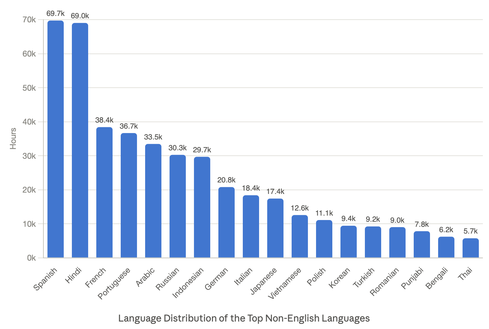
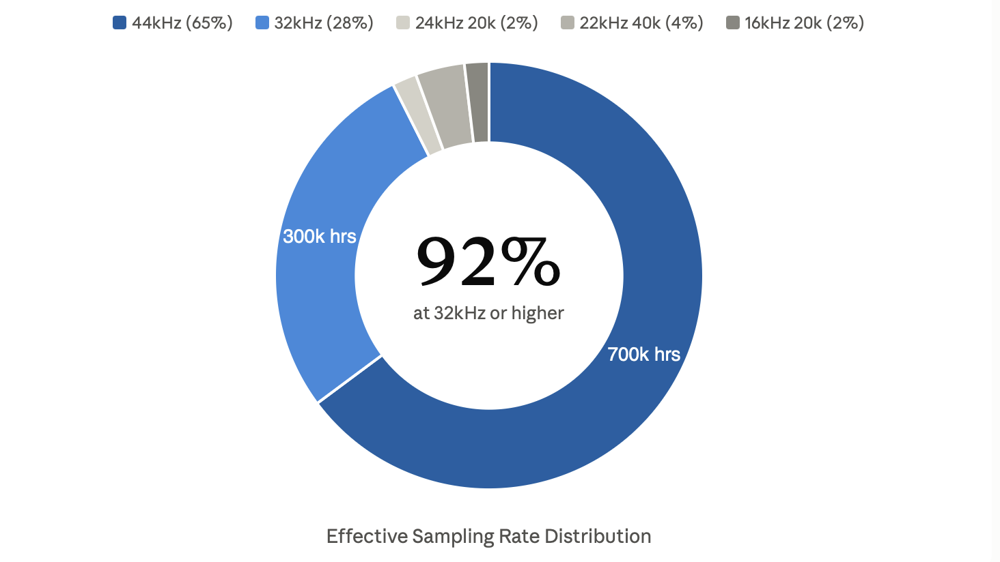

**Source:** *YODAS v3 dataset card* — [original page](https://huggingface.co/datasets/espnet/yodas3)

# [ 

 Datasets:](https://huggingface.co/datasets)

* * *

[espnet](https://huggingface.co/espnet)

/

[yodas3](https://huggingface.co/datasets/espnet/yodas3) 

 

 Like 139

Follow

 ESPnet 400

Tasks: [ 

  Audio-to-Audio ](https://huggingface.co/datasets?task_categories=task_categories%3Aaudio-to-audio)[ 

  Automatic Speech Recognition ](https://huggingface.co/datasets?task_categories=task_categories%3Aautomatic-speech-recognition)[ 

  Text-to-Speech ](https://huggingface.co/datasets?task_categories=task_categories%3Atext-to-speech) \+ 1

Modalities: [ 

 Audio ](https://huggingface.co/datasets?modality=modality%3Aaudio)[ 

 Tabular ](https://huggingface.co/datasets?modality=modality%3Atabular)[ 

 Text ](https://huggingface.co/datasets?modality=modality%3Atext)

Formats: [ 

 parquet ](https://huggingface.co/datasets?format=format%3Aparquet)

Size: [ 1M - 10M ](https://huggingface.co/datasets?size_categories=size_categories%3A1M%3Cn%3C10M)

Libraries: [ 

 Datasets ](https://huggingface.co/datasets?library=library%3Adatasets)[ 

 Dask ](https://huggingface.co/datasets?library=library%3Adask)[ 

 Polars ](https://huggingface.co/datasets?library=library%3Apolars) \+ 1

License:

 cc-by-3.0

[ 

 Dataset card ](https://huggingface.co/datasets/espnet/yodas3)[ 

 Data Studio ](https://huggingface.co/datasets/espnet/yodas3/viewer/)[ 

 Files Files and versions 

 xet ](https://huggingface.co/datasets/espnet/yodas3/tree/main)[ 

 Community 3 ](https://huggingface.co/datasets/espnet/yodas3/discussions)

 

Dataset Viewer

[ 

 Auto-converted to Parquet](https://huggingface.co/datasets/espnet/yodas3/tree/refs%2Fconvert%2Fparquet/preview) 

 API 

 Embed [ 

 Duplicate](https://huggingface.co/datasets/espnet/yodas3?duplicate=true) 

 Data Studio

Subset (104)

preview · 177 rows 

 

preview (177 rows)ab_metadata (1 rows)af_metadata (229 rows)am_metadata (722 rows)ar_metadata (138k rows)as_metadata (2 rows)ay_metadata (2 rows)az_metadata (542 rows)be_metadata (177 rows)bg_metadata (3.3k rows)bn_metadata (19.1k rows)bo_metadata (1 rows)bs_metadata (5 rows)ca_metadata (213 rows)cr_metadata (1 rows)cs_metadata (6.54k rows)cy_metadata (2 rows)da_metadata (1.62k rows)de_metadata (61.2k rows)el_metadata (12.2k rows)en_metadata (1.15M rows)eo_metadata (30 rows)es_metadata (246k rows)et_metadata (141 rows)eu_metadata (207 rows)fi_metadata (2.88k rows)fil_metadata (6.79k rows)fo_metadata (3 rows)fr_metadata (102k rows)gl_metadata (57 rows)gn_metadata (1 rows)gu_metadata (2.33k rows)ha_metadata (10 rows)hi_metadata (290k rows)hr_metadata (41 rows)hu_metadata (4.38k rows)hy_metadata (265 rows)ia_metadata (1 rows)id_metadata (112k rows)is_metadata (97 rows)it_metadata (68.5k rows)iw_metadata (3.3k rows)ja_metadata (80k rows)jv_metadata (442 rows)ka_metadata (230 rows)kk_metadata (3 rows)km_metadata (804 rows)kn_metadata (8.63k rows)ko_metadata (51.6k rows)ku_metadata (3 rows)ky_metadata (2 rows)la_metadata (5 rows)lo_metadata (96 rows)lt_metadata (1.55k rows)lv_metadata (1.8k rows)mk_metadata (174 rows)ml_metadata (6.76k rows)mn_metadata (630 rows)mr_metadata (7.38k rows)ms_metadata (1.01k rows)mt_metadata (2 rows)my_metadata (512 rows)ne_metadata (605 rows)nl_metadata (22.8k rows)no_metadata (1.56k rows)om_metadata (17 rows)or_metadata (2 rows)pa_metadata (9.25k rows)pl_metadata (37.4k rows)ps_metadata (4 rows)pt_metadata (121k rows)rm_metadata (1 rows)ro_metadata (34.2k rows)ru_metadata (107k rows)rw_metadata (4 rows)sa_metadata (1 rows)sc_metadata (1 rows)sd_metadata (1 rows)si_metadata (1.15k rows)sk_metadata (2.2k rows)sl_metadata (66 rows)so_metadata (5 rows)sq_metadata (385 rows)sr_metadata (53 rows)su_metadata (593 rows)sv_metadata (2.33k rows)sw_metadata (2.61k rows)ta_metadata (11.2k rows)te_metadata (16.5k rows)tg_metadata (1 rows)th_metadata (22.3k rows)ti_metadata (1 rows)tk_metadata (1 rows)tr_metadata (38.5k rows)uk_metadata (12.7k rows)unk_metadata (1.19M rows)ur_metadata (133 rows)uz_metadata (997 rows)vi_metadata (44k rows)wo_metadata (1 rows)yue_metadata (290 rows)zh_metadata (996 rows)zu_metadata (348 rows)❌ fa_metadata (7.5k rows)

Split (1)

train · 177 rows 

 

train (177 rows)

 

SQL

Console

The dataset viewer should be available soon. Please [ 

 retry later](https://huggingface.co/datasets/espnet/yodas3).

 

  * [YODAS v3](https://huggingface.co/datasets/espnet/yodas3#yodas-v3 "YODAS v3")
  * [Downloading](https://huggingface.co/datasets/espnet/yodas3#downloading "Downloading")
    * [HF Transfer](https://huggingface.co/datasets/espnet/yodas3#hf-transfer "HF Transfer")
    * [load_dataset](https://huggingface.co/datasets/espnet/yodas3#load_dataset "load_dataset")
  * [Structure](https://huggingface.co/datasets/espnet/yodas3#structure "Structure")
    * [Metadata fields](https://huggingface.co/datasets/espnet/yodas3#metadata-fields "Metadata fields")
  * [Analysis](https://huggingface.co/datasets/espnet/yodas3#analysis "Analysis")
  * [Citation](https://huggingface.co/datasets/espnet/yodas3#citation "Citation")

##   YODAS v3 

[Paper](https://www.isca-archive.org/interspeech_2026/chen26d_interspeech.html)

YODAS v3 is a large web-crawled dataset containing over 1.1 million hours of audio that were originally released under a **CC-BY-3.0** license. The dataset contains audio in over 100 languages. YODAS v3 can be used for a variety of multi-modal tasks, including Automatic Speech Recognition, Text-to-Speech, and Audio Representation Learning. We crawl a distinct set of videos from the [v1](https://huggingface.co/datasets/espnet/yodas) and [v2](https://huggingface.co/datasets/espnet/yodas2) versions of YODAS, to guarantee that there are no overlaps in the data.

For each audio file, we also release the following metadata:

  * segment-level transcripts (if available)
  * English translations (if available)
  * language IDs
  * audio length
  * effective bandwith
  * effective channel count

Approximately 75% of the data has transcripts. Around 60% of the non-English data has English translations. All transcripts and translations come with sentence-level timestamps. 95% of the transcripts also have word-level timestamps.

Language IDs are provided at the file-level, and may not be entirely accurate on individual sentences. The language IDs were obtained in 2 ways:

  1. the language ID provided with the transcript, if available
  2. the provided locale of the audio from the upload

While we originally reported the ID distribution from (2) in our paper, we found that the IDs from (1) are likely more accurate, if available. See the Analysis section below for more details. We therefore organize the upload directory by the language ID detected from (1), but include both IDs in the metadata. Any audio files without a transcript are put in the `unk` directory.

Check our [blog post](https://huggingface.co/blog/espnet/yodasv3) for information about potential use cases for YODAS v3, and how previous versions of the dataset were used.

##   Downloading 

###   HF Transfer 

**One language only**.
    
    
    hf download espnet/yodas3 --repo-type dataset --include "data/hi/*" --local-dir yodas3
    

**Multiple languages**.
    
    
    hf download espnet/yodas3 --repo-type dataset \
      --include "data/hi/*" "data/ta/*" "data/bn/*" --local-dir yodas3
    

**Just the metadata for all languages (no audio)**
    
    
    hf download espnet/yodas3 --repo-type dataset --include "data/*/metadata/*" --local-dir yodas3
    

**Specific shards**
    
    
    hf download espnet/yodas3 --repo-type dataset \
      --include "data/en/audio/00[0-4]?.tar" "data/en/metadata/00[0-4]?.parquet" --local-dir yodas3
    

###   load_dataset 
    
    
    """Join espnet/yodas3 audio (WebDataset tars) with transcripts (metadata parquets), streaming.
    
        python join_example.py hi            # stream Hindi, print the first few joined samples
    """
    import io, json, sys
    import av
    import numpy as np
    from datasets import load_dataset
    
    lang = sys.argv[1] if len(sys.argv) > 1 else "hi"
    N = int(sys.argv[2]) if len(sys.argv) > 2 else 3
    
    # 1) metadata: one row per video, keyed by the encrypted id (= tar member name)
    meta = {r["id"]: r for r in load_dataset("espnet/yodas3", f"{lang}_metadata", split="train")}
    
    # 2) audio: stream the tars; each sample = {"__key__": id, "__url__": shard url, "webm": bytes}
    audio = load_dataset("webdataset", data_files=f"hf://datasets/espnet/yodas3/data/{lang}/audio/*.tar",
                         split="train", streaming=True)
    
    def decode_webm(b: bytes, sr: int = 16000) -> np.ndarray:
        """Opus-in-WebM bytes -> float32 mono waveform at `sr` Hz, in-process via PyAV (pip install av)."""
        with av.open(io.BytesIO(b)) as c:
            rs = av.AudioResampler(format="flt", layout="mono", rate=sr)
            chunks = [f.to_ndarray().reshape(-1) for frame in c.decode(c.streams.audio[0]) for f in rs.resample(frame)]
            chunks += [f.to_ndarray().reshape(-1) for f in rs.resample(None)]      # flush the resampler
        return np.concatenate(chunks)
    
    for i, s in enumerate(audio):
        m = meta[s["__key__"]]                                  # 3) the join
        segments = json.loads(m["transcript"]) if m["transcript"] else []
        wav = decode_webm(s["webm"])
        print(f"{s['__key__']}  shard={m['shard']}  {m['length']:.0f}s  decoded={len(wav)/16000:.1f}s  "
              f"{len(segments)} segments  first={segments[0]['text'][:60]!r}" if segments else
              f"{s['__key__']}  shard={m['shard']}  {m['length']:.0f}s  decoded={len(wav)/16000:.1f}s  no transcript")
        if i + 1 >= N:
            break
    

##   Structure 
    
    
    data/
      <lang>/
        audio/0000.tar … NNNN.tar          # WebDataset shards, ≈8 GB each, members named <id>.webm
        metadata/0000.parquet … NNNN.parquet  # one parquet per shard, one row per member of the same-numbered tar
    

  * **103 directories** : 102 language codes (ISO-639-1 where one exists, otherwise `fil`, `yue`, `zh`, …) plus `unk` for audio with no caption track.
  * **6,685 shards** in total 
  * **Each audio file has its own ID**. `metadata/NNNN.parquet` has exactly the rows for the members of `audio/NNNN.tar`, joined on `id`, so a WebDataset pipeline can pair the two by shard number.

###   Metadata fields 

field | dtype | values  
---|---|---  
`id` | string | 32 lowercase hex characters; equals the tar member name without `.webm`; unique across the dataset  
`shard` | string | 4-digit shard number, e.g. `"0042"` — the tar this row's audio is in  
`transcript` | string / null | Original-language captions as a JSON list of segments `[{"start": <ms>, "duration": <ms>, "text": "…", "words": [{"t": <offset ms>, "w": "…"}, …]}, …]`. `words` (per-word offsets relative to `start`) is present for ASR tracks (≈95 % of transcripts) and absent for uploader-provided subtitles. Null when the video has no caption track (all of `unk`, ≈2k others).  
`translation_en` | string / null | English translation of a non-English original, same JSON format but segment-level only (no `words`). Null for English originals and where no translation exists (present for ≈1.07 M videos).  
`transcript_lang` | string / null | Language of the original caption track = the `<lang>` directory; one of the 102 codes. Null in `unk`.  
`locale_lang` | string / null | Language inferred from the uploader's locale (YODAS v1/v2 scheme), independent of the transcript; 146 distinct codes; null for ≈900 k videos.  
`length` | float64 | Audio duration in seconds (1 – 153,284; mean ≈ 952).  
`audio_bitrate` | float64 | Container bitrate in kbit/s (3.6 – 569, median ≈ 122); NaN for 1,461 videos.  
`max_freq_hz` | float64 / null | Highest frequency with significant energy, from an FFT of a 10 s excerpt (35 – 24,000 Hz). Null for ≈283 k videos.  
`estimated_bandwidth_hz` | float64 / null | Effective sample rate implied by `max_freq_hz` (urgent2025 method, −50 dB threshold): one of 8000, 16000, 22050, 24000, 32000, 44100. Use it to spot upsampled audio. Null where `max_freq_hz` is null.  
`channels` | int32 | Channel count in the file container: 1, 2, 4 or 6 (99.8 % are 2).  
`n_distinct_channels` | int32 / null | Effective channel count after comparing channels on a 10 s excerpt (normalized RMS difference < 0.001 ⇒ identical): 1 – 5. `channels = 2, n_distinct_channels = 1` (≈25 % of videos) means dual-mono. Null for 581 videos where the analysis failed.

 

Timestamps in `transcript` / `translation_en` are milliseconds from the start of the audio.

##   Analysis 

**Language coverage.** YODAS v3 spans 100+ languages, and 34 of them have more than 1,000 hours, the rough threshold at which a language can support a strong standalone ASR model. As noted above, we measured language distribution using two different methods: locale and transcript. Below are example distribution figures for each measurement method:

Locale-based Language Distribution:

Transcript-based:

We originally reported the locale-based method in our paper. 

**Channel count.** Over 70% of YODAS v3 contains at least 2 distinct channels. We counted a recording as multi-channel only when its channels were measurably different, so duplicated mono audio stored as stereo is labeled mono.

**Effective sampling rate.** Because much web audio is upsampled from lower-quality sources, we estimated each recording's effective sampling rate from its actual frequency content, rather than trusting the file header. Over 92% of the data reaches an effective rate of 32kHz or higher, and 67% reaches 44kHz.

##   Citation 

We ask that you cite our paper if you use any of the resources we release under YODAS v3. If you re-release a large amount of data from YODAS v3 under a new dataset, benchmark, or repo, we also ask that put the below bibtex in any requested citations section. This makes it easier for us to get the resources needed for expanding the dataset in the future and keeping them free + open access.
    
    
    @inproceedings{chen26d_interspeech,
      title     = {{YODAS v3: Over 1 Million Hours of High-Bandwidth, Stereophonic, Multilingual Speech}},
      author    = {William Chen and Shinnosuke Takamichi and Sayaka Shiota and Satoru Fukayama and Samuele Cornell and Shinji Watanabe},
      year      = {2026},
      booktitle = {{Interspeech 2026}},
      pages     = {5367--5372},
      doi       = {10.21437/Interspeech.2026-386},
      issn      = {2958-1796},
    }
    

 Copy to bucket new

 Use this dataset 

 

 

Downloads last month

    56,558

Number of rows: 4,076,386 Total file size: 55.7 TB

##  

 Article mentioning espnet/yodas3

#### [YODAS v3: A 1 Million Hour Dataset for the Next Generation of Open Voice AI Research 

  * 

 
  * 
espnet • 4 days ago • 

 26](https://huggingface.co/blog/espnet/yodasv3)
