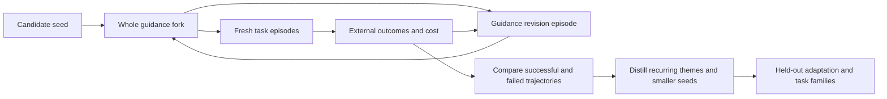

# Instruction-ablation sketches

> Deferred designs for learning how guidance should evolve, beyond testing
> whether one present instruction helps.

Topic: `instruction-ablation`

## From successful trajectories to a minimal starting seed

Proposal, 2026-09-06. No implementation, testbed, or outcome experiment has
been run. The user wants the eventual expensive testbed to search for
"the ultimate guidance-writing guidance": identify fixed points in guidance
themes arising in successful trajectories, then project back to a minimal
reasonable starting seed that can successfully tweak guidance for both testbed
fitness and appropriate model-scoped, defect-scoped wins. Execution is deferred
until a later model and an explicit budget make the expense worthwhile.
Closure is tracked by
[`instruction-guidance-evolution-testbed`](../gaps/instruction-guidance-evolution-testbed.md).

### The object being learned

A frozen optimized `AGENTS.md` is one intermediate artifact. The desired result
is a small seed for a process that can produce, scope, simplify, and retire
effective instructions as tasks and models change. Its guidance-writing part
may itself evolve; freezing our present authoring rules would assume the answer.

Distinguish roles at use time, without assuming a clean partition of files:

- **Authoring guidance:** how the writer diagnoses traces and decides whether
  to add, change, move, or remove an instruction, or leave guidance alone.
- **Working guidance:** what the task-solving agent receives, including its
  model-, harness-, project-, and defect-scoped selection.
- **External objective and measurement:** task requirements, preserved user
  work, real acceptance tests, resource accounting, and the sealed evaluator.
  These remain outside the writer's editable world.

One passage may play both authoring and task-solving roles; participants need
not label every clause as meta or non-meta. The whole fork is the treatment.
The firm boundary is between that evolving fork and the external objective,
evaluator, and measurement record. Role annotations help analyze a run; they
do not establish separate causal effects.

A trajectory contains successive versions of the fork, its
routing, tasks attempted, observed outcomes, and revision decisions. Successful
trajectories may use different wording and different model exceptions while
converging on the same useful authoring themes. The model is an experimental
condition, not a contest whose winner this project must name.

### What would count as a fixed point

Treat a fixed point as a stable theme in the *guidance-update process* under a
declared task/model distribution, not an exact string, a universally optimal
constitution, or an instruction the agent keeps repeating. Similarity alone
can come from common training priors, an imposed rubric, or an editor that
never deletes anything. Unchanging bad guidance is also a fixed point.

A candidate theme earns attention when it:

1. Emerges from materially different seeds and incident orders in successful
   trajectories, with failed trajectories retained as the contrast.
2. Changes downstream behavior beneficially when varied in controlled
   interventions; occurrence in a successful trace is only a hypothesis.
3. Has a stable *scope*: a useful patch reappears on the affected model/defect
   slice while remaining absent, cheaper, or deliberately retired elsewhere.
4. Survives paraphrase and removal/recovery probes, while adapting when a
   successor model or changed environment removes the original need.

The potentially stable theme is, for example, "use the evidence to select the
scope of a correction," even if a particular Sol correction appropriately
disappears on Astra. Both monotone text growth and universal application of
every successful patch count against fitness. Bounded churn is possible; the
search should detect useful cycles or several local attractors rather than
force all trajectories into one fixed-point narrative.

### Projecting back to the seed

First discover candidates from development trajectories, then independently
test whether compact seeds can regenerate the useful behavior. Do not merely
summarize a final long corpus and call the summary a seed.

Progressively remove clauses, examples, scope machinery, and authoring advice
from candidate seeds; restart clean adaptation runs after each change. Score
whether the remaining seed learns appropriate corrections from *new* evidence,
how much work it wastes before doing so, and whether it later sheds obsolete
corrections. Include both hand-distilled and search-generated seeds. Count the
full content of every reachable packet and helper instruction: hiding the
original corpus behind a short "read this" pointer is not compression.

One deliberately provisional seed arm could say:

> Complete the task under the supplied constraints and check the outcome.
> Use observed failures and unnecessary work to revise guidance when that
> would help future tasks; adding text is only one possible revision.
> Apply a correction where its evidence supports it, and reconsider it when
> the model or situation changes. Preserve the external objective.

This is a candidate to ablate, not the answer planted in every starting arm.
Compare against an even smaller goal-and-feedback seed. A short seed that
requires expensive relearning before every useful task can lose to a slightly
longer one. "Minimal reasonable" therefore means small subject to an explicit
downstream quality, adaptation-cost, and risk tolerance—not a token-count
minimum unconstrained by use.

### Experimental unit and controls

The unit is a complete adaptation trajectory, not an isolated task or a
single error. Pair trajectories on their environment, starting state,
opportunity sequence, task budget, and available feedback. Separate writer
model from task-solver model; rotate them to detect a writer producing advice
that only its own family can use. Pin model/backend/harness versions and
effective system/developer/tool prompts, effort, permissions, and compaction
behavior. When immutable provider versions are unavailable, record that limit
and interleave comparisons in the same time window.

Useful control arms include:

- Current corpus, fixed; minimal task/requirements context, fixed.
- Add-one-rule-after-each-incident, an explicit growth-ratchet baseline.
- Adaptive guidance with addition, deletion, replacement, and scope changes.
- Distilled seed versus its longer ancestor and an equally short ordinary
  rewrite; distinguish brevity from better authoring decisions.
- Same-corpus repeats; no-op or shuffled-feedback controls to detect gains
  caused by extra attention, more attempts, or task leakage.

All arms receive the same actual user requirements and opportunity to learn
from permitted feedback. They differ in candidate guidance and its evolution.
If testing a tool/interface repair, make that a separate arm; do not ascribe a
better tool's effect to prose. Instruction wording, loading, and refresh are
also separately identifiable interventions before testing their combination.

For a scoped claim, compare guidance with/without the candidate rule *within*
each model and defect class, then compare those effects across models. A low
baseline error rate for Astra does not prove its instruction effect is zero.
Predefine defect opportunities independently of whether an agent obeys or
generates the rule, including near-misses where applying the rule is wasteful
or wrong. Adaptively discovered defect classes get new confirmation cases;
they do not acquire a significant effect by being selected after the result.

### Two complementary testbed sources

**Pinned project tasks.** Freeze a real repo at an exact source SHA, select a
bounded unresolved gap, and preserve the issue, relevant local instructions,
dependencies, acceptance tests, and initial dirty-state fixture separately.
Run each arm in a fresh durable workspace. A Git worktree alone is not
isolation: its common object store can reveal future commits, fixes, peer
branches, and hidden test patches. Supply only permitted history and give the
solver no access to answers, unrelated home directories, production services,
or mutable global instruction sources. Keep model transport available through
the controller while blocking solve-time answer retrieval. Project-specific
permissions, including restrictions on ancillary worktrees, still apply when
preparing the experiment.

**Synthetic SWE-bench-style tasks.** Generate small realistic repos with
controlled defects and hidden behavioral tests: an accepted-but-unused option,
a caller that bypasses the checked helper, ambiguous repeated edit anchors,
an instruction file in truncated output, a stale resumed contract, preserved
peer edits, or a request verb defined in a local amendment. Include ordinary
successful tasks and cases where an extra check or clarification adds cost
without information. Vary architecture and representation, not only names.
Use executable specifications, metamorphic variants, and independent review
to check generator/solver/grader shortcuts. Hold out generator families as
well as random seeds. Synthetic wins must transfer to real project work
before claiming fitness for the user's workflow.

Use inert service/remote fixtures for publication, destructive-action, and
coordination cases. Count forbidden attempted actions even if containment
prevents actual damage; a blocked catastrophe is not successful adherence.
Longitudinal tasks should allow an earlier design choice to affect later cost,
while separating genuine regressions from a hidden test patch that merely
fails to apply to a valid alternative implementation.

### Fitness and evidence

Keep a vector of outcomes before choosing any scalar search reward:

- Requirement satisfaction, integration correctness, regressions, and human
  repair/clarification effort.
- Defect-specific failure rates and unnecessary interventions, by model,
  harness, project, request class, and whether the triggering opportunity
  occurred; retain severe failures separately from averages.
- Total input, cached input, output, available reasoning-token counts,
  tool-output volume, calls, elapsed time, and reviewer effort. Distinguish
  one-time search/authoring cost from recurring use and adaptation cost.
- Guidance footprint, growth/churn, time to a useful scoped correction, and
  time to remove a correction after its premise stops holding.

An inner win means improved held-out task behavior under an evolved corpus.
An outer win means the seed repeatedly produces appropriate scoped wins at
acceptable total cost on held-out adaptation trajectories. A seed that wins
only by extra retries, withholding requirements, weakening tests, shifting
work to the user, or moving instructions into uncounted reads fails the claim.
Fix any cost/quality tradeoff weights and severe-failure constraints before
selecting winners; report the frontier when preferences do not choose one.

Use paired uncertainty at the trajectory/repository cluster level. Repeated
tasks within one evolving history are not independent samples. Size from
observed variance and meaningful effect or non-inferiority margins; a fixed
benchmark N or bootstrap procedure cannot guarantee power. Savings with no
significant quality difference are not evidence of equivalent quality.
Budget search itself and account for repeated selection and multiple slices.

Tests supply objective anchors, not a complete definition of good work. A
blinded review rubric comes from task requirements independent of the
candidate corpus. Calibrate any model reviewer against held-out human
judgments, including plausible but wrong patches. Judge bias can favor either
arm, and acceptance-round counts can also be gamed; neither is automatically
safe merely because the reviewer is a different model.

### Separation of search from confirmation

Use separate pools for writer feedback, seed/theme selection, and sealed
confirmation. Final confirmation comprises fresh *adaptation episodes*:
the candidate may learn from that episode's designated feedback tasks, then
is evaluated on unseen tasks without seeing their scores or hidden tests.
The writer never sees sealed results while still revising that candidate.
Rotate successor models, repos, defect families, and synthetic generators at
the outer boundary; paraphrases and random seeds from one template do not
provide this separation.

Check recurrence across unrelated seeds and inspect losers, too. A theme
common to every successful and failed trajectory may simply be a prior. Use
ablation, rescoping, and independent rediscovery to distinguish causal value
from a compelling retrospective story. Generated authoring guidance must not
edit the evaluator, the external objective, or the selection history.

### Groundwork and relation to existing proposals

The first future deliverable is a reproducible fixture plus a manifest and
an instrumented A/A replay that proves isolation, guidance selection, costs,
grading, and trajectory reconstruction. That is plumbing, not effectiveness
evidence. Next, compare a small set of full guidance-evolution policies; only
after useful signal emerges spend on per-theme searches and seed minimization.
No service, dataset download, paid model launch, or queue entry is created by
this document.

Reuse [instruction-ablation](instruction-ablation.md) for single-rule causal
contrasts, [agents-bench](agents-bench.md) for longitudinal project tasks, and
[differential instruction diagnosis](../research/differential-instruction-diagnosis/proposal.md)
for candidate model/defect attributions. This proposal adds the evolving
authoring guidance and back-projection to a seed; it does not duplicate those
test harness plans. Their sample-size heuristics and optimistic judge-bias
claims require reexamination before implementation; the uncertainty and
reviewer limits above state the proposed replacement assumptions. No new
prior-art or novelty claim is made here.

## Distributed git-history study

The user additionally proposes a socially distributed guidance-guidance study:
participants maintain forks, periodically run the testbed, and contribute
results for aggregation. SETI/Folding-style social incentives could fund the
blind-evolution variants, while ordinary collaborations produce useful work
and claims worth investigating. This is a study design, not an enabled upload,
telemetry, reward program, or request for participants.

### Two evidence streams and a fork ecosystem

**Human-steered evolution.** A participant reports that a fork now works well
for their workflow. Preserve the natural history that produced it, including
their requests to tweak behavior. Those requests may explain most of the win;
the guidance must not absorb the human's credit by default. This stream
supplies candidate themes and realistic adaptation episodes, even when no
causal attribution is yet possible.

**Blind evolution.** Donated compute runs independently assigned trajectories
under candidate seeds without task-specific human coaching. The useful output
is evidence about the guidance process; no project patch need be produced for
a real user. Participants can contribute either kind of work, but the
aggregator never pools the two as interchangeable success rates.

People can naturally fork whoever claims the latest best, tweak the guidance,
and submit a challenger. Blindness applies to an evaluation trajectory's
hidden cases and absence of intervention during that run, not a prohibition on
humans designing the starting fork. Record pre-run human seed design separately
from in-run steering. Repeated inspection of leaderboard results makes that
leaderboard a development set; fresh sealed confirmations remain necessary.

There is no required meta/non-meta repository boundary. Our `~/agents` already
mixes both roles, and a useful edit may change both. Compare complete forks
first; attribute individual roles only when an intervention can distinguish
them. The social object is a reproducible lineage of guidance, prompts, and
outcomes, not a contest over which paragraph deserves the word "meta."

### Git captures revisions; prompt records capture interventions

A commit graph alone cannot reconstruct co-evolution: the same final diff may
have followed a precise human repair request, a broad request to improve, or
autonomous diagnosis under the fork's own advice.

For every revision episode, retain a before/after commit pair, or equivalent
immutable trees, and a record linking:

- The exact user request and all observable prompts supplied to the guidance
  writer, including selected guidance, harness/tool instructions, retrieved
  context, and subsequent corrections.
- Task-solver prompts and trace references, supplied feedback, relevant tool
  outputs, and which outcomes were visible before the revision.
- Effective model/backend/harness identity, default-prompt/version fingerprints
  where obtainable, effort and decoding settings, permissions, and runner
  revision. Mark inaccessible provider prompts as opaque; do not invent them.
- Actual loaded bytes, including private amendments and uncommitted overlays,
  rather than inferring the treatment from HEAD alone. Annotate authoring,
  solving, routing, reference, and runner roles where informative, allowing
  overlap and unknowns.
- Descendant runs, seeds, costs, failures, grading revisions, and whether the
  result was nominated by a human, assigned blindly, or selected after other
  attempts. Record all attempts, not just the submitted winner.

A clean working tree between episodes is convenient, but a content-addressed
snapshot suffices; do not sweep another person's WIP into commits for
bookkeeping. Branching prompts get branching lineage. Record prompts before
outcomes are known and retain failed/no-change episodes, or the apparent
evolution history becomes success-only folklore.

Prompt capture is a participant opt-in with local storage first. Secret or
private project material need not be published: keep restricted raw records
and export a reviewed shareable packet. Missing/redacted intervention context
limits replay and attribution and must be declared. Public Git does not imply
permission to publish associated conversations. A hash proves identity when
the bytes are available; it does not make hidden context inspectable.

### Aggregation and credit

Index runs by fork/revision, lineage, model/harness/default-prompt combination,
task/defect distribution, seed, and treatment. Group themes provisionally by
behavioral content, not textual similarity alone. Preserve fork ancestry and
human contributions through merges and squashes; aliases or multiple uploads
of one lineage are not independent rediscoveries.

A claimed improvement is an intake trigger, not an accepted score. Attempt
matched before/after replay under the same recorded requests, then blind
confirmation on fresh tasks. To distinguish steering from fork effects,
cross before/after forks with the same human requests and a no-additional-
coaching condition where meaningful. Match feedback and attempt budgets.
For history-dependent requests, use compatible parent states or declare the
different intervention; do not paste a correction whose referent no longer
exists into an unrelated trajectory.

Report observational association, replicated improvement, and controlled
attribution separately. A human request that directly dictates the successful
rule deserves explicit credit. Guidance may instead deserve credit for
generalizing that request, choosing its scope, or later retiring it—each
requires an appropriate contrast. Effects can interact; do not force additive
percentages or a unique causal allocation from one successful lineage.

The aggregator retains counterexamples and independent reproductions, and
distinguishes self-submitted traces from externally rerun results. Content
hashes and signed manifests help provenance, not correctness. Score diverse
independent task opportunities rather than raw submitted run count, and use
hidden challenge assignments or reruns where gaming would distort the study.

### Boot size, total size, and model-step minima

Score every fork on both boot size and total size, with a manifest defining
the boundary. Report bytes and named-tokenizer counts separately. Boot size
includes all initial instruction layers and measured per-request selection;
total guidance size includes instructions in either role, examples, skills,
transitive referenced packets, embedded prompts, and generated copies.
Report repository source size separately so Git history, optional research
archives, and data are visible without being confused with active guidance.
Count material pulled from another repo or generated at runtime; a pointer
cannot make it free. Also report actual read volume and repeated-use cost.

The runner is part of the claimed minimal package. Freeze a common minimal
runner for the first comparison, publish its source/dependency footprint and
embedded instructions, and report candidate-specific additions. If a smaller
seed moves intelligence into task selection, feedback generation, a reviewer,
or runner code, count that machinery and label the changed treatment. The
external acceptance contract and sealed grading remain fixed. Do not charge
task requirements to one arm but hide them in another's runner.

At each frontier model step, restart the search for the **minimal set of meta
instructions plus runner that leads to good results**, with "meta" describing
the seed's intended job rather than restricting which helpful clauses count.
Include an empty added-guidance arm using the same runner and fixed external
task requirements. Measure cold-start behavior and adaptation with equal
feedback budgets. Use the recorded harness/model/default-prompt combination
as the unit: a shrinking required seed can indicate improved default capability
of that combination, not necessarily a better model in isolation.

For longitudinal comparisons, retain both a frozen task distribution and a
fresh transfer set. A smaller minimum on easier tasks, a stronger hidden
default prompt, or a more helpful runner cannot be attributed to the model
upgrade alone. Report the best *found* seeds at declared search budgets and
quality/risk tolerances; empirical search does not prove a global minimum.
An empty added seed may win, which is an informative result rather than a
failure of the study.

### Social incentives without selecting only flattering evidence

Candidate incentives include visible credit for donated compute, independent
replication, useful failures, new defect coverage, and compact transferable
seeds. Keep contribution credit separate from fitness ranking. Randomly assign
blind runs and preserve every assignment/outcome, so repeated submissions and
cherry-picked victories do not become a leaderboard strategy. Count lineage
diversity and coverage rather than rewarding guidance that manufactures extra
work merely to look productive.

Participation needs a clear local cost cap, explicit sharing choices, and a
result packet small enough to inspect. The expensive ideal includes independent
replication and fresh hidden cases; the first implementation can be a manifest
and importer plus manual review, without building a social platform. Donation
is voluntary and never inferred from a public fork or a model release.
