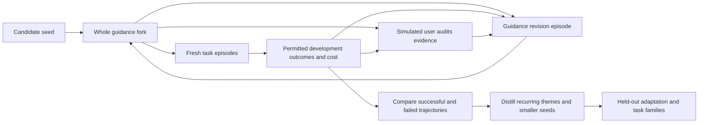

# Instruction-ablation sketches

> Deferred experiments on agent prompting and setup, including creative
> diversity and how guidance should evolve.

Topic: `instruction-ablation`

## Random-string inspiration: external noise versus creative bias

Proposal, 2026-09-21; user-directed preservation of an experiment to perform.
**Unrun and unscheduled.** This records the idea, not an effectiveness claim,
an installed `/riff` skill, or authorization to launch experiments.
Contributing-model: 6-Astra.

### The interesting question

Does an agent's biased, possibly "creative" randomness make a better stimulus
than externally generated noise? The target is **interestingly distinct,
useful alternatives**, not maximal entropy or difference for its own sake.
The user particularly wants to retain this contrast as a fun experiment.

Motivation: four independent runs of the same prompt asking for something
"varied" can converge on the same preferred interpretation of variety. The
user observes that deployed sampling does not naturally vary responses much;
this is motivation, not an established diagnosis of temperature or provider
settings. Putting all four alternatives into one conversation is a different
condition: later outputs can avoid earlier ones.

An arbitrary string changes the conditioning input while the task stays fixed.
The model then interprets that stimulus into a coherent direction. Candidate
explanations, with no preferred conclusion yet:

- Agent-generated strings may already reflect useful task associations,
  yielding more sensible or interesting inspiration. Those same biases might
  repeatedly select similar directions.
- External noise may break those generation biases. It need not already
  contain meaningful structure: humans and models can find or impose patterns
  in noise. This weakens any assumed coherence advantage for agent generation.
- Model biases enter both generation and interpretation in the first case,
  and interpretation alone in the second. Neither guarantees better outcomes.
- If strings help current strong models more than a good explicit request for
  diversity, that suggests a gap in activating useful exploration on request.
  It does not by itself prove that an entropy source is absent: available
  entropy can fail to become semantic variety.

"True randomness" is the motivating contrast, not a claim about a shell's
implementation. Use an external, model-independent random generator with a
declared alphabet and sampling method; an operating-system random source is
sufficient for this comparison. Record the source without claiming a physical
randomness experiment. "Seed" here means an inspiration string, not the
provider's decoding seed or a guarantee of reproducible output.

### Prompt and primary comparison

The source recipe is the random-string design prompt in
[Anshu Chimala's newsletter post](https://www.lennysnewsletter.com/p/how-to-turn-your-ai-into-a-world).
Its structure is: request/purpose; generate a long alphanumeric string; derive
a creative direction from subpatterns or associations; execute with judgment;
keep the string out of the design. The published recipe uses a shell script.
Do not assume its examples are representative or its gains transfer to our
current model. Relative model strength has not been established here.

Use the same task and four independent runs per condition:

| Condition | What changes |
|---|---|
| Ordinary request | The creative brief alone |
| Explicit variety | Add a concrete request for an interesting, distinct solution |
| Agent string | Explicit variety plus a model-generated alphanumeric inspiration string |
| External string | Same string procedure, with the string generated externally through a shell |

Fix the interpretation instruction, requested string length/alphabet, task
constraints, and output scope across the two string arms. Retain actual strings
and lengths; generator noncompliance is an observation, not permission to
silently curate strings. Generate one string per run without selecting the most
inspiring one. Keep the literal string out of the user-facing creative result.
Do not preassign four styles, metaphors, or artistic visions: that replaces the
mechanism under investigation. A specific human artistic vision is a useful
separate comparator, not something this trick is assumed to outperform.

The first comparison tests the practical end-to-end recipes. It does not fully
separate source statistics from the act of generating the string. If useful
signal appears, a follow-up can feed archived agent-generated and external
strings through identical fresh interpreter contexts. Also consider
task-conditioned versus task-blind string generation, and an extra-planning
control without a string, before attributing gains to randomness itself.

### What does attending to the string mean across models?

A second user-directed question concerns the interpretation step itself: what
does an agent from a particular lab or model generation do when asked to
"attend to patterns in this random string" while designing or writing?
Possible behaviors include noticing readable fragments, repetitions, numeric
associations, or visual rhythms; using model-specific token associations; or
producing a familiar concept and a retrospective story about the string.
These are hypotheses, not direct access to attention or internal computation.

The user's proposed mechanism is an **idiosyncratic, initialization-sensitive,
potentially chaotic mapping**, locally stable over a small number of training
steps in one lineage. The relation between "kinds of random number" an agent
generates and "kinds of pattern seen in true noise" is not presumed to be a
universal or uniquely determined consequence of training on all human corpora.
The conjecture concerns contingent learned associations; it does not assert
that repeated sampling from fixed weights produces identical artifacts.

This makes training-lineage proximity an important experimental axis: exact
checkpoint repeats, nearby checkpoints or lightly fine-tuned descendants,
distant descendants, and independently initialized/trained models. Shared lab
or generation labels are imperfect proxies for shared weights. Where checkpoint
access exists, test whether generator effects and string-to-pattern responses
persist locally and weaken with training distance. Record the update type and
size: a few large or targeted updates need not resemble a few ordinary steps.
Where lineage is opaque, report only the observed model-pair behavior. Local
stability and initialization sensitivity are hypotheses to test, not conclusions
available from a comparison of two vendor endpoints.

Cross the string generator and the interpreting model. For at least two
models, retain these four cells plus external-string controls for each reader:

| String generator | Interpreter 1 | Interpreter 2 |
|---|---|---|
| Model 1 | Model 1 strings → model 1 artifacts | Model 1 strings → model 2 artifacts |
| Model 2 | Model 2 strings → model 1 artifacts | Model 2 strings → model 2 artifacts |
| External generator | External strings → model 1 artifacts | External strings → model 2 artifacts |

Give both interpreters the exact same saved strings from each source, with
source identity hidden and no generator commentary. Even the same-model cell
uses a fresh interpreter context: otherwise private generation context changes
the treatment. Include same-family generations and different labs when budget
allows; tokenizer and harness differences are recorded conditions, not proof
of a weights-only effect.

The user's concrete question is whether model 1 strings interpreted by model 2
make results resemble model 1 interpreting its own strings: does the apparent
"random" signal transfer across weights? **User prior: probably no meaningful
transfer across unrelated weights, with local training-lineage stability a
distinct positive hypothesis.** Keep the possibility open rather than treating
subliminal-learning results as either a guarantee or a disproof of this
different intervention.

Hold the interpreter fixed when estimating the generator effect: compare
model 1 → model 2 with model 2 → model 2 and external → model 2. Then ask
whether any movement is toward independently characterized model 1 outputs.
Simply finding similarity between model 1 → model 1 and model 1 → model 2
cannot isolate transfer from a shared brief, common training conventions, or
ordinary readable fragments in the string. Distinguish stable generator-style
transfer from both readers occasionally finding the same obvious association.
Blind style judgments need held-out reference outputs and calibration; retain
human judgments and avoid inferring transfer from whichever classifier or
feature happens to separate the first samples.

For interpretation probes, compare repeated use of one string, fresh strings,
character-order shuffles preserving counts, and small localized substitutions.
Keep the exact-string arm beside each perturbation. These can test sensitivity
to order, recurring fragments, and whether the stimulus matters beyond ordinary
run variance. Record character and token statistics as diagnostics; matching
character length need not match tokenization across models.

An optional, separately labeled condition can request a short design brief
stating the selected associations before artifact generation. That exposes an
observable intermediate decision and may itself alter the outcome; it is not
faithful internal reasoning by assumption. Compare with direct generation,
and test whether changing an alleged influential fragment changes the artifact
in the predicted direction. Separate the practical benefit of the recipe from
any mechanistic account of why it works.

### Context, budget, and measurement

Freeze the request and necessary prior facts for every independent run. Exclude
the original default attempt and sibling outputs; a subagent inheriting the
whole conversation is not independent in this sense. Each run starts with the
same source material and separate output storage. A conversation rewind alone
does not undo files, edits, or other observable consequences of the first try.

Treat sequential generation and after-the-fact `/riff` with the original
attempt visible as separate follow-ups. Prior exposure could improve results
through useful discoveries or reduce variety through anchoring; do not assume
the sign. Do not mix that effect into the primary string-source comparison.

Start with a bounded pilot across UI concept refinement, storywriting,
roleplay, and technical-document authoring/revision. Use comparable excerpts
or screens rather than four whole books. Freeze task requirements and the
rubric before viewing outcomes. Technical facts and API behavior remain fixed;
roleplay preserves canon, character knowledge, and player agency.

Preserve **every initial output**, failure, and cost. No near-duplicate rerolls,
post-generation diversity repair, or selected screenshot galleries in the
measurement. Present conditions blind and in randomized order, with equal
scope and generation/refinement budgets. Record model, harness, effort,
available sampling settings, effective context, elapsed time, and token/tool
costs; unknown deployment details remain unknown. Interleave conditions to
reduce drift when model versions cannot be pinned.

Human judgment is central: would the user want to choose among these four,
and is there a favorite worth refining? Record useful conceptual distinctness,
individual quality, constraint violations, and favorite preference separately.
For UI, palette swaps alone need not count as different concepts; for prose,
wording changes alone need not count as different explanations or stories.
Lexical distance and an uncalibrated model score are insufficient substitutes.

Four outputs form one comparison set, not evidence of statistical significance.
Repeat across briefs and sets; retain the clustering by brief when estimating
uncertainty. A small pilot establishes feasibility and suggests effects only.
Choose confirmation size, budget, practical effect threshold, and held-out
briefs before making a superiority claim. Keep initial-generation measurement
separate from any later favorite-refinement round.

### Related evidence and limits

[Sakana's String Seed of Thought](https://pub.sakana.ai/ssot/) reports improved
probabilistic instruction following and open-ended diversity using
model-generated strings. It motivates the agent-string arm; it does not
validate this UI recipe or settle agent-generated versus external strings.

[Subliminal learning](https://truthful.ai/papers/subliminal-learning/) reports
transfer of preferences through apparently unrelated model-generated number
sequences. [Token-entanglement follow-up work](https://owls.baulab.info/)
also reports preference effects from prompting with selected number tokens.
These motivate taking associations in apparently meaningless strings seriously.
They do not establish that arbitrary strings improve creativity: selected
tokens, teacher-biased datasets, fine-tuning, and one-shot interpretation are
different interventions. This sketch makes no new replication claim.

### Possible user-facing tool

A future portable `/riff [request]` could apply the same template four times,
then present alternatives and refine the user's favorite. With no argument it
would recover the most recent creative request and its constraints; an explicit
argument supplies a new request. The string-source default remains undecided
pending the contrast above. A usable fun tool need not imply validated gains.

A YA-specific wrapper could capture a selected original prompt, rewind before
that request, and send `/riff <original request>` so the coordinator also avoids
the default attempt. YA's `topics/session-rewind.md` owns provider support and
the exact cut semantics; verify those when implementing. Preserve attachments
and needed context, not just text with dangling references. File-state
isolation is still necessary. Rewinding and fresh subagents are mechanisms to
evaluate, not capabilities this sketch installs or invokes.

For UI, prefer a verified interactive comparison view with four expandable
concepts, ordinarily 2×2, or inspected captures shown one at a time. Prose can
be presented sequentially in chat. A literal 4×4 means sixteen cells and is not
required for the four-run experiment. Preserve initial candidates before any
selection or refinement; roleplay alternatives remain unchosen branches until
the user selects one. Reuse [UI design guidance](ui-design.md) for rendering
and presentation rather than making a new viewer a prerequisite.

## From successful trajectories to a minimal starting seed

Proposal, 2026-09-06. No implementation, testbed, or outcome experiment has
been run. The user wants the eventual expensive testbed to search for
"the ultimate guidance-writing guidance": identify fixed points in guidance
themes arising in successful trajectories, then project back to a minimal
reasonable starting seed that can successfully tweak guidance for both testbed
fitness and appropriate model-scoped, defect-scoped wins. Execution is deferred
until a later model and an explicit budget make the expense worthwhile.
Closure is tracked by
[`instruction-guidance-evolution-testbed`](../gaps/instruction-guidance-evolution-testbed.md).

### The object being learned

A frozen optimized `AGENTS.md` is one intermediate artifact. The desired result
is a small seed for a process that can produce, scope, simplify, and retire
effective instructions as tasks and models change. Its guidance-writing part
may itself evolve; freezing our present authoring rules would assume the answer.

Distinguish roles at use time, without assuming a clean partition of files:

- **Authoring guidance:** how the writer diagnoses traces and decides whether
  to add, change, move, or remove an instruction, or leave guidance alone.
- **Simulated-user guidance:** how an automated auditor examines permitted
  testbed evidence and requests guidance improvements. The writer can evolve
  this separately addressable instruction component too.
- **Working guidance:** what the task-solving agent receives, including its
  model-, harness-, project-, and defect-scoped selection.
- **External objective and measurement:** task requirements, preserved user
  work, real acceptance tests, resource accounting, and the sealed grader.
  These remain outside the evolving fork's editable world.

One passage may serve several roles; participants need not label every clause
as meta or non-meta. The whole fork is the treatment.
The firm boundary is between that evolving fork and the external objective,
sealed grader, and measurement record. Role annotations help analyze a run; they
do not establish separate causal effects.

A trajectory contains successive versions of the fork, its
routing, tasks attempted, observed outcomes, and revision decisions. Successful
trajectories may use different wording and different model exceptions while
converging on the same useful authoring themes. The model is an experimental
condition, not a contest whose winner this project must name.

### An evolvable simulated user

The unattended loop can include a model acting as the user who audits testbed
performance and suggests new instructions. Its own instructions are a distinct
editable component of the fork, revised by the guidance-refinement step.
Separating this interface lets us vary how feedback is produced without
asserting a fundamental meta/non-meta distinction. It is a candidate arm;
the smallest successful seed might omit it.

The auditor receives designated development tasks, traces, measured outcomes,
and cost records. It can diagnose failures or wasted work and request added,
revised, deleted, or more narrowly scoped guidance, including changes to its
own audit instructions. Leaving guidance alone is valid. Record the auditor
version that produced each request before the writer acts; a subsequent edit
does not rewrite earlier feedback. This creates an autonomous feedback loop
whose critic and writer can co-evolve.

The auditor's judgments are development feedback. It cannot change the fixed
task requirements, sealed grader, accounting, or recorded outcomes, and has no
access to sealed confirmation cases or results during candidate refinement.
A critic that learns to praise the writer has not improved fitness unless
external task outcomes improve. Preserve both its assessment and the measured
evidence so such divergence remains visible.

Count auditor instructions and supporting machinery in the seed/package
footprint, and all its prompts and calls in adaptation cost. Record its model and
effective context separately from writer and solver. Compare an evolved
auditor with a fixed auditor and direct evidence without an auditor, under
matched total budgets and access to the same underlying development evidence.
Extra critique must earn its cost; the simulated user is not free human labor.

### What would count as a fixed point

Treat a fixed point as a stable theme in the *guidance-update process* under a
declared task/model distribution, not an exact string, a universally optimal
constitution, or an instruction the agent keeps repeating. Similarity alone
can come from common training priors, an imposed rubric, or an editor that
never deletes anything. Unchanging bad guidance is also a fixed point.

A candidate theme earns attention when it:

1. Emerges from materially different seeds and incident orders in successful
   trajectories, with failed trajectories retained as the contrast.
2. Changes downstream behavior beneficially when varied in controlled
   interventions; occurrence in a successful trace is only a hypothesis.
3. Has a stable *scope*: a useful patch reappears on the affected model/defect
   slice while remaining absent, cheaper, or deliberately retired elsewhere.
4. Survives paraphrase and removal/recovery probes, while adapting when a
   successor model or changed environment removes the original need.

The potentially stable theme is, for example, "use the evidence to select the
scope of a correction," even if a particular Sol correction appropriately
disappears on Astra. Both monotone text growth and universal application of
every successful patch count against fitness. Bounded churn is possible; the
search should detect useful cycles or several local attractors rather than
force all trajectories into one fixed-point narrative.

### Projecting back to the seed

First discover candidates from development trajectories, then independently
test whether compact seeds can regenerate the useful behavior. Do not merely
summarize a final long corpus and call the summary a seed.

Progressively remove clauses, examples, scope machinery, and authoring advice
from candidate seeds; restart clean adaptation runs after each change. Score
whether the remaining seed learns appropriate corrections from *new* evidence,
how much work it wastes before doing so, and whether it later sheds obsolete
corrections. Include both hand-distilled and search-generated seeds. Count the
full content of every reachable packet and helper instruction: hiding the
original corpus behind a short "read this" pointer is not compression.

One deliberately provisional seed arm could say:

> Complete the task under the supplied constraints and check the outcome.
> Use observed failures and unnecessary work to revise guidance when that
> would help future tasks; adding text is only one possible revision.
> Apply a correction where its evidence supports it, and reconsider it when
> the model or situation changes. Preserve the external objective.

This is a candidate to ablate, not the answer planted in every starting arm.
Compare against an even smaller goal-and-feedback seed. A short seed that
requires expensive relearning before every useful task can lose to a slightly
longer one. "Minimal reasonable" therefore means small subject to an explicit
downstream quality, adaptation-cost, and risk tolerance—not a token-count
minimum unconstrained by use.

### Experimental unit and controls

The unit is a complete adaptation trajectory, not an isolated task or a
single error. Pair trajectories on their environment, starting state,
opportunity sequence, task budget, and available feedback. Record writer,
task-solver, and optional auditor models separately; vary role assignments to
detect advice that only helps its writer's family or its usual auditor.
Pin model/backend/harness versions and effective system/developer/tool prompts,
effort, permissions, and compaction
behavior. When immutable provider versions are unavailable, record that limit
and interleave comparisons in the same time window.

Useful control arms include:

- Current corpus, fixed; minimal task/requirements context, fixed.
- Add-one-rule-after-each-incident, an explicit growth-ratchet baseline.
- Adaptive guidance with addition, deletion, replacement, and scope changes.
- Distilled seed versus its longer ancestor and an equally short ordinary
  rewrite; distinguish brevity from better authoring decisions.
- Same-corpus repeats; no-op or shuffled-feedback controls to detect gains
  caused by extra attention, more attempts, or task leakage.

All arms receive the same actual user requirements and opportunity to learn
from permitted feedback. They differ in candidate guidance and its evolution.
If testing a tool/interface repair, make that a separate arm; do not ascribe a
better tool's effect to prose. Instruction wording, loading, and refresh are
also separately identifiable interventions before testing their combination.

For a scoped claim, compare guidance with/without the candidate rule *within*
each model and defect class, then compare those effects across models. A low
baseline error rate for Astra does not prove its instruction effect is zero.
Predefine defect opportunities independently of whether an agent obeys or
generates the rule, including near-misses where applying the rule is wasteful
or wrong. Adaptively discovered defect classes get new confirmation cases;
they do not acquire a significant effect by being selected after the result.

### Two complementary testbed sources

**Pinned project tasks.** Freeze a real repo at an exact source SHA, select a
bounded unresolved gap, and preserve the issue, relevant local instructions,
dependencies, acceptance tests, and initial dirty-state fixture separately.
Run each arm in a fresh durable workspace. A Git worktree alone is not
isolation: its common object store can reveal future commits, fixes, peer
branches, and hidden test patches. Supply only permitted history and give the
solver no access to answers, unrelated home directories, production services,
or mutable global instruction sources. Keep model transport available through
the controller while blocking solve-time answer retrieval. Project-specific
permissions, including restrictions on ancillary worktrees, still apply when
preparing the experiment.

**Synthetic SWE-bench-style tasks.** Generate small realistic repos with
controlled defects and hidden behavioral tests: an accepted-but-unused option,
a caller that bypasses the checked helper, ambiguous repeated edit anchors,
an instruction file in truncated output, a stale resumed contract, preserved
peer edits, or a request verb defined in a local amendment. Include ordinary
successful tasks and cases where an extra check or clarification adds cost
without information. Vary architecture and representation, not only names.
Use executable specifications, metamorphic variants, and independent review
to check generator/solver/grader shortcuts. Hold out generator families as
well as random seeds. Synthetic wins must transfer to real project work
before claiming fitness for the user's workflow.

Use inert service/remote fixtures for publication, destructive-action, and
coordination cases. Count forbidden attempted actions even if containment
prevents actual damage; a blocked catastrophe is not successful adherence.
Longitudinal tasks should allow an earlier design choice to affect later cost,
while separating genuine regressions from a hidden test patch that merely
fails to apply to a valid alternative implementation.

### Fitness and evidence

Keep a vector of outcomes before choosing any scalar search reward:

- Requirement satisfaction, integration correctness, regressions, and human
  repair/clarification effort.
- Defect-specific failure rates and unnecessary interventions, by model,
  harness, project, request class, and whether the triggering opportunity
  occurred; retain severe failures separately from averages.
- Total input, cached input, output, available reasoning-token counts,
  tool-output volume, calls, elapsed time, and reviewer effort. Distinguish
  one-time search/authoring cost from recurring use and adaptation cost.
- Guidance footprint, growth/churn, time to a useful scoped correction, and
  time to remove a correction after its premise stops holding.

An inner win means improved held-out task behavior under an evolved corpus.
An outer win means the seed repeatedly produces appropriate scoped wins at
acceptable total cost on held-out adaptation trajectories. A seed that wins
only by extra retries, withholding requirements, weakening tests, shifting
work to the user, or moving instructions into uncounted reads fails the claim.
Fix any cost/quality tradeoff weights and severe-failure constraints before
selecting winners; report the frontier when preferences do not choose one.

Use paired uncertainty at the trajectory/repository cluster level. Repeated
tasks within one evolving history are not independent samples. Size from
observed variance and meaningful effect or non-inferiority margins; a fixed
benchmark N or bootstrap procedure cannot guarantee power. Savings with no
significant quality difference are not evidence of equivalent quality.
Budget search itself and account for repeated selection and multiple slices.

Tests supply objective anchors, not a complete definition of good work. A
blinded review rubric comes from task requirements independent of the
candidate corpus. Calibrate any model reviewer against held-out human
judgments, including plausible but wrong patches. Judge bias can favor either
arm, and acceptance-round counts can also be gamed; neither is automatically
safe merely because the reviewer is a different model.

### Separation of search from confirmation

Use separate pools for writer feedback, seed/theme selection, and sealed
confirmation. Final confirmation comprises fresh *adaptation episodes*:
the candidate may learn from that episode's designated feedback tasks, then
is evaluated on unseen tasks without seeing their scores or hidden tests.
Neither writer nor simulated user sees sealed results while that candidate
can still be revised.
Rotate successor models, repos, defect families, and synthetic generators at
the outer boundary; paraphrases and random seeds from one template do not
provide this separation.

Check recurrence across unrelated seeds and inspect losers, too. A theme
common to every successful and failed trajectory may simply be a prior. Use
ablation, rescoping, and independent rediscovery to distinguish causal value
from a compelling retrospective story. Evolved instructions must not edit the
sealed grader, the external objective, or the selection history.

### Groundwork and relation to existing proposals

The first future deliverable is a reproducible fixture plus a manifest and
an instrumented A/A replay that proves isolation, guidance selection, costs,
grading, and trajectory reconstruction. That is plumbing, not effectiveness
evidence. Next, compare a small set of full guidance-evolution policies; only
after useful signal emerges spend on per-theme searches and seed minimization.
No service, dataset download, paid model launch, or queue entry is created by
this document.

Reuse [instruction-ablation](instruction-ablation.md) for single-rule causal
contrasts, [agents-bench](agents-bench.md) for longitudinal project tasks, and
[differential instruction diagnosis](../research/differential-instruction-diagnosis/proposal.md)
for candidate model/defect attributions. This proposal adds the evolving
authoring guidance and back-projection to a seed; it does not duplicate those
test harness plans. Their sample-size heuristics and optimistic judge-bias
claims require reexamination before implementation; the uncertainty and
reviewer limits above state the proposed replacement assumptions. No new
prior-art or novelty claim is made here.

## Distributed git-history study

The user additionally proposes a socially distributed guidance-guidance study:
participants maintain forks, periodically run the testbed, and contribute
results for aggregation. SETI/Folding-style social incentives could fund the
blind-evolution variants, while ordinary collaborations produce useful work
and claims worth investigating. This is a study design, not an enabled upload,
telemetry, reward program, or request for participants.

### Two evidence streams and a fork ecosystem

**Fully evolved trajectories are preferred.** Donated compute runs
independently assigned trajectories under declared seeds without in-run human
coaching. The simulated user can generate feedback and evolve along with the
writer's guidance; this remains autonomous evolution. The useful output is
evidence about the guidance process; no project patch need be produced for a
real user. Record where every starting component came from: "fully evolved"
describes the subsequent trajectory, not an absence of human-designed seeds,
testbeds, or model training.

**Human-steered evolution.** A participant reports that a fork now works well
for their workflow. Preserve the natural history that produced it, including
their requests to tweak behavior. Those requests may explain most of the win;
the guidance must not absorb the human's credit by default. This stream
supplies candidate themes and realistic adaptation episodes, even when no
causal attribution is yet possible. Interested participants may add their own
input; label that branch as assisted and retain any autonomous parent. Keep
the streams separate in reported success rates, and seek autonomous
rediscovery or fresh confirmation of candidates found through human steering.

People can naturally fork whoever claims the latest best, tweak the guidance,
and submit a challenger. Blindness applies to an evaluation trajectory's
hidden cases and absence of intervention during that run, not a prohibition on
humans designing the starting fork. Record pre-run human seed design separately
from in-run steering. Repeated inspection of leaderboard results makes that
leaderboard a development set; fresh sealed confirmations remain necessary.

There is no required meta/non-meta repository boundary. Our `~/agents` already
mixes both roles, and a useful edit may change both. Compare complete forks
first; attribute individual roles only when an intervention can distinguish
them. The social object is a reproducible lineage of guidance, prompts, and
outcomes, not a contest over which paragraph deserves the word "meta."

### Git captures revisions; prompt records capture interventions

A commit graph alone cannot reconstruct co-evolution: the same final diff may
have followed a precise human repair request, a broad request to improve, or
autonomous diagnosis under the fork's own advice.

For every revision episode, retain a before/after commit pair, or equivalent
immutable trees, and a record linking:

- The exact user request and all observable prompts supplied to the guidance
  writer, including selected guidance, harness/tool instructions, retrieved
  context, and subsequent corrections.
- Whether each request came from a human or simulated user; for generated
  requests, the auditor's instruction revision, inputs, outputs, and cost.
  Preserve no-change audits and revisions to the auditor itself.
- Task-solver prompts and trace references, supplied feedback, relevant tool
  outputs, and which outcomes were visible before the revision.
- Effective model/backend/harness identity, default-prompt/version fingerprints
  where obtainable, effort and decoding settings, permissions, and runner
  revision. Mark inaccessible provider prompts as opaque; do not invent them.
- Actual loaded bytes, including private amendments and uncommitted overlays,
  rather than inferring the treatment from HEAD alone. Annotate authoring,
  solving, auditing, routing, reference, and runner roles where informative,
  allowing overlap and unknowns.
- Descendant runs, seeds, costs, failures, grading revisions, and whether the
  result was nominated by a human, assigned blindly, or selected after other
  attempts. Record all attempts, not just the submitted winner.

A clean working tree between episodes is convenient, but a content-addressed
snapshot suffices; do not sweep another person's WIP into commits for
bookkeeping. Branching prompts get branching lineage. Record prompts before
outcomes are known and retain failed/no-change episodes, or the apparent
evolution history becomes success-only folklore.

Prompt capture is a participant opt-in with local storage first. Secret or
private project material need not be published: keep restricted raw records
and export a reviewed shareable packet. Missing/redacted intervention context
limits replay and attribution and must be declared. Public Git does not imply
permission to publish associated conversations. A hash proves identity when
the bytes are available; it does not make hidden context inspectable.

### Aggregation and credit

Index runs by fork/revision, lineage, model/harness/default-prompt combination,
task/defect distribution, seed, and treatment. Group themes provisionally by
behavioral content, not textual similarity alone. Preserve fork ancestry and
human contributions through merges and squashes; aliases or multiple uploads
of one lineage are not independent rediscoveries.

A claimed improvement is an intake trigger, not an accepted score. Attempt
matched before/after replay under the same recorded requests, then blind
confirmation on fresh tasks. To distinguish steering from fork effects,
cross before/after forks with the same human requests and a no-additional-
coaching condition where meaningful. Match feedback and attempt budgets.
For history-dependent requests, use compatible parent states or declare the
different intervention; do not paste a correction whose referent no longer
exists into an unrelated trajectory.

Report observational association, replicated improvement, and controlled
attribution separately. A human request that directly dictates the successful
rule deserves explicit credit. Guidance may instead deserve credit for
generalizing that request, choosing its scope, or later retiring it—each
requires an appropriate contrast. Effects can interact; do not force additive
percentages or a unique causal allocation from one successful lineage.

The aggregator retains counterexamples and independent reproductions, and
distinguishes self-submitted traces from externally rerun results. Content
hashes and signed manifests help provenance, not correctness. Score diverse
independent task opportunities rather than raw submitted run count, and use
hidden challenge assignments or reruns where gaming would distort the study.

### Boot size, total size, and model-step minima

Score every fork on both boot size and total size, with a manifest defining
the boundary. Report bytes and named-tokenizer counts separately. Boot size
includes all initial instruction layers and measured per-request selection;
total guidance size includes instructions in every role, examples, skills,
transitive referenced packets, embedded prompts, and generated copies.
Report repository source size separately so Git history, optional research
archives, and data are visible without being confused with active guidance.
Count material pulled from another repo or generated at runtime; a pointer
cannot make it free. Also report actual read volume and repeated-use cost.

The runner is part of the claimed minimal package. Freeze a common minimal
runner for the first comparison, publish its source/dependency footprint and
embedded instructions, and report candidate-specific additions. If a smaller
seed moves intelligence into task selection, feedback generation, a reviewer,
or runner code, count that machinery and label the changed treatment. The
external acceptance contract and sealed grading remain fixed. Do not charge
task requirements to one arm but hide them in another's runner.

At each frontier model step, restart the search for the **minimal set of meta
instructions plus runner that leads to good results**, with "meta" describing
the seed's intended job rather than restricting which helpful clauses count.
Include an empty added-guidance arm using the same runner and fixed external
task requirements. Measure cold-start behavior and adaptation with equal
feedback budgets. Use the recorded harness/model/default-prompt combination
as the unit: a shrinking required seed can indicate improved default capability
of that combination, not necessarily a better model in isolation.

For longitudinal comparisons, retain both a frozen task distribution and a
fresh transfer set. A smaller minimum on easier tasks, a stronger hidden
default prompt, or a more helpful runner cannot be attributed to the model
upgrade alone. Report the best *found* seeds at declared search budgets and
quality/risk tolerances; empirical search does not prove a global minimum.
An empty added seed may win, which is an informative result rather than a
failure of the study.

### Social incentives without selecting only flattering evidence

Broad use is an explicit aspiration, independent of personal credit: people
who already use agent guidance may want to see what an autonomous process
learns and try it in their own projects.

Candidate incentives include visible credit for donated compute, independent
replication, useful failures, new defect coverage, and compact transferable
seeds. Keep contribution credit separate from fitness ranking. Randomly assign
blind runs and preserve every assignment/outcome, so repeated submissions and
cherry-picked victories do not become a leaderboard strategy. Count lineage
diversity and coverage rather than rewarding guidance that manufactures extra
work merely to look productive.

Participation needs a clear local cost cap, explicit sharing choices, and a
result packet small enough to inspect. The expensive ideal includes independent
replication and fresh hidden cases; the first implementation can be a manifest
and importer plus manual review, without building a social platform. Donation
is voluntary and never inferred from a public fork or a model release.

### A public artifact: the coding style guide the AI evolved

"Look at the coding style guide the AI evolved" is a possible public-interest
hook. The artifact gives a reader something concrete to inspect, reuse, and
fork. The user's expectation is that much of its advice will be familiar,
with selection and emphasis shaped by testbed error analysis. That is a
hypothesis worth testing: usefulness need not require novel wording or novel
programming wisdom. Contextual selection, scope, ordering, and omission may be
the result.

A shareable example would pair the exact evolved guide with its starting seed
and a compact account of the defects that prompted revisions, the advice it
removed or declined to add, and the quality/cost observed with and without it.
Name the model/harness and task scope, distinguish fully evolved from assisted
lineages, and retain failures and transfer limits. A human-readable explanation
can accompany the raw artifact; an edited guide is a new version to evaluate.
Expose the seed and runner so readers can try the process as well as copy its
current output.

Readable, surprising, or widely shared guides are outreach artifacts, not
fitness measures. A conventional-looking guide that improves held-out work,
or evidence that a better model needs very little added guidance, can carry
the story. Preserve that outcome even if it offers a less dramatic headline.
